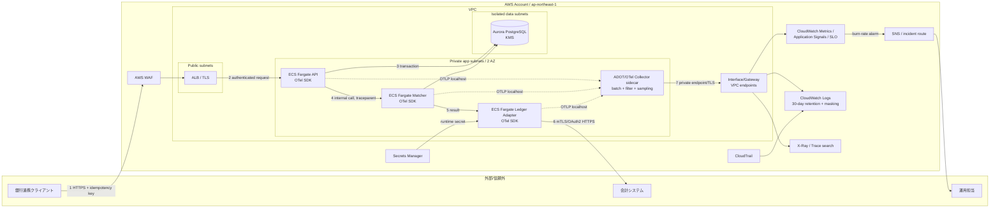

[[Home]]

# Weekly Cloud Engineer Magazine — 2026-08-21

> 今週は「監視ツールを置く」話ではない。**入金消込APIで、1件の取引をログ・メトリクス・トレースから再構成し、SLO違反を顧客影響へ結び付ける**ことに絞る。

# 1. テーマ、前提、到達点

- **アプリ:** 銀行振込の入金消込API。銀行明細を受け取り、請求番号と照合し、結果を会計システムへ通知する。人手確認キューも持つ。
- **主実装クラウド:** AWS、東京リージョン、Amazon ECS on AWS Fargate。
- **主評価軸:** **Observability（可観測性）**。OpenTelemetry（OTel）で vendor-neutral に計装し、CloudWatch Application Signals / Logs / X-Ray で運用する。
- **難易度シグナル:** **Intermediate**。参加資格ではなく、必要な抽象概念の目安。
- **所要時間:** 150分（Foundation 25分 → Practical 85分 → Production 25分 → Challenge 15分）。

## 必要知識・ツール・環境・先行概念

**知識:** HTTP、JSON、コンテナ、IAMロール、VPC、構造化ログ、RED（Rate/Errors/Duration）、SLI/SLO。先に「相関ID」「パーセンタイル」「エラーバジェット」を説明できること。分散トレーシング経験は不要。

**ツール:** Git、Docker Engine/Compose、curl、任意のエディタ、Python 3.12。任意で AWS CLI v2、AWS SAM/CloudFormation。`jq` があると検証が楽。

**環境:** 基本ラボはローカル完結し、実認証情報は不要。任意のAWS展開は個人検証アカウントと専用IAMロールを使う。サンプル値のみを使い、実在の口座番号・顧客名・認証情報を投入しない。

## 測定可能な到達目標

終了時に次を実証する。

1. 同じ `trace_id` / `reconciliation_id` でAPI、照合処理、外部会計呼び出しを追跡できる。
2. `POST /reconciliations` の成功率99.9%、p95 800ms以下というSLIを計算できる。
3. 30日99.9%の許容失敗が全リクエストの0.1%、時間換算の参考値が約43.2分であると説明できる（ただし本設計はリクエストベース）。
4. 外部会計の遅延注入後、トレースから責任区間を10分以内に特定できる。
5. 高カーディナリティ属性と機密情報をメトリクス/ログへ出さず、テレメトリ量を予算内へ抑える。

# 2. 要件と明示的仮定

## 機能要件

- `POST /reconciliations` は銀行明細ID、金額、通貨、請求参照を受け、重複を排除する。
- 完全一致なら `matched`、候補複数なら `review_required`、不一致なら `unmatched`。
- 結果を会計システムへ送信し、失敗は再試行する。監査用の状態遷移を保存する。
- オペレータはIDで処理履歴を検索できる。ただし可観測性基盤を業務データの正本にしない。

## 非機能要件・負荷見積もり

|項目|仮定|
|---|---|
|月間件数|3,000,000件|
|平均/ピーク|1.2 req/s、給与日ピーク120 req/sを15分|
|応答サイズ|平均2KB、入力平均3KB|
|サービス構成|API、Matcher、Ledger Adapterの3論理サービス|
|耐久性|業務記録はAurora PostgreSQL、テレメトリ欠落でも取引を失わない|
|保持|アプリログ30日、監査記録7年、トレース30日相当を方針化（サービス仕様を展開時に確認）|

## SLO / RTO / RPO

- **可用性SLI:** 有効なリクエストのうち、5xxでも期限超過でもない割合。4xx入力不備は分母から除外し、429は含める。
- **SLO:** ローリング30日で99.9%。3,000,000件なら許容 bad event は **3,000件**。
- **レイテンシSLI/SLO:** 99%が2秒以内、p95が800ms以下。受付済み非同期処理は別SLIに分ける。
- **鮮度SLO:** 受付から会計反映まで99%が5分以内。
- **RTO:** 60分。**RPO:** 5分。観測系障害は取引処理を止めず、ローカルバッファ上限超過時はテレメトリを優先度順に落とす。

## コンプライアンス・予算

- PCI DSS対象カード情報は扱わない。個人情報保護法、会計監査、社内データ分類を想定。
- 口座番号、氏名、請求書本文はログ/スパン禁止。取引IDはランダム化ID、金額はメトリクス属性にしない。
- 本番総額の予算上限を月 **US$1,500**、観測系をその15%以内（**US$225/月**）と仮定。税、為替、サポート、インターネット転送は別。

# 3. ADR-034 — OTelを計装境界、CloudWatchを運用面にする

## 検討した選択肢

|案|利点|欠点|
|---|---|---|
|A. OTel SDK + Collector/ADOT + CloudWatch（採用）|文脈伝播が標準化、AWS統合が深い、exporter差し替え余地|Collector運用、AWS側の属性・料金モデルを理解する必要|
|B. CloudWatch/X-Ray固有SDKへ直接送信|最短でAWS機能を使える|計装コードの移植性が低い。SDK移行負債|
|C. ログだけを集約|安価で単純に見える|依存サービスの責任区間、p95、因果関係を復元しにくい|
|D. 外部SaaSへ全量送信|横断分析とUIが強い場合がある|データ越境、二重転送、予算、契約・出口コスト|

## 決定

アプリは W3C Trace Context と OTel API/SDKに依存し、OTLPで同一タスク内のCollector sidecarへ送る。Collectorはバッチ、メモリ制限、属性削除、tail/head sampling方針を適用し、AWSへ送る。CloudWatch Application Signalsでサービス/操作のgolden signalsとSLO、CloudWatch Logsで構造化ログ、X-Ray/Transaction Searchでトレースを調査する。

AWS公式はADOT SDK + CloudWatch Agentを最も統合された構成として案内し、通常のOTel SDK/Collectorも選択肢としている。新規コードをX-Ray固有SDKへ固定しない。**移植可能なのは計装とOTLPまで**で、SLO、ダッシュボード、クエリ、IAM、保持方針は移植作業が残る。

## トレードオフと却下理由

- 100%のメトリクス、100%のエラー/高遅延トレース、通常成功トレース5%を狙う。サンプリング前に必須集計をメトリクス化する。
- `customer_id`、`invoice_id`、`trace_id` をメトリクスdimensionにしない。時系列爆発を避ける。これらは必要最小限のログ/トレース属性だけに置く。
- テレメトリ配送失敗で取引APIを失敗させない。Observabilityは制御系ではなく診断系。
- ログだけ案は「何が起きたか」は見えてもサービス間遅延の因果を安定して示せないため却下。

# 4. 詳細アーキテクチャとデータフロー



## リクエスト/データフロー

1. WAF/ALBで外部境界を越え、ALBがTLSを終端する。銀行ごとの認証とレート制御を適用。
2. APIが受信時に `reconciliation_id` を払い出し、受領した `traceparent` は信頼せず形式検証・必要に応じ再生成する。
3. Auroraの一意制約で冪等性を担保。ログの重複排除で業務整合性を担保しない。
4. 内部HTTPへトレース文脈を伝播し、`service.name`、`deployment.environment`、`cloud.region` をresource属性にする。
5. MatcherのDB spanと照合判定spanを子として記録。SQL本文、口座、金額は記録しない。
6. Ledger Adapterは外部呼び出しをspan化し、HTTP status、再試行回数、相手先の論理名だけ付与。
7. JSONログに `trace_id` / `span_id` を埋め、メトリクス→代表trace→関連logの順にドリルダウンする。

# 5. 信頼境界・セキュリティ・テレメトリ設計

## IAMと信頼境界

- 人間はIAM Identity Center経由。閲覧者はCloudWatch read-only相当、SLO/Alarm変更者、ログ機密解除者を分離する。
- **Task execution role** はECR pull、CloudWatch Logs送信、必要なsecret注入に限定。**Task role** はアプリが使うAurora認証/Secrets Managerの特定ARN、OTel送信に限定する。`Resource: "*"` はサービス上不可避なAPI以外禁止。
- ECSの公式ドキュメントどおりexecution roleとtask roleを混同しない。Fargateタスクはタスク単位の分離境界を持つが、コンテナ自体をIAM境界とはみなさない。
- Collector設定をアプリが書き換えられない読み取り専用イメージに含め、改ざん耐性と変更レビューを持たせる。

## 暗号化・ネットワーク・Secrets

- 外部/内部通信はTLS 1.2+。ALB、Aurora、Logs、Secrets Managerに顧客管理KMSキーを検討し、キー管理者とデータ管理者を分離。
- Fargateはprivate subnet、public IPなし。SGはALB→API、サービス間の必要port、アプリ→DBのみ。egressもLedger、DNS、必要AWS endpointsへ制限。
- ECR、CloudWatch Logs/Monitoring、X-Ray、Secrets Manager等のVPC endpointを可用範囲で使い、NAT依存と露出を減らす。Fargate 1.4以降はtask ENIの通信をVPC Flow Logsで観測可能。
- Secretsはイメージ・環境ファイル・ログに置かない。短期認証を優先し、Secrets Managerの特定version/stageへ権限を絞る。

## Logs / Metrics / Traces

**ログ:** JSONで `timestamp,severity,service,event,trace_id,span_id,reconciliation_id,outcome,error.type`。メッセージ自由文を検索キーにしない。30日retentionを明示（CloudWatch Logsは既定で無期限なので設定必須）。data protection policyで機密パターンを監査/マスクし、削除保護を本番ログに検討する。

**メトリクス:** `request_count`, `request_errors`, `request_duration`, `reconciliation_lag`, `review_queue_depth`, `ledger_retry_count`, `otelcol_exporter_send_failed_*`。属性は `service,operation,outcome,environment` 程度。金額・取引ID・顧客IDは禁止。

**トレース:** 通常成功5%、エラー/2秒超/再試行あり100%を目標。サンプリング意思決定を一箇所に寄せ、親ベースを守る。Collector自身のqueue size、dropped spans、export failuresも監視する。観測パイプラインが沈黙する「暗い障害」にheartbeat/canaryを置く。

**アラート:** ページは症状ベース。30日99.9%に対し、短窓5分/長窓1時間など複数窓のburn rateを採用する。CPU単独はticket/診断材料に留める。アラートにはダッシュボード、Logs Insightsクエリ、runbook、担当を添付。

# 6. 容量・コストモデル

> **以下は設計用見積もり。2026-08-21閲覧の公式料金ページを基準にするが、リージョン、ログクラス、無料枠、契約割引、税で変わる。展開直前に東京リージョンをAWS Pricing Calculatorで再計算すること。**

## テレメトリ容量の仮定

- 3,000,000 request/月 × 3サービス = 9,000,000 service operations。
- 1 operationあたりログ4件 × 0.8KB = **28.8GB/月**。ALB/WAF/監査を40%加算し約**40GB/月 ingest**。
- 1 operationあたりspan 4個、平均1KB、通常成功5% + 異常0.5%全量。概算 `9M × 4 × 1KB × 5.5% ≈ 1.98GB/月`。
- OTel metricは約80 series、60秒粒度。`80 × 43,800 = 3.504M samples/月`。取引IDをdimension化すると数百万seriesへ爆発するため禁止。
- 1日ピーク120 req/s × 3 operations × 4 logs × 0.8KB ≈ **1.15MB/s**。Collectorは最低2倍の瞬間量、60秒bufferを想定し、メモリ制限とqueueを負荷試験で決める。

## 月額の概算

|項目|仮定|概算|
|---|---|---:|
|CloudWatch Logs ingest/storage/query|40GB ingest、30日保持、Insights scan 100GB/月|**US$25–45**|
|OTel metrics|2GB/月相当と仮定。公式掲載のOTel metrics $0.50/GBを参考|**約US$1**|
|X-Ray traces|約1.98M recorded。公式例の100k free、$0.000005/traceを単純適用|**約US$9.40** + scan/retrieve|
|Application Signals/SLO|signals/ingest方式・無料試用状態に依存|**US$10–80**（要Calculator確認）|
|ダッシュボード/Alarm/SNS|10 alarm、2 dashboard、少量通知|**US$5–15**|
|観測系合計|上記 + 30%余裕|**US$66–196/月（見積り）**|

この幅は予算US$225以内だが、Application Signalsの課金モード、ログ単価、リージョン差を確定していないため承認額ではない。CloudWatch公式料金は前払い/最低料金なし、利用量課金、リージョン差あり。無料枠は恒久的な原価設計に含めない。主要コストレバーはログbytes、保持、Insights scan範囲、trace sampling、属性cardinalityである。

**ガードレール:** Logs Insightsは時間範囲とlog groupを狭める。debugログはサンプリング/期限付き。日次ingestと予算に50/80/100%通知。コスト削減のためエラー情報を捨てず、まず冗長な成功ログと高cardinalityを落とす。

# 7. 150分ガイドラボ

## ⚠️ 料金・破壊操作の警告

ローカル手順は通常クラウド料金なし。任意AWS手順でECS/Fargate、NAT Gateway、ALB、CloudWatch、X-Ray、KMS等を作ると課金される。**作成前に専用sandbox account、Budget、リージョン、削除対象を確認する。cleanupはリソースを削除し履歴を失う破壊操作なので、対象stack名と必要な証跡exportを確認してから実行する。** 本誌は実認証情報を要求しない。

## 0–25分 — Foundation

1. 紙またはMarkdownに3つのユーザージャーニーを書く: 受付、照合、会計反映。
2. 各journeyのSLIを `good / valid total` として定義。400を除外、429/5xx/timeoutをbadと決める。
3. `3,000,000 × 0.001 = 3,000 bad events` を計算し、アラートとSLOを区別する。

**Checkpoint A:** 「CPU 90%」でなく「受付成功率が燃えている」をページ条件にできる。

## 25–60分 — ローカル計装

最小構成は `api`、`matcher`、`ledger-stub`、`otel-collector`。OTel SDKでHTTP自動計装し、業務span `reconcile.match` を追加する。次の属性契約を作る。

```text
resource: service.name, service.version, deployment.environment
span: reconciliation.outcome, retry.count
log: trace_id, span_id, reconciliation_id, event, severity
禁止: bank_account, customer_name, invoice_body, amount as metric label
```

Collector pipelineの要点:

```yaml
receivers:
  otlp:
    protocols: {grpc: {}, http: {}}
processors:
  memory_limiter: {check_interval: 1s, limit_mib: 256}
  attributes/redact:
    actions:
      - {key: bank_account, action: delete}
      - {key: customer_name, action: delete}
  batch: {send_batch_size: 512, timeout: 5s}
exporters:
  debug: {verbosity: basic}   # ローカルだけ。秘密を含めない
service:
  pipelines:
    traces:
      receivers: [otlp]
      processors: [memory_limiter, attributes/redact, batch]
      exporters: [debug]
```

`docker compose up --build` 後、ダミー入力を10件送る。期待結果は各リクエストにroot span、matcher/ledger子span、同じtrace ID付きJSONログが出ること。

**検証:** `curl`レスポンスのIDをログ検索し、1件の経路を再構成する。Collector出力に禁止属性がないことを確認。

## 60–90分 — SLIとダッシュボード設計

1. 20件成功、1件400、1件500、1件ledger 3秒遅延を注入。
2. valid totalは22（400除外）、goodは20ならavailabilityは90.91%。
3. ダッシュボードを上から、SLO/burn → Rate/Error/Duration → dependency → saturation → deploy markerの順に設計。
4. runbook linkとownerを各alarmへ付ける。

**Checkpoint B:** 500のtraceからLedger Adapterの3秒spanへ移り、関連ログをtrace IDで引ける。メトリクスに取引IDがない。

## 90–110分 — AWSへの設計変換（任意・作成しなくてよい）

- ECS task definitionにアプリとCollector sidecarを置き、localhost OTLPのみ許可。
- execution roleとtask roleの最小権限policyを別々に書く。
- log groupを先に作り、30日保持、KMS、data protection、削除保護を定義。
- private subnet、SG、VPC endpoints、ALB health checkを図へ反映。
- Application Signalsのrequest-based SLOを作る変更案をCloudFormation planとしてレビューする。

**Checkpoint C:** plan上のwildcard権限、public IP、無期限ログ、全量traceをレビューで検出できる。

## 110–135分 — Production concerns / 障害注入

Ledger stubへ5秒遅延と10%の503を入れる。短窓burnが上がり、トレースで外部依存が支配的と判定できるか確認。次にCollectorを停止し、APIが処理継続すること、`otelcol_exporter_send_failed_*` またはcanary欠測が別系統で検知される設計を確認する。

**期待結果:** 業務障害と観測系障害を区別し、前者は回路遮断/非同期再試行、後者はbuffer/telemetry縮退へ誘導できる。

## 135–150分 — Optional advanced challenge

tail sampling policyを設計する: `ERROR`、2秒超、`retry.count>0` は100%、その他5%。同じtrace内で一貫したdecisionになることをテストし、head samplingとの差、Collector集中障害、必要メモリを記録する。

## Cleanup

ローカルは `docker compose down --volumes`（volume内データを削除するため内容確認後）。AWSへ展開した場合は、証跡export → stack名/リージョン確認 → CloudFormation stack削除 → 残存ECR image、log group、secret、KMS key、ENI/NAT、alarm、Budgetを棚卸しする。KMS key削除は待機期間を伴うため、安易にscheduleしない。

# 8. 障害シナリオ、DR演習、運用runbook

## シナリオ: 会計側遅延 + 観測Collectorのqueue飽和

給与日、会計APIがp95 8秒・503 15%となる。Ledger Adapterの再試行でタスクが飽和し、span量も増えCollector queueが満杯になる。API受付自体は継続するが、鮮度SLOとtrace完全性が同時に悪化する。

## 15分の判断手順

1. **検知:** availability/latency/freshnessのburn、queue depth、telemetry export failureを確認。アラート時刻と直近deployを記録。
2. **影響判定:** 受付は成功か、会計反映だけ遅いか。件数、開始時刻、銀行/会計依存を特定。顧客影響のないCollector欠落を取引欠落と誤認しない。
3. **切り分け:** 高遅延traceのservice map → Ledger span → 503/timeout log。DB待機、CPU、connection poolとも比較。
4. **緩和:** 会計呼び出しを回路遮断し、永続outboxへ退避。再試行に指数backoff+jitter、同時数上限。通常成功trace率を一時的に下げ、エラーtraceと必須metricsを維持。
5. **復旧:** 会計回復後、古いものからrate-limit付きdrain。重複はidempotency keyで抑止。SLOと業務件数を再照合。
6. **終了条件:** backlog 0、15分継続でburn正常、欠損telemetry範囲を記録、未消込件数が業務台帳と一致。

## DR演習

- 四半期に一度、東京リージョン障害を机上+stagingで演習。Aurora復旧/Global Database等の採用方式に従い大阪側へ切替し、RTO 60分/RPO 5分を計測。
- 観測設定、dashboard、alarm、SLO、Collector configもIaCでDR側へ再現する。データだけ戻って監視がない状態を成功としない。
- 合成transactionを復旧後に流し、受付→照合→会計stubまでtraceが通ることを復旧判定に含める。
- 証跡: 開始/判断/切替/最初の成功/完全復旧時刻、失われた可能性のあるID範囲、エラーバジェット消費。

# 9. AWS / OCI / GCP 対応とロックイン

|責務|AWS（主実装）|OCI|GCP|
|---|---|---|---|
|コンテナ実行|ECS on Fargate|Container Instances / OKE|Cloud Run / GKE|
|標準計装/収集|OTel SDK + ADOT/Collector|OTel SDK + Collector/Management Agent|OTel SDK + Google-built OTel Collector / Ops Agent|
|メトリクス/Alarm|CloudWatch Metrics/Application Signals/Alarms|Monitoring Metrics/Alarms|Cloud Monitoring/Alerting|
|ログ|CloudWatch Logs/Logs Insights|Logging/Logging Analytics|Cloud Logging/Log Analytics|
|トレース/APM|X-Ray / Transaction Search / Application Signals|Application Performance Monitoring Trace Explorer|Cloud Trace / Application Monitoring|
|SLO|CloudWatch SLO|Monitoring query + alarm/APM dashboardで構成|Cloud Monitoring Service Monitoring SLO|
|秘密|Secrets Manager|Vault Secrets|Secret Manager|
|監査|CloudTrail|Audit|Cloud Audit Logs|

**移植しやすい:** OTel API、OTLP、W3C trace context、semantic conventions、アプリ内span、Collector processor、SLIの数学的定義。

**ロックイン:** CloudWatch Logs Insightsのクエリ、Application Signalsのservice discovery/SLO resource、IAM policy、dashboard JSON、X-Ray属性制約、料金最適化、retention/マスキング設定。OCI APMはOTel spanを受け、Trace Explorerを提供する。GCP Ops AgentはログにFluent Bit、metrics/tracesにOTel Collectorを用いるが、実行基盤によって推奨collectorが異なる。

**選択判断:** 単なるサービス名対応で「移植可能」としない。移植演習では同一OTLP fixtureを3環境へ送り、(a)属性保持、(b)検索、(c)SLO計算、(d)機密マスク、(e)1GB/100万trace当たり費用を比較する。AWS統合を深く使うほどMTTRは短縮し得るが、運用定義の移植費が上がる。

# 10. Well-Architected式レビューと本番準備

## Operational Excellence

- [ ] SLIの分母/除外条件、owner、runbook、変更履歴がある
- [ ] deploy markerと構成変更をtrace/logへ関連付ける
- [ ] alarmを四半期ごとにゲームデイで発火確認する
- [ ] Collector自身を別経路canaryで監視する

## Security

- [ ] task/execution roleを分離し、特定resourceへ最小権限
- [ ] 口座、氏名、本文、tokenがログ/span/metricにない
- [ ] TLS、KMS、secret rotation、ログ閲覧監査を有効化
- [ ] private subnet、egress制限、VPC endpointを評価

## Reliability

- [ ] telemetry障害で取引を失敗させない
- [ ] outbox/idempotency/circuit breaker/backoffを試験
- [ ] SLO burn-rate alarmは短窓と長窓を持つ
- [ ] RTO/RPOをDR演習の計測値で裏付ける

## Performance Efficiency

- [ ] p50/p95/p99を分け、平均値だけを見ない
- [ ] peak 120 req/sの2倍でCollector queueとapp poolを負荷試験
- [ ] 高cardinality検出をCI/運用に入れる

## Cost Optimization

- [ ] retention、sampling、log level、query scan量にownerがいる
- [ ] 日次ingest異常と月次予算を通知
- [ ] 無料枠を定常予算へ織り込まない
- [ ] 東京リージョン単価を展開日にCalculatorで再確認

## Sustainability / Portability

- [ ] 不要なdebug telemetryを停止
- [ ] OTel schema/versionを固定し、exporter差し替え試験を持つ
- [ ] provider固有dashboard/SLOをIaC化し、再構築時間を測る

# 11. 成果物

1. 1ページのSLI/SLO仕様（分母、good/bad、除外、窓、owner）。
2. Mermaid構成図とtrust-boundary/data-flow注釈。
3. OTel属性契約と禁止データ一覧。
4. Collector設定、サンプリング方針、容量計算sheet。
5. ECS task/execution IAM最小権限案と脅威レビュー。
6. RED + business freshness dashboard wireframe。
7. multi-window burn-rate alarm仕様とrunbook。
8. 障害注入/DR演習記録（時刻、影響、判断、RTO/RPO、改善）。
9. 月次観測費の実績対見積りとcardinality上位レビュー。

# 12. 理解度チェック

### Q1. なぜ `reconciliation_id` をメトリクスdimensionにしてはいけないか。

<details><summary>答え</summary>
取引ごとに新しい時系列ができcardinalityと課金・クエリ負荷が爆発するため。ID検索は制限されたログ/traceへ置き、集計metricはservice/operation/outcome程度に抑える。
</details>

### Q2. 3,000,000件、99.9% request-based SLOの許容bad eventはいくつか。

<details><summary>答え</summary>
3,000件。時間ベースの43.2分は直感用で、リクエストベースSLOの直接の予算ではない。
</details>

### Q3. Collector停止時にAPIも失敗させるべきか。

<details><summary>答え</summary>
原則いいえ。取引を正本へ保存する経路を優先し、bounded queue/bufferと縮退を使う。ただし監査規制が同期記録を必須とするなら別要件として設計判断する。
</details>

### Q4. エラーtraceを100%残しても、メトリクスを100%集計すべき理由は何か。

<details><summary>答え</summary>
trace sampling後のデータだけでは総リクエスト数と正確なerror rateを失うため。SLO用counter/histogramは全リクエストから集計し、traceは診断サンプルにする。
</details>

### Q5. Task execution roleとTask roleの違いは何か。

<details><summary>答え</summary>
execution roleはECS/Fargate agentがimage pull、ログ送信、secret注入などを行う権限。task roleはコンテナ内アプリがAWS APIを呼ぶ権限。分離して最小権限にする。
</details>

## 設計/面接質問

「通常成功trace 5%、エラー100%という方針でCollectorがピーク時にメモリ不足になる。SLO精度と障害診断力を落とし過ぎず、どの順番で何を削るか。」

評価観点は、メトリクス全量維持、成功trace率、debug log、tail samplingの集中点、queue/backpressure、属性サイズ、観測系のSLO、コストと欠損の明示である。

## Follow-up challenge

同じOTLPテストfixtureをOCI APMとGCP Cloud Trace/Monitoringへ送る設計を作り、属性欠落、trace-log相関、SLO表現、マスキング、月額を比較する。単なるサービス表ではなく「移植に必要な変更行数、手順時間、受け入れテスト」を提出する。

# 13. 現行の公式リファレンス

閲覧・料金確認日: **2026-08-21**。価格は必ず利用リージョンとアカウント条件で再確認する。

## AWS（主実装）

- [CloudWatch Application Signals: supported instrumentation setups](https://docs.aws.amazon.com/AmazonCloudWatch/latest/monitoring/Getting-Started-App-Signals.html)
- [CloudWatch service level objectives](https://docs.aws.amazon.com/AmazonCloudWatch/latest/monitoring/CloudWatch-ServiceLevelObjectives.html)
- [Amazon CloudWatch pricing](https://aws.amazon.com/cloudwatch/pricing/)
- [ECS task IAM role](https://docs.aws.amazon.com/AmazonECS/latest/developerguide/task-iam-roles.html)
- [ECS IAM role best practices](https://docs.aws.amazon.com/AmazonECS/latest/developerguide/security-iam-roles.html)
- [Fargate task networking](https://docs.aws.amazon.com/AmazonECS/latest/developerguide/fargate-task-networking.html)
- [CloudWatch Logs groups, streams, retention](https://docs.aws.amazon.com/AmazonCloudWatch/latest/logs/Working-with-log-groups-and-streams.html)
- [CloudWatch Logs data protection](https://docs.aws.amazon.com/AmazonCloudWatch/latest/logs/data-protection.html)

## OCI（等価性確認）

- [OCI Application Performance Monitoring](https://docs.oracle.com/en-us/iaas/application-performance-monitoring/home.htm)
- [Monitor applications with OCI APM and OpenTelemetry](https://docs.oracle.com/en/learn/oci-apm-with-opentelemetry/index.html)
- [OCI APM Trace Explorer](https://docs.oracle.com/en-us/iaas/application-performance-monitoring/doc/use-trace-explorer.html)
- [OCI Monitoring overview](https://docs.oracle.com/en-us/iaas/Content/Monitoring/Concepts/monitoringoverview.htm)
- [OCI documentation home](https://docs.oracle.com/en-us/iaas/Content/home.htm)

## GCP（等価性確認）

- [Google Cloud Ops Agent overview](https://cloud.google.com/stackdriver/docs/solutions/agents/ops-agent)
- [Google Cloud Observability agents](https://cloud.google.com/stackdriver/docs/solutions/agents)
- [Google Cloud Trace documentation](https://cloud.google.com/trace/docs)
- [Google Cloud Monitoring SLOs](https://cloud.google.com/stackdriver/docs/solutions/slo-monitoring)
- [Google Cloud documentation](https://cloud.google.com/docs)

---

#cloud #aws #oci #gcp #architecture #weekly #deep-dive
