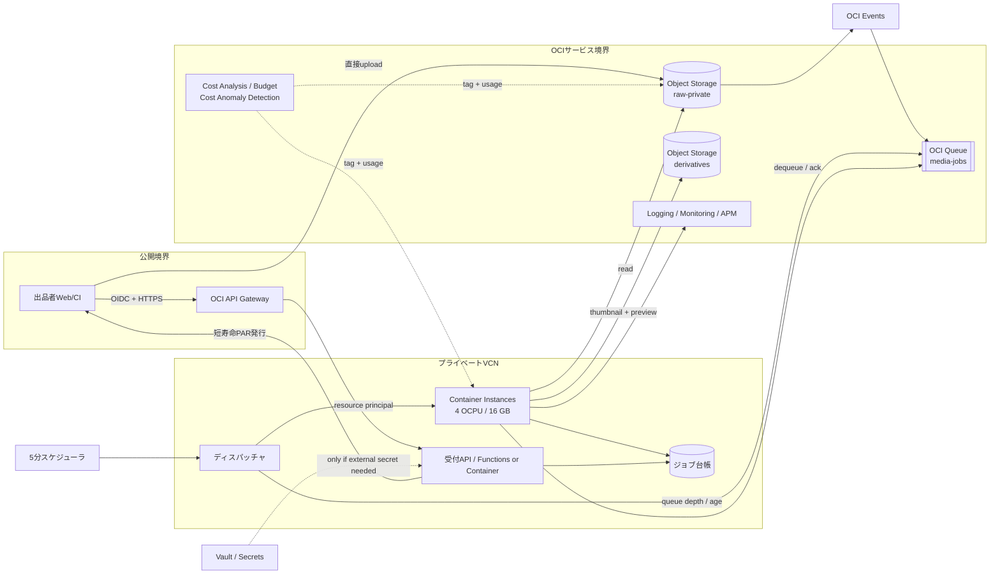

[[Home]]

# Weekly Cloud Engineer Magazine — 2026-08-28

#cloud #aws #oci #gcp #architecture #weekly #deep-dive

> [!warning] 課金・破壊的操作・認証情報
> 標準ラボはローカルDockerで完結する。OCI上でContainer Instances、Object Storage、Container Registry、Queue、Logging、Vault、NAT Gatewayを作ると課金が発生し得る。**作成前に**学習用コンパートメント、予算、リージョン、定義済みタグを確認すること。バケット削除、キュー削除、コンテナ停止・削除は検証環境だけで行う。実動画、個人情報、APIキー、OCIユーザーの長期秘密鍵を使わない。クラウド拡張ではリソース・プリンシパル、短期セッション、最小権限を使う。

> 今週の問いは「どのサービスが一番安いか」ではない。**動画サムネイル生成の単位原価を測り、待機コストと起動オーバーヘッドの損益分岐から実行方式を選べるか**である。

## 1. アプリ、主クラウド、焦点、前提、到達点

- **アプリ:** EC出品者が登録した商品動画から、3種類のサムネイル（1秒、50%、末尾1秒前）と10秒プレビューを生成するメディア処理バッチ。
- **主実装クラウド:** **Oracle Cloud Infrastructure (OCI)**、東京リージョン。Object Storage → Queue → ディスパッチャ → Container Instances上のFFmpegワーカーを中心にする。
- **主評価軸:** **Cost / FinOps**。処理1件当たりのCPU秒・GB秒・保存量を測り、常時稼働、都度起動、時間窓マイクロバッチの損益分岐を決める。
- **難易度シグナル:** **Intermediate**。参加条件ではなく、性能測定と原価配賦を同時に扱う目安。
- **推定ラボ時間:** **150分**（Foundation 25分 → Practical 80分 → Production 30分 → Optional challenge 15分）。

### 必要知識・ツール・環境・先行概念

- **知識:** Docker、FFmpegの入出力、CPU時間と壁時計時間の違い、キューのat-least-once、冪等性、タグによる費用配賦。
- **ツール:** Docker Engine、FFmpeg/ffprobe 6+、Python 3.11+、`curl`、`jq`、`sha256sum`、`time`、表計算ソフト。任意でOCI CLI 3.x、Terraform 1.8+。
- **環境:** 4 vCPU、8 GB RAM、空き5 GB。クラウド拡張は請求先を分離した学習用コンパートメントを使う。
- **先行概念:** 「サーバレス＝必ず安い」ではない。費用は単価だけでなく、実行時間、並列度、起動時間、再試行、待機時間、データ転送で決まる。予算アラートは支出を自動停止するハード上限ではない。

### 測定可能な到達目標

1. `compute_cost / successful_outputs` を1本当たり単位原価として算出し、失敗・再試行分も分子に含める。
2. 20,000本/日、平均90秒、0.6 vCPU分/本という仮定から、日次200 vCPU時間を導出する。
3. 常時8 OCPU/32 GBと、必要時だけ4 OCPU/16 GBを動かす方式の損益分岐を説明する。
4. p95キュー滞留15分以内、完了率99.5%を守りながら、ワーカーの空き時間率を15%未満へ下げる。
5. `Finance.CostCenter`、`Application`、`Environment`タグと業務メトリクスを結び、月次予算超過の原因を追跡できる。

## 2. 要件とワークロード仮定

### 機能要件

1. MP4/MOVを受け付け、`job_id`を返す。
2. 元動画を非公開Object Storageへ置き、3枚のJPEGと10秒MP4を生成する。
3. 同じ`asset_id + source_version + profile_version`の再送は二重生成しない。
4. 状態を`RECEIVED → RUNNING → SUCCEEDED | RETRYABLE | FAILED`で照会できる。
5. 失敗理由と試行回数を保持し、毒メッセージを隔離する。

### 非機能要件・見積条件

|項目|仮定・目標|
|---|---|
|平均/ピーク流入|20,000本/日、通常1,000本/時、最大5,000本/時|
|入力|平均90秒、150 MB/本。日次約3 TB（学習用の仮想値）|
|CPU需要|**見積**0.6 vCPU分/本。20,000 × 0.6 / 60 = 200 vCPU時間/日|
|メモリ|1並列処理当たり2 GB、ワーカー1 OCPU当たり4 GBを割当|
|性能SLO|受領から成果物生成までp95 15分以内、p99 45分以内|
|品質SLO|有効動画の月間生成成功率99.5%以上|
|可用性|受付API月間99.9%。処理基盤は遅延を許容し、キューで吸収|
|RTO|制御面60分、ワーカー再開30分|
|RPO|ジョブ台帳5分、原本0（成功応答前にObject Storageへ永続化）|
|保持|原本30日、成果物180日、ジョブ/監査ログ400日という仮定|
|コンプライアンス|公開前商品素材。個人情報・決済情報なし。権利管理と削除依頼は必要|
|予算枠|処理計算月額US$150、関連サービス込みUS$500。**税・為替別の設計上限**|

SLOの分母から、壊れたファイル形式や上限超過を明示的に拒否した入力は除外する。ただし、プラットフォーム起因のタイムアウト、OOM、再試行枯渇は失敗に含める。

## 3. Architecture Decision Record（ADR-2026-08-28）

### 決定対象

バーストする動画変換を、SLOを守りながら最小の**処理1本当たり計算費**で実行する方式。

### 検討案

|案|利点|費用・運用上の弱点|
|---|---|---|
|A. 8 OCPU/32 GBの常時稼働VM/Container Instance|起動遅延なし、単純、ピーク応答が読みやすい|夜間・閑散時も課金。需要が半分なら空き容量もほぼ半分|
|B. 1メッセージごとにContainer Instanceを作成|待機計算費を抑える、ジョブ隔離|イメージpull/起動時間が毎回乗り、API制限、細粒度ジョブには不利|
|C. 5分窓でまとめ、4 OCPU/16 GBを必要数だけ起動|起動回数を減らしつつ非稼働時課金を止める。単位原価を測りやすい|ディスパッチャ、上限、終了判定、重複処理の設計が必要|
|D. OKE常設クラスタ|高度なスケジューリング、GPUや多様なワーカーへ拡張可能|この規模ではクラスタ運用と常設容量が過剰|
|E. FunctionsでFFmpeg|イベント連携と従量課金が簡潔|実行時間、ローカル容量、イメージ/CPU制約を先に検証すべき。長い動画の中断時コストが読みにくい|

### 決定

**C: Queueの深さを5分ごとに評価し、4 OCPU/16 GBのContainer Instanceをマイクロバッチ単位で作成、空になったら停止する。** 1インスタンス4並列を初期値とし、最大20インスタンス。15分SLOに対し5分の集約待ちは許容範囲で、1ジョブごとの起動よりイメージpullを償却できる。

OCI Container Instancesは、Active/Updating中は課金、Inactive/Failed/Deletedでは課金されない。停止で計算課金を止められる一方、停止済みもサービス制限には数えられるため、日次で不要インスタンスを削除する。

### トレードオフと棄却理由

- 常時稼働案は需要が安定して高く、稼働率が損益分岐を超えたら再評価する。最初から棄却ではなく、測定値で逆転し得る選択肢。
- 1件1インスタンスは平均処理36 vCPU秒に対して起動時間の比率が高い。まず「起動秒/有効処理秒」を測る。
- Spot/Preemptible相当を使う場合、50%割引だけで判断せず、中断による再処理率とSLO違反コストを加える。
- OKEは複数パイプライン、GPU、優先度制御が必要になった段階で再検討する。

## 4. 詳細アーキテクチャとフロー



### リクエスト/データフロー

1. 認証済み利用者がメタデータを登録。APIはサイズ、MIME、テナント上限を検証して5分有効のアップロードURL/PARを返す。
2. クライアントは原本をAPI経由で中継せず、非公開バケットへ直接送る。
3. Object StorageイベントからQueueへ`asset_id`とobject URIだけを渡す。URL、秘密、動画本体をメッセージへ入れない。
4. 5分ごとにディスパッチャが`visible_messages`、最古メッセージ年齢、実測処理率を取得し、必要インスタンス数を計算する。
5. ワーカーはジョブ台帳に条件付きでリースを取り、FFmpegで変換。成果物を一時キーへ書き、チェック後に確定キーを公開する。
6. 成功時のみack。再試行可能エラーは可視性タイムアウト後に再取得、形式不正はFAILED、上限超過はDLQへ移す。
7. インスタンスはキュー空かつ10分アイドルで停止。日次ジョブがInactiveを削除し、制限枯渇を防ぐ。

## 5. IAM、信頼境界、暗号化、ネットワーク、秘密、テレメトリ

### IAMと最小権限

人間の`MediaPlatformOperators`とワークロード動的グループを分離する。概念ポリシーは次の通り。実際のresource-type名と条件は対象テナンシの公式Policy Referenceで検証する。

```text
Allow dynamic-group media-dispatchers to manage compute-container-instances in compartment media-prod
Allow dynamic-group media-workers to read objects in compartment media-prod where target.bucket.name='raw-private'
Allow dynamic-group media-workers to manage objects in compartment media-prod where target.bucket.name='derivatives'
Allow dynamic-group media-workers to use queues in compartment media-prod
Allow dynamic-group media-workers to use log-content in compartment media-prod
Allow group MediaPlatformOperators to read usage-reports in tenancy
Allow group MediaPlatformOperators to inspect compute-container-instances in compartment media-prod
```

- ワーカーにバケット削除、IAM変更、Vault鍵管理を与えない。
- ディスパッチャはコンテナ起動/停止に限定し、原本読み取りを持たない。
- CI/CDはOCIRへのpush権限、実行時はpull権限だけ。イメージはdigest固定。
- タグnamespaceの変更はFinOps管理者だけ。`Finance.CostCenter`をcost-tracking対象にする。

### 信頼境界と暗号化

- 外部→API/Object StorageはTLS。公開入口はAPI Gatewayと短寿命アップロードURLだけ。
- 原本、派生物、キュー、台帳、ログは保存時暗号化。規制要件がなければまずOracle管理鍵、鍵分離・失効要件があればVaultの顧客管理鍵を選ぶ。
- `raw-private`と`derivatives`を分け、生成途中の成果物を配信しない。公開配信は別の明示的なpublish状態を経由する。
- ハッシュは完全性確認であり、認可の代替ではない。

### ネットワークと秘密

- Container Instancesはプライベートサブネット、NSGは不要なingressを全拒否。Service GatewayでObject Storage/OCIRなどへ到達させる。
- 外部レジストリや外部コールバックが不要ならNAT Gatewayを置かない。NATの固定費・転送料を「見えない共通費」にしない。
- OCIサービスへの認証はリソース・プリンシパル。外部SaaS鍵だけVaultで管理し、環境変数やイメージへ焼き込まない。

### ログ・メトリクス・トレース

- **ログ:** `job_id`, `asset_id_hash`, `profile_version`, `attempt`, `exit_code`, `cpu_seconds`, `wall_seconds`, `bytes_in/out`。動画名、PAR、個人情報を出さない。
- **メトリクス:** queue oldest age、success/failure、retries、active workers、CPU/memory utilization、idle ratio、cold-start seconds、`cost_estimate_per_success`。
- **トレース:** 受付、イベント、queue messageへ`traceparent`または相関IDを伝播。非同期区間はspan linkを使う。
- OCI Container Instancesの`oci_computecontainerinstance`メトリクスと業務メトリクスを併用する。インフラCPUだけでは「安く成功したか」は分からない。

## 6. 容量・コストモデル

### 容量計算

**以下は設計用の見積で、実測前の保証値ではない。**

- 平均需要: 20,000本/日 × 0.6 vCPU分 = 12,000 vCPU分 = **200 vCPU時間/日 = 100 OCPU時間/日**（x86では1 OCPU = 2 vCPU）。
- ピーク: 5,000本/時 × 0.6 = 3,000 vCPU分/時 = **50 vCPU平均**。
- 4 OCPU = 8 vCPUのワーカーなら、ピーク追従に `ceil(50/8)=7`台。30%余裕を見て**最大10台**を通常上限、異常時の絶対上限20台とする。
- 1台の理論処理率: 8 vCPU × 60 / 0.6 = 800本/時。実効率70%なら560本/時。
- 10台で5,600本/時。5,000本のピーク1時間分を約54分で処理できるが、5分集約と起動遅延を加えたp95を負荷試験で確認する。

### 現行公開単価を使った比較

2026-08-28確認時点のOracle公式公開例では、`VM.Standard.E4.Flex`は **US$0.032765/OCPU時 + US$0.0019659/GB時**。Container Instancesは対応Compute shapeのOCPU/メモリ単価を使い、x86は1 OCPU=2 vCPU、最小1 OCPU。地域、契約、通貨、無料枠、税で請求は変わるため、展開直前にOCI Cost Estimatorと契約SKUで再確認する。

**方式C（必要時のみ）の月次計算費見積:** 

```text
OCPU: 100 OCPU時/日 × 30 × $0.032765 = $98.30/月
Memory: OCPU:GB = 1:4 とし 400 GB時/日 × 30 × $0.0019659 = $23.59/月
合計 = $121.89/月
```

**方式A（8 OCPU/32 GBを730時間常時稼働）の見積:**

```text
OCPU: 8 × 730 × $0.032765 = $191.35/月
Memory: 32 × 730 × $0.0019659 = $45.92/月
合計 = $237.27/月
```

この単純モデルの損益分岐稼働率は `$121.89 / $237.27 = 51.4%`。ただし方式Cには起動中の課金、失敗再処理、ディスパッチャ、ログ等が追加される。仮に15%のオーバーヘッドなら約$140.17で、常時稼働に対して約41%低い。

**1成功当たり計算費:** `$140.17 / (20,000 × 30 × 99.5%) ≒ $0.000235/成功`。原本/成果物のObject Storage、requests、Queue、Logging、データ転送、API、台帳、サポート、税は**除外**。特に日次3 TBの原本保存費は計算費より支配的になり得るため、別のストレージ原価表で保持日数と削除率を掛ける。

### FinOpsガードレール

1. 必須定義済みタグ: `Finance.CostCenter=Commerce`, `Application=media-derivative`, `Environment=prod`, `Owner=team-media`。
2. 月次予算US$500、実績50/80/100%、予測80/100%で通知。**Budgetsはsoft limitで、24時間周期評価のためリアルタイム停止装置ではない。**
3. Cost Anomaly Detectionをcompartment + service + tagで監視。日次差額US$20かつ50%超を入口にする。
4. 自動停止は予算通知ではなく、`max_workers=20`、ジョブ/テナント上限、1日処理量上限で実装する。
5. 毎週、単位原価、空き時間率、再試行率、タグ欠落率、SLOを同じレビュー画面に載せる。コストだけ下げてSLOを壊さない。

## 7. 150分ガイドラボ

標準ラボはクラウド資源を作らない。サンプル動画はFFmpegのテストパターンから生成し、実素材や認証情報を使わない。

### Foundation（0–25分）— 原価式を固定する

1. 作業ディレクトリを作り、`input/ output/ metrics/`を用意する。
2. 30秒のテスト動画を生成する。

```bash
ffmpeg -f lavfi -i testsrc2=size=1280x720:rate=30 -f lavfi \
  -i sine=frequency=1000 -t 30 -c:v libx264 -preset veryfast \
  -c:a aac input/sample.mp4
```

3. 原価式を`unit-cost.md`へ記す。

```text
cost_per_success = (compute + storage + request + network + observability + retry) / successful_outputs
```

**Checkpoint A:** `ffprobe`で30秒前後、1280×720を確認。分子に失敗/再試行費を含め、分母は成功成果物数であると説明できる。

### Practical implementation（25–105分）— 測定可能なワーカーを作る

次の責務を持つ小さなシェルまたはPythonワーカーを実装する。

1. 入力のSHA-256とprofile versionからidempotency keyを作る。
2. 出力がすべて存在しmanifestが一致すれば`SKIPPED`にする。
3. `ffprobe`で長さを取得し、1秒、50%、末尾1秒前のJPEGと10秒プレビューを一時名へ生成。
4. 出力を検証後、確定名へatomic rename。
5. `/usr/bin/time -v`またはPythonの`resource`でuser/system CPU秒、wall秒、最大RSSをJSON Linesへ出す。

例の変換核:

```bash
ffmpeg -y -ss 1 -i input/sample.mp4 -frames:v 1 -q:v 3 output/thumb-01.tmp.jpg
ffmpeg -y -ss 15 -i input/sample.mp4 -frames:v 1 -q:v 3 output/thumb-50.tmp.jpg
ffmpeg -y -ss 29 -i input/sample.mp4 -frames:v 1 -q:v 3 output/thumb-end.tmp.jpg
ffmpeg -y -i input/sample.mp4 -t 10 -vf scale=-2:360 \
  -c:v libx264 -preset veryfast -an output/preview.tmp.mp4
```

6. 1、2、4並列で各5回実行し、次を表にする。

|並列|wall p50/p95|CPU秒/成功|max RSS|失敗率|推定$/成功|
|---:|---:|---:|---:|---:|---:|
|1||||||
|2||||||
|4||||||

7. OCI単価は変数として渡し、ハードコードしない。

```text
estimated_compute_cost = ocpu_hours * OCPU_RATE + gb_hours * MEMORY_RATE
```

**Checkpoint B:** 同じ入力を2回実行して2回目が`SKIPPED`、成果物ハッシュが不変。測定JSONに`job_id`, `cpu_seconds`, `wall_seconds`, `max_rss_kb`, `status`がある。

**Checkpoint C:** 並列度を上げたとき、wall時間だけでなくCPU飽和、メモリ、失敗率を比較し、最安の安全な並列度を選べる。

### Production concerns（105–135分）— 容量とガードレール

1. CSVで24時間の流入（通常1,000/h、ピーク5,000/h）を作る。
2. 実測`jobs_per_worker_hour`、起動5分、5分集約、最大10台でqueue backlogをシミュレートする。
3. `oldest_age > 10分`で増強、`queue=0 and idle>10分`で停止、`max_workers=20`を適用する。
4. 通常、2倍遅延、5%再試行の3ケースでp95滞留と費用を比較する。
5. 月次US$500の50/80/100%通知、予測80/100%、タグ欠落アラートを設計シートへ記す。

**Checkpoint D:** 3ケースすべてで費用・SLO・最大worker数が出力され、SLO違反時に「無制限スケール」ではなく運用判断へエスカレーションする。

### Optional advanced challenge（135–150分）

Arm A1用`linux/arm64`イメージをビルドし、x86 E4と同じ出力品質でCPU秒、wall秒、$/成功を比較する。コーデック対応と画質を固定し、無料枠込みの値と無料枠なしの経済性を分けて報告する。

### 任意のOCI展開とクリーンアップ

> [!danger] ここからは課金・状態変更を伴う
> Console/CLIでリソースを作る前に、対象tenancy、compartment、region、予算、タグを確認する。サンプルOCIDや`${...}`を実値に置き換える際も、実資格情報をファイルへ書かない。

検証順は、専用compartment → budget/tag → private VCN/Service Gateway → private buckets/queue → OCIR image → 1台だけContainer Instance → メトリクス確認 → 上限付きdispatcher。いきなりオートスケールを有効にしない。

クリーンアップは、dispatcher停止 → queue drain確認 → CI停止/削除 → test objects/buckets削除 → queue削除 → OCIR不要image削除 → VCN関連削除 → Cost Analysisで翌日再確認。監査要件があるログと成果物を誤って消さない。

## 8. 障害、復旧/DR演習、運用ランブック

### 障害シナリオ: 壊れた巨大動画による再試行嵐

特定ファイルでFFmpegが長時間CPUを消費してexit 1。可視性タイムアウト後に再取得され、workerが上限まで増え、費用だけ増える。

### 注入と期待結果

1. 破損サンプルまたは`FAIL_MODE=timeout`を10%投入。
2. 最大実行時間を通常p99の2倍に設定し、超過時にprocess groupを終了。
3. `asset_id + profile_version`ごとの試行を3回に制限。
4. 3回失敗でDLQ/FAILED、原因コードを記録。自動再投入しない。
5. `retry_cost_ratio > 10%`または`oldest_age > 10分`で警報。

期待結果は、workerが20台を超えず、毒メッセージが隔離され、正常ジョブが進み、費用増分を`retry_compute_cost`として可視化できること。

### 運用ランブック

1. **検知:** queue最古年齢、失敗率、active workers、推定日次費用、OCIサービス状態を確認。
2. **封じ込め:** dispatcherの上限を固定。問題profile versionの受付を停止し、正常profileは継続。
3. **診断:** 同じinput hash、exit code、image digest、profile version、直近変更を相関。ログに原本名/PARを出さない。
4. **復旧:** 修正版imageをdigest固定で1 workerへcanary。隔離ジョブを少量再投入し、成功率と単位原価を確認。
5. **再開:** 25%→50%→100%で上限を戻す。backlog消化見込みと予算残を承認者へ提示。
6. **終了条件:** p95滞留15分未満を30分維持、失敗率0.5%未満、retry cost ratio 10%未満。
7. **事後:** 実測RTO/RPO、無駄なOCPU時間、追加費用、再発防止owner/期限を記録。

### DR演習

Object Storageの原本とジョブ台帳を正とし、別リージョンの空の実行基盤から再構築する机上/サンドボックス演習を行う。RPO 5分を台帳バックアップ/レプリケーション、RTO 60分をIaC展開、イメージ取得、queue再構成、canaryで計測する。二重実行を避けるため、旧リージョンのdispatcher停止確認とgeneration fenceを設ける。クロスリージョン複製・転送費は通常月とDR月で別計上する。

## 9. AWS / OCI / GCP対応とポータビリティ

|役割|OCI（主実装）|AWS|GCP|
|---|---|---|---|
|原本/成果物|Object Storage|Amazon S3|Cloud Storage|
|イベント|OCI Events|Amazon EventBridge / S3 Event Notifications|Eventarc|
|キュー|OCI Queue|Amazon SQS|Pub/Sub / Cloud Tasks|
|コンテナバッチ|Container Instances|AWS Batch on Fargate/EC2、ECS RunTask|Cloud Run Jobs、Batch|
|イメージ|OCI Container Registry|Amazon ECR|Artifact Registry|
|秘密/鍵|Vault|Secrets Manager / KMS|Secret Manager / Cloud KMS|
|監視|Logging / Monitoring / APM|CloudWatch / X-Ray|Cloud Logging / Monitoring / Trace|
|原価配賦|Defined cost-tracking tags、Cost Analysis|Cost allocation tags、CUR|Labels/tags、Cloud Billing export|
|予算・異常|Budgets、Cost Anomaly Detection|AWS Budgets、Cost Anomaly Detection|Cloud Billing budgets、FinOps hub/anomaly機能|

### トレードオフ

- **OCI:** Container InstancesはVM相当の隔離と柔軟shape、停止時の計算課金停止が分かりやすい。一方、停止済みもサービス制限に数えるため、作り捨てには削除運用が必要。
- **AWS:** AWS Batchはqueue、compute environment、retry、schedulingをまとめやすく、Fargate/EC2/Spotの選択肢が広い。タグは作成時適用とBilling側でのcost allocation有効化を区別する。
- **GCP:** Cloud Run Jobsはコンテナバッチを簡潔に実行できるが、Jobsはinstance-based billing。100ms課金粒度やリージョン単価、並列taskの再試行をモデルへ入れる。

### ポータビリティ/ロックイン

FFmpegイメージ、job manifest、idempotency key、OpenTelemetry、原価式をクラウド非依存にする。ロックインが強いのはイベント形式、IAM policy language、queue可視性/ack、autoscale API、billing export schema。内部の`JobEnvelope v1`へ変換し、クラウドSDK呼び出しをadapterへ隔離する。ただし「いつでも移れる」ために三重実装はしない。移行条件を`単位原価20%以上改善かつSLO同等`のように明文化する。

## 10. Well-Architected型レビューと本番チェックリスト

### 運用上の卓越性

- [ ] IaCでcompartment、network、queue、bucket、CI template、alarmsを再現できる
- [ ] image digestとprofile versionから出力を追跡できる
- [ ] 単位原価、SLO、変更履歴を週次レビューするownerがいる
- [ ] runbookを四半期ごとに実行している

### セキュリティ

- [ ] 公開bucketがなく、短寿命URL/PARだけを使う
- [ ] workloadはresource principal、CI/CDは短期認証である
- [ ] dispatcher、worker、operator、FinOpsの権限が分離される
- [ ] ログへ動画名、URL、token、秘密を出さない

### 信頼性

- [ ] idempotency、visibility timeout、最大試行、DLQがテスト済み
- [ ] max workersとテナント別quotaで暴走を止める
- [ ] 原本から派生物を再生成できる
- [ ] RTO/RPOは構成値でなく訓練実測値を記録する

### 性能効率

- [ ] 1/2/4並列でCPU、RSS、wall、品質を比較した
- [ ] queue最古年齢から必要worker数を計算する
- [ ] image pull/cold startを処理時間と分離して測る
- [ ] Arm/x86やcodec変更は同一品質条件で比較する

### コスト最適化

- [ ] `$/success`に失敗・再試行・待機を含める
- [ ] 必須定義済みタグの欠落をデプロイ時に拒否する
- [ ] 予算、予測、異常検知、worker絶対上限を併用する
- [ ] Object Storage保持・request・egress・logsを計算費と別表で追う
- [ ] 無料枠込み/なし、契約割引前/後を混ぜない

### 本番移行ゲート

- [ ] 2倍ピークでp95 15分、成功99.5%を満たす
- [ ] 毒メッセージで正常処理と費用上限が保たれる
- [ ] 30日予測がUS$500以内、または例外承認済み
- [ ] Cost AnalysisでApplication/Environment/CostCenter別に100%配賦できる
- [ ] cleanup、保持、legal holdの優先順位が承認済み

## 11. 具体的な成果物

1. `ADR-2026-08-28-container-batch-cost.md`
2. Mermaidアーキテクチャと信頼境界図
3. 冪等なFFmpegワーカーとmulti-arch Dockerfile
4. 1/2/4並列ベンチマークCSV/JSONL
5. 24時間queue/costシミュレータと3シナリオ結果
6. OCI単価を外部入力にした月次コストシート
7. IAMポリシー案、定義済みタグ辞書、予算/異常検知設計
8. 再試行嵐runbookとDR訓練記録テンプレート
9. Production-readiness checklistの記入済み版

## 12. 理解度チェック

### Q1. 20,000本/日、0.6 vCPU分/本なら日次CPU需要は？

<details><summary>回答</summary>

12,000 vCPU分、つまり200 vCPU時間。x86のOCI表記で1 OCPU=2 vCPUなら100 OCPU時間/日。ただし実請求は割当資源の稼働時間であり、この理論CPU時間と一致するとは限らない。

</details>

### Q2. なぜ`$/job`より`$/successful_output`がよいか？

<details><summary>回答</summary>

失敗、タイムアウト、再試行、空成果物を安い成功に見せないため。分子には失敗分を含め、分母を利用可能な成功成果物に限定すると品質と費用を同じ指標で扱える。

</details>

### Q3. 予算アラートをworker停止装置として扱えない理由は？

<details><summary>回答</summary>

OCI Budgetsはsoft limitで、評価も即時ではない。通知遅延や見積誤差があるため、暴走防止にはmax workers、処理量quota、timeout、retry上限を実行系に持たせる。

</details>

### Q4. 5分マイクロバッチが1件1CIより安くなり得る理由は？

<details><summary>回答</summary>

複数ジョブでイメージpull、起動、初期化時間を償却できるから。一方で5分の待ち時間がSLOへ加算されるため、キュー最古年齢と起動時間を含めて判断する。

</details>

### Q5. タグだけで完全な単位原価を得られないのはなぜ？

<details><summary>回答</summary>

タグはクラウド費用をアプリ等へ配賦するが、成功数、再試行、動画時間、profileなどの業務量を持たない。Billing/Cost Analysisと業務メトリクスを同じ期間・次元で結合する必要がある。

</details>

### 設計・面接問題

需要が3か月連続で増え、4 OCPU/16 GBワーカー群の実効稼働率が70%、p95滞留8分、月次計算費US$260になった。常時稼働、より大きいshape、OKE、別クラウドへの移行のどれを選ぶか。必要な追加データ、比較式、移行しない判断も含めて説明せよ。

### フォローアップ課題

実測CSVから、`max_workers`とマイクロバッチ窓を総当たりし、`p95 <= 15分`かつ`成功率 >= 99.5%`を満たす中で月次費用最小の組合せを選ぶ。需要±50%、処理速度±30%、再試行率1–10%の感度分析を添える。

## 13. 公式リファレンス（2026-08-28確認）

### OCI（主実装）

- [OCI Container Instances overview](https://docs.oracle.com/en-us/iaas/Content/container-instances/overview-of-container-instances.htm) — 対象workload、IAM、状態別課金
- [Container Instance shapes](https://docs.oracle.com/en-us/iaas/Content/container-instances/container-instance-shapes.htm) — OCPU/メモリ、柔軟shape
- [Creating a Container Instance](https://docs.oracle.com/en-us/iaas/Content/container-instances/creating-a-container-instance.htm) — subnet、registry到達性、作成手順
- [Container Instance metrics](https://docs.oracle.com/en-us/iaas/Content/container-instances/container-instance-metrics.htm) — `oci_computecontainerinstance`メトリクス
- [OCI Cloud Price List](https://www.oracle.com/cloud/price-list/) — Container Instances、Functions、Storageの公開単価
- [OCI IaaS/PaaS pricing highlights](https://www.oracle.com/cloud/iaas-paas/) — E4 Flexの公開単価例
- [OCI Budgets](https://docs.oracle.com/en-us/iaas/Content/Billing/Concepts/budgetsoverview.htm) — soft limit、評価周期、tag/compartment budget
- [Creating a Budget Alert Rule](https://docs.oracle.com/en-us/iaas/Content/Billing/Tasks/create-alert-rule.htm) — actual/forecast threshold
- [Using Cost-Tracking Tags](https://docs.oracle.com/en-us/iaas/Content/Tagging/Tasks/usingcosttrackingtags.htm) — defined tagと上限
- [Creating a Cost Monitor](https://docs.oracle.com/en-us/iaas/Content/Billing/Tasks/create-cost-monitor.htm) — Cost Anomaly Detectionのfilterとthreshold
- [OCI Documentation](https://docs.oracle.com/en-us/iaas/Content/home.htm)

### AWS（等価実装）

- [AWS Batch User Guide](https://docs.aws.amazon.com/batch/latest/userguide/what-is-batch.html)
- [Tag your AWS Batch resources](https://docs.aws.amazon.com/batch/latest/userguide/tag-resources.html)
- [AWS cost allocation tags](https://docs.aws.amazon.com/awsaccountbilling/latest/aboutv2/cost-alloc-tags.html)
- [AWS Documentation](https://docs.aws.amazon.com/)

### Google Cloud（等価実装）

- [Cloud Run overview](https://cloud.google.com/run/docs/overview/what-is-cloud-run)
- [Cloud Run billing settings](https://cloud.google.com/run/docs/configuring/billing-settings) — Jobsはinstance-based billing
- [Cloud Run pricing](https://cloud.google.com/run/pricing) — 100ms単位、region、free tier/CUD
- [Google Cloud Documentation](https://cloud.google.com/docs)

---

## 今週の結論

FinOpsの設計対象は請求書ではなく、**SLOを満たす成功1件を作る経済システム**である。今回は5分マイクロバッチを初期決定としたが、永久の正解ではない。待機率、起動比率、再試行費、`$/success`を継続観測し、実効稼働率が損益分岐を超えたら常時稼働へ切り替える。この「測定値で決定を反転できる」状態こそ、サービス名の暗記より強いクラウド設計能力になる。
