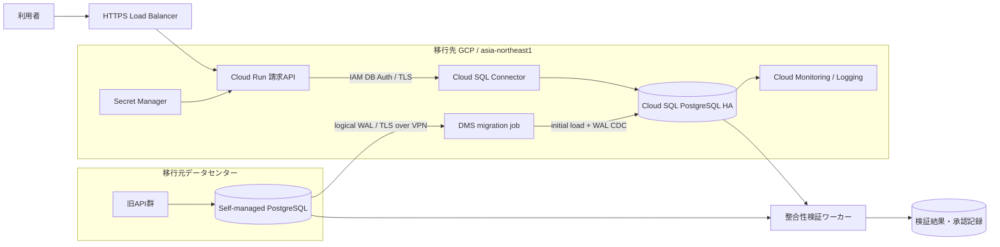

# Weekly Cloud Engineer Magazine — 2026-09-11

[[Home]]

#cloud #aws #oci #gcp #architecture #weekly #deep-dive

> [!warning] 費用・安全
> 標準ラボは Docker Compose によるローカル模擬で、クラウド費用は発生しない。任意の実クラウド演習で Cloud SQL、Database Migration Service（DMS）、VPN、ログ保存先を作る前に、請求先・プロジェクト・リージョンを確認し、予算アラートを設定すること。Cloud SQL は停止中もストレージ等が課金され得る。昇格、書込み停止、DNS変更、DB削除は検証環境だけで行う。実データ、実パスワード、長期アクセスキーを使わず、Workload Identity／短期認証と最小権限を使う。

## 1. 今週のテーマ

- **アプリ:** 月額制SaaSの請求台帳API。契約、請求書、入金、返金をPostgreSQLに記録し、管理画面とバッチが利用する。
- **主クラウド:** GCP（`asia-northeast1`、Cloud SQL for PostgreSQL）
- **主軸 criterion:** **migration** — 自社運用PostgreSQLからCloud SQLへ、変更データキャプチャ（CDC）を使って計画停止を15分以内に抑える。
- **難易度:** **Intermediate**（参加条件ではなく、設計判断の密度の目安）
- **所要時間:** 150分

### 必要知識・ツール・環境・先行概念

- 必要知識: PostgreSQLの主キー、トランザクション、WAL、`pg_dump/pg_restore`、論理レプリケーションの意味。
- ツール: Docker 24+、Docker Compose v2、`psql` 15+、`pgbench`、`sha256sum`、任意で `gcloud`。
- 環境: 8 GB RAM、空きディスク10 GB、ローカルTCPポート5432/5433。実クラウド版は分離した検証プロジェクト。
- 先行概念: RTO/RPO、SLO、プライベートIP、CIDR、TLS、最小権限、バックアウト条件。
- 今回扱わないもの: アプリの全面リファクタリング、DBエンジン変更、リージョンDRの実装、分析基盤移行。

### 測定可能な到達目標

1. 500 GiBの初期コピーと25 GiB/日の変更量について、帯域・WAL保持・移行時間を計算できる。
2. 事前検証、CDC、書込み凍結、差分収束、昇格、接続切替、検証、解放を手順化できる。
3. `row_count`、金額合計、主キー範囲、サンプルハッシュの4種類で整合性を確認できる。
4. 停止15分、移行起因のデータ損失0、ロールバック判断10分以内を演習で実証できる。

### 学習レイヤー

**Foundation** → WAL/CDCと移行不変条件を理解する。  
**Practical implementation** → ローカルで初期ロード、追随、カットオーバーを模擬する。  
**Production concerns** → 接続、IAM、監視、費用、失敗、戻し方を設計する。  
**Optional advanced challenge** → 双方向同期を使わず、イベント・アウトボックスで限定的な戻し可能性を設計する。

## 2. 要件と数値化

### 機能要件

- テナントごとの契約、請求書、入金、返金をACIDトランザクションで更新する。
- `invoice_id` と `idempotency_key` は一意。金額は整数の最小通貨単位で保持する。
- 日次締めバッチと管理画面検索を提供する。
- 移行中も読取りと書込みを継続し、カットオーバー時だけ短時間メンテナンスにする。

### 非機能要件と仮定

|項目|設計値|
|---|---|
|DBサイズ|500 GiB（テーブル420、索引70、その他10）|
|更新量|平均25 GiB/日、月末最大75 GiB/日|
|トラフィック|平均300 TPS、ピーク1,200 TPS、読:書=7:3|
|接続数|アプリ最大400、バッチ50。接続プール後のDB上限目標120|
|性能SLO|API p95 < 300 ms、DBトランザクション p95 < 80 ms|
|可用性SLO|月99.95%。移行時間帯の計画停止は別途承認し15分以内|
|移行RTO|切替失敗のサービス復帰30分以内|
|移行RPO|**0**。旧DBの最終LSNまで適用確認後に昇格|
|通常バックアップ|PITR有効、保持方針35日（組織要件で調整）|
|コンプライアンス仮定|個人情報保護法、国内保存、会計記録7年、職務分離。カード番号は外部決済事業者で保持|
|予算枠|定常DB 1,500 USD/月以内、移行一時費用300 USD以内（税・為替・外部クラウド転送料を除く）|

**重要な不変条件:** `sum(invoice.total)=sum(payment.applied)+sum(open_balance)` の業務整合性、重複請求0、移行後の書込み先は常に一つ。CDC遅延が0でも業務整合性の証明にはならない。

## 3. ADR-037: 同種PostgreSQLのオンライン移行方式

### 検討した選択肢

|選択肢|停止時間|長所|主なリスク|
|---|---:|---|---|
|A. `pg_dump/pg_restore`|数時間以上|単純、移植性が高い|500 GiBでは停止15分を満たさない|
|B. GCP DMSの継続移行（初期ロード+CDC）|分単位|マネージド、同種移行、Cloud SQLへの昇格手順|未移行オブジェクト、WAL肥大、接続設計が必要|
|C. PostgreSQLネイティブ論理レプリケーション|分単位|標準機能、移植性が高い|初期同期・DDL・シーケンス・監視を自前運用|
|D. アプリ二重書込み|理論上ゼロ|段階切替が可能|順序、再試行、部分失敗で整合性が複雑化|

### 決定

**B: GCP Database Migration Serviceの継続移行**を採用する。移行先は既存と同じPostgreSQLメジャーバージョンから開始し、エンジンアップグレードは別変更に分離する。接続はプライベート経路、TLSを必須とし、DMSが対象外とするユーザー、権限、一部拡張、ジョブ、シーケンス確認を明示的なランブックにする。

### トレードオフと却下理由

- 低停止を得る代わりに、移行期間中はソースWAL保持量とレプリケーションスロットを監視する。
- DMSの進捗は「コピーできた」ことを示すが、業務不変条件は別検証する。
- Aは小規模DBや長時間停止可なら第一候補だが今回は却下。
- Cは移植性が最も高いが、今回の運用人数（DBA 1、SRE 2）では自動化・監視の保守負荷が大きい。
- Dはロールバックを簡単に見せるが、二重書込み不整合を新たに作るため却下。カットオーバー後は旧DBを読み取り専用にし、無条件に書込みを戻さない。

## 4. アーキテクチャとデータフロー



### 通常時のリクエストフロー

1. HTTPS LBがTLSを終端し、認証済み要求をCloud Runへ渡す。
2. APIは短命な接続プールを通じCloud SQL Connectorでプライベート接続する。
3. DBロールは必要なスキーマのDMLだけを許可し、DDLは移行管理者に分離する。
4. 構造化ログに`request_id`、`tenant_id_hash`、`db_latency_ms`を記録する。金額・氏名・SQL本文は記録しない。

### 移行フロー

1. DMSがスナップショット相当の初期ロードを実施する。
2. 初期ロード中に発生した変更をソースWALからCDCし、ターゲットへ順序を保って適用する。
3. 監視でCDC遅延、ソースWAL使用量、適用エラーを確認する。
4. 切替時に書込みAPIとバッチを停止し、ソースを読み取り専用化する。
5. 最終LSNまで追随し、件数・集計・ハッシュ・不変条件を検証する。
6. DMSジョブを昇格し、接続設定をCloud SQLへ切り替え、カナリア→全量で再開する。

## 5. IAM、境界、防御、可観測性

### IAMと信頼境界

- **人:** `migration-planner`（閲覧）、`migration-operator`（DMS操作）、`db-validator`（両DB読取）、`cutover-approver`（承認）を分離。常時のOwner/Editorは禁止。
- **サービス:** DMSサービスエージェント、Cloud Run専用サービスアカウント、検証ジョブ専用アカウントを分離する。
- **DB:** `dms_replica`は必要なレプリケーション・対象DB読取のみ、`app_runtime`はDMLのみ、`validator_ro`は両側SELECTのみ。`postgres`をアプリで使わない。
- **境界:** Internet→LB、アプリVPC→Cloud SQL、データセンター→Cloud VPN/Interconnect→DMS、運用者→IAP/承認済み端末を別境界として脅威モデル化する。

### 暗号化・ネットワーク・Secrets

- 保存時暗号化はクラウド既定を基線とし、規制・鍵失効要件がある場合だけCMEKを選ぶ。鍵管理者とDB管理者を分離する。
- 転送中は外部ソースからDMSまでTLS、ネットワークはHA VPNまたはInterconnect。公開IP許可リストは例外扱い。
- Cloud SQLはprivate IP/PSCを選択し、アプリの外向き通信を制限。ファイアウォールは送信元CIDR、宛先、ポート5432を限定。
- DBパスワードをコードやTerraform stateへ直書きしない。Secret ManagerまたはIAM DB Authenticationを使い、自動ローテーションを試験する。

### ログ・メトリクス・トレース

- **DMS:** migration job状態、initial load進捗、CDC遅延、エラー、最終適用時刻。
- **source:** WAL生成bytes/s、replication slot retained bytes、disk free、長時間トランザクション、接続数。
- **target:** CPU、memory、disk utilization、connections、deadlocks、transaction latency、replica/failover状態。
- **application:** p50/p95/p99、5xx、接続取得時間、SQLSTATE分類、旧/新DB接続先ラベル。
- **trace:** 生SQLやPIIを属性に載せず、`db.system=postgresql`、操作名、遅延、エラー種別を記録。
- アラート例: CDC遅延>60秒が10分、retained WAL>100 GiB、空きディスク<20%、整合性差分1件以上、移行後5xx>1%。

## 6. 容量と費用モデル

### 容量（明示的な仮定）

初期データ500 GiB、移行経路の実効帯域200 Mbps、圧縮効果は安全側に見込まない。

```text
理論転送時間 = 500 GiB × 8 / 200 Mbps ≒ 5.7時間
プロトコル・索引作成・競合を含む係数2.0 → 約11.4時間
月末WAL = 75 GiB/日 ≒ 0.87 MiB/s（平均）
安全係数5 → 経路は4.4 MiB/s以上、WAL余裕は最低 75×3=225 GiB
移行先初期ストレージ = (500 + 3日変更75×3) × 1.3 ≒ 943 GiB → 1 TiBから開始
```

CPU/メモリは現行ピークのAWR相当値がないため、**仮置き**で8 vCPU/32 GiB、HA、SSD 1 TiBとする。リハーサルでピーク1,200 TPSを30分流し、CPU<70%、接続<120、DB p95<80 msを満たさなければ上方修正する。

### 費用（2026-09-11確認、すべて見積り）

- 同種PostgreSQL→Cloud SQLのDMS native migrationは公式価格ページ上「追加料金なし」。ただし移行先Cloud SQL、VPN/VM、ログ、ソース側データ転送料は別料金。
- Cloud SQLの正確な東京単価は構成、edition、HA、CUD、ディスク、バックアップ量で変わるため、単価を固定せず公式Pricing Calculatorで当日見積る。
- 予算式: `月額 ≒ HA compute時間 + provisioned storage + backup超過 + network egress + logging/monitoring`。
- 目標配分（概算レンジ）: DB compute 800–1,100 USD、storage/backup 200–350 USD、network/observability 50–150 USD、合計1,050–1,600 USD/月。**これは契約単価ではない。** Calculatorの見積URL/PDF、通貨、リージョン、日時をADR添付する。
- 移行一時費用はDMS自体0 USD想定でも、HA VPN、ソース側egress、並行稼働1〜2週間が支配的。並行稼働日数を短くすることが最大のFinOpsレバー。

## 7. 150分ガイドラボ

> [!important] 標準ラボはローカルのみ
> Dockerコンテナを削除する`docker compose down -v`はボリュームを破棄する。検証データだけであることを確認してから実行する。

### 0–20分: 設計前チェック

1. `source`（PostgreSQL 15）、`target`（PostgreSQL 15）、`writer`、`validator`のCompose構成を作る。
2. sourceで`wal_level=logical`、`max_replication_slots>=4`、`max_wal_senders>=4`を確認。
3. `invoices(id, tenant_id, total, status, updated_at)`と`payments(id, invoice_id, amount, idempotency_key)`を作る。

**Checkpoint A:** `SHOW wal_level;`が`logical`、両テーブルに主キーがある。  
**期待結果:** 論理レプリケーションの前提を満たす。  
**検証:** 主キーなしテーブルを列挙するSQLが0行。

### 20–50分: ベースラインと初期ロード

1. `pgbench`またはSQLで請求書10万件、入金8万件を生成する。
2. sourceの件数、`sum(total)`、`sum(amount)`、最小/最大IDを`baseline.json`相当へ記録する。
3. `pg_dump --format=custom --no-owner` → `pg_restore --jobs=4`でtargetへ初期ロードする。

**Checkpoint B:** targetの件数と金額合計がbaseline一致。  
**期待結果:** 初期データの静的整合性が取れる。  
**検証:** 差分SQLが全て0。所要時間と平均MiB/sを記録。

### 50–85分: CDC模擬

1. sourceでpublication、targetでsubscriptionを作り、writerで5分間更新する。
2. `pg_stat_replication`、`pg_replication_slots`、`pg_stat_subscription`を観測する。
3. target側にDDLを追加せず、DDLが論理レプリケーションで自動追随しないことを確認する。

**Checkpoint C:** 遅延が30秒以内に収束し、重複`idempotency_key`が0。  
**期待結果:** 初期ロード後の更新がtargetへ到達。  
**検証:** source/targetの行数とチェックサムサンプル100件が一致。

### 85–115分: カットオーバー

1. 変更凍結を宣言しwriterを停止。sourceをアプリ利用者に対しread-only化する。
2. 最終LSNとtarget受信/再生位置を記録し、lag=0を確認。
3. シーケンスを`max(id)+1`へ合わせ、4種の整合性検証を実行。
4. 接続先をtargetに変え、カナリア1インスタンスで作成→読取→返金の合成トランザクションを実行。
5. 成功後に全インスタンスを再開する。

**Checkpoint D:** 書込み停止から再開まで15分以内、RPO 0、APIスモークテスト成功。  
**期待結果:** 単一writer原則を保って切替完了。  
**検証:** sourceの最終行とtarget、不変条件、接続先ラベル、5xx率を確認。

### 115–140分: 障害注入と復旧

CDC中にtargetを60秒停止し、再開後に追随することを確認する。次にカットオーバー後の合成トランザクションを意図的に失敗させ、下記ランブックで判定する。

**Checkpoint E:** RTO 30分以内の復旧判断、証跡、再同期の方針を説明できる。

### 140–150分: 片付け

1. 実クラウドならDMS job、接続プロファイル、Cloud SQL検証インスタンス、VPN/静的IP、ログsinkを順に棚卸しして削除。
2. ローカルは成果物を退避後、`docker compose down -v`（破壊的）を実行。
3. シークレット、`.env`、一時dumpを安全に削除し、Git追跡されていないことを確認。

## 8. 失敗シナリオ、DR演習、運用ランブック

### シナリオ: カットオーバー直後に新DBで高エラー率

原因候補はシーケンス未更新、未対応拡張、権限不足、接続枯渇。旧DBはread-only、新DBにはすでに少数の新規書込みがあるため、DNSを戻すだけではRPO 0にならない。

### 判定ランブック

1. **検知 (0–2分):** 5xx、SQLSTATE、接続取得時間、合成トランザクションを確認。インシデント指揮官を一人にする。
2. **封じ込め (2–5分):** 新規書込みを再停止。両DBをread-onlyにし、二重writerを防止。最終成功`request_id`と時刻を記録。
3. **分類 (5–10分):** 権限/シーケンス/接続設定で10分以内に安全修正できるならforward-fix。データ破損、未知のDDL差、広範な非互換ならrollback準備。
4. **forward-fix:** 修正→合成トランザクション10回→差分検証→10%→100%再開。
5. **rollback:** 新DBで発生した書込みを監査ログ/アウトボックスから抽出し、人が承認した一方向リプレイで旧DBへ適用。自動双方向同期はしない。整合性確認後のみ旧DBをwriterに戻す。
6. **復旧確認:** API SLO、不変条件、件数、残高合計、重複キー、監査ログを確認。旧DBは最低7日read-only保持後、承認して廃止。

### DR演習

- DMS追随中にVPN断を5分発生させ、WAL保持増加と再接続を観測する。
- 目標: データ欠損0、接続復旧後10分以内にlag<30秒、source空きディスク20%以上。
- 超過時: 移行延期、WAL容量追加、帯域増強、長時間トランザクション解消。空きディスク逼迫時はレプリケーションスロットを安易に削除せず、移行中止と再初期ロードの影響を承認者へ提示する。

## 9. AWS / OCI / GCP 対応表と移植性

|能力|GCP（主実装）|AWS|OCI|
|---|---|---|---|
|管理PostgreSQL|Cloud SQL for PostgreSQL|RDS for PostgreSQL / Aurora PostgreSQL|OCI Database with PostgreSQL|
|オンライン移行|Database Migration Service continuous migration|AWS DMS full load + CDC / homogeneous migration|PostgreSQL native `pg_dump/restore`、`pglogical`。OCI GoldenGateは要件・対応範囲を個別確認|
|私設接続|HA VPN/Interconnect、PSC/private services access|Site-to-Site VPN/Direct Connect、PrivateLink|Site-to-Site VPN/FastConnect、private endpoint|
|秘密管理|Secret Manager / IAM DB Auth|Secrets Manager / IAM DB authentication|Vault / IAM DB tokens・サービス仕様を確認|
|監視|Cloud Monitoring/Logging、Query Insights|CloudWatch、Performance Insights/Database Insights|Monitoring/Logging、Database Management|

### ポータビリティとロックイン

- PostgreSQL SQL、標準データ型、Flyway/Liquibase、`pg_dump`、OpenTelemetryは移植性を高める。
- DMS job定義、IAMロール、プライベート接続、HA/failover API、バックアップ形式はクラウド固有。
- AWS公式も同種PostgreSQL全体移行では条件によりnative toolsが有効と説明している。AWS DMSはfull load/CDCの管理面でGCP DMSに近い。
- OCI Database with PostgreSQLは公式に`pg_dump/pg_restore`による移行を案内する。GCP DMSと同じ操作感を前提にせず、停止時間要件に応じて`pglogical`等を検証する。
- 退出計画として年1回、Cloud SQLから検証用PostgreSQLへの論理dump復元、RTO、拡張互換性を測定する。

## 10. Well-Architected型レビュー

### Operational excellence

- [ ] リハーサルを本番相当データ量・更新率で2回成功した
- [ ] Go/No-Go、rollback、データ責任者が実名で割り当て済み
- [ ] 各手順に実行者、期待値、タイムアウト、証跡場所がある

### Security / Privacy

- [ ] DMS・アプリ・検証者のIDを分離し、期限付き権限を使う
- [ ] public IP、平文通信、共有管理者パスワードを使わない
- [ ] ログにPII、金額、秘密、SQLパラメータを出さない

### Reliability

- [ ] 主キーなし、large object、拡張、DDL、シーケンス、ジョブを棚卸しした
- [ ] lag=0だけでなく業務不変条件を検証する
- [ ] 旧DBをread-onlyで保持し、新旧同時writerを禁止する
- [ ] Cloud SQL HA、PITR、バックアップ復元を移行後に再確認する

### Performance efficiency

- [ ] 1,200 TPSでCPU<70%、接続<120、DB p95<80 ms
- [ ] 初期ロードが業務ピークを圧迫しないよう並列度を調整した
- [ ] WAL保持とディスク成長アラートを設定した

### Cost optimization / Sustainability

- [ ] 東京リージョン、HA、1 TiB、バックアップ、ログでCalculator見積を保存した
- [ ] 二重稼働終了日と削除担当が決まっている
- [ ] 過剰なログ保持と不要なクロスリージョン転送を抑制した

### 本番準備完了条件

- [ ] 全DDLと拡張の互換性試験済み
- [ ] 4種の整合性検証が自動化済み
- [ ] 停止15分以内、RTO 30分、RPO 0をリハーサルで実証
- [ ] アラート通知先と24時間の移行後監視体制が有効
- [ ] 事業、セキュリティ、DBA、SREの承認記録がある
- [ ] 削除前バックアップと復元試験が完了

## 11. 成果物

1. `ADR-037-postgres-to-cloud-sql.md`
2. ソース互換性インベントリ（version、extensions、roles、DDL、PK欠落、LOB、jobs）
3. 容量・費用スプレッドシートと公式Calculator出力
4. Mermaid構成図と信頼境界図
5. `cutover-runbook.md`、Go/No-Go表、rollback決定木
6. 整合性検証SQLと署名付き結果
7. 負荷試験・CDC lag・停止時間・RTO/RPOのリハーサル報告
8. IAM権限表、ログ/メトリクス/アラート一覧
9. リソース棚卸しとクリーンアップ証跡

## 12. 確認問題

### Q1. CDC遅延が0なら、なぜ整合性検証がまだ必要か。
<details><summary>回答</summary>CDCは転送位置の収束を示すだけで、未対応DDL、対象外オブジェクト、シーケンス、変換、アプリ固有の残高不変条件を証明しないため。</details>

### Q2. カットオーバー中にソースをread-onlyにする主目的は何か。
<details><summary>回答</summary>最終LSNを確定し、二つの書込み元が生じるsplit-brainを防ぎ、RPO 0を検証可能にすること。</details>

### Q3. レプリケーションスロットの最大の運用リスクは何か。
<details><summary>回答</summary>consumerが停止すると必要WALが保持され続け、ソースディスクを枯渇させ得る。retained bytesと空き容量の監視・中止基準が必要。</details>

### Q4. エンジンのメジャーアップグレードを同時にしない理由は何か。
<details><summary>回答</summary>移行と互換性変更を分離して障害原因とrollbackを単純化し、変更リスクを小さくするため。</details>

### Q5. 切替後すぐDNSを旧DBへ戻せないのはなぜか。
<details><summary>回答</summary>新DBにだけ存在する書込みを失う可能性がある。両側を停止し、差分を特定・承認・一方向リプレイしてからwriterを戻す必要がある。</details>

### 設計／面接問題

DBが2 TiB、変更量500 GiB/日、許容停止5分、ソース回線100 Mbpsの場合、現在案のどこが破綻するか。初期ロード時間、WAL保持、接続方式、検証時間を数値化し、オンライン移行、物理搬送、移行単位分割のどれを選ぶか説明せよ。

### フォローアップ課題（Optional advanced challenge）

請求APIにTransactional Outboxを追加し、切替後15分間だけ発生した新DBイベントを、順序・冪等性・承認付きで旧DBへ一方向再生できる設計を作る。双方向レプリケーションは禁止。失敗イベントの隔離、再実行、監査証跡まで含める。

## 13. 現行の公式リファレンス

確認日: **2026-09-11**。仕様・価格・対応バージョンは実装日に再確認する。

### GCP（主実装）

- [Cloud SQL: About data migration](https://cloud.google.com/sql/docs/postgres/migrate-data-to-cloud-sql-instance)
- [Database Migration Service: PostgreSQL source configuration](https://cloud.google.com/database-migration/docs/postgres/configure-source-database)
- [Database Migration Service for PostgreSQL FAQ / limitations](https://cloud.google.com/database-migration/docs/postgres/faq)
- [DMS pricing](https://cloud.google.com/database-migration/pricing)
- [Cloud SQL pricing](https://cloud.google.com/sql/pricing)
- [Cloud SQL high availability](https://cloud.google.com/sql/docs/postgres/high-availability)
- [Cloud SQL SLA](https://cloud.google.com/sql/sla)
- [Google Cloud documentation root](https://cloud.google.com/docs)

### AWS（等価方式）

- [AWS DMS: PostgreSQL source](https://docs.aws.amazon.com/dms/latest/userguide/CHAP_Source.PostgreSQL.html)
- [AWS DMS homogeneous PostgreSQL migrations](https://docs.aws.amazon.com/dms/latest/userguide/dm-migrating-data-postgresql.html)
- [AWS documentation root](https://docs.aws.amazon.com/)

### OCI（等価方式）

- [OCI Database with PostgreSQL: Importing, Exporting, and Migrating](https://docs.oracle.com/en-us/iaas/Content/postgresql/import-export-migrate.htm)
- [OCI Database with PostgreSQL: Major version upgrade approaches](https://docs.oracle.com/en-us/iaas/Content/postgresql/upgrades.htm)
- [OCI documentation root](https://docs.oracle.com/en-us/iaas/Content/home.htm)
