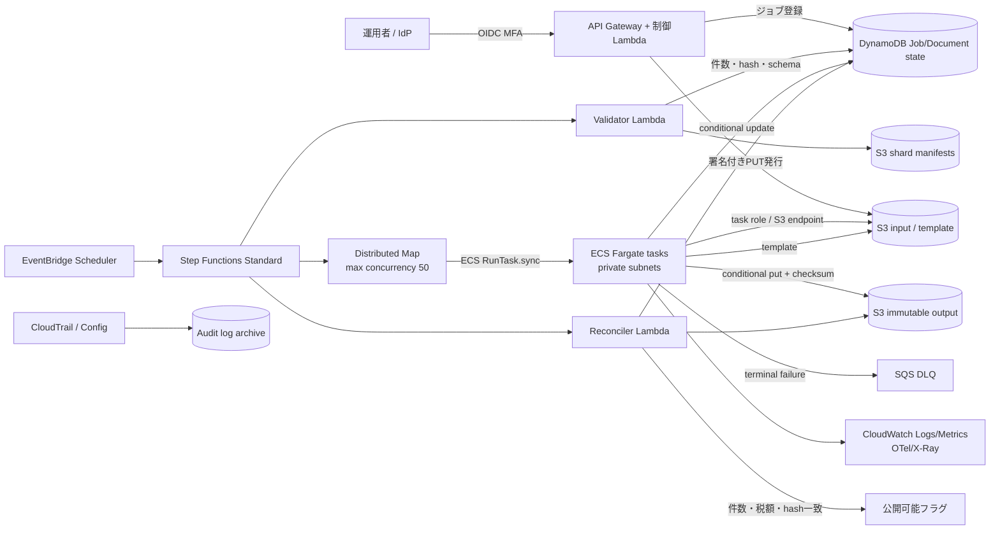

[[Home]]

# Weekly Cloud Engineer Magazine — 2026-09-18

#cloud #aws #oci #gcp #architecture #weekly #deep-dive

> [!warning] 課金・破壊的操作・認証情報
> 標準ラボはローカルDockerで完結し、クラウド費用は発生しない。任意のAWS展開では、Fargate、Step Functions、S3、SQS、ECR、NAT Gateway、CloudWatch Logs、KMSに課金され得る。**作成前に**学習用アカウント、予算アラート、リージョン、タグ、クォータを確認すること。S3オブジェクト・ECRイメージ・KMS鍵・ログの削除は検証環境だけで行い、保持要件を確認する。実在の納税者データ、実資格情報、長期アクセスキーは使わない。タスクロールと短期認証を使い、最小権限にする。

> 今週の問いは「Lambdaとコンテナのどちらが好きか」ではない。**1件ごとの実測CPU秒・最大RSS・実行時間分布・失敗の再開単位から、締切と費用を満たす実行方式を証明できるか**である。

## 1. アプリ、主クラウド、焦点、前提、到達点

- **アプリ:** 自治体向け固定資産税通知書の夜間一括生成。確定済みCSVとテンプレートからPDFを生成し、電子交付用に保存する。
- **主実装クラウド:** **AWS**（東京 `ap-northeast-1`）。S3、Step Functions Distributed Map、ECS `RunTask` on Fargateを中心にする。
- **主評価軸:** **Compute choice** — Lambda、ECS on Fargate、AWS Batch on Fargate/EC2を、実行上限、依存関係、並列性、再開単位、運用負荷、費用で比較する。今回は「短時間API」ではなく、期限付き・可変長・CPU/メモリ混在バッチに絞る。
- **難易度シグナル:** **Intermediate**（参加条件ではなく設計判断の密度の目安）。
- **ラボ時間:** **150分**。

### 必要知識・ツール・環境・先行概念

- **知識:** Linuxプロセス、コンテナ、CPU時間と壁時計時間、RSS、S3、キュー、at-least-once、冪等性、指数バックオフ。
- **ツール:** Docker Engine 24+、Python 3.11+、GNU `time`、`sha256sum`、`jq`、任意の表計算ソフト。クラウド拡張ではAWS CLI v2とTerraform 1.8+。
- **環境:** 4 vCPU、8 GiB RAM、空き5 GiB。ラボ入力は合成データのみ。
- **先行概念:** サーバレスは実行サーバの管理を減らすが、無制限ではない。並列度は下流容量以下に制限する。再試行されても成果物を二重確定しない。平均値だけでなくp95/p99と最大RSSでサイジングする。
- **今回扱わないもの:** PDFレイアウト品質、税計算、住民ポータルUI、OCR、生成AI。

### 測定可能な到達目標

1. 120,000件を6時間で完了するために必要な平均スループット **5.56件/秒** と、余裕率25%込み **6.95件/秒** を導ける。
2. サンプル実行からp50/p95実行時間、最大RSS、成功1件当たりCPU秒を測る。
3. Lambdaの15分上限とFargateのCPU/メモリ組合せを踏まえ、選択をADRで説明できる。
4. `document_id + template_version + input_hash` を冪等キーとして、再試行で同じPDFを再確定しない。
5. 5%失敗注入後も成功済みシャードをやり直さず、DLQから対象だけ再実行する。

### 学習レイヤー

**Foundation** → 実行方式を制約と測定値で比較する。  
**Practical implementation** → ローカルでシャーディング、計測、冪等書込み、再試行を実装する。  
**Production concerns** → IAM、ネットワーク、可観測性、容量、費用、DRを設計する。  
**Optional advanced challenge** → Arm64とx86_64を同一入力でベンチマークし、価格性能を比較する。

## 2. 要件、負荷、SLO、RTO/RPO、コンプライアンス、予算

### 機能要件

1. 確定済みCSV、テンプレート版、対象年度を受け付ける。
2. 1通知単位でPDFとSHA-256、生成履歴を作成する。
3. バッチ全体、シャード、文書単位の状態を検索できる。
4. 成功済み文書を再生成せず、失敗文書だけ再投入できる。
5. 件数、合計税額、入力ハッシュ、成果物ハッシュの照合後に公開可能状態へ昇格する。

### 非機能要件と明示的な見積条件

|項目|仮定・目標|
|---|---|
|件数|通常30,000件/夜、年次ピーク120,000件|
|入力/出力|入力3 KiB/件、PDF平均180 KiB、合計約21.1 GiB/ピーク|
|実測前の仮定|1件p50 4秒、p95 7秒、p99 12秒、最大RSS 650 MiB|
|締切|02:00開始、08:00までの6時間。04:00までに50%|
|性能SLO|有効入力の99%を6時間以内、p99文書生成30秒以内|
|品質SLO|正しい入力に対する生成成功率99.95%、重複公開0、欠落0|
|可用性|制御API月99.9%。夜間バッチは即時可用性より締切達成を測る|
|RTO|制御面60分、生成処理2時間以内に再開|
|RPO|確定入力0、生成状態5分。成果物は再生成可能|
|保持|入力/成果物7年、実行ログ400日、詳細デバッグログ14日という仮定|
|コンプライアンス|個人情報保護法、国内保存、職務分離、監査証跡。マイナンバーは扱わない|
|予算枠|ピーク1回の計算費US$20、月間関連費US$300（税・為替・サポート・転送除外）|

必要平均スループットは `120,000 / (6 × 3,600) = 5.56件/秒`。25%の再試行・偏り余裕を持たせて `6.95件/秒` を設計値とする。p95が7秒なら必要同時実行は `ceil(6.95 × 7) = 49`。下流S3/KMS/ログの許容値を確認し、初期上限を**50タスク**にする。

## 3. ADR-038: PDF一括生成の実行基盤

### 検討した選択肢

|選択肢|適合点|弱点/棄却条件|
|---|---|---|
|A. AWS Lambda|運用が軽く、短い独立処理、細粒度スケールに強い|1実行最大15分。メモリ/一時領域、ネイティブフォント、巨大文書の尾部で制約。イベントごとの再試行制御も必要|
|B. ECS on Fargate + Step Functions|任意コンテナ、CPU/メモリ明示、長時間処理、シャード単位の再開|起動遅延、最小1分課金、タスク定義/ネットワーク/イメージ運用が必要|
|C. AWS Batch on Fargate|ジョブキュー、依存、再試行、配列ジョブが自然|今回の単一夜間ワークフローには制御面が増える。複数部門・優先度・大量ジョブなら再評価|
|D. AWS Batch on EC2/Spot|高稼働率と大規模処理で単価を下げやすい|AMI、キャパシティ、Spot中断、パッチ運用が増える。短い季節負荷には過剰|

### 決定

**B: Step Functions Distributed Mapから、1シャード250件のECS Fargateタスクを最大50並列で起動する。** Linux/ARM64対応をCIで検証し、まず2 vCPU/4 GiBを基準にする。タスクはS3から入力シャードを読み、文書単位で条件付き確定し、マニフェストを出力する。

### 理由とトレードオフ

- 250件×p95 7秒を直列に処理すると約29分で、Lambda上限を超える。一方Fargateは同一コンテナでフォント/レンダラを固定できる。
- 1件1タスクでは起動・課金・ログが過大。全件1タスクでは失敗領域が大きい。**250件/シャード**は再開単位と起動オーバーヘッドの暫定折衷であり、実測後に調整する。
- FargateはCPU/メモリの組合せが制約され、要求量ベースで課金される。高い常時稼働率が出るならBatch on EC2/Spotを再評価する。
- Lambdaは「不採用」ではなく、マニフェスト検証や短い制御処理には適合する。データプレーンだけをFargateに置く。

### 決定を見直すトリガー

- p99が10分未満、RSSが1 GiB未満、ネイティブ依存が安定し、1件1実行のLambda費用が20%以上安い。
- 夜間処理が毎日8時間超・平均稼働率60%超となり、EC2/Spotの運用費を含めても25%以上安い。
- GPU、16 vCPU超、120 GiB超、複雑なジョブ依存が必要になった場合。

## 4. 詳細アーキテクチャと要求/データフロー



### リクエスト/データフロー

1. 運用者はSSO+MFAでジョブを作成する。制御Lambdaは短寿命のS3アップロードURLを返す。
2. ValidatorがCSVスキーマ、行数、合計税額、入力SHA-256、テンプレート版を固定し、250件ずつのシャードマニフェストを作る。
3. Distributed Mapが最大50並列でFargateタスクを起動する。各タスクはタスクロールで担当シャードだけ読む。
4. ワーカーは `document_id/template_version/input_hash` を冪等キーにする。DynamoDB条件付き更新で`PENDING→RUNNING→SUCCEEDED`を遷移し、既存成功はskipする。
5. PDFは一時キーへ書き、チェックサム確認後に確定キーへ保存する。S3 Versioning/Object Lockの要否は保持方針で決める。
6. Reconcilerが入力件数=成功件数、重複0、合計税額一致、マニフェストハッシュ一致を確認したときだけ公開可能にする。

## 5. IAM、信頼境界、暗号化、ネットワーク、Secrets、観測

### IAMと信頼境界

|主体|許可|禁止/境界|
|---|---|---|
|運用者|ジョブ作成・状態参照・失敗再投入|成果物バケットへの直接書込み、ロール作成|
|Step Functions実行ロール|特定タスク定義の`ecs:RunTask`、限定ロールの`iam:PassRole`|任意タスク定義・任意ロールのPassRole|
|ECS実行ロール|ECR pull、限定ログストリーム書込み、起動時Secret取得|業務S3/DynamoDBへのアクセス|
|ECSタスクロール|特定prefixのS3 Get/Put、特定テーブルの条件付き更新、KMS利用|IAM変更、他年度/他自治体prefix、バケット一覧|
|Reconciler|manifest読取、状態集計、公開フラグ更新|PDF本文読取（照合に不要なら外す）|

境界は①利用者/公開API、②制御プレーン、③私有サブネットの生成データプレーン、④保存/監査プレーン。自治体ごとにS3 prefixとKMS暗号化コンテキストを分離し、SCP/permissions boundaryでリージョンと危険操作を制限する。

### 暗号化・ネットワーク・Secrets

- TLS 1.2+、S3/DynamoDB/ECR/Logsは保存時暗号化。高機密成果物は顧客管理KMS鍵を分離し、鍵ポリシーにも最小権限を適用する。
- Fargateタスクはprivate subnet。S3/DynamoDBはGateway Endpoint、ECR API/DKR、CloudWatch Logs、Secrets ManagerはInterface Endpointを使う。外部通信不要ならNAT経路を置かない。
- PDFエンジンに資格情報を渡さない。テンプレート署名鍵等が必要ならSecrets ManagerのARN参照だけをタスク定義に持たせ、値をイメージ・環境変数一覧・ログへ出さない。
- S3 bucket policyはTLS必須、想定VPC endpoint/組織/ロールに限定。Block Public Accessを有効化する。

### ログ・メトリクス・トレース

- **ログ:** `job_id, shard_id, document_id_hash, template_version, input_hash_prefix, duration_ms, cpu_ms, max_rss_mb, outcome, retry_count`。氏名、住所、税額、PDF本文は出さない。
- **メトリクス:** `documents_succeeded/failed/skipped`, `oldest_shard_age`, p50/p95/p99 duration, CPU/RSS、Fargate task startup、DLQ depth、deadline burn rate、S3/KMS throttling。
- **トレース:** `job_id→Map item→ECS task→S3/DynamoDB`。高カーディナリティ文書IDはログ相関に限定し、メトリクスdimensionにしない。
- **アラート:** 02:30時点10%未満、04:00時点50%未満、完了予測が08:00超、失敗率0.05%超、DLQ>0、整合性不一致はページ。単発タスク失敗は自動再試行を先に行う。

## 6. 容量・費用モデル（すべて見積）

### 容量

- 120,000 / 250 = **480タスク**。
- 1タスクのp95処理時間は `250×7秒÷2 vCPU×効率係数1.25 ≒ 1,094秒（18.2分）` と仮定。
- 50並列なら10波、p95で約182分。起動・偏り・再試行を35%加えて約246分（4.1時間）で、6時間SLOに余裕がある。
- 1タスク4 GiB、50並列なら要求上限は100 vCPU/200 GiB。アカウントのFargate vCPU quota、サブネットIP、ECR pull、S3/KMS/DynamoDBクォータを事前確認する。
- 02:00からの完了予測を `残件数 / 直近15分の成功率` で更新し、05:00で08:00超なら並列上限を、下流の安全上限内で50→75へ変更する。

### AWS Fargate概算

> [!note] 価格検証日: 2026-09-18
> 東京の契約通貨・税を含む確定額ではない。比較可能性のためAWS公式ページの **US East (N. Virginia), Linux/x86** 公開例（vCPU `$0.000011244/秒`、memory `$0.000001235/GB秒`）を使う。実展開前にAWS Pricing Calculatorで`ap-northeast-1`を再計算する。

480タスク×1,094秒×(2 vCPU×0.000011244 + 4 GB×0.000001235)  
= **約US$14.42/ピーク実行**。再試行5%を加えて**約US$15.14**。20 GB超の一時領域、Step Functions、S3、DynamoDB、KMS、ECR、ログ、データ転送は別。Fargateはイメージ取得開始から終了まで秒課金、Linuxは1分最低である。

### Lambda反実仮想

1件を1 GiB・7秒、120,000件と仮定すると840,000 GB秒。AWS公式のx86第一階層例 `$0.0000166667/GB秒` では**約US$14.00**、リクエスト約US$0.024（無料枠・他関数利用・追加サービス除外）。単純費用は近いが、15分上限、フォント/一時領域、長い尾、1件ごとの起動と失敗制御を加味し今回は採用しない。費用だけで選ばない。

### 感度分析

- p95が7→12秒なら概算計算費は約1.71倍、締切予測も悪化する。
- CPUを2→4 vCPUにして処理時間が半分未満にならなければ単価性能は悪化する。1/2/4 vCPUでベンチマークする。
- 250件/タスクを500件にすると起動回数は半減するが、失敗時やり直し範囲と尾部が増える。
- NAT Gatewayを使うと固定時間/転送料が小規模計算費を上回り得るため、VPC endpoint中心にする。

## 7. 150分ガイドラボ

標準ラボは合成JSONを「PDF相当バイト列」に変換するローカル模擬で、クラウド資格情報を使わない。

### 0–20分: Foundation — 制約表と成功条件

1. Lambda/Fargate/Batchの比較表に、最大実行時間、CPU/メモリ、起動、再試行単位、運用責任、課金粒度を書く。
2. `120000/(6*3600)` と25%余裕後の必要TPS、p95=7秒時の並列度を計算する。
3. 成功条件を「プロセス終了0」ではなく、件数・重複・hash・合計値一致に定義する。

**Checkpoint:** 5.56件/秒、設計6.95件/秒、同時実行49→初期50を説明できる。  
**期待結果:** 「制約で候補を落とし、残りをベンチマークする」選択順序ができる。

### 20–45分: 合成データとシャード

```bash
mkdir -p lab/{input,manifests,output,state,logs}
python3 - <<'PY'
import json, hashlib, pathlib
p=pathlib.Path('lab/input/items.jsonl')
rows=[]
for i in range(2000):
    r={'document_id':f'D{i:06d}','amount':10000+(i%97)*100,'template_version':'v3'}
    r['input_hash']=hashlib.sha256(json.dumps(r,sort_keys=True).encode()).hexdigest()
    rows.append(r)
p.write_text('\n'.join(json.dumps(x) for x in rows)+'\n')
print(len(rows), hashlib.sha256(p.read_bytes()).hexdigest())
PY
split -l 250 -d -a 3 lab/input/items.jsonl lab/manifests/shard-
wc -l lab/manifests/*
```

**Checkpoint:** 8シャード、各250行、入力全体hashが得られる。  
**Validation:** `awk '{s+=$1} END{print s}' <(wc -l lab/manifests/* | head -n -1)` が2000。

### 45–90分: ワーカー、計測、冪等性

ワーカーの契約を次のように実装する（言語は任意）。

1. 各行を読み、`key=document_id/template_version/input_hash`を作る。
2. `state/<sha256(key)>.done` があればskip。
3. CPU負荷と50–500 msのジッタを模擬し、`output/<document_id>.pdf.tmp`へ書く。
4. 内容hashを計算し、原子的rename後にdone記録を作る。
5. `FAIL_RATE`に従い確定前に失敗させ、再実行可能にする。

```bash
/usr/bin/time -v python3 worker.py lab/manifests/shard-000 \
  >lab/logs/shard-000.jsonl 2>lab/logs/shard-000.time
rg 'Elapsed|Maximum resident' lab/logs/shard-000.time
sha256sum lab/output/* | sort > lab/output.sha256
```

同じシャードを再実行する。

**Checkpoint:** 2回目は250件すべてskip、出力hash一覧に差分なし。  
**Validation:** ログからp50/p95を計算し、最大RSSと`successful_documents / wall_seconds`を記録する。  
**期待結果:** プロセス成功ではなく文書単位の冪等性を確認できる。

### 90–120分: 並列実行と失敗注入

```bash
FAIL_RATE=0.05 find lab/manifests -type f -name 'shard-*' -print0 \
  | xargs -0 -n1 -P4 python3 worker.py || true
find lab/output -type f -name '*.pdf' | wc -l
find lab/state -type f -name '*.failed' | wc -l
```

失敗一覧だけを再投入し、最終的に2,000成功へ収束させる。並列度を1/2/4で変え、スループットとCPU使用率を比較する。

**Checkpoint:** 失敗後も成功済み出力のmtime/hashが変わらず、再投入後に欠落0。  
**Validation:** 入力IDと出力IDを`sort`/`comm`で比較し、重複・欠落0、合計金額一致を確認する。

### 120–140分: ADRと本番設計

実測p95、最大RSS、イメージサイズ、シャード時間をADRの仮定へ差し替える。1/2/4 vCPUでの予測費用と締切を比較し、Fargateクォータ、subnet IP、最大並列、アラート閾値を書く。

**Checkpoint:** 選択理由が「サーバレスだから」ではなく、数値・制約・失敗単位で説明されている。

### 140–150分: Cleanup

```bash
docker ps --filter label=cloud-magazine=2026-09-18
docker image ls --filter label=cloud-magazine=2026-09-18
```

ラボ用コンテナを停止し、`lab/`は検証結果を保存してから削除する。任意AWS展開では、まず実行中タスクを確認し、学習用Step Functions実行、ECSタスク、ECRイメージ、S3オブジェクト、DynamoDB表、ログ、VPC endpoint、KMS鍵の保持要否を確認する。**共有・本番リソースは削除しない。KMS鍵の削除予約は回復期間と依存先を確認するまで行わない。**

## 8. 障害シナリオ、復旧/DR演習、運用Runbook

### シナリオ: テンプレートv3のフォント欠損で18%のタスクがOOM

兆候は`OutOfMemoryError`/exit 137、最大RSS急増、再試行増加、完了予測08:00超。無差別再試行は同じ失敗を増幅し、KMS/S3/DynamoDBも圧迫する。

### 対応Runbook

1. **検知:** アラート時刻、job_id、失敗率、exit code、影響テンプレート、残件数、完了予測を確認。
2. **止血:** Distributed Mapの新規起動を停止/並列度を下げる。入力・成功成果物は削除しない。公開フラグを閉じたままにする。
3. **切分け:** v2/v3、文書サイズ、RSS、task definition digest、image digestで比較。機微本文をログへ出さない。
4. **判断:** v3だけなら承認済みv2へ戻すか、4 GiB→8 GiBタスク定義へ切替。変更は新revisionで行い監査記録を残す。
5. **再開:** `FAILED`かつ未成功の冪等キーだけをDLQから再投入。成功済みをスキップする。
6. **検証:** 入力=成功、重複0、合計税額、テンプレート版、成果物hash、サンプル目視を確認。
7. **公開:** 二者承認後に公開可能フラグを変更。SLO影響と暫定措置を記録。
8. **事後:** メモリ回帰テスト、巨大入力fixture、canary 1%、完了予測アラートを追加。

### DR演習

東京リージョンの制御面停止を想定する。S3 Cross-Region Replication（必要ならReplica Modification Sync）、DynamoDB PITR/バックアップ、ECR複製、IaC、署名済みマニフェストを大阪へ準備する。これは自動active-activeではない。

1. 東京で新規受付を停止し、最終入力manifest hashと成功済みキーを記録。
2. 大阪でIaCから制御面とFargateを復元し、KMS鍵・bucket policy・task roleを検証。
3. 複製済み入力と成功状態の時点を確認。RPO 5分を超える差分は元入力から再構築する。
4. 未成功キーだけを再実行し、件数・合計・hashを照合する。
5. RTO 2時間、RPO 0（確定入力）/5分（状態）を測る。DNS/公開先切替は二者承認。

**注意:** バックアップがあることと復元できることは別。四半期ごとに隔離アカウントで復元し、KMS鍵・IAM・コンテナdigestを含めて証明する。

## 9. AWS / OCI / GCPマッピングと移植性

|責務|AWS（主実装）|OCI|GCP|
|---|---|---|---|
|ワークフロー/並列展開|Step Functions Distributed Map|OCI Data Flow/FunctionsまたはWorkflow相当を自作、Queue+制御ワーカー|Workflows + Cloud Run Jobs|
|長時間コンテナジョブ|ECS Fargate / AWS Batch|Container Instances|Cloud Run Jobs / Batch|
|短時間関数|Lambda|OCI Functions|Cloud Run functions|
|オブジェクト|S3|Object Storage|Cloud Storage|
|状態/条件付き更新|DynamoDB|NoSQL Database|Firestore|
|キュー/DLQ|SQS|Queue|Pub/Sub dead-letter topic|
|レジストリ|ECR|Container Registry|Artifact Registry|
|秘密/鍵|Secrets Manager / KMS|Vault|Secret Manager / Cloud KMS|
|観測/監査|CloudWatch / X-Ray / CloudTrail|Logging / Monitoring / APM / Audit|Cloud Logging / Monitoring / Trace / Audit Logs|

### 等価ではない点

- Cloud Run Jobsはタスクを最大10,000まで並列化でき、タスクtimeoutは最大168時間。一方AWS FargateはECS/Step Functions側でタスク展開と締切を構成する。単なる名前置換ではない。
- OCI Container Instancesはサーバ管理不要のコンテナ実行で、shapeに基づき課金される。Functionsの同期/Detached timeoutは呼出方式で異なるため、長時間処理を安易にFunctionsへ移さない。
- Step Functions Distributed Mapの状態機械、`RunTask.sync`、DynamoDB条件式はロックイン点。**ワーカーの入出力契約、manifest形式、冪等キー、OpenTelemetry、OCI互換イメージ**は移植可能に保つ。
- 最低共通機能へ寄せすぎると主クラウドの運用性を失う。移植対象はワーカーと業務不変条件、移植しない対象は各社の制御面アダプターとする。

## 10. Well-Architected風レビューと本番準備チェック

### Operational Excellence

- [ ] IaC、イメージdigest固定、task definition revision、変更承認がある
- [ ] 締切予測、失敗分類、DLQ再投入、二者承認のRunbookを演習した
- [ ] 合成canaryを本番バッチ前に実行する

### Security

- [ ] 人/制御/実行ロールを分離し、`iam:PassRole`を限定した
- [ ] private subnet、VPC endpoint、S3 Block Public Access、TLS必須を確認した
- [ ] ログに氏名・住所・税額・本文・secretが出ない
- [ ] KMS鍵ポリシー、ローテーション、復旧時の利用可能性を検証した

### Reliability

- [ ] 冪等キー、条件付き状態遷移、原子的成果物確定を実装した
- [ ] 失敗済みだけ再開でき、成功済みhashが変わらない
- [ ] クォータ、subnet IP、下流スロットル、リージョンDRを負荷/復元試験した

### Performance Efficiency

- [ ] p50/p95/p99、CPU秒、最大RSS、起動時間を実測した
- [ ] 1/2/4 vCPU、シャード100/250/500、x86/Armを比較した
- [ ] 並列度を下流容量とdeadlineの両方から決めた

### Cost Optimization

- [ ] 成功1件当たり費用に失敗・再試行・制御面・ログ・KMSを含めた
- [ ] NAT固定費、ログ量、イメージpull、一時ストレージを含めた
- [ ] 予算アラートは停止装置ではないと理解し、異常並列をガードした

### Sustainability / Data governance

- [ ] 再生成・重複処理を抑え、Armの価格性能を検証した
- [ ] 保持期限とlegal holdを分離し、期限後削除を自動化した

## 11. 具体的な成果物

1. 実行方式比較表とADR-038。
2. 合成データ生成器、コンテナ化ワーカー、250件シャードmanifest。
3. 1/2/4並列のp50/p95/p99、CPU秒、RSS、成功/秒の測定表。
4. 120,000件の容量・費用計算シートと感度分析。
5. IAMマトリクス、信頼境界図、ログ禁止項目一覧。
6. 5%失敗注入、再開、欠落/重複0の検証記録。
7. OOM対応Runbookと東京→大阪DR演習記録。
8. 本番準備チェックリストの証跡リンク。

## 12. 理解度チェック、設計/面接問題、次の挑戦

### Q1. 必要平均スループットはなぜ5.56件/秒か

<details><summary>回答</summary>

120,000件を6×3,600秒で割るため。これは余裕0の下限であり、再試行、偏り、起動、検証時間を見て25%増しの6.95件/秒を設計値にした。
</details>

### Q2. Lambdaの費用が近くてもFargateを選ぶ理由は何か

<details><summary>回答</summary>

可変長処理の尾が15分上限へ近づく可能性、ネイティブフォント/レンダラ、メモリ、一時領域、文書ごとの起動・失敗制御を合わせたため。費用だけでなく制約と再開単位で選ぶ。
</details>

### Q3. なぜ1件1タスクにも全件1タスクにもしないのか

<details><summary>回答</summary>

1件1タスクは起動・最小課金・ログ・API呼出が過大。全件1タスクは並列性が低く、障害時の再実行範囲が巨大。250件は暫定折衷で、実測により調整する。
</details>

### Q4. タスクがexit 0ならバッチ成功と言えるか

<details><summary>回答</summary>

言えない。入力件数=成功件数、欠落/重複0、合計税額、入力/manifest/成果物hash、テンプレート版を照合し、公開可能への状態遷移を条件付きで行う必要がある。
</details>

### Q5. 並列度を上げれば締切は必ず改善するか

<details><summary>回答</summary>

改善しない。S3/KMS/DynamoDB、subnet IP、ECR pull、外部サービス、アカウントquotaが飽和すればスロットルと再試行が増え、かえって遅くなる。完了予測と下流飽和指標の両方で制御する。
</details>

### 設計/面接問題

「年1回だけ120万件、各処理p95 40秒、最大RSS 6 GiB、1%が30分かかる。午前8時締切で、成功済みの再処理は禁止」という条件に変わった。Lambda、ECS Fargate、AWS Batch on EC2/Spotをどの順で評価するか。制約、シャード、Spot中断、チェックポイント、quota、費用、運用人数を数値で説明せよ。

### Follow-up challenge（任意、30–60分）

同一マルチアーキテクチャイメージをx86_64とArm64で各30回実行し、`成功1件当たり費用`、p95、CPU秒、RSS、出力hash一致を比較する。速度だけでなく、ネイティブライブラリ互換性、再現性、CI時間もADRへ追記する。

## 13. 現行の公式リファレンス（2026-09-18確認）

### AWS（主実装）

- [AWS Lambda quotas（timeout、メモリ、一時領域等）](https://docs.aws.amazon.com/lambda/latest/dg/gettingstarted-limits.html)
- [Lambda timeoutの設定（最大900秒）](https://docs.aws.amazon.com/lambda/latest/dg/configuration-timeout.html)
- [Amazon ECS task definition differences for Fargate（CPU/メモリ組合せ、awsvpc）](https://docs.aws.amazon.com/AmazonECS/latest/developerguide/fargate-tasks-services.html)
- [Step Functions Distributed Map](https://docs.aws.amazon.com/step-functions/latest/dg/state-map-distributed.html)
- [ECS/FargateとStep Functionsの統合](https://docs.aws.amazon.com/step-functions/latest/dg/connect-ecs.html)
- [AWS Fargate pricing](https://aws.amazon.com/fargate/pricing/)
- [AWS Lambda pricing](https://aws.amazon.com/lambda/pricing/)
- [Amazon ECS task IAM role](https://docs.aws.amazon.com/AmazonECS/latest/developerguide/task-iam-roles.html)
- [S3 VPC endpoints](https://docs.aws.amazon.com/vpc/latest/privatelink/vpc-endpoints-s3.html)
- [AWS Well-Architected Framework](https://docs.aws.amazon.com/wellarchitected/latest/framework/welcome.html)

### OCI（等価機能と差分）

- [OCI Container Instances overview](https://docs.oracle.com/en-us/iaas/Content/container-instances/overview-of-container-instances.htm)
- [OCI Functions invocation and execution timeout](https://docs.oracle.com/en-us/iaas/Content/Functions/Tasks/functionsinvokingfunctions.htm)
- [OCI Functions compute architectures](https://docs.oracle.com/en-us/iaas/Content/Functions/Tasks/functionsspecifyingcomputearchitectures.htm)
- [OCI Cloud Price List](https://www.oracle.com/jp/cloud/price-list/)
- [OCI Architecture Center](https://docs.oracle.com/en/solutions/)

### GCP（等価機能と差分）

- [Create Cloud Run jobs（task、parallelism、timeout、retry）](https://cloud.google.com/run/docs/create-jobs)
- [Cloud Run resource model](https://cloud.google.com/run/docs/resource-model)
- [Cloud Run pricing](https://cloud.google.com/run/pricing)
- [Batch documentation](https://cloud.google.com/batch/docs)
- [Google Cloud Architecture Framework](https://cloud.google.com/architecture/framework)

### 価格利用上の注記

価格はリージョン、CPU architecture、無料枠、契約、為替、税、割引、ログ/ネットワーク等で変わる。本号の金額は**比較用の見積**であり請求額の保証ではない。展開直前に各社公式Calculator/Price Listと対象リージョンで再検証する。
