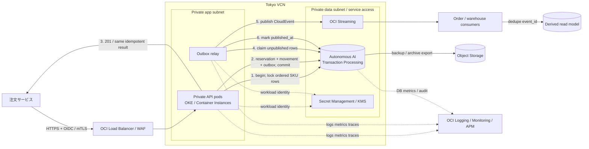
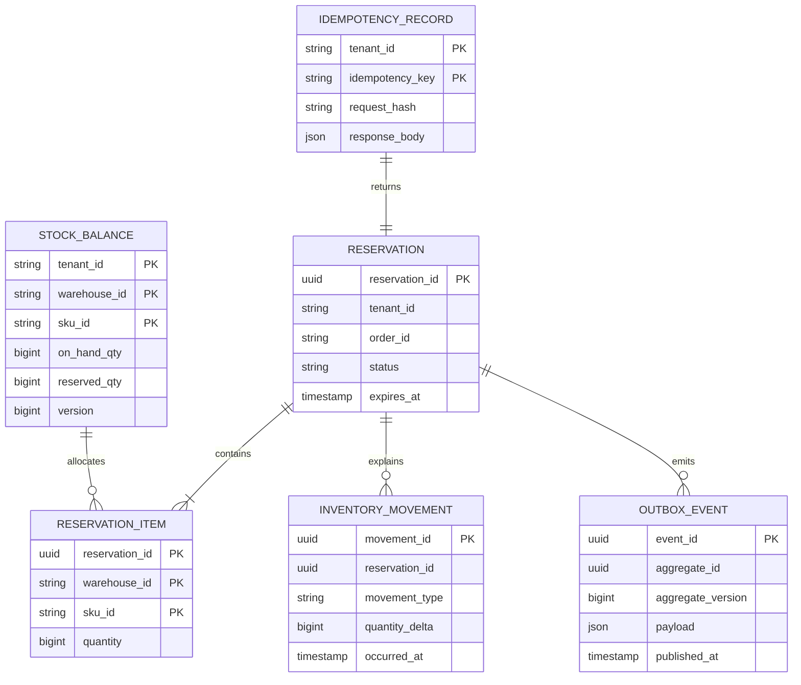

[[Home]]

# Weekly Cloud Engineer Magazine — 2026-10-02

#cloud #aws #oci #gcp #architecture #weekly #deep-dive

> [!warning] 課金・破壊的操作・認証情報
> 標準ラボはローカルのDockerだけで完結し、クラウド費用は発生しない。任意のOCI展開では、Autonomous AI Transaction Processing（ATP）、OKEまたはContainer Instances、Load Balancer、Logging、Vault、Object Storage、NAT Gateway等に課金され得る。**作成前に**学習用コンパートメント、予算通知、リージョン、タグ、クォータを確認すること。DB停止・削除、表の切捨て、バックアップ削除、鍵の無効化は検証環境だけで行う。実在の顧客・注文・在庫・認証情報は使わない。長期APIキーをコードやコンテナへ置かず、ワークロード・アイデンティティまたはリソース・プリンシパル、短期認証、最小権限を使う。

> 今週の問いは「SQLかNoSQLか、どちらが新しいか」ではない。**フラッシュセール中でも在庫を負にせず、同一要求を二重確定せず、監査と下流イベントを同じ事実から再構成できるデータ境界を設計できるか**である。

## 1. アプリ、主クラウド、焦点、難易度、前提、到達点

- **アプリ:** 複数倉庫を持つEC向けの在庫引当API。注文受付時にSKU単位の数量を15分間確保し、決済成功で確定、期限切れまたは取消で解放する。
- **主実装クラウド:** **Oracle Cloud Infrastructure（OCI）**、東京リージョン。主データストアはAutonomous AI Transaction Processing（ATP）Serverless、APIはOKEまたはContainer Instances上のステートレス・コンテナを想定する。
- **主評価軸:** **Data architecture** — 「在庫残高を直接上書きする表」ではなく、`stock_balance`、`reservation`、`inventory_movement`、`outbox_event`の責務を分け、整合性境界・アクセスパターン・保持期間を先に固定する。今回は分析基盤やレコメンドではなく、**引当トランザクションの正しさ**に絞る。
- **難易度シグナル:** **Intermediate**。参加条件ではなく、DBの整合性と非同期連携を同時に扱う密度の目安。
- **推定ラボ時間:** **150分**（Foundation 25分 → Practical implementation 80分 → Production concerns 30分 → Optional advanced challenge 15分）。

### 必要知識・ツール・環境・先行概念

- **必要知識:** SQLのトランザクション、一意制約、行ロック、デッドロック、HTTPステータス、冪等キー、at-least-once、指数バックオフ。
- **ツール:** Docker Engine 24+、Docker Compose v2、PostgreSQL 16クライアント、Python 3.11+、`curl`、`jq`、`sha256sum`、任意のエディタ。クラウド拡張ではOCI CLI 3.x、Terraform 1.8+。
- **環境:** 2 vCPU、4 GiB RAM、空き3 GiB、ローカルTCP 5432。合成SKU・注文だけを使用する。
- **先行概念:** 正本（system of record）は1つにする。キャッシュ・検索索引・イベントは派生物である。キュー投入とDBコミットを別々に成功させない。リトライ可能な失敗と業務競合を区別する。平均TPSではなくピーク、競合率、p95/p99で評価する。
- **今回扱わないもの:** 商品カタログ、価格計算、決済処理、倉庫内ピッキング最適化、需要予測、グローバルなactive-active書込み。

### 測定可能な到達目標

1. `available = on_hand - reserved` を不変条件として定義し、50並列の最終1個引当でも成功が1件、`available >= 0`になることを実証する。
2. `tenant_id + idempotency_key` の一意制約で、同一要求を3回送っても引当と在庫移動を1回だけ確定する。
3. DBコミットとイベント発行の二重書込み問題を説明し、transactional outboxで「未発行は再送可能、業務更新は重複しない」状態を作る。
4. ピーク2,000引当要求/秒、平均3明細/注文、競合20%という仮定から、SQL実行数、接続数、ストレージ増加量を見積もる。
5. 毒イベント、DB遅延、ワーカー停止を注入し、SLO、RTO、RPOに沿って検知・抑制・復旧する。

### 学習レイヤー

**Foundation** → 不変条件、整合性境界、正本と派生データを定義する。  
**Practical implementation** → ローカルDBでスキーマ、冪等引当、競合試験、outbox中継を実装する。  
**Production concerns** → OCIのIAM、プライベート接続、暗号化、監視、容量、費用、バックアップを設計する。  
**Optional advanced challenge** → SKU競合を測り、楽観制御・悲観制御・単一SKUコマンド直列化の境界を比較する。

## 2. 要件、負荷、SLO/RTO/RPO、コンプライアンス、予算

### 機能要件

1. `POST /reservations` は注文ID、倉庫、SKUと数量、冪等キーを受け取る。
2. 全明細を確保できる場合だけ15分の予約を作る。一部成功は返さない。
3. `POST /reservations/{id}/commit` は予約を確定し、`release` は解放する。状態遷移は `HELD → COMMITTED | RELEASED | EXPIRED` の一方向。
4. 同じ冪等キーと同じペイロードの再送は同一レスポンスを返す。異なるペイロードなら`409 Conflict`。
5. 在庫移動履歴は追記専用とし、理由、主体、相関ID、発生時刻を監査できる。
6. `reservation.created/committed/released/expired` を下流へ発行する。API成功は外部コンシューマの可用性に依存しない。

### 非機能要件と明示的な負荷仮定

|項目|設計値・仮定|
|---|---|
|SKU / 倉庫|100万SKU、50倉庫、稼働中`stock_balance` 1,500万行|
|平常負荷|200要求/秒、平均3明細、読:書=4:1|
|ピーク負荷|2,000要求/秒を20分、平均3明細、人気SKUへの競合20%|
|日次量|300万予約/日、900万明細/日、状態イベント約1,000万件/日|
|API性能|作成p95 250ms以下、p99 600ms以下。業務競合による409は可用性失敗から除外し別計測|
|整合性|在庫負数0件、二重確定0件、注文内の部分引当0件|
|保持|予約90日、移動履歴7年、outboxホット保持7日後にObject Storageへアーカイブ|
|データサイズ仮定|予約700B、明細250B、移動450B、outbox800B（索引・行オーバーヘッド前）|

### SLO / RTO / RPO

- **可用性SLO:** 有効な引当要求の月間99.95%が5xx/タイムアウトなく完了。30日換算の参考エラーバジェットは約21.6分。
- **レイテンシSLO:** 有効要求の99%が600ms以内。409、認証失敗、入力不正は分母を分離する。
- **正確性SLI:** `negative_stock_count = 0`、`duplicate_commit_count = 0`。これは99.9%ではなく**ゼロ許容**のガードレール。
- **イベント鮮度SLO:** コミット済みoutboxの99.9%を60秒以内に配信開始。
- **RTO:** 単一AZ相当障害15分、リージョン障害4時間、誤更新からの業務復旧2時間。
- **RPO:** DB障害は5分以内、監査移動履歴は論理的に0を目標。RPO 0をうたうには同期DRと実測が必要なので、本号の単一リージョン設計では保証しない。

### コンプライアンス仮定

- PCI DSS対象のカード情報は保持しない。注文ID・テナントIDは社内機密、顧客識別子は疑似化する。
- 監査履歴は追記専用で7年保持。訂正は削除ではなく逆仕訳に相当する補正移動で表す。
- 本番DBへの人手SQLはbreak-glassロール、期限付き承認、Audit記録を必須にする。
- データ所在地は日本国内を仮定。法務・契約要件が大阪DRを日本国内要件として許容するか別途確認する。

### 予算エンベロープ

- **開発/検証:** 月300 USD以内、普段は停止可能な環境。ログ保持とNATの固定費に上限を置く。
- **本番:** 月1,500 USD以内を初期目標。DB 40%、実行基盤20%、ネットワーク15%、可観測性15%、バックアップ/その他10%を配賦目安とする。
- 予算は設計制約でありSLOを上書きしない。超過時はまずSQL、索引、ログ量、アイドル資源を最適化し、正確性ガードレールを外さない。

## 3. Architecture Decision Record（ADR-2026-10-02）

### 状況

引当は複数SKUを一括成功させ、人気SKUに同時更新が集中する。検索やイベント配送よりも、在庫負数と部分引当を防ぐことが最優先である。下流連携は遅延を許容するが、業務状態と発行予定イベントの不整合は許容できない。

### 検討した選択肢

|選択肢|長所|短所|適合度|
|---|---|---|---|
|A. OCI ATP + 正規化リレーショナルモデル + outbox|複数行ACID、制約、SQL監査、`SELECT … FOR UPDATE`、運用自動化|ホットSKUの行競合、ECPU常時費用、Oracle SQLへの依存|**採用**|
|B. OCI NoSQL Database + 条件付き更新|キーアクセスの低遅延、水平スケール、従量モデル|複数SKUをまたぐ原子的引当と複雑な監査照会が難しい。アプリ側補償が増える|単一SKUカートなら再検討|
|C. MySQL HeatWave / MySQL Database Service|一般的なRDBスキル、InnoDBトランザクション|ATPの自動運用・Oracle固有機能との差、チーム標準との不一致|移植性優先時の候補|
|D. QueueでSKU別コマンドを直列化し、NoSQLへ投影|競合を局所化しスループット予測が容易|複数SKU注文の原子性にsaga/補償が必要、運用部品が増える|超高競合時の発展案|

### 決定

正本を**OCI ATP Serverlessの単一リージョンDB**に置く。注文単位の短いDBトランザクション内で、対象SKU行を**決定的順序（`warehouse_id, sku_id`）**でロックし、残数検査、予約、残高更新、移動履歴、outbox挿入を一括コミットする。APIはイベントを直接発行しない。outbox relayがコミット済み行を読み、OCI Streamingへ発行後に`published_at`を更新する。検索・分析・通知は派生コンシューマとする。

### 主要トレードオフ

- 強い整合性を得る代わりに、人気SKUではロック待ちが発生する。待ち時間を隠すための無制限接続は使わず、接続プール、短いトランザクション、タイムアウト、ジッター付き再試行で制御する。
- `stock_balance.reserved_qty`は導出可能だが、ホットパス性能のため保持する。`inventory_movement`との日次照合でドリフトを検知する。
- outboxは「DBコミット後に少なくとも1回発行」を実現するがexactly-onceではない。コンシューマは`event_id`で重複排除する。
- Oracle固有のロック、パーティション、Flashback/PITR運用はロックインになる。ドメインAPI、標準SQLに近いスキーマ、CloudEvents互換イベント、CDC境界で封じ込める。

### 却下した代替案

- **API → DB更新 → 直接キュー送信:** DBだけ成功、またはキューだけ成功する二重書込み障害があるため却下。
- **Redisを正本:** 低遅延だが、7年監査、複数行制約、復旧証明の責任が大きいため却下。キャッシュ用途に限定する。
- **全イベントをイベントソーシングし毎回残高再計算:** 監査性は高いが、チームの運用経験と150分ラボの範囲を超え、ホットパス投影の整合性問題が残るため今回は却下。
- **active-activeマルチリージョン書込み:** 在庫競合の解決規則が業務的に危険。まず単一writer + DRを採用する。

## 4. 詳細アーキテクチャと要求・データフロー



### 作成要求のシーケンス

```mermaid
sequenceDiagram
  autonumber
  participant C as Order service
  participant A as Reservation API
  participant D as ATP
  participant R as Outbox relay
  participant S as OCI Streaming
  participant X as Consumer

  C->>A: POST /reservations + Idempotency-Key
  A->>D: SELECT idempotency record
  alt same key, same hash
    D-->>A: saved response
    A-->>C: same 201 response
  else new request
    A->>D: BEGIN; lock stock rows in sorted order
    A->>D: validate all available quantities
    alt insufficient stock
      D-->>A: ROLLBACK
      A-->>C: 409 insufficient_stock
    else sufficient
      A->>D: insert reservation/items/movements/outbox
      A->>D: update reserved_qty; COMMIT
      A-->>C: 201 HELD
    end
  end
  R->>D: claim unpublished outbox batch
  R->>S: publish(event_id, aggregate_version)
  S->>X: at-least-once delivery
  X->>X: dedupe event_id and apply
  R->>D: set published_at
```

### 論理データモデルと不変条件



不変条件:

1. `on_hand_qty >= 0 AND reserved_qty >= 0 AND reserved_qty <= on_hand_qty`。
2. 同一予約・SKUの明細は一意。
3. 同一テナント・冪等キーは一意。リクエストSHA-256も保存する。
4. `COMMITTED/RELEASED/EXPIRED`から`HELD`へ戻さない。
5. 状態変更、移動、outboxは同じトランザクションで作る。
6. outboxの`event_id`は再発行しても不変。コンシューマ側inboxの`event_id`も一意。

## 5. IAM、信頼境界、暗号化、ネットワーク、シークレット、テレメトリ

### IAMと信頼境界

- **人:** 開発者、運用者、DBA、セキュリティ監査者を別グループにする。日常運用者へ`manage autonomous-database-family`を与えず、参照・メトリクス・限定操作に分ける。
- **ワークロード:** API用とrelay用を別のKubernetes ServiceAccount/ワークロード・アイデンティティにする。APIはDB接続secretの読取りのみ、relayはDBとStreamingの`use`だけ。相互の権限を共有しない。
- **DB:** アプリスキーマ所有者、実行ユーザー、migrationユーザー、read-only運用ユーザーを分離。実行ユーザーへDDL、`DROP`、全表参照を与えない。
- **管理面:** Terraform実行主体は専用CIアイデンティティ。planとapplyを分け、applyは保護環境と承認ログを必要とする。
- **信頼境界:** Internet→LB、LB→private app subnet、app→ATP private endpoint、relay→Streaming service endpoint、OCI→外部SaaSを別境界としてDFDに残す。

最小権限ポリシーの概念例（OCIDや名前はダミー。実環境では条件句と専用コンパートメントを追加）:

```text
Allow any-user to read secret-bundles in compartment InventoryProd
  where all { request.principal.type = 'workload', target.secret.name = 'inventory-db-runtime' }

Allow any-user to use stream-push in compartment InventoryProd
  where all { request.principal.type = 'workload', request.principal.namespace = 'inventory', request.principal.service_account = 'outbox-relay' }
```

### 暗号化・鍵・シークレット

- 外部通信はTLS 1.2以上、ATP接続はTLS/mTLSを使用。証明書検証を無効化しない。
- ATP、Object Storage、Loggingは保存時暗号化。規制要件があればOCI KMSのcustomer-managed keyを選び、鍵管理者とDB管理者を分離する。
- DB資格情報はSecret Managementに保存し、コンテナ環境変数やイメージへ焼き込まない。取得後はメモリ上だけで扱い、ローテーションで再読込できる接続プールにする。
- ログへ注文本文、JWT、DB接続文字列、secret OCIDの不要な詳細を出さない。`tenant_id`はハッシュ化した低カーディナリティ属性にする。

### ネットワーク

- ATPは**private endpointのみ**。公開アクセスを併設しない。NSGはアプリNSGからDBポートへのingressだけを許可する。
- アプリPod/コンテナはprivate subnet。LBのみpublic subnet。管理SSHは禁止し、OCI Bastionまたは限定された管理経路を使う。
- Object Storage/Streaming等はService Gateway/サービス・エンドポイントを優先し、NAT Gatewayはパッチ取得など明示した宛先だけに制限する。
- DNS、ルート、NSG、セキュリティリストをIaC化し、`0.0.0.0/0`のDB ingressをCIポリシーで拒否する。

### ログ・メトリクス・トレース

- **ログ:** JSONで`timestamp, severity, service, trace_id, request_id, reservation_id, outcome, error_code, db_wait_ms`。SKUや注文IDを生のメトリクスラベルにしない。
- **メトリクス:** REDに加え、`reservation_success_total`、`business_conflict_total`、`stock_lock_wait_seconds`、`deadlock_total`、`db_pool_in_use`、`outbox_oldest_age_seconds`、`outbox_unpublished_count`、`consumer_duplicate_total`、`negative_stock_count`。
- **トレース:** HTTP→DBトランザクション→outbox claim→Streaming publishをOpenTelemetryで関連付ける。SQL値は収集せず、操作名と待ち時間だけを記録する。
- **監査:** OCI Audit、ATP監査、break-glass操作、DDL、ポリシー変更、鍵操作を分離保管する。
- **アラート:** `negative_stock_count > 0`は即時SEV-1、outbox最古>60秒を10分継続でSEV-2、DB接続プール>85%かつp99悪化でSEV-2。

## 6. 容量とコストモデル

### 容量モデル（すべて推定）

ピーク2,000要求/秒、3明細/要求の場合:

- SKUロック/検査: `2,000 × 3 = 6,000行/秒`
- 残高更新: 最大6,000行/秒
- 予約・冪等レコード: 各2,000行/秒
- 明細・移動: 各6,000行/秒
- outbox: 2,000行/秒
- 1要求当たりDB文をまとめても、概算5〜8 round trips。バルクSQLと同一接続トランザクションで往復を削減する。

Littleの法則によるDB内同時実行の初期値:

```text
ピーク到着率 2,000 req/s × DB占有時間 0.040 s = 80 concurrent transactions
余裕50%込み = 120 active DB sessions
```

API Pod 30個ならプール上限を4〜6/Podから開始し、合計120〜180接続に制限する。接続数を増やす前にロック待ち、SQL時間、CPU、キュー長を分解する。

日次ストレージ概算（圧縮・索引前）:

```text
reservation: 3.0M × 0.7KB             = 2.1GB/day
items:       9.0M × 0.25KB            = 2.25GB/day
movements:   9.0M × 0.45KB            = 4.05GB/day
outbox:     10.0M × 0.8KB             = 8.0GB/day
raw total                                16.4GB/day
index/row overhead係数 1.8              29.5GB/day
90日ホット保持（outboxは7日で除外）      概算1.8〜2.4TB
```

この数字は初期の200GB構成と矛盾するため、**全予約を90日同じホット表に置く設計は却下**する。30日で月次パーティションをread-only化し、90日後にObject Storageへ移す。7年監査は圧縮アーカイブ + 検証ハッシュで保持する。実データの平均行長、圧縮率、索引サイズを週次測定して更新する。

### 性能検証の合格条件

- 10分間のピーク模擬でp99<600ms、DB CPU p95<70%、接続プール待ちp99<50ms。
- 人気SKU 20%集中時もデッドロック<0.01%、タイムアウト<0.1%。デッドロック時は最大2回だけ再試行。
- outbox relay停止5分後の再開で、10分以内に backlog を解消し、イベント欠落0、重複は受信側で無害化。
- 月次パーティションのアーカイブがオンライン要求のp99を10%以上悪化させない。

### コストモデル（2026-10-02確認、USD、税・為替除外）

> [!note] 価格の扱い
> Oracle公式Global Price Listの公開値を使う**概算**。地域、契約、通貨、BYOL、割引、追加機能で変わるため、実作成直前にOCI Cost Estimatorと請求契約で再確認する。ここではDB正本の境界だけを見積もり、API実行基盤、LB、NAT、Streaming、Logging、バックアップ、転送、KMSは別枠とする。

Oracleの公開価格表（2026年版）では、Autonomous AI Transaction Processing ECPUを **0.0807 USD/ECPU-hour**、Transaction Processing storageを **0.0299 USD/GB-month** として扱う。最低2 ECPU、200GBから開始する例:

```text
base compute = 4 ECPU × 730 h × $0.0807       = $235.64/month
storage      = 200 GB × $0.0299               =   $5.98/month
DB subtotal（追加機能前）                       ≈ $241.62/month
```

Compute auto scalingは負荷時に設定ECPUの最大3倍を使い、追加使用分も課金され得る。最悪上限を単純化して12 ECPUが月中ずっと使われた場合:

```text
12 ECPU × 730 h × $0.0807 + 200GB storage ≈ $712.91/month
```

これは予算上限のシナリオで、実請求は時間ごとの割当・使用と契約条件に依存する。アラームを`allocated ECPU`, storage, logging ingestion, NAT bytesで分ける。200GBは上記保持量に不足するため、本番PoCでは7〜14日データで実測し、パーティション/アーカイブ設計を確定してから2TB級へ拡張する。

## 7. 150分ガイド付き実装・設計ラボ

### 0〜10分: 安全確認と作業ディレクトリ

**目的:** ローカルだけで演習する。クラウドCLIのログインは不要。

```bash
mkdir -p inventory-lab
cd inventory-lab
docker --version
docker compose version
```

`compose.yaml`はPostgreSQL 16を1台だけ起動し、パスワードは演習専用ダミー値`lab-only-change-me`を使用する。Gitへコミットしない。

```yaml
services:
  db:
    image: postgres:16
    environment:
      POSTGRES_DB: inventory
      POSTGRES_USER: lab
      POSTGRES_PASSWORD: lab-only-change-me
    ports: ["5432:5432"]
    healthcheck:
      test: ["CMD-SHELL", "pg_isready -U lab -d inventory"]
      interval: 2s
      timeout: 2s
      retries: 20
```

**Checkpoint 1:** `docker compose up -d`後、`docker compose ps`がhealthy。  
**期待結果:** ローカル5432だけが公開され、OCI資源も実資格情報もない。

### 10〜35分: Foundation — スキーマと不変条件

次の最小DDLを`schema.sql`として適用する。Oracle ATPでは型、JSON制約、部分索引構文をOracle向けに変換するが、境界は同じである。

```sql
CREATE TABLE stock_balance (
  tenant_id text NOT NULL,
  warehouse_id text NOT NULL,
  sku_id text NOT NULL,
  on_hand_qty bigint NOT NULL CHECK (on_hand_qty >= 0),
  reserved_qty bigint NOT NULL DEFAULT 0 CHECK (reserved_qty >= 0),
  version bigint NOT NULL DEFAULT 0,
  PRIMARY KEY (tenant_id, warehouse_id, sku_id),
  CHECK (reserved_qty <= on_hand_qty)
);

CREATE TABLE reservation (
  reservation_id uuid PRIMARY KEY,
  tenant_id text NOT NULL,
  order_id text NOT NULL,
  status text NOT NULL CHECK (status IN ('HELD','COMMITTED','RELEASED','EXPIRED')),
  expires_at timestamptz NOT NULL,
  created_at timestamptz NOT NULL DEFAULT now(),
  UNIQUE (tenant_id, order_id)
);

CREATE TABLE reservation_item (
  reservation_id uuid REFERENCES reservation(reservation_id),
  warehouse_id text NOT NULL,
  sku_id text NOT NULL,
  quantity bigint NOT NULL CHECK (quantity > 0),
  PRIMARY KEY (reservation_id, warehouse_id, sku_id)
);

CREATE TABLE idempotency_record (
  tenant_id text NOT NULL,
  idempotency_key text NOT NULL,
  request_hash text NOT NULL,
  reservation_id uuid NOT NULL,
  response_body jsonb NOT NULL,
  created_at timestamptz NOT NULL DEFAULT now(),
  PRIMARY KEY (tenant_id, idempotency_key)
);

CREATE TABLE inventory_movement (
  movement_id uuid PRIMARY KEY,
  reservation_id uuid NOT NULL REFERENCES reservation(reservation_id),
  warehouse_id text NOT NULL,
  sku_id text NOT NULL,
  movement_type text NOT NULL,
  quantity_delta bigint NOT NULL,
  occurred_at timestamptz NOT NULL DEFAULT now()
);

CREATE TABLE outbox_event (
  event_id uuid PRIMARY KEY,
  aggregate_id uuid NOT NULL,
  aggregate_version bigint NOT NULL,
  event_type text NOT NULL,
  payload jsonb NOT NULL,
  created_at timestamptz NOT NULL DEFAULT now(),
  published_at timestamptz
);
CREATE INDEX outbox_unpublished_idx ON outbox_event(created_at)
  WHERE published_at IS NULL;
```

```bash
docker compose exec -T db psql -U lab -d inventory < schema.sql
docker compose exec db psql -U lab -d inventory -c "INSERT INTO stock_balance VALUES ('t1','tokyo','sku-hot',10,0,0);"
```

**Checkpoint 2:** `reserved_qty=11`への更新がCHECK制約で失敗する。  
**検証:** 制約をアプリの`if`だけにせずDB最終防衛線にも置いた理由を説明する。

### 35〜75分: Practical — 原子的引当と冪等性

Pythonまたは任意言語で次の順序を1トランザクションとして実装する。

1. `(tenant_id, idempotency_key)`を照会。存在すればrequest hashを比較し、同じなら保存レスポンスを返す。
2. SKUキーをソートし、全`stock_balance`行を`FOR UPDATE`でロックする。
3. 各行で`on_hand_qty - reserved_qty >= requested_qty`を検証。1つでも不足ならrollbackして409。
4. `reservation`、全`reservation_item`、`reserved_qty`更新、`HOLD` movement、outbox、idempotency responseを挿入。
5. commit後だけ201を返す。通信切断で結果不明なら、同じ冪等キーで再照会する。

擬似SQL:

```sql
BEGIN;
SELECT * FROM stock_balance
 WHERE tenant_id=:t AND (warehouse_id, sku_id) IN (...)
 ORDER BY warehouse_id, sku_id
 FOR UPDATE;

-- 全明細の余力をアプリで検証後
UPDATE stock_balance
   SET reserved_qty = reserved_qty + :qty, version = version + 1
 WHERE tenant_id=:t AND warehouse_id=:w AND sku_id=:s
   AND on_hand_qty - reserved_qty >= :qty;
-- 更新件数が0なら全体rollback

INSERT INTO reservation ...;
INSERT INTO reservation_item ...;
INSERT INTO inventory_movement ...;
INSERT INTO outbox_event ...;
INSERT INTO idempotency_record ...;
COMMIT;
```

**Checkpoint 3:** 同じキー・同じ本文を3回実行し、予約1件、movement 1セット、outbox 1件。異なる本文なら409。  
**検証SQL:** `GROUP BY tenant_id,idempotency_key HAVING count(*)>1`が0行。

### 75〜100分: 競合・デッドロック試験

在庫1個の`sku-last`を作り、50並列で数量1を要求する。`xargs -P 50`、`hey`、`k6`のいずれかを使う。

```bash
seq 1 50 | xargs -P 50 -I{} curl -sS -o "result-{}.json" -w '%{http_code}\n' \
  -H "Content-Type: application/json" \
  -H "Idempotency-Key: race-{}" \
  --data '{"tenant_id":"t1","order_id":"race-{}","items":[{"warehouse_id":"tokyo","sku_id":"sku-last","quantity":1}]}' \
  http://127.0.0.1:8080/reservations
```

**Checkpoint 4:** 201が1件、409が49件、`reserved_qty=1`、負数0。  
**追加検証:** SKU順序をランダムにした2明細要求でデッドロックを再現し、ソート後に低下することを比較する。DBエラーの自動再試行はデッドロック/serialization failureだけを対象に最大2回、50〜200msジッターを入れる。

### 100〜125分: Outbox relayと障害注入

relayは次の小さなバッチを繰り返す。

```sql
SELECT event_id, payload
  FROM outbox_event
 WHERE published_at IS NULL
 ORDER BY created_at
 FOR UPDATE SKIP LOCKED
 LIMIT 100;
```

ローカルでは`published-events.ndjson`への追記をStreaming publishの代用にし、書込み後に`published_at`を更新する。更新前にプロセスをkillして同じイベントを再発行させ、consumer側の`processed_event(event_id PRIMARY KEY)`で無害化する。

**Checkpoint 5:** 強制停止後も欠落0。重複発行はあり得るが、consumerの業務更新は1回。  
**期待結果:** exactly-onceという曖昧な主張ではなく、DB更新はonce、配送はat-least-once、適用はeffectively-onceと説明できる。

### 125〜140分: Production concerns — 容量、SLI、ADRレビュー

以下を1枚に記録する。

- 実測p50/p95/p99、DB占有時間、ロック待ち、接続プール待ち。
- 2,000 req/sへ外挿した同時実行数と、実測からの危険な仮定。
- ホットSKU比率が20→80%になった場合のボトルネック。
- ATP 4 ECPU、auto scaling有無、ストレージ保持の見積り。
- 正本、派生物、再生成可能なデータ、7年保持データの分類。

**Checkpoint 6:** ADRに「採用理由」「失うもの」「再検討トリガー」がある。再検討トリガー例は、単一SKUのロック待ちp99>100msが週3回、DB CPU<40%なのにSLO違反、ピーク>10,000 req/s。

### 140〜150分: Optional advanced challenge

`version`を使う楽観的更新:

```sql
UPDATE stock_balance
   SET reserved_qty=reserved_qty+:qty, version=version+1
 WHERE tenant_id=:t AND warehouse_id=:w AND sku_id=:s
   AND version=:seen_version
   AND on_hand_qty-reserved_qty>=:qty;
```

を悲観ロックと同じ負荷で比較する。成功率ではなく、試行回数/成功、p99、DB CPU、競合率を比較し、どの閾値で方式を変えるかを書く。

### クリーンアップ

> [!warning] 破壊的操作
> 次は`inventory-lab`のローカルCompose資源だけを削除する。別プロジェクトや本番ボリュームで実行しない。`docker compose ls`と現在ディレクトリを確認する。

```bash
docker compose down -v
```

任意のOCI拡張を行った場合は、**対象コンパートメントとタグを確認してから**Terraform destroy planをレビューする。ATPのバックアップ/保持要件を確認するまでDBを削除しない。Vault鍵は依存確認と待機期間が必要で、即時削除を前提にしない。

## 8. 障害シナリオ、Recovery/DR演習、運用ランブック

### シナリオ: フラッシュセールでホットSKU競合 + relay停止

12:00に人気SKUへ通常の30倍が集中。DB CPUは55%だが行ロック待ちが増え、API p99が2.4秒。クライアントのタイムアウト再送で負荷が増幅する。同時にrelay PodがOOMKilledし、outbox最古時刻が8分へ拡大。DB自体は正しく、在庫負数はない。

### 検知

1. p99>600ms、`stock_lock_wait_seconds`、`db_pool_wait_seconds`を関連付ける。
2. CPUだけでスケール判断しない。上位競合SKU、ロック待ち、接続数、再試行率を見る。
3. `outbox_oldest_age_seconds>60`とOOMKilledを別インシデントとして追う。
4. `negative_stock_count`、重複確定、DB commit errorを確認し、正確性事故の有無を最初に判定する。

### 抑制と復旧ランブック

1. **Incident Commanderを指名**し、変更凍結。開始時刻、影響、SLO消費を記録。
2. API ingressで注文サービス単位のレート制限。クライアントの同一冪等キー再送を確認し、無制限リトライを止める。
3. DB CPUに余裕があっても接続上限を増やさない。人気SKUの待ち行列を短くするため、API同時実行を段階的に絞る。
4. relayのメモリ上限/要求を確認し、既知の良好なイメージで1 replicaから再開。`SKIP LOCKED`のbatch=100でbacklogを処理。
5. outbox件数と最古年齢が単調減少すること、Streaming publish errorがないことを確認して最大3 replicaまで増やす。
6. API p99<600msを15分、outbox age<60sを10分、正確性クエリ0件を確認して制限を戻す。
7. 24時間以内に、ホットキー分布、タイムアウト設定、OOM原因、エラーバジェット消費、再発防止ownerを記録する。

**停止条件:** `negative_stock_count>0`、同一予約の二重確定、movementと残高の差異を検出したら新規引当を停止し、読取り専用/売切れ表示へ劣化運転する。自動補正はしない。

### DR演習（四半期、検証環境）

1. 最新バックアップ時刻と期待RPOを記録。大阪側のネットワーク、KMS、IAM、イメージ、Terraform stateが復旧可能か確認。
2. 隔離した新規DBへ復元。元DBを上書きしない。
3. 行数だけでなく、`reserved<=on_hand`、状態遷移、movement合計、outbox連続性、日次ハッシュを検証。
4. 復元点から障害宣言までの欠損時間を実測RPO、宣言からスモークテスト合格までを実測RTOとする。
5. writerを1つに限定し、旧リージョンからの書込みをネットワークと資格情報の両方で遮断してから切替。
6. `create → same-key retry → commit → event consume`の合成テスト後にトラフィックを5%→25%→100%で戻す。
7. 復旧環境を削除する前に監査証跡と訓練結果を保存し、目標超過の改善ownerと期限を設定。

## 9. AWS / OCI / GCPサービス対応とポータビリティ

|責務|OCI（主実装）|AWS相当|GCP相当|
|---|---|---|---|
|トランザクション正本|Autonomous AI Transaction Processing|Aurora PostgreSQL / RDS PostgreSQL。アクセスパターンを限定すればDynamoDB Transactions|Cloud SQL PostgreSQL。水平スケール・multi-region要件ならSpanner|
|コンテナAPI|OKE / Container Instances|EKS / ECS on Fargate|GKE / Cloud Run|
|イベントストリーム|OCI Streaming|Kinesis Data Streams / MSK|Pub/Sub|
|オブジェクト・アーカイブ|Object Storage|S3|Cloud Storage|
|鍵・secret|OCI KMS + Secret Management|KMS + Secrets Manager|Cloud KMS + Secret Manager|
|プライベート接続|VCN private endpoint / Service Gateway|VPC endpoints / PrivateLink|Private Service Connect / private IP|
|観測|Logging, Monitoring, APM, Audit|CloudWatch, X-Ray, CloudTrail|Cloud Logging, Monitoring, Trace, Audit Logs|

### 同等ではない点

- **OCI ATP:** Oracle SQL、Autonomous運用、ECPU、サービス名ごとの並列/同時実行特性が固有。複数行トランザクションと制約中心の本設計に自然。
- **AWS DynamoDB:** トランザクションはACIDだが、トランザクション項目は通常の2倍の基礎read/write処理を行い、アクセスパターン先行のキー設計が必要。単純な「表名置換」ではない。
- **GCP Spanner:** 水平スケールと強整合トランザクションを持つが、キー設計でホットスポットを避け、ノード/processing unitsと分散トランザクションの費用・レイテンシを受け入れる必要がある。
- **Cloud SQL / Aurora / RDS:** PostgreSQL互換性は高いが、管理・フェイルオーバー・拡張の性質はATPと異なる。

### ポータビリティ境界

1. OpenAPIで引当APIとエラー意味を固定し、クラウドSDKをドメイン層へ漏らさない。
2. outbox payloadをCloudEvents 1.0互換にし、`event_id`, `type`, `source`, `subject`, `time`, `data`, `schema_version`を固定。
3. DDLはmigration層に隔離し、Oracle/PostgreSQL方言テストを持つ。ロック意味論は統合テストで検証する。
4. 監視はOpenTelemetryで計装し、ベンダー固有exporterを差替え可能にする。
5. エクスポートは日次Parquet/CSV + manifest + SHA-256をObject Storageへ保存し、別エンジンで復元検証する。

**ロックイン判断:** 年1回の机上評価では不十分。四半期に「別クラウドのローカル互換DBへスキーマ + 1日分データ + outbox consumerを復元」し、所要時間と失敗点を記録する。ポータビリティは抽象化の量ではなく、復元できた証拠で測る。

## 10. Well-Architected形式レビューと本番準備チェック

### Operational Excellence

- [ ] ADRにowner、日付、再検討トリガーがある。
- [ ] デプロイ、DB migration、rollback、outbox再送が自動化されている。
- [ ] ランブックを当番者が四半期に演習し、実測時間を残している。
- [ ] business conflict、system error、client errorを別メトリクスにしている。

### Security

- [ ] ATPはprivate endpointのみで、DBへの`0.0.0.0/0` ingressがない。
- [ ] 人・API・relay・CIのidentityとDBユーザーを分離した。
- [ ] 長期キー、実資格情報、secret値がコード、ログ、Terraform stateにない。
- [ ] KMS/secret rotation、break-glass、有効期限、Audit確認手順がある。
- [ ] ログのPII/機密フィールドをdenylistではなくallowlistで制御した。

### Reliability

- [ ] 在庫負数、部分引当、二重確定をDB制約と競合テストで防いだ。
- [ ] タイムアウト、再試行上限、ジッター、冪等キーをend-to-endで検証した。
- [ ] outbox relay停止・重複発行・毒イベントの復旧を演習した。
- [ ] バックアップを別DBへ復元し、業務不変条件とハッシュで検証した。
- [ ] RTO/RPOはサービス機能説明ではなく訓練実測値である。

### Performance Efficiency

- [ ] ホットSKU比率を含む負荷分布でp95/p99、ロック待ち、pool待ちを測った。
- [ ] 接続数をPod数×デフォルト値で放置せず、DB全体上限から配分した。
- [ ] 索引は実際のSQL planと書込み増幅を見て選んだ。
- [ ] auto scalingの最大3倍課金と、行競合にはCPU増強が効かない場合を理解した。

### Cost Optimization

- [ ] ECPU、storage、backup、logs、NAT、streamingを別々に予算・タグ追跡した。
- [ ] 7日outbox、30日ホット、90日オンライン、7年アーカイブの保持を実装した。
- [ ] 単価と利用量、価格確認日、除外費用を明記した。
- [ ] 開発DB停止時にも残るstorage/backup等の費用を把握した。

### Sustainability / Organizational fit

- [ ] 過剰なactive-activeや全イベントソーシングを、実測要件なしに導入していない。
- [ ] チームがSQLロック、Oracle運用、DRをオンコールで扱える。
- [ ] データ保持とテレメトリ量に期限と削除責任者がある。

### Go-live gate

- [ ] 50並列最終1個テスト: 1成功/49競合/負数0。
- [ ] 同一冪等キー3回: 予約・movement・outbox各1組。
- [ ] 10分ピーク試験: p99<600ms、pool wait<50ms、正確性違反0。
- [ ] relay 5分停止: 欠落0、10分以内追いつき、重複適用0。
- [ ] 復元訓練: RTO<4h、RPO<5m、整合性検査合格。
- [ ] 予算アラーム、担当、runbook URL、オンコール経路が登録済み。

## 11. 具体的な成果物

1. `ADR-2026-10-02-data-architecture.md` — 選択肢、決定、トレードオフ、再検討条件。
2. `architecture.mmd` — 信頼境界、正本、派生データ、outboxを含む図。
3. `schema.sql` + migration — 制約、索引、保持/パーティション方針。
4. `openapi.yaml` — idempotency、409、結果不明時の再照会を定義。
5. `load-test/` — 50並列競合と10分ピーク試験、結果CSV、p95/p99。
6. `invariants.sql` — 負数、状態遷移、movement照合、重複を検査。
7. `runbooks/hot-sku-and-outbox-lag.md` — 検知、抑制、復旧、停止条件。
8. `dr-evidence/` — 復元時刻、RTO/RPO、行数、不変条件、ハッシュ、承認。
9. `cost-model.ods` — 単価、利用量、確認日、除外項目、通常/上限シナリオ。
10. `iam-network-review.md` — principal×resource×verb表、NSG/route、secret rotation。

## 12. 理解度評価、設計面接問題、発展課題

### Q1. なぜ`reserved_qty <= on_hand_qty`をアプリのif文だけで守ってはいけないか。

<details><summary>回答</summary>
同時要求は同じ古い値を読み得る。プロセス障害、別バージョン、管理SQLもアプリのifを迂回する。DBのロック/条件付き更新とCHECK制約を最終防衛線にし、アプリ検証は分かりやすいエラー応答のために使う。
</details>

### Q2. transactional outboxはexactly-once deliveryを保証するか。

<details><summary>回答</summary>
保証しない。DB更新と発行予定イベントを同一コミットにできるが、publish成功後・`published_at`更新前に落ちれば再発行される。配送はat-least-once、受信側が`event_id`で重複排除し、業務効果をeffectively-onceにする。
</details>

### Q3. DB CPUが40%なのにp99が悪化した。ECPUを増やす前に何を見るか。

<details><summary>回答</summary>
行ロック待ち、ホットSKU分布、接続プール待ち、deadlock/再試行率、トランザクション時間、外部I/O混入を見る。単一行の直列競合はCPU増加で解消せず、短いトランザクション、入口制御、キー別直列化、業務分割が必要になる。
</details>

### Q4. 同じ冪等キーで異なる本文が来たら何を返すべきか。

<details><summary>回答</summary>
保存したrequest hashと比較し、`409 Conflict`など明示的なエラーを返す。同じキーを別操作へ再利用してはならない。同じ本文なら保存済みの同一レスポンスを返す。
</details>

### Q5. DynamoDBやSpannerへ移せばスキーマをそのまま持っていけるか。

<details><summary>回答</summary>
持っていけない。DynamoDBはアクセスパターンとpartition/sort key中心、transactionは処理量と制約を考える。SpannerはSQL/ACIDでも分散キーとホットスポット、分散トランザクションを設計する。移植対象はAPI契約、不変条件、イベントschema、検証テストであり、物理データモデルは各エンジン向けに再設計する。
</details>

### 設計・面接問題

「ピーク10,000要求/秒、注文の95%は1SKU、上位0.01%のSKUに60%が集中する。単一リージョンで在庫負数ゼロ、p99 300ms、イベント60秒以内を求められた。ATPのまま改善する案、SKU別コマンド直列化へ移る案、NoSQLへ移る案を比較し、切替判断に必要な計測値、失う保証、段階移行、rollbackを説明せよ。」

評価ポイント: 平均値でなくキー分布を見る、正確性とレイテンシを分ける、複数SKU原子性の代償を説明する、二重書込みを作らない、実測トリガーを定義する。

### Follow-up challenge

月次パーティションを追加し、30日超データをObject Storageへエクスポートする。manifestに件数、最小/最大ID、schema version、SHA-256を記録し、空のPostgreSQL/Oracle検証DBへ復元する。**2時間以内の検索可能化、行数一致、不変条件0件、ハッシュ一致**を合格条件にする。クラウド版を実施する場合は課金警告、対象確認、最小権限、削除前レビューを必須にする。

## 13. 現行の公式リファレンス

### OCI（主実装）

- [Autonomous AI Database Serverless](https://docs.oracle.com/en-us/iaas/autonomous-database-serverless/) — サービス概要と運用入口。
- [Autonomous AI Database: Transaction Processing / JSON workload](https://docs.oracle.com/en-us/iaas/autonomous-database-serverless/doc/appendix-autonomous-database-atp-and-ajd-workloads.html) — ATPのワークロード特性。
- [Private endpoints for Autonomous AI Database](https://docs.oracle.com/en-us/iaas/autonomous-database-serverless/doc/private-endpoints-autonomous.html) — VCN、NSG、公開アクセス制御。
- [Service concurrency](https://docs.oracle.com/en-us/iaas/autonomous-database-serverless/doc/manage-service-concurrency.html) — ECPUと接続サービス別の同時実行。
- [Use Auto Scaling](https://docs.oracle.com/en-us/iaas/autonomous-database-serverless/doc/autonomous-auto-scale.html) — 設定ECPUの最大3倍と追加課金の注意。
- [Autonomous AI Database billing summary](https://docs.oracle.com/en-us/iaas/autonomous-database-serverless/doc/autonomous-database-billing-overview.html) — compute/storage/backupの請求軸。
- [Oracle Cloud PaaS and IaaS Global Price List](https://www.oracle.com/apac/a/ocom/docs/corporate/pricing/oracle-paas-and-iaas-global-price-list.pdf) — 2026-10-02にECPU/GB-month単価を確認。
- [OKE workload identity](https://docs.oracle.com/en-us/iaas/Content/ContEng/Tasks/contenggrantingworkloadaccesstoresources.htm) — Kubernetes workloadへのOCI権限付与。
- [OCI Secret Management](https://docs.oracle.com/en-us/iaas/Content/secret-management/Concepts/manage-secrets.htm) / [OCI KMS](https://docs.oracle.com/en-us/iaas/Content/KeyManagement/Concepts/keyoverview.htm) — secretと鍵の分離管理。
- [OCI Logging overview](https://docs.oracle.com/en-us/iaas/Content/Logging/Concepts/loggingoverview.htm) — service/custom/audit logsと暗号化。

### AWS（等価性・差異）

- [DynamoDB transactions](https://docs.aws.amazon.com/amazondynamodb/latest/developerguide/transactions.html) — ACIDトランザクションと2回分の基礎read/write処理。
- [DynamoDB data modeling foundations](https://docs.aws.amazon.com/amazondynamodb/latest/developerguide/data-modeling-foundations.html) — single-table / multi-tableの考え方。
- [DynamoDB data-modeling building blocks](https://docs.aws.amazon.com/amazondynamodb/latest/developerguide/data-modeling-blocks.html) — composite sort key、multi-tenancy、write sharding等。
- [Amazon DynamoDB pricing](https://aws.amazon.com/dynamodb/pricing/) — on-demand/provisioned、read/write/storageの価格軸。

### GCP（等価性・差異）

- [Spanner transactions](https://cloud.google.com/spanner/docs/transactions) — read-write/read-only/partitioned DMLと原子性。
- [Spanner schema design best practices](https://cloud.google.com/spanner/docs/schema-design) — primary keyとhotspot回避。
- [Spanner schemas and data model](https://cloud.google.com/spanner/docs/schema-and-data-model) — schema、キー、階層関係、multi-tenancy。
- [Spanner pricing](https://cloud.google.com/spanner/pricing) — compute、storage、backup、data transferの価格軸。

---

### 今週の結論

在庫引当のデータアーキテクチャで中心になるのは、サービス名でも「SQL対NoSQL」の好みでもない。**どの不変条件を、どのトランザクション境界で、どの正本が守るか**を先に決めることだ。ATPの複数行ACIDと制約を採用しても、ホットSKU、接続プール、outbox重複、保持費用は自動では解決しない。競合と障害を意図的に起こし、正確性、p99、イベント鮮度、RTO/RPO、費用を同じ証拠で評価できて初めて、本番設計になる。
