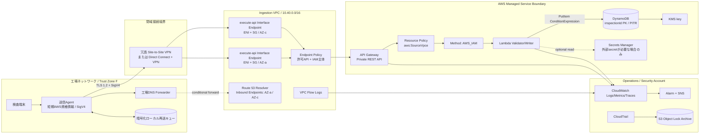

[[Home]]

# Weekly Cloud Engineer Magazine — 2026-10-09

> [!summary] 今週の一問
> 工場ネットワークから送る品質検査結果を、**公開IPを持つ入口なし**でAWSへ受け入れられるか。今週はサービス列挙ではなく、通信経路・名前解決・ポリシーを重ねて「到達できる主体」を狭める。

> [!warning] 課金・安全
> このラボで Interface VPC Endpoint、NAT Gateway、Site-to-Site VPN、Direct Connect 等を実作成すると課金される。特にエンドポイントはAZごとの時間課金である。手順はまずテンプレート検証と設計レビューまで進め、実作成はサンドボックスで予算アラートを設定してから行うこと。削除前に対象スタック名・保持すべきログを確認する。実認証情報、実工場CIDR、顧客データは使わない。

## 1. アプリ、主クラウド、焦点、難易度、前提、到達点

- **アプリ:** 製造工場の検査端末から、製品シリアル、検査項目、合否、測定値を中央へ送る「品質検査結果受付API」。画像や大容量ファイルは扱わず、1リクエスト64KB以下のJSONに限定する。
- **主クラウド:** AWS（ap-northeast-1想定）
- **主 criterion:** **Network boundaries（非公開の受付面、到達経路、DNS、ポリシー境界）**
- **難易度シグナル:** **Intermediate**。学習順序のゲートではない。VPCとIAMの基礎があれば着手できる。

### 必要知識・道具・環境・先行概念

- **知識:** CIDR、ルートテーブル、Security Group、Private DNS、TLS、REST、IAMの明示的Deny。
- **道具:** AWS CLI v2、Git、任意のエディタ、`curl`、CloudFormation Linter（任意）。
- **環境:** 実作成する場合は個人サンドボックスAWSアカウント、権限境界、AWS Budgets。工場側はラボ用VPC内EC2またはCloudShell相当で模擬する。
- **先行概念:** 送信元認証とネットワーク到達性は別物、DNS名は到達性を保証しない、API Gateway resource policyとVPC endpoint policyは異なる評価点、at-least-once再送には冪等性が必要。
- **認証情報:** 実ユーザーの長期アクセスキーを作らない。SSO/短期セッションを使い、本文中のIDはすべてダミーにする。

### 測定可能な到達点

1. 許可VPC endpoint経由の署名済みPOSTは `202`、インターネットおよび別endpoint経由は到達不能または `403` になる。
2. `inspectionId` の条件付き書込みで同一結果の二重登録を0件にする。
3. 正常系p95 500ms以内、5xx率0.1%未満をダッシュボードで判定できる。
4. 入口の四層（経路、SG、endpoint policy、API resource policy）を図とテスト証跡で説明できる。
5. endpointを1 AZ失う演習で、RTO 30分以内・RPO 0を検証する。

## 2. 要件と明示的仮定

### 機能要件

- `POST /v1/inspections` で結果を受け、構文・範囲・工場IDを検証して `202 Accepted` を返す。
- `inspectionId` を冪等キーにして再送を安全にする。
- 工場単位で論理分離し、不正工場ID、期限切れ署名、過大payloadを拒否する。
- オペレーターが受付数、拒否数、遅延、工場別の最終受信時刻を確認できる。

### 非機能要件とワークロード見積り

|項目|仮定・目標|
|---|---|
|工場数|30拠点|
|通常負荷|各工場平均0.2 req/s、全体6 req/s|
|ピーク|各工場2 req/s、全体60 req/sを15分|
|月間要求|約1,600万件（平均6 req/s × 30日、丸め）|
|payload|要求平均8KB、応答1KB、最大64KB|
|整合性|同じ `inspectionId` の重複保存禁止。受領後の参照は結果整合性で可|
|SLO|月間成功率99.95%。サーバ処理p95 500ms、p99 1秒|
|RTO / RPO|単一AZ/endpoint障害: RTO 30分、RPO 0。リージョン障害: RTO 8時間、RPO 15分|
|保持|業務データ400日、アクセスログ90日、監査ログ7年（例示）|
|予算枠|初期 **月150〜350 USDの概算枠**。専用線・工場回線・ログ長期保管は別枠|

### コンプライアンス仮定

- 個人情報は含まず、製造機密として扱う。国内リージョン保管、転送時TLS 1.2以上、保存時暗号化、操作監査を要求する。
- 「private」は暗号化や認証の代用ではない。閉域到達でもSigV4、入力検証、最小権限を維持する。
- 7年保持は監査ログのみ。API本文をアクセスログへ出さない。法令・契約の最終判断は法務/セキュリティ部門が行う。

## 3. ADR-001: 工場からのAPI受付境界

### 検討案

|案|到達面|長所|短所|
|---|---|---|---|
|A. Public API Gateway + mTLS/WAF|インターネット公開|導入が速く、回線に依存しにくい|公開面を持つ。IP許可リスト運用、証明書ライフサイクルが必要|
|B. ALB/NLB + ECS|VPC内または公開|プロトコル/実装自由度、長時間処理|LB・コンテナ・パッチ・スケールの運用面が増える|
|C. **Private REST API + Interface VPC Endpoint**|VPC/DX/VPN経由のみ|公開IP不要。`aws:SourceVpce` とendpoint policyで境界を多層化|REST API限定。endpoint時間課金、DNS設計、接続回線が必要|
|D. S3へのバッチ配置|S3 private endpoint|切断耐性、安価、再送容易|即時検証/応答というAPI要件に合わない|

### 決定

**Cを採用**する。各工場は冗長VPNまたはDirect Connect経由で共有Ingestion VPCへ到達し、Route 53 Resolverのinbound endpointを使ってprivate API名を解決する。API Gateway Private REST APIは2 AZの `execute-api` Interface VPC Endpointに関連付ける。統合先はLambda、保存先はDynamoDBとし、公開ALB/NAT Gatewayは置かない。

### 主要トレードオフ

- ネットワーク到達性、endpoint policy、API resource policy、IAM authorizationの**全部**を満たす必要があり、誤設定の診断は複雑になる。その代わり、一つの制御ミスを別層で止められる。
- endpointを工場ごとに増やさず共有し、工場IDはIAM principal/session tagと業務payloadの照合で分離する。コストを抑える一方、共有endpointの変更影響範囲は広い。
- API Gateway private REST APIはHTTP APIより単価が高く、REST機能に固定される。今回の非公開入口とresource policy制御を優先する。
- リージョンDRはactive-passive。常時二重書込みはRPOを改善するが、整合性・費用・運用が要件に対して過大なので却下する。

### 却下した誤解

- **SGだけで十分:** SGはL3/L4到達性を制御するだけで、API/メソッド/主体を認可しない。
- **Private DNSならprivate:** DNS応答は境界ではない。ルートとポリシーが必要。
- **VPNなら認証不要:** VPNはネットワーク接続を認証するが、個々のAPI呼出主体は識別しない。

## 4. 詳細アーキテクチャとフロー



### リクエスト/データフロー

1. 端末は結果をローカル暗号化キューへ記録し、Agentへ渡す。切断時は指数バックオフし、同じ `inspectionId` で再送する。
2. 工場DNSは対象private APIゾーンだけをRoute 53 Resolverへ条件付き転送する。全DNSをクラウドへ転送しない。
3. パケットはVPN/DXからVPCへ入り、SGが工場CIDRからendpoint ENIのTCP/443だけ許可する。NAT/Internet Gateway経路は使わない。
4. endpoint policyが許可APIとIAM主体を絞り、API resource policyが `aws:SourceVpce` を検査する。
5. API GatewayがSigV4/IAM認証、payload上限・schemaを検査しLambdaを呼ぶ。
6. Lambdaはprincipalに許可された `factoryId` と本文を照合し、DynamoDBへ条件付きPutする。重複は既存受付として200系で返す。
7. APIは `202` と相関IDを返す。本文や測定値はアクセスログへ出さない。

## 5. IAM、信頼境界、暗号化、ネットワーク、secret、テレメトリ

### IAMとポリシー評価

送信Agentには特定stage/method/pathだけを許可する。`*` resourceを使わない。

```json
{
  "Version": "2012-10-17",
  "Statement": [{
    "Effect": "Allow",
    "Action": "execute-api:Invoke",
    "Resource": "arn:aws:execute-api:ap-northeast-1:111122223333:api-id/prod/POST/v1/inspections"
  }]
}
```

API resource policyでは明示的Denyを先に置く。以下のIDはダミーである。

```json
{
  "Version": "2012-10-17",
  "Statement": [
    {
      "Sid": "DenyUnlessApprovedVpce",
      "Effect": "Deny",
      "Principal": "*",
      "Action": "execute-api:Invoke",
      "Resource": "execute-api:/*",
      "Condition": {"StringNotEquals": {"aws:SourceVpce": "vpce-0example123"}}
    },
    {
      "Sid": "AllowInvokeAfterBoundaryCheck",
      "Effect": "Allow",
      "Principal": {"AWS": "arn:aws:iam::111122223333:role/FactoryIngestRole"},
      "Action": "execute-api:Invoke",
      "Resource": "execute-api:/prod/POST/v1/inspections"
    }
  ]
}
```

- Lambda実行role: 対象テーブルへの `dynamodb:PutItem`、必要なKMS `Encrypt/Decrypt`、指定log groupへの書込みのみ。
- デプロイrole、運用閲覧role、送信roleを分離。人の管理操作はSSO + MFA。CloudTrail変更監査を有効化。
- endpoint policyは対象API ARNと送信roleのみ許可。endpoint policyはAPI resource policyの代替ではない。

### 境界ごとの責務

|境界|許可するもの|拒否/検知|
|---|---|---|
|工場LAN→WAN|AgentからTCP/443、DNS forwardのみ|端末の直接外向き通信|
|VPN/DX→VPC|許可工場prefixからendpoint/Resolverのみ|重複CIDR、想定外route、非対称経路|
|Endpoint SG|工場CIDR→443|0.0.0.0/0、管理ポート|
|Endpoint policy|指定role→指定API|別API/別principal|
|API resource policy|指定 `aws:SourceVpce`|他endpoint、public path|
|Method IAM|署名済み `execute-api:Invoke`|匿名、期限切れ署名|
|アプリ|principalとfactoryId一致|越境、不正schema、重複|

### 暗号化・secret

- TLS 1.2で転送。DynamoDB、logs、アーカイブは顧客管理KMS keyを使う場合、key policyにも実行roleと管理roleを最小許可する。
- SigV4用に端末へ長期IAM user keyを埋め込まない。工場Agentが企業IdP/証明書ブローカーから短期資格情報を取得する設計にする。ラボではSSO短期セッションのみ。
- アプリsecretがなければSecrets Managerを「念のため」追加しない。外部システムsecretが必要になった場合のみ格納し、環境変数へ平文固定しない。

### logs / metrics / traces

- **Logs:** API access logはrequest ID、principal、sourceVpce、status、latency、factory pseudonymのみ。payload、Authorization、測定値は除外。Lambdaは構造化JSON。
- **Metrics:** `Count`, `4XXError`, `5XXError`, `Latency`, `IntegrationLatency`, Lambda errors/throttles/duration、DynamoDB throttles、VPN tunnel state、Resolver query errors。
- **Traces:** X-RayでAPI→Lambdaを関連付ける。サンプリングし、機密属性をannotationへ載せない。
- **Network evidence:** VPC Flow Logsをendpoint ENIに有効化。ただしFlow Logsはpayloadを記録せず、IAM/API拒否理由も示さない。各層のログを相関IDと時刻で突合する。

## 6. 容量・コストモデル

> [!info] 見積り条件
> 以下は設計比較用の**概算**。価格確認日は2026-10-09。AWS公式料金ページの公開例（米国東部/オレゴン: private REST API 100万件あたり$3.50、Interface endpoint $0.01/AZ時、処理$0.01/GB）を計算基準に使う。東京リージョンの請求額ではないため、実施前にAWS Pricing Calculatorで `ap-northeast-1`、税、通貨、無料枠、ログ量を再計算する。

### 容量

- 平均6 req/s、ピーク60 req/sなのでAPI/Lambdaの一般的な初期上限より十分小さいが、**クォータはアカウント/リージョンで確認**する。
- 平均9KB往復 × 1,600万 = 約144GB/月。10倍バーストでもネットワーク帯域より、ログ量とDynamoDB書込み設計が先に支配しやすい。
- Lambda平均80ms、128MBなら月間computeは約177.8 GB-s（16M × 0.08 × 0.125）。同時実行の平均は0.48、60 req/s時でも平均4.8。初期reserved concurrency 50を安全弁とする。
- DynamoDB itemを平均2KBとすると1件が2 write request units相当。on-demandで開始し、throttleと利用の安定後にprovisioned/auto scalingを比較する。
- 400日分のraw dataは 16M × 2KB × 13.1か月 ≈ 419GB（index、属性名、backupを除く）。TTL削除は即時ではないため容量計画に余裕を持つ。

### 概算式（USD/月、主にus-east公式公開例ベース）

|項目|式|概算|注意|
|---|---:|---:|---|
|Private REST API|16M × $3.50/M|$56|段階料金・リージョン差あり|
|Interface endpoint時間|2 AZ × 720h × $0.01|$14.40|endpoint共有を前提|
|Endpoint data processing|144GB × $0.01|$1.44|段階料金あり|
|Lambda request|16M × $0.20/M|$3.20|無料枠・リージョン差を除外|
|Lambda compute|177.8 GB-s × $0.0000166667|約$2.96|x86/128MB、概算|
|DynamoDB write|32M WRU × 地域単価|要Calculator|2KB item仮定。最大の変動要因|
|Logs/X-Ray/KMS/backup|取込GB・保持・呼出数で算定|要計測|payloadをログしないことが費用にも効く|
|VPN/DX/Resolver|接続時間・転送・IP/endpoint時間|別枠|工場数と冗長方式で大きく変動|

API + endpoint + Lambdaの単純合計は**約$78/月**（DynamoDB、接続、監視、バックアップ等を除外）。従って月150〜350 USD枠は初期のクラウド受付面として妥当な仮説だが、30拠点の回線費は含めない。

### FinOps判断

- endpointは1 APIごとではなく、信頼境界が同じAPI間で共有する。ただし共有blast radiusをADRへ記録する。
- 全payloadをlogsへ出さず、必要な構造化フィールドだけを保存する。
- DynamoDB item sizeとGSI数をメトリクス化。2KB→4KBでwrite費用がほぼ倍になる影響を先に試算する。
- NAT Gatewayを置かない設計により固定費と意図しないegressを避ける。

## 7. 150分ガイドラボ

### 0–15分: 設計と安全ガード

1. ダミーCIDR `10.90.0.0/16`（工場）と `10.40.0.0/16`（Ingestion）を紙上で割り当てる。
2. AWS Budgetの通知先と上限を確認。実作成しない場合はこの確認結果だけを記録する。
3. `aws sts get-caller-identity` で短期セッションのaccount/roleを確認し、出力は提出物へ貼らない。

**Checkpoint A:** CIDR非重複、作業account/region、課金停止条件、cleanup ownerが表になっている。

### 15–40分: IaCの静的作成

CloudFormationまたはTerraformで次を定義する。

- 2 AZ private subnet、route tables。Internet Gateway/NAT Gatewayは定義しない。
- `com.amazonaws.ap-northeast-1.execute-api` Interface endpoint、private DNS、2 subnet、専用SG。
- DynamoDB table（PK `inspectionId`、PITR、KMS、deletion protectionは本番のみ）。
- Lambda、最小権限role、log groupと保持期間。
- Private REST API、`AWS_IAM` method、resource policy、access log、metrics。

**Validation:** `aws cloudformation validate-template --template-body file://template.yaml`。`cfn-lint template.yaml` があれば実行。

**Checkpoint B:** テンプレートに `0.0.0.0/0` ingress、公開subnet、アクセスキー、実account IDがない。

### 40–65分: ポリシーを四層に分ける

1. Endpoint SG: factory test CIDRからTCP/443のみ。
2. Endpoint policy: 指定role、`execute-api:Invoke`、指定APIだけ。
3. API resource policy: `StringNotEquals aws:SourceVpce` の明示的Deny。
4. IAM caller policy: prod/POST/v1/inspectionsだけ。
5. Lambda role: 指定tableへのPutItemと指定log groupのみ。

**Validation:** IAM Access Analyzer policy validationを使い、wildcardと条件キーをレビューする。

**Checkpoint C:** 「どの層が何を拒否するか」を5行で説明できる。

### 65–95分: ハンドラーと冪等性

擬似コード:

```python
def handler(event, context):
    body = parse_and_validate(event["body"], max_bytes=65536)
    principal_factory = factory_from_verified_context(event)
    if body["factoryId"] != principal_factory:
        return response(403)
    try:
        table.put_item(
            Item=normalize(body),
            ConditionExpression="attribute_not_exists(inspectionId)"
        )
        return response(202, {"requestId": context.aws_request_id})
    except ConditionalCheckFailedException:
        return response(202, {"duplicate": True})
```

単体テスト: 正常、必須属性不足、64KB超、factory不一致、同一ID二回、DynamoDB timeout。ログに本文がないこともassertする。

**Checkpoint D:** 二回目も業務的成功だがitem数は1。403にした入力の本文がlogへ残らない。

### 95–125分: デプロイまたは変更セット確認

> [!warning] ここから課金可能
> 無人・共有・本番accountでは実行しない。サンドボックスと予算通知を確認してから、まずchange setを作り、意図したリソースだけかレビューする。

- 安全モード: `aws cloudformation create-change-set --change-set-type CREATE ...` まで。変更セットを表示し、実行しない。
- 実作成を許可されたラボ: stackを作成後、VPC内のテストclientからSigV4署名してPOSTする。
- 正例: 許可endpoint + 許可role → 202。
- 負例1: 許可endpoint + 未許可role → 403。
- 負例2: 別VPC/インターネット → DNS/routeで到達不能、またはresource policyで403。
- 負例3: 本文のfactoryId越境 → 403。

**Checkpoint E:** 4テストの時刻、request ID、期待/実結果を表にし、ログ相関を示す。

### 125–145分: 可観測性と障害注入

- dashboard: API count/4xx/5xx/p95、Lambda errors/throttles、DynamoDB throttles、VPN tunnel state。
- alarm: 5xx > 1%を5分、受信0件を工場営業時間内15分、両VPN tunnel down、DynamoDB throttle > 0。
- 一方のendpoint subnetへのテスト経路をラボ上で外し、別AZへ到達できることを確認する。Security Groupそのものを広げる操作はしない。

**Checkpoint F:** 復旧検知時間、切替時間、失敗/再送件数を記録し、RTO/RPO判定を書く。

### 145–150分: Cleanup

> [!danger] 削除前確認
> 対象がラボstackであること、必要なテスト証跡をエクスポート済みであること、他環境と共有するendpoint/DNS/routeでないことを確認する。

1. change setだけなら削除する。
2. 実stackならDynamoDBのラボデータ保持不要を確認し、stackを削除する。
3. stack削除完了後も、log group、PITR backup、ENI、Route 53 Resolver endpoint、VPN、KMS key scheduleが残っていないか確認する。
4. KMS key削除予約は即時削除ではない。共有keyなら予約しない。

**Expected result:** Interface endpointと関連ENIが消え、時間課金が止まり、ラボ用stackが `DELETE_COMPLETE` になる。

## 8. 障害シナリオ、回復/DR演習、運用runbook

### シナリオ: 誤ったendpoint policy更新 + 片系VPN断

10:00にendpoint policyのAPI ARN誤記で全工場が403。同時に片系VPNがdown。ネットワークチームはVPNを疑うが、もう一方のtunnelは正常でTCP/443も到達する。

### 診断順序

1. **影響確認:** 工場別最終受信、API 4xx/5xx、VPN tunnel、Flow Logsを確認。受付停止を宣言する。
2. **L3/L4:** DNS解決、route、VPN、SG、Flow LogsのACCEPTを確認。ここが通れば「ネットワーク全断」ではない。
3. **認可:** API access logのstatus、CloudTrailのendpoint policy変更、IAM principal、sourceVpceを確認。
4. **緩和:** 直前に承認済みのendpoint policy版へロールバック。`Principal:*` や全API許可へ広げて直さない。
5. **回復:** synthetic requestが202、各工場backlogが減少、重複itemが0であることを確認。
6. **事後:** policy validation、canary工場、段階deploy、変更アラームを追加する。

### 回復/DR演習

- **AZ演習:** endpoint ENI 1つを利用不可と見立て、DNS/接続がもう一方へ回復するまでを計測。Agentの再送でRPO 0を確認。
- **データ復元:** DynamoDB PITRを別名tableへ復元し、件数・代表hash・暗号鍵・TTL/GSI設定を検証。復元tableを本番へ自動接続しない。
- **リージョン演習:** IaCを待機リージョンで検証し、DynamoDB export/backupから復元、private DNS conditional forwardの変更手順を机上実施。RTO 8時間/RPO 15分を満たさなければGlobal Tables等を次ADRで検討する。

### 短縮runbook

|症状|最初の証拠|判断|安全な操作|
|---|---|---|---|
|DNS失敗|Resolver query log|forward rule/endpoint障害|承認済みDNS設定へ戻す|
|timeout|VPN metric + Flow Logs|route/SG/endpoint ENI|健全tunnel/AZへ切替|
|403|API access log + CloudTrail|endpoint/resource/IAM/app拒否|直前の承認済みpolicyへrollback|
|5xx|API/Lambda/DDB metrics|integration/依存障害|reserved concurrency、再送抑制、DLQ判断|
|重複急増|ConditionalCheckFailed count|client再送/応答欠落|冪等処理を維持し、Agent backoff調整|

## 9. AWS / OCI / GCP対応とportability

|役割|AWS（主実装）|OCI|GCP|
|---|---|---|---|
|閉域接続|Site-to-Site VPN / Direct Connect|Site-to-Site VPN / FastConnect + DRG|Cloud VPN / Cloud Interconnect + Cloud Router|
|private API入口|API Gateway Private REST API + execute-api Interface VPC Endpoint|Private API Gateway in private regional subnet|Apigee + Private Service Connect、または内部Application Load Balancer + serverless NEG等を要件別選択|
|private service接続|AWS PrivateLink|OCI Private Endpoint / private subnet|Private Service Connect|
|DNS連携|Route 53 Resolver inbound endpoint|OCI DNS resolver endpoint|Cloud DNS inbound forwarding|
|実行|Lambda|OCI Functions|Cloud Run / Cloud Functions|
|key-value store|DynamoDB|NoSQL Database Cloud Service|Firestore|
|監査/観測|CloudTrail, CloudWatch, X-Ray, Flow Logs|Audit, Logging, Monitoring, APM, VCN Flow Logs|Cloud Audit Logs, Cloud Logging/Monitoring/Trace, VPC Flow Logs|

### 移植性とlock-in

- **移植しやすい:** JSON schema、OpenAPI、相関ID、冪等キー、CIDR台帳、SLO、runbook、OpenTelemetryのtrace設計。
- **移植しにくい:** `aws:SourceVpce` 条件、execute-api ARN、SigV4、API Gateway resource policy、DynamoDB ConditionExpression。
- OCIはAPI Gateway自体をprivate front endとしてVCN/peering/on-premから到達させられる。AWSの「serviceのinterface endpoint + resource policy」と制御点が同一ではない。
- GCPのPrivate Service Connectはproducer/consumer接続とaccept/reject list、org policyを使う。API管理面まで同じサービスで置換できるとは限らず、Apigeeまたは内部LB構成の設計が必要。
- 抽象化のためだけのKubernetes導入はしない。移植性はまずOpenAPI、テスト、IaC module interface、データexportで確保する。

## 10. Well-Architected形式レビューと本番準備

### レビュー

- **Operational Excellence:** policy変更はGitレビュー、change set、canary、rollback版を必須化。runbook ownerと四半期演習日を決める。
- **Security:** private到達 + SigV4 + resource/endpoint policy + app tenant check。全層で最小権限、CloudTrail保全、secret非埋込み。
- **Reliability:** 2 AZ endpoint、冗長VPN、client buffer/再送、冪等Put、PITR。依存先のquotaと障害モードを確認。
- **Performance Efficiency:** p95/p99、Lambda concurrency、item size、DNS/接続時間を負荷試験で測る。推測でprovisioned concurrencyを買わない。
- **Cost Optimization:** endpoint共有、NATなし、構造化小容量logs、DynamoDB item/GSI節約。回線費を別建てで可視化。
- **Sustainability:** 不要データ/logを保持し続けず、batch可能な監査exportをまとめる。過剰な常時待機リソースを避ける。

### Production-readiness checklist

- [ ] 工場CIDRに重複がなく、source of truthとownerがある
- [ ] VPN/DX、Resolver、endpointがAZ/装置障害に冗長
- [ ] endpoint SGに `0.0.0.0/0` ingressがない
- [ ] endpoint policyとAPI resource policyを別々に負例テストした
- [ ] IAM caller policyがstage/method/pathまで限定
- [ ] 長期access keyを端末へ配布していない
- [ ] factoryIdをverified principalと照合する
- [ ] payload/Authorizationをlogsへ出していない
- [ ] 冪等性、retry/backoff、最大滞留時間を負荷試験した
- [ ] 4xx/5xx/無通信/VPN/DDB throttle alarmのownerがいる
- [ ] quota、予算、log保持、KMS key policyをレビュー済み
- [ ] PITRから別tableへの復元を実測した
- [ ] DNS切替とpolicy rollbackのrunbookを演習した
- [ ] RTO/RPO/SLOを事業ownerが承認した
- [ ] データ保持・国内保管・監査要件を法務/セキュリティが承認した

## 11. 具体的な提出物

1. `architecture.md`: Mermaid図、境界表、ADR-001。
2. `template.yaml`: VPC、endpoint、API、Lambda、DynamoDB、logs/alarms（実ID/secretなし）。
3. `policies/`: caller、endpoint、API resource、Lambda roleの4文書。
4. `tests/contract/`: 正常、重複、越境、過大payloadのテスト。
5. `evidence.md`: 4つの到達性テスト、request ID、期待/実結果、log相関。
6. `capacity-cost.xlsx` またはMarkdown: 入力値、式、リージョン価格確認日、除外項目。
7. `runbook.md`: DNS、timeout、403、5xx、復元、cleanup。
8. `dr-report.md`: AZ障害/PITR演習の実測RTO/RPOと改善action。

## 12. 理解度確認

### 5問

1. Private DNSを有効にすれば、許可していない主体からAPIを守れるか。
<details><summary>答え</summary>守れない。DNSは名前解決であり認可ではない。経路/SG、endpoint policy、API resource policy、IAM、アプリ認可を組み合わせる。</details>

2. `aws:SourceVpce` を使うresource policyとendpoint policyの違いは何か。
<details><summary>答え</summary>resource policyはAPI側で「どのendpoint等からAPIを呼べるか」を評価する。endpoint policyはendpoint側で「どのprincipalがどのservice resourceへ出られるか」を制御する。両方を満たす必要がある。</details>

3. 送信Agentが202応答を受け取れず同じ結果を再送した。二重登録をどう防ぐか。
<details><summary>答え</summary>client生成の安定したinspectionIdをPKにし、`attribute_not_exists(inspectionId)` の条件付きPutを使う。条件失敗は業務上の既受付として扱う。</details>

4. Flow LogsがACCEPTなのにAPIが403を返す。次にどこを見るか。
<details><summary>答え</summary>Endpoint policy、API resource policy、Method IAM、SigV4のprincipal/時刻、アプリのfactory照合を、API access logとCloudTrailで順に確認する。L3/L4は通っている。</details>

5. endpointを1 AZから2 AZへ増やすと何が変わるか。
<details><summary>答え</summary>AZ障害耐性が上がる一方、endpointのAZ時間課金が増える。DNS/route/client retryが実際に別AZを使えることを演習しなければ、作成しただけではRTOを証明できない。</details>

### 設計・面接質問

「30工場のうち5工場だけが重複CIDRを持ち、回線断が頻発する。公開入口を増やさず、工場ごとの追跡可能性と最小権限を維持する接続方式、NAT/アドレス変換位置、DNS、IAM、再送設計をどう変えるか。障害時にどの証拠でネットワーク問題と認可問題を切り分けるか。」

### Optional advanced challenge（45–90分追加）

API access log、Flow Logs、CloudTrail変更イベントを時系列で結ぶ「403診断クエリ」をCloudWatch Logs Insightsで作る。次に、Endpoint policyへ誤ったAPI IDを入れる変更を静的fixtureとして再現し、canary失敗で本番展開を止めるCIテストを設計する。実環境へ障害注入する必要はない。

## 13. 公式リファレンス（2026-10-09確認）

### AWS（主実装）

- [Private REST APIs in API Gateway](https://docs.aws.amazon.com/apigateway/latest/developerguide/apigateway-private-apis.html)
- [Create a private API](https://docs.aws.amazon.com/apigateway/latest/developerguide/apigateway-private-api-create.html)
- [VPC endpoint policies for private APIs](https://docs.aws.amazon.com/apigateway/latest/developerguide/apigateway-vpc-endpoint-policies.html)
- [API Gateway resource policies](https://docs.aws.amazon.com/apigateway/latest/developerguide/apigateway-resource-policies.html)
- [AWS PrivateLink / Interface endpoints](https://docs.aws.amazon.com/vpc/latest/privatelink/concepts.html)
- [Route 53 Resolver endpoints](https://docs.aws.amazon.com/Route53/latest/DeveloperGuide/resolver.html)
- [DynamoDB conditional operations](https://docs.aws.amazon.com/amazondynamodb/latest/developerguide/Expressions.ConditionExpressions.html)
- [API Gateway pricing](https://aws.amazon.com/api-gateway/pricing/)
- [AWS PrivateLink pricing](https://aws.amazon.com/privatelink/pricing/)
- [AWS Lambda pricing](https://aws.amazon.com/lambda/pricing/)
- [AWS Pricing Calculator](https://calculator.aws/)

### OCI（対応比較）

- [API Gateway concepts](https://docs.oracle.com/en-us/iaas/Content/APIGateway/Concepts/apigatewayconcepts.htm)
- [Create a VCN for API Gateway](https://docs.oracle.com/en-us/iaas/Content/APIGateway/Tasks/apigatewaycreatingvcn.htm)
- [Site-to-Site VPN](https://docs.oracle.com/en-us/iaas/Content/Network/Tasks/overviewIPsec.htm)
- [FastConnect](https://docs.oracle.com/en-us/iaas/Content/FastConnect/home.htm)
- [VCN security rules](https://docs.oracle.com/en-us/iaas/Content/Network/Concepts/securityrules.htm)

### GCP（対応比較）

- [Private Service Connect overview](https://cloud.google.com/vpc/docs/private-service-connect)
- [Private Service Connect security](https://cloud.google.com/vpc/docs/private-service-connect-security)
- [Cloud VPN overview](https://cloud.google.com/network-connectivity/docs/vpn/concepts/overview)
- [Cloud Interconnect overview](https://cloud.google.com/network-connectivity/docs/interconnect/concepts/overview)
- [Cloud DNS inbound server policies](https://cloud.google.com/dns/docs/server-policies-overview)
- [VPC Flow Logs](https://cloud.google.com/vpc/docs/flow-logs)

---

**今週の要点:** 「インターネット非公開」は設計の結論ではなく出発点である。到達経路、DNS、SG、endpoint policy、API resource policy、IAM、アプリのtenant検査を、それぞれ独立して負例テストして初めて境界を説明できる。
