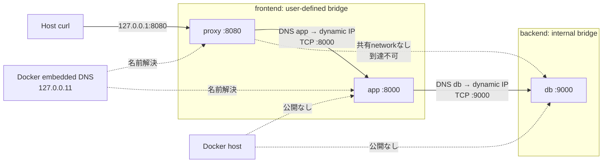
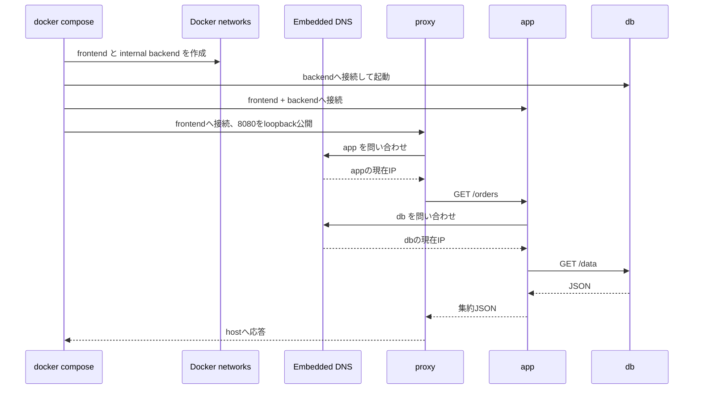

# Weekly Docker Magazine — Composeネットワーク分離とサービス名DNS

#docker #containers #weekly #deep-dive

[[Home]]

> [!warning] 削除操作とSecrets
> `docker system prune` / `docker network prune` / `docker image prune` / `docker rmi` / `docker rm -f` は、別プロジェクトの資産や稼働中コンテナまで失わせる可能性がある。実行前に対象を必ず確認し、共有ホストでは安易に使わない。本ラボの後片付けはプロジェクト限定の `docker compose down --remove-orphans` を使う。
>
> APIキー、証明書秘密鍵、DBパスワード等をDockerfile、イメージ、`compose.yaml`、Git管理下の`.env`へ絶対に埋め込まない。本ラボは秘密情報を必要としない。本番では専用のsecret管理と実行時注入を使う。

## 1. Focus、難易度、前提、測定可能な到達点

**本番基準：必要な通信経路だけをComposeネットワークで許可し、アプリが変動するコンテナIPではなく安定したサービス名を解決して接続し、障害時に「DNS・経路・待受・アプリ」のどこが壊れたかを証拠で切り分けられること。**

- Difficulty signal: **Intermediate**（目安であり、参加を制限するものではない）
- 必要知識：IPv4、TCPポート、DNS名、HTTPステータスの初歩
- 先行概念：イメージとコンテナ、Compose service、ポート公開、`logs` / `exec` / `inspect`
- ツール：現行Docker EngineまたはDesktop、Compose v2、`curl`、テキストエディタ
- 環境：Linuxコンテナ、空きRAM 1 GiB程度、ホストの`127.0.0.1:8080`が空いていること
- 以前の概念との接続：先週のCPU・メモリ制限は「資源境界」、今回は「通信境界」。両方が揃ってblast radiusを狭める

150分後の合格条件は次のとおり。

1. `proxy → app → db`だけを許す2ネットワーク構成をComposeで再現する。
2. `app`を再作成してIPが変わっても、`proxy`がサービス名`app`を再解決して復旧することを確認する。
3. `proxy`から`db`へ到達できないことを、ネットワーク所属と名前解決の両方で検証する。
4. 故障を注入し、DNS、TCP接続、HTTP、アプリログの順に原因を特定する。
5. 公開ポート数、イメージサイズ、起動時間、到達性マトリクスを記録し、本番判定を残す。

## 2. 実アプリのシナリオと制約

社内の注文照会APIを1台のDockerホストで動かす。入口のリバースプロキシだけがホストへ公開され、APIは直接公開しない。データサービスはAPIからだけ利用できる必要がある。

```text
利用者 → proxy:8080 → app:8000 → db:9000
```

制約：

- ホストへ公開するのは`127.0.0.1:8080`だけ
- `proxy`は`db`の名前を解決も接続もできない
- `db`は外部ネットワークへ出る必要がない
- コンテナIPは再作成で変わるため設定へ固定しない
- アプリ接続先は`db:9000`、プロキシ接続先は`app:8000`というサービス名を使う
- 依存サービスの一時停止・再作成を前提に、クライアントは再接続できること
- 教材はlocalhost限定。本番ではTLS終端、認証、ホストFW、オーケストレータ側ポリシーも別途必要

## 3. コンテナ／ランタイムのmental model

コンテナごとにnetwork namespaceがあり、独自のinterface、IP、route、loopbackを持つ。`localhost`は**そのコンテナ自身**であって、隣のコンテナやホストではない。

Composeは既定でプロジェクト専用のuser-defined bridgeを作る。同じネットワークのserviceはDockerの組み込みDNSに登録され、service名で発見できる。custom network上の`/etc/resolv.conf`では通常`127.0.0.11`が組み込みDNSを示し、外部名はホスト側DNSへ転送される。

重要な4層：

1. **名前解決**：`app`をIPへ変換できるか
2. **経路・分離**：送信元と宛先が共有ネットワークを持つか
3. **TCP待受**：宛先プロセスが正しいinterface/portでlistenしているか
4. **application protocol**：HTTP等が期待どおり応答するか

`ports`はホスト側からコンテナへ入口を作る。service間通信にはhost portでなく**container port**を使う。`expose`は説明的な内部ポート宣言であり、ネットワーク境界やFWそのものではない。同一user-defined bridge上のserviceは、公開していないコンテナポートにも到達し得る。



> [!note] 境界の限界
> Composeのbridge分離は1 Docker daemon内のL3/L4到達性を整理する。プロセス脆弱性、ホスト侵害、認証、暗号化、複数ホスト間のNetworkPolicyを置き換えない。

## 4. 設計代替案と明示的trade-off

| 選択肢 | 長所 | 短所／採用判断 |
|---|---|---|
| Compose既定network 1枚 | 最小設定、service discoveryがすぐ使える | 全serviceが相互到達可能。小規模開発向き |
| frontend/backendの2枚 | least connectivityを表現し、侵害時の横移動を縮小 | 定義と検証が増える。本号で採用 |
| backendを`internal: true` | backendに外向きdefault gatewayを与えない | DBの更新取得や外部APIアクセスが必要なら不適。二重所属service経由の中継は防がない |
| host network | NAT overheadが少なくhost portへ直接アクセス | network isolationとCompose DNSを失い、port衝突・露出が増える。特殊な監視等のみ |
| static IP | 一部legacy allowlistに合わせやすい | 再配置性、scale、衝突回避が悪化。service名を原則にする |
| `extra_hosts` | Docker DNS外の固定legacy endpointを補える | `/etc/hosts`の静的対応でfailoverに弱い。service discovery代替にしない |
| 外部共有network | 別Compose projectを接続できる | 意図しない横断接続と名前衝突を管理する必要 |
| overlay | Swarmの複数host間を接続 | 単一hostラボには複雑。Kubernetes等では別のnetwork modelを使う |

## 5. Architecture/build flow



## 6. Guided lab（約150分）

### 時間配分

- Foundation（mental modelと準備）：20分
- Practical implementation（構築・正常系）：55分
- Production concerns（測定・分離検証）：35分
- Failure injection / debugging：30分
- Optional advanced challenge：10分以上

### 6.1 作業ディレクトリ（5分）

```bash
mkdir -p docker-network-lab/proxy docker-network-lab/app docker-network-lab/db
cd docker-network-lab
```

以降の4ファイルを**そのまま**作る。

### 6.2 `compose.yaml`

```yaml
name: docker-network-lab

services:
  proxy:
    build: ./proxy
    ports:
      - "127.0.0.1:8080:8080"
    environment:
      UPSTREAM_HOST: app
      UPSTREAM_PORT: "8000"
    networks:
      - frontend
    depends_on:
      app:
        condition: service_healthy
    read_only: true
    tmpfs:
      - /tmp
    cap_drop:
      - ALL
    security_opt:
      - no-new-privileges:true

  app:
    build: ./app
    environment:
      DB_HOST: db
      DB_PORT: "9000"
    expose:
      - "8000"
    networks:
      - frontend
      - backend
    depends_on:
      db:
        condition: service_healthy
    healthcheck:
      test: ["CMD", "python", "-c", "import urllib.request; urllib.request.urlopen('http://127.0.0.1:8000/healthz')"]
      interval: 5s
      timeout: 2s
      retries: 10
    read_only: true
    tmpfs:
      - /tmp
    cap_drop:
      - ALL
    security_opt:
      - no-new-privileges:true

  db:
    build: ./db
    expose:
      - "9000"
    networks:
      - backend
    healthcheck:
      test: ["CMD", "python", "-c", "import urllib.request; urllib.request.urlopen('http://127.0.0.1:9000/healthz')"]
      interval: 5s
      timeout: 2s
      retries: 10
    read_only: true
    tmpfs:
      - /tmp
    cap_drop:
      - ALL
    security_opt:
      - no-new-privileges:true

networks:
  frontend:
    driver: bridge
    driver_opts:
      com.docker.network.bridge.host_binding_ipv4: "127.0.0.1"
  backend:
    driver: bridge
    internal: true
```

#### 行ごとの意味

- `name`：directory名に依存しないproject名に固定し、network名を予測可能にする。
- `build`：各directoryのDockerfileをbuild contextにする。
- `127.0.0.1:8080:8080`：host loopbackだけをproxyの8080へ転送する。`0.0.0.0`公開を避ける。
- `UPSTREAM_HOST: app` / `DB_HOST: db`：変動IPでなくservice名を接続先にする。
- `networks`：proxyはfrontendだけ、dbはbackendだけ、appは両方に所属する。
- `depends_on.condition`：依存serviceがhealthyになってから開始する。ただし実行中の永続的な復旧保証ではない。
- `expose`：container portを文書化する。host公開ではなく、アクセス制御でもない。
- `healthcheck`：loopbackからprocess readinessを確認する。
- `read_only`：container root filesystemへの書込みを禁止する。
- `tmpfs`：一時書込みだけmemory filesystemの`/tmp`へ許す。
- `cap_drop: ALL`：Linux capabilityを全て落とす。本サンプルは非特権portなので追加不要。
- `no-new-privileges`：実行ファイル経由の権限昇格を抑える。
- `driver: bridge`：単一host内のuser-defined bridgeを明示する。
- `host_binding_ipv4`：frontendでIP省略時の公開先もloopbackに寄せる防御的設定。
- `internal: true`：backendに外部接続用default gatewayを作らない。

### 6.3 共通形式のDockerfile（各directoryへ同内容）

`proxy/Dockerfile`、`app/Dockerfile`、`db/Dockerfile`：

```dockerfile
FROM python:3.13-alpine
WORKDIR /app
COPY server.py /app/server.py
USER 65532:65532
ENTRYPOINT ["python", "/app/server.py"]
```

#### 行ごとの意味

- `FROM`：小さなPython Alpine runtimeを基底にする。本番では検証済みdigest固定と更新プロセスも設ける。
- `WORKDIR`：以後の作業位置を明示する。
- `COPY`：serviceごとの標準ライブラリだけのserverを格納する。secretはCOPYしない。
- `USER 65532:65532`：rootではないnumeric UID/GIDで実行する。
- `ENTRYPOINT`：shellを介さないexec formでPID 1として起動する。

### 6.4 `db/server.py`

```python
from http.server import BaseHTTPRequestHandler, ThreadingHTTPServer
import json

class Handler(BaseHTTPRequestHandler):
    def do_GET(self):
        if self.path == "/healthz":
            body, status = {"status": "ok"}, 200
        elif self.path == "/data":
            body, status = {"orders": [{"id": 101, "item": "sado-tea"}]}, 200
        else:
            body, status = {"error": "not found"}, 404
        payload = json.dumps(body).encode()
        self.send_response(status)
        self.send_header("Content-Type", "application/json")
        self.send_header("Content-Length", str(len(payload)))
        self.end_headers()
        self.wfile.write(payload)
    def log_message(self, fmt, *args):
        print("db", self.address_string(), fmt % args, flush=True)

ThreadingHTTPServer(("0.0.0.0", 9000), Handler).serve_forever()
```

`0.0.0.0`でcontainer interface全体にlistenする。`127.0.0.1`だと同一container内からしか接続できない。`/healthz`と`/data`を分け、ログはstdoutへ出す。

### 6.5 `app/server.py`

```python
from http.server import BaseHTTPRequestHandler, ThreadingHTTPServer
import json, os, socket, urllib.request

DB_HOST = os.environ.get("DB_HOST", "db")
DB_PORT = int(os.environ.get("DB_PORT", "9000"))

class Handler(BaseHTTPRequestHandler):
    def reply(self, body, status=200):
        payload = json.dumps(body).encode()
        self.send_response(status)
        self.send_header("Content-Type", "application/json")
        self.send_header("Content-Length", str(len(payload)))
        self.end_headers()
        self.wfile.write(payload)
    def do_GET(self):
        if self.path == "/healthz":
            return self.reply({"status": "ok"})
        if self.path == "/debug/dns":
            return self.reply({"db": DB_HOST, "addresses": socket.gethostbyname_ex(DB_HOST)[2]})
        if self.path == "/orders":
            try:
                with urllib.request.urlopen(f"http://{DB_HOST}:{DB_PORT}/data", timeout=2) as r:
                    return self.reply({"app": "ok", "db": json.load(r)})
            except Exception as exc:
                return self.reply({"app": "degraded", "error": repr(exc)}, 503)
        return self.reply({"error": "not found"}, 404)
    def log_message(self, fmt, *args):
        print("app", self.address_string(), fmt % args, flush=True)

ThreadingHTTPServer(("0.0.0.0", 8000), Handler).serve_forever()
```

環境変数は非秘密のhost/port設定だけ。リクエストごとにURLを開くため、再作成後も再度DNS解決される。timeoutを設け、依存障害を無限待ちにしない。例外は503へ変換する。

### 6.6 `proxy/server.py`

```python
from http.server import BaseHTTPRequestHandler, ThreadingHTTPServer
import json, os, socket, urllib.request

UPSTREAM_HOST = os.environ.get("UPSTREAM_HOST", "app")
UPSTREAM_PORT = int(os.environ.get("UPSTREAM_PORT", "8000"))

class Handler(BaseHTTPRequestHandler):
    def send_json(self, body, status):
        payload = json.dumps(body).encode()
        self.send_response(status)
        self.send_header("Content-Type", "application/json")
        self.send_header("Content-Length", str(len(payload)))
        self.end_headers()
        self.wfile.write(payload)
    def do_GET(self):
        if self.path == "/healthz":
            return self.send_json({"status": "ok"}, 200)
        if self.path == "/debug/dns":
            try:
                data = {"app_addresses": socket.gethostbyname_ex(UPSTREAM_HOST)[2]}
                return self.send_json(data, 200)
            except Exception as exc:
                return self.send_json({"error": repr(exc)}, 503)
        try:
            with urllib.request.urlopen(
                f"http://{UPSTREAM_HOST}:{UPSTREAM_PORT}{self.path}", timeout=3
            ) as r:
                payload = r.read()
                self.send_response(r.status)
                self.send_header("Content-Type", "application/json")
                self.send_header("Content-Length", str(len(payload)))
                self.end_headers()
                self.wfile.write(payload)
        except Exception as exc:
            self.send_json({"proxy": "upstream failure", "error": repr(exc)}, 502)
    def log_message(self, fmt, *args):
        print("proxy", self.address_string(), fmt % args, flush=True)

ThreadingHTTPServer(("0.0.0.0", 8080), Handler).serve_forever()
```

proxyもservice名を毎回解決し、upstream障害を502として表面化する。教材用の最小proxyであり、本番では成熟したproxy、connection pool、retry budget、TLS、request IDを使う。

### 6.7 構文検証・build・起動（20分）

```bash
docker compose config --quiet
docker compose build
docker compose images
docker compose up -d --wait
docker compose ps
```

- `config --quiet`：変数展開後のCompose modelを検証し、正常なら無出力。
- `build`：3 imageを構築。初回はbase image取得が必要。
- `images`：projectが使うimageとsizeを一覧化。
- `up -d --wait`：background起動し、serviceがrunning/healthyになるまで待つ。
- `ps`：状態、health、公開portを確認する。

**Checkpoint A**

期待例（IDや時間は異なる）：

```text
NAME                       SERVICE   STATUS                   PORTS
docker-network-lab-app-1   app       Up ... (healthy)         8000/tcp
docker-network-lab-db-1    db        Up ... (healthy)         9000/tcp
docker-network-lab-proxy-1 proxy     Up ...                   127.0.0.1:8080->8080/tcp
```

失敗時は`docker compose logs --tail=100`を先に見る。`rm -f`やpruneへ飛ばない。

### 6.8 正常系テスト（15分）

```bash
curl -fsS http://127.0.0.1:8080/healthz
curl -fsS http://127.0.0.1:8080/debug/dns
curl -fsS http://127.0.0.1:8080/orders
docker compose exec app python -c \
  'import socket; print(socket.gethostbyname_ex("db"))'
docker compose exec app cat /etc/resolv.conf
```

- `curl -f`：4xx/5xxをcommand failureにする。
- `-sS`：通常の進捗を隠し、errorは表示する。
- `/debug/dns`：proxyから見えるappの現在IPを確認。
- `exec app`：appのnetwork namespace内で`db`を解決。
- `/etc/resolv.conf`：custom networkの組み込みDNS `nameserver 127.0.0.11`を観察。

期待例：

```json
{"status": "ok"}
{"app_addresses": ["172.x.x.x"]}
{"app": "ok", "db": {"orders": [{"id": 101, "item": "sado-tea"}]}}
```

**Checkpoint B：** `orders[0].id == 101`、hostからapp/dbへ直接接続する公開portがないこと。

### 6.9 到達性マトリクスと分離テスト（20分）

```bash
docker network inspect docker-network-lab_frontend
docker network inspect docker-network-lab_backend
docker compose exec proxy python -c \
  'import socket; print(socket.gethostbyname_ex("app"))'
docker compose exec proxy python -c \
  'import socket; print(socket.gethostbyname_ex("db"))'
docker compose exec app python -c \
  'import urllib.request; print(urllib.request.urlopen("http://db:9000/healthz").status)'
```

4番目のcommandは意図的に失敗し、`socket.gaierror`が期待結果。proxyとdbは共通networkを持たず、db名はproxyのDNS scopeへ登録されない。5番目は`200`になる。

| From \ To | proxy:8080 | app:8000 | db:9000 | 期待 |
|---|---:|---:|---:|---|
| Host | yes | no | no | proxyだけ公開 |
| proxy | self | yes | no | frontendだけ |
| app | yes | self | yes | 2 networkの接点 |
| db | no | no | self | backendだけ |

> [!important] appは潜在的な中継点
> appがfrontendとbackendの両方に属するため、appが侵害されればdbへ到達できる。これは必要経路だが、認証、最小権限、入力検証、read-only、egress制御を追加する理由になる。

### 6.10 動的IPとservice名のテスト（10分）

```bash
docker compose exec proxy python -c \
  'import socket; print(socket.gethostbyname("app"))'
docker compose up -d --force-recreate --no-deps app
docker compose exec proxy python -c \
  'import socket; print(socket.gethostbyname("app"))'
curl --retry 10 --retry-all-errors --retry-delay 1 \
  -fsS http://127.0.0.1:8080/orders
```

- 1・3行目：再作成前後のIPを記録する。同じ場合もあり得るので「必ず変化」は合格条件にしない。
- `--force-recreate`：設定差分がなくてもappだけ作り直す。
- `--no-deps`：dbを再作成しない。
- `--retry`：短い再接続窓を吸収する。本番のretryはidempotencyとbackoff/jitterを設計する。

**Checkpoint C：** 固定IPを設定していないのに、service名で`/orders`が再び成功する。

## 7. Failure injectionと系統的debugging（30分）

### 障害1：network membershipを壊す

まずproject固有network名と対象containerを確認する。

```bash
docker network ls --filter name=docker-network-lab
docker compose ps -q app
docker network disconnect docker-network-lab_backend \
  "$(docker compose ps -q app)"
curl -i http://127.0.0.1:8080/orders
```

これは**意図したラボ内変更**で、データ削除ではない。期待は`503`がappから返り、proxy経由で観察されること。

### 4段階の切り分け

```bash
# 1. 状態・health
docker compose ps

# 2. network membership
docker network inspect docker-network-lab_backend

# 3. app namespaceから名前解決
docker compose exec app python -c \
  'import socket; print(socket.gethostbyname_ex("db"))'

# 4. logsと時刻順
docker compose logs --since=5m --timestamps app db proxy
```

判定：

- `db`はhealthyなのにbackendの`Containers`にappがない → membership/config問題
- `db`を解決不能 → DNS scopeまたはnetwork membership
- DNSは成功するが`ConnectionRefusedError` → 宛先process、listen address、port
- TCP/HTTP応答はあるが5xx → application問題
- timeout → route、packet filtering、過負荷、宛先停止など。追加証拠が必要

### 復旧

```bash
docker network connect docker-network-lab_backend \
  "$(docker compose ps -q app)"
curl --retry 5 --retry-all-errors -fsS http://127.0.0.1:8080/orders
```

ただし手動`network connect`は応急復旧であり、宣言との差異を残し得る。最終的には次でCompose定義へ収束させる。

```bash
docker compose up -d --force-recreate app
```

### 障害2：正しいDNS、誤ったport

`compose.yaml`の`DB_PORT: "9000"`を一時的に`"9001"`へ変更し、次を実行する。

```bash
docker compose up -d app
curl -i http://127.0.0.1:8080/orders
docker compose logs --tail=50 app
docker compose exec app python -c \
  'import socket; print("dns=", socket.gethostbyname("db")); socket.create_connection(("db", 9001), 2)'
```

期待：DNSはIPを返すが、TCPは`ConnectionRefusedError`。これが「DNS障害ではない」という証拠になる。`DB_PORT`を9000へ戻し、`docker compose up -d app`で復旧する。

## 8. Security review、サイズ／性能測定、production readiness

### Security review

- [ ] host公開はproxyの`127.0.0.1:8080`のみ
- [ ] proxyとdbはnetworkを共有しない
- [ ] backendは`internal: true`
- [ ] containerはnon-root、`cap_drop: ALL`、`no-new-privileges`
- [ ] root filesystemはread-only、必要な一時領域だけtmpfs
- [ ] secretをDockerfile、build context、image layer、Composeへ含めていない
- [ ] base imageを検証済みdigestへ固定し、定期更新・脆弱性scanを行う
- [ ] debug endpointは本番で削除または強固に認証・制限する
- [ ] service間にも認証・暗号化が必要かthreat modelで判断する
- [ ] host firewallとDockerのpacket filtering規則をレビューする

### Image sizeと構成

```bash
docker compose images
docker image inspect docker-network-lab-app \
  --format 'bytes={{.Size}} user={{.Config.User}}'
docker history docker-network-lab-app
```

記録欄：

```text
proxy image: ______ MB
app image:   ______ MB
db image:    ______ MB
app user:    ______
largest layer and reason: ____________________
```

Alpineは小さいが、musl互換性やdebug tool不足とのtrade-offがある。サイズだけでbase imageを決めない。3 imageがほぼ同じruntimeを重複保持する点も、本番では役割と保守性を考えて統合／分離を判断する。

### 起動時間とHTTP latency

```bash
/usr/bin/time -f 'compose_wait_seconds=%e' docker compose up -d --wait
for i in 1 2 3 4 5; do
  curl -o /dev/null -sS -w 'status=%{http_code} total=%{time_total}s\n' \
    http://127.0.0.1:8080/orders
done
docker stats --no-stream
```

macOSでGNU形式の`time`がなければshellの`time`を使う。5回はbenchmarkとして不十分だが、baselineと異常検知の練習になる。記録する：

```text
compose ready: ______ s
/orders min:   ______ s
/orders max:   ______ s
proxy/app/db CPU and memory: __________________
```

### Production-readiness checklist

- [ ] 到達性マトリクスを設計レビューし、自動testにした
- [ ] service名を使い、container IPを設定やallowlistに固定していない
- [ ] clientにconnect/read timeout、限定retry、backoff、circuit breaker方針がある
- [ ] healthcheckと外部readiness監視を区別した
- [ ] 502/503、DNS failure、connect timeoutをmetric/logで区別できる
- [ ] request/correlation IDでproxy→app→dbを追跡できる
- [ ] log driver、rotation、集中収集、保持期間を設定した
- [ ] 公開portを`docker compose ps`とhost socket一覧で監査した
- [ ] host firewall、Docker `DOCKER-USER` chain等を環境に応じて検証した
- [ ] 複数hostへ進む場合はoverlay/Kubernetes CNI/NetworkPolicyを再設計する
- [ ] backup/restore、rollout/rollback、依存停止時の挙動を演習した
- [ ] SBOM、署名／provenance、脆弱性scan、base image更新をCIへ組み込んだ

## 9. Cleanup

まず対象を確認する。

```bash
docker compose ps
docker compose images
docker network ls --filter name=docker-network-lab
```

問題なければ、**このCompose projectのcontainerとnetworkだけ**を停止・削除する。

```bash
docker compose down --remove-orphans
```

imageも削除したい場合だけ、一覧を再確認してから明示的に行う。

```bash
docker compose down --rmi local --remove-orphans
```

> [!warning] ここで`docker system prune`、`docker network prune`、`docker image prune`、広い`docker rmi`、`docker rm -f`は不要。別projectへ影響し得るため実行しない。

## 10. Concrete deliverables

完了時に次を残す。

1. `compose.yaml`、3つのDockerfile、3つの`server.py`
2. 実測済み到達性マトリクス
3. `docker network inspect`のfrontend/backend所属container一覧
4. app再作成前後のDNS解決結果と復旧確認
5. failure injectionの症状、仮説、使用した証拠、根本原因、復旧手順
6. image size、起動時間、5回のHTTP latency、`docker stats` baseline
7. production-readiness checklistの未完項目とowner／期限

## 11. 5問assessment

### Q1

同じCompose network内でappがdbへ接続するとき、`localhost:9000`ではなく`db:9000`を使う理由は？

<details>
<summary>解答</summary>

各containerは別network namespaceを持ち、`localhost`はapp自身を指す。`db`はComposeのservice名として組み込みDNSに登録され、現在のdb container IPへ解決される。
</details>

### Q2

`ports: ["127.0.0.1:8080:8080"]`の3要素と安全上の意味は？

<details>
<summary>解答</summary>

host bind IP、host port、container portの順。host loopbackだけでlistenするため、LAN等の外部interfaceへ意図せず公開する危険を減らす。
</details>

### Q3

`expose: ["9000"]`を削除すると、同じbackend network上のappからdb:9000へ到達できなくなるか？

<details>
<summary>解答</summary>

ならない。`expose`は主に意図の文書化・metadataであり、同一network内のpacket filteringではない。network分離、app側認証、必要なら追加FW／policyで制御する。
</details>

### Q4

名前解決は成功するが`Connection refused`になる。最も疑う層を2つ挙げよ。

<details>
<summary>解答</summary>

宛先processが起動／listenしていない、またはportが誤っている。さらにprocessが`127.0.0.1`だけでlistenし、container interfaceで受けていない可能性もある。DNSは少なくとも名前→IP変換には成功している。
</details>

### Q5

`internal: true`ならapp経由でbackendから外へ絶対にデータ流出しない、と言えるか？

<details>
<summary>解答</summary>

言えない。backend自体のdefault external connectivityは抑えるが、frontendにも所属するappは両networkへ到達する。app侵害、application-level relay、host侵害等は別の統制が必要。
</details>

## 12. Interview／design question

「10個のmicroserviceをfrontend、business、dataの3 trust zoneへ分ける。service discovery、zero-downtime再作成、migration job、observability agent、緊急debugをどう設計し、どの通信をdeny-by-defaultにするか。Compose単一hostの限界と、複数host platformへ移る判断基準も説明してください。」

評価観点：名前とIPの分離、依存方向、最小到達性、failure/retry model、認証・暗号化、観測可能性、運用例外、platform境界。

## 13. Optional advanced challenge

到達性contractを自動testする`verify-network.py`を追加する。

- proxy→appはDNS成功かつHTTP 200
- proxy→dbはDNS failureまたは接続不可
- app→dbはHTTP 200
- host公開portは8080だけ
- app再作成後に30秒以内で`/orders`が復旧

さらに2案を比較する：

1. `app`をfrontendから外し、proxyとapp専用の`edge-to-app` network、appとdb専用の`app-to-data` networkへ細分化
2. debug用toolboxをprofileでのみ起動し、通常時は存在させない

成果物にはtest結果だけでなく、false positive／false negative、CI runnerでのhost差異も記す。

## 14. Current official Docker references

- [Networking overview — Docker Docs](https://docs.docker.com/engine/network/)
- [Bridge network driver — Docker Docs](https://docs.docker.com/engine/network/drivers/bridge/)
- [Networking in Compose — Docker Docs](https://docs.docker.com/compose/how-tos/networking/)
- [Compose file: Networks top-level elements](https://docs.docker.com/reference/compose-file/networks/)
- [Compose file: Services](https://docs.docker.com/reference/compose-file/services/)
- [docker network CLI](https://docs.docker.com/reference/cli/docker/network/)
- [docker network inspect](https://docs.docker.com/reference/cli/docker/network/inspect/)
- [Packet filtering and firewalls](https://docs.docker.com/engine/network/packet-filtering-firewalls/)
- [Docker build best practices](https://docs.docker.com/build/building/best-practices/)
- [Secrets in Compose](https://docs.docker.com/compose/how-tos/use-secrets/)

公式資料の要点：user-defined bridgeはcontainer名／aliasの自動DNS解決とnetwork単位の分離を提供する。Compose serviceは再作成でIPが変わってもservice名を維持するため、clientは切れたconnectionを検出して名前を再解決し、再接続する設計が必要である。参照確認日：2026-07-29。
