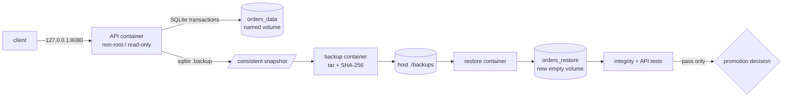

# Weekly Docker Magazine — バックアップは「復元できて初めて完成」

#docker #containers #weekly #deep-dive

[[Home]]

> [!warning] 削除操作と秘密情報
> `docker system prune` / `docker volume prune` / `docker image prune` / `docker rmi` / `docker rm -f` は、別プロジェクトや本番データを失わせる。実行前に `docker ps -a`、`docker image ls`、`docker volume ls` と対象名を確認し、共有ホストでは実行しない。本ラボではプロジェクト限定の `docker compose down` を使い、`-v` は復元試験で対象を確認した一度だけ使う。
>
> APIキー、DBパスワード、秘密鍵をDockerfile、イメージ、`compose.yaml`、バックアップ、Git管理下の`.env`へ埋め込まない。この教材にsecretは不要。本番ではsecret managerによる実行時注入、バックアップ暗号化、鍵の分離管理を行う。

## 1. Focus、難易度、前提、測定可能な到達点

**本番基準：コンテナを破棄してもデータが残り、アプリケーション整合性を保ったバックアップから、定義したRPO/RTO内で別の空volumeへ復元でき、その証拠を自動テストで残せること。**

- Difficulty signal: **Intermediate**（学習量の目安であり参加条件ではない）
- 必要知識：イメージとコンテナの違い、HTTP、ファイル所有権、終了コード
- 先行概念：Compose service、named volume、`exec` / `logs` / `inspect`、DBの書込み中コピーが危険な理由
- ツール：現行Docker EngineまたはDocker Desktop、Compose v2、`curl`、`tar`、`sha256sum`、`time`、エディタ
- 環境：Linuxコンテナ、空きRAM 1 GiB、空きディスク 1 GiB、`127.0.0.1:8080`が空いていること
- 前号との接続：secret、通信、資源の境界に続き、今回は**ライフサイクル境界を越えるデータ**を扱う

165分後の合格条件：

1. コンテナ再作成後も3件のデータがnamed volumeに残る。
2. SQLiteオンラインバックアップを取得し、SHA-256、件数、`PRAGMA integrity_check`を記録する。
3. 元volumeを削除した想定で、空の別volumeへ復元し、APIテストを60秒以内に成功させる。
4. バックアップ後に追加した1件が復元先にないことから、実測RPOを説明する。
5. 破損を注入し、アプリ・mount・ファイル・DB整合性の順で原因を特定する。

## 2. 実アプリのシナリオと制約

小規模な社内配送APIを単一Dockerホストで稼働する。注文はSQLiteへ保存される。目標は **RPO 15分、RTO 5分**。今回は復元手順を短時間で反復できる教材サイズにする。

- アプリ更新やコンテナ再作成で注文を失わない
- raw DBファイルを稼働中に無造作にコピーしない
- バックアップ成果物はvolumeの外に置き、checksumと時刻を伴う
- 復元は元volumeへ上書きせず、空の検証volumeへ行う
- ホスト公開はloopbackだけ、コンテナは非root、root filesystemはread-only
- SQLite単一writerという制約を理解する。高い書込み並行性や複数ホストHAにはPostgreSQL等と専用バックアップ方式を検討する

## 3. Foundation — container/runtime mental model

コンテナのwritable layerはコンテナ固有で、コンテナ削除とともに失われる。named volumeはDocker daemonが管理し、コンテナのライフサイクルから独立する。mountすると対象パスの下にvolumeが見える。

```text
image (read-only layers)
  + container writable layer  ← 一時的、交換可能
  + /data named volume        ← 永続化する状態
  + /tmp tmpfs                ← RAM上、一時データ
```

重要なのは「volumeがある」ことと「バックアップがある」ことは別だという点だ。同一ホスト上のvolumeは、ホスト障害、誤削除、ファイル破損から守らない。さらにクラッシュ整合性とアプリケーション整合性も別である。SQLiteでは `.backup` APIが稼働DBの整合したsnapshotを作る。復元時は、空の別volumeへ展開→integrity check→APIテスト→切替、という順にする。

## 4. 設計候補と明示的なtrade-off

|方式|長所|短所|採用判断|
|---|---|---|---|
|container writable layer|設定不要|削除で消失、移植困難|永続データには不採用|
|bind mount|ホストから直接見える、既存ツールと連携容易|ホストパス依存、権限・移植性・過剰公開のリスク|開発や管理済みホストで限定採用|
|named volume|Docker管理、Composeで宣言的、コンテナ交換と分離|それ自体はoff-host backupでない、ホストからの直接管理に向かない|今回の本番候補|
|tmpfs|ディスクへ残さず高速|停止で消失、メモリ消費|一時ファイルのみ|
|稼働DBファイルの`cp`/`tar`|単純に見える|書込み中の論理整合性を保証しない|不採用|
|DBネイティブbackup→archive|整合点を定義でき検証可能|DB別の手順・運用が必要|今回採用|

本番ではvolume driverやクラウドsnapshotも候補だが、DB側のflush/backup semanticsと組み合わせなければ「撮れたが戻らない」snapshotになり得る。

## 5. Architecture / backup・restore flow



## 6. Practical implementation — 165分ラボ

### 時間配分

- 0–25分：ファイル作成、build、mount確認
- 25–55分：永続性と通常テスト
- 55–90分：整合backup、checksum、測定
- 90–125分：破壊想定、別volume復元、RPO/RTO測定
- 125–150分：failure injectionと体系的debug
- 150–165分：security/performance reviewと成果物整理

作業用ディレクトリを作る。

```bash
mkdir -p docker-volume-lab/app docker-volume-lab/backups
cd docker-volume-lab
```

### 完全なサンプルファイル

`app/app.py`：

```python
import json, os, sqlite3
from http.server import BaseHTTPRequestHandler, ThreadingHTTPServer

DB = os.getenv("DB_PATH", "/data/orders.db")

def connect():
    db = sqlite3.connect(DB, timeout=5)
    db.execute("PRAGMA journal_mode=WAL")
    db.execute("CREATE TABLE IF NOT EXISTS orders (id INTEGER PRIMARY KEY, item TEXT NOT NULL)")
    return db

class Handler(BaseHTTPRequestHandler):
    def reply(self, code, body):
        data = json.dumps(body).encode()
        self.send_response(code)
        self.send_header("Content-Type", "application/json")
        self.send_header("Content-Length", str(len(data)))
        self.end_headers(); self.wfile.write(data)

    def do_GET(self):
        if self.path == "/healthz":
            try:
                with connect() as db:
                    ok = db.execute("PRAGMA quick_check").fetchone()[0]
                return self.reply(200 if ok == "ok" else 503, {"status": ok})
            except Exception as e:
                return self.reply(503, {"status": "error", "type": type(e).__name__})
        if self.path == "/orders":
            with connect() as db:
                rows = [{"id": r[0], "item": r[1]} for r in db.execute("SELECT id,item FROM orders ORDER BY id")]
            return self.reply(200, rows)
        self.reply(404, {"error": "not found"})

    def do_POST(self):
        if self.path != "/orders": return self.reply(404, {"error": "not found"})
        try:
            n = int(self.headers.get("Content-Length", "0"))
            item = json.loads(self.rfile.read(n))["item"]
            if not isinstance(item, str) or not item.strip(): raise ValueError()
            with connect() as db:
                cur = db.execute("INSERT INTO orders(item) VALUES (?)", (item.strip(),))
            self.reply(201, {"id": cur.lastrowid, "item": item.strip()})
        except Exception:
            self.reply(400, {"error": "item must be a non-empty string"})

    def log_message(self, fmt, *args):
        print(json.dumps({"remote": self.client_address[0], "message": fmt % args}), flush=True)

if __name__ == "__main__":
    os.makedirs(os.path.dirname(DB), exist_ok=True)
    with connect(): pass
    ThreadingHTTPServer(("0.0.0.0", 8080), Handler).serve_forever()
```

`Dockerfile`：

```dockerfile
# syntax=docker/dockerfile:1
FROM python:3.13-alpine
RUN addgroup -S -g 10001 app && adduser -S -D -H -u 10001 -G app app
WORKDIR /app
COPY --chown=10001:10001 app/app.py ./app.py
USER 10001:10001
EXPOSE 8080
CMD ["python", "/app/app.py"]
```

`.dockerignore`：

```gitignore
.git
backups
*.db
*.db-wal
*.db-shm
```

`compose.yaml`：

```yaml
name: volume-lab
services:
  api:
    build: .
    image: volume-lab-api:local
    ports:
      - "127.0.0.1:8080:8080"
    environment:
      DB_PATH: /data/orders.db
    volumes:
      - type: volume
        source: orders_data
        target: /data
        volume:
          nocopy: true
    read_only: true
    tmpfs:
      - /tmp:size=16m,mode=1777
    user: "10001:10001"
    cap_drop: [ALL]
    security_opt:
      - no-new-privileges:true
    healthcheck:
      test: ["CMD", "python", "-c", "import urllib.request; urllib.request.urlopen('http://127.0.0.1:8080/healthz', timeout=2)"]
      interval: 5s
      timeout: 3s
      retries: 5
      start_period: 5s

volumes:
  orders_data:
    name: volume-lab-orders-data
```

`backup.sh`：

```sh
#!/bin/sh
set -eu
mkdir -p backups
docker compose exec -T api python -c "import sqlite3; s=sqlite3.connect('/data/orders.db'); d=sqlite3.connect('/tmp/orders.snapshot.db'); s.backup(d); d.close(); s.close()"
docker compose cp api:/tmp/orders.snapshot.db backups/orders.db
sha256sum backups/orders.db > backups/orders.db.sha256
docker run --rm --mount type=bind,src="$(pwd)/backups",dst=/backup,readonly python:3.13-alpine \
  python -c "import sqlite3; d=sqlite3.connect('/backup/orders.db'); assert d.execute('PRAGMA integrity_check').fetchone()[0]=='ok'; print('rows='+str(d.execute('SELECT count(*) FROM orders').fetchone()[0]))"
```

`restore.sh`：

```sh
#!/bin/sh
set -eu
test -f backups/orders.db
(cd backups && sha256sum -c orders.db.sha256)
docker volume inspect volume-lab-orders-restore >/dev/null 2>&1 || docker volume create volume-lab-orders-restore >/dev/null
test -z "$(docker run --rm --mount type=volume,src=volume-lab-orders-restore,dst=/restore alpine:3.22 sh -c 'find /restore -mindepth 1 -maxdepth 1 -print -quit')"
docker run --rm \
  --mount type=bind,src="$(pwd)/backups/orders.db",dst=/source/orders.db,readonly \
  --mount type=volume,src=volume-lab-orders-restore,dst=/restore \
  alpine:3.22 sh -c 'cp /source/orders.db /restore/orders.db && chown 10001:10001 /restore/orders.db && chmod 600 /restore/orders.db'
docker run --rm --mount type=volume,src=volume-lab-orders-restore,dst=/data,readonly python:3.13-alpine \
  python -c "import sqlite3; d=sqlite3.connect('file:/data/orders.db?mode=ro',uri=True); print(d.execute('PRAGMA integrity_check').fetchone()[0]); print('rows='+str(d.execute('SELECT count(*) FROM orders').fetchone()[0]))"
```

実行権限：

```bash
chmod +x backup.sh restore.sh
```

### Phase A — build、起動、mountの証明（25分）

```bash
docker compose config --quiet
docker compose build --pull
docker compose up -d --wait
docker compose ps
docker inspect volume-lab-api-1 --format '{{json .Mounts}}'
curl -fsS http://127.0.0.1:8080/healthz
```

- `config --quiet`：正規化前にCompose構文を検証する。
- `build --pull`：Dockerfileからbuildし、base imageの更新を確認する。digest固定は検証済み更新手順とセットで行う。
- `up -d --wait`：background起動し、healthcheck完了まで待つ。
- `inspect ... .Mounts`：`/data`が`volume-lab-orders-data`であることをDockerの実状態から確認する。
- `curl -f`：4xx/5xxを非0終了、`-sS`で成功時は静かに失敗理由は表示する。

期待値：`{"status": "ok"}`、mountの`Type`は`volume`、`Destination`は`/data`。

> [!checkpoint] Checkpoint A
> `docker compose ps`がhealthy、APIのUIDが `10001`（`docker compose exec api id`）であること。

### Phase B — 永続性テスト（30分）

```bash
for item in pen notebook tape; do
  curl -fsS -X POST -H 'Content-Type: application/json' \
    -d "{\"item\":\"$item\"}" http://127.0.0.1:8080/orders
done
curl -fsS http://127.0.0.1:8080/orders
docker compose up -d --force-recreate --wait api
test "$(curl -fsS http://127.0.0.1:8080/orders | grep -o '"id"' | wc -l)" -eq 3
```

- loopは3注文をHTTP経由でcommitする。
- `--force-recreate`はコンテナだけを交換し、named volumeは保持する。
- 最後の`test`は3行相当を満たさなければ非0終了する。

期待値：再作成後も`pen`、`notebook`、`tape`の3件。

### Phase C — 整合backupと計測（35分）

```bash
/usr/bin/time -f 'backup_seconds=%e max_rss_kib=%M' ./backup.sh
ls -lh backups/
cat backups/orders.db.sha256
docker image inspect volume-lab-api:local --format 'image_bytes={{.Size}}'
docker system df -v
```

`.backup`はsource connectionから整合したDBを`/tmp`へ作る。`compose cp`はsnapshotだけをhostへ出す。checksumは転送・保存中のbit corruptionや取り違えを検出するが、悪意ある改ざんへの署名ではない。期待出力は `rows=3` とbackup時間、2ファイル。

次にbackup時点の後へ注文を追加する。

```bash
date -Ins | tee backups/backup-observed-at.txt
curl -fsS -X POST -H 'Content-Type: application/json' \
  -d '{"item":"after-backup"}' http://127.0.0.1:8080/orders
```

これが意図的なRPO差分になる。

> [!checkpoint] Checkpoint C
> 現行APIは4件、backup検証は3件、`sha256sum -c`は`OK`。

### Phase D — 空volumeへのrestore drill（35分）

まず対象を確認する。**次の`down -v`はラボの元volumeを削除する。名前とbackup検証結果を再確認してからだけ実行すること。** 不安なら元volumeを残したまま進めてもよい。

```bash
docker compose ps
docker volume ls --filter name=volume-lab
sha256sum -c backups/orders.db.sha256
docker compose down -v
```

- `down`はこのCompose projectのcontainer/networkを除去する。
- `-v`はCompose宣言volumeも削除する。これが破壊操作であり、汎用pruneではない。

RTO timerを開始する。

```bash
SECONDS=0
./restore.sh
cat > compose.restore.yaml <<'YAML'
services:
  api:
    volumes:
      - type: volume
        source: orders_data
        target: /data
        volume:
          nocopy: true
volumes:
  orders_data:
    external: true
    name: volume-lab-orders-restore
YAML
docker compose -f compose.yaml -f compose.restore.yaml up -d --wait
curl -fsS http://127.0.0.1:8080/orders | tee backups/restored-response.json
test "$(grep -o '"id"' backups/restored-response.json | wc -l)" -eq 3
! grep -q after-backup backups/restored-response.json
echo "rto_seconds=$SECONDS"
```

上書きCompose fileはlogical volume `orders_data`を外部の復元volumeへ接続する。`external: true`なのでComposeはそのvolumeを作成・削除しない。期待値は3件、`after-backup`なし、`rto_seconds`が60秒程度以下（目標RTO 300秒以内）。

実測RPOは「backup成功時刻から障害時刻まで」。今回失われる1件は設計通りだが、業務上許容できるかは別途判断する。

## 7. 設定を行単位で読む

### Dockerfile

- `# syntax=...`：現行Dockerfile frontendを選ぶ。
- `FROM`：小さいPython runtimeを土台にする。Alpine採用はmusl互換性とのtrade-offがある。
- `addgroup/adduser`：固定UID/GID 10001を作り、volumeの所有権を予測可能にする。
- `WORKDIR`：後続の相対パス基準。
- `COPY --chown`：root所有の不要な中間状態を避ける。
- `USER`：通常処理を非rootにする。
- `EXPOSE`：metadataであり、hostへ公開はしない。
- JSON形式`CMD`：shellを挟まずPythonをPID 1として起動する。

### Composeのstorage/security行

- `type: volume/source/target`：mount種別・論理volume・container pathを明示するlong syntax。
- `nocopy: true`：image内の既存`/data`を空volumeへ自動copyしない。初期化の出所を曖昧にしない。
- `read_only: true`：container writable layer全体を書込み禁止にする。ただし別mountの`/data`と`/tmp`は書ける。
- `tmpfs`：一時ファイルをRAMに置き、16 MiB上限とsticky bitを指定する。
- `user`：image設定に加えCompose側でも実行IDを明示する。
- `cap_drop: [ALL]`：不要なLinux capabilityを落とす。
- `no-new-privileges`：setuid等による権限上昇を禁止する。
- `healthcheck`：プロセス存在でなく、DB quick checkを含むHTTP応答を監視する。ただし深い`integrity_check`を毎回行う設計ではない。

## 8. Failure injectionと体系的debug（25分）

### 注入：backupを1 byte破損する

元backupを保全してから、検証用copyを壊す。

```bash
cp backups/orders.db backups/orders.corrupt.db
printf X | dd of=backups/orders.corrupt.db bs=1 seek=128 conv=notrunc status=none
sha256sum backups/orders.corrupt.db
```

元のchecksumと一致しないことが第一の検知点。さらにファイル先頭を壊す場合はDB integrity checkも失敗する。復元スクリプトはchecksum不一致で**書込み前に停止**すべきであり、失敗を無視して先へ進めてはいけない。

### 調査runbook：外側から内側へ

```bash
docker compose -f compose.yaml -f compose.restore.yaml ps
docker compose -f compose.yaml -f compose.restore.yaml logs --tail=100 api
docker inspect volume-lab-api-1 --format '{{range .Mounts}}{{.Type}} {{.Name}} {{.Destination}} RW={{.RW}}{{println}}{{end}}'
docker volume inspect volume-lab-orders-restore
docker compose -f compose.yaml -f compose.restore.yaml exec api sh -c 'id; ls -ldn /data; ls -ln /data'
docker compose -f compose.yaml -f compose.restore.yaml exec api python -c "import sqlite3; d=sqlite3.connect('/data/orders.db'); print(d.execute('PRAGMA integrity_check').fetchone())"
```

順序と判定：

1. **orchestrator状態**：containerはrunning/healthyか。
2. **アプリ証拠**：ログの例外型はpermission、readonly、database malformedのどれか。
3. **mount wiring**：期待するvolume名が`/data`へRW mountされているか。
4. **metadata**：volume driver・mountpoint・labelを確認する。mountpointをhostから直接編集しない。
5. **identity/permission**：UID 10001がdirectory/fileを書けるか。
6. **logical integrity**：`PRAGMA integrity_check`が`ok`か。

追加演習：`chmod 400`相当の誤権限で起動し、ログから`OperationalError`を見つけ、復元copy時の`chown 10001:10001`が必要な理由を説明する。

## 9. Security review、size/performance、production readiness

### Security review

- [ ] APIは`127.0.0.1`だけに公開されている
- [ ] UID/GID 10001、capabilityなし、権限昇格なし
- [ ] root filesystemはread-only、永続書込み先は`/data`だけ
- [ ] backup directoryとobject storageは暗号化・access control・監査対象
- [ ] backup暗号鍵はbackupと別管理、restore担当者の権限も最小化
- [ ] secretはimage/Compose/backup/logへ入らない
- [ ] checksumだけでなく、必要なら署名またはobject lockを採用
- [ ] 個人情報の保持期限とsecure deletionを定義

### 記録する測定値

|測定|コマンド|今回の値|本番判定|
|---|---|---:|---|
|image size|`docker image inspect ... .Size`|____ bytes|base更新と脆弱性scanも評価|
|backup size|`du -h backups/orders.db`|____|転送時間・保管費へ反映|
|backup duration|`time ./backup.sh`|____ s|RPO周期内に完了するか|
|restore duration|`SECONDS`計測|____ s|RTO 300秒以内か|
|record count|SQL/API test|3|manifestと一致するか|
|integrity|`PRAGMA integrity_check`|ok|必須gate|

小さいイメージはpull/起動とattack surfaceに有利だが、運用debug toolを全て削る判断とは同義でない。必要なら本番imageを変えず、一時debug containerや別toolboxを使う。性能は空DBでなく本番相当データ量、同時書込み、I/O帯域で再測定する。

### Production-readiness checklist

- [ ] RPO/RTOが数値で合意され、backup周期・保持世代・off-host複製へ落ちている
- [ ] DBネイティブの整合snapshotを使う
- [ ] backup成功は「ファイル生成」ではなくchecksum、integrity、件数で判定
- [ ] restoreは空の隔離環境で定期自動実行し、結果を監視する
- [ ] 復元先を誤らない命名・label・承認gateがある
- [ ] volume driver、host、region障害を含むfailure domainを整理
- [ ] 容量・inode・backup失敗・restore時間を監視
- [ ] schema versionとアプリversionの互換表がある
- [ ] rollback時の旧アプリが新schemaを読めるか検証
- [ ] retention、暗号化、鍵rotation、access log、legal holdを定義
- [ ] runbookに担当、連絡、切替、切戻し、事後検証がある
- [ ] `prune`や一括削除を本番手順に含めない

## 10. Cleanup（対象確認を先に）

```bash
docker compose -f compose.yaml -f compose.restore.yaml down --remove-orphans
docker volume ls --filter name=volume-lab
docker image ls volume-lab-api
```

ここまでは復元volumeとimageを残す。完全cleanupが必要な場合だけ、対象名を目視してから次を実行する。

> [!danger] 以下は削除操作
> `docker volume rm volume-lab-orders-restore` は復元データを削除する。`docker rmi volume-lab-api:local` は教材imageを削除する。`docker rm -f`、`docker system prune`、`docker volume prune`は不要であり実行しない。

```bash
docker volume rm volume-lab-orders-restore
docker rmi volume-lab-api:local
```

`backups/`はrestore証跡である。保持要件を確認するまで削除しない。

## 11. Concrete deliverables

1. `Dockerfile`、`.dockerignore`、`compose.yaml`、`app/app.py`
2. `backup.sh`、`restore.sh`、復元用override file
3. `orders.db`、SHA-256 file、backup観測時刻
4. backup/restore所要時間、image/backup size、件数、integrity結果の表
5. `restored-response.json`と「after-backupが存在しない」テスト結果
6. failure injectionの症状→証拠→原因→修正を1ページにしたrunbook
7. 自環境のRPO/RTO、保持世代、off-host保存先、復元演習頻度の提案

## 12. Assessment

### 5問

1. named volumeがあればbackup不要、と言えない理由は？
2. 稼働中SQLiteのDBファイルを直接`tar`しない理由は？
3. 復元を元volumeでなく空の別volumeへ行う利点は？
4. checksum成功と`integrity_check`成功はそれぞれ何を証明する？
5. 今回backup後の注文1件が復元されないのはbugか？

<details><summary>解答</summary>

1. volumeはcontainer削除からは独立するが、同一host障害、誤削除、破損、災害からは自動で守らないため。
2. 複数ファイルやpageが異なる時点でcopyされ、transaction整合性を失う可能性があるため。DBネイティブbackupを使う。
3. 現行データを上書きせず、失敗時に切戻せ、検証完了までpromotionを保留できる。
4. checksumは取得後のbytesが期待値と一致すること、integrity checkはSQLite内部構造の論理整合性を検査する。どちらも業務内容の正しさを単独では証明しない。
5. backup時点と障害時点の間の更新なので設計上のRPO差分。ただし許容可否は業務要件次第で、RPOを短縮するなら頻度や方式を変える。

</details>

### Interview / design question

注文DBが100 GiB、書込み500 TPS、2リージョン、RPO 1分・RTO 10分になった。SQLite + local named volumeのどこが限界になり、DB選定、継続backup/WAL、暗号化、cross-region replication、整合性検証、promotion gateをどう再設計するか。failure domainと費用も含めて説明せよ。

### Optional advanced challenge（Specialized相当、任意）

- backup manifestをJSON化し、timestamp、image digest、schema version、row count、SHA-256を保存する。
- `docker compose run --profile backup`等でbackup jobを宣言的にし、CIで毎週isolated restore testを走らせる。
- 1 GiBの疑似データでbackup中のAPI p95 latencyとI/Oを測り、RPO周期の妥当性を評価する。
- backupをS3互換object storageへ暗号化転送し、versioning/object lockを有効化する。ただしcredentialはBuild args、Dockerfile、Composeへ書かず実行時注入する。

## 13. 公式Dockerドキュメント（2026-08-12確認）

- [Volumes](https://docs.docker.com/engine/storage/volumes/) — volumeのライフサイクル、mount、backup/restore/migrate例
- [Bind mounts](https://docs.docker.com/engine/storage/bind-mounts/) — host path依存、write access、readonly mount
- [tmpfs mounts](https://docs.docker.com/engine/storage/tmpfs/) — 非永続・memory上のmount
- [Storage overview](https://docs.docker.com/engine/storage/) — writable layerとpersistent storageの選択
- [Compose services: volumes](https://docs.docker.com/reference/compose-file/services/#volumes) — short/long syntax、`nocopy`、read-only
- [Compose top-level volumes](https://docs.docker.com/reference/compose-file/volumes/) — named/external volume宣言
- [`docker volume` CLI reference](https://docs.docker.com/reference/cli/docker/volume/) — create/inspect/ls/rm
- [Dockerfile best practices](https://docs.docker.com/build/building/best-practices/) — imageの再build、ephemeral container、最小化

---

**今回の一文判定：** 「volumeがある」では不十分。**別の空volumeへ期限内に復元し、checksum・DB整合性・APIテストが通った証拠がある**状態を本番readyと呼ぶ。
