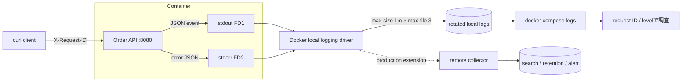

# Weekly Docker Magazine — ログでホストを止めない、障害を見失わない

#docker #containers #weekly #deep-dive

[[Home]]

> [!warning] 削除操作と秘密情報
> `docker system prune` / `docker image prune` / `docker rmi` / `docker rm -f` は、別プロジェクトの資産や稼働サービスを失わせる。実行前に `docker ps -a`、`docker image ls`、対象名を確認し、共有ホストでは実行しない。本ラボはプロジェクト限定の `docker compose down --remove-orphans` を使う。
>
> APIキー、token、個人情報をDockerfile、イメージ、`compose.yaml`へ埋め込まない。さらに、secretをログ本文へ出してはいけない。本ラボのrequest IDは無作為な識別子で、credentialではない。

## 1. Focus、難易度、前提、測定可能な到達点

**本番基準：アプリは構造化イベントをstdout/stderrへ出し、Docker側で容量上限を持つローテーションを行い、障害時にもrequest IDで追跡でき、ログ量・欠落・配送遅延のtrade-offを明示できること。**

- Difficulty signal: **Intermediate**（学習量の目安であり、参加条件ではない）
- 必要知識：コンテナとイメージ、HTTP、JSON、stdout/stderr、終了コード
- 先行概念：Compose service、healthcheck、`logs` / `inspect` / `stats`、ディスク枯渇がホスト全体へ波及すること
- ツール：現行Docker EngineまたはDocker Desktop、Compose v2、`curl`、`awk`、`du`、`time`、エディタ
- 環境：Linuxコンテナ、空きRAM 1 GiB、空きディスク 1 GiB、`127.0.0.1:8080`が空いていること
- earlier concepts：リソース制限はCPU/RAM/PIDを守り、今回のログ上限は**ディスクと調査可能性**を守る。secret回の「出さない設計」も前提になる

165分後の合格条件：

1. JSON 1行＝1イベントで、timestamp、level、event、request_id、duration_msを出す。
2. `local` logging driver、`max-size=1m`、`max-file=3`を`inspect`で証明する。
3. 正常要求から500応答まで同じrequest IDで追跡する。
4. 5万行のログstormを注入しても、ログ保存域が無制限に増えないことを測る。
5. blocking / non-blocking配送を比較し、「アプリ停止回避」と「ログ欠落回避」のどちらを優先したか説明する。

## 2. 実アプリのシナリオと制約

注文APIを単一Dockerホストで運用する。平常時は毎秒10要求、繁忙時は毎秒100要求。不具合でdebugログが急増しても、Dockerデータ領域を埋めて同居サービスを停止させてはならない。一方、500エラーはrequest IDから数分以内に追跡したい。

- アプリはログファイルを管理せず、stdoutへ通常イベント、stderrへエラーを出す
- 1イベントは改行を含まないJSON 1行。stack traceも配列またはescaped stringにする
- host公開は`127.0.0.1:8080`のみ
- コンテナは非root、read-only root filesystem、capabilityなし
- 1コンテナ当たりのローカルログ上限を概算3 MiBにする（圧縮前の目安）
- credential、Authorization header、cookie、リクエスト本文、個人情報は記録しない
- ローカルログだけを長期保管・検索基盤と見なさない。本番はremote collector、保持期間、アクセス制御、欠落監視を別途設計する

## 3. Foundation — container/runtime mental model

アプリのFD 1（stdout）とFD 2（stderr）は、コンテナruntimeが捕捉し、選択されたlogging driverへ渡す。ログはコンテナのwritable layer内へアプリが書くファイルとは別物である。

```text
app process
  ├─ FD 1 stdout ─┐
  └─ FD 2 stderr ─┴→ Docker logging driver → local rotation / remote destination
                         ↑
                  blocking または non-blocking buffer
```

Docker Engineの既定は互換性のため`json-file`で、rotation設定なしでは大量のディスクを使い得る。Docker公式は通常用途で、既定rotationと効率的な形式を持つ`local` driverを推奨する。driver変更は既存containerへ遡及せず、**再作成したcontainer**から有効になる。

- **blocking（既定）**：driverが遅いとアプリのstdout/stderr書込みも待つ。ログ欠落を抑える一方、配送先障害がアプリ遅延へ波及し得る
- **non-blocking**：メモリbufferを挟みアプリ停止を避ける。buffer満杯ではログを失い得る
- **rotation**：保存量を有限化するが、古いイベントは消える。外部保管やalertがなければ証跡を失う
- **dual logging**：読取り非対応のremote driverでは`docker logs`用のlocal cacheが使われる。ただしremote配送障害時の完全なspool/retry保証ではない

ログdriverの内部ファイルを外部ツールで直接読む設計は避ける。Dockerが管理するファイルであり、`docker logs`、driverのbackend、または正式なcollector interfaceを使う。

## 4. 設計候補と明示的なtrade-off

|方式|利点|欠点|判断|
|---|---|---|---|
|アプリがコンテナ内ファイルへ記録|既存アプリを移しやすい|rotation、mount、権限、回収を各アプリが抱える|原則不採用|
|`json-file`、無制限|広い互換性、`docker logs`が容易|ログstormでディスク枯渇|本番では不採用|
|`json-file` + rotation|JSON互換性、上限あり|`local`よりoverheadが大きい場合|外部要件がある時|
|`local` + rotation|Docker推奨、効率的、既定rotation|ファイル形式を直接処理できない|今回採用|
|remote driver、blocking|欠落を抑えやすい|collector障害がアプリをblockし得る|監査優先で検討|
|remote driver、non-blocking|アプリ可用性を分離|buffer超過時に欠落|可用性優先で検討、欠落監視必須|
|sidecar/host agentで収集|buffer・再送・加工を独立設計|構成、資源、運用点が増える|本格運用の候補|

今回の教材は`local` driverでディスク上限と`docker logs`による短期調査を成立させる。長期集約はOptional challengeで設計する。

## 5. Architecture / log flow



## 6. Guided lab（約165分）

### 時間配分

- 0–25分：mental model、環境確認、ファイル作成
- 25–60分：build・正常系・構造化ログ検証
- 60–95分：rotationと容量計測
- 95–130分：故障注入と系統的debug
- 130–155分：security・性能評価
- 155–165分：成果物とassessment

### 6.1 作業ディレクトリ

```bash
mkdir -p docker-log-lab
cd docker-log-lab
docker version
docker compose version
docker info --format 'default={{.LoggingDriver}} root={{.DockerRootDir}}'
```

`docker info`はdaemon既定driverとDocker管理領域を表示する。今回はComposeでservice単位に上書きするため、daemon設定や再起動は不要。

### 6.2 完全なサンプルファイル

`app.py`：

```python
import json
import os
import sys
import time
import uuid
from datetime import datetime, timezone
from http.server import BaseHTTPRequestHandler, ThreadingHTTPServer
from urllib.parse import urlparse, parse_qs

def emit(level, event, request_id, **fields):
    record = {
        "ts": datetime.now(timezone.utc).isoformat(),
        "level": level,
        "event": event,
        "request_id": request_id,
        **fields,
    }
    target = sys.stderr if level in {"error", "critical"} else sys.stdout
    print(json.dumps(record, separators=(",", ":")), file=target, flush=True)

class Handler(BaseHTTPRequestHandler):
    def log_message(self, format, *args):
        return  # 既定の非構造化access logを抑止

    def reply(self, status, body):
        data = json.dumps(body).encode()
        self.send_response(status)
        self.send_header("Content-Type", "application/json")
        self.send_header("Content-Length", str(len(data)))
        self.end_headers()
        self.wfile.write(data)

    def do_GET(self):
        started = time.monotonic()
        request_id = self.headers.get("X-Request-ID") or str(uuid.uuid4())
        path = urlparse(self.path)
        emit("info", "request_started", request_id, method="GET", path=path.path)
        status = 200
        try:
            if path.path == "/healthz":
                self.reply(200, {"status": "ok"})
            elif path.path == "/orders/42":
                self.reply(200, {"id": 42, "state": "ready"})
            elif path.path == "/fail":
                status = 500
                raise RuntimeError("injected database timeout")
            elif path.path == "/storm":
                count = min(int(parse_qs(path.query).get("count", ["1000"])[0]), 50000)
                for i in range(count):
                    emit("info", "storm_line", request_id, sequence=i, padding="x" * 160)
                self.reply(200, {"emitted": count})
            else:
                status = 404
                self.reply(404, {"error": "not_found"})
        except Exception as exc:
            emit("error", "request_failed", request_id,
                 error_type=type(exc).__name__, error=str(exc))
            self.reply(status, {"error": "internal_error", "request_id": request_id})
        finally:
            duration = round((time.monotonic() - started) * 1000, 2)
            emit("info", "request_finished", request_id,
                 status=status, duration_ms=duration)

port = int(os.environ.get("PORT", "8080"))
emit("info", "server_started", "startup", port=port)
ThreadingHTTPServer(("0.0.0.0", port), Handler).serve_forever()
```

`Dockerfile`：

```dockerfile
FROM python:3.13-alpine
WORKDIR /app
COPY --chown=65532:65532 app.py /app/app.py
USER 65532:65532
EXPOSE 8080
ENTRYPOINT ["python", "-u", "/app/app.py"]
```

`-u`はPythonのstdout/stderr bufferingを無効化し、イベントが遅れて固まって出るのを防ぐ。exec formの`ENTRYPOINT`はPythonをPID 1として起動する。数値UIDはホストのユーザー名DBへ依存しない。

`.dockerignore`：

```gitignore
.git
.env
secrets/
*.log
__pycache__/
```

これは秘密やローカルログをbuild contextへ送らない防波堤である。ただし「ignoreしたからログへsecretを出してよい」わけではない。

`compose.yaml`：

```yaml
services:
  api:
    build: .
    ports:
      - "127.0.0.1:8080:8080"
    read_only: true
    tmpfs:
      - /tmp:size=16m,mode=1777
    cap_drop:
      - ALL
    security_opt:
      - no-new-privileges:true
    pids_limit: 64
    mem_limit: 128m
    cpus: 0.50
    init: true
    healthcheck:
      test: ["CMD", "python", "-c", "import urllib.request; urllib.request.urlopen('http://127.0.0.1:8080/healthz', timeout=2)"]
      interval: 5s
      timeout: 3s
      retries: 5
      start_period: 5s
    logging:
      driver: local
      options:
        max-size: "1m"
        max-file: "3"
        compress: "true"
```

重要行：

- `127.0.0.1:8080:8080`：外部interfaceへ公開しない
- `read_only`：root filesystemへの永続書込みを拒否
- `tmpfs`：必要な一時領域だけRAM上に16 MiBで許可
- `cap_drop: ALL` / `no-new-privileges`：余分なkernel権限と権限昇格を抑える
- `pids_limit` / `mem_limit` / `cpus`：ログstorm時も同居workloadへの波及を限定
- `init: true`：小さなinitがsignal forwardingとzombie回収を担う
- `healthcheck`：HTTP応答をruntime状態と別に検査
- `logging.driver: local`：効率的なDocker管理形式とrotationを選ぶ
- `max-size`：1ファイルのrotation閾値。文字列で指定する
- `max-file`：保持ファイル数。上限到達後は古いログが消える
- `compress`：rotated logを圧縮。読取り時に一時的CPU/ディスク負荷が増え得る

### 6.3 Build、起動、checkpoint 1

```bash
docker compose config
docker compose build --pull
time docker compose up -d --wait
docker compose ps
```

- `config`：merge・変数展開後の定義を検証。secret値が出ないことも確認する
- `build --pull`：より新しいbase imageを確認してbuild。ただし本番再現性にはdigest固定と更新工程が必要
- `up -d --wait`：background起動し、running/healthyまで待つ

期待出力の要点：

```text
NAME   ...   STATUS                    PORTS
...api ...   Up ... (healthy)          127.0.0.1:8080->8080/tcp
```

checkpoint：

```bash
docker compose exec api id
docker compose exec api sh -c 'test ! -w /app && echo rootfs-read-only'
docker inspect "$(docker compose ps -q api)" \
  --format 'driver={{.HostConfig.LogConfig.Type}} opts={{json .HostConfig.LogConfig.Config}}'
```

期待値：UID 65532、`rootfs-read-only`、`driver=local`と`max-size/max-file/compress`。

### 6.4 正常系、JSON、相関IDテスト

```bash
curl -fsS -H 'X-Request-ID: lab-ok-001' http://127.0.0.1:8080/orders/42
docker compose logs --since 2m --no-color api | grep 'lab-ok-001'
docker compose logs --since 2m --no-color api \
  | sed 's/^[^{]*//' \
  | python3 -c 'import sys,json; [json.loads(x) for x in sys.stdin if x.strip()]; print("json-ok")'
```

期待する応答とログの要点：

```text
{"id": 42, "state": "ready"}
... "event":"request_started" ... "request_id":"lab-ok-001"
... "event":"request_finished" ... "status":200 ...
json-ok
```

Composeはservice prefixを付けるため、検証時だけ最初の`{`より前を`sed`で除く。収集基盤では生のmessage fieldをJSON parserへ渡す。

### 6.5 エラー相関、checkpoint 2

```bash
curl -sS -o /tmp/docker-log-lab-response.json -w '%{http_code}\n' \
  -H 'X-Request-ID: lab-fail-001' http://127.0.0.1:8080/fail
docker compose logs --since 2m --no-color api | grep 'lab-fail-001'
```

期待値：HTTP `500`、`request_failed`と`request_finished`が同じIDを持つ。応答は内部例外詳細を漏らさずrequest IDだけを返す。

### 6.6 Rotationと性能計測、checkpoint 3

まずbaselineを取る。

```bash
CID="$(docker compose ps -q api)"
docker inspect "$CID" --format 'logpath={{.LogPath}}'
docker compose logs --no-color api | wc -l
/usr/bin/time -f 'elapsed=%e max_rss_kb=%M' \
  curl -fsS 'http://127.0.0.1:8080/storm?count=50000' -o /tmp/storm-result.json
docker compose logs --no-color api | wc -l
docker stats --no-stream "$CID"
```

期待：APIは`{"emitted":50000}`を返す。rotationにより`docker compose logs`で読める行数は生成総数より少なくなり得る。これは故障ではなく有限保持の結果である。

Docker管理領域の実測（Linux Engineで権限が必要な場合だけ`sudo`を使う）：

```bash
LOGPATH="$(docker inspect "$CID" --format '{{.LogPath}}')"
printf 'logpath=%s\n' "$LOGPATH"
sudo du -h "$(dirname "$LOGPATH")"
```

Docker DesktopではpathがLinux VM内で、ホストから直接見えない場合がある。その場合は`inspect`のdriver options、保持行数、Docker Desktopのdisk usage画面を証拠にする。内部ファイルを編集・削除してはならない。

記録表：

|指標|storm前|storm後|判定|
|---|---:|---:|---|
|保持ログ行数|||有限か|
|ログ領域サイズ|||概算上限内か|
|API所要秒|||SLOへの影響|
|CPU / memory|||制限内か|
|イメージサイズ MiB|||baselineとして記録|

```bash
docker image inspect "$(docker inspect "$CID" --format '{{.Image}}')" --format '{{.Size}}' \
  | awk '{printf "image_mib=%.2f\n", $1/1024/1024}'
```

## 7. コマンドを判断へつなげる

```bash
docker info --format '{{.LoggingDriver}}'
docker inspect "$CID" --format '{{json .HostConfig.LogConfig}}'
docker compose logs --since 10m --timestamps --no-color api
docker compose logs --tail 100 -f api
docker events --since 10m --filter container="$CID"
```

- `docker info`：新規containerが継承するdaemon既定値。service上書きとは区別する
- `inspect ...LogConfig`：対象containerで実際に固定されたdriver/options。設定ファイルだけでなく実体を見る
- `--since`：調査windowを狭め、rotation済み大量ログの展開負荷を抑える
- `--timestamps`：複数service間の時系列を合わせる。アプリ側timestampとのずれも確認する
- `--tail 100 -f`：直近から追跡。`Ctrl+C`は追跡を止めるだけでcontainerは止めない
- `docker events`：restart/die等のruntime eventをアプリログと照合する。これは長期監査storeではない

daemon既定を変える本番例（このラボでは実行しない）：

```json
{
  "log-driver": "local",
  "log-opts": {
    "max-size": "10m",
    "max-file": "5"
  }
}
```

`daemon.json`変更はhost全体へ影響し、daemonのreload/restart手順と事前検証が必要。変更後も既存containerは自動更新されず、再作成が必要である。

## 8. Failure injectionと系統的debug

### 故障A：ログstormで古い証跡が消える

すでに`/storm?count=50000`で注入済み。次を確認する。

```bash
docker compose logs --no-color api | grep -q 'lab-ok-001' \
  && echo retained || echo rotated-away
docker inspect "$CID" --format '{{json .HostConfig.LogConfig.Config}}'
```

`rotated-away`なら、調査順は次の通り。

1. **アプリ**：実際に何行・何byte出したか。level設定が誤ってdebugになっていないか
2. **runtime設定**：driver、`max-size`、`max-file`は期待値か
3. **保持窓**：生成率 × 平均event sizeから何分保持できるか
4. **配送先**：長期collectorへ到着しているか、ingestion lag/drop metricはどうか
5. **対策**：不要イベントの抑制、sampling、上限拡大、collector容量増。無計画な上限解除はしない

概算式：

```text
保持秒 ≒ (max-size × max-file) / (平均event byte × events/秒)
```

例：3 MiB、300 byte/event、100 events/sなら約105秒。圧縮率やmetadataを除く粗い設計値なので、必ず実測する。

### 故障B：誤ったdriver optionで再作成に失敗

`compose.yaml`の`max-size: "1m"`を一時的に`max-size: "nonsense"`へ変更し、次を実行する。

```bash
docker compose config
docker compose up -d --force-recreate
docker compose ps -a
```

期待：YAML自体は妥当でもcontainer作成時にinvalid option/valueとして失敗し得る。`config`成功はruntime semanticsの保証ではない。

復旧：`"1m"`へ戻してから、

```bash
docker compose up -d --force-recreate --wait
docker inspect "$(docker compose ps -q api)" --format '{{json .HostConfig.LogConfig}}'
```

debugの順序は、(1) Compose render、(2) create error、(3) container実体、(4) daemon log、(5) backend状態。最初から`prune`や`rm -f`を使わない。

### blocking / non-blocking設計演習

remote driverの配送先が遅い状況を想定する。Composeのdriver optionsはdriverごとに異なるため、対応driverの公式仕様を確認したうえで次の問いに答える。

- 決済監査イベント：欠落とrequest遅延のどちらが重大か
- recommendation debugログ：欠落とservice停止のどちらが重大か
- non-blocking buffer容量、欠落metric、alert閾値をどう設定するか
- local cacheを再送queueと誤認していないか

## 9. Security review、サイズ／性能、本番readiness

### Security review

- [ ] Authorization、cookie、password、token、secret、個人情報をloggerへ渡していない
- [ ] error responseには内部例外を出さず、request IDだけを返す
- [ ] ログ閲覧権限をDocker daemonアクセス相当の高権限として扱う
- [ ] 改行・制御文字によるlog injectionをJSON encoderで封じる
- [ ] request IDを認証・認可の根拠に使わない
- [ ] 保持期間、削除、暗号化、remote backendのRBACを定義した
- [ ] build context、image history、Compose定義にsecretがない

### Image-size / performance acceptance

- image sizeをMiBでbaseline化し、前回との差をCIで追う
- 1,000件通常要求時のp50/p95と、ログ無効化時との差を測る
- storm時もhealthcheckがSLO内で成功するか確認する
- rotated log読取り時のCPU・一時disk増加を監視する
- log eventの平均byte、events/s、保持秒を実測する
- remote backendはingestion lag、drop数、retry、quotaをalert化する

### Production-readiness checklist

- [ ] 全serviceがstdout/stderrへ1行構造化ログを出す
- [ ] schema/version、timestamp timezone、level、event名、request/trace IDを標準化した
- [ ] daemon既定とservice例外をinventory化した
- [ ] 全containerでrotationまたはremote bounded cacheが有効
- [ ] ログ予算を「平均 × peak × 保持 × replica」で容量計画した
- [ ] 新設定はcontainer再作成後に`inspect`で検証した
- [ ] collector停止のgame dayでblocking/欠落挙動を測った
- [ ] secret/PII redaction testをCIに入れた
- [ ] runtime event、metrics、tracesとrequest IDを相関できる
- [ ] local logsだけに依存せず、remote retentionと復旧手順がある
- [ ] disk使用率、ingestion lag、dropped logsへalertがある
- [ ] incident runbookに時刻、service、request ID、driver確認手順がある

## 10. Cleanup（対象を確認してから）

> [!danger] 先に対象を確認
> `docker compose down`が対象とするprojectを`docker compose ps -a`で確認する。`docker system prune`、`docker image prune`、`docker rmi`、`docker rm -f`は本ラボに不要。実行しない。

```bash
docker compose ps -a
docker compose down --remove-orphans
docker compose ps -a
```

build imageも残る。削除したい場合でも、まず`docker image ls`で正確なtagと他containerの利用状況を確認し、共有imageでないと判断してから個別に扱う。

## 11. Concrete deliverables

ラボ終了時に次を1つのMarkdownレポートへ残す。

1. `app.py`、`Dockerfile`、`.dockerignore`、`compose.yaml`
2. `inspect`で得たlogging driver/optionsの証拠
3. 正常要求と500要求をrequest IDで結んだログ抜粋
4. storm前後の行数、disk、elapsed、CPU、memory、image MiBの表
5. 保持秒の計算と、本番peakに必要なlocal/remote容量
6. 故障A/Bの仮説、証拠、復旧操作、再発防止
7. blocking / non-blockingの採用判断と許容欠落量
8. production-readiness checklistの未達項目とowner/date

## 12. Assessment

### Q1. `json-file`既定のまま大量ログを出す主な本番リスクは？

<details><summary>解答</summary>

rotationなしではログファイルが増え続け、Docker data rootのディスクを枯渇させ、同居containerやdaemonへ影響し得る。通常用途ではrotation既定の`local` driverが公式に推奨される。

</details>

### Q2. daemonのdriver既定を変えたのに既存containerが変わらない理由は？

<details><summary>解答</summary>

logging設定はcontainer作成時に固定されるため。新しい既定は新規containerにだけ適用され、既存containerは再作成して`inspect`で確認する必要がある。

</details>

### Q3. non-blocking modeの代償は？

<details><summary>解答</summary>

driver遅延からアプリを分離できる代わりに、中間bufferが満杯になるとログを失い得る。buffer容量、欠落metric、alert、重要eventの別経路が必要。

</details>

### Q4. request IDをログへ入れるだけでobservabilityは完成するか？

<details><summary>解答</summary>

完成しない。全hopでの伝播、構造化schema、時刻同期、metrics/traces/runtime eventsとの相関、保持・検索・alert、個人情報制御が必要。request IDは認証情報でもない。

</details>

### Q5. rotation後に古い障害ログが見えないのは必ずlogging driverの故障か？

<details><summary>解答</summary>

必ずしも故障ではない。有限保持の正常動作かもしれない。生成率、平均event size、上限、rotation時刻、remote collector到着を順に確認する。

</details>

### Interview / design question

毎秒2,000 events、平均700 byte、peak 30分、remote collectorが最大10分停止する注文基盤を設計せよ。監査ログは欠落不可、debugログは1%欠落許容とする。driver、delivery mode、buffer/local spool、容量、backpressure、alert、secret redaction、復旧試験を分けて説明すること。

### Follow-up challenge（Optional / Specialized）

OpenTelemetry CollectorまたはFluent Bitをhost agentとして追加し、次を満たすPoCを作る。

- JSONをparseし、service/environment/schema_versionを付与
- debugをsamplingし、errorは全件保持
- collectorを5分停止して、アプリp95と欠落数を計測
- collector復旧後の追いつき時間を測る
- credentialはComposeへ直書きせずruntime secretとして注入
- backend障害、disk満杯、quota超過のrunbookを作る

## 13. Current official Docker references

- [Configure logging drivers](https://docs.docker.com/engine/logging/configure/) — 既定driver、`local`推奨、rotation、delivery mode、既存containerへ非遡及
- [Local file logging driver](https://docs.docker.com/engine/logging/drivers/local/) — `max-size`、`max-file`、圧縮と形式
- [JSON File logging driver](https://docs.docker.com/engine/logging/drivers/json-file/) — JSON形式とrotation options
- [Use docker logs with remote logging drivers](https://docs.docker.com/engine/logging/dual-logging/) — dual logging cacheと制約
- [Compose services reference: logging / healthcheck / security options](https://docs.docker.com/reference/compose-file/services/)
- [View container logs](https://docs.docker.com/engine/logging/) — `docker logs`の基本
- [Dockerfile best practices](https://docs.docker.com/build/building/best-practices/) — build context、最小image、再build方針
- [Resource constraints](https://docs.docker.com/engine/containers/resource_constraints/) — memory/CPU制限

> 参照確認日：2026-08-19。Dockerのoption対応状況はEngine / Desktop / Composeのversion差があるため、導入環境のversionとリンク先の最新仕様を照合する。
