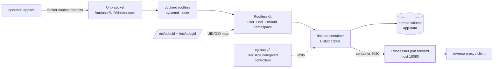

# Weekly Docker Magazine — Rootless は「root不要」ではなく境界の再設計

#docker #containers #weekly #deep-dive

[[Home]]

> [!warning] 破壊的操作について
> 本文の `docker rm -f`、`docker rmi`、`docker system prune` は、対象確認なしに実行しない。特に `prune` はこのラボ以外の未使用資産も消し得る。本ラボの cleanup はラベルと明示名で対象を限定する。秘密値を Dockerfile、イメージ層、Compose ファイル、Git 管理ファイルへ書き込まない。

## 1. Focus、難易度、前提、測定可能な到達点

### Focus

単一の本番基準は **「Docker daemon とコンテナを非 root ユーザーの user namespace 内で動かし、その隔離が実際に効いていることを証拠で示す」** こと。本号では Rootless mode を単なるインストール方法ではなく、daemon socket、UID/GID、永続データ、ネットワーク、cgroup、起動継続性を含む運用境界として扱う。

### 難易度シグナル: Specialized

これは参加資格ではなく案内表示である。Linux ホスト設定と systemd を扱うため Specialized としたが、各検証は観測→仮説→実験の順に進める。

### 必要な知識・ツール・環境・既習概念

- 知識: Linux の UID/GID、所有権、Unix socket、namespace、cgroup の基礎
- ツール: Linux、Docker Engine 20.10 以降、`bash`、`curl`、`stat`、`ps`、`systemctl`
- 推奨環境: 使い捨て Ubuntu/Debian VM、systemd、cgroup v2、sudo 可能な管理ユーザー
- ホスト要件: `newuidmap` / `newgidmap`、対象ユーザーに `/etc/subuid` と `/etc/subgid` で最低 65,536 ID
- 既習概念: `docker context`、ポート公開、volume、healthcheck、CPU/メモリ/PID制限
- 注意: Docker Desktop 内部 VM、CI の共有 runner、企業管理端末ではホスト前提が異なる。まず preflight だけを実行する。

### 測定可能な到達点

終了時に次を証拠付きで達成する。

1. `docker info` の `rootless` を確認し、CLI がどの socket に接続しているか説明できる。
2. コンテナ内 UID 0 がホスト上の非特権 subordinate UID に対応することを `/proc/*/uid_map` と `ps` で示せる。
3. bind mount の所有権事故を再現し、named volume または明示 UID 設計で修正できる。
4. cgroup v2/systemd/controller delegation を検査し、`--memory` 等が「指定された」だけでなく「実効化された」ことをテストできる。
5. Rootless の制約を踏まえ、採用／不採用の判断記録を作れる。

## 2. 実アプリのシナリオと制約

社内の小規模な文書変換 API を、開発チーム専用 Linux VM で動かす。API は静的レスポンスを返し、状態を volume に書く。運用条件は次の通り。

- Docker を操作するアプリ担当者へホスト root 相当権限を渡したくない。
- 単一ホスト、外部 reverse proxy が TLS 終端し、アプリは high port `18080` で公開する。
- 512 MiB 未満、PID 100 未満という DoS 境界を監視したい。
- 再起動後も daemon がログインなしで起動する必要がある。
- データはホストの任意パスへ直接書かず、バックアップ対象の named volume を使う。
- Swarm overlay network、SCTP、checkpoint/restore は不要。
- アプリの秘密は実行時 secret store から供給する。本ラボには秘密値を置かない。

**受入基準:** rootful daemon を誤って操作していない、rootless socket がネットワーク公開されていない、UID mapping が確認できる、リソース上限が効くか非対応として明示される、再起動設計と rollback が文書化される。

## 3. Foundation — container/runtime mental model

Rootless mode では、`dockerd`、containerd、コンテナプロセスが、ある一般ユーザーが所有する user namespace の内側で動く。コンテナ内の `root` は「その namespace 内で UID 0」だが、初期（ホスト）user namespace では `/etc/subuid` から割り当てられた高い UID である。

```text
Docker CLI
  └─ unix:///run/user/<uid>/docker.sock
      └─ dockerd-rootless.sh  (host上は一般ユーザー)
          └─ RootlessKit user/network/mount namespace
              └─ container PID, UID 0 inside
                   ↕ uid_map
                 high subordinate UID on host
```

`userns-remap` との決定的な違いは、後者ではコンテナ UID は再マップされても daemon 自体は root である点。Rootless は daemon も非 root にする。一方、`USER app` を Dockerfile に書く設計はアプリプロセスの最小権限化であり、Rootless の代替ではない。防御層は併用する。

ネットワークとストレージにも境界が増える。RootlessKit がホスト側とのポート転送を仲介し、`docker inspect` の IP は RootlessKit 内の namespace の値となる。データ root は通常 `~/.local/share/docker`、socket は `$XDG_RUNTIME_DIR/docker.sock` にあり、rootful daemon の `/var/run/docker.sock` とは別世界である。

## 4. 設計候補と明示的な trade-off

| 選択肢 | daemon 権限 | 長所 | 代償・不適合条件 |
|---|---:|---|---|
| Rootless mode | 一般ユーザー | daemon/runtime 脆弱性のホスト影響を低減、利用者単位に分離 | cgroup/systemd要件、低位port、storage/network機能制約、ユーザー単位運用 |
| rootful + `userns-remap` | root | コンテナrootを高UIDへ写像、既存rootful運用と親和 | daemon socket利用者は依然強権限、既存イメージ/volumeの所有権移行が必要 |
| rootful + 非root `USER` | root | 単純、幅広い機能、アプリ侵害を抑制 | daemonの攻撃面は残る、bind mountやcapabilityの設計が必要 |
| VM / managed orchestrator | 管理面次第 | 強い境界、HA/スケール/ポリシーを委譲可能 | コスト、複雑性、運用主体が変わる |

判断原則は「Rootless だから安全」ではなく、脅威モデルに対して何が小さくなり、何が残るかである。Rootless socket を奪った攻撃者は、そのユーザーの daemon が触れられるデータとコンテナを全面操作できる。ホスト kernel 脆弱性、ユーザーホームの秘密、過剰な bind mount、アプリ自身の脆弱性は消えない。

## 5. アーキテクチャ／build flow



build は通常の BuildKit で行うが、成果物と runtime は rootless daemon の data-root に保存される。別 context で同名イメージを build しても同じ image store ではない。

## 6. Guided lab（目安 150 分）

### 時間配分

- 0–20分: preflight と脅威モデル
- 20–50分: Rootless daemon/context の準備
- 50–90分: サンプル build・実行・UID mapping 観測
- 90–120分: cgroup と所有権の failure injection
- 120–150分: セキュリティ、計測、cleanup、判断記録

### 6.1 作業ディレクトリと完成ファイル

```bash
mkdir -p rootless-lab/app
cd rootless-lab
```

`app/server.py`:

```python
from http.server import BaseHTTPRequestHandler, HTTPServer
from pathlib import Path
import json, os

DATA = Path("/data/hits.txt")

class Handler(BaseHTTPRequestHandler):
    def do_GET(self):
        if self.path == "/healthz":
            body, status = b"ok\n", 200
        elif self.path == "/":
            DATA.parent.mkdir(parents=True, exist_ok=True)
            count = int(DATA.read_text() or "0") + 1 if DATA.exists() else 1
            DATA.write_text(str(count))
            body = (json.dumps({
                "hits": count,
                "uid": os.getuid(),
                "gid": os.getgid()
            }) + "\n").encode()
            status = 200
        else:
            body, status = b"not found\n", 404
        self.send_response(status)
        self.send_header("Content-Type", "application/json")
        self.send_header("Content-Length", str(len(body)))
        self.end_headers()
        self.wfile.write(body)

HTTPServer(("0.0.0.0", 8080), Handler).serve_forever()
```

`Dockerfile`:

```dockerfile
# syntax=docker/dockerfile:1
FROM python:3.13-alpine
RUN addgroup -g 10001 app && adduser -D -u 10001 -G app app \
    && mkdir /data && chown app:app /data
WORKDIR /app
COPY --chown=app:app app/server.py ./server.py
USER 10001:10001
EXPOSE 8080
HEALTHCHECK --interval=5s --timeout=2s --retries=5 \
  CMD wget -qO- http://127.0.0.1:8080/healthz || exit 1
ENTRYPOINT ["python", "server.py"]
```

`.dockerignore`:

```gitignore
.git
__pycache__
*.pyc
.env
secrets/
```

`compose.yaml`:

```yaml
services:
  api:
    build:
      context: .
    image: rootless-lab/api:2026-08-26
    container_name: rootless-lab-api
    labels:
      lab.scope: rootless-2026-08-26
    ports:
      - "127.0.0.1:18080:8080"
    volumes:
      - app-data:/data
    read_only: true
    tmpfs:
      - /tmp:size=16m,mode=1777
    cap_drop:
      - ALL
    security_opt:
      - no-new-privileges:true
    pids_limit: 100
    mem_limit: 128m
    cpus: 0.50
    restart: unless-stopped

volumes:
  app-data:
    labels:
      lab.scope: rootless-2026-08-26
```

> [!important]
> Compose に API key や password を直書きしない。`.env` もイメージへコピーしない。本番は外部 secret store、Docker secrets が適合する環境、または権限を絞った実行時ファイルを用いる。

### 6.2 ファイルの行ごとの意味

`Dockerfile`:

- `# syntax=...`: 現行 Dockerfile frontend を選ぶ。
- `FROM`: 小さい Alpine ベースを固定 major/minor 系で使用。厳密再現には digest pin も検討する。
- `RUN addgroup...`: アプリ専用 UID/GID 10001 を作り、書込先だけ所有させる。
- `WORKDIR`: 実行時カレントディレクトリ。
- `COPY --chown`: build 時点で所有権を確定し、追加 layer の `chown` を避ける。
- `USER`: Rootless daemon に加え、コンテナ内プロセスも非 root にする第二の層。
- `EXPOSE`: 文書上の待受port。公開はしない。
- `HEALTHCHECK`: HTTP 応答を5秒間隔で検査する。
- `ENTRYPOINT`: shell を挟まず Python を PID 1 として起動する。

`compose.yaml`:

- `build.context`: このディレクトリを build context にする。
- `image`: 測定・rollback可能な明示tag。
- `labels`: cleanup 対象を識別する安全柵。
- `127.0.0.1:18080:8080`: 外部全IFでなく loopback の high port のみに公開。
- named volume: ホスト任意パスの所有権問題を避け、daemon管理領域へ状態を置く。
- `read_only`: root filesystem の書込みを禁止。必要な `/data` と `/tmp` だけ別mount。
- `tmpfs`: 一時データをメモリ上に限定。
- `cap_drop: ALL`: アプリに不要な Linux capabilities を除く。
- `no-new-privileges`: `execve` 後の権限増加を抑止。
- `pids_limit` / `mem_limit` / `cpus`: DoS境界。ただし rootless では cgroup 条件を後で必ず検証する。
- `restart`: daemon再起動後に復帰。ただし user service と linger が先に必要。

### 6.3 Preflight（変更なし）

```bash
id
command -v newuidmap newgidmap
grep "^$(id -un):" /etc/subuid /etc/subgid
stat -fc %T /sys/fs/cgroup
systemctl --user is-system-running || true
docker context ls
docker info --format '{{json .SecurityOptions}}' 2>/dev/null || true
```

行ごとの意味:

- `id`: 対象ユーザーの実 UID/GID を記録。
- `command -v`: UID mapping helper の存在を検査。
- `grep`: subordinate ID の開始値と範囲を検査。範囲は最低 65,536 必要。
- `stat`: `cgroup2fs` なら cgroup v2。
- `systemctl --user`: user manager が利用できるか確認。
- `context ls`: rootful/rootless の取り違えを予防。
- `docker info`: 現在接続中 daemon の security options を観測。

期待例:

```text
/usr/bin/newuidmap
/usr/bin/newgidmap
/etc/subuid:appsvc:231072:65536
/etc/subgid:appsvc:231072:65536
cgroup2fs
```

**Checkpoint A:** helper、subuid/subgid、cgroup version、現在の context を `evidence.txt` に記録する。不足があれば先へ進まず、ホスト管理者へ依頼する。

### 6.4 Rootless daemon の導入／選択

以下は使い捨て VM で、管理者承認済みの場合だけ行う。既存 rootful daemon を停止すると他 workload に影響するため、共有ホストでは実行しない。

```bash
dockerd-rootless-setuptool.sh check
dockerd-rootless-setuptool.sh install
systemctl --user enable --now docker
sudo loginctl enable-linger "$(id -un)"
docker context use rootless
docker info
```

- `check`: 前提を診断し、変更しない。
- `install`: user unit と rootless context を作る。非 root ユーザーで実行する。
- `systemctl --user`: system service ではなくユーザーの daemon を有効化・起動。
- `enable-linger`: ログアウト後／boot後も user manager を維持するホスト管理変更。
- `context use`: CLI の接続先を rootless socket へ切替。
- `info`: `Security Options` に `rootless` があることを最終確認。

`docker context inspect rootless` で endpoint が通常 `unix:///run/user/<UID>/docker.sock` であることを確認する。`DOCKER_HOST` が設定されていると context より優先され得るので `env | grep '^DOCKER_'` も記録する。

**Checkpoint B:** 次が成立すること。

```bash
test "$(docker context show)" = rootless
docker info --format '{{json .SecurityOptions}}' | grep -q rootless
docker context inspect rootless --format '{{.Endpoints.docker.Host}}'
```

### 6.5 Build、起動、正常系テスト

```bash
docker compose config
docker compose build --pull
docker image inspect rootless-lab/api:2026-08-26 --format '{{.Size}}'
docker compose up -d
docker compose ps
curl --fail http://127.0.0.1:18080/healthz
curl --fail http://127.0.0.1:18080/
curl --fail http://127.0.0.1:18080/
```

- `config`: merge・変数展開後の設定を事前検査する。
- `build --pull`: ベース image の新しい版を確認して build。
- `image inspect`: 圧縮転送サイズではなく local image の内容サイズを bytes で取得。
- `up -d`: rootless daemon 上で作成・バックグラウンド起動。
- `ps`: health と port binding を確認。
- `curl`: health と永続 counter をテスト。

期待例:

```text
ok
{"hits": 1, "uid": 10001, "gid": 10001}
{"hits": 2, "uid": 10001, "gid": 10001}
```

永続性テスト:

```bash
docker compose restart api
curl --fail http://127.0.0.1:18080/
docker compose exec api sh -c 'id; test ! -w /; test -w /data; test -w /tmp'
```

期待値は `hits: 3`、UID/GID 10001、`/` は書込不可、`/data` と `/tmp` は書込可。

### 6.6 UID mapping を証明する

```bash
container_pid=$(docker inspect -f '{{.State.Pid}}' rootless-lab-api)
cat "/proc/${container_pid}/uid_map"
cat "/proc/${container_pid}/gid_map"
ps -o pid,user,uid,group,gid,args -p "${container_pid}"
docker exec rootless-lab-api id
```

- `State.Pid`: host 側から見えるコンテナ init PID。
- `uid_map/gid_map`: namespace 内ID、host開始ID、範囲の対応。
- `ps`: host 初期 namespace 側の所有者を観測。
- `docker exec id`: 同じプロセス空間をコンテナ側の見え方で観測。

`uid_map` の典型例は、呼出ユーザー自身に対する1件の mapping と、subordinate range に対する mapping を含む。正確な数値は環境依存であり、丸暗記せず実測する。

**Checkpoint C:** 「コンテナ内 UID 10001 がホスト上のどの UID に見えるか」を evidence に保存する。

### 6.7 cgroup の実効性テスト

```bash
docker info --format 'driver={{.CgroupDriver}} version={{.CgroupVersion}}'
controller_file="/sys/fs/cgroup/user.slice/user-$(id -u).slice/user@$(id -u).service/cgroup.controllers"
cat "$controller_file"
docker inspect rootless-lab-api --format 'memory={{.HostConfig.Memory}} nano_cpus={{.HostConfig.NanoCpus}} pids={{.HostConfig.PidsLimit}}'
docker stats --no-stream rootless-lab-api
```

期待する設定値は memory `134217728`、nano_cpus `500000000`、pids `100`。しかし inspect は要求値であり、kernel での実効性を単独では証明しない。Rootless で cgroup flags が有効なのは cgroup v2 + systemd の条件下。さらに利用する controller が user service へ delegate されている必要がある。

メモリ境界の安全な短時間テスト:

```bash
docker run --rm --memory 32m --label lab.scope=rootless-2026-08-26 \
  python:3.13-alpine python -c 'x=bytearray(96*1024*1024); print(len(x))'
```

上限が有効なら process は kill され、非0終了するのが期待値。`docker info` の driver が `none`、または memory controller がなければ「制限済み」と報告してはいけない。ホストの systemd delegate 設定変更は影響範囲が広いため、このラボでは行わず管理者への成果物にする。

## 7. コマンドと構成を読むための共通ルール

- `docker context show` を本番操作前のプロンプト確認と同じ扱いにする。
- `docker info` は client ではなく接続先 server の事実を確認する。
- `--format` は証拠を機械判定可能にするが、空値や version 差を考慮する。
- `127.0.0.1:...` は loopback に限定する。`18080:8080` は全 interface 公開になり得る。
- `--rm` は一時コンテナだけに用いる。障害解析用 container を消す前に logs/inspect を採取する。
- `sudo docker ...` は rootful socket へ接続して別世界を操作し得るため、Rootless 運用手順に混ぜない。
- `loginctl enable-linger` はユーザー session の寿命を変える管理操作であり、組織の運用基準に記録する。

## 8. Failure injection と体系的 debugging

### 演習A: context 取り違え

注入前に rootful context の有無を `docker context ls` で確認する。共有ホストでは切り替えず、思考実験だけにする。

```bash
docker context show
docker context use default
docker ps --filter label=lab.scope=rootless-2026-08-26
```

症状: コンテナが消えたように見える、または permission denied。実際には別 daemon を見ている。

体系的手順:

1. `docker context show`
2. `env | grep '^DOCKER_'`（`DOCKER_HOST` の上書き確認）
3. `docker context inspect <name>`
4. `docker version` で server 応答を確認
5. `docker context use rootless` へ戻す

### 演習B: bind mount 所有権事故

```bash
mkdir -p bind-data
chmod 700 bind-data
docker run --rm --user 10001:10001 \
  -v "$PWD/bind-data:/data" alpine:3.22 sh -c 'echo test > /data/probe'
```

期待症状: `Permission denied`。Rootless + container `USER` + host path の三つの UID 視点がずれている。

診断:

```bash
stat -c 'host owner=%u:%g mode=%a path=%n' bind-data
docker run --rm -v "$PWD/bind-data:/data" alpine:3.22 stat -c 'container owner=%u:%g mode=%a path=%n' /data
```

修正案:

- この用途では named volume を採用する。
- bind mount が必須なら UID mapping を計算・検証し、管理された専用ディレクトリだけを正しい ownership にする。
- `chmod 777` や常時 `USER 0` は境界を壊す回避策なので採用しない。

### 演習C: resource limit が黙って効かない

症状: Compose/inspect には値があるが、負荷が上限を越える。

```bash
docker info --format '{{.CgroupDriver}} / {{.CgroupVersion}}'
systemctl --user status docker --no-pager
cat "$controller_file"
docker events --since 10m --filter container=rootless-lab-api
journalctl --user -u docker --since '-10 min' --no-pager
```

順番は **接続先→host機能→controller delegation→要求設定→runtime観測→daemon log**。いきなり再起動や設定変更をしない。`Cgroup Driver: none` なら Rootless 公式制約に該当し、SLO に resource isolation が必須なら別ホスト構成または rootful/managed runtime を選ぶ。

## 9. Security review、サイズ／性能測定、本番 readiness

### Security review

- daemon socket の mode/owner: `stat "$XDG_RUNTIME_DIR/docker.sock"`
- socket を TCP `0.0.0.0:2375` に公開していない。
- Dockerfile は `USER 10001:10001`、Compose は `cap_drop: ALL` と `no-new-privileges`。
- bind mount で `/`、`/etc`、ホーム全体、SSH key、Docker socket を渡していない。
- image や history に秘密がない: `docker history --no-trunc rootless-lab/api:2026-08-26`
- base image の digest pin、脆弱性 scan、SBOM、署名検証は release pipeline の別 control として実施。
- Rootless は kernel exploit を防ぐ保証ではない。kernel patch と host hardening は継続する。
- 公式の既知制約（storage driver、cgroup、overlay network、SCTP、checkpoint、低位port、source IP）を採用判定に照合する。

### Image size と起動性能

```bash
docker image inspect rootless-lab/api:2026-08-26 --format 'bytes={{.Size}}'
docker history rootless-lab/api:2026-08-26
/usr/bin/time -f 'elapsed=%e sec maxrss=%M KiB' \
  docker run --rm --name rootless-lab-timing \
  --label lab.scope=rootless-2026-08-26 rootless-lab/api:2026-08-26
```

最後の server は待ち続けるため、別 terminal から `docker stop rootless-lab-timing` して測る。より再現性を求めるなら 5 回測定し、初回 pull/build を除外して median を記録する。Rootless と rootful の比較は同一 host、同一 image digest、warm cache、同一回数で行う。差があっても測定なしにネットワーク仲介のせいと断定しない。

### Production-readiness checklist

- [ ] 専用サービスユーザーと 65,536 以上の subuid/subgid が管理されている
- [ ] `docker info` の rootless と context endpoint を監視／監査できる
- [ ] user systemd unit が enabled、必要なら linger が承認済み
- [ ] cgroup v2、driver、必要 controller の delegation を実測した
- [ ] memory/PID/CPU の failure test が期待通り、または非対応を risk acceptance 済み
- [ ] privileged port を避け、reverse proxy から high port へ接続する
- [ ] source IP が必要な logging/rate limit 設計を実機検証した
- [ ] named volume の backup/restore と RPO/RTO を試験した
- [ ] rootless data-root が NFS 上でない。採用 storage driver が公式対応範囲
- [ ] socket、ホーム、runtime dir の権限と容量監視がある
- [ ] secrets は image/Compose/Git に存在せず、runtime で最小権限注入される
- [ ] image scan、SBOM、provenance/署名、digest pin の CI control がある
- [ ] logs は標準出力へ出し、rotation/配送障害時の容量上限がある
- [ ] Rootless 非対応機能が将来要件に入った場合の rollback/移行手順がある

## 10. Cleanup（対象限定）

まず対象を表示する。

```bash
docker context use rootless
docker ps -a --filter label=lab.scope=rootless-2026-08-26
docker volume ls --filter label=lab.scope=rootless-2026-08-26
docker image ls rootless-lab/api:2026-08-26
```

確認後にラボ資産だけを削除する。

```bash
docker compose down --volumes
docker image rm rootless-lab/api:2026-08-26
```

`docker image rm` は当該 image に依存する別 container がないことを確認してから実行する。`docker rm -f` や `docker system prune` は不要。Rootless daemon 自体を削除する場合は、他の rootless workload と volume がないことを確認し、公式 uninstall 手順と組織の rollback 手順に従う。

## 11. Concrete deliverables

1. `Dockerfile`、`.dockerignore`、`compose.yaml`、`app/server.py`
2. `evidence.txt`: context endpoint、SecurityOptions、uid_map/gid_map、cgroup driver/version/controllers
3. `measurements.md`: image bytes、history、起動時間 5 回と median、rootful比較をした場合の条件
4. `failure-report.md`: 3 演習の症状、仮説、コマンド、観測、根因、恒久対策
5. `adr-rootless.md`: 採用／不採用、脅威、残存risk、非対応機能、rollback trigger、owner
6. production-readiness checklist の署名済みコピー

## 12. Assessment

### 5問

1. Rootless mode と `userns-remap` の daemon 権限上の違いは何か。

<details><summary>答え</summary>
Rootless は daemon と container の双方を非 root user namespace 内で動かす。userns-remap は container UID/GID を再マップするが daemon 自体は root で動く。
</details>

2. `docker inspect` に `Memory=134217728` があれば上限は必ず有効か。

<details><summary>答え</summary>
いいえ。それは要求設定の証拠。Rootless では cgroup v2 + systemd と必要 controller delegation を確認し、実負荷テストや cgroup/runtime 観測で実効性を検証する。
</details>

3. `docker ps` から急に workload が消えたとき、最初に何を見るか。

<details><summary>答え</summary>
`docker context show`、`DOCKER_HOST`、context endpoint。rootful と rootless の別 daemon を見ている可能性を先に除外する。
</details>

4. Rootless なのに Dockerfile の `USER` が必要な理由は何か。

<details><summary>答え</summary>
Rootless は host に対する daemon/runtime 境界。`USER` は container 内のアプリ権限を絞り、同一 container filesystem や付与resourceへの被害を減らす別の防御層だから。
</details>

5. なぜ本ラボは port 80 でなく `127.0.0.1:18080` を使うか。

<details><summary>答え</summary>
1024未満の privileged port に必要な host設定変更を避け、外部公開を loopback に限定し、前段 proxy に境界を置くため。
</details>

### Interview / design question

「50人の開発者が共有する build host にユーザーごとの Rootless Docker を導入したい。disk quota、subuid range、cache、socket access、ログ、cgroup delegation、退職者 cleanup、CI identity をどう設計するか。Rootless daemon 50個と中央 build service の trade-off を説明せよ。」

良い回答は、単なる『非 root で安全』ではなく、UID range の一意性、data-root容量、user service lifecycle、socket所有権、cache重複、監査、resource fairness、秘密配送、脆弱性対応、代替案を扱う。

### Optional advanced challenge

同一 digest の image を rootful と rootless の両 context で起動し、次を自動収集する `compare.sh` を作る。

- context endpoint / SecurityOptions
- container内 `id` と host側 PID/UID mapping
- cold/warm start 5回の median
- loopback HTTP 100回の latency p50/p95（`hyperfine` や `hey` があれば使用）
- memory/PID limit の failure test
- network source IP の観測

結果を「security benefit」「機能差」「性能差」「運用コスト」に分け、Rootless 採用 ADR を更新する。測定環境と不確かさを必ず記載する。

## 13. 公式 Docker ドキュメント（2026-08-26 確認）

- [Rootless mode](https://docs.docker.com/engine/security/rootless/) — 仕組み、前提、導入、context、uninstall
- [Rootless mode: Tips](https://docs.docker.com/engine/security/rootless/tips/) — systemd、linger、低位port、cgroup制限
- [Rootless mode: Troubleshooting](https://docs.docker.com/engine/security/rootless/troubleshoot/) — distribution別問題、storage/network/cgroup等の既知制約
- [Docker Engine security](https://docs.docker.com/engine/security/) — namespace、cgroup、daemon attack surface、capabilities
- [Isolate containers with a user namespace](https://docs.docker.com/engine/security/userns-remap/) — userns-remapとの比較、subuid/subgid mapping
- [Protect the Docker daemon socket](https://docs.docker.com/engine/security/protect-access/) — socket/SSH/TLSとdaemon権限
- [Configure remote access for Docker daemon](https://docs.docker.com/engine/daemon/remote-access/) — 無保護なremote API公開の危険
- [Verify repository client with certificates](https://docs.docker.com/engine/security/certificates/) — Rootless時の証明書配置差

---

### 今週の一文

**Rootless の成果物は「起動できた画面」ではない。socket、UID mapping、cgroup、永続化、再起動、制約を実測した運用判断である。**
