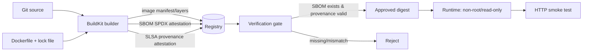

# Weekly Docker Magazine — 「何が入っているか」と「どう作ったか」を証明する

#docker #containers #weekly #deep-dive

[[Home]]

> [!warning] 削除操作と秘密情報
> `docker system prune` / `docker image prune` / `docker rmi` / `docker rm -f` は、別プロジェクトの資産や稼働サービスを消し得る。実行前に必ず `docker ps -a`、`docker image ls`、対象名を確認する。本ラボのcleanupは明示名に限定する。
>
> token、パスワード、秘密鍵をDockerfile、build context、`ARG`、`ENV`、Composeファイルへ書かない。特に `mode=max` provenanceにはbuild arguments等が記録され得るため、秘密値はBuildKit secret mountまたはCIのcredential mechanismで渡す。本ラボにsecretは不要である。

## 1. Focus、難易度、前提、測定可能な到達点

### Focus

本号が扱う単一の本番基準は次である。

> **リリース対象のイメージdigestに、検査可能なSBOMとprovenance attestationが結び付いており、CI/CDが欠落・不一致を検出してデプロイを拒否できること。**

SBOMは「何が入ったか」、provenanceは「どの入力・builder・手順で作られたか」を表す。どちらも脆弱性がないことや署名者の本人性を単独で保証しない。本号は生成・保存・検査・policy化までを扱い、暗号署名とkeyless identity検証はOptional challengeに分離する。

### 難易度シグナル: Specialized

これは案内表示であり参加資格ではない。manifest/index、registry、attestationの関係を扱うためSpecializedとした。

### 必要な知識・ツール・環境・既習概念

- 知識: Dockerfile、multi-stage build、tagとdigestの違い、JSONの基本
- ツール: 現行Docker EngineまたはDocker Desktop、Compose v2、Buildx、`curl`、`jq`、`sha256sum`
- 環境: Linux containerを実行でき、`127.0.0.1:5000`と`127.0.0.1:8080`が空いている開発機。空きRAM 2 GiB、空きdisk 2 GiBを推奨
- earlier concepts: build context最小化、multi-stage build、非root実行、digest pinning、secretを`ARG`/`ENV`で渡さないこと
- 前号との接続: Rootlessはruntimeの権限境界。本号は、そのruntimeへ入る**artifactの来歴境界**を作る
- 注意: Docker公式によるとattestationはimage indexのmanifestとして付く。classic image storeへ`--load`するだけでは保持できないため、本ラボは`docker-container` builderからregistryへ直接pushする

### 150分後の合格条件

1. `localhost:5000/supply-api:v1`をbuildし、SBOMと`mode=max` provenanceをregistryへ保存する。
2. SBOMをSPDX JSONへ抽出し、アプリ依存とOS packageを検索できる。
3. provenanceからbuilder、source/input、build parametersを確認できる。
4. attestationなしの`v1-broken`を作り、検査scriptがnon-zeroで拒否する。
5. imageをtagではなくdigestで実行し、レスポンスtestとサイズ測定を残す。

## 2. 実アプリのシナリオと制約

社内の「release情報API」をCIでbuildし、検証registryを経て本番へpromoteする。監査担当は、実行中artifactに含まれるcomponentとbuild経路を後から確認したい。

- runtimeは非root、read-only root filesystem、loopback公開のみ
- app imageは100 MiB未満を目標にする
- tagは可変なので、deploy承認後はdigestで固定する
- build-stageのcompilerやpackage managerはruntime imageに残さない
- SBOM/provenanceのないreleaseはdeploy対象外
- vulnerability scanの結果とSBOMの存在は別のgateとする
- local registryは学習用でTLS/authなし。外部interfaceへ公開せず、本番ではTLS・auth・保持・access logを備えたregistryを使う
- signing key、registry token、Git credentialはimage/configへ埋め込まない

**受入基準:** app test成功、SBOM抽出成功、provenance確認成功、欠落注入時のgate失敗、digest pinning、image size記録、cleanup対象の限定。

## 3. Foundation — container/runtime mental model

tagは名前のpointerで上書き可能、digestはcontent-addressed identifierである。attestationはcontainer filesystemの中のファイルではなく、registry上でimage indexに関連付けられた別manifestとJSON blobである。

```text
tag: localhost:5000/supply-api:v1
  └─ image index digest sha256:AAAA
       ├─ linux/amd64 image manifest → config + layers
       ├─ SBOM attestation manifest → in-toto/SPDX JSON blob
       └─ provenance manifest       → in-toto/SLSA JSON blob
```

したがって、`docker run IMAGE`だけではattestationをcontainer内にmountしない。consumerはregistry APIまたは`docker buildx imagetools inspect`でmetadataを検査し、許可されたdigestだけをruntimeへ渡す。

SBOMはinventoryである。「package Xがある」は示すが、安全性、脆弱性の悪用可能性、license許容性を自動では決めない。provenanceもbuild recordであり、build serviceのidentityを暗号的に信頼するには署名・identity・policyが追加で必要である。

Docker公式ではminimal provenanceが既定で生成される場合があるが、本号では暗黙既定に依存せず`--provenance=mode=max --sbom=true`を明示する。SBOMは既定でfinal stageをscanする。build-stageもinventoryへ含めたい場合はDockerfileで`ARG BUILDKIT_SBOM_SCAN_STAGE=true`を対象stageに宣言する。

## 4. 設計候補と明示的trade-off

| 設計 | 長所 | 代償・限界 | 判断 |
|---|---|---|---|
| build後にSBOMを別fileで保管 | 単純、既存toolに渡しやすい | image digestとの関連付けを失いやすい | 補助exportとして利用 |
| build時SBOM attestation | digestと共に配布、build-stageも選択可 | registry/index対応が必要 | 採用 |
| final imageだけscan | runtime exposureへ集中、noiseが少ない | toolchain由来riskを見落とす | runtime gate用 |
| build stageもscan | compiler/toolchainの可視性 | SBOM増大、runtime非存在packageも載る | 監査用に採用 |
| provenance `mode=min` | metadata漏えい面が小さい |追跡情報が少ない | private/敏感buildの候補 |
| provenance `mode=max` | 入力・手順を詳しく調査可能 | build args等のmetadata公開範囲を要確認 | 本ラボ採用、secret禁止 |
| tagでdeploy | 人が読みやすい | 同じtagが別contentを指し得る | 不採用 |
| digestでdeploy | artifactを一意に固定 | 更新はdigest差替えが必要 | 採用 |
| SBOMありなら許可 | 実装が容易 | 空・不完全・偽装SBOMを許し得る | 最初のgateのみ |
| SBOM + provenance +署名 + policy | identity・内容・来歴を合わせて判断 | PKI/OIDC、失効、policy運用が必要 | 本番目標 |

> Docker Content Trust / Notary v1を新規採用しない。Docker公式はDCTをretire中で、`notary.docker.io`は2026-12-08停止予定としている。新設計ではSigstore/CosignまたはNotation等の移行先を評価する。

## 5. Architecture / build・promotion flow



## 6. Guided lab（150分）

### 時間配分

- 0–20分: preflightとmental model
- 20–50分: sample作成とbaseline build
- 50–85分: attestation付きbuild/push
- 85–110分: SBOM/provenance検査とgate
- 110–130分: failure injection/debug
- 130–150分: security、size/performance、cleanup、成果物整理

### 6.1 Preflight

```bash
docker version
docker buildx version
docker compose version
jq --version
docker buildx ls
docker ps --format 'table {{.Names}}\t{{.Ports}}'
```

Checkpoint: Docker daemonへ接続でき、Buildxが表示され、5000/8080番を使用中のcontainerがない。使用中なら既存containerを消さず、本ラボのportを変更する。

### 6.2 完全なsample files

作業directoryを作る。

```bash
mkdir -p docker-attestation-lab/app docker-attestation-lab/scripts docker-attestation-lab/evidence
cd docker-attestation-lab
```

`app/main.py`:

```python
from http.server import BaseHTTPRequestHandler, HTTPServer
import json

class Handler(BaseHTTPRequestHandler):
    def do_GET(self):
        if self.path == "/healthz":
            body = {"status": "ok", "release": "v1"}
            payload = json.dumps(body).encode()
            self.send_response(200)
            self.send_header("Content-Type", "application/json")
            self.send_header("Content-Length", str(len(payload)))
            self.end_headers()
            self.wfile.write(payload)
        else:
            self.send_error(404)

HTTPServer(("0.0.0.0", 8080), Handler).serve_forever()
```

`requirements.txt`（外部Python dependencyを増やさない再現可能なsample）:

```text
# Python standard library only
```

`Dockerfile`:

```dockerfile
# syntax=docker/dockerfile:1
FROM python:3.13-alpine AS verify
ARG BUILDKIT_SBOM_SCAN_STAGE=true
WORKDIR /src
COPY app/main.py requirements.txt ./
RUN python -m py_compile main.py \
 && test "$(grep -vc '^#' requirements.txt)" -eq 0

FROM python:3.13-alpine AS runtime
RUN addgroup -S -g 10001 app \
 && adduser -S -D -H -u 10001 -G app app
WORKDIR /app
COPY --from=verify --chown=10001:10001 /src/main.py ./main.py
USER 10001:10001
EXPOSE 8080
ENTRYPOINT ["python", "/app/main.py"]
```

`.dockerignore`:

```gitignore
.git
.env
evidence
out
*.pem
*.key
**/__pycache__
```

`compose.yaml`（秘密値を含めない）:

```yaml
services:
  registry:
    image: registry:2
    container_name: docker-mag-registry
    ports:
      - "127.0.0.1:5000:5000"
    restart: "no"
```

`scripts/verify-release.sh`:

```sh
#!/bin/sh
set -eu

image="${1:?usage: verify-release.sh IMAGE}"
evidence_dir="${2:-evidence}"
mkdir -p "$evidence_dir"

docker buildx imagetools inspect "$image" > "$evidence_dir/index.txt"
docker buildx imagetools inspect "$image" \
  --format '{{ json .SBOM }}' > "$evidence_dir/sbom.spdx.json"
docker buildx imagetools inspect "$image" \
  --format '{{ json .Provenance }}' > "$evidence_dir/provenance.json"

jq -e 'type == "object" and length > 0' "$evidence_dir/sbom.spdx.json" >/dev/null
jq -e 'type == "object" and length > 0' "$evidence_dir/provenance.json" >/dev/null

digest="$(docker buildx imagetools inspect "$image" | awk '/^Digest:/ {print $2; exit}')"
test -n "$digest"
printf '%s@%s\n' "${image%:*}" "$digest" > "$evidence_dir/approved-image.txt"
printf 'PASS image=%s digest=%s\n' "$image" "$digest"
```

実行権限を付ける。

```bash
chmod +x scripts/verify-release.sh
```

### 6.3 Registryとbuilderを起動

```bash
docker compose up -d registry
curl -fsS http://127.0.0.1:5000/v2/
docker buildx create --name magazine-attest --driver docker-container --use
docker buildx inspect --bootstrap
```

期待値:

```text
{}
Name:          magazine-attest
Driver:        docker-container
Status:        running
```

表示はversionで多少異なる。`Driver`とnodeの`Status`をcheckpointにする。

**行ごとの意味:**

- `compose up -d registry`: loopback限定でdistribution registryをbackground起動
- `/v2/`: registry v2 APIの到達性確認。空JSONは正常
- `buildx create`: daemon内蔵classic storeに依存しないBuildKit container builderを作る
- `--use`: current contextでこのbuilderを選ぶ
- `inspect --bootstrap`: builderを起動しplatform/driverを確認

### 6.4 Baselineとattestation付きbuild

まずlocal outputでSBOM内容をpush前に確認する。

```bash
docker buildx build \
  --builder magazine-attest \
  --sbom=true \
  --provenance=mode=max \
  --output type=local,dest=out .
find out -maxdepth 1 -type f -name '*.json' -print
jq -r '.packages[]?.name' out/sbom.spdx.json | head
```

Checkpoint: `out/sbom.spdx.json`が存在し、JSONとして読める。build-stage scanを有効にしたため、環境によりstage別SBOMも出る。

次にregistryへpushする。

```bash
docker buildx build \
  --builder magazine-attest \
  --platform linux/amd64 \
  --tag localhost:5000/supply-api:v1 \
  --sbom=true \
  --provenance=mode=max \
  --push \
  --progress=plain . | tee evidence/build.log
```

**行ごとの意味:**

- `--platform linux/amd64`: lab結果を一platformに固定。arm64 hostは`linux/arm64`へ変える
- `--tag`: registry/repository/tagを付ける。承認時はdigestへ変換する
- `--sbom=true`: SPDX形式のSBOM attestationを生成
- `--provenance=mode=max`: 詳細provenanceを生成。公開範囲を必ずreviewする
- `--push`: attestationを保ったままregistryへ直接保存
- `--progress=plain`: CI logに残しやすい非TTY出力
- `tee`: build証跡をfileにも保存。credentialをlogへ出すcommand設計はしない

### 6.5 検査gateとtest

```bash
scripts/verify-release.sh localhost:5000/supply-api:v1 evidence
cat evidence/approved-image.txt
jq -r '.. | objects | .name? // empty' evidence/sbom.spdx.json | sort -u | head -20
jq 'keys' evidence/provenance.json
```

期待値:

```text
PASS image=localhost:5000/supply-api:v1 digest=sha256:...
localhost:5000/supply-api@sha256:...
```

JSONのnestingはBuildx versionやplatform数で異なるため、固定pathだけでなく最初に`jq 'keys'`と`jq '.. | objects'`で構造を観察する。

承認digestをpull/runする。

```bash
APP_REF="$(cat evidence/approved-image.txt)"
docker pull "$APP_REF"
docker run -d --name supply-api-lab \
  --read-only \
  --cap-drop ALL \
  --security-opt no-new-privileges=true \
  --memory 128m \
  --pids-limit 64 \
  -p 127.0.0.1:8080:8080 \
  "$APP_REF"
curl -fsS http://127.0.0.1:8080/healthz | tee evidence/health.json
jq -e '.status == "ok" and .release == "v1"' evidence/health.json
docker inspect supply-api-lab --format '{{.Config.User}} {{.HostConfig.ReadonlyRootfs}} {{.Image}}'
```

期待値:

```json
{"status": "ok", "release": "v1"}
```

inspectは概ね`10001:10001 true sha256:...`。ここでtestするのは「承認したdigestがnon-root/read-onlyで動く」こと。

## 7. Commandsとconfigurationの読み解き

### Dockerfile

- `# syntax=docker/dockerfile:1`: 現行Dockerfile frontendを選択
- `verify` stage: syntax checkだけを担当し、生成物をruntimeへ渡す
- `ARG BUILDKIT_SBOM_SCAN_STAGE=true`: このstageもSBOM scan対象にする。CLIだけで値を渡してもDockerfileに`ARG`宣言がなければ効かない
- `py_compile`: build時の最小test。unit test suiteがある実案件ではここへ置換
- `runtime`: build toolchainを分離する最終stage
- fixed UID/GID 10001: host/container間の所有者を予測しやすくする
- `COPY --from`: source全体ではなく必要なartifactだけを渡す
- `USER`: appをcontainer rootで動かさない
- exec-form `ENTRYPOINT`: PythonをPID 1としてsignalを直接受ける

### verification script

- `set -eu`: errorと未定義変数で即失敗
- `imagetools inspect`: image全体をpullせずregistry上のindex/attestationを調べる
- `--format '{{ json .SBOM }}'`: Docker公式のremote SBOM抽出方法
- `jq -e`: predicate不成立でnon-zeroになりCI gateへ使える
- `${image%:*}`: labの単純なtagを外してrepositoryを得る。port以外の複雑なreference parserとしては使わない
- `approved-image.txt`: deploy inputを可変tagからimmutable digestへ変換するhandoff artifact

## 8. Failure injectionと体系的debugging

### 注入A: attestationを落とす

同じsourceを、attestationを明示的に無効化して別tagへpushする。

```bash
docker buildx build \
  --builder magazine-attest \
  --tag localhost:5000/supply-api:v1-broken \
  --provenance=false \
  --sbom=false \
  --push .

if scripts/verify-release.sh localhost:5000/supply-api:v1-broken evidence/broken; then
  echo 'UNEXPECTED: gate passed'
  exit 1
else
  echo 'EXPECTED: missing attestations rejected'
fi
```

期待値: `jq`または`imagetools`の段階でnon-zeroとなり、`EXPECTED`が表示される。

### 注入B: classic storeへの`--load`

```bash
docker buildx build --builder magazine-attest \
  --sbom=true --provenance=mode=max --load \
  -t supply-api:local .
```

環境がclassic image storeならattestation非対応error、containerd image storeなら成功する場合がある。これはappのDockerfile故障ではなく**export先能力の差**である。

### 系統的なdebug順序

1. **CLI/daemon:** `docker version`、`docker buildx version`
2. **builder:** `docker buildx ls`、`docker buildx inspect magazine-attest`
3. **registry transport:** `curl -fsS http://127.0.0.1:5000/v2/`、`docker logs docker-mag-registry`
4. **build output:** `evidence/build.log`で`exporting attestation manifest`相当を探す
5. **index:** `docker buildx imagetools inspect IMAGE`
6. **SBOM/provenance:** JSONを抽出し、空でないか`jq -e`で検証
7. **identity:** tagから得たdigestと承認fileのdigestを比較
8. **runtime:** `docker inspect`、`docker logs supply-api-lab`、`curl`

症状→仮説→検査:

| 症状 | 仮説 | 検査・修正 |
|---|---|---|
| `connection refused :5000` | registry停止/port競合 | `docker compose ps`、`docker logs`、loopback port変更 |
| attestation unsupported | classic store/driver | `docker buildx ls`; `docker-container` + `--push`へ |
| SBOMが空 | `--sbom`欠落、別tag、format差 | index、build log、`jq keys`を確認 |
| build toolがSBOMにない | final stageだけscan | 対象stageに`ARG BUILDKIT_SBOM_SCAN_STAGE=true` |
| runtime pull失敗 | local registry到達性/arch違い | `/v2/`、platform、daemonのregistry route確認 |
| gate後にtag内容が変わる | tagでdeployした | `approved-image.txt`のdigestでdeploy |

## 9. Security review、size/performance測定、本番readiness

### Security review

- [ ] runtimeはUID 10001で、rootではない
- [ ] root filesystemはread-only、capabilityは全drop、no-new-privileges
- [ ] registryはloopback限定。学習用のHTTP registryをLAN/Internetへ公開しない
- [ ] Dockerfile/build context/Compose/provenanceにsecretがない
- [ ] base imageは検証済みdigestへpinする運用がある
- [ ] SBOMの生成だけでなくvulnerability/license policyへ接続する
- [ ] provenance builder identityをtrustする根拠がある
- [ ] deployはtagでなく承認digestを使用
- [ ] attestationへ署名し、consumer側で署名者identityを検証する計画がある
- [ ] DCT/Notary v1のretirementを踏まえ新規依存しない

### Image sizeとperformanceの測定

```bash
APP_REF="$(cat evidence/approved-image.txt)"
docker image inspect "$APP_REF" --format '{{.Size}}' | tee evidence/image-size-bytes.txt
docker history "$APP_REF" --no-trunc | tee evidence/history.txt
/usr/bin/time -f 'pull_elapsed=%e sec' docker pull "$APP_REF" 2> evidence/pull-time.txt
/usr/bin/time -f 'health_elapsed=%e sec' \
  curl -fsS http://127.0.0.1:8080/healthz >/dev/null 2> evidence/health-time.txt
```

評価:

- image size < 100 MiB（104857600 bytes）を本ラボのbudgetとする
- 最大layerを`docker history`で特定し、package cacheや不要toolがruntimeにないか確認
- attestation blobはruntime filesystem layerに混ざらないが、registry保存量とpush latencyは増える。実測値をCI baselineと比較する
- cold pullとwarm pullを混同しない。厳密な比較では専用runner/cache条件を固定する

### Production-readiness checklist

- [ ] release pipelineがSBOMとprovenanceを明示生成する
- [ ] attestationを保持できるregistry/outputを使う
- [ ] gateは欠落時fail-closedで、warningだけにしない
- [ ] expected repository、builder identity、source revision、platformをpolicy検証する
- [ ] approved digestだけをdeployment manifestへ渡す
- [ ] SBOM format/versionとretentionを定義する
- [ ] vulnerability DB更新時に既存digestを再評価できる
- [ ] exceptionにはowner、理由、期限、補償controlがある
- [ ]署名鍵またはOIDC identityのrotation/revocation手順がある
- [ ] registry GCがattestationを孤児化しないかstage環境で検証した
- [ ] disaster recoveryでimageと関連attestationを共に復元できる

## 10. Cleanup（対象を確認してから）

> [!danger] 実行前確認
> 次のcommandは本ラボのcontainer/builderだけを対象にする。`docker system prune`、`docker image prune`、広い`docker rmi`、無差別な`docker rm -f`は実行しない。`evidence/`は成果物なので先に保存する。

```bash
docker ps -a --filter name=supply-api-lab --filter name=docker-mag-registry
docker buildx ls
docker stop supply-api-lab
docker rm supply-api-lab
docker compose down
docker buildx use default
docker buildx rm magazine-attest
```

`localhost:5000/supply-api:*`はregistry containerのfilesystem内にあり、`docker compose down`でcontainerと共に消える（volumeを定義していないため）。localにpullしたdigest imageを削除する必要がある場合だけ、`docker image ls --digests`で正確なIDを確認してから個別に`docker rmi <IMAGE_ID>`を実行する。

## 11. Concrete deliverables

完了時に次を残す。

1. `Dockerfile`、`.dockerignore`、`compose.yaml`、`app/main.py`
2. fail-closedな`scripts/verify-release.sh`
3. `evidence/build.log`
4. `evidence/sbom.spdx.json`と`evidence/provenance.json`
5. `evidence/approved-image.txt`（digest固定reference）
6. `evidence/health.json`とtest結果
7. image size、pull/health timing、最大layerの測定メモ
8. failure injectionが拒否されたterminal記録
9. production checklistと、採用するsigning/identity方式のADR草案

## 12. Assessment

### Q1. SBOMとprovenanceは何が違うか

<details><summary>回答</summary>

SBOMはimage内またはbuildに関与したsoftware componentのinventory。provenanceはsource、builder、parameters等のbuild過程を記録する。前者は「何」、後者は「どう作ったか」。いずれも単独では署名者identityや無脆弱性を保証しない。
</details>

### Q2. なぜ`--load`ではなく`--push`を使ったか

<details><summary>回答</summary>

attestationはimage indexへmanifestとして付く。classic image storeはindex/attestationを保持できない。`docker-container` builderからregistryへ直接pushすれば保持できる。containerd image storeを有効にした環境ではlocal保持できる場合もある。
</details>

### Q3. tagではなくdigestをdeployする理由は

<details><summary>回答</summary>

tagは別contentへ動かせるがdigestはcontent-addressedである。gateが検査したartifactとruntimeがpullするartifactを一致させるため、承認結果をdigest referenceとして渡す。
</details>

### Q4. `mode=max` provenanceへsecretを`ARG`で渡すと何が危険か

<details><summary>回答</summary>

詳細provenanceにbuild arguments等が記録され、registryから閲覧可能になる可能性がある。secretは`ARG`/`ENV`へ入れず、BuildKit secret mountやCI credential mechanismを使い、露出した可能性があればrotateする。
</details>

### Q5. SBOMが存在すればproduction-readyか

<details><summary>回答</summary>

いいえ。completeか、対象digestと結び付くか、trusted builderが生成したか、既知脆弱性/license policyに合うか、署名identityが正しいかを別途検証する。SBOMは判断材料であり許可そのものではない。
</details>

### Interview / design question

複数arch imageを10サービスへ配布する組織で、SBOM/provenance/signatureを使ったpromotion gateを設計せよ。developer branch、protected release、緊急例外をどう分け、どのidentity・source revision・platform・vulnerability条件を誰が承認するか説明すること。

### Follow-up challenge（Optional advanced）

Sigstore/CosignまたはNotationのどちらかを選び、短命OIDC identityで`localhost`ではない検証registry上のrelease digestへ署名する。consumer gateで以下を検証する。

1. signatureの暗号検証
2. issuerとsubject/workflow identity
3. SBOM/provenanceのpredicate type
4. source repositoryとcommit SHA
5. 許可platformすべてのattestation存在
6. 期限付きexception以外はfail-closed

秘密鍵をrepository、image、Compose、CI logへ置かない。DCT/Notary v1ではなく、retirement後も維持される方式をADRで比較する。

## 13. Current official Docker references

- [Build attestations](https://docs.docker.com/build/metadata/attestations/) — attestationの目的、保存形式、driver/image store対応
- [SBOM attestations](https://docs.docker.com/build/metadata/attestations/sbom/) — `--sbom`、local exporter、build-stage/context scan
- [Provenance attestations](https://docs.docker.com/build/metadata/attestations/slsa-provenance/) — provenance modeとpredicate
- [`docker buildx build` CLI reference](https://docs.docker.com/reference/cli/docker/buildx/build/) — `--attest`、`--sbom`、`--provenance`、`--push`
- [Docker Scout: view and create SBOMs](https://docs.docker.com/scout/how-tos/view-create-sboms/) — remote imageからSPDX JSONを抽出
- [Add SBOM and provenance with GitHub Actions](https://docs.docker.com/build/ci/github-actions/attestations/) — CIでのattestationとsecret露出警告
- [Content trust in Docker](https://docs.docker.com/engine/security/trust/) — DCTの概念とretirement warning
- [Deprecated and retired Docker products and features](https://docs.docker.com/retired/) — DCT/Notary v1のretirement情報
- [Dockerfile best practices](https://docs.docker.com/build/building/best-practices/) — multi-stage、base image、rebuild、最小化

最終確認日: 2026-09-16。CLI flags、action version、retirement scheduleは更新され得るため、実装時に上記公式文書を再確認する。
