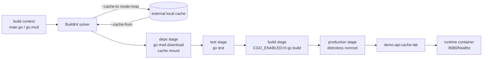

# Weekly Docker Magazine — 速いだけでなく、壊れ方まで設計するBuildKitキャッシュ

#docker #containers #weekly #deep-dive

[[Home]]

## 1. Focus、難易度シグナル、前提、測定可能な到達点

### Focus — 今週の単一本番基準

**エフェメラルなCIワーカーでも、依存関係だけの変更とアプリコードだけの変更を分離し、秘密を残さず、キャッシュ消失時にも正しく再構築できること。**

キャッシュは正しさの根拠ではない。正しいビルドを速くする最適化である。今週は、BuildKitのレイヤーキャッシュ、`RUN --mount=type=cache`、外部キャッシュを組み合わせ、キャッシュヒット率と再現性を測る。

**難易度シグナル: Intermediate** — 学習順の門ではない。Dockerfileを一度でも書いたことがあれば進められる。

### 必要な知識・ツール・環境・既習概念

- **知識:** Dockerfile命令、イメージとコンテナの違い、Go modules、ハッシュの概念
- **ツール:** Docker Engine 24+ または現行Docker Desktop、Buildx、`curl`、POSIX shell
- **環境:** Linuxコンテナを実行できる端末、約2 GBの空き容量、初回だけインターネット接続
- **既習概念:** build context、レイヤー、multi-stage build、`.dockerignore`
- 確認: `docker version && docker buildx version && docker info`

### 150分後の合格条件

1. cold / warm / source-change / dependency-change の4ビルド時間を記録できる。
2. ソース変更では依存ダウンロード工程が再利用される理由を説明できる。
3. 新規builderでも `--cache-from` により外部キャッシュを再利用できる。
4. キャッシュを削除してもテスト済みの同じ機能を再構築できる。
5. `ARG`、`ENV`、`COPY`で秘密を渡さず、secret mountを選べる。

## 2. 実アプリのシナリオと制約

小さなGo製HTTP APIを、PRごとに破棄されるCI runnerでビルドする。

- PRの目標ビルド時間はwarm時30秒未満。
- テスト失敗した成果物はruntime imageへ進めない。
- 本番imageにコンパイラ、ソース、モジュールキャッシュを含めない。
- キャッシュサーバ障害時も、遅くなるだけでビルドは成功する。
- private dependency用tokenはimage、履歴、キャッシュへ残さない。
- 本番成果物はcacheの有無に依存せず、同じcommitから同じ機能を持つ。

## 3. Foundation — container/runtime mental model

BuildKitはDockerfileを単純な時系列ではなく、入力と依存関係を持つビルドグラフ（LLB）として解く。各命令の結果は内容ベースで識別される。

- **通常のレイヤーキャッシュ:** 命令と入力が一致すれば命令全体を省略する。`COPY . .` の入力が変わると、それ以降は無効化される。
- **cache mount:** `RUN` 自体を再実行しても、パッケージマネージャのダウンロード置き場を累積再利用する。mount内容は最終image layerには入らない。
- **外部キャッシュ:** builder内部のキャッシュを `local`、`registry`、`gha` 等へexportし、別builderからimportする。
- **multi-stage:** build/test stageの道具をproduction stageへコピーせず、成果物だけを境界越しに渡す。
- **runtime:** コンテナ起動時に見えるのは最終stageのroot filesystemだけ。BuildKitのcache mountはruntime volumeではない。

重要な区別は、**「レイヤーがヒットしてRUNをしない」** と **「RUNはするがダウンロード済みblobを再利用する」** の違いである。

## 4. 設計代替案と明示的trade-off

| 選択肢 | 強み | 弱み | 適用 |
|---|---|---|---|
| builder内部cacheのみ | 設定が最小、ローカルで高速 | ephemeral CIでは毎回消える | 開発端末 |
| inline cache | imageと一緒に配布しやすい | 通常は最終stage中心、cache用途とartifactが結合 | 小規模CI |
| registry cache (`mode=max`) | 中間stageも共有、複数runnerで利用 | registry容量・権限・GC設計が必要 | 本番CIの第一候補 |
| GitHub Actions cache | Actionsとの統合が簡単 | backendは実験的、quota・rate limit・evictionに依存 | GitHub Actions |
| local cache | 認証不要、ラボで観察しやすい | ホスト間共有不可、世代管理が必要 | 今回のラボ、self-hosted runner |
| `--no-cache`常用 | stale cache疑いの切り分け | 遅い、帯域増、根本原因を隠す | 検証時だけ |

本番ではregistry cacheを推奨するが、ラボは外部サービスなしで同じimport/export境界を観察できる`local` backendを使う。

## 5. Architecture / build flow



## 6. Guided Lab（150分）

### 6.1 準備（10分）

```bash
mkdir -p docker-cache-lab
cd docker-cache-lab
docker buildx create --name cache-lab-builder --driver docker-container --use
docker buildx inspect --bootstrap
```

- 1行目: 専用ディレクトリを作り、build contextを限定する。
- 2行目: 独立したBuildKitコンテナを使うbuilderを作る。
- 3行目: builderを起動し、利用可能platformを確認する。

**Checkpoint:** `docker buildx ls` で `cache-lab-builder` に `*` が付く。

### 6.2 完全なサンプルファイル（25分）

`go.mod`

```go
module example.com/cache-lab

go 1.25
```

`main.go`

```go
package main

import (
	"encoding/json"
	"log"
	"net/http"
	"os"
)

var version = "dev"

func health(w http.ResponseWriter, _ *http.Request) {
	w.Header().Set("Content-Type", "application/json")
	_ = json.NewEncoder(w).Encode(map[string]string{
		"status": "ok", "version": version,
	})
}

func main() {
	http.HandleFunc("/healthz", health)
	port := os.Getenv("PORT")
	if port == "" { port = "8080" }
	log.Fatal(http.ListenAndServe(":"+port, nil))
}
```

`main_test.go`

```go
package main

import (
	"net/http/httptest"
	"strings"
	"testing"
)

func TestHealth(t *testing.T) {
	r := httptest.NewRequest("GET", "/healthz", nil)
	w := httptest.NewRecorder()
	health(w, r)
	if w.Code != 200 || !strings.Contains(w.Body.String(), `"status":"ok"`) {
		t.Fatalf("unexpected response: code=%d body=%s", w.Code, w.Body.String())
	}
}
```

`Dockerfile`

```dockerfile
# syntax=docker/dockerfile:1
FROM golang:1.25-alpine AS deps
WORKDIR /src
COPY go.mod ./
RUN --mount=type=cache,id=gomod,target=/go/pkg/mod,sharing=locked \
    go mod download

FROM deps AS test
COPY . .
RUN --mount=type=cache,id=gomod,target=/go/pkg/mod,sharing=locked \
    --mount=type=cache,id=gobuild,target=/root/.cache/go-build,sharing=locked \
    go test ./...

FROM test AS build
ARG VERSION=dev
RUN --mount=type=cache,id=gomod,target=/go/pkg/mod,sharing=locked \
    --mount=type=cache,id=gobuild,target=/root/.cache/go-build,sharing=locked \
    CGO_ENABLED=0 go build -trimpath \
      -ldflags="-s -w -X main.version=${VERSION}" -o /out/server .

FROM gcr.io/distroless/static-debian12:nonroot AS production
COPY --from=build --chown=nonroot:nonroot /out/server /server
EXPOSE 8080
USER nonroot:nonroot
ENTRYPOINT ["/server"]
```

`Dockerfile.naive`（比較用）

```dockerfile
FROM golang:1.25-alpine
WORKDIR /src
COPY . .
RUN go test ./... && CGO_ENABLED=0 go build -o /server .
EXPOSE 8080
CMD ["/server"]
```

`.dockerignore`

```gitignore
.git
.cache
*.log
Dockerfile.naive
```

各行の意図:

- syntax directive: 現行Dockerfile frontendを選び、`RUN --mount`を使う。
- `AS deps/test/build/production`: 責務と失敗位置を名前で示す。
- `COPY go.mod`を先にする: 頻繁に変わるソースから依存解決キーを切り離す。
- `sharing=locked`: 同じcache idへの並行書込みを直列化する。
- `COPY . .`: 依存解決後に変化頻度の高いソースを入れる。
- `ARG VERSION`: 非秘密のビルドメタデータ。値が変わればbuild命令以降だけ無効化される。
- `CGO_ENABLED=0`: 動的libc依存を避け、最小runtimeへ移せる静的binaryを作る。
- `-trimpath -s -w`: build pathとdebug情報を減らす。診断性とのtrade-offがある。
- distroless `nonroot`: shellやpackage managerを入れず、非rootで起動する。
- exec形式`ENTRYPOINT`: shellを介さずsignalを直接受ける。

**Checkpoint:** `docker buildx build --check .` がerrorなし。環境に`--check`がなければ `docker buildx build --target test .` を使う。

### 6.3 cold / warm計測（30分）

```bash
time docker buildx build \
  --progress=plain \
  --target production \
  --build-arg VERSION=lab-1 \
  --cache-to type=local,dest=.cache/buildkit,mode=max \
  --load -t demo-api:cache-lab . 2>&1 | tee cold.log

time docker buildx build \
  --progress=plain \
  --target production \
  --build-arg VERSION=lab-1 \
  --cache-from type=local,src=.cache/buildkit \
  --cache-to type=local,dest=.cache/buildkit-next,mode=max \
  --load -t demo-api:cache-lab . 2>&1 | tee warm.log
```

- `--progress=plain`: CI logで各vertexと`CACHED`を読める形にする。
- `--target production`: 最終成果物を明示する。
- `--build-arg`: binaryへ非秘密のversionを埋め込む。
- `--cache-to ... mode=max`: 中間stageを含むcacheをOCI形式でexportする。
- `--cache-from`: builderの外からcache metadata/blobsをimportする。
- `--load`: 単一platformの結果をlocal Docker image storeへロードする。
- `tee`: 目視と後の比較の両方にログを残す。

同じlocal cache pathを同時にread/writeするのを避け、二世代目へ書き出している。本番registryなら同じrefへの更新を使えるが、branch別ref、default branchからのread、信頼できないPRからのwrite禁止を設計する。

**期待出力（時間と番号は環境差あり）:**

```text
#... [test ...] RUN ... go test ./...
#... DONE ...
#... exporting cache to client directory
#... DONE ...
```

warm buildでは多くの行に次が現れる。

```text
#... CACHED
```

記録表:

| ケース | 実測real | `CACHED`数 | 期待 |
|---|---:|---:|---|
| cold |  |  | 基準 |
| warm |  |  | 最速 |
| source change |  |  | depsはhit、test/buildはmiss |
| dependency change |  |  | deps以降miss |

### 6.4 変更境界のテスト（20分）

```bash
sed -i.bak 's/status": "ok"/status": "healthy"/' main.go
time docker buildx build --progress=plain \
  --cache-from type=local,src=.cache/buildkit-next \
  --load -t demo-api:source-change . 2>&1 | tee source-change.log
mv main.go.bak main.go
```

**Checkpoint:** `go mod download`は`CACHED`、`COPY . .`以降は再実行される。ここでは意図的にテスト期待値と実装をずらしたため、`go test`が失敗し、imageは生成されない。

依存変更の模擬:

```bash
cp go.mod go.mod.bak
printf '\n// dependency-key-change\n' >> go.mod
docker buildx build --progress=plain --target test \
  --cache-from type=local,src=.cache/buildkit-next . 2>&1 | tee dependency-change.log
mv go.mod.bak go.mod
```

**Checkpoint:** `COPY go.mod`と`go mod download`以降がmissになる。cache mountが残っていれば、命令は再実行されても既取得moduleは再利用可能。

### 6.5 runtime test（15分）

```bash
docker run --rm -d --name cache-lab-api -p 18080:8080 demo-api:cache-lab
curl --fail --silent http://127.0.0.1:18080/healthz
docker inspect cache-lab-api --format '{{.Config.User}}'
docker exec cache-lab-api /bin/sh
```

期待値:

```text
{"status":"ok","version":"lab-1"}
nonroot:nonroot
OCI runtime exec failed ... /bin/sh: no such file or directory
```

最後の失敗は正常で、production imageにshellがない証拠。デバッグはbuild stageをtargetにするか、一時的なdebug imageを別tagで作る。

### 6.6 新規builderで外部cacheを実証（20分）

```bash
docker buildx create --name cache-lab-fresh --driver docker-container --use
docker buildx inspect --bootstrap
time docker buildx build --progress=plain \
  --cache-from type=local,src=.cache/buildkit-next \
  --load -t demo-api:fresh-builder . 2>&1 | tee fresh-builder.log
```

**Checkpoint:** 内部cacheを持たない新規builderでも`CACHED`が現れる。これがephemeral CIに外部cacheが必要な理由。

### 6.7 Optional advanced challenge（15–30分）

registryを用意できる場合、local backendを次へ置き換える。

```bash
docker buildx build --push -t REGISTRY/TEAM/demo-api:COMMIT \
  --cache-from type=registry,ref=REGISTRY/TEAM/demo-api:buildcache-main \
  --cache-to type=registry,ref=REGISTRY/TEAM/demo-api:buildcache-main,mode=max \
  .
```

challenge: PRは`buildcache-main`をread-onlyで参照し、`buildcache-pr-N`へだけwriteする。main merge後だけmain cacheを更新するpolicyを設計せよ。tagではなくdigestをdeploymentへ渡す。

### 6.8 Cleanup（警告を読んでから実行）

> [!WARNING]
> `docker rm -f`、`docker rmi`、`docker builder prune`は停止中コンテナ、image、再利用可能cacheを削除し得る。対象を先に`docker ps -a`、`docker image ls`、`docker buildx du`で確認すること。共有ホストでは実行しない。

```bash
docker stop cache-lab-api 2>/dev/null || true
docker image rm demo-api:cache-lab demo-api:fresh-builder demo-api:source-change 2>/dev/null || true
docker buildx use default
docker buildx rm cache-lab-builder cache-lab-fresh
```

`.cache`はラボ専用ディレクトリ内であることを`pwd`で確認してから、ファイルマネージャのゴミ箱へ移す。`docker builder prune`は今回不要。

## 7. コマンドと設定を読むための原則

1. **安定した入力を先へ:** manifest/lockfile → dependency fetch → source copy → test/build。
2. **cache idを用途別に:** `gomod`と`gobuild`を分け、異なる意味のデータを混ぜない。
3. **lockfileを必須に:** npmなら`package-lock.json`と`npm ci`、Pythonならhash固定lock、Goなら`go.mod`/`go.sum`を使う。
4. **cacheを成果物にしない:** cache directoryから最終stageへ直接コピーしない。
5. **cache missを正常系に:** 外部cache取得失敗に備え、依存元からcold buildできることを定期検証する。
6. **秘密は専用mountへ:** tokenを`ARG`、`ENV`、`.env`、Dockerfile、Compose YAML、build contextへ書かない。

private moduleが必要な場合の形だけ示す（実値をファイルに書かない）。

```dockerfile
RUN --mount=type=secret,id=netrc,target=/root/.netrc,required=true \
    --mount=type=cache,id=gomod,target=/go/pkg/mod,sharing=locked \
    go mod download
```

```bash
docker buildx build --secret id=netrc,src=/安全な場所/.netrc .
```

secret mountはその`RUN`中だけ見える。**秘密をimageやComposeファイルへ焼き込んではならない。** また、秘密を使って取得したartifact自体に機密が含まれないかは別途審査する。

## 8. Failure injection と系統的デバッグ

### 注入: cache exporter破損

```bash
cp -a .cache/buildkit-next .cache/buildkit-broken
mv .cache/buildkit-broken/index.json .cache/buildkit-broken/index.json.off
docker buildx build --progress=plain \
  --cache-from type=local,src=.cache/buildkit-broken \
  --load -t demo-api:broken-cache . 2>&1 | tee broken-cache.log
```

予想: cache import warningまたはerror。versionによってはimport失敗でbuild全体が止まる。このとき「アプリ不具合」と決めつけない。

### デバッグ手順

1. **症状を固定:** `--progress=plain`ログ、buildx/Engine version、builder名を保存。
2. **失敗vertexを特定:** `importing cache manifest`か、Dockerfileの`RUN`かを分ける。
3. **builderを確認:** `docker buildx ls`、`docker buildx inspect`。
4. **容量を確認:** `docker buildx du`。ENOSPCなら保持policyを見直す。
5. **cacheなしで対照実験:** `--cache-from`だけ外してbuild。成功すればcache経路に絞れる。
6. **stageを絞る:** `--target deps`、次に`--target test`。
7. **入力差分を確認:** `.dockerignore`、lockfile、build arg、base image digestを確認。
8. **修復:** 壊れたcache ref/pathを切り離し、cold buildから新しい世代へexport。既存cacheを上書きする前に結果を検証。

誤った対処は、最初から`--no-cache`を恒久設定すること。症状は消えるがCIコストと根因は残る。

## 9. Security review、image size/performance、production readiness

### Security review

- [ ] secretはBuildKit secret/SSH mountだけで渡し、`ARG`/`ENV`/`COPY`を使っていない
- [ ] untrusted PRは共有cacheへwriteできない
- [ ] cache refへのpush権限はartifact imageより必要最小限
- [ ] base imageを定期更新し、本番ではdigest pinning方針を持つ
- [ ] test失敗時にproduction stageがexportされない
- [ ] runtimeは非root、shell/package managerなし
- [ ] cacheは信頼境界であり、公開cacheとprivate sourceを混ぜない
- [ ] BuildKit daemon、registry、CI actionを更新し監査する

### 測定コマンド

```bash
docker image inspect demo-api:cache-lab --format 'optimized={{.Size}} bytes user={{.Config.User}}'
docker buildx build -f Dockerfile.naive --load -t demo-api:naive .
docker image inspect demo-api:naive --format 'naive={{.Size}} bytes user={{.Config.User}}'
docker history demo-api:cache-lab --no-trunc
docker buildx du
grep -c ' CACHED$' warm.log
```

期待傾向: optimized imageはGo SDKを含むnaive imageより大幅に小さく、非root。正確なbytesと秒数はplatform、base digest、回線で変わるため、推測値ではなく実測値をdeliverableへ残す。小さいimageは転送と展開を短縮するが、BuildKit cacheの容量とは別指標である。

### Production-readiness checklist

- [ ] dependency manifest/lockfileをsourceより前にCOPY
- [ ] test stageがproductionへの必須依存
- [ ] cold buildを定期実行し、cacheなしでも成功
- [ ] warm/cold時間、cache hit、image bytesを継続計測
- [ ] branch/cache scope、retention、容量上限、復旧手順を文書化
- [ ] mutable tagだけでなくimage digestを記録
- [ ] 外部cache障害のtimeoutとfallbackを確認
- [ ] `.dockerignore`で不要物と秘密候補をcontextから除外
- [ ] 本番imageで非root、最小runtime、health endpointを確認
- [ ] prune/rmi/rm -fは対象確認と保守窓の後だけ

## 10. 破壊操作と秘密に関する最終警告

`docker builder prune`は全projectに効く可能性がある。`docker image rm`は他のtag/containerが参照するimageへ影響し、`docker rm -f`は処理中データを失わせる。必ず一覧、対象ID、利用者、復旧方法を確認する。

秘密はDockerfile、image、build args、Compose YAML、リポジトリへ決して埋め込まない。BuildKit secret mountを使い、CIの保護されたsecret storeから実行時に渡す。

## 11. Concrete deliverables

完了時に次を提出する。

1. `go.mod`、`main.go`、`main_test.go`、`Dockerfile`、`Dockerfile.naive`、`.dockerignore`
2. `cold.log`、`warm.log`、`source-change.log`、`dependency-change.log`、`fresh-builder.log`
3. 4ケースのbuild時間とcache hit数の表
4. optimized/naive image bytesと比率
5. cache破損時の原因、切り分け、復旧を3行でまとめたrunbook
6. CI用cache ref、read/write権限、retentionの設計メモ

## 12. Assessment

### Q1. レイヤーキャッシュとcache mountの違いは？

<details><summary>答え</summary>
レイヤーcache hitは命令自体を省略する。cache mountは命令が再実行される場合にもpackage manager等の累積データを再利用する。mount内容は最終image layerに自動では入らない。
</details>

### Q2. なぜ`COPY . .`より前に`COPY go.mod`するのか？

<details><summary>答え</summary>
頻繁に変わるsourceと、頻度の低いdependency manifestのcache keyを分離し、source変更で依存解決まで無効化されるのを防ぐため。
</details>

### Q3. `mode=max`の利点とコストは？

<details><summary>答え</summary>
中間stageを含む多くのcacheをexportでき、ephemeral CIの再利用率が上がる。一方で転送時間、registry容量、保持・権限管理コストが増える。
</details>

### Q4. `ARG TOKEN`が不適切なのはなぜ？

<details><summary>答え</summary>
build argsや環境変数はimage metadata/historyやcacheに露出し得る。秘密は`--secret`と`RUN --mount=type=secret`で一時的に渡す。
</details>

### Q5. warm build成功だけではproduction readinessを証明できない理由は？

<details><summary>答え</summary>
cacheが欠損依存、消えたupstream、暗黙の生成物を隠すことがある。定期cold buildとtestで、cacheなしでも完全に再構築できることを証明する必要がある。
</details>

### Interview / design question

50個のrepository、fork PR、main branch、複数architectureが同じregistry cacheを使う。cache poisoning、競合上書き、容量爆発を防ぎつつhit率を上げるcache key/ref、権限、retention、promotion設計を説明せよ。

### Follow-up challenge

現在のlabを`linux/amd64,linux/arm64`へ拡張し、native nodeとQEMUの速度差を測る。platform別cache scopeを設計し、manifest listのdigest、各platform image size、cold/warm時間を成果物へ追加する。

## 13. 公式リファレンス（2026-09-30確認）

- [Optimize cache usage in builds](https://docs.docker.com/build/cache/optimize/)
- [Cache storage backends](https://docs.docker.com/build/cache/backends/)
- [Multi-stage builds](https://docs.docker.com/build/building/multi-stage/)
- [Build secrets](https://docs.docker.com/build/building/secrets/)
- [Build variables](https://docs.docker.com/build/building/variables/)
- [GitHub Actions cache backend](https://docs.docker.com/build/cache/backends/gha/)
- [Docker Build GitHub Actions](https://docs.docker.com/build/ci/github-actions/)
- [Building best practices](https://docs.docker.com/build/building/best-practices/)

公式Docsの要点: cache mountは命令再実行時のdownloadを再利用し、外部cacheはephemeral builder間でcacheを共有する。外部cacheを使う場合も、秘密は`COPY`や`ARG`ではなく専用のsecret optionで扱う。
