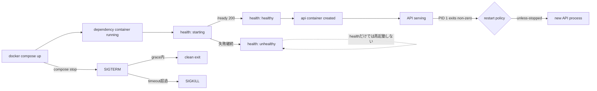

# Weekly Docker Magazine — 「起動した」を「サービス可能」と取り違えない

#docker #containers #weekly #deep-dive

[[Home]]

> [!warning] 安全上の約束
> `docker compose down` はこの演習専用コンテナとネットワークを削除します。`--volumes` は付けません。`docker rm -f`、`docker rmi`、`docker system prune` は他の作業やキャッシュを壊し得るため、本稿では実行しません。必要になっても対象を `docker ps -a` / `docker image ls` で確認してから実行してください。秘密情報をイメージ、Dockerfile、Composeファイル、Gitへ埋め込まないでください。

## 1. Focus・難易度・前提・測定可能なゴール

**Focus:** Docker Compose環境で、プロセス生存・サービス準備完了・依存先準備完了・異常終了を区別し、`healthcheck`、`depends_on.condition`、`restart`、終了シグナルを組み合わせる。

**難易度シグナル: Intermediate** — 参加条件ではなく目安。Composeを一度使ったことがあれば追える。

### 必要知識・ツール・環境

- 既習概念: イメージとコンテナの違い、PID 1、終了コード、Composeのservice/network
- Docker Engine、Docker Compose v2（`docker compose version`）
- Linux/macOS/WSL2、空きポート `18080`、`curl`
- テキストエディタ、約150分
- インターネット接続（初回の `python:3.13-alpine` pull）

### 完了時に測れる成果

1. readinessの遅い依存サービスに対し、APIを**一度も接続失敗させず**起動できる。
2. health statusとrestart countを `docker inspect` で観測できる。
3. unhealthyとexitedを区別し、**unhealthyだけでは再起動されない**ことを実測する。
4. SIGTERM受信から10秒以内に安全終了し、再起動ポリシーの挙動を説明できる。
5.障害注入→仮説→観測→復旧を、ログだけに頼らず再現できる。

## 2. 実アプリケーションの状況と制約

小規模ECの内部APIを想定する。`api` は起動時に `dependency` の `/ready` を確認し、その後 `/` を提供する。依存サービスはウォームアップに15秒必要。

**制約:** 単一ホスト、Compose運用、起動時の502を許容しない、ホスト再起動後は自動復旧、手動停止は尊重、外部オーケストレータなし、イメージ内に秘密なし。目標RTOは60秒以内。healthcheckは1回1秒以内、5秒間隔とする。

## 3. Foundation — コンテナ／ランタイムのメンタルモデル

- **created/running/exited** はPID 1のライフサイクル。`running` は「ポートが応答できる」を意味しない。
- **starting/healthy/unhealthy** はhealthcheckの別軸。失敗回数が閾値に達するとunhealthyになるが、Docker Engineはそれだけではプロセスを停止・再起動しない。
- `depends_on: condition: service_healthy` はComposeによる**初期作成時のゲート**。運用中の依存障害を常時監視してAPIを再起動する仕組みではない。
- `restart: unless-stopped` はコンテナが終了した時に働く。明示的な手動停止を尊重する。
- コンテナのPID 1がSIGTERMを受け、猶予時間内に終了しなければSIGKILLとなる。SIGKILLでは後処理できない。



## 4. 設計代替と明示的トレードオフ

| 選択 | 長所 | 短所 / 採用判断 |
|---|---|---|
| TCP接続healthcheck | 安く汎用的 | アプリの準備完了を保証しない。今回は不採用 |
| HTTP `/ready` | 実際の受付可否を表現 | 実装と依存判定が必要。今回は採用 |
| 深いcheck（全外部依存を照会） | エンドツーエンドに近い | 障害連鎖・負荷・一時障害でunhealthy化。起動ゲートに限定 |
| `restart: always` | 強い自動復帰 | 手動停止後、daemon再起動で復活し得る |
| `restart: unless-stopped` | 手動停止の意思を保持 | 停止状態は自動復帰しない。単一ホスト運用で採用 |
| アプリ内retry | 運用中の依存再接続にも有効 | 実装複雑性。`depends_on` と併用すべき |
| 外部orchestrator | replica、rolling update等 | 学習・運用コスト。今回の範囲外 |

## 5. Practical implementation — 150分ラボ

### タイムボックス

- 0–20分: ファイル作成と設定検証
- 20–55分: baseline起動と観測
- 55–90分: health/restartの実験
- 90–125分: 障害注入と系統的デバッグ
- 125–150分: セキュリティ、サイズ、終了動作、片付け

作業ディレクトリを作る。

```bash
mkdir -p docker-health-lab
cd docker-health-lab
```

### 完全なサンプルファイル

#### `dependency.py`

```python
import http.server, os, time

STARTED = time.monotonic()
WARMUP = int(os.getenv("WARMUP_SECONDS", "15"))

class Handler(http.server.BaseHTTPRequestHandler):
    def do_GET(self):
        age = time.monotonic() - STARTED
        if self.path == "/ready":
            code = 200 if age >= WARMUP else 503
            body = f'{{"ready":{str(code == 200).lower()},"age":{age:.1f}}}\n'
        elif self.path == "/crash":
            self.send_response(202); self.end_headers()
            os._exit(42)
        else:
            code, body = 200, '{"service":"dependency"}\n'
        self.send_response(code)
        self.send_header("Content-Type", "application/json")
        self.end_headers()
        self.wfile.write(body.encode())
    def log_message(self, fmt, *args):
        print(fmt % args, flush=True)

http.server.ThreadingHTTPServer(("0.0.0.0", 8081), Handler).serve_forever()
```

#### `api.py`

```python
import http.server, json, signal, sys, urllib.request

stopping = False
def stop(signum, frame):
    global stopping
    stopping = True
    print(json.dumps({"event":"sigterm","signal":signum}), flush=True)
    sys.exit(0)
signal.signal(signal.SIGTERM, stop)

class Handler(http.server.BaseHTTPRequestHandler):
    def do_GET(self):
        if self.path == "/health":
            code = 503 if stopping else 200
            body = {"healthy": not stopping}
        elif self.path == "/":
            try:
                with urllib.request.urlopen("http://dependency:8081/ready", timeout=1) as r:
                    dep = json.load(r)
                code, body = 200, {"api":"ok", "dependency":dep}
            except Exception as exc:
                code, body = 503, {"api":"degraded", "error":type(exc).__name__}
        else:
            code, body = 404, {"error":"not found"}
        payload = (json.dumps(body) + "\n").encode()
        self.send_response(code)
        self.send_header("Content-Type", "application/json")
        self.end_headers()
        self.wfile.write(payload)
    def log_message(self, fmt, *args):
        print(json.dumps({"event":"http","message":fmt % args}), flush=True)

http.server.ThreadingHTTPServer(("0.0.0.0", 8080), Handler).serve_forever()
```

#### `Dockerfile`

```dockerfile
# syntax=docker/dockerfile:1
FROM python:3.13-alpine
RUN addgroup -S app && adduser -S -G app -u 10001 app
WORKDIR /app
COPY --chown=app:app api.py dependency.py ./
USER 10001:10001
ENTRYPOINT ["python"]
CMD ["api.py"]
```

#### `compose.yaml`

```yaml
name: docker-health-lab
services:
  dependency:
    build: .
    command: ["dependency.py"]
    environment:
      WARMUP_SECONDS: "15"
    healthcheck:
      test: ["CMD", "python", "-c", "import urllib.request; urllib.request.urlopen('http://127.0.0.1:8081/ready', timeout=1)"]
      start_period: 5s
      start_interval: 2s
      interval: 5s
      timeout: 2s
      retries: 3
    restart: unless-stopped
    read_only: true
    tmpfs:
      - /tmp:size=16m,mode=1777
    security_opt:
      - no-new-privileges:true
    cap_drop: [ALL]

  api:
    build: .
    command: ["api.py"]
    depends_on:
      dependency:
        condition: service_healthy
        restart: true
    ports:
      - "127.0.0.1:18080:8080"
    healthcheck:
      test: ["CMD", "python", "-c", "import urllib.request; urllib.request.urlopen('http://127.0.0.1:8080/health', timeout=1)"]
      interval: 5s
      timeout: 2s
      retries: 3
      start_period: 5s
    restart: unless-stopped
    stop_grace_period: 10s
    read_only: true
    tmpfs:
      - /tmp:size=16m,mode=1777
    security_opt:
      - no-new-privileges:true
    cap_drop: [ALL]
```

### 設定を行ごとに読む

- `name`: Compose project名を固定し、他プロジェクトとの衝突を避ける。
- `build: .`: 同じ最小イメージを2サービスで共有する。
- exec形式の`command`: shellを挟まずPythonをPID 1として実行する。
- `WARMUP_SECONDS`: 準備完了の遅延を再現する非秘密の設定。
- `healthcheck.test`: コンテナ**内部**からloopbackを検査。終了0が成功。
- `start_period`: 初期化中の失敗を通常retryとして数えない猶予。
- `start_interval`: start period中だけ短い間隔で検査（Compose 2.20.2+）。
- `interval/timeout/retries`: 定常時5秒ごと、2秒で打切り、連続3回でunhealthy。
- `restart: unless-stopped`: PID 1終了時の復帰と手動停止尊重を両立。
- `depends_on.condition`: dependencyがhealthyになるまでapi作成を待つ。
- 依存項目内の`restart: true`: `docker compose restart dependency` などComposeによる明示操作時、apiも再起動する。Engineのrestart policyとは別物。
- `127.0.0.1:18080:8080`: 外部公開をホストloopbackだけに限定。
- `read_only`、`tmpfs`: root filesystemへの永続書込みを禁止し、一時領域のみ付与。
- `no-new-privileges`、`cap_drop`: 権限昇格と不要capabilityを抑える。
- `stop_grace_period`: SIGTERM後10秒で未終了ならSIGKILL。
- Dockerfileの`USER 10001`: rootを避け、名前解決に依存しない固定UID/GID。
- `ENTRYPOINT` + `CMD`: 実行器と既定スクリプトを分離し、Composeで安全に上書き。

### Checkpoint A — 静的検証とビルド

```bash
docker compose config -q
docker compose build --pull
docker image ls --filter reference='docker-health-lab*'
```

期待: `config -q` は無出力でexit 0。ビルド成功。秘密を渡す`ARG`や`ENV`は存在しない。

### Checkpoint B — readiness gateを観測

```bash
docker compose up -d --wait --wait-timeout 60
docker compose ps
curl -fsS http://127.0.0.1:18080/
```

期待出力例（時刻は変動）:

```text
NAME                           STATUS
docker-health-lab-api-1        Up ... (healthy)
docker-health-lab-dependency-1 Up ... (healthy)
{"api": "ok", "dependency": {"ready": true, "age": 16.2}}
```

`up --wait` はrunning/healthyを待つ。`api` はdependency healthy後に作られるため、`docker compose logs --timestamps` で作成時刻差も確認する。

### Checkpoint C — inspectで事実を見る

```bash
docker inspect docker-health-lab-dependency-1 --format '{{json .State.Health}}'
docker inspect docker-health-lab-api-1 --format 'status={{.State.Status}} health={{.State.Health.Status}} restarts={{.RestartCount}} exit={{.State.ExitCode}}'
docker compose exec api sh -c 'id; grep CapEff /proc/1/status'
```

期待: `health=healthy`、`restarts=0`、`uid=10001`、`CapEff: 0000000000000000`。

## 6. Production concerns — 障害注入と系統的デバッグ

### 演習1: unhealthyはrestartではない

healthcheckだけを故意に壊すoverrideを作る。

#### `compose.fail.yaml`

```yaml
services:
  dependency:
    healthcheck:
      test: ["CMD", "python", "-c", "raise SystemExit(1)"]
      interval: 2s
      timeout: 1s
      retries: 2
      start_period: 0s
```

```bash
docker compose -f compose.yaml -f compose.fail.yaml up -d --no-deps dependency
sleep 6
docker compose ps
docker inspect docker-health-lab-dependency-1 --format 'running={{.State.Running}} health={{.State.Health.Status}} restarts={{.RestartCount}}'
```

期待: `running=true health=unhealthy restarts=0`。healthcheckは診断信号であり、自己修復アクチュエータではない。

### 演習2: PID 1の異常終了はrestartされる

まず通常構成へ戻し、内部ネットワークからcrash endpointを呼ぶ。

```bash
docker compose up -d --wait --wait-timeout 60
docker compose exec api python -c "import urllib.request; urllib.request.urlopen('http://dependency:8081/crash')"
sleep 3
docker inspect docker-health-lab-dependency-1 --format 'running={{.State.Running}} restarts={{.RestartCount}} exit={{.State.ExitCode}}'
docker compose ps
```

期待: `restarts` が1以上。dependencyは再起動後に再ウォームアップし、一時的にstartingになる。**apiはEngineによるdependency自動再起動には追随して再起動されない**ため、アプリ側timeout/retry/circuit breakerが必要。

### デバッグの順序（症状から飛びつかない）

1. **構成を確定:** `docker compose config` でmerge後の実効値を見る。
2. **プロセス状態:** `docker compose ps -a` でrunning/exitedとexit code。
3. **health履歴:** `docker inspect ...State.Health` の各ExitCode/Output。
4. **再起動履歴:** `.RestartCount` と `docker events --since 10m`。
5. **アプリログ:** `docker compose logs --since 10m --timestamps dependency api`。
6. **コンテナ内検査:** 実際のhealthcheckと同じコマンドを`docker compose exec`で実行。
7. **境界を分離:** loopback→service DNS→host公開portの順に確認。

典型的な誤診:

- `curl`がイメージにないのにcurl healthcheckを書く。
- `$VAR`をComposeがホスト側で展開してしまう（コンテナ側なら`$$VAR`）。
- `start_period`を「この間checkを実行しない」と誤解する。
- health endpointがDBの一時障害まで伝播し、全コンテナをunhealthyにする。
- `docker compose restart` でYAML変更が反映されると思う。設定変更は`up -d`で再作成する。

## 7. セキュリティ、サイズ／性能測定、production readiness

### セキュリティレビュー

- 非root UID、全capability drop、no-new-privileges、read-only rootfsを採用。
- health endpointは認証情報を返さず、内部状態の詳細を露出しない。
- 公開portはloopback bind。dependencyはhostへpublishしない。
- この例に秘密は不要。本番の鍵はCompose secretsまたは外部secret managerでruntime注入し、healthcheckの引数・URL・ログへ含めない。
- base imageは本番ではdigest pinning、更新ポリシー、脆弱性スキャンとセットで管理する。

### イメージサイズとhealthcheckコストを測る

```bash
docker image inspect docker-health-lab-dependency --format 'bytes={{.Size}} user={{.Config.User}}'
docker history --no-trunc docker-health-lab-dependency
/usr/bin/time -p sh -c 'for i in 1 2 3 4 5; do curl -fsS http://127.0.0.1:18080/health >/dev/null; done'
docker stats --no-stream docker-health-lab-api-1 docker-health-lab-dependency-1
```

記録する値: image bytes、最大layer、5回checkの実時間、CPU%、memory usage。基準例: healthcheck 1回<1秒、定常CPU<1%、2コンテナ合計メモリ<128MiB。環境差があるので、結果を採用判断の証拠として残す。

### Production-readiness checklist

- [ ] livenessとreadinessの意味を文書化した
- [ ] checkは短時間・副作用なし・秘密非表示
- [ ] timeout < interval、復旧目標からretriesを逆算
- [ ] 遅い正常起動をstart_periodで吸収
- [ ] unhealthy監視と通知先を用意（Docker単体は自動通知しない）
- [ ] アプリ自身に依存先retry/backoff/jitterがある
- [ ] restart stormと依存障害の連鎖を試験した
- [ ] SIGTERM処理と最大終了時間を実測した
- [ ] 非root、最小権限、read-only、公開port最小化
- [ ] ログrotation、resource limit、バックアップを別途設計
- [ ] image digest、SBOM/provenance、脆弱性対応方針がある
- [ ] daemon/host再起動試験とRTO記録がある
- [ ] 手動停止と自動復帰のrunbookがある

## 8. Optional advanced challenge

1. `api.py` に指数backoff（上限5秒、jitter付き）を追加し、dependency再起動中もAPIプロセスを落とさず復旧させる。
2. `/live`（event loop生存）と`/ready`（受付可能）を分離する。
3. `docker events --format '{{json .}}'` を監視する小さなobserverを`profiles: [ops]`で追加し、health_status変化から復旧時間を計測する。
4. `WARMUP_SECONDS=45`、restart 5回連続でもrestart stormが起きないことを証明する。

## 9. 終了動作のテストとcleanup

```bash
docker compose kill -s SIGTERM api
sleep 2
docker compose logs --tail 20 api
docker inspect docker-health-lab-api-1 --format 'restarts={{.RestartCount}} status={{.State.Status}}'
```

ログに `{"event": "sigterm"...}` が現れ、restart policyにより再起動することを確認する。

> [!warning] Cleanup前に確認
> 次の`down`はproject `docker-health-lab` のコンテナとネットワークを削除します。`docker compose ps -a`で対象を確認してください。volumeやimage、他projectは削除しません。`prune`、`rmi`、`rm -f`は実行しません。

```bash
docker compose ps -a
docker compose down --remove-orphans
```

## 10. Concrete deliverables

- [ ] `dependency.py`、`api.py`、`Dockerfile`、`compose.yaml`、`compose.fail.yaml`
- [ ] Checkpoint A–Cの出力ログ
- [ ] unhealthy時とcrash時の`inspect`結果比較
- [ ] image bytes、CPU、memory、healthcheck時間の計測表
- [ ] 自環境向けrestart/readiness設計判断（200–400字）
- [ ] production-readiness checklistの記入済みコピー

## 11. Assessment（5問）

### Q1. runningとhealthyの違いは？
<details><summary>回答</summary>
runningはPID 1が生存している状態。healthyは定義したhealthcheckが成功している状態で、別軸である。
</details>

### Q2. unhealthyになると`restart: unless-stopped`は再起動するか？
<details><summary>回答</summary>
しない。restart policyはコンテナ停止・PID 1終了に反応する。必要なら監視やorchestrator、アプリ設計が別途必要。
</details>

### Q3. `depends_on: condition: service_healthy`が保証する範囲は？
<details><summary>回答</summary>
Composeによる初期作成時、依存サービスがhealthyになるまで依存側の作成を待つ。運用中の継続的な依存健全性やアプリ内retryは保証しない。
</details>

### Q4. `start_period`と`start_interval`の役割は？
<details><summary>回答</summary>
start_periodは初期化猶予で、その期間の失敗を通常の失敗回数に数えない。start_intervalはその期間中の検査間隔。猶予中の成功はhealthへ反映される。
</details>

### Q5. `docker compose restart`でcompose.yaml変更は反映されるか？
<details><summary>回答</summary>
反映されない。restartは既存コンテナを再始動する。設定変更は通常`docker compose up -d`で必要なコンテナを再作成する。
</details>

### Interview / design question

「DBが毎日30秒だけ遅延し、healthcheckが失敗する。APIは処理中リクエストを失ってはいけない」という条件で、liveness/readiness、restart、retry、監視をどう分担するか。失敗閾値とRTOを数値で説明せよ。

### Follow-up challenge

障害注入を10回自動化し、各回について検知時間・復旧時間・API成功率をCSVへ記録する。合格条件（例: P95復旧<30秒、成功率>99%）を先に宣言し、結果からinterval/retries/backoffを調整する。

## 12. 公式リファレンス（2026-10-07確認）

- [Docker Docs: Control startup and shutdown order in Compose](https://docs.docker.com/compose/how-tos/startup-order/)
- [Docker Docs: Compose services — healthcheck / restart / stop_grace_period](https://docs.docker.com/reference/compose-file/services/)
- [Docker Docs: Start containers automatically — restart policies](https://docs.docker.com/engine/containers/start-containers-automatically/)
- [Docker Docs: docker compose up (`--wait`)](https://docs.docker.com/reference/cli/docker/compose/up/)
- [Docker Docs: docker compose restart](https://docs.docker.com/reference/cli/docker/compose/restart/)
- [Docker Docs: Dockerfile reference — HEALTHCHECK](https://docs.docker.com/reference/dockerfile/#healthcheck)
- [Docker Docs: Running containers — healthcheck](https://docs.docker.com/engine/containers/run/#healthcheck)

