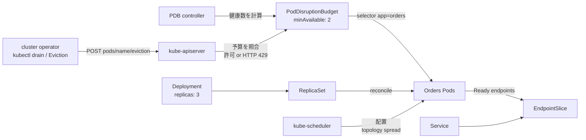

[[Home]]

# Weekly Kubernetes Magazine — PodDisruptionBudgetとEviction API

#kubernetes #k8s #weekly #deep-dive

> [!warning] 実行前の安全確認
> この号には `apply`、Eviction、`delete` が含まれる。共有・本番クラスタでは実行しない。毎回 `kubectl config current-context` と対象Namespaceを確認し、`k8s-pdb-lab` 以外を操作しない。例に実在のSecretはなく、今後もトークンや認証情報を貼り付けないこと。

## 1. Focus・難易度・前提・到達点

**Focus:** PodDisruptionBudget（PDB）と Eviction API を使い、ノード保守などの**自発的な中断**で同時に失ってよいPod数を制御する。

**難易度シグナル:** Intermediate（参加条件ではなく目安）

### 必要な知識・ツール・環境

- 既習概念: Pod / Deployment / ReplicaSet / Service、ラベルセレクター、readinessProbe、宣言的 `apply`
- ツール: `kubectl`、YAMLエディタ、任意で `kind` と Docker
- Kubernetes: v1.21以降（`policy/v1` PDB）。推奨は現在サポート中のリリース
- クラスタ: 最低1ノードでもEviction API演習は可能。ノード保守演習にはworker 3台のkindクラスタを推奨
- 権限: lab NamespaceでDeployment・Service・ConfigMap・PDBを作成でき、Podの `eviction` subresourceを作成できること

### 測定可能な到達点

終了時に次を実証する。

1. `desiredHealthy=2`、`currentHealthy=3`、`disruptionsAllowed=1` を観測する。
2. 1PodをEvictionした直後、次のEvictionがHTTP 429で拒否され得ることを説明する。
3. PDBが防ぐ範囲と、防がない直接削除・Deployment rollout・非自発的障害を区別する。
4. `minAvailable` と `maxUnavailable` のどちらを選ぶか、スケーリングとの関係を含め設計できる。

## 2. Production scenario・SLO・障害仮定

3レプリカの社内注文APIを運用している。クラスタ管理者は毎週ノードを順番にdrainしてOS更新する。アプリ所有者とクラスタ所有者は別チームである。

**仮想SLO**

- 可用性: 月間99.95%
- 保守中もReadyな注文APIを最低2Pod維持
- 計画停止による同時Unavailableは最大1Pod
- p95応答時間は300ms未満（2Pod時にも達成できる容量設計が前提）
- drain 1台は10分以内。超過時は自動継続せず原因を調査

**障害仮定**

- ノード保守・クラスタ縮退はEviction APIを使う。
- Pod起動にはreadiness通過まで約10秒かかる。
- 1ノード故障など非自発的中断は起こり得る。PDBはそれを防がないが、Unavailableとして予算には数える。
- 直接の `kubectl delete pod`、Deployment削除、Deployment自身のrolling updateはPDBでブロックされない。
- 3Podが同一ノードに偏れば、そのノード故障で全停止する。PDB単独は配置を分散しない。

## 3. Control planeとreconciliationのメンタルモデル

PDBは「Podを常に2個動かすコントローラ」ではない。Pod数を戻すのはDeployment / ReplicaSet controllerであり、PDB controllerは選択対象の健康数と期待数から `.status` を計算する。

1. Deploymentの `.spec.replicas: 3` が期待Pod数になる。
2. PDB controllerはownerReferencesをたどって期待数を把握し、PDBのselectorに一致するReady Podを数える。
3. `minAvailable: 2` なら、3健康時の `disruptionsAllowed` は1になる。
4. `kubectl drain` などがPodの `/eviction` subresourceへ要求する。
5. API server側のEviction処理がPDBを評価し、予算内ならPodをgraceful terminationへ、予算外なら `429 Too Many Requests` を返す。
6. ReplicaSet controllerが不足を検知して代替Podを作り、schedulerがNodeへ割り当て、readiness成功後に再び予算が回復する。

重要なのは、PDBが**停止そのものをなくすのではなく、Evictionの速度を調停する契約**だということだ。`.status` は現実よりわずかに遅れる可能性もあるため、コマンドの成否とPod状態の両方を証拠として見る。

## 4. 設計オプションとトレードオフ

### `minAvailable: 2`

- 3レプリカなら最低2Readyを保つ。SLOとの対応が直接的。
- 5レプリカへscaleしても最低2なので、同時に3までEviction可能になる。固定の絶対容量を守る設計に向く。
- HPAで小さくscaleしたとき、要求値がreplicasを超えると保守を止める。

### `maxUnavailable: 1`

- レプリカ数が変化しても「同時に1つまで」という意味を保ちやすい。
- quorum系や、HPAを使うstateless workloadで扱いやすい。
- 1レプリカでは全Evictionを止める。これは高可用性を生むのではなく、保守をブロックするだけ。

### パーセント値

大規模workloadで便利だが丸めに注意する。公式仕様では割合は切り上げられる。例えば7Podの `minAvailable: "50%"` は4、`maxUnavailable` の割合も切り上げのため、表面的な割合より多く中断可能になる場合がある。

### `unhealthyPodEvictionPolicy`

- 既定の `IfHealthyBudget`: RunningだがReadyでないPodも、健康数が予算を満たさない場合はEvictionを阻止し得る。
- `AlwaysAllow`: 不健康なRunning PodのEvictionを許し、壊れたPodがdrainを永久に止めるリスクを減らす。公式文書でも推奨されるが、代替Podも不健康になる根本障害は別途直す必要がある。

このlabは `AlwaysAllow` を選ぶ。健康なPodはPDBで守られ、不健康Podは退避可能という運用判断である。

## 5. オブジェクト関係図



## 6. Guided lab（約150分）

### 時間配分

- Foundation 25分: 文脈確認、マニフェスト読解、dry-run
- Practical implementation 55分: 配置、PDB status、Eviction
- Production concerns 45分: 障害注入、証拠収集、rollback
- Optional advanced challenge 25分: multi-node drainとポリシー比較

### 6.1 Foundation — クラスタと文脈確認

```bash
kubectl version
kubectl config current-context
kubectl config get-contexts
kubectl auth can-i create deployments.apps --namespace k8s-pdb-lab
kubectl auth can-i create poddisruptionbudgets.policy --namespace k8s-pdb-lab
kubectl get nodes -o wide
```

まだNamespaceがないので、`auth can-i` はクラスタ設定により `no` でもよい。権限がなければ管理者へlab用権限を依頼し、本番権限を広げない。

#### 完全なlabマニフェスト

以下を `pdb-lab.yaml` として保存する。サンプルのnginxコンテンツだけで、Secretは含まない。

```yaml
apiVersion: v1
kind: Namespace
metadata:
  name: k8s-pdb-lab
  labels:
    purpose: learning
---
apiVersion: v1
kind: ConfigMap
metadata:
  name: orders-content
  namespace: k8s-pdb-lab
data:
  index.html: |
    {"service":"orders","status":"ok"}
---
apiVersion: apps/v1
kind: Deployment
metadata:
  name: orders
  namespace: k8s-pdb-lab
  labels:
    app: orders
spec:
  replicas: 3
  strategy:
    type: RollingUpdate
    rollingUpdate:
      maxUnavailable: 0
      maxSurge: 1
  selector:
    matchLabels:
      app: orders
  template:
    metadata:
      labels:
        app: orders
    spec:
      terminationGracePeriodSeconds: 20
      topologySpreadConstraints:
        - maxSkew: 1
          topologyKey: kubernetes.io/hostname
          whenUnsatisfiable: ScheduleAnyway
          labelSelector:
            matchLabels:
              app: orders
      containers:
        - name: web
          image: nginx:1.27-alpine
          ports:
            - name: http
              containerPort: 80
          resources:
            requests:
              cpu: 20m
              memory: 32Mi
            limits:
              cpu: 200m
              memory: 128Mi
          readinessProbe:
            httpGet:
              path: /
              port: http
            initialDelaySeconds: 3
            periodSeconds: 2
            failureThreshold: 2
          volumeMounts:
            - name: content
              mountPath: /usr/share/nginx/html/index.html
              subPath: index.html
              readOnly: true
      volumes:
        - name: content
          configMap:
            name: orders-content
---
apiVersion: v1
kind: Service
metadata:
  name: orders
  namespace: k8s-pdb-lab
spec:
  selector:
    app: orders
  ports:
    - name: http
      port: 80
      targetPort: http
---
apiVersion: policy/v1
kind: PodDisruptionBudget
metadata:
  name: orders
  namespace: k8s-pdb-lab
spec:
  minAvailable: 2
  unhealthyPodEvictionPolicy: AlwaysAllow
  selector:
    matchLabels:
      app: orders
---
apiVersion: v1
kind: ServiceAccount
metadata:
  name: incident-observer
  namespace: k8s-pdb-lab
---
apiVersion: rbac.authorization.k8s.io/v1
kind: Role
metadata:
  name: incident-observer
  namespace: k8s-pdb-lab
rules:
  - apiGroups: [""]
    resources: ["pods", "pods/log", "events", "services"]
    verbs: ["get", "list", "watch"]
  - apiGroups: ["discovery.k8s.io"]
    resources: ["endpointslices"]
    verbs: ["get", "list", "watch"]
  - apiGroups: ["apps"]
    resources: ["deployments", "replicasets"]
    verbs: ["get", "list", "watch"]
  - apiGroups: ["policy"]
    resources: ["poddisruptionbudgets"]
    verbs: ["get", "list", "watch"]
---
apiVersion: rbac.authorization.k8s.io/v1
kind: RoleBinding
metadata:
  name: incident-observer
  namespace: k8s-pdb-lab
subjects:
  - kind: ServiceAccount
    name: incident-observer
    namespace: k8s-pdb-lab
roleRef:
  apiGroup: rbac.authorization.k8s.io
  kind: Role
  name: incident-observer
```

YAMLの要点:

- DeploymentとPDBの `matchLabels` は完全に対応させる。ずれるとPDBはPodを守らない。
- readinessが `currentHealthy` 判定に効く。Runningだけではavailableとは限らない。
- Deploymentの `maxUnavailable: 0` はrollout用、PDBはEviction用。似ているが適用経路が違う。
- `ScheduleAnyway` は単一ノードlabでもPendingにしないソフト制約。productionで障害ドメイン分散を必須にするなら容量を確保したうえで `DoNotSchedule` を検討する。
- Roleは観測専用。Evictionや更新権限を与えておらず、職務分離を保つ。

### 6.2 Practical implementation — dry-run、適用、検証

> [!warning] APPLY前に停止して確認
> 下のcontext名が検証用であること、対象が `k8s-pdb-lab` だけであることを声に出して確認する。違えば実行しない。

```bash
kubectl config current-context
kubectl apply --dry-run=server -f pdb-lab.yaml
kubectl diff -f pdb-lab.yaml
kubectl apply -f pdb-lab.yaml
kubectl -n k8s-pdb-lab rollout status deployment/orders --timeout=120s
kubectl -n k8s-pdb-lab get pods -l app=orders -o wide
kubectl -n k8s-pdb-lab get pdb orders
kubectl -n k8s-pdb-lab get pdb orders \
  -o custom-columns=NAME:.metadata.name,DESIRED:.status.desiredHealthy,CURRENT:.status.currentHealthy,ALLOWED:.status.disruptionsAllowed
kubectl -n k8s-pdb-lab get endpointslice -l kubernetes.io/service-name=orders
```

期待出力の核心（Pod名や時刻は異なる）:

```text
NAME     MIN AVAILABLE   MAX UNAVAILABLE   ALLOWED DISRUPTIONS   AGE
orders   2               N/A               1                     ...

NAME     DESIRED   CURRENT   ALLOWED
orders   2         3         1
```

**Checkpoint A:** Podが3/3 Ready、EndpointSliceに3 endpoint、PDBのALLOWEDが1である。そうでなければEvictionへ進まない。

Serviceの簡易検証:

```bash
kubectl -n k8s-pdb-lab run curl-once --rm -i --restart=Never \
  --image=curlimages/curl:8.10.1 -- curl -fsS http://orders
```

期待値:

```json
{"service":"orders","status":"ok"}
```

### 6.3 Eviction APIを明示的に呼ぶ

次のスクリプトはPod名を取得し、`policy/v1 Eviction` をAPI serverへ送る。`kubectl delete pod` ではPDB試験にならない。

```bash
POD_1=$(kubectl -n k8s-pdb-lab get pod -l app=orders \
  -o jsonpath='{.items[0].metadata.name}')
printf '%s\n' "$POD_1"

kubectl create --raw \
  "/api/v1/namespaces/k8s-pdb-lab/pods/${POD_1}/eviction" \
  -f - <<EOF
{
  "apiVersion": "policy/v1",
  "kind": "Eviction",
  "metadata": {
    "name": "${POD_1}",
    "namespace": "k8s-pdb-lab"
  }
}
EOF
```

期待出力:

```text
{..."status":"Success"...}
```

直後に証拠を取得する。

```bash
kubectl -n k8s-pdb-lab get pods -l app=orders -w
kubectl -n k8s-pdb-lab get pdb orders -w
```

一時的に `ALLOWED DISRUPTIONS` が0となり、代替PodがReadyになると1へ戻る。高速なローカル環境では変化を見逃すことがあるため、次の障害注入で観測窓を作る。

## 7. kubectlとYAMLをどう読むか

- `kubectl apply --dry-run=server`: API serverのschema、admission、既定値処理まで通すが永続化しない。
- `kubectl diff`: live objectと意図するmanifestの差を見る。終了コード1は差分ありを示すことがあり、必ずしも障害ではない。
- `kubectl rollout status`: Deployment controllerの収束を待つ。PDBの成立確認ではない。
- `kubectl get pdb`: `DESIRED HEALTHY`、`CURRENT HEALTHY`、`ALLOWED DISRUPTIONS` を読む。
- `kubectl create --raw .../eviction`: 通常のDELETEではなくEviction subresourceを呼び、PDB評価経路を通す。
- `spec.selector`: PDBが数えるPod集合。`policy/v1` ではnull selectorは0件、空の `{}` はNamespace内の全Podに一致するため、空selectorを安易に使わない。
- `terminationGracePeriodSeconds`: Eviction成功後もgraceful terminationを許す時間。PDBはアプリのshutdown処理を代替しない。

## 8. 障害注入・証拠駆動のincident/rollback演習

### Incident: 代替PodがReadyにならない

目的は「PDBが保守を止めた」ことを障害と決めつけず、Ready capacity不足を証拠で切り分けること。

まず誤ったreadiness pathを導入する。この更新はDeployment rolloutであり、**PDBはrolloutを止めない**。`maxUnavailable: 0` と `maxSurge: 1` が可用性側の主な防御になる。

> [!warning] 変更前確認
> contextとNamespaceを再確認し、現在のReplicaSet revisionを記録する。

```bash
kubectl config current-context
kubectl -n k8s-pdb-lab rollout history deployment/orders
kubectl -n k8s-pdb-lab patch deployment orders --type=json -p='[
  {"op":"replace","path":"/spec/template/spec/containers/0/readinessProbe/httpGet/path","value":"/not-found"}
]'
kubectl -n k8s-pdb-lab rollout status deployment/orders --timeout=45s
```

期待: rolloutはtimeoutする。既存3Podは残り、新ReplicaSetのsurge Podが `0/1 Running` になる可能性が高い。

#### 証拠収集

```bash
kubectl -n k8s-pdb-lab get deployment,rs,pod,pdb -o wide
kubectl -n k8s-pdb-lab describe deployment orders
kubectl -n k8s-pdb-lab get events --sort-by=.metadata.creationTimestamp | tail -30
kubectl -n k8s-pdb-lab describe pod -l app=orders
kubectl -n k8s-pdb-lab get pdb orders -o yaml
```

確認する証拠:

- readiness probeがHTTP 404で失敗している。
- Deploymentは新ReplicaSetのavailable replicaを増やせない。
- 旧Podが3ReadyならPDBはなお `disruptionsAllowed: 1` の場合がある。
- 問題の主因はPDBではなく、誤ったPod templateとreadinessである。

次に健康な旧Podを1つEvictionし、直後にもう1つをEvictionして拒否を狙う。環境が高速なら最初の代替がReadyになる前に実行する。

```bash
mapfile -t READY_PODS < <(kubectl -n k8s-pdb-lab get pods -l app=orders \
  --field-selector=status.phase=Running \
  -o jsonpath='{range .items[?(@.status.containerStatuses[0].ready==true)]}{.metadata.name}{"\n"}{end}')
printf '%s\n' "${READY_PODS[@]}"

for POD in "${READY_PODS[0]}" "${READY_PODS[1]}"; do
  kubectl create --raw "/api/v1/namespaces/k8s-pdb-lab/pods/${POD}/eviction" -f - <<EOF
{"apiVersion":"policy/v1","kind":"Eviction","metadata":{"name":"${POD}","namespace":"k8s-pdb-lab"}}
EOF
done
```

期待: 最初は成功、2回目は次のような429系メッセージになる。

```text
Error from server (TooManyRequests): Cannot evict pod as it would violate the pod's disruption budget.
```

**Checkpoint B:** `kubectl get pdb` の健康数・許可数、Pod readiness失敗、EvictionのHTTP結果をincident evidenceとして保存する。429だけを見て「Kubernetesが壊れた」と判断しない。

### Rollback

```bash
kubectl -n k8s-pdb-lab rollout undo deployment/orders
kubectl -n k8s-pdb-lab rollout status deployment/orders --timeout=120s
kubectl -n k8s-pdb-lab get pods -l app=orders
kubectl -n k8s-pdb-lab get pdb orders
kubectl -n k8s-pdb-lab get endpointslice -l kubernetes.io/service-name=orders
```

成功条件は3Pod Ready、PDB `CURRENT=3` / `ALLOWED=1`、EndpointSliceのready endpointが3。revision履歴とEventsも残して、rollbackが何を変えたか説明する。

## 9. Production concerns

### Security / RBAC

- PDBの作成権限とPod Eviction権限は分ける。Evictionは `pods/eviction` の `create` として認可される。
- 観測担当には例のRoleのようにget/list/watchだけを付け、patch/delete/evictを付けない。
- `kubectl auth can-i create pods/eviction -n k8s-pdb-lab` で実効権限を検証する。
- 広いcluster-adminをlabの便宜だけで配布しない。監査ログがある環境ではEviction主体と時刻を追えるようにする。
- Secretを診断出力やノートへ貼らない。`kubectl get secret -o yaml` は本演習に不要。

### Namespace / context

- すべてを専用Namespaceへ閉じ込め、コマンドに常に `-n k8s-pdb-lab` を書く。
- context名だけでなくcluster endpointも `kubectl config view --minify` で確認できる。
- productionでは変更チケット、保守窓、承認、観測担当、abort条件を先に定義する。

### Resource / capacity / cost

- PDBが1 disruptionだけを許しても、残り2Podがピークトラフィックを処理できなければSLOは守れない。requestsと実測負荷試験が必要。
- 代替Podを置く空きNode容量がなければdrainは停止する。Cluster Autoscalerの立上り時間も保守時間へ算入する。
- `maxSurge: 1` は安全性と引き換えに一時的CPU/メモリを追加消費する。
- topology spreadは障害ドメイン耐性を上げるが、厳格な `DoNotSchedule` は不足容量時にPendingを生む。
- 3レプリカは1レプリカより費用が高い。SLO、障害ドメイン、保守頻度から必要冗長度を決める。

### PDBの限界

- 直接Pod削除、Deployment削除、Deployment rolloutはPDBを迂回・対象外とする。
- ノード電源断、kernel panic、resource pressureなど非自発的中断を防げない。
- NetworkPolicy、zone分散、backup、graceful shutdown、アプリの複製整合性を代替しない。
- 複数PDBが同一Podに重なると、Evictionは該当する全PDBを満たす必要があり、運用が詰まりやすい。

## 10. Optional advanced challenge（multi-nodeのみ）

1. `kubectl get pods -o wide` でorders Podが載るNodeを選ぶ。
2. そのNodeにシステムPodや別workloadがあることを確認する。
3. 検証専用クラスタでのみ、timeout付きdrainを実行する。

```bash
NODE=<検証用worker-node名>
kubectl config current-context
kubectl get node "$NODE"
kubectl drain "$NODE" --ignore-daemonsets --delete-emptydir-data --timeout=5m
kubectl -n k8s-pdb-lab get pods -w
kubectl -n k8s-pdb-lab get pdb orders -w
kubectl uncordon "$NODE"
```

> `--delete-emptydir-data` はNode上PodのemptyDirデータを失わせる。検証専用Node以外では使わない。`--force` やPDB無視のオプションを安易に加えない。drainが止まったら、PDB、Pending Pod、requests、taint、topology制約を証拠から調べる。

追加比較:

- `minAvailable: 2` を `maxUnavailable: 1` に変え、replicasを3→5→2と変えたときの `desiredHealthy` / `disruptionsAllowed` を表にする。
- `unhealthyPodEvictionPolicy` を省略した既定動作と `AlwaysAllow` を、ReadyでないPodがある状態で比較する。

## 11. Cleanup

> [!danger] DELETE前の最終確認
> 削除対象はNamespace `k8s-pdb-lab` 全体。別Namespaceや現在のproduction contextでは絶対に実行しない。必要なincident evidenceを保存してから行う。

```bash
kubectl config current-context
kubectl get namespace k8s-pdb-lab
kubectl get all,pdb,role,rolebinding,serviceaccount,configmap -n k8s-pdb-lab
kubectl delete namespace k8s-pdb-lab
kubectl get namespace k8s-pdb-lab
```

期待: 最後は `NotFound`。kindクラスタをこの演習専用に作った場合だけ、別途そのクラスタを削除する。

## 12. Verification checklistと成果物

### Checklist

- [ ] contextとNamespaceを各変更前に検証した
- [ ] server-side dry-runとdiffを確認した
- [ ] 3Pod Ready、3 endpointを確認した
- [ ] PDB statusのdesired/current/allowedを説明できる
- [ ] Eviction成功と429拒否の両方を証拠として取得した
- [ ] PDBが直接delete・rollout・非自発的障害を防がないと説明できる
- [ ] readiness障害をEvents / describe / statusから特定した
- [ ] rollout undo後にPod・PDB・EndpointSliceを再検証した
- [ ] RBACでobserverとoperatorの権限を分離した
- [ ] lab Namespaceだけをcleanupした

### Concrete deliverables

1. `pdb-lab.yaml`
2. apply前のcontext/namespace確認ログ
3. 正常時と障害時の `kubectl get pdb orders -o yaml`
4. Eviction成功と429の出力
5. incident timeline（変更、症状、証拠、仮説、rollback、回復時刻）
6. 自分のサービス向けPDB設計判断を200〜400字で記述

## 13. Assessment

### Q1. PDBがあるのに `kubectl delete pod` でPodを消せた。故障か？

<details><summary>解答</summary>

故障ではない。PDBはPDBを尊重するEviction API経由の自発的中断を制御する。直接削除は迂回できるため、運用手順とRBACで直接deleteを制限する。

</details>

### Q2. replicas=3、`minAvailable: 2`、3PodすべてReadyなら許容Eviction数はいくつか？

<details><summary>解答</summary>

1。1つをEvictionするとReadyが2になるため、代替がReadyになるまで追加Evictionは拒否される。

</details>

### Q3. PDBとDeploymentの `maxUnavailable` は何が違うか？

<details><summary>解答</summary>

PDBは主にEviction APIを使う計画中断の速度を制御する。Deploymentの値はそのDeploymentによるrolling updateで旧新Podを入れ替える際の可用性を制御する。PDBはDeployment rollout自体を制限しない。

</details>

### Q4. 1レプリカに `maxUnavailable: 0` のPDBを付ければ高可用になるか？

<details><summary>解答</summary>

ならない。Evictionを止めるだけで、Node故障や直接削除時の代替同時稼働はない。高可用性には複製、障害ドメイン分散、容量、アプリ設計が必要。

</details>

### Q5. `AlwaysAllow` を使う理由とリスクは？

<details><summary>解答</summary>

ReadyでないRunning Podがdrainを塞ぎ続けるのを避けられる。一方、代替も不健康になる根本原因があると健康数は回復しない。健康なPodへのPDB保護、監視、abort条件、原因修正を併用する。

</details>

### Interview / design question

HPAで3〜30レプリカに変動する決済API、3ゾーン、各Podの起動90秒という条件で、PDB、topology spread、Deployment strategy、容量余裕、drain timeoutをどう設計するか。SLOから許容同時停止数を導き、パーセント丸め、zone障害、autoscaler遅延、RBACまで説明せよ。

### Follow-up challenge

検証クラスタで `minAvailable: "67%"` と `maxUnavailable: "33%"` をreplicas 3・4・7で比較する。各ケースの丸め後の `desiredHealthy` と `disruptionsAllowed` を実測し、どちらが意図したSLOを表現するかを短いADRにまとめる。

## 14. 現行公式リファレンス

- [Disruptions](https://kubernetes.io/docs/concepts/workloads/pods/disruptions/) — 自発的/非自発的中断、PDBの適用範囲、Evictionとdrain
- [Specifying a Disruption Budget for your Application](https://kubernetes.io/docs/tasks/run-application/configure-pdb/) — PDB設計手順、割合の丸め、workload別の考え方
- [PodDisruptionBudget API reference (policy/v1)](https://kubernetes.io/docs/reference/kubernetes-api/policy-resources/pod-disruption-budget-v1/) — spec/status、selector、`unhealthyPodEvictionPolicy`
- [API-initiated Eviction](https://kubernetes.io/docs/concepts/scheduling-eviction/api-eviction/) — Eviction subresourceとHTTP 429
- [Safely Drain a Node](https://kubernetes.io/docs/tasks/administer-cluster/safely-drain-node/) — cordon/drain/uncordon
- [Pod Topology Spread Constraints](https://kubernetes.io/docs/concepts/scheduling-eviction/topology-spread-constraints/) — Node/zone障害ドメインへの分散
- [Updating a Deployment](https://kubernetes.io/docs/concepts/workloads/controllers/deployment/#updating-a-deployment) — rolling updateとrollback
- [Using RBAC Authorization](https://kubernetes.io/docs/reference/access-authn-authz/rbac/) — Role / RoleBindingと最小権限

---

**今号の一文:** PDBは可用性を自動生成する盾ではなく、アプリ所有者の停止許容度をEviction実行者へ伝える制御面上の契約である。
