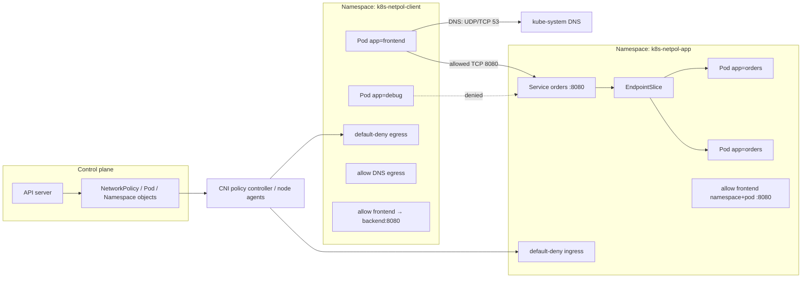

[[Home]]

# Weekly Kubernetes Magazine — NetworkPolicyでNamespace間通信をdefault-denyから設計する

#kubernetes #k8s #weekly #deep-dive

> [!warning] 実行前の安全確認
> このラボにはNamespace、Deployment、Service、NetworkPolicy、Role/RoleBindingの`apply`とNamespaceの`delete`が含まれる。共有・本番クラスタでは実行しない。各変更前に `kubectl config current-context` と対象Namespaceを確認し、`k8s-netpol-client` / `k8s-netpol-app` 以外を操作しない。NetworkPolicy対応CNIが必要で、非対応CNIではAPIへの登録だけ成功して通信は遮断されない。例に実在のSecretは含めない。トークン、パスワード、証明書、クラウド認証情報をYAMLやコマンド履歴へ貼らない。

## 1. Focus・難易度・前提・環境・到達点

**Focus:** `NetworkPolicy` を用い、Namespace内外の通信を「暗黙の全許可」から「default-deny + 必要なDNS・HTTPだけ許可」へ変える。APIオブジェクトが存在することと、CNI dataplaneが実際に遮断することを区別し、通信テストを証拠にする。

**難易度シグナル:** Intermediate（学習順序を制限するゲートではなく目安）

### 必要な知識・ツール・環境

- 既習概念: Pod / Deployment / Service / EndpointSlice、ラベルとselector、Namespace、Service DNS、ingressとegress
- 必須ツール: `kubectl`、YAMLエディタ、`curl` を含むテスト用コンテナイメージを取得できる環境
- クラスタ: 現在サポート中のKubernetesリリースを推奨。NetworkPolicyを実装するCNI（Calico、Cilium等）が必要
- ローカル例: minikubeなら `minikube start --cni=calico`。既存クラスタでは管理者のCNI資料で対応を確認する
- 権限: 2つのラボNamespace、namespacedなDeployment / Service / NetworkPolicy / Role / RoleBindingを作成できること
- earlier concepts: Namespaceには自動で不変ラベル `kubernetes.io/metadata.name` が付くこと、ServiceはPodをラベルで選び、DNS名は通常 `<service>.<namespace>.svc.cluster.local` になること
- 所要時間: Foundation 30分 → 実装75分 → production考察35分 → optional challenge 25分、合計約165分

### 測定可能な到達点

1. baselineで許可される3経路と、default-deny後に拒否される経路をコマンド出力で示せる。
2. frontendからbackendのTCP/8080のみを許可し、同じclient Namespaceのdebug Podは拒否されることを実証できる。
3. DNS egressを明示し、名前解決失敗とL3/L4遮断を別々に切り分けられる。
4. `podSelector`、`namespaceSelector`、portsのAND/OR関係と、複数NetworkPolicyが加算的であることを説明できる。
5. allow policyの誤削除を注入し、観測証拠から原因を特定して宣言的にrollbackできる。

---

## 2. Production scenario・SLO・障害仮定

マルチテナントの社内クラスタで、`checkout` frontendが`orders` APIを呼ぶ。別チームのdebug Pod、侵害されたPod、誤設定されたバッチからorders APIへ横移動されないことが要件である。

### 仮想SLO / SLI

- checkout → orders成功率: 99.95%以上（5分窓）
- クラスタ内で意図しないNamespace / workloadからorders: TCP接続成功0件
- DNS成功率: 99.99%以上、p95 50ms未満
- policy変更後の検証: 10分以内にpositive testとnegative testを完了
- 変更失敗時のMTTR: 15分以内。Git上の直前manifestを再適用して復旧

### 障害・脅威の仮定

- クラスタ内Pod間通信は、policyで隔離される前は通常許可される。
- NamespaceラベルやPodラベルが誤って変更される、allow policyが削除される、DNS egress許可を忘れる。
- CNIがNetworkPolicyを実装していない、または実装差がある可能性を持つ。
- NetworkPolicyはL3/L4のPod通信制御であり、HTTP path、JWT、ユーザー認可、TLS identityを理解しない。
- NodeからPodへの通信、`hostNetwork` Pod、DNAT前後の`ipBlock`解釈などは実装差や特例がある。
- 既存TCP接続がpolicy変更直後に切れるかは実装に依存し得る。新規接続で検証する。
- policyは侵害を完全には防がない。アプリ認証、mTLS、RBAC、イメージ署名、Runtime Securityと組み合わせる。

---

## 3. Control planeとreconciliationのメンタルモデル

NetworkPolicy自身は通信パケットを処理しない。

1. 利用者が`networking.k8s.io/v1`のNetworkPolicyをAPI serverへ送る。
2. API serverは認証・認可・admission・schema validation後、オブジェクトを保存する。
3. CNIのpolicy controller / agentがNetworkPolicy、Namespace、Pod、IP変化をwatchする。
4. controllerはselectorを実Pod集合へ解決し、各Nodeのagentがiptables、eBPF等のdataplaneへ反映する。
5. Podが選択された方向はisolatedになる。許可は、そのPodを選ぶ全policyのルールの**和集合**で決まる。
6. ある通信が成立するには、送信Pod側egressで許可され、かつ受信Pod側ingressでも許可される必要がある。片側だけでは足りない。
7. Deployment controllerやService / EndpointSlice controllerは別のreconciliation loopである。ServiceがReady endpointを持っていても、NetworkPolicyが通信を拒否できる。

```text
client packet
  ├─ client Podがegress-isolatedでない → 送信可
  └─ isolated → いずれかのegress ruleに一致が必要
          AND
  ├─ server Podがingress-isolatedでない → 受信可
  └─ isolated → いずれかのingress ruleに一致が必要
```

NetworkPolicyには一般的な「deny rule」はない。空の許可集合でdefault-denyを作り、必要なallowを加算する。後から広いallow policyを追加すると、狭いpolicyを上書きするのではなく許可範囲が広がる。

---

## 4. 設計オプションとトレードオフ

### A. allow-listを先に作り、その後default-deny

- 移行時の停止リスクを抑えやすい。
- ただし未選択Podは移行中も全許可。完了条件と期限が必要。

### B. default-denyを先に作る

- 新規Podも即座に隔離され、fail-closed。
- DNS、監視、service mesh、admission webhook等の依存通信を洗い出していないと一斉障害になる。ラボや新規Namespace向け。

### C. `namespaceSelector`だけ

- チームや環境単位で読みやすい。
- そのNamespace内の全Podを信頼する。侵害時のblast radiusが大きい。

### D. `namespaceSelector` AND `podSelector`

- 特定Namespace内の特定workloadだけを許可できる。
- ラベルガバナンスが必要。1つのpeer要素に両selectorを書くとAND、別々のリスト要素に書くとORになる。

### E. `ipBlock`

- 固定CIDRの外部サービス許可に使える。
- ServiceのDNAT順序、クラウドNAT、Pod CIDRとNode IP、頻繁に変わるSaaS IPとの相性が悪い。Service名やFQDNを直接指定する標準NetworkPolicy機能ではない。

### F. Namespace単位とクラスタ共通policy

- 標準NetworkPolicyはnamespaced。所有権が明確でportable。
- 組織全体の強制deny、FQDN、L7制御、監査にはCNI固有policyや別のpolicy engineが必要な場合がある。portableな標準層と拡張層を分ける。

---

## 5. Architecture / object relationship



---

## 6. Guided lab（90–180分）

### 6.1 Preflight（10分）

> [!warning] まだapplyしない
> 出力が個人用検証クラスタを示すことを確認する。`prod`、共有クラスタ、用途不明のcontextなら中止する。

```bash
kubectl config current-context
kubectl config view --minify -o jsonpath='{..namespace}{"\n"}'
kubectl version
kubectl api-resources | grep -i networkpol
kubectl auth can-i create namespaces
kubectl auth can-i create networkpolicies.networking.k8s.io --namespace=k8s-netpol-app
```

期待:

```text
networkpolicies   netpol   networking.k8s.io/v1   true   NetworkPolicy
yes
yes
```

APIが見えるだけではenforcementの証明にならない。CNI名も確認する。

```bash
kubectl -n kube-system get pods -o wide
```

Calico / Cilium等のagent Podを確認する。環境によって名前は異なる。対応が不明なら管理者資料を確認し、このラボを進めない。

### 6.2 完全manifestを保存する（15分）

以下を`netpol-lab.yaml`として保存する。実在のSecretは一切追加しない。

```yaml
apiVersion: v1
kind: Namespace
metadata:
  name: k8s-netpol-client
  labels:
    lab: k8s-netpol
---
apiVersion: v1
kind: Namespace
metadata:
  name: k8s-netpol-app
  labels:
    lab: k8s-netpol
---
apiVersion: apps/v1
kind: Deployment
metadata:
  name: orders
  namespace: k8s-netpol-app
spec:
  replicas: 2
  selector:
    matchLabels:
      app: orders
  template:
    metadata:
      labels:
        app: orders
    spec:
      automountServiceAccountToken: false
      containers:
        - name: web
          image: registry.k8s.io/e2e-test-images/agnhost:2.53
          args: ["netexec", "--http-port=8080"]
          ports:
            - name: http
              containerPort: 8080
          readinessProbe:
            httpGet:
              path: /healthz
              port: http
            initialDelaySeconds: 2
            periodSeconds: 3
          resources:
            requests:
              cpu: 10m
              memory: 16Mi
            limits:
              cpu: 100m
              memory: 64Mi
          securityContext:
            allowPrivilegeEscalation: false
            capabilities:
              drop: ["ALL"]
            runAsNonRoot: true
            seccompProfile:
              type: RuntimeDefault
---
apiVersion: v1
kind: Service
metadata:
  name: orders
  namespace: k8s-netpol-app
spec:
  selector:
    app: orders
  ports:
    - name: http
      port: 8080
      targetPort: http
---
apiVersion: apps/v1
kind: Deployment
metadata:
  name: frontend
  namespace: k8s-netpol-client
spec:
  replicas: 1
  selector:
    matchLabels:
      app: frontend
  template:
    metadata:
      labels:
        app: frontend
    spec:
      automountServiceAccountToken: false
      containers:
        - name: curl
          image: curlimages/curl:8.12.1
          command: ["sh", "-c", "sleep infinity"]
          resources:
            requests:
              cpu: 5m
              memory: 8Mi
            limits:
              cpu: 50m
              memory: 32Mi
          securityContext:
            allowPrivilegeEscalation: false
            capabilities:
              drop: ["ALL"]
            runAsNonRoot: true
            seccompProfile:
              type: RuntimeDefault
---
apiVersion: apps/v1
kind: Deployment
metadata:
  name: debug
  namespace: k8s-netpol-client
spec:
  replicas: 1
  selector:
    matchLabels:
      app: debug
  template:
    metadata:
      labels:
        app: debug
    spec:
      automountServiceAccountToken: false
      containers:
        - name: curl
          image: curlimages/curl:8.12.1
          command: ["sh", "-c", "sleep infinity"]
          resources:
            requests:
              cpu: 5m
              memory: 8Mi
            limits:
              cpu: 50m
              memory: 32Mi
          securityContext:
            allowPrivilegeEscalation: false
            capabilities:
              drop: ["ALL"]
            runAsNonRoot: true
            seccompProfile:
              type: RuntimeDefault
---
apiVersion: networking.k8s.io/v1
kind: NetworkPolicy
metadata:
  name: default-deny-ingress
  namespace: k8s-netpol-app
spec:
  podSelector: {}
  policyTypes: ["Ingress"]
---
apiVersion: networking.k8s.io/v1
kind: NetworkPolicy
metadata:
  name: default-deny-egress
  namespace: k8s-netpol-client
spec:
  podSelector: {}
  policyTypes: ["Egress"]
---
apiVersion: networking.k8s.io/v1
kind: NetworkPolicy
metadata:
  name: allow-dns-egress
  namespace: k8s-netpol-client
spec:
  podSelector: {}
  policyTypes: ["Egress"]
  egress:
    - to:
        - namespaceSelector:
            matchLabels:
              kubernetes.io/metadata.name: kube-system
          podSelector:
            matchLabels:
              k8s-app: kube-dns
      ports:
        - protocol: UDP
          port: 53
        - protocol: TCP
          port: 53
---
apiVersion: networking.k8s.io/v1
kind: NetworkPolicy
metadata:
  name: allow-frontend-to-orders
  namespace: k8s-netpol-client
spec:
  podSelector:
    matchLabels:
      app: frontend
  policyTypes: ["Egress"]
  egress:
    - to:
        - namespaceSelector:
            matchLabels:
              kubernetes.io/metadata.name: k8s-netpol-app
          podSelector:
            matchLabels:
              app: orders
      ports:
        - protocol: TCP
          port: 8080
---
apiVersion: networking.k8s.io/v1
kind: NetworkPolicy
metadata:
  name: allow-frontend-ingress
  namespace: k8s-netpol-app
spec:
  podSelector:
    matchLabels:
      app: orders
  policyTypes: ["Ingress"]
  ingress:
    - from:
        - namespaceSelector:
            matchLabels:
              kubernetes.io/metadata.name: k8s-netpol-client
          podSelector:
            matchLabels:
              app: frontend
      ports:
        - protocol: TCP
          port: 8080
```

DNS Podのラベルは環境依存である。適用前に確認する。

```bash
kubectl -n kube-system get pods --show-labels | grep -E 'coredns|kube-dns'
```

期待するラベルが`k8s-app=kube-dns`でなければ、`allow-dns-egress`の`podSelector`を実環境に合わせる。Namespace selectorとPod selectorを同じ`to`要素に置いたため、これは**kube-system AND DNS Pod**である。

### 6.3 server-side dry-run、diff、apply（10分）

> [!warning] apply直前確認
> 次のcontextと対象Namespace名を声に出して確認し、問題がなければ進む。

```bash
kubectl config current-context
kubectl apply --server-side --dry-run=server -f netpol-lab.yaml
kubectl diff -f netpol-lab.yaml
kubectl apply -f netpol-lab.yaml
```

`dry-run=server`はAPI schemaとadmissionを通すが、CNI enforcementは試さない。`diff`の終了コード1は差分ありを意味し得る。

### 6.4 Checkpoint 1: objectとbaseline構成（10分）

```bash
kubectl -n k8s-netpol-app rollout status deploy/orders --timeout=90s
kubectl -n k8s-netpol-client rollout status deploy/frontend --timeout=90s
kubectl -n k8s-netpol-client rollout status deploy/debug --timeout=90s
kubectl -n k8s-netpol-app get deploy,pod,svc,endpointslice
kubectl -n k8s-netpol-client get deploy,pod,networkpolicy
kubectl -n k8s-netpol-app get networkpolicy
```

期待:

- ordersは2/2 Available
- Serviceに1つ以上のready EndpointSlice endpoint
- client側に3 policy、app側に2 policy

### 6.5 Checkpoint 2: positive / negative test（15分）

frontendは許可される。

```bash
kubectl -n k8s-netpol-client exec deploy/frontend -- \
  curl -fsS --connect-timeout 3 http://orders.k8s-netpol-app.svc.cluster.local:8080/hostname
```

期待: orders Podのhostnameが返り、終了コード0。

debugはDNSだけ許可され、orders接続は拒否される。

```bash
kubectl -n k8s-netpol-client exec deploy/debug -- \
  curl -v --connect-timeout 3 --max-time 5 http://orders.k8s-netpol-app.svc.cluster.local:8080/hostname
echo $?
```

期待: timeout系エラーと非0終了コード。`Connection refused`なら宛先まで到達している可能性があり、policy以外（port、process、Service selector）も調べる。

DNSが生きている証拠:

```bash
kubectl -n k8s-netpol-client exec deploy/debug -- \
  curl -v --connect-timeout 3 http://orders.k8s-netpol-app.svc.cluster.local:8080/hostname 2>&1 \
  | grep -E 'IPv4|Trying|Could not resolve|timed out'
```

IPまたは`Trying`が見え、`Could not resolve host`でなければDNS段階は通過した。curl imageに`nslookup`がないことを前提に、curlの名前解決ログを証拠にする。

### 6.6 YAMLを丁寧に読む（15分）

- `spec.podSelector`: policyが保護する**同一NamespaceのPod**。`{}`はそのNamespaceの全Pod。
- `policyTypes`: 隔離する方向。空の`egress`/`ingress`を省略したdefault-denyでは方向を明記すると意図が明確。
- `egress[].to`: 許可する宛先peer。peer内のnamespace + pod selectorはAND。
- `ingress[].from`: 許可する送信元。ingress policyのNamespaceに関係なくpeerを解決する。
- `ports`: egressでは宛先port、ingressでは受信Podのport。ここではTCP 8080のみ。
- 複数の`to`要素、複数rule、複数policyは許可のOR / 和集合。狭いpolicyが広いpolicyを打ち消すことはない。
- `kubernetes.io/metadata.name`: Kubernetesが全Namespaceへ設定する不変ラベルを使い、Namespace名をportableに選択する。
- `automountServiceAccountToken: false`: このcurl / webコンテナはKubernetes APIを呼ばないため、不要なcredential露出を減らす。
- requests / limits: 小さいラボでもscheduler判断とnoisy-neighbor抑制を明示する。

---

## 7. kubectlの観測コマンド

```bash
# policyのselectorとruleを人間向けに確認
kubectl -n k8s-netpol-app describe networkpolicy allow-frontend-ingress

# 正確な保存状態を確認
kubectl -n k8s-netpol-client get networkpolicy allow-frontend-to-orders -o yaml

# Namespaceの信頼ラベルを確認
kubectl get ns k8s-netpol-client k8s-netpol-app --show-labels

# Service selectorとEndpointSliceの対応
kubectl -n k8s-netpol-app get svc orders -o yaml
kubectl -n k8s-netpol-app get endpointslice -l kubernetes.io/service-name=orders -o wide

# Pod labelがpolicy selectorに一致するか
kubectl -n k8s-netpol-client get pods -l app=frontend --show-labels

# CNI / DNSイベントの手掛かり（権限がある場合）
kubectl -n kube-system get pods
kubectl get events -A --sort-by=.metadata.creationTimestamp | tail -30
```

NetworkPolicyには通常「deny event」が自動生成されない。`kubectl describe netpol`だけではenforcementを証明できず、positive / negative通信テスト、CNI flow log、アプリメトリクスを合わせる。

---

## 8. Failure injectionと証拠駆動incident / rollback（25分）

### Injection: client側allow policyの誤削除

> [!danger] 意図的な障害
> 対象が検証context、`k8s-netpol-client`、`allow-frontend-to-orders`であることを再確認する。Namespaceやdefault-denyは削除しない。

```bash
kubectl config current-context
kubectl -n k8s-netpol-client get networkpolicy allow-frontend-to-orders
kubectl -n k8s-netpol-client delete networkpolicy allow-frontend-to-orders
```

### 症状を記録

```bash
date -Is
kubectl -n k8s-netpol-client exec deploy/frontend -- \
  curl -v --connect-timeout 3 --max-time 5 http://orders.k8s-netpol-app.svc.cluster.local:8080/hostname
kubectl -n k8s-netpol-app get endpointslice -l kubernetes.io/service-name=orders -o wide
kubectl -n k8s-netpol-app get pods -l app=orders
kubectl -n k8s-netpol-client get networkpolicy
```

期待する証拠連鎖:

1. curlは名前解決後にtimeoutする。
2. orders PodはReady、EndpointSliceも存在する。
3. app側ingress allowは残る。
4. client側default-deny-egressは残るがfrontendのTCP/8080 allowが消えている。
5. よってService / readinessではなく送信側egress policy欠落が最小仮説。

### Rollback

manifest全体を再適用し、欠けた宣言をreconcileする。

```bash
kubectl config current-context
kubectl apply --server-side --dry-run=server -f netpol-lab.yaml
kubectl diff -f netpol-lab.yaml
kubectl apply -f netpol-lab.yaml
kubectl -n k8s-netpol-client get networkpolicy allow-frontend-to-orders
kubectl -n k8s-netpol-client exec deploy/frontend -- \
  curl -fsS --connect-timeout 3 http://orders.k8s-netpol-app.svc.cluster.local:8080/hostname
kubectl -n k8s-netpol-client exec deploy/debug -- \
  curl -sS --connect-timeout 3 --max-time 5 http://orders.k8s-netpol-app.svc.cluster.local:8080/hostname
```

復旧判定はfrontend成功**かつ**debug失敗。positive testだけでは過剰許可を見逃す。

### Incident recordに残すもの

- 発生 / 検知 / 復旧時刻、context、Namespace
- 失敗した送信元label、宛先DNS / port、curl終了コード
- Ready Pod数とEndpointSlice
- 変更前後のNetworkPolicy差分
- CNI名 / versionと、可能ならflow logのdrop reason
- rollback commit / manifest hash

---

## 9. Production concerns

### Security

- default-deny ingress / egressをNamespace作成テンプレートやadmissionで標準化する。
- DNS、metrics、traces、certificate rotation、image registry、cloud metadata、外部APIなど実際の依存を棚卸しする。
- NetworkPolicyをアプリ認証の代用にしない。機密通信はTLS/mTLS、サービス間認可、credential rotationを使う。
- Secret値をpolicy検証Podの引数・環境変数・ログへ出さない。
- egressでクラウドmetadata endpointを拒否する設計を検討するが、正確な経路とCNI挙動を環境で検証する。

### RBACと所有権

NetworkPolicy編集権限はネットワーク境界の変更権限である。アプリdeploy権限と必ずしも同じにしない。例:

```yaml
apiVersion: rbac.authorization.k8s.io/v1
kind: Role
metadata:
  name: netpol-viewer
  namespace: k8s-netpol-app
rules:
  - apiGroups: ["networking.k8s.io"]
    resources: ["networkpolicies"]
    verbs: ["get", "list", "watch"]
---
apiVersion: rbac.authorization.k8s.io/v1
kind: RoleBinding
metadata:
  name: netpol-viewers
  namespace: k8s-netpol-app
subjects:
  - kind: Group
    name: platform-auditors
    apiGroup: rbac.authorization.k8s.io
roleRef:
  kind: Role
  name: netpol-viewer
  apiGroup: rbac.authorization.k8s.io
```

これは例示であり、実在Group名へ置換して無断適用しない。事前確認:

```bash
kubectl auth can-i get networkpolicies -n k8s-netpol-app
kubectl auth can-i patch networkpolicies -n k8s-netpol-app
```

### Namespace / context

- CIではcontext名だけでなくcluster server URLとNamespace allow-listを検査する。
- 全コマンドで`-n`を明記し、`default`への暗黙適用を避ける。
- Namespace label変更は多数policyのpeer集合を変え得る。保護ラベルにはadmission policyと変更監査を付ける。

### Resource / performance / cost

- policy数、selector数、endpoint数が増えるほどCNI controllerとdataplaneの処理・メモリ・収束時間が増える。
- 高cardinalityな使い捨てラベルではなく、安定したidentity labelを使う。
- flow logは強力だが、収集・保存・検索コストがある。dropを全量永久保存せず、サンプリング、retention、機密情報マスキングを設計する。
- negative testを継続監視にすると早期検知できるが、テストPodと通信のコスト、アラートノイズを管理する。

### Rollout

- policyをアプリと同時に一発変更せず、依存可視化 → allow追加 → negative test → default-denyの順を検討する。
- canary Namespaceや少数workloadで確認する。
- GitOpsでは削除も変更としてレビューし、policy driftと手動削除を検出する。
- policy適用とアプリrolloutの順序をrunbookへ固定する。

---

## 10. Cleanup

> [!danger] delete前の最終確認
> 次のコマンドは2つのラボNamespaceと内部の全リソースを削除する。名前とcontextを確認し、他のNamespaceを指定しない。Namespace削除は配下のオブジェクトを連鎖削除する。

```bash
kubectl config current-context
kubectl get ns k8s-netpol-client k8s-netpol-app
kubectl -n k8s-netpol-client get all,networkpolicy
kubectl -n k8s-netpol-app get all,networkpolicy
kubectl delete namespace k8s-netpol-client k8s-netpol-app
kubectl get ns k8s-netpol-client k8s-netpol-app
```

最後は`NotFound`になればcleanup完了。ローカルの`netpol-lab.yaml`は学習deliverableとして残してよい。

---

## 11. Verification checklist / deliverables

- [ ] context、Namespace、NetworkPolicy対応CNIを確認した
- [ ] server-side dry-runとdiffを実行した
- [ ] orders 2PodがReadyでEndpointSliceが存在した
- [ ] frontend → orders:8080が成功した
- [ ] debug → orders:8080が失敗した
- [ ] DNS成功とTCP遮断を別々の証拠で示した
- [ ] `namespaceSelector` AND `podSelector`を説明できる
- [ ] policyを誤削除し、Ready / EndpointSlice / policy一覧から原因を絞った
- [ ] manifest再適用でfrontend成功・debug失敗へ戻した
- [ ] cleanup前にcontextと対象を確認した

**具体的deliverables**

1. `netpol-lab.yaml`
2. positive / negative testの日時付き出力
3. `kubectl get networkpolicy -A`と対象policy YAML
4. incident timelineと根拠5点
5. 本番向け通信マトリクス（source identity / destination / protocol / port / owner / justification）

---

## 12. Assessment

### Q1. NetworkPolicyを作成したのに通信が全く変わらない。最初に何を疑う？

<details>
<summary>回答</summary>

CNIがNetworkPolicy enforcementを実装・有効化しているかを確認する。API serverがオブジェクトを受理することはdataplane反映の証明ではない。対応CNIのagent状態と実通信のnegative testを確認する。
</details>

### Q2. client egressだけ許可したがserverへ届かない理由は？

<details>
<summary>回答</summary>

server Podがingress-isolatedなら受信側ingressでも同じ通信が許可される必要がある。成立には送信側egressと受信側ingressの両方が必要。
</details>

### Q3. 同じpeer内にnamespaceSelectorとpodSelectorを書く意味は？

<details>
<summary>回答</summary>

選択したNamespace群の中で、さらにPod labelにも一致するPodというAND条件。別々のpeer要素に分けるとORになり、許可が大きく広がる。
</details>

### Q4. 狭いallow policyを追加すれば、既存の広いallowを相殺できる？

<details>
<summary>回答</summary>

できない。複数NetworkPolicyの許可は加算的な和集合で、標準NetworkPolicyに優先順位付きdenyはない。広いallow自体を削除または縮小する必要がある。
</details>

### Q5. curl timeoutだけでNetworkPolicyが原因と断定できる？

<details>
<summary>回答</summary>

できない。DNS、Service selector、EndpointSlice、readiness、宛先process / port、CNI状態も候補。名前解決、Ready endpoint、Pod状態、policy差分、可能ならCNI flow logを揃えて最小仮説を作る。
</details>

### Interview / design question

100 Namespace、1,000 workloadがあるクラスタへdefault-denyを無停止導入する計画を設計せよ。依存通信の発見、identity label所有権、DNS / observability / control-plane例外、段階展開、negative test、rollback、CNI容量、監査証跡を含めること。

### Optional advanced challenge（25分）

1. 新しい`k8s-netpol-monitoring` Namespaceと`app=prometheus` Podを追加する。
2. ordersの`/metrics`相当portだけをmonitoringから許可するpolicyを設計する。
3. frontend:8080は維持し、debugとmonitoring:8080は拒否する。
4. 通信マトリクスから4本以上のpositive / negative testを自動化する。
5. CNIのflow observability機能がある場合、drop reasonを取得し、curl結果と相関させる。

challengeでも実在credentialは使わず、apply/delete前にcontextとNamespaceを確認する。

---

## 13. Current official kubernetes.io references

- [Network Policies](https://kubernetes.io/docs/concepts/services-networking/network-policies/) — isolation、selector、default policy、制約
- [NetworkPolicy API reference (networking.k8s.io/v1)](https://kubernetes.io/docs/reference/kubernetes-api/networking/network-policy-v1/) — fieldの正確なschema
- [Declare Network Policy](https://kubernetes.io/docs/tasks/administer-cluster/declare-network-policy/) — 公式task
- [Services, Load Balancing, and Networking](https://kubernetes.io/docs/concepts/services-networking/) — Kubernetes network modelとCNIの責務
- [Service](https://kubernetes.io/docs/concepts/services-networking/service/) — selector、ClusterIP、EndpointSlice
- [DNS for Services and Pods](https://kubernetes.io/docs/concepts/services-networking/dns-pod-service/) — Namespaceを含むService DNS
- [Namespaces](https://kubernetes.io/docs/concepts/overview/working-with-objects/namespaces/) — Namespaceと自動ラベル
- [RBAC Authorization](https://kubernetes.io/docs/reference/access-authn-authz/rbac/) — Role / RoleBindingと最小権限
- [Security Checklist](https://kubernetes.io/docs/concepts/security/security-checklist/) — NetworkPolicy、RBAC、Secret等の本番確認

> 公式ページは継続更新される。導入対象クラスタのKubernetes versionとCNIの公式ドキュメントも合わせ、実装差をステージングで検証すること。
