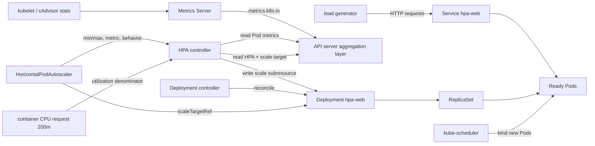

[[Home]]

# Weekly Kubernetes Magazine — HPAのCPU計算・安定化・安全な縮退を設計する

#kubernetes #k8s #weekly #deep-dive

> [!warning] 実行前の安全確認
> このラボは Deployment、Service、HorizontalPodAutoscaler、ServiceAccount、Role、RoleBinding の `apply`、負荷生成、Deploymentの意図的な破壊、Namespaceの `delete` を含む。共有・本番クラスタでは実行しない。**apply / patch / rollout undo / delete の直前に** `kubectl config current-context` と対象Namespaceを確認し、`k8s-hpa-lab` 以外を操作しない。負荷テストはCPUとノード費用を増やし得る。例に実在のSecretは含めない。トークン、パスワード、証明書、クラウド認証情報をYAML、コマンド、ログへ貼らない。

## 1. Focus・難易度・前提・クラスタ要件・到達点

**Focus:** `autoscaling/v2` のHorizontalPodAutoscaler（HPA）を、単なる「CPUが高ければPodを増やす機能」ではなく、CPU requestを分母とする制御ループとして理解する。`behavior`でscale-up速度、scale-down速度、安定化窓を設計し、メトリクス欠損を証拠から診断してrollbackする。

**難易度シグナル:** Intermediate（参加可否を決めるゲートではなく目安）

### 必要な知識・ツール・環境

- 既習概念: Pod / Deployment / ReplicaSet / Service、labelsとselector、readiness、CPU `requests` / `limits`、宣言的reconciliation
- 必須ツール: `kubectl`、YAMLエディタ、Docker互換ランタイムと`kind`（推奨）、イメージを取得できるネットワーク
- クラスタ: 現在サポート中のKubernetes。`metrics.k8s.io` APIを提供するMetrics Serverが必要
- 推奨環境: 2 worker以上の専用kind / minikubeクラスタ。小さなPCでは`maxReplicas`を4へ下げる
- 権限: lab NamespaceとnamespacedなDeployment / Service / HPA / ServiceAccount / Role / RoleBindingを作成できること
- earlier concepts: HPAはPodを直接作らず、対象Deploymentの`scale` subresourceへdesired replica数を書く。Deployment / ReplicaSet controllerがPodを増減する
- 所要時間: Foundation 30分 → Practical implementation 75分 → Production concerns 35分 → Optional challenge 25分、合計約165分

### 事前検査

```bash
kubectl version
kubectl config current-context
kubectl get --raw /apis/metrics.k8s.io/v1beta1 | head
kubectl top nodes
kubectl api-resources | grep -i horizontalpodautoscaler
```

期待値は、metrics APIのJSONが返り、`kubectl top nodes`にCPU / MEMORYが表示され、HPAのAPI versionとして`autoscaling/v2`を利用できること。Metrics Serverがない場合はラボを開始せず、クラスタ管理者の手順で導入する。これはアプリNamespace内だけでは完結しないcluster-wide変更である。

### 測定可能な到達点

1. `desiredReplicas = ceil(currentReplicas × currentMetric / desiredMetric)` を使い、CPU利用率120%、target 60%、2 replicasなら理論値4と計算できる。
2. 無負荷時2 replicas、継続負荷時3以上へのscale-upをHPA status、Deployment、Podメトリクスの3証拠で示せる。
3. `behavior.scaleUp` / `scaleDown` のpolicyと安定化窓が、容量追加速度とフラッピングをどう変えるか説明できる。
4. CPU request欠落を注入し、`ScalingActive=False`、event、`<unknown>` metricから原因を特定できる。
5. `rollout undo`でrequestを復元し、HPAが再び有効なmetricを取得するまで検証できる。

---

## 2. Production scenario・SLO・障害仮定

チケット販売APIは平常時2 Podだが、販売開始直後にCPU負荷が急増する。Pod起動からReadyまで30秒、1 PodがSLO内で処理できる安全なCPU利用率はrequest比60%とする。過剰なscale-downはキャッシュ再構築と接続集中を起こし、逆に遅すぎるscale-upは待ち行列を増やす。

### 仮想SLO / SLI

- API成功率: 月間99.95%以上
- p95 latency: 300ms未満
- CPU target: request比60%。5分継続で平均80%超なら容量不足アラート
- 負荷開始からReady replicas増加まで90秒以内
- 負荷終了後の縮退: 最後の高い推奨値から5分以上待ち、1分あたり最大1 Pod
- 最小Ready容量: 2 Pod、最大8 Pod
- HPAの`AbleToScale` / `ScalingActive`がFalse、またはmetric欠損が5分続いたら通知

### 障害・運用上の仮定

- Metrics Server、APIService、ネットワーク、kubeletのいずれかが壊れ、メトリクスが欠損し得る。
- CPU requestの未設定や過大設定が、同じ実使用量でもutilization比を歪める。
- Node容量が不足するとHPAはreplica数を増やしてもPodがPendingになる。HPAはNodeを増やさない。
- readinessが早すぎるとwarm-up中CPUが計算へ入り、遅すぎると新Podのmetricが一時的に無視される。
- CPUは需要の代理指標にすぎない。I/O待ち、queue depth、RPS、外部依存の飽和はCPUと相関しない場合がある。
- HPAと手動`kubectl scale`を同じDeploymentへ継続的に使うと、次のHPA loopでreplica数が再調整される。
- rolling update中、HPAはDeployment全体のreplicasを調整し、Deployment controllerがReplicaSet間の配分を管理する。
- `maxReplicas`はクラスタ容量・外部DB接続上限・費用上限と整合しているものとする。

---

## 3. Control planeとreconciliationのメンタルモデル

HPAは継続的なストリーム処理ではなく、kube-controller-manager内の周期的なcontrol loopである。典型的な同期周期は15秒だが、クラスタ設定で変わる。

1. Metrics Serverが各kubeletからresource metricsを集め、aggregated APIの`metrics.k8s.io`で公開する。
2. HPA controllerがHPA、対象Deploymentの`scale` subresource、selectorに一致するPod、resource metricsを読む。
3. CPU utilization targetでは、各対象Podについて `実CPU使用量 / CPU request` を計算する。CPU requestがないコンテナを含むPodでは、そのPodのCPU utilizationを定義できない。
4. controllerは概ね次式で推奨replica数を計算する。

```text
desiredReplicas = ceil(currentReplicas × currentMetricValue / desiredMetricValue)

例: current=2, average utilization=120%, target=60%
ceil(2 × 120 / 60) = 4
```

5. tolerance内の小さな差ではscaleしない。欠損metricや未Ready Podがある場合、scale方向を過剰にしないよう保守的に再計算される。
6. 複数metricを指定した場合はmetricごとの推奨値の最大を採る。scale-down時に一部metric取得が失敗すると縮退を見送る場合がある。
7. 推奨値へ`behavior`の安定化窓と速度policyを適用し、`minReplicas`〜`maxReplicas`へ制限する。
8. HPA controllerがDeploymentの`scale` subresourceを更新する。
9. Deployment / ReplicaSet controllerが差分をreconcileしてPodを作成・削除し、schedulerとkubeletが実行する。
10. 次のHPA loopでは新しいPod集合とmetricで再計算する。HPA、Deployment、Metrics Serverはそれぞれ別のloopで、観測には時間差がある。

重要なのは、CPU target 60%が「CPU limitの60%」ではなく、`averageUtilization`の場合は**CPU requestの60%**であることだ。request `200m`なら目標平均は1 Podあたり約`120m`である。

---

## 4. 設計オプションとトレードオフ

### Resource CPU metric

- 長所: Metrics Serverだけで利用でき、導入が比較的簡単。CPU boundなstateless APIと相性が良い。
- 短所: request設計に強く依存する。queueやレイテンシを直接表さず、I/O bound処理には鈍い。

### `averageUtilization` と `averageValue`

- `averageUtilization`: request比。Podサイズを変更すると意味も変わる。requestを性能契約として管理できる場合に向く。
- `averageValue`: Podあたりの絶対値（例`120m`）。request比の歪みを避けるが、異なるサイズのPod混在には注意する。

### scale-upを速く、scale-downを遅くする

- 急な需要には容量不足の損失が大きいため、scale-upは短い安定化窓と大きめの増加を許す。
- scale-downは負荷の一時低下、metric遅延、キャッシュ冷却を吸収するため安定化窓を長くする。
- 遅いscale-downは可用性を高める一方、余剰PodとNodeの費用を増やす。

### `Pods` policy と `Percent` policy

- 小規模では固定`Pods`が予測しやすい。大規模では`Percent`が現在規模に比例する。
- `selectPolicy: Max`は許可変化量の大きいpolicyを選び、俊敏。`Min`は小さい方を選び、保守的。
- ラボではscale-upを`Max`、scale-downを`Min`とし、増やす時は俊敏、減らす時は慎重にする。

### HPA単独か、Node autoscaling併用か

- HPAはPod数を増やすがNode容量は作らない。Pendingが出るクラウド環境ではNode autoscalingとの時間差を設計する。
- `maxReplicas`まで全Podが配置可能とは限らない。requests合計、DaemonSet overhead、zone制約、quotaを含め容量を評価する。

### CPUか、業務metricか

- RPS、queue depth、同時接続数の方が需要に先行する場合、custom / external metricsを検討する。
- 外部metric adapterは新しい可用性依存と権限境界を増やす。metricのfreshness、欠損時挙動、cardinality、改ざん耐性をSLOに含める。

---

## 5. Architecture / object relationship diagram



オブジェクトのownerReferencesはDeployment → ReplicaSet → Podであり、HPAはownerではない。HPAは`scaleTargetRef`でDeploymentを参照する独立オブジェクトである。ServiceもownerではなくselectorでPodを疎結合に選ぶ。

---

## 6. Guided lab（約165分）

### Phase A — Foundation / 安全確認（20分）

```bash
kubectl config current-context
kubectl config view --minify -o 'jsonpath={..namespace}{"\n"}'
kubectl get ns k8s-hpa-lab 2>/dev/null || true
kubectl get --raw /apis/metrics.k8s.io/v1beta1/nodes | head -c 200; echo
```

> [!warning] APPLY前の停止点
> contextが専用検証クラスタであることを声に出して確認する。以降のコマンドは必ず`-n k8s-hpa-lab`を明示する。既存の同名Namespaceが他用途なら続行せず、別の専用クラスタを用意する。

次の内容を`hpa-lab.yaml`として保存する。これはラボに必要な全namespaced objectを含む完全なmanifestである。

```yaml
apiVersion: v1
kind: Namespace
metadata:
  name: k8s-hpa-lab
  labels:
    purpose: kubernetes-magazine-lab
---
apiVersion: apps/v1
kind: Deployment
metadata:
  name: hpa-web
  namespace: k8s-hpa-lab
  labels:
    app.kubernetes.io/name: hpa-web
spec:
  replicas: 2
  strategy:
    type: RollingUpdate
    rollingUpdate:
      maxUnavailable: 0
      maxSurge: 1
  selector:
    matchLabels:
      app.kubernetes.io/name: hpa-web
  template:
    metadata:
      labels:
        app.kubernetes.io/name: hpa-web
    spec:
      securityContext:
        seccompProfile:
          type: RuntimeDefault
      containers:
        - name: server
          image: registry.k8s.io/hpa-example:latest
          imagePullPolicy: IfNotPresent
          ports:
            - name: http
              containerPort: 80
          resources:
            requests:
              cpu: 200m
              memory: 32Mi
            limits:
              cpu: 500m
              memory: 128Mi
          readinessProbe:
            httpGet:
              path: /
              port: http
            periodSeconds: 5
            failureThreshold: 3
          securityContext:
            allowPrivilegeEscalation: false
            capabilities:
              drop: ["ALL"]
---
apiVersion: v1
kind: Service
metadata:
  name: hpa-web
  namespace: k8s-hpa-lab
spec:
  selector:
    app.kubernetes.io/name: hpa-web
  ports:
    - name: http
      port: 80
      targetPort: http
---
apiVersion: autoscaling/v2
kind: HorizontalPodAutoscaler
metadata:
  name: hpa-web
  namespace: k8s-hpa-lab
spec:
  scaleTargetRef:
    apiVersion: apps/v1
    kind: Deployment
    name: hpa-web
  minReplicas: 2
  maxReplicas: 8
  metrics:
    - type: Resource
      resource:
        name: cpu
        target:
          type: Utilization
          averageUtilization: 60
  behavior:
    scaleUp:
      stabilizationWindowSeconds: 0
      selectPolicy: Max
      policies:
        - type: Percent
          value: 100
          periodSeconds: 60
        - type: Pods
          value: 2
          periodSeconds: 60
    scaleDown:
      stabilizationWindowSeconds: 300
      selectPolicy: Min
      policies:
        - type: Percent
          value: 25
          periodSeconds: 60
        - type: Pods
          value: 1
          periodSeconds: 60
---
apiVersion: v1
kind: ServiceAccount
metadata:
  name: hpa-observer
  namespace: k8s-hpa-lab
---
apiVersion: rbac.authorization.k8s.io/v1
kind: Role
metadata:
  name: hpa-observer
  namespace: k8s-hpa-lab
rules:
  - apiGroups: ["autoscaling"]
    resources: ["horizontalpodautoscalers"]
    verbs: ["get", "list", "watch"]
  - apiGroups: ["apps"]
    resources: ["deployments", "replicasets"]
    verbs: ["get", "list", "watch"]
  - apiGroups: [""]
    resources: ["pods", "events"]
    verbs: ["get", "list", "watch"]
---
apiVersion: rbac.authorization.k8s.io/v1
kind: RoleBinding
metadata:
  name: hpa-observer
  namespace: k8s-hpa-lab
subjects:
  - kind: ServiceAccount
    name: hpa-observer
    namespace: k8s-hpa-lab
roleRef:
  apiGroup: rbac.authorization.k8s.io
  kind: Role
  name: hpa-observer
```

server-side dry-runでschemaとadmissionを検証してから適用する。

```bash
kubectl apply --dry-run=server -f hpa-lab.yaml
kubectl diff -f hpa-lab.yaml
kubectl apply -f hpa-lab.yaml
kubectl -n k8s-hpa-lab rollout status deployment/hpa-web --timeout=120s
```

**Checkpoint A**

```bash
kubectl -n k8s-hpa-lab get deploy,rs,pods,svc,hpa
kubectl -n k8s-hpa-lab get endpointslice -l kubernetes.io/service-name=hpa-web
kubectl -n k8s-hpa-lab auth can-i get hpa \
  --as=system:serviceaccount:k8s-hpa-lab:hpa-observer
kubectl -n k8s-hpa-lab auth can-i patch deployment/scale \
  --as=system:serviceaccount:k8s-hpa-lab:hpa-observer
```

期待出力の要点:

```text
deployment.apps/hpa-web   2/2 ...
horizontalpodautoscaler.autoscaling/hpa-web ... 2 ... 8 ... 2
yes
no
```

HPAのTARGETSは最初`<unknown>/60%`でもよい。Metrics Serverの収集まで1〜2周期待ち、`0%/60%`など数値へ変わることを確認する。`hpa-observer`は観測だけでき、replica数変更はできない。

### Phase B — Practical implementation / 負荷とscale-up（55分）

まずbaselineを証拠として保存する。

```bash
kubectl -n k8s-hpa-lab top pods
kubectl -n k8s-hpa-lab describe hpa hpa-web
kubectl -n k8s-hpa-lab get hpa hpa-web -o yaml > hpa-before-load.yaml
```

別ターミナルで負荷生成Podを起動する。終了は`Ctrl-C`。

```bash
kubectl -n k8s-hpa-lab run load-generator \
  --image=busybox:1.36 \
  --restart=Never \
  --rm -it -- \
  /bin/sh -c 'while sleep 0.01; do wget -q -O- http://hpa-web; done'
```

元のターミナルで観測する。

```bash
kubectl -n k8s-hpa-lab get hpa,deploy,pods -w
```

数分後、別ターミナルで証拠を採取する。

```bash
kubectl -n k8s-hpa-lab top pods --containers
kubectl -n k8s-hpa-lab get hpa hpa-web
kubectl -n k8s-hpa-lab describe hpa hpa-web
kubectl -n k8s-hpa-lab get deployment hpa-web \
  -o jsonpath='desired={.spec.replicas} ready={.status.readyReplicas}{"\n"}'
```

環境によって値は異なるが、期待される形は次の通り。

```text
NAME      REFERENCE            TARGETS    MINPODS MAXPODS REPLICAS
hpa-web   Deployment/hpa-web   96%/60%    2       8       4

Conditions:
  AbleToScale     True
  ScalingActive   True
  ScalingLimited  False   # maxReplicas到達時はTrueになり得る
Events:
  SuccessfulRescale ... New size: 4; reason: cpu resource utilization ...
```

**Checkpoint B**

- `kubectl top`でCPU実使用量を見る。
- HPAの`currentMetrics`と`desiredReplicas`を見る。
- Deploymentの`.spec.replicas`と`.status.readyReplicas`を見る。
- Pod数だけで判断せず、`SuccessfulRescale` eventとReady到達時刻を記録する。
- 90秒以内にReady replicasが増えたかをストップウォッチで記録する。

`resources.requests.cpu: 200m`はschedulerの配置予約であると同時にHPA utilizationの分母である。`averageUtilization: 60`なので、平均CPU約120m/Podが目標。`limits.cpu: 500m`はcgroupの上限であり、HPA targetの直接の分母ではない。

### Phase C — Production concern / scale-down安定化（25分）

load generatorを`Ctrl-C`で停止する。残っていれば明示的に確認して削除する。

```bash
kubectl -n k8s-hpa-lab get pod load-generator
kubectl -n k8s-hpa-lab delete pod load-generator --ignore-not-found
kubectl -n k8s-hpa-lab get hpa,deploy,pods -w
```

> [!warning] DELETE前の確認
> contextとNamespaceを再確認し、削除対象が一時的な`pod/load-generator`だけであることを`get`で確定してから実行する。

CPUが下がっても直ちに2 Podへ戻らないことを観測する。`scaleDown.stabilizationWindowSeconds: 300`は直近5分の推奨値から最も高いものを選び、短い負荷低下によるフラッピングを抑える。その後も`Min` policyにより、1分に最大1 Podかつ25%のうち変化が小さい方へ制限される。

```bash
date
kubectl -n k8s-hpa-lab get hpa hpa-web -o jsonpath='{.status.currentReplicas}{" current / "}{.status.desiredReplicas}{" desired\n"}'
kubectl -n k8s-hpa-lab get events --sort-by=.metadata.creationTimestamp | tail -20
```

縮退開始時刻、各replica変更時刻、最終的に2へ戻った時刻をdeliverableへ記録する。

### Phase D — Failure injection / incident / rollback（40分）

ここではCPU requestを意図的に消し、HPAがCPU utilizationを計算できない障害を作る。共有環境では絶対に行わない。

> [!danger] 破壊操作前の停止点
> `kubectl config current-context`、`kubectl -n k8s-hpa-lab get deployment hpa-web`を実行する。対象が専用labの`deployment/hpa-web`だけだと確認してからpatchする。production incidentでは原因候補を作るために変更してはいけない。

```bash
kubectl config current-context
kubectl -n k8s-hpa-lab get deployment hpa-web
kubectl -n k8s-hpa-lab patch deployment hpa-web --type=json \
  -p='[{"op":"remove","path":"/spec/template/spec/containers/0/resources/requests/cpu"}]'
kubectl -n k8s-hpa-lab rollout status deployment/hpa-web --timeout=120s
```

#### Evidence-driven incident exercise

次の順で、仮説より先に証拠を集める。

```bash
kubectl -n k8s-hpa-lab get hpa hpa-web
kubectl -n k8s-hpa-lab describe hpa hpa-web
kubectl -n k8s-hpa-lab get hpa hpa-web -o yaml > incident-hpa.yaml
kubectl -n k8s-hpa-lab get deployment hpa-web -o yaml > incident-deployment.yaml
kubectl -n k8s-hpa-lab top pods --containers
kubectl -n k8s-hpa-lab get events --sort-by=.metadata.creationTimestamp | tail -30
kubectl -n k8s-hpa-lab get --raw /apis/metrics.k8s.io/v1beta1/namespaces/k8s-hpa-lab/pods | head -c 500; echo
```

期待される証拠:

```text
TARGETS: <unknown>/60%
ScalingActive: False
Reason: FailedGetResourceMetric
Message: ... missing request for cpu in container server ...
Warning FailedComputeMetricsReplicas ...
```

状況によって古いmetricや一部旧Podが残り、遷移に数周期かかる。`kubectl top`が成功してもHPAが失敗し得る点が重要である。実CPU値は存在していても、utilizationの分母であるrequestが欠落しているためである。

#### Incident decision

1. 影響: HPAは新しい推奨replica数を安全に計算できない。現在Podが即座に消えるわけではない。
2. SLOリスク: traffic増加時にscale-upできず、latencyとerror率が悪化する。
3. 証拠: HPA condition/eventとDeploymentのrequest欠落が一致する。
4. rollback条件: 直前revisionが既知の良い`cpu: 200m`を持ち、アプリimage変更を同時に含まないこと。

revisionを確認してrollbackする。

```bash
kubectl -n k8s-hpa-lab rollout history deployment/hpa-web
kubectl -n k8s-hpa-lab rollout history deployment/hpa-web --revision=1
kubectl -n k8s-hpa-lab rollout undo deployment/hpa-web
kubectl -n k8s-hpa-lab rollout status deployment/hpa-web --timeout=120s
```

> [!warning] ROLLBACK前の確認
> `rollout undo`はDeployment template全体を前revisionへ戻す。実障害では同revisionにimageや環境変数変更が含まれていないか履歴とGit diffを確認する。曖昧なら、承認済みmanifestの`kubectl apply`を使う。

回復を検証する。

```bash
kubectl -n k8s-hpa-lab get deployment hpa-web \
  -o jsonpath='{.spec.template.spec.containers[0].resources.requests.cpu}{"\n"}'
kubectl -n k8s-hpa-lab get hpa hpa-web -w
kubectl -n k8s-hpa-lab describe hpa hpa-web
```

期待値は`200m`、TARGETSが再び数値、`ScalingActive=True`。conditionは最新状態を見る。過去のwarning eventが残るのは正常なので、「warningが存在する」だけで未復旧と判断しない。

### Phase E — Cleanup（5分）

```bash
kubectl config current-context
kubectl get namespace k8s-hpa-lab --show-labels
kubectl -n k8s-hpa-lab get all,hpa,role,rolebinding,serviceaccount
```

> [!danger] DELETE前の最終確認
> contextが専用検証クラスタ、対象が正確に`namespace/k8s-hpa-lab`、ラベルが`purpose=kubernetes-magazine-lab`であることを確認する。Namespace削除は配下の全namespaced objectを削除する。

```bash
kubectl delete namespace k8s-hpa-lab
kubectl get namespace k8s-hpa-lab
```

期待値は最後のコマンドが`NotFound`。作成したローカルファイル`hpa-lab.yaml`と証拠YAMLは学習成果として保持してよい。実在secretが混入していないことを確認してから共有する。

---

## 7. kubectlとYAMLを丁寧に読む

### `scaleTargetRef`

```yaml
scaleTargetRef:
  apiVersion: apps/v1
  kind: Deployment
  name: hpa-web
```

HPAが変更する対象を指定する。対象は同じNamespaceにあり、`scale` subresourceを持つ必要がある。HPAはDeployment manifestの`.spec.replicas`を自分のdesired値へ更新するため、GitOpsでreplicasを固定して継続reconcileするとwriter conflictになる。

### `minReplicas` / `maxReplicas`

`minReplicas: 2`は平常時の最低冗長性、`maxReplicas: 8`は無限増加を止めるガード。`maxReplicas`到達は需要充足の保証ではない。`ScalingLimited=True`とアプリSLIを同時に見る。

### `metrics.resource.target`

```yaml
target:
  type: Utilization
  averageUtilization: 60
```

対象Pod群の平均CPU request比を60%へ近づける。全containerにCPU requestを定義する。sidecarのrequest欠落も計算不能の原因になり得る。特定containerだけを基準にしたい場合、`type: ContainerResource`を検討する。

### `behavior`

policyは計算済みのdesiredReplicasに対する**変化速度の上限**であり、metric targetそのものを変更しない。安定化窓は過去の推奨値から安全側を選び、反応を平滑化する。

### `kubectl get hpa`

- `TARGETS`: 現在値 / 目標値。`<unknown>`は必ず`describe`へ進む。
- `REPLICAS`: HPA status上の現在replica数。Ready数とは限らない。
- `MINPODS` / `MAXPODS`: HPAの境界。

### `kubectl describe hpa`

- Conditionsの`AbleToScale`: scale targetへアクセス・更新可能か。
- `ScalingActive`: 有効なmetricからreplica数を計算できるか。
- `ScalingLimited`: 推奨値がmin/maxまたはbehaviorに制限されたか。
- Events: rescale成功とmetric計算失敗の時系列。ただし保持期間があり、永続監査ログではない。

### `kubectl top`とraw metrics API

`top`はresource usageを見せるが、HPAの最終判断を完全再現するコマンドではない。サンプル時刻、未Ready処理、欠損Pod、tolerance、安定化窓があるため、`top`、HPA status、eventsを組み合わせる。

---

## 8. Incident / rollback runbook

```text
ALERT: latency high / HPA ScalingActive=False
  1. Scope: context, namespace, workload, start timeを固定
  2. User impact: error rate, latency, queue, Ready endpointsを確認
  3. HPA: TARGETS, Conditions, Events, current/desired replicas
  4. Metrics path: kubectl top → raw metrics API → APIService状態（管理者）
  5. Workload: requests, readiness, Pending, rollout revision
  6. Capacity: Node allocatable, scheduler events, quota
  7. Mitigation: 既知の良いmanifestへrollback。必要時は承認済み一時容量
  8. Verify: SLI回復 + ScalingActive=True + Ready capacity
  9. Preserve: YAML、event、timestamp、変更diff
```

metric障害中の手動scaleは一時緩和になり得るが、HPA回復後に上書きされる。また根拠なく最大値へscaleするとNode Pending、DB接続枯渇、費用急増を招く。実施するなら必要replicas、終了条件、owner、TTLをincident logへ残す。

---

## 9. Security・RBAC・Namespace/context・resource・cost

### Security / RBAC

- HPA observerには`get/list/watch`だけを付与し、HPA更新、Deployment patch、`deployments/scale`更新を与えない。
- autoscaling operatorへscale権限を与える場合も特定Namespace・resourceNamesへ限定し、監査ログを有効にする。
- Metrics APIはworkload activityを示す。不要なcluster-wide閲覧権限を配らない。
- load generatorは任意の内部Serviceへ到達できる可能性がある。専用クラスタを使い、必要ならNetworkPolicyでegressを限定する。
- workloadは非root対応イメージが理想。本例は公式walkthrough互換性を優先したため、実製品では固定digest、署名検証、`runAsNonRoot`対応イメージへ置換する。
- 実在secretは使わない。認証が必要な負荷試験は専用の短命credentialを外部secret管理から注入し、ログやshell historyへ出さない。

### Namespace / context

- `--namespace` / `-n`を全namespaced commandへ明記し、current namespaceの暗黙値へ依存しない。
- production contextと似た名前を避け、terminal promptへcontextを表示する。
- apply前は`--dry-run=server`と`kubectl diff`、delete前は正確な`get`で対象を確定する。

### Resources / capacity

- requestsが低すぎると少量CPUでutilizationが高騰し過剰scale、高すぎるとscaleが遅れ、scheduler予約も浪費する。
- limitsが低すぎるとCPU throttlingでlatencyが悪化し、Pod追加だけでは解消しない場合がある。
- `minReplicas × request`を常時費用、`maxReplicas × request`をピーク予約として計算する。
- ResourceQuotaがmaxReplicas到達を阻む可能性がある。HPAだけでなくFailedScheduling / FailedCreate eventを見る。
- topology spread、PDB、rollout surgeが同時に追加容量を要求する。steady stateだけでNode容量を設計しない。

### Cost

- HPAでPodが減ってもNodeが減らなければインフラ費用は下がらない。
- 5分のdownscale stabilizationは余剰費用と再増加リスクの交換条件。
- 外部監視、custom metrics adapter、high-cardinality metricsにも費用がある。
- 最大8 Podが外部DB、SaaS、NAT、load balancerへ与える追加コストとrate limitを事前評価する。

---

## 10. Production verification checklist / deliverables

### Verification checklist

- [ ] contextと`k8s-hpa-lab` Namespaceを各mutation前に確認した
- [ ] Metrics APIと`kubectl top`が有効だった
- [ ] すべての対象containerにCPU requestがあった
- [ ] baselineで2/2 Ready、HPA `ScalingActive=True`を確認した
- [ ] 負荷中にHPA、Deployment、Pod metricsの3種類の証拠を採取した
- [ ] 90秒以内のReady capacity増加を測定した
- [ ] scale-downが5分の安定化窓と速度policyに従うことを観測した
- [ ] failure injection後に`FailedGetResourceMetric`とrequest欠落を対応付けた
- [ ] rollback後に`cpu: 200m`、数値TARGETS、`ScalingActive=True`を確認した
- [ ] observer ServiceAccountがread-onlyでscaleできないことを確認した
- [ ] real secretを作成・表示・共有していない
- [ ] cleanup対象を確認し、Namespaceの`NotFound`まで検証した

### Concrete deliverables

1. `hpa-lab.yaml`
2. `hpa-before-load.yaml`
3. `incident-hpa.yaml`と`incident-deployment.yaml`
4. 時刻、CPU、current/desired/ready replicasを並べたscale-up / downタイムライン
5. SLOを根拠にしたmin/max、target、scale policies、stabilization windowの設計メモ（300〜500字）
6. incidentの「症状 → 証拠 → 原因 → rollback → 回復判定」を1ページにまとめた記録

---

## 11. Five-question assessment

### Q1. request 200mのPodが2個、平均CPU使用量240m、target 60%なら理論上のdesired replicasはいくつか。

<details>
<summary>回答</summary>

各Podのutilizationは240m / 200m = 120%。`ceil(2 × 120 / 60) = 4`なので4 replicas。ただし実際はtolerance、欠損metric、behavior、min/maxで調整される。

</details>

### Q2. `kubectl top pods`は数値を返すのにHPAが`<unknown>/60%`になる代表例は何か。

<details>
<summary>回答</summary>

対象containerのCPU request欠落。実使用量は取得できてもutilization比の分母がない。HPAの`describe`で`FailedGetResourceMetric`やmissing requestを確認する。他にもselector不整合、metric freshness、API障害があり得る。

</details>

### Q3. scale-downの`stabilizationWindowSeconds: 300`は何をするか。

<details>
<summary>回答</summary>

直近300秒に計算された推奨replica数のうち最も高い値を用い、一時的なmetric低下で急に縮退するのを防ぐ。5分後に必ずminReplicasへ戻すタイマーではない。

</details>

### Q4. HPAが8 replicasを要求したのに4 PodがPendingである。HPAの故障と言えるか。

<details>
<summary>回答</summary>

直ちには言えない。HPAはDeploymentのdesired replicasを更新した可能性があり、その後のschedulerがNode CPU不足、taint、affinity、quota等で配置できないことがある。HPA status、Deployment desired、Pod events、Node allocatableを分けて確認する。

</details>

### Q5. HPAとGitOpsが同じDeploymentの`.spec.replicas`を管理すると何が起きるか。

<details>
<summary>回答</summary>

HPAがscale subresourceへ書いたreplica数をGitOps controllerがmanifest値へ戻し、writer同士が競合する。HPA対象workloadでは通常、GitOps側でreplicasの差分を無視するか、所有権設計を明確にする。

</details>

### Interview / design question

販売開始時にRPSが30秒で10倍になるAPIを設計する。Pod起動は45秒、DB接続は1 Podあたり20、DB上限400、Node追加は2分、p95 SLOは300msである。CPU HPAのmin/max、target、scale-up/down behavior、Node autoscaling、readiness、DB保護、アラートをどう設計し、どの負荷試験で妥当性を証明するか。

良い回答は、単一のtarget値ではなく、最大Pod数をDB接続上限から制約し、事前scaleまたは十分なmin容量、速いscale-up、遅いscale-down、Node起動遅延、接続pool、queue/backpressure、SLOベースの検証、metric欠損時runbookまで扱う。

### Follow-up challenge（Optional advanced / 25分）

`Resource` CPU metricを`ContainerResource` metricへ変更し、`server` containerだけを60% targetにする。その後、CPUをほぼ使わないsidecarを追加してrequestを変え、Pod全体metricとcontainer metricで推奨replicasがどう変わるか比較する。

追加条件:

- serverとsidecar双方にrequests / limitsを設定する
- HPA manifestを`autoscaling/v2`で保持する
- 変更前後の`currentMetrics`とdesiredReplicasを保存する
- sidecar追加がsecurityContext、image supply chain、総request、costへ与える影響を書く
- クラスタがContainerResource metricをサポートすることをAPIと実測で確認する

---

## 12. Current official kubernetes.io references

- [Horizontal Pod Autoscaling — concepts](https://kubernetes.io/docs/concepts/workloads/autoscaling/horizontal-pod-autoscale/)
- [HorizontalPodAutoscaler Walkthrough](https://kubernetes.io/docs/tasks/run-application/horizontal-pod-autoscale-walkthrough/)
- [HorizontalPodAutoscaler autoscaling/v2 API reference](https://kubernetes.io/docs/reference/kubernetes-api/autoscaling/horizontal-pod-autoscaler-v2/)
- [Autoscaling Workloads](https://kubernetes.io/docs/concepts/workloads/autoscaling/)
- [Resource Management for Pods and Containers](https://kubernetes.io/docs/concepts/configuration/manage-resources-containers/)
- [Metrics For Kubernetes System Components](https://kubernetes.io/docs/concepts/cluster-administration/system-metrics/)
- [Using RBAC Authorization](https://kubernetes.io/docs/reference/access-authn-authz/rbac/)
- [Deployments](https://kubernetes.io/docs/concepts/workloads/controllers/deployment/)
- [Debug Running Pods](https://kubernetes.io/docs/tasks/debug/debug-application/debug-running-pod/)

> 参照日は2026-08-06。Kubernetesの機能状態、既定値、Metrics Server互換性はリリースとクラスタ設定で変わり得る。実環境ではクラスタのKubernetes minor versionに対応する公式ドキュメントと管理者設定を照合する。
