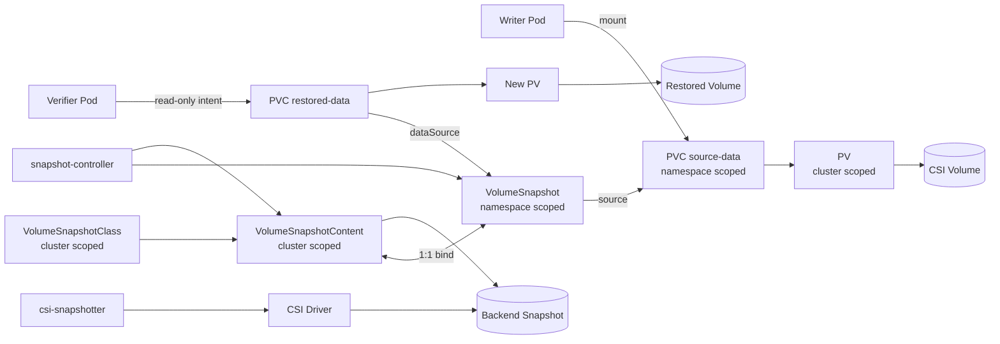

# Weekly Kubernetes Magazine — CSI VolumeSnapshotで「復元できるバックアップ」を設計する

[[Home]]

#kubernetes #k8s #weekly #deep-dive

> [!warning] 操作前の安全確認
> この演習はPVC、スナップショット、復元PVCを作成し、最後に削除します。共有・本番クラスタでは実行しないでください。実行前に必ず `kubectl config current-context` と対象Namespaceを確認してください。実データや実シークレットは使いません。`delete` は対象を再表示してから実行します。

## 1. Focus・難易度・前提・クラスタ要件・測定可能な到達点

### Focus

特定の工学的評価基準は、**PVC上のデータをCSI VolumeSnapshotから、定義したRPO/RTO内で実際に復元できるか**です。スナップショット作成成功をバックアップ成功と同一視せず、復元後の内容検証までを完了条件にします。

- 難易度シグナル: **Specialized**（参加資格ではなく、CSIとストレージ運用の調査が必要という目安）
- 所要時間: 150分（Foundation 25分、実装70分、障害対応35分、振り返り20分）
- ローテーション領域: storage / backup-recovery / incident drill

### 必要知識

- PVはクラスタスコープ、PVCとVolumeSnapshotはNamespaceスコープであること
- StorageClassによる動的プロビジョニング
- PodがPVCをマウントする仕組み
- `metadata.spec.status`、controllerによるreconciliation、Kubernetes Eventの読み方
- **先に理解しておく概念**: RPO（許容できるデータ損失時間）とRTO（復旧完了までの許容時間）

### 必要ツール・環境

- `kubectl` と、変更してよい検証クラスタ
- CSIドライバ、VolumeSnapshot CRD、snapshot-controller、CSI snapshotter
- 動的プロビジョニング可能なStorageClass
- そのCSIドライバに対応するVolumeSnapshotClass
- `snapshot.storage.k8s.io/v1` が利用可能なこと
- 目安として空き容量1Gi以上。スナップショットはバックエンド側でも容量・APIコストを消費する

最初に互換性を確認します。

```bash
kubectl config current-context
kubectl api-resources | grep -E 'volumesnapshot(classes|contents)?'
kubectl get storageclass
kubectl get volumesnapshotclass
kubectl get csidriver
```

`volumesnapshotclass` が空、または利用中StorageClassのprovisionerと対応するdriverがない場合、このラボはそこで停止します。CRDやcontrollerを勝手に本番へ追加せず、クラスタ管理者に確認してください。

### 測定可能な到達点

1. `VolumeSnapshot.status.readyToUse=true` を確認できる。
2. 復元PVCが`Bound`、検証Podが`Ready`になるまでのRTOを秒単位で記録できる。
3. スナップショット前のレコードが復元され、後に追加したレコードが存在しないことでRPO境界を説明できる。
4. Event、PVC、VolumeSnapshot、VolumeSnapshotContentの証拠から失敗原因を分類できる。
5. `deletionPolicy` とPV reclaim policyが、Kubernetesオブジェクトと実ストレージの寿命に与える影響を説明できる。

## 2. 本番シナリオ・SLO・障害仮定

注文APIが単一PVCに監査ログを書いているとします。誤ったリリースがログを破損したため、直前の復旧点から別PVCへ復元し、内容を検証してから切り戻します。

| 指標 | 演習SLO | 本番設計で問うこと |
|---|---:|---|
| Snapshot readiness | 120秒以内 | 大容量・書込み量・provider制限でどう変化するか |
| RPO | snapshot開始時点から最大1レコード | crash-consistentで許容できるか |
| RTO | 復元開始から検証Pod Readyまで300秒以内 | volume attach、zone、image pullを含むか |
| データ完全性 | 期待レコード100% | checksum、DB整合性検査、業務照合は何か |

障害仮定:

- Kubernetes APIは利用でき、CSI control planeも動作する。
- source PVCの誤削除、アプリ誤更新、復元先の設定ミスを想定する。
- ノード・AZ・リージョン全損はこの単一スナップショット演習の保護範囲外。
- VolumeSnapshotは一般にストレージ時点コピーであり、アプリケーション整合性は自動保証されない。DBならfreeze、flush、トランザクション境界、operator連携等を別途設計する。
- 同一バックエンドのsnapshotだけでは独立バックアップにならない場合がある。provider障害、資格情報侵害、ランサムウェアへの耐性は別レイヤーで評価する。

## 3. Control planeとreconciliationのメンタルモデル

1. 利用者がnamespacedな`VolumeSnapshot`を作成し、source PVCを指す。
2. snapshot-controllerが監視し、cluster-scopedな`VolumeSnapshotContent`との1対1 bindingを調整する。
3. CSI snapshotter sidecarがCSI driverへ`CreateSnapshot`を要求する。
4. driverがストレージバックエンドでsnapshotを作り、controllerがstatusを更新する。
5. 復元PVCの`dataSource`がVolumeSnapshotを指すと、external-provisioner/CSI driverがsnapshotを元に新volumeを作る。
6. PV/PVC binding後、scheduler、attach/mount処理を経てPodが利用する。

重要なのは、`kubectl apply`が処理を完了させるのではなく**望ましい状態をAPIに登録するだけ**という点です。`readyToUse`、PVC phase、Eventsを観測してreconciliationがどこまで進んだか判断します。

## 4. 設計選択肢とtrade-off

### crash-consistent vs application-consistent

- crash-consistent: 停止時間が短く自動化しやすいが、DB recoveryや破損検査が必要。
- application-consistent: write quiesce、flush、DB固有snapshotなどでRPO品質を上げるが、アプリ遅延・権限・運用複雑性が増す。

### VolumeSnapshotClassの`deletionPolicy`

- `Delete`: VolumeSnapshot削除に連動してbackend snapshotも削除。コスト管理は容易だが誤削除耐性が弱い。
- `Retain`: APIオブジェクト削除後もVolumeSnapshotContentとbackend snapshotを保持。復旧余地は増すが、棚卸し・手動削除・課金管理が必要。

### in-place recovery vs new PVC restore

- 新PVCへの復元は元データを温存し、比較・ロールバックしやすい。本誌の推奨。
- 元PVCを削除して同名へ戻す手順は参照関係を単純化できる一方、失敗時の証拠と逃げ道を失いやすい。

### snapshot vs backup export

- snapshotは高速でvolume単位だが、同一障害ドメインやprovider依存になりやすい。
- object storageへの論理/物理exportは独立性・長期保持に向くが、復元時間、暗号化、整合性、転送料を管理する。

## 5. オブジェクト関係図



## 6. 150分ガイドラボ

### Step 0 — context、Namespace、driverの確認（10分）

```bash
kubectl config current-context
kubectl config view --minify --output 'jsonpath={..namespace}'; echo
kubectl get storageclass -o custom-columns=NAME:.metadata.name,PROVISIONER:.provisioner,DEFAULT:.metadata.annotations.storageclass\.kubernetes\.io/is-default-class
kubectl get volumesnapshotclass -o custom-columns=NAME:.metadata.name,DRIVER:.driver,POLICY:.deletionPolicy
```

StorageClassの`PROVISIONER`とVolumeSnapshotClassの`DRIVER`が対応する組を選びます。以下では環境固有値を変数にします。

```bash
export LAB_NS=k8s-mag-snapshot
export LAB_SC='<使用するStorageClass名>'
export LAB_VSC='<対応するVolumeSnapshotClass名>'
test -n "$LAB_NS" && test "$LAB_SC" != '<使用するStorageClass名>' && test "$LAB_VSC" != '<対応するVolumeSnapshotClass名>'
```

> [!warning] apply前の停止点
> `kubectl config current-context` をもう一度確認してください。以降は `$LAB_NS` にリソースを作成します。`LAB_SC`と`LAB_VSC`の対応が不明なら実行しません。

### Step 1 — source workloadを作る（20分）

環境固有値を埋めた完全manifestを生成します。ここで扱う文字列はダミーデータのみです。

```bash
envsubst <<'EOF' > /tmp/k8s-mag-source.yaml
apiVersion: v1
kind: Namespace
metadata:
  name: ${LAB_NS}
  labels:
    app.kubernetes.io/part-of: k8s-magazine-snapshot-lab
---
apiVersion: v1
kind: PersistentVolumeClaim
metadata:
  name: source-data
  namespace: ${LAB_NS}
spec:
  accessModes:
    - ReadWriteOnce
  storageClassName: ${LAB_SC}
  resources:
    requests:
      storage: 1Gi
---
apiVersion: v1
kind: Pod
metadata:
  name: writer
  namespace: ${LAB_NS}
  labels:
    app: snapshot-writer
spec:
  securityContext:
    runAsNonRoot: true
    runAsUser: 1000
    runAsGroup: 1000
    fsGroup: 1000
    seccompProfile:
      type: RuntimeDefault
  containers:
    - name: writer
      image: busybox:1.36.1
      command: ["sh", "-c"]
      args: ["sleep 7200"]
      resources:
        requests: {cpu: 10m, memory: 16Mi}
        limits: {cpu: 100m, memory: 64Mi}
      securityContext:
        allowPrivilegeEscalation: false
        capabilities: {drop: ["ALL"]}
      volumeMounts:
        - name: data
          mountPath: /data
  volumes:
    - name: data
      persistentVolumeClaim:
        claimName: source-data
EOF
kubectl apply --dry-run=server -f /tmp/k8s-mag-source.yaml
kubectl apply -f /tmp/k8s-mag-source.yaml
kubectl -n "$LAB_NS" wait pod/writer --for=condition=Ready --timeout=180s
kubectl -n "$LAB_NS" get pod,pvc
```

期待出力の要点:

```text
pod/writer condition met
pod/writer        1/1   Running
persistentvolumeclaim/source-data   Bound
```

初期データを書き、checksumを記録します。

```bash
kubectl -n "$LAB_NS" exec writer -- sh -c 'printf "order-001\norder-002\n" > /data/orders.txt; sync; sha256sum /data/orders.txt'
kubectl -n "$LAB_NS" exec writer -- cat /data/orders.txt
```

Checkpoint A: `order-001`と`order-002`、およびchecksumを作業記録へコピーします。

### Step 2 — snapshotを作る（25分）

```bash
envsubst <<'EOF' > /tmp/k8s-mag-snapshot.yaml
apiVersion: snapshot.storage.k8s.io/v1
kind: VolumeSnapshot
metadata:
  name: source-data-snap-01
  namespace: ${LAB_NS}
  labels:
    app.kubernetes.io/part-of: k8s-magazine-snapshot-lab
spec:
  volumeSnapshotClassName: ${LAB_VSC}
  source:
    persistentVolumeClaimName: source-data
EOF
kubectl apply --dry-run=server -f /tmp/k8s-mag-snapshot.yaml
date -Ins
kubectl apply -f /tmp/k8s-mag-snapshot.yaml
kubectl -n "$LAB_NS" wait volumesnapshot/source-data-snap-01 --for=jsonpath='{.status.readyToUse}'=true --timeout=180s
date -Ins
kubectl -n "$LAB_NS" get volumesnapshot source-data-snap-01 -o yaml
```

期待するstatus:

```yaml
status:
  readyToUse: true
  boundVolumeSnapshotContentName: snapcontent-...
  restoreSize: 1Gi
```

環境によって`restoreSize`表記は異なります。`readyToUse=true`とbinding名を主証拠にします。

Checkpoint B:

```bash
CONTENT=$(kubectl -n "$LAB_NS" get volumesnapshot source-data-snap-01 -o jsonpath='{.status.boundVolumeSnapshotContentName}')
kubectl get volumesnapshotcontent "$CONTENT" -o custom-columns=NAME:.metadata.name,DRIVER:.spec.driver,POLICY:.spec.deletionPolicy,READY:.status.readyToUse
```

ここで得た`POLICY`が、選んだVolumeSnapshotClassの`deletionPolicy`と一致することを確認します。

### Step 3 — RPO境界を作る（5分）

snapshotがReadyになった**後**にレコードを追加します。

```bash
kubectl -n "$LAB_NS" exec writer -- sh -c 'printf "order-003-after-snapshot\n" >> /data/orders.txt; sync; cat /data/orders.txt'
```

sourceには3行、snapshotには原則として最初の2行がある状態を作りました。ただし、snapshot取得時刻の意味はdriver/backend依存です。高書込みワークロードではアプリ側のquiesceが必要です。

### Step 4 — 新PVCへ復元してRTOを計測（30分）

復元PVCの要求容量はsnapshotのrestore size以上にします。

```bash
envsubst <<'EOF' > /tmp/k8s-mag-restore.yaml
apiVersion: v1
kind: PersistentVolumeClaim
metadata:
  name: restored-data
  namespace: ${LAB_NS}
spec:
  accessModes:
    - ReadWriteOnce
  storageClassName: ${LAB_SC}
  resources:
    requests:
      storage: 1Gi
  dataSource:
    name: source-data-snap-01
    kind: VolumeSnapshot
    apiGroup: snapshot.storage.k8s.io
---
apiVersion: v1
kind: Pod
metadata:
  name: verifier
  namespace: ${LAB_NS}
spec:
  securityContext:
    runAsNonRoot: true
    runAsUser: 1000
    runAsGroup: 1000
    fsGroup: 1000
    seccompProfile:
      type: RuntimeDefault
  containers:
    - name: verifier
      image: busybox:1.36.1
      command: ["sh", "-c"]
      args: ["sleep 7200"]
      resources:
        requests: {cpu: 10m, memory: 16Mi}
        limits: {cpu: 100m, memory: 64Mi}
      securityContext:
        allowPrivilegeEscalation: false
        capabilities: {drop: ["ALL"]}
      volumeMounts:
        - name: restored
          mountPath: /restore
          readOnly: true
  volumes:
    - name: restored
      persistentVolumeClaim:
        claimName: restored-data
        readOnly: true
EOF
kubectl apply --dry-run=server -f /tmp/k8s-mag-restore.yaml
START=$(date +%s)
kubectl apply -f /tmp/k8s-mag-restore.yaml
kubectl -n "$LAB_NS" wait pod/verifier --for=condition=Ready --timeout=300s
END=$(date +%s); echo "Observed RTO: $((END-START)) seconds"
kubectl -n "$LAB_NS" get pvc restored-data
kubectl -n "$LAB_NS" exec verifier -- cat /restore/orders.txt
kubectl -n "$LAB_NS" exec verifier -- sha256sum /restore/orders.txt
```

期待結果:

```text
order-001
order-002
```

`order-003-after-snapshot`がないことを確認します。

```bash
kubectl -n "$LAB_NS" exec verifier -- sh -c '! grep -q after-snapshot /restore/orders.txt'
echo $?
```

終了コード`0`ならRPO境界の検証成功です。Checkpoint CとしてRTO、復元checksum、行数を記録します。

## 7. kubectlとYAMLの要点

- `--dry-run=server`: API serverのschema、admission、既存オブジェクトとの整合を通して検証する。CSI backend処理までは行わない。
- `kubectl wait ... readyToUse=true`: オブジェクト作成成功ではなく、controllerが公開する利用可能状態を待つ。
- `spec.source.persistentVolumeClaimName`: dynamic snapshotのsource。VolumeSnapshotと同じNamespaceのPVCを指す。
- `PVC.spec.dataSource`: 復元元のVolumeSnapshotを宣言する。新しいPVをsnapshotからprovisionする要求。
- `apiGroup: snapshot.storage.k8s.io`: core APIではないため明示が必要。
- `readOnly: true`: 検証Podによる意図しない書換えを減らす。バックエンドやaccess modeの完全な防御と同義ではない。
- `VolumeSnapshotContent`: PVに対応するようなcluster-scoped resource。通常のdynamic flowでは利用者が手作業で作らない。
- `sync`: userspace/page cacheの書込みを促すが、DBのアプリケーション整合性を保証しない。

## 8. 障害注入と証拠駆動incident/rollback

### 注入: 誤ったVolumeSnapshotClass名

正常snapshotは保持したまま、失敗用要求を作ります。

```bash
envsubst <<'EOF' > /tmp/k8s-mag-broken-snapshot.yaml
apiVersion: snapshot.storage.k8s.io/v1
kind: VolumeSnapshot
metadata:
  name: broken-snapshot
  namespace: ${LAB_NS}
spec:
  volumeSnapshotClassName: class-that-does-not-exist
  source:
    persistentVolumeClaimName: source-data
EOF
kubectl apply --dry-run=server -f /tmp/k8s-mag-broken-snapshot.yaml
kubectl apply -f /tmp/k8s-mag-broken-snapshot.yaml
kubectl -n "$LAB_NS" get volumesnapshot broken-snapshot -o wide
kubectl -n "$LAB_NS" describe volumesnapshot broken-snapshot
kubectl -n "$LAB_NS" get events --sort-by=.metadata.creationTimestamp | tail -20
```

予想: API schemaとしては正しいためapplyできても、reconciliationは存在しないclassを解決できず、`readyToUse`になりません。環境によりstatus errorまたはEventの文言は異なります。

### incident判断

1. **症状**: `readyToUse`が空/false、RTOタイマーを開始できない。
2. **証拠**: `describe`のEvents、`spec.volumeSnapshotClassName`、利用可能class一覧。
3. **影響範囲**: source PVCと正常snapshotは変更されていない。新しい失敗要求だけ。
4. **仮説**: class名不一致。driver障害と断定する前に宣言値を照合。
5. **安全なrollback**: 失敗オブジェクトを削除し、既知の正常classを使う新しいsnapshot名で再作成する。immutableなclass設計を考慮し、in-place patchに依存しない。

```bash
kubectl -n "$LAB_NS" get volumesnapshot broken-snapshot -o yaml
# 上の出力で対象を確認してから削除
kubectl -n "$LAB_NS" delete volumesnapshot broken-snapshot
kubectl -n "$LAB_NS" get pvc source-data
kubectl -n "$LAB_NS" get volumesnapshot source-data-snap-01
```

### 模擬アプリrollback

復元内容が正しい場合だけ、ServiceやDeployment/StatefulSetのclaim参照を`restored-data`へ切り替える計画を承認します。本演習では実workload切替はせず、次をdeliverableにします。

- change対象とowner
- pre-change checksum/業務整合性検査
- maintenance/read-only判断
- rollback条件（Ready timeout、checksum不一致、error rate）
- 元PVCを削除しない観察期間

## 9. Security・RBAC・Namespace/context・resource・cost

### Security/RBAC

- アプリServiceAccountへsnapshot作成権限を常時与えない。バックアップcontrollerまたは限定運用roleへ分離する。
- namespaced Roleでは`volumesnapshots`とPVCの必要verbだけを付与する。cluster-scopedな`volumesnapshotcontents`、`volumesnapshotclasses`の変更は管理者へ限定する。
- 権限確認例:

```bash
kubectl auth can-i create volumesnapshots.snapshot.storage.k8s.io -n "$LAB_NS"
kubectl auth can-i get persistentvolumeclaims -n "$LAB_NS"
kubectl auth can-i delete volumesnapshotcontents.snapshot.storage.k8s.io
```

- snapshotには元volumeの機密情報が含まれる。暗号化鍵、IAM、provider snapshot sharing、監査log、保持期限を管理する。
- manifestや作業記録に実パスワード、token、顧客データを書かない。

最小権限Roleの設計例（必要時のみ管理者がBindingする。無条件applyしない）:

```yaml
apiVersion: rbac.authorization.k8s.io/v1
kind: Role
metadata:
  name: snapshot-operator
  namespace: k8s-mag-snapshot
rules:
  - apiGroups: ["snapshot.storage.k8s.io"]
    resources: ["volumesnapshots"]
    verbs: ["get", "list", "watch", "create", "delete"]
  - apiGroups: [""]
    resources: ["persistentvolumeclaims", "pods", "pods/log"]
    verbs: ["get", "list", "watch"]
```

`pods/exec`は検証に便利ですが強い権限です。自動バックアップ主体には原則付与せず、専用validator Jobやchecksum statusを使います。

### Resource/cost

- source 1Gi、restore 1Giに加えbackend snapshot容量を消費する。copy-on-writeでも変更量で増える。
- snapshot API回数、保持数、クロスzone/region転送、復元volumeの放置課金を監視する。
- ResourceQuotaだけではprovider側snapshot総容量を完全制御できない。外部台帳、tag、budget alertが必要。
- 復元PodのCPU/メモリrequests/limitsを指定し、検証が他workloadを圧迫しないようにする。

## 10. Cleanup — 削除前に再確認

> [!danger] 削除操作
> Namespace削除は、その中のPod、PVC、VolumeSnapshotをまとめて削除します。VolumeSnapshotClassの`deletionPolicy`とStorageClass/PVのreclaim policyによって、backend snapshot/volumeが残るか消えるかが変わります。context、Namespace、対象一覧を確認するまで実行しません。

```bash
kubectl config current-context
printf 'TARGET NAMESPACE=%s\n' "$LAB_NS"
kubectl -n "$LAB_NS" get pod,pvc,volumesnapshot
kubectl get volumesnapshotcontent -o custom-columns=NAME:.metadata.name,NS:.spec.volumeSnapshotRef.namespace,SNAPSHOT:.spec.volumeSnapshotRef.name,POLICY:.spec.deletionPolicy | grep "$LAB_NS" || true
kubectl get pv -o custom-columns=NAME:.metadata.name,CLAIM:.spec.claimRef.name,NS:.spec.claimRef.namespace,RECLAIM:.spec.persistentVolumeReclaimPolicy | grep "$LAB_NS" || true
```

確認後:

```bash
kubectl delete namespace "$LAB_NS" --wait=true
kubectl get namespace "$LAB_NS"
kubectl get volumesnapshotcontent -o custom-columns=NAME:.metadata.name,NS:.spec.volumeSnapshotRef.namespace,SNAPSHOT:.spec.volumeSnapshotRef.name,POLICY:.spec.deletionPolicy | grep "$LAB_NS" || true
kubectl get pv -o custom-columns=NAME:.metadata.name,NS:.spec.claimRef.namespace,STATUS:.status.phase,RECLAIM:.spec.persistentVolumeReclaimPolicy | grep "$LAB_NS" || true
```

`Retain`により残ったcluster-scoped object/backend assetは、必要性とprovider IDを確認し、組織の承認手順で処理します。この誌面の手順で自動削除しません。

## 11. 検証チェックリストとdeliverables

- [ ] contextとNamespaceをapply/delete前に確認した
- [ ] StorageClass provisionerとVolumeSnapshotClass driverの対応を確認した
- [ ] source PVCはBound、writer PodはReadyになった
- [ ] snapshotは`readyToUse=true`、Contentとのbindingを確認した
- [ ] sourceのsnapshot前checksumを記録した
- [ ] 復元PVCはBound、verifier PodはReadyになった
- [ ] 復元データにsnapshot前2行があり、snapshot後の行がない
- [ ] RTO実測値とSLO判定を記録した
- [ ] 失敗注入のEvent、原因、影響範囲、rollbackを記録した
- [ ] deletionPolicy/reclaim policyと残存assetをcleanup後に確認した

具体的deliverables:

1. context、StorageClass、VolumeSnapshotClass対応表
2. snapshot開始/Ready時刻と所要秒数
3. 復元開始/Ready時刻、Observed RTO、SLO合否
4. source/restore checksumと行差分
5. incident timeline（症状→証拠→仮説→rollback→検証）
6. 本番向けRPO/RTO、保持期間、整合性方式、ownerを含む1ページ設計メモ

## 12. Assessment

### Q1. VolumeSnapshotが作成済みならbackup成功と言えるか？

<details><summary>回答</summary>
いいえ。少なくともreadyToUse、Content binding、実復元、checksum/業務整合性、RPO/RTOを検証する必要があります。
</details>

### Q2. VolumeSnapshotとVolumeSnapshotContentのscopeと関係は？

<details><summary>回答</summary>
VolumeSnapshotはNamespace scopeの利用者要求、VolumeSnapshotContentはcluster scopeの実snapshot表現で、controllerが1対1にbindします。
</details>

### Q3. `deletionPolicy: Retain`の利点と運用負債は？

<details><summary>回答</summary>
Kubernetes側の誤削除後にもbackend snapshotを残せます。一方、孤立Content/assetの棚卸し、アクセス制御、手動回収、継続課金が必要です。
</details>

### Q4. `sync`後のsnapshotはDBのapplication-consistent backupか？

<details><summary>回答</summary>
通常は断定できません。DBのbuffer、WAL、複数volume間整合性、トランザクション境界をDB固有のfreeze/flush/operator等で扱う必要があります。
</details>

### Q5. 復元PVCがPendingのとき最初に集める証拠は？

<details><summary>回答</summary>
PVCとVolumeSnapshotのdescribe/status、Namespace Events、StorageClass/VolumeSnapshotClassのdriver対応、snapshot readyToUse、capacity/access mode/topology、必要ならCSI controller logsを順に確認します。
</details>

### Interview / design question

「10TiBのデータベース、RPO 5分、RTO 30分、2AZ障害とoperator誤操作を想定した復旧設計を説明してください。」

評価観点: application consistency、snapshot頻度と性能影響、別障害ドメインへのcopy、immutable retention、鍵/IAM、restore throughput、定期ドリル、合否判定、owner、コストモデル。

### Optional advanced challenge

NamespaceごとのVolumeSnapshot作成数・Ready遅延・restore成功率をメトリクス化し、月1回の自動restore Jobを設計してください。さらに、複数PVCを持つDBについてCSI Volume Group Snapshotの適用可否を調査し、未対応時のquiesce順序と部分失敗rollbackをrunbookにしてください。

## 13. 現行公式リファレンス

- [Volume Snapshots](https://kubernetes.io/docs/concepts/storage/volume-snapshots/) — CRD、controller/sidecar、lifecycle、source protection、削除動作
- [Volume Snapshot Classes](https://kubernetes.io/docs/concepts/storage/volume-snapshot-classes/) — driver、deletionPolicy、default class
- [Persistent Volumes](https://kubernetes.io/docs/concepts/storage/persistent-volumes/) — PV/PVC lifecycle、reclaim policy、data source
- [Storage Classes](https://kubernetes.io/docs/concepts/storage/storage-classes/) — provisioner、reclaim policy、binding、expansion
- [Dynamic Volume Provisioning](https://kubernetes.io/docs/concepts/storage/dynamic-provisioning/) — PVCからの動的volume作成
- [Namespaces](https://kubernetes.io/docs/concepts/overview/working-with-objects/namespaces/) — namespaced/cluster-scoped resource
- [Authorization](https://kubernetes.io/docs/reference/access-authn-authz/authorization/) — API authorizationと`kubectl auth can-i`

> 参照確認日: 2026-08-13。CSI driver、Kubernetes distribution、cloud provider固有の制約は各公式資料も併せて確認してください。
