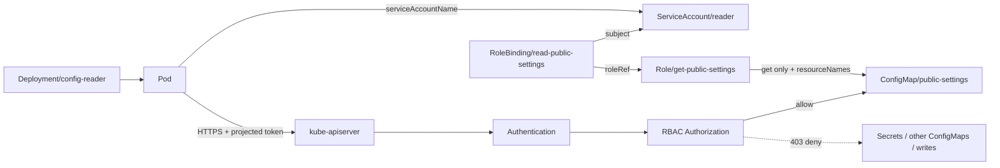

[[Home]]

# Weekly Kubernetes Magazine — ServiceAccountとRBACを「動く最小権限」にする

#kubernetes #k8s #weekly #deep-dive

> **適用・削除の前に必ず確認:** このラボは専用Namespace `rbac-lab`だけを対象にする。以下を実行し、想定クラスタであることを声に出して確認すること。
>
> ```bash
> kubectl config current-context
> kubectl cluster-info
> kubectl get ns rbac-lab 2>/dev/null || true
> ```
>
> 共有・本番クラスタでは、管理者の承認なしに実行しない。サンプルに実トークン、パスワード、証明書、実在Secretの値を入れない。

## 1. Focus・難易度・前提・クラスタ要件・測定可能な到達点

### Focus

APIから特定のConfigMap **1個だけを読む**アプリを題材に、`ServiceAccount`、`Role`、`RoleBinding`を設計する。単に403を消すのではなく、許可表と拒否表を先に定義し、`kubectl auth can-i`、Podログ、APIレスポンスで証明する。さらに過剰なSecret一覧権限を注入し、検出、影響評価、rollbackまで行う。

**難易度シグナル: Intermediate** — 参加資格ではなく、API認証・認可とYAMLを往復する密度の目安。

### 必要な知識・先行概念

- Podは`spec.serviceAccountName`で非人間IDを選ぶ。
- Kubernetes APIは、認証された主体に対して認可判定を行う。
- Namespaceは論理的なスコープであり、単独ではネットワーク隔離でも秘密情報保護でもない。
- RBACの`resource`、API group、`verb`（`get`、`list`、`watch`等）の違い。
- ConfigMapは非機密設定用。Secretの値をこのラボに保存しない。

### 必要なツール

- `kubectl`（クラスタとの差が±1 minor程度を推奨）
- Bash互換シェル
- YAMLを編集できるエディタ
- 任意: `jq`（出力整形用。必須ではない）

### クラスタ要件

- Kubernetes v1.30以降を目安とする検証クラスタ（kind、minikube、Docker Desktop等）
- RBAC authorizerが有効
- `curlimages/curl:8.12.1`をpullできる
- Namespace、ServiceAccount、Role、RoleBinding、Deployment、ConfigMapを作成できる権限
- `--as`によるServiceAccount impersonationを使うチェックには、実行者のimpersonate権限が必要。拒否された場合はPod内API呼び出しを一次証拠にする。

### 測定可能な到達点

終了時に次を証拠付きで示せること。

1. `reader`は`public-settings`を`get`できる。
2. 同じServiceAccountはConfigMapの`list`、Secretの`get/list`、Podの作成・削除をできない。
3. 専用Namespace外では同じ権限を持たない。
4. 過剰権限注入後、Secretの`list`が`no → yes`へ変化する。
5. rollback後に`yes → no`へ戻り、アプリの正規機能は維持される。

## 学習レイヤー

- **Foundation:** 認証主体、RBAC四オブジェクト、reconciliationを理解する。
- **Practical implementation:** resource nameまで限定したRoleを適用し、正負両方を検証する。
- **Production concerns:** 権限ドリフト、Secret露出、token mount、監査、blast radius、コストを扱う。
- **Optional advanced challenge:** SelfSubjectAccessReviewとCIで権限契約を自動検証する。

## 2. 本番シナリオ・SLO・障害仮定

### シナリオ

社内の設定リーダー`config-reader`は、Namespace内の`public-settings`から機能フラグを定期的に読む。設定変更は別のデプロイパイプラインが担当し、アプリは変更・列挙・Secret参照を必要としない。

### SLO / セキュリティ目標

- 正規API読取成功率: 30日で **99.9%以上**
- 設定反映: ConfigMap更新からアプリの次回読取まで **60秒以内**
- 権限境界: `public-settings`への`get`以外は **常時拒否**
- 過剰権限の検出・rollback: **15分以内**
- 実Secret値のログ出力: **0件**

### Failure assumptions

- 人が`resources: ["*"]`や`verbs: ["*"]`をレビューで見逃す。
- Helm/Kustomize更新で`resourceNames`が消える。
- アプリ侵害により、Pod内の投影ServiceAccount tokenが利用される。
- API server、DNS、ネットワークが一時的に失敗する。
- 許可の確認だけ行い、必要な拒否を確認しない。
- RoleBindingのsubject Namespaceを間違える。

重要な仮定は「Podが侵害されても、攻撃者が得るAPI権限はそのServiceAccountと同じ」である。したがってRBACは侵害防止ではなく、侵害後のblast radius縮小でもある。

## 3. Control planeとreconciliationのメンタルモデル

リクエストは概ね次の順序を通る。

1. kubeletがPod用の短命・回転可能なServiceAccount tokenを投影する。
2. アプリがBearer tokenとCA証明書を使いAPI serverへHTTPSリクエストする。
3. **Authentication**がtokenを`system:serviceaccount:rbac-lab:reader`として認証する。
4. **Authorization**がverb、API group、resource、resourceName、namespaceをRBACルールと照合する。
5. 許可された場合だけAPI処理へ進み、拒否なら403を返す。

RBACオブジェクトは手続きの命令ではなく望ましい認可ポリシーである。Role/RoleBindingをAPI serverへ保存すると、それ以降の各リクエストでauthorizerが評価する。Deployment controllerはReplicaSetとPod数を収束させ、ServiceAccount admission処理とkubeletはtoken投影を成立させる。RBAC変更にアプリ再起動は通常不要で、次のAPI呼び出しから判定が変わる。

### 四つのRBACオブジェクト

- `Role`: 1 Namespace内の許可ルール。
- `ClusterRole`: cluster-scopedな定義。ただしRoleBindingから参照すれば、そのNamespace内に限定して利用できる。
- `RoleBinding`: あるNamespaceでRole/ClusterRoleをsubjectへ結び付ける。
- `ClusterRoleBinding`: cluster全体へ結び付ける。blast radiusが大きい。

RBACは基本的に**加算型**で、明示denyはない。危険なBindingを追加した場合、安全なRoleを追加して相殺できない。危険な許可そのものを削除・rollbackする必要がある。

## 4. 設計選択肢とトレードオフ

### A. Role + RoleBinding（本号の採用）

- 長所: Namespace境界が明確で、誤設定の影響を限定しやすい。
- 短所: 多数Namespaceで同一ルールを複製すると管理量が増える。

### B. 共通ClusterRole + NamespaceごとのRoleBinding

- 長所: ルール定義を一元化しつつ、BindingのNamespaceへ権限を限定できる。
- 短所: ClusterRole変更が全利用Namespaceへ波及する。

### C. ClusterRoleBinding

- 長所: 真にcluster-wideなcontrollerには簡潔。
- 短所: アプリ用途では過剰になりやすく、Namespace追加時にも自動で範囲が広がる。本号の要件には不採用。

### `get`と`list/watch`

`get` + `resourceNames`は特定オブジェクトに絞れる。`list/watch`は集合操作であり、Secretに与えると内容を含む一覧を取得できるため「メタデータだけ」ではない。フィールドセレクタ依存の制約も複雑になるので、アプリ要件が単一名取得なら`get`だけにする。

### token自動mount

APIアクセス不要のPodは`automountServiceAccountToken: false`が安全。本号のreaderはAPIへアクセスするためPodレベルで`true`にする。Namespace内の他Podへ同じ設定を流用しない。

## 5. Architecture / object relationship



## 6. Guided lab（約150分）

### 時間配分

- 0–20分: context確認、許可契約の作成
- 20–55分: manifest読解とdry-run
- 55–85分: 適用、Podログ、正負テスト
- 85–120分: failure injectionとincident対応
- 120–140分: rollback、再検証
- 140–150分: cleanupと成果物整理

### Step 0 — 安全確認

```bash
kubectl config current-context
kubectl config view --minify --output 'jsonpath={..namespace}'; echo
kubectl version
```

期待: 想定した検証contextが表示される。namespaceが空ならkubectlの既定は`default`だが、このラボでは常に`-n rbac-lab`を明示する。

### Step 1 — 完全manifestを保存

以下を`rbac-lab.yaml`として保存する。ダミーConfigMapだけを使い、実Secretを作らない。

```yaml
apiVersion: v1
kind: Namespace
metadata:
  name: rbac-lab
  labels:
    purpose: weekly-kubernetes-magazine
---
apiVersion: v1
kind: ConfigMap
metadata:
  name: public-settings
  namespace: rbac-lab
data:
  FEATURE_COLOR: blue
  POLL_SECONDS: "30"
---
apiVersion: v1
kind: ConfigMap
metadata:
  name: unrelated-settings
  namespace: rbac-lab
data:
  NOTE: must-not-be-readable-by-reader
---
apiVersion: v1
kind: ServiceAccount
metadata:
  name: reader
  namespace: rbac-lab
automountServiceAccountToken: false
---
apiVersion: rbac.authorization.k8s.io/v1
kind: Role
metadata:
  name: get-public-settings
  namespace: rbac-lab
rules:
  - apiGroups: [""]
    resources: ["configmaps"]
    resourceNames: ["public-settings"]
    verbs: ["get"]
---
apiVersion: rbac.authorization.k8s.io/v1
kind: RoleBinding
metadata:
  name: read-public-settings
  namespace: rbac-lab
subjects:
  - kind: ServiceAccount
    name: reader
    namespace: rbac-lab
roleRef:
  apiGroup: rbac.authorization.k8s.io
  kind: Role
  name: get-public-settings
---
apiVersion: apps/v1
kind: Deployment
metadata:
  name: config-reader
  namespace: rbac-lab
spec:
  replicas: 1
  selector:
    matchLabels:
      app: config-reader
  template:
    metadata:
      labels:
        app: config-reader
    spec:
      serviceAccountName: reader
      automountServiceAccountToken: true
      securityContext:
        runAsNonRoot: true
        fsGroup: 100
        seccompProfile:
          type: RuntimeDefault
      containers:
        - name: reader
          image: curlimages/curl:8.12.1
          imagePullPolicy: IfNotPresent
          securityContext:
            allowPrivilegeEscalation: false
            capabilities:
              drop: ["ALL"]
            readOnlyRootFilesystem: true
          resources:
            requests:
              cpu: 10m
              memory: 16Mi
            limits:
              cpu: 100m
              memory: 64Mi
          env:
            - name: NAMESPACE
              valueFrom:
                fieldRef:
                  fieldPath: metadata.namespace
          command: ["/bin/sh", "-c"]
          args:
            - |
              set -eu
              API="https://${KUBERNETES_SERVICE_HOST}:${KUBERNETES_SERVICE_PORT_HTTPS}"
              TOKEN_FILE=/var/run/secrets/kubernetes.io/serviceaccount/token
              CA_FILE=/var/run/secrets/kubernetes.io/serviceaccount/ca.crt
              URL="${API}/api/v1/namespaces/${NAMESPACE}/configmaps/public-settings"
              while true; do
                code="$(curl --silent --show-error --output /tmp/body \
                  --write-out '%{http_code}' --cacert "${CA_FILE}" \
                  -H "Authorization: Bearer $(cat "${TOKEN_FILE}")" "${URL}")"
                color="$(sed -n 's/.*"FEATURE_COLOR":"\([^"]*\)".*/\1/p' /tmp/body)"
                echo "http_status=${code} feature_color=${color:-unavailable}"
                sleep 30
              done
          volumeMounts:
            - name: tmp
              mountPath: /tmp
      volumes:
        - name: tmp
          emptyDir:
            sizeLimit: 8Mi
```

#### YAMLの重要点

- core API groupは`apiGroups: [""]`と書く。`core`とは書かない。
- `resourceNames`は取得対象を1個に限定する。
- RoleBindingの`metadata.namespace`が**権限が効く場所**、subjectの`namespace`が**ServiceAccountが存在する場所**。
- `roleRef`は作成後に変更できない。別Roleへ切り替える場合はBindingを再作成するか、別名Bindingを用いる。
- ServiceAccount既定はtoken mount無効、必要なPodだけが明示的に上書きする。
- tokenそのものはログへ出さない。Authorization headerもデバッグ表示しない。
- `emptyDir`はread-only root filesystemでもcurlレスポンスを一時保存するために使う。

### Step 2 — server-side dry-runと差分

```bash
kubectl apply --dry-run=server -f rbac-lab.yaml
kubectl diff -f rbac-lab.yaml || test $? -eq 1
```

期待: dry-runは各オブジェクトに`configured (server dry run)`または`created (server dry run)`相当を表示する。`kubectl diff`の終了コード1は差分ありで、必ずしも失敗ではない。

### Step 3 — 警告後に適用

> **警告:** 次はクラスタ状態を変更する。contextを再確認し、対象が`rbac-lab`だけであることを確認してから実行する。

```bash
kubectl config current-context
kubectl apply -f rbac-lab.yaml
kubectl -n rbac-lab rollout status deployment/config-reader --timeout=120s
kubectl -n rbac-lab get sa,role,rolebinding,deploy,pod,cm
```

Checkpoint: Deploymentが`successfully rolled out`、Podが`1/1 Running`。Roleに1 rule、RoleBindingに1 subjectがある。

### Step 4 — 許可契約を正負両方で検証

```bash
SA=system:serviceaccount:rbac-lab:reader
kubectl auth can-i get configmap/public-settings -n rbac-lab --as="$SA"
kubectl auth can-i get configmap/unrelated-settings -n rbac-lab --as="$SA"
kubectl auth can-i list configmaps -n rbac-lab --as="$SA"
kubectl auth can-i get secrets -n rbac-lab --as="$SA"
kubectl auth can-i list secrets -n rbac-lab --as="$SA"
kubectl auth can-i create pods -n rbac-lab --as="$SA"
kubectl auth can-i get configmap/public-settings -n default --as="$SA"
```

期待出力（順番どおり）:

```text
yes
no
no
no
no
no
no
```

`--as`がForbiddenなら、あなた自身にimpersonate権限がない。これはreaderの判定結果ではないため、勝手にcluster-adminを付けない。次のPodログと、管理者が承認した検証環境でのSubjectAccessReviewを使う。

### Step 5 — 実アプリ経路を検証

```bash
kubectl -n rbac-lab logs deployment/config-reader --tail=5
kubectl -n rbac-lab get pod -l app=config-reader \
  -o jsonpath='{.items[0].spec.serviceAccountName}{"\n"}'
```

期待:

```text
http_status=200 feature_color=blue
reader
```

ConfigMapを変更し、60秒以内に反映することを確認する。

```bash
kubectl -n rbac-lab patch configmap public-settings \
  --type merge -p '{"data":{"FEATURE_COLOR":"green"}}'
kubectl -n rbac-lab logs -f deployment/config-reader --since=2m
```

期待: 最大約30秒後に`http_status=200 feature_color=green`。Ctrl-Cで追尾を終了する。

## 7. kubectlとYAMLを丁寧に読む

### `kubectl auth can-i`

```bash
kubectl auth can-i VERB TYPE/NAME -n NAMESPACE --as=IDENTITY
```

- `VERB`: APIの論理操作。HTTP GETでも、単一取得は`get`、集合取得は`list`になり得る。
- `TYPE/NAME`: `configmap/public-settings`で特定名を問い合わせる。
- `-n`: 認可判定対象のNamespace。省略しない。
- `--as`: 指定主体をimpersonateする。実行者自身にimpersonate権限が必要。

### `resourceNames`の限界

名前限定は強力だが、createやdeletecollectionには適さない。また`list/watch`を名前で絞るにはクライアントが対応するfield selectorを送る必要がある。単一ConfigMap取得要件では`get`だけを選ぶ方が明瞭である。

### `kubectl describe role`

```bash
kubectl -n rbac-lab describe role get-public-settings
kubectl -n rbac-lab describe rolebinding read-public-settings
```

期待する要点:

```text
Resources    Resource Names     Verbs
configmaps   [public-settings]  [get]
```

RoleBindingではRole名と`ServiceAccount/reader`を確認する。名前が同じでもsubject Namespaceが違えば別IDである。

## 8. Failure injection + 証拠駆動incident / rollback

### Incident: 誤ってSecret一覧権限が混入

次を`rbac-overgrant.yaml`として保存する。

```yaml
apiVersion: rbac.authorization.k8s.io/v1
kind: Role
metadata:
  name: get-public-settings
  namespace: rbac-lab
rules:
  - apiGroups: [""]
    resources: ["configmaps"]
    resourceNames: ["public-settings"]
    verbs: ["get"]
  - apiGroups: [""]
    resources: ["secrets"]
    verbs: ["get", "list", "watch"]
```

> **故障注入警告:** これは意図的に危険な許可を加える。`rbac-lab`以外、実SecretがあるNamespace、本番環境では実行しない。ラボではSecretオブジェクトを作らず、値も表示しない。

#### Baseline evidence

```bash
SA=system:serviceaccount:rbac-lab:reader
date -Is
kubectl config current-context
kubectl auth can-i list secrets -n rbac-lab --as="$SA"
kubectl -n rbac-lab get role get-public-settings -o yaml > role-before.yaml
```

期待: `no`。

#### Inject

```bash
kubectl diff -f rbac-overgrant.yaml || test $? -eq 1
kubectl apply -f rbac-overgrant.yaml
```

#### Detect and triage without exposing data

```bash
date -Is
kubectl auth can-i list secrets -n rbac-lab --as="$SA"
kubectl auth can-i --list -n rbac-lab --as="$SA"
kubectl -n rbac-lab get role get-public-settings -o yaml
kubectl -n rbac-lab logs deployment/config-reader --tail=3
```

期待: `list secrets`が`yes`になる。`kubectl get secrets -o yaml`は実行しない。SLO違反は認可判定だけで十分証明できる。正規機能のログは200のままで、機能監視だけでは権限事故を検出できない点が重要である。

#### Incident判断

- 影響主体: `system:serviceaccount:rbac-lab:reader`
- 影響範囲: `rbac-lab`内の全Secretのget/list/watch
- 機密性リスク: list応答にもSecret内容が含まれるため高い
- 証拠保全: 時刻、context、Role YAML、`can-i`結果、変更履歴を保存。Secret値は保存しない
- 暫定策: 最小Roleへ即時rollback。アプリ停止は、token悪用の兆候や組織手順に応じて判断

### Rollback

元の`rbac-lab.yaml`を宣言的な正として再適用する。

```bash
kubectl diff -f rbac-lab.yaml || test $? -eq 1
kubectl apply -f rbac-lab.yaml
kubectl auth can-i list secrets -n rbac-lab --as="$SA"
kubectl auth can-i get configmap/public-settings -n rbac-lab --as="$SA"
kubectl -n rbac-lab logs deployment/config-reader --tail=3
```

期待:

```text
no
yes
http_status=200 feature_color=green
```

最後の色が`green`なのは、Step 5のConfigMap更新はrollback対象のRBACとは別の状態だからである。rollback対象を明示し、無関係な変更を巻き戻さない。

### 証拠ベースの終了条件

- 禁止権限が`no`
- 必須権限が`yes`
- アプリがHTTP 200を維持
- Role YAMLからSecret ruleが消えた
- incidentの開始・検出・復旧時刻が記録された

## 9. Security・RBAC・Namespace/context・resource・cost

### Security / RBAC

- wildcardのresource/verbを避ける。将来追加されるAPIにも権限が及び得る。
- `cluster-admin`や`system:masters`を日常作業に使わない。
- Secretの`list/watch`は読取権限と同等に慎重に扱う。
- Pod作成権限は、そのNamespaceのSecretや強いServiceAccountをmountできる間接的昇格経路になり得る。
- `bind`、`escalate`、impersonate、CSR approval、`nodes/proxy`は高リスク権限として別レビューする。
- staticな長期ServiceAccount token Secretを作らない。Pod投影tokenを利用する。
- API不要Podでは`automountServiceAccountToken: false`を既定にする。
- RBACはネットワーク制御ではない。NetworkPolicy、Pod Security Admission、監査ログ等と組み合わせる。

### Namespace / context

- すべての変更コマンドで`-n rbac-lab`またはmanifestのnamespaceを確認する。
- 同名ServiceAccountでもNamespaceが違えば別主体。
- production contextには見分けやすい名前、read-only既定ユーザー、承認フローを用意する。
- `kubectl config set-context --current --namespace=...`は利用者のkubeconfigを変更するため、このラボでは必須にしない。

### Resource / reliability

- requests/limitsにより暴走時のCPU/メモリを制限する。
- 30秒pollは学習用。本番ではwatchの効率と権限面、キャッシュ、backoff、jitterを比較する。
- API server障害時にtight loopを作らず指数backoffを使う。
- 403は再試行で直らない。認可設定不整合として明確にアラートする。

### Cost

- このラボは1 Pod、10m CPU / 16Mi memory requestで小さい。
- 大規模環境の短周期pollはAPI server負荷、監査ログ量、ログ保管費を増やす。
- Roleの数自体より、Binding管理、レビュー、棚卸し、監査ログ保管が運用コストになる。
- 共有ClusterRoleはYAML重複を減らすが、変更blast radiusを増やす。総所有コストで判断する。

## 10. Apply / delete安全規約

変更前チェックをテンプレート化する。

```bash
kubectl config current-context
kubectl auth whoami 2>/dev/null || true
kubectl get namespace rbac-lab
kubectl diff -f rbac-lab.yaml || test $? -eq 1
```

削除前は対象を列挙する。

```bash
kubectl -n rbac-lab get all,cm,sa,role,rolebinding
```

次の禁止事項を守る。

- 実tokenを`echo`、ログ、ノート、Gitへ出さない。
- 実Secretを`-o yaml`で収集しない。
- context不明のままapply/deleteしない。
- `kubectl delete namespace`の対象を変数やglobだけで組み立てない。
- 権限検証のためだけに自分へcluster-adminを付けない。

## 11. Verification checklistと成果物

### Checklist

- [ ] 最新12号と主題が重複していない
- [ ] contextとNamespaceを確認した
- [ ] server-side dry-runとdiffを確認した
- [ ] Podが`reader` ServiceAccountを使っている
- [ ] `public-settings get = yes`
- [ ] `unrelated-settings get = no`
- [ ] `configmaps list = no`
- [ ] `secrets get/list = no`
- [ ] `pods create = no`
- [ ] `default` Namespaceの同名ConfigMap取得 = no
- [ ] PodログがHTTP 200を示す
- [ ] failure injectionでSecret listがyesへ変化した
- [ ] rollbackでnoへ戻った
- [ ] rollback後も正規機能が動く
- [ ] tokenやSecret値を出力・保存していない
- [ ] cleanup対象を列挙してから削除した

### Concrete deliverables

1. `rbac-lab.yaml`
2. `rbac-overgrant.yaml`
3. 許可契約表（必須1件、拒否6件以上）
4. injection前後・rollback後の`can-i`結果
5. PodのHTTP 200ログ（tokenやSecret値を含まない）
6. incident timelineとblast radius評価
7. 本番導入時のRole/Bindingレビュー観点

### Cleanup

> **削除警告:** Namespace削除は配下の全リソースを削除する。表示された対象がこのラボだけであることを確認する。

```bash
kubectl config current-context
kubectl -n rbac-lab get all,cm,sa,role,rolebinding
kubectl delete namespace rbac-lab
kubectl get namespace rbac-lab
```

期待: 最後はNotFoundになる。ローカルの`rbac-lab.yaml`、`rbac-overgrant.yaml`、証拠ファイルは学習成果物として残すか、機密情報がないことを確認して管理する。

## 12. Assessment

### Q1. RoleBindingのsubjectが`reader`でも、subject.namespaceが`default`なら何が起きるか？

<details>
<summary>解答</summary>

`default` Namespaceの`reader`という別ServiceAccountへ権限が付く。`rbac-lab:reader`には付かない。RoleBinding自身のNamespaceは権限が作用するresource範囲、subject.namespaceは主体の所属を表す。

</details>

### Q2. Secretに`list`だけを許可しても値は安全か？

<details>
<summary>解答</summary>

安全ではない。List応答には各Secretオブジェクトのdataが含まれるため、実質的に内容を読める。`watch`も同様に慎重に扱う。

</details>

### Q3. なぜ安全なRoleを追加して危険なRoleを「deny」で打ち消せないのか？

<details>
<summary>解答</summary>

Kubernetes RBACは許可を加算する方式で、一般的な明示denyルールを持たない。いずれかのBindingが許可すれば許可されるため、危険なruleまたはBindingを除去する必要がある。

</details>

### Q4. アプリがHTTP 200ならRBACは正常だと言えるか？

<details>
<summary>解答</summary>

必要権限があることしか示さない。不要なSecret listやPod createが許可されていても正規機能は成功する。正の機能テストと負の認可テストの両方が必要。

</details>

### Q5. APIを使わないPodのServiceAccount tokenはどうするか？

<details>
<summary>解答</summary>

PodまたはServiceAccountで`automountServiceAccountToken: false`を設定する。Pod側の設定がServiceAccount側を上書きする。必要性がない資格情報は配布しない。

</details>

### Interview / design question

100 Namespaceに同じ「特定ConfigMap読取」権限を配布する。各Namespaceで対象名が同じ場合、Role複製、共通ClusterRole + RoleBinding、operator/policy生成のどれを選ぶか。更新blast radius、監査性、例外管理、GitOps所有権、誤Bindingの検出方法を含めて設計せよ。

### Follow-up challenge（Optional Advanced）

1. `authorization.k8s.io/v1`のSelfSubjectAccessReviewをPodから作り、起動時に必須権限を自己診断する。
2. CIで`kubectl auth can-i --as=...`相当の許可契約を検証し、禁止権限がyesなら失敗させる。
3. 監査ログで`user.username=system:serviceaccount:rbac-lab:reader`かつSecretアクセスを検知するルールを設計する。
4. `get`対象を2個へ増やしたとき、resourceNames列挙とAPI設計変更を比較する。

## 13. 現行公式 Kubernetes 参考資料

- [Using RBAC Authorization](https://kubernetes.io/docs/reference/access-authn-authz/rbac/) — Role、ClusterRole、Binding、resourceNames、権限昇格防止。
- [Role Based Access Control Good Practices](https://kubernetes.io/docs/concepts/security/rbac-good-practices/) — 最小権限、Namespace限定、wildcard回避、token mount、Secretやworkload作成のリスク。
- [Service Accounts](https://kubernetes.io/docs/concepts/security/service-accounts/) — namespaced identity、投影token、`automountServiceAccountToken`。
- [Configure Service Accounts for Pods](https://kubernetes.io/docs/tasks/configure-pod-container/configure-service-account/) — PodへのServiceAccount割当とtoken mount制御。
- [Authorization](https://kubernetes.io/docs/reference/access-authn-authz/authorization/) — 認可フロー、SubjectAccessReview、workload作成による昇格経路。
- [kubectl auth can-i](https://kubernetes.io/docs/reference/kubectl/generated/kubectl_auth/kubectl_auth_can-i/) — verb/resource判定、`--as`、`--list`、subresource。
- [ServiceAccount API reference](https://kubernetes.io/docs/reference/kubernetes-api/core/service-account-v1/) — フィールド仕様。

> 参照確認日: 2026-08-20。Kubernetesは更新されるため、実施時点のクラスタversionと公式ページを再確認する。

## まとめ

最小権限は「アプリが動いた」では完成しない。必要な1操作を許可し、不要な操作を列挙して拒否を証明し、変更後も契約が保たれるよう自動化して初めて運用品質になる。本号の中心成果はRole YAMLそのものではなく、**許可と拒否を測定可能にした権限契約**である。
