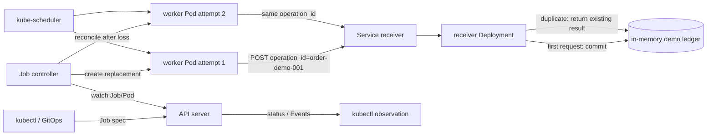

[[Home]]

# Weekly Kubernetes Magazine — Jobを「再試行されても安全」にする

#kubernetes #k8s #weekly #deep-dive

> [!warning] apply / delete前の安全確認
> この演習はJob Podの意図的削除、Namespaceの作成・削除を含む。**共有・本番クラスタでは実行しない**。各変更の直前に次を実行し、contextとNamespaceを確認する。
>
> ```bash
> kubectl config current-context
> kubectl config view --minify --output 'jsonpath={..namespace}{"\n"}'
> kubectl get ns job-idempotency-lab 2>/dev/null || true
> ```
>
> 対象は `job-idempotency-lab` のみ。実在の顧客ID、注文ID、トークン、パスワード、証明書、クラウド認証情報、Secret値をYAML・ログ・コマンド履歴へ貼らない。ここでは架空のIDだけを使う。

## 1. Focus・難易度・前提・クラスタ要件・到達点

### 今週の単一評価基準

**JobのPodが副作用の直後に失われ、Job controllerが代替Podを作っても、業務上の確定件数が1件のままであること。**

Jobは「Podを一度だけ起動する仕組み」ではない。公式文書は、`parallelism: 1`、`completions: 1`、`restartPolicy: Never`でも同じプログラムが2回開始される場合があると明記している。したがって、正しさをPod起動回数ではなく、**同じ冪等性キーに対する確定済み副作用数**で測る。

- 難易度シグナル: **Intermediate**（参加資格ではなく、controller状態とアプリ整合性を同時に追う密度の目安）
- 所要時間: Foundation 25分 → Practical implementation 70分 → Production concerns / incident 35分 → Optional challenge 20分
- ローテーション領域: workloads/controllers、application troubleshooting、incident drill

### 必要な知識・ツール・先行概念

- 既習概念: Pod template、label selector、Service DNS、ConfigMap、終了コード0/非0、宣言的reconciliation
- 必須ツール: `kubectl`、Bash互換シェル、YAMLエディタ
- 任意ツール: `jq`、`kind`または`minikube`
- イメージ取得: `python:3.13-alpine` と `curlimages/curl:8.12.1` をpullできること
- 先に理解する語: **at-least-once**（少なくとも1回）、**idempotency key**（同一操作を識別する一意キー）、**commit point**（副作用が確定した瞬間）

### クラスタ要件

- 現在サポート中のKubernetes。`batch/v1` Jobが利用可能
- 専用の検証クラスタを推奨。1 worker、CPU 500m・メモリ512Mi程度の空きでよい
- `job-idempotency-lab`にNamespace、ConfigMap、Deployment、Service、Jobを作成・削除できる権限
- この基礎ラボにはPV、Ingress、クラウドLB、Secret、cluster-scoped権限は不要

事前確認:

```bash
kubectl version
kubectl api-resources | grep -E '^jobs[[:space:]]'
kubectl auth can-i create jobs.batch --namespace job-idempotency-lab
kubectl auth can-i delete pods --namespace job-idempotency-lab
```

### 測定可能な到達点

1. Job → Podのowner relationshipとJob controllerのreconciliationを説明できる。
2. `completions`、`parallelism`、`backoffLimit`、`activeDeadlineSeconds`、`restartPolicy`の責務を区別できる。
3. 副作用後にPodを削除し、2つのPod実行履歴があっても `unique_commits=1`、`duplicate_attempts>=1` を証拠として示せる。
4. Jobの完了条件、Podログ、receiverの状態、Eventを突き合わせてincident判断できる。
5. 無制限retryではなく、再試行予算・時間上限・冪等性キー保持期間を設計できる。

## 2. Production scenario・SLO・障害仮定

ECサイトは決済確定後に「請求台帳へ1件登録する」非同期Jobを起動する。二重請求は可用性低下より重大である。一方、一時的なNode障害で処理が消えることも許されない。

### 仮想SLO / correctness SLI

- 受理済み操作の99.9%を5分以内にJob `Complete`へする
- 同一 `operation_id` の業務確定件数: **常に1件以下**
- 一時障害時のretry回数: 最大3回、総実行時間: 最大120秒
- 失敗Jobは15分以内に検知し、原因・operation ID・最終終了コードを記録する

### 失敗仮定

- commit直後、成功応答を受け取る前にworker Podが削除・evict・Node喪失する
- HTTP 5xx、timeout、DNS一時障害、image pull失敗が起こる
- controller-managerまたはAPI serverが一時的に利用不能になる
- Job作成者が同じ操作を再投入する
- ログ収集が遅延し、終了PodがTTL cleanupされる

重要なのは、Kubernetesは外部DBトランザクションを認識しないことだ。Job statusが未完了なら代替Podを作る。その再試行を業務的に安全にする責務は、receiverとworkerのプロトコルにある。

## 3. Control-planeとreconciliationのメンタルモデル

1. 利用者がJobのdesired stateをAPI serverへ保存する。
2. Job controllerがJobをwatchし、必要なPod数と成功数の差を計算してPodを作る。
3. schedulerがNodeを選び、kubeletがコンテナを実行する。
4. workerはreceiverへ `operation_id` を送る。receiverは未処理ならcommitし、処理済みなら副作用を増やさず既存結果を返す。
5. Podが成功終了するとJob controllerはstatusを更新する。Podが途中で消えた場合、Jobが未完了なら代替Podを作り得る。

`restartPolicy`はPod内のcontainer再起動方針、`backoffLimit`はJob失敗を数える予算である。`activeDeadlineSeconds`はJob全体の経過時間上限で、到達時は`backoffLimit`より優先してJobを失敗させる。いずれも外部副作用の重複防止機能ではない。

## 4. 設計選択肢とtrade-off

| 選択肢 | 長所 | 限界 / 採用判断 |
|---|---|---|
| retryしない (`backoffLimit: 0`) | 重複機会を減らし、障害を早く露出 | 一時障害で処理を失う。exactly-onceにはならない |
| receiver側idempotency key + unique制約 | retry、二重投入、timeoutに強い | key保持期間、payload不一致、DB競合の設計が必要。本号の推奨 |
| worker側だけで「処理済み」記録 | 実装が簡単に見える | commitと記録の間にcrash windowがある。原子的でなければ不十分 |
| queueのackをcommit後に行う | at-least-once配送と相性がよい | ack喪失で再配送されるためreceiverの冪等性は依然必要 |
| 分散lock | 同時実行を抑制 | lease切れ・停止中所有者・fencingの問題。重複副作用の最終防壁にはしない |

本番では `operation_id` をDBの一意キーにし、**同一キー・同一payloadは既存結果を返す／同一キー・異なるpayloadは409等で拒否**する。データベースのtransaction内でkey予約と副作用を一緒に確定する。

## 5. Architecture / object relationship



> [!note]
> デモledgerはreceiver Podのメモリであり、永続性はない。これは重複制御を観察する教材で、DBの代替ではない。receiverを再起動するfailureはOptional challengeで限界として確認する。

## 6. Guided lab（約150分）

### Phase A — Foundation / 安全確認（25分）

```bash
kubectl config current-context
kubectl cluster-info
kubectl create namespace job-idempotency-lab --dry-run=client -o yaml
```

上のdry-run出力が `name: job-idempotency-lab` であることを確認する。

> [!warning] apply前
> contextが専用検証クラスタであることを確認してから実行する。

```bash
kubectl apply -f lab.yaml
```

次の**完全なmanifest**を `lab.yaml` として保存する。

```yaml
apiVersion: v1
kind: Namespace
metadata:
  name: job-idempotency-lab
---
apiVersion: v1
kind: ConfigMap
metadata:
  name: receiver-code
  namespace: job-idempotency-lab
data:
  server.py: |
    import json
    from http.server import BaseHTTPRequestHandler, HTTPServer

    committed = {}
    duplicate_attempts = 0

    class Handler(BaseHTTPRequestHandler):
      def reply(self, code, body):
        raw = json.dumps(body).encode()
        self.send_response(code)
        self.send_header("Content-Type", "application/json")
        self.send_header("Content-Length", str(len(raw)))
        self.end_headers()
        self.wfile.write(raw)

      def do_GET(self):
        if self.path != "/state":
          return self.reply(404, {"error": "not found"})
        self.reply(200, {
          "unique_commits": len(committed),
          "duplicate_attempts": duplicate_attempts,
          "keys": sorted(committed.keys())
        })

      def do_POST(self):
        global duplicate_attempts
        if self.path != "/commit":
          return self.reply(404, {"error": "not found"})
        length = int(self.headers.get("Content-Length", "0"))
        body = json.loads(self.rfile.read(length) or b"{}")
        key = body.get("operation_id")
        if not key:
          return self.reply(400, {"error": "operation_id required"})
        if key in committed:
          duplicate_attempts += 1
          print(f"DUPLICATE key={key}", flush=True)
          return self.reply(200, {"result": "already_committed", "operation_id": key})
        committed[key] = body
        print(f"COMMIT key={key}", flush=True)
        self.reply(201, {"result": "committed", "operation_id": key})

      def log_message(self, format, *args):
        return

    HTTPServer(("0.0.0.0", 8080), Handler).serve_forever()
---
apiVersion: apps/v1
kind: Deployment
metadata:
  name: receiver
  namespace: job-idempotency-lab
spec:
  replicas: 1
  selector:
    matchLabels:
      app: receiver
  template:
    metadata:
      labels:
        app: receiver
    spec:
      automountServiceAccountToken: false
      securityContext:
        runAsNonRoot: true
        runAsUser: 10001
        seccompProfile:
          type: RuntimeDefault
      containers:
        - name: receiver
          image: python:3.13-alpine
          command: ["python", "/app/server.py"]
          ports:
            - name: http
              containerPort: 8080
          readinessProbe:
            httpGet:
              path: /state
              port: http
          resources:
            requests: {cpu: 20m, memory: 32Mi}
            limits: {cpu: 200m, memory: 128Mi}
          securityContext:
            allowPrivilegeEscalation: false
            capabilities:
              drop: ["ALL"]
          volumeMounts:
            - name: code
              mountPath: /app
              readOnly: true
      volumes:
        - name: code
          configMap:
            name: receiver-code
---
apiVersion: v1
kind: Service
metadata:
  name: receiver
  namespace: job-idempotency-lab
spec:
  selector:
    app: receiver
  ports:
    - name: http
      port: 8080
      targetPort: http
---
apiVersion: batch/v1
kind: Job
metadata:
  name: commit-order-demo-001
  namespace: job-idempotency-lab
spec:
  completions: 1
  parallelism: 1
  backoffLimit: 3
  activeDeadlineSeconds: 120
  ttlSecondsAfterFinished: 900
  template:
    metadata:
      labels:
        app: commit-worker
    spec:
      restartPolicy: Never
      automountServiceAccountToken: false
      securityContext:
        runAsNonRoot: true
        runAsUser: 10001
        seccompProfile:
          type: RuntimeDefault
      containers:
        - name: worker
          image: curlimages/curl:8.12.1
          command: ["sh", "-ceu"]
          args:
            - |
              echo "attempt pod=${HOSTNAME} key=${OPERATION_ID}"
              curl --fail-with-body --show-error \
                --connect-timeout 3 --max-time 10 \
                -H 'Content-Type: application/json' \
                --data "{\"operation_id\":\"${OPERATION_ID}\",\"amount\":100}" \
                http://receiver:8080/commit
              echo "commit acknowledged; keeping pod alive for injected loss"
              sleep 45
              echo "worker complete"
          env:
            - name: OPERATION_ID
              value: order-demo-001
          resources:
            requests: {cpu: 10m, memory: 16Mi}
            limits: {cpu: 100m, memory: 64Mi}
          securityContext:
            allowPrivilegeEscalation: false
            capabilities:
              drop: ["ALL"]
```

### Phase B — baseline観測（20分）

```bash
kubectl -n job-idempotency-lab rollout status deployment/receiver --timeout=120s
kubectl -n job-idempotency-lab get job,pod,svc -o wide
kubectl -n job-idempotency-lab get pods -l job-name=commit-order-demo-001 \
  -o custom-columns='NAME:.metadata.name,OWNER:.metadata.ownerReferences[0].kind,PHASE:.status.phase,NODE:.spec.nodeName'
```

checkpoint:

- JobがPodをownerとして管理している。
- workerログに `commit acknowledged` がある。
- receiverログに `COMMIT key=order-demo-001` が1回ある。

```bash
kubectl -n job-idempotency-lab logs job/commit-order-demo-001
kubectl -n job-idempotency-lab logs deployment/receiver
kubectl -n job-idempotency-lab run state-check --rm -i --restart=Never \
  --image=curlimages/curl:8.12.1 -- \
  curl -sS http://receiver:8080/state
```

failure injection前の期待例:

```json
{"unique_commits": 1, "duplicate_attempts": 0, "keys": ["order-demo-001"]}
```

### Phase C — failure injectionと再調整（35分）

`sleep 45`中にworker Podを特定する。

```bash
kubectl -n job-idempotency-lab get pods -l job-name=commit-order-demo-001
kubectl -n job-idempotency-lab logs -l job-name=commit-order-demo-001 --prefix=true
```

> [!danger] Pod削除前
> `kubectl config current-context`を再確認し、削除対象が `job-idempotency-lab` かつlabel `job-name=commit-order-demo-001` のworker Podだけであることを表示して確認する。receiverは削除しない。

```bash
kubectl config current-context
kubectl -n job-idempotency-lab delete pod \
  -l job-name=commit-order-demo-001 --wait=true
```

Job controllerは未完了を観測し、代替Podを作る。追跡する。

```bash
kubectl -n job-idempotency-lab get pods -l job-name=commit-order-demo-001 -w
```

新Podが作成されたら別端末で:

```bash
kubectl -n job-idempotency-lab wait \
  --for=condition=complete job/commit-order-demo-001 --timeout=150s
kubectl -n job-idempotency-lab get job commit-order-demo-001 -o wide
kubectl -n job-idempotency-lab get pods -l job-name=commit-order-demo-001
kubectl -n job-idempotency-lab logs -l job-name=commit-order-demo-001 --prefix=true
kubectl -n job-idempotency-lab logs deployment/receiver
kubectl -n job-idempotency-lab get events --sort-by=.metadata.creationTimestamp | tail -20
```

状態をAPI経由で再検証する。

```bash
kubectl -n job-idempotency-lab run final-state --rm -i --restart=Never \
  --image=curlimages/curl:8.12.1 -- \
  curl -sS http://receiver:8080/state
```

期待する最終証拠:

```json
{"unique_commits": 1, "duplicate_attempts": 1, "keys": ["order-demo-001"]}
```

環境や削除タイミングにより`duplicate_attempts`は1以上になり得る。合格条件は、Pod試行が複数でも `unique_commits` が1であり、Job conditionが`Complete=True`であること。

### Phase D — YAMLとkubectlを読む（20分）

- `completions: 1`: 成功Podが1つ必要。プログラム開始回数を1に制限する意味ではない。
- `parallelism: 1`: 同時実行の目標上限。障害・終了中のPodとreplacementが時間的に重なる可能性まで排除しない。
- `restartPolicy: Never`: containerを同じPod内で再起動せず、失敗Podを証拠として残しやすい。`podFailurePolicy`を使う場合も必要。
- `backoffLimit: 3`: 失敗retry予算。標準の失敗Podは指数backoffで再作成される。業務重複の防止ではない。
- `activeDeadlineSeconds: 120`: retryを含むJob全体の時間上限。Pod template内の同名fieldではなくJob `spec`直下に置く。
- `ttlSecondsAfterFinished: 900`:完了・失敗後15分でJobと従属Podをcleanupする。証拠保全時間とのtrade-offがある。
- `automountServiceAccountToken: false`: Kubernetes APIを使わないPodへtokenを渡さない。
- `kubectl wait`: conditionを待つ。Pod名を固定してpollせず、controllerが作り直す前提でJob conditionを見る。
- `logs -l ... --prefix`: 複数試行のログをPod名付きで集める。ただし集中ログ基盤の代替ではない。

## 7. Evidence-driven incident / rollback exercise

### Incident card

アラート: 「Jobが2 Podを作った。二重請求の疑い」。直ちにJobを消すのではなく、次の順で証拠を集める。

```bash
kubectl -n job-idempotency-lab get job commit-order-demo-001 -o yaml
kubectl -n job-idempotency-lab get pods -l job-name=commit-order-demo-001 -o wide
kubectl -n job-idempotency-lab logs -l job-name=commit-order-demo-001 --prefix=true
kubectl -n job-idempotency-lab logs deployment/receiver
kubectl -n job-idempotency-lab get events --sort-by=.metadata.creationTimestamp
```

判断表:

- Podが2つ: **attemptが2回**という証拠であり、二重commitの証明ではない。
- receiverに`COMMIT` 1回 + `DUPLICATE` 1回: 冪等制御が作動。
- `unique_commits > 1`: correctness SLO違反。下流処理を止め、台帳を照合し、補償transaction手順へ。
- Job `Failed` + `DeadlineExceeded`: 外部依存、DNS、timeout、receiver容量を調べる。盲目的にdeadlineを延ばさない。

### 安全なrollback / replay

JobのPod templateは多くのfieldがimmutableである。失敗Jobを場当たり的に編集せず、manifestを修正して**新しいJob名・同じoperation ID**で再投入する。receiverのidempotencyにより既存commitは増えない。

```bash
kubectl -n job-idempotency-lab create job \
  --from=job/commit-order-demo-001 commit-order-demo-001-replay \
  --dry-run=client -o yaml > /tmp/replay-preview.yaml
sed -n '1,80p' /tmp/replay-preview.yaml
```

このpreviewには不要なcontroller生成fieldが含まれ得るため、そのままapplyしない。Git管理したJob templateまたはCronJobから新しい一意名を生成し、`operation_id`は元の業務操作と同じ値にする。rollbackは「古いPodへ戻す」ではなく、原因を修正し、同じ業務キーで安全にreplayして最終状態を検証すること。

## 8. Production concerns

### Security / RBAC / Namespace / context

- workerとreceiverはAPIを使わないのでServiceAccount tokenをmountしない。
- Pod Security StandardsのRestricted相当を意識し、non-root、seccomp、capability drop、no privilege escalationを指定した。
- 本番receiverはTLS、認証、NetworkPolicy、入力schema検証、rate limitを備える。idempotency keyを認証境界の代わりにしない。
- Namespaceは名前のスコープであり、単独でnetwork/security隔離にはならない。
- Job運用者のRBACは対象NamespaceのJobs/Pods/log程度に限定し、Secretsのlist/watchを与えない。
- `kubectl config current-context`と明示的`-n`をすべての変更で使う。`default` Namespaceへ暗黙適用しない。

### Resource / cost / observability

- requestsはschedulerの配置判断、limitsは過剰利用の上限に使われる。実測のp95使用量から調整する。
- retry stormはAPI server、scheduler、registry、下流DB、ログ費用を同時に増やす。小さな`backoffLimit`、deadline、下流側backpressureを組み合わせる。
- `ttlSecondsAfterFinished`はAPI objectとPodを減らすがログ調査時間を短くする。集中ログ、Job condition metrics、operation IDのtrace相関を先に整える。
- 監視候補: Job失敗数、完了latency、active Job滞留、retry/duplicate率、receiver 409/5xx、idempotency table容量。
- idempotency recordのTTLは「Job retry最大期間 + queue再配送期間 + 手動replay期間」より長くする。短すぎるTTLは古いretryを新規処理に戻す。

### Cleanup

まず対象を確認する。

```bash
kubectl config current-context
kubectl -n job-idempotency-lab get all
kubectl get namespace job-idempotency-lab
```

> [!danger] delete前
> Namespace削除は配下の全リソースを削除する。名前が完全に `job-idempotency-lab` で、残す証拠がないことを確認する。

```bash
kubectl delete namespace job-idempotency-lab
kubectl get namespace job-idempotency-lab 2>&1 || true
```

期待値は最終的に`NotFound`。`/tmp/replay-preview.yaml`にはSecretはないが、不要ならローカルの通常手順で削除する。

## 9. Optional advanced challenge（20分）

1. receiver Deploymentを再起動してin-memory ledgerを失わせ、同じJobを再実行する。`unique_commits`が再び1から始まることを確認し、**アプリ冪等性には永続・高可用な一意制約が必要**と説明する。
2. PostgreSQL等の検証DBで `operation_id PRIMARY KEY` と結果payloadを持つtableを作り、`INSERT ... ON CONFLICT`をtransaction内で使う。実パスワードはmanifestへ直書きせず、ラボ専用の架空資格情報をSecret経由で使う。
3. exit code 42を非retryableとして即時失敗させる`podFailurePolicy`を追加する。Kubernetes v1.31以降ではstable。rule順序と`restartPolicy: Never`要件を検証する。
4. Indexed Jobへ拡張し、`JOB_COMPLETION_INDEX`をkeyの一部にする。v1.33以降stableの`backoffLimitPerIndex`で失敗をindexごとに隔離する。

## 10. Verification checklist / concrete deliverables

- [ ] current contextとNamespaceをapply/delete前に確認した
- [ ] Job、Pod、Service、receiverの関係をdiagramで説明できる
- [ ] failure injection前後のJob YAML、Pod一覧、Eventsを保存した
- [ ] 複数worker attemptのprefix付きログを保存した
- [ ] receiverの`COMMIT`と`DUPLICATE`ログを保存した
- [ ] 最終JSONが`unique_commits: 1`である
- [ ] Job conditionが`Complete=True`である
- [ ] retry予算、deadline、key TTL、alert条件を1ページの運用メモにした
- [ ] 実在Secretを使用・露出していない
- [ ] cleanup後にNamespaceが`NotFound`である

成果物は、`lab.yaml`、failure前後のコマンド出力、incident判断メモ、production設計差分（永続DB、認証、NetworkPolicy、監視）の4点。

## 11. Assessment

### Q1. `completions: 1`ならworkerは必ず一度だけ起動するか？

<details><summary>答え</summary>

しない。成功完了数の目標が1という意味で、Pod喪失やcontroller判断により同じプログラムが複数回開始され得る。副作用側で冪等性を保証する。

</details>

### Q2. `restartPolicy: Never`と`backoffLimit`の違いは？

<details><summary>答え</summary>

前者はPod内でcontainerを再起動しない方針。後者はJob controllerが失敗を許容するretry予算。どちらも外部副作用の重複防止ではない。

</details>

### Q3. `activeDeadlineSeconds`と`backoffLimit`の両方に到達しそうな場合は？

<details><summary>答え</summary>

Jobの`activeDeadlineSeconds`が優先される。期限到達後は追加Podを作らず、Jobは`DeadlineExceeded`でFailedになる。

</details>

### Q4. worker Podが2個あるだけで二重請求と断定できないのはなぜ？

<details><summary>答え</summary>

Pod数は試行回数であり、業務commit回数ではない。receiver/DBの一意制約、operation ID、台帳、ログを照合してcommit数を判断する。

</details>

### Q5. idempotency recordを短時間で削除する危険は？

<details><summary>答え</summary>

遅延retryや手動replayが到着したとき、既処理keyを新規として再commitする。保持期間は最大再配送・replay期間と監査要件から決める。

</details>

### Interview / design question

「1万件の請求をparallel Jobで処理し、Node障害とAPI timeoutがあっても二重請求を防ぐ設計を説明してください。」

良い回答は、Job設定だけでexactly-onceを主張せず、partition key、DB unique constraint、transaction境界、payload mismatch、retry分類、deadline、backpressure、監視、replay、補償処理まで扱う。

### Follow-up challenge

同じ`operation_id`で`amount`だけ異なるrequestを送る。現在のdemo serverは既存結果として200を返してしまう。本番仕様としてpayload hashを保存し、異なるpayloadなら409を返すよう変更し、テストを追加せよ。

## 12. 公式Kubernetesリファレンス（2026-08-27確認）

- [Jobs](https://kubernetes.io/docs/concepts/workloads/controllers/job/) — Job controller、複数回開始の可能性、backoff、deadline、Pod failure policy、TTL
- [Job API reference (`batch/v1`)](https://kubernetes.io/docs/reference/kubernetes-api/workload-resources/job-v1/) — fieldの正式なschemaと意味
- [Handling retriable and non-retriable pod failures](https://kubernetes.io/docs/tasks/job/pod-failure-policy/) — exit codeやPod conditionに基づく失敗分類
- [Automatic Cleanup for Finished Jobs](https://kubernetes.io/docs/concepts/workloads/controllers/ttlafterfinished/) — TTL controller
- [CronJob](https://kubernetes.io/docs/concepts/workloads/controllers/cron-jobs/) — schedule重複・欠落可能性とidempotent Jobの要請
- [Pod Security Standards](https://kubernetes.io/docs/concepts/security/pod-security-standards/) — Restricted profileの基準
- [Resource Management for Pods and Containers](https://kubernetes.io/docs/concepts/configuration/manage-resources-containers/) — requests / limits

仕様はクラスタversionで差がある。実環境の`kubectl version`、API discovery、該当versionの公式文書を照合してからadvanced fieldを使う。
