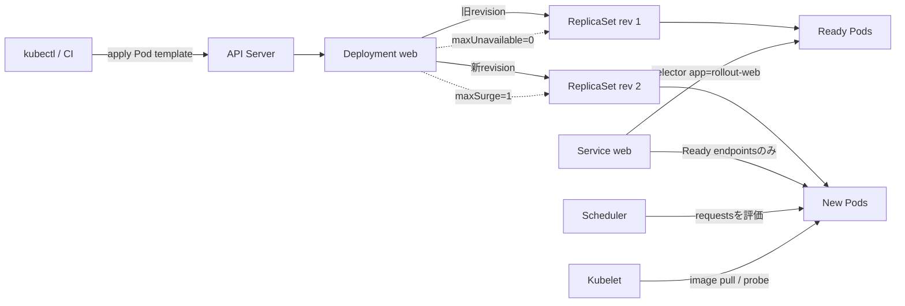

# Weekly Kubernetes Magazine — Deployment更新を「止めず、見逃さず、戻せる」にする

#kubernetes #k8s #weekly #deep-dive

[[Home]]

## 1. Focus・難易度・前提・クラスタ要件・測定可能な到達点

### 今週の一点集中

**Deploymentのローリング更新で、`maxUnavailable` / `maxSurge` / `minReadySeconds` / `progressDeadlineSeconds` を可用性予算として設計し、失敗を観測して安全にロールバックする。**

難易度シグナル: **Intermediate**（参加条件ではなく、説明密度の目安）

### 必要な知識

- Pod templateを変更すると新しいDeployment revisionとReplicaSetが作られること
- readinessは「トラフィックを受けてよいか」、livenessは「再起動すべきか」を表すこと
- Serviceはselectorに合致し、ReadyなPodへ通信を送ること
- CPU/メモリrequestはスケジューリング判断に使われること

### 必要なツールと環境

- Kubernetesクラスタ（推奨: v1.30以降、1ノードでも実習可能）
- `kubectl`（クラスタとの差が±1 minor以内を推奨）
- コンテナイメージを取得できる環境
- Namespaceを作成・削除でき、Deployment/Service/ConfigMap/Podを操作できる権限
- 追加容量: ロールアウト中は最大4 Pod（各 `20m CPU / 32Mi memory` request）

### 到達点

実習後、次を実測できれば完了である。

1. desired=3、`maxUnavailable: 0`、`maxSurge: 1` で、正常更新中のAvailable Podが3未満にならないことを観察する。
2. 壊れたimageを投入し、`ProgressDeadlineExceeded` とPodイベントを根拠に失敗を説明する。
3. revision履歴を確認し、対象revisionへrollbackして3/3 Readyを回復する。
4. Service経由のHTTP応答、Deployment条件、ReplicaSet世代を証跡として保存する。

---

## 2. 本番シナリオ・SLO・障害仮定

### シナリオ

社内APIは平常時3 replicaで稼働し、平日昼間にも更新される。単一Pod停止には耐えられるが、更新中に2 Pod以上が同時に利用不能になると遅延SLOを破る。リリース担当者はCIの成功だけでなく、クラスタ上の収束を証明しなければならない。

### 仮のSLO

- 可用性: 月間99.9%
- 更新中のReady endpoint: **常に3以上**
- rollout完了: **120秒以内**
- rollback開始後の復旧: **120秒以内**
- HTTP検証: 連続20回すべて成功

### 障害仮定

- image名/tagの誤りにより新Podが`ImagePullBackOff`になる。
- readinessに合格しないPodはService endpointに入らない。
- ノードにはsurge 1 Podを配置できる余力がある。
- Kubernetesは失敗を検出・表示するが、`ProgressDeadlineExceeded`だけで自動rollbackはしない。
- 誤ったConfigMap内容、依存先障害、性能劣化はreadinessを通る可能性があり、アプリケーションメトリクスも別途必要である。

---

## 3. Control planeとreconciliationのメンタルモデル

1. `kubectl apply`がDeploymentの望ましい状態をAPI Serverへ書く。
2. Deployment controllerがPod templateのhashを含む新ReplicaSetを作る。
3. controllerは`maxSurge`以下で新ReplicaSetを増やし、`maxUnavailable`を超えない範囲で旧ReplicaSetを減らす。
4. schedulerがrequestsと配置制約を見て新PodをNodeへ割り当てる。
5. kubeletがimageを取得してcontainerを起動し、readiness probeを実行する。
6. Readyが`minReadySeconds`継続したPodがAvailableと数えられ、次の置換が進む。
7. 進捗が`progressDeadlineSeconds`を超えるとDeployment statusに`ProgressDeadlineExceeded`が記録される。controllerは自動rollbackしない。

重要なのは、`kubectl apply`成功はAPIへの受付成功であり、アプリの正常化ではないことだ。完了判定は`rollout status`、Deployment conditions、Pod/ReplicaSet、Service応答を組み合わせる。

---

## 4. 設計オプションとトレードオフ

| 設計 | 利点 | 代償・注意 |
|---|---|---|
| `maxUnavailable: 0`, `maxSurge: 1` | 更新中も既存容量を維持 | surge分のCPU/メモリ/IPが必要。容量不足ならPendingで停止 |
| `maxUnavailable: 1`, `maxSurge: 0` | 追加容量が不要 | desired=3なら最大33%の容量減。小replicaほど影響が大きい |
| パーセント指定 | replica変更に追従 | unavailableは切り捨て、surgeは切り上げ。小規模で直感とずれる |
| 長い`minReadySeconds` | 起動直後だけ健全なPodを弾きやすい | rolloutが遅くなりdeadlineとの整合が必要 |
| 短い`progressDeadlineSeconds` | 停滞を早く検知 | image取得や起動が遅い環境で誤検知 |
| rollback | 既知のPod templateへ迅速復旧 | DB schemaや外部状態は戻らない。Deployment revisionはPod templateのみ |

本番では、`maxSurge`分をResourceQuota、node容量、IP枯渇、外部依存の同時接続数まで含めて予算化する。

---

## 5. オブジェクト関係図



---

## 6. Guided Lab（目安150分）

### 6.0 安全確認（10分）

> [!CAUTION]
> 以下はクラスタへNamespaceとworkloadを作成する。**apply/delete前にcontextとnamespaceを読み上げて確認**すること。共有・本番クラスタでは実行せず、許可された実習クラスタを使う。実在のSecretや認証情報はmanifest・ログ・画面共有へ貼らない。

```bash
kubectl config current-context
kubectl cluster-info
kubectl auth can-i create namespaces
kubectl auth can-i create deployments.apps --namespace=km-rollout
```

期待: contextが意図した実習クラスタであり、必要操作が`yes`。`no`なら実行を止め、管理者に最小権限を依頼する。

### 6.1 完全manifestを保存（15分）

`rollout-lab.yaml`:

```yaml
apiVersion: v1
kind: Namespace
metadata:
  name: km-rollout
  labels:
    purpose: kubernetes-magazine-lab
---
apiVersion: v1
kind: ConfigMap
metadata:
  name: web-content
  namespace: km-rollout
data:
  index.html: |
    version=v1
    status=ok
---
apiVersion: apps/v1
kind: Deployment
metadata:
  name: web
  namespace: km-rollout
  labels:
    app: rollout-web
spec:
  replicas: 3
  revisionHistoryLimit: 5
  minReadySeconds: 10
  progressDeadlineSeconds: 60
  strategy:
    type: RollingUpdate
    rollingUpdate:
      maxUnavailable: 0
      maxSurge: 1
  selector:
    matchLabels:
      app: rollout-web
  template:
    metadata:
      labels:
        app: rollout-web
    spec:
      automountServiceAccountToken: false
      containers:
        - name: web
          image: nginx:1.27.5-alpine
          imagePullPolicy: IfNotPresent
          ports:
            - name: http
              containerPort: 80
          readinessProbe:
            httpGet:
              path: /
              port: http
            initialDelaySeconds: 2
            periodSeconds: 2
            timeoutSeconds: 1
            failureThreshold: 3
          livenessProbe:
            httpGet:
              path: /
              port: http
            initialDelaySeconds: 10
            periodSeconds: 10
          resources:
            requests:
              cpu: 20m
              memory: 32Mi
            limits:
              cpu: 200m
              memory: 128Mi
          volumeMounts:
            - name: content
              mountPath: /usr/share/nginx/html
              readOnly: true
      volumes:
        - name: content
          configMap:
            name: web-content
---
apiVersion: v1
kind: Service
metadata:
  name: web
  namespace: km-rollout
spec:
  selector:
    app: rollout-web
  ports:
    - name: http
      port: 80
      targetPort: http
```

フィールドの意味:

- selectorとPod labelはDeployment所有関係およびService配送先の軸。作成後のDeployment selectorは実質変更不可。
- `maxUnavailable: 0`は更新による利用可能数減少を許さず、`maxSurge: 1`はdesired超過を1 Podまで許す。
- `minReadySeconds: 10`はReady直後でなく、10秒安定してからAvailable扱いする。
- `progressDeadlineSeconds: 60`は停滞をstatusへ表す期限で、自動中止時間ではない。
- tokenを不要とするweb workloadなので`automountServiceAccountToken: false`。
- requestsはschedulerの配置判断、limitsは実行時の上限に使われる。

### 6.2 差分確認と適用（20分）

> [!WARNING]
> ここからクラスタを書き換える。もう一度`kubectl config current-context`を確認する。

```bash
kubectl config current-context
kubectl apply --dry-run=server -f rollout-lab.yaml
kubectl diff -f rollout-lab.yaml || test $? -eq 1
kubectl apply -f rollout-lab.yaml
kubectl -n km-rollout rollout status deployment/web --timeout=120s
```

`kubectl diff`の終了コード1は「差分あり」であり、必ずしも失敗ではない。server dry-run/diffにはAPI上のcreate/patch/update権限が必要。

期待出力（要約）:

```text
namespace/km-rollout created
configmap/web-content created
deployment.apps/web created
service/web created
deployment "web" successfully rolled out
```

### Checkpoint A

```bash
kubectl -n km-rollout get deployment,replicaset,pod -o wide
kubectl -n km-rollout get deployment web \
  -o jsonpath='desired={.spec.replicas} ready={.status.readyReplicas} available={.status.availableReplicas}{"\n"}'
kubectl -n km-rollout get endpointslice -l kubernetes.io/service-name=web
```

期待: desired=3、ready=3、available=3。ReplicaSetは1つが3 desired/current/ready。EndpointSliceに3 endpoint。

### 6.3 Serviceを検証（15分）

別terminalでport-forward:

```bash
kubectl -n km-rollout port-forward service/web 18080:80
```

元terminalで:

```bash
for i in $(seq 1 20); do curl -fsS http://127.0.0.1:18080/; done
```

期待: 20回すべて`version=v1`と`status=ok`。失敗回数も記録する。

### 6.4 正常なローリング更新を観察（25分）

この実習では内容の変更とPod template annotationの変更を同時適用し、新revisionを明示的に起こす。

```bash
kubectl -n km-rollout patch configmap web-content --type=merge \
  -p '{"data":{"index.html":"version=v2\nstatus=ok\n"}}'
kubectl -n km-rollout patch deployment web --type=merge \
  -p '{"spec":{"template":{"metadata":{"annotations":{"lab.kubernetes.io/content-revision":"v2"}}}}}'
kubectl -n km-rollout get pod -w
```

別terminalで:

```bash
kubectl -n km-rollout rollout status deployment/web --timeout=120s
kubectl -n km-rollout rollout history deployment/web
kubectl -n km-rollout get rs --sort-by=.metadata.creationTimestamp
```

期待: 一時的に最大4 Pod。新PodがAvailableになってから旧Podが減り、利用可能数は3以上を維持する。最終的に新ReplicaSet=3、旧ReplicaSet=0。

> ConfigMap volumeは最終的に更新されるが反映は即時保証されない。本番で版を厳密に結び付けるなら、immutable ConfigMap名に版を含めてPod templateから参照する。

### Checkpoint B

```bash
kubectl -n km-rollout get deploy web -o jsonpath='{range .status.conditions[*]}{.type}{"="}{.status}{" reason="}{.reason}{"\n"}{end}'
kubectl -n km-rollout get pods -l app=rollout-web \
  -o custom-columns=NAME:.metadata.name,READY:.status.containerStatuses[0].ready,IMAGE:.spec.containers[0].image
```

期待: `Available=True`、`Progressing=True`、全PodがReady。

### 6.5 Failure injection（30分）

> [!WARNING]
> 故意に壊れたimageを適用する。本番・共有namespaceでは実行しない。contextとnamespaceを確認する。

```bash
kubectl config current-context
kubectl get namespace km-rollout
kubectl -n km-rollout set image deployment/web web=nginx:this-tag-does-not-exist
kubectl -n km-rollout rollout status deployment/web --timeout=90s
```

最後のコマンドはtimeoutまたは失敗になるのが期待値。次に推測ではなく証拠を集める。

```bash
kubectl -n km-rollout get deploy,rs,pod -o wide
kubectl -n km-rollout describe deployment web
kubectl -n km-rollout get events --sort-by=.metadata.creationTimestamp
kubectl -n km-rollout get deploy web \
  -o jsonpath='{range .status.conditions[*]}{.type}{"="}{.status}{" reason="}{.reason}{" message="}{.message}{"\n"}{end}'
kubectl -n km-rollout get pods -l app=rollout-web \
  -o custom-columns=NAME:.metadata.name,PHASE:.status.phase,READY:.status.containerStatuses[0].ready,WAITING:.status.containerStatuses[0].state.waiting.reason
```

期待する証拠:

- 新ReplicaSetのPodが`ErrImagePull`または`ImagePullBackOff`。
- deadline経過後、DeploymentのProgressing conditionがFalse、reasonが`ProgressDeadlineExceeded`。
- `maxUnavailable: 0`により旧Ready Pod 3つが残り、Serviceは応答を継続する。
- `curl` 20回が引き続き成功する。

### 6.6 証拠駆動rollback（20分）

変更前に履歴を確認し、戻し先を選ぶ。

```bash
kubectl -n km-rollout rollout history deployment/web
kubectl -n km-rollout rollout undo deployment/web --dry-run=server -o yaml
kubectl -n km-rollout rollout undo deployment/web
kubectl -n km-rollout rollout status deployment/web --timeout=120s
```

特定revisionへ戻す場合:

```bash
kubectl -n km-rollout rollout undo deployment/web --to-revision=2
```

検証:

```bash
kubectl -n km-rollout get deployment web
kubectl -n km-rollout get pods -l app=rollout-web \
  -o custom-columns=NAME:.metadata.name,READY:.status.containerStatuses[0].ready,IMAGE:.spec.containers[0].image
kubectl -n km-rollout rollout history deployment/web
for i in $(seq 1 20); do curl -fsS http://127.0.0.1:18080/; done
```

期待: `READY 3/3`、imageが`nginx:1.27.5-alpine`、20回成功。復旧所要時間を記録する。

### 6.7 Cleanup（15分）

> [!CAUTION]
> deleteはNamespace内の全実習リソースを削除する。contextと対象名を再確認する。

```bash
kubectl config current-context
kubectl get namespace km-rollout
kubectl -n km-rollout get all
kubectl delete namespace km-rollout --wait=true
kubectl get namespace km-rollout
```

期待: 最後は`NotFound`。`rollout-lab.yaml`は学習成果として手元に残してよい。

---

## 7. kubectlとYAMLを丁寧に読む

- `kubectl apply --dry-run=server`: admission/defaulting/validationをAPI Server側で通すが永続化しない。
- `kubectl diff`: live objectと適用予定状態を比較する。read権限だけでなくdry-run更新に必要な権限も要る。
- `kubectl rollout status --timeout=120s`: 最新rolloutをwatchする。厳密なrevisionを監視するなら`--revision=N`を使う。
- `kubectl rollout history`: Pod template変更で作られたrevisionを列挙する。単なるscale変更はrevisionを作らない。
- `kubectl rollout undo`: 過去のPod templateへ戻す。ConfigMap、Secret、DB schema、外部APIは自動では戻らない。
- `revisionHistoryLimit: 5`: rollback候補の旧ReplicaSet保持数を制限する。0に近づけるほど保存量は減るがrollback余地も減る。

---

## 8. インシデント判断とrollback演習

オンコール役は5分以内に次の形式で記録する。

1. **症状:** rollout timeout、`Progressing=False`。
2. **顧客影響:** HTTP 20/20成功、Ready endpoint 3、現時点で顧客影響なし。
3. **原因証拠:** 新revision Podのwaiting reasonが`ImagePullBackOff`、eventにimage pull失敗。
4. **安全性:** 旧3 Podが残っているが、surge Podが失敗しrolloutは進まない。
5. **判断:** 変更を進めずrollback。根拠のないPod削除や再起動はしない。
6. **復旧確認:** 3/3 Ready、Deployment条件正常、HTTP 20/20成功。

rollback不能なDB migrationを伴う場合は、expand/contract migration、前後方互換、backup/restore手順を別のリリース条件として設計する。

---

## 9. Security・RBAC・namespace/context・resource・cost

- 実習は専用Namespaceに隔離し、毎回`current-context`と`-n km-rollout`を確認する。
- アプリはKubernetes APIを使わないためServiceAccount tokenをmountしない。
- 運用者権限は対象NamespaceのDeployment/ReplicaSet/Pod/Service/ConfigMapとeventsの必要verbに限定する。Namespace作成権限は通常、実習環境管理者だけにする。
- `kubectl diff`はserver-side dry-runを使うためcreate/patch/update権限が必要。閲覧者roleだけでは実行できない。
- Secretを例示する必要はない。実在のtoken/passwordをYAML、shell履歴、ConfigMapへ置かない。
- imageは可能ならdigest pinning、署名検証、admission policy、脆弱性scanを使う。
- requests/limitsを必須化し、surge時の追加1 PodをResourceQuotaとnode容量へ含める。
- `maxSurge: 1`は平常時3に対して一時的に最大33%のcompute/IP増。大規模Deploymentでは絶対数か率をSLOと予算から選ぶ。
- PDBはvoluntary disruptionを制御するが、Deploymentのrolling updateそのものの代替制御ではない。

---

## 10. 操作前ガードレール

apply/delete/rollback前の共通テンプレート:

```bash
kubectl config current-context
kubectl config view --minify --output 'jsonpath={..namespace}{"\n"}'
kubectl -n km-rollout auth can-i patch deployments.apps
kubectl -n km-rollout get deployment web
```

チェック結果が想定と違えば停止する。コマンドをコピーした勢いで続けない。

---

## 11. Verification checklistと成果物

- [ ] 直前にcontextとnamespaceを確認した
- [ ] server dry-runとdiffを確認した
- [ ] 初期状態がdesired/ready/available = 3/3/3
- [ ] 正常rolloutで合計Pod最大4、Available 3以上を観察した
- [ ] 失敗時に`ImagePullBackOff`と`ProgressDeadlineExceeded`を取得した
- [ ] 障害中もHTTP 20/20成功を確認した
- [ ] 履歴を確認してrollbackし、120秒以内に3/3 Readyへ復旧した
- [ ] cleanup後にNamespaceが存在しない

**提出できる具体的成果物:**

1. `rollout-lab.yaml`
2. rollout前後の`kubectl get deploy,rs,pod`出力
3. Deployment conditionsとeventの障害証跡
4. revision履歴とrollback後のimage一覧
5. HTTP成功率、rollout時間、rollback時間を記した短いインシデント記録

---

## 12. 理解度チェック

### Q1. desired=3、`maxUnavailable: 0`、`maxSurge: 1`の更新中、許容される最大Pod数は？

<details><summary>解答</summary>

4。desired 3にsurge 1を加える。正常な置換では利用可能Podを3未満へ減らさない。

</details>

### Q2. `progressDeadlineSeconds`を超えたらKubernetesは自動rollbackするか？

<details><summary>解答</summary>

しない。Deployment statusへ`ProgressDeadlineExceeded`を報告する。自動化するなら外部controller/CDシステムと明確な判定条件が必要。

</details>

### Q3. `kubectl apply`が成功したのでリリース成功、と言えない理由は？

<details><summary>解答</summary>

apply成功はAPIが変更を受け付けたことを示すだけ。controllerの収束、Pod起動、readiness、Service応答、アプリSLOは別に検証する必要がある。

</details>

### Q4. `kubectl rollout undo`でConfigMapやDB schemaも戻るか？

<details><summary>解答</summary>

戻らない。Deployment revisionはPod templateの履歴であり、外部オブジェクトや永続データは別のversioning/rollback設計が必要。

</details>

### Q5. `maxUnavailable: 0`なのにrolloutが進まない典型例は？

<details><summary>解答</summary>

surge Podを置くCPU/メモリ/IP容量がない、image pullに失敗する、readinessが通らない、admissionで拒否される、など。既存容量を守る代わりに新PodがAvailableになるまで旧Podを減らせない。

</details>

### Interview / Design question

replica=2の決済APIを無停止更新したいが、クラスタにsurge容量がない。SLO、コスト、障害時の復旧をどう両立するか。`maxUnavailable/maxSurge`だけでなく、容量確保、更新時間帯、canary、readiness、DB互換性、rollback条件まで説明せよ。

### Optional advanced challenge

kindまたはminikubeで観測scriptを作り、1秒ごとに次をCSVへ保存する。

- timestamp
- desired / updated / ready / available replicas
- 各ReplicaSetのreplicas
- HTTP probe成功/失敗

その上で`maxUnavailable/maxSurge`を`1/0`と`0/1`で比較し、可用性・所要時間・peak resourceのグラフと設計判断を1ページにまとめる。余力があればCIで`kubectl rollout status --revision=N`を使い、別releaseに監視対象を乗っ取られないようにする。

---

## 13. 公式リファレンス（2026-09-17確認）

- [Deployments](https://kubernetes.io/docs/concepts/workloads/controllers/deployment/)
- [Update a Deployment Without Downtime](https://kubernetes.io/docs/tasks/run-application/update-deployment-rolling/)
- [kubectl rollout status](https://kubernetes.io/docs/reference/kubectl/generated/kubectl_rollout/kubectl_rollout_status/)
- [kubectl rollout undo](https://kubernetes.io/docs/reference/kubectl/generated/kubectl_rollout/kubectl_rollout_undo/)
- [Declarative Management of Kubernetes Objects Using Configuration Files](https://kubernetes.io/docs/tasks/manage-kubernetes-objects/declarative-config/)
- [Resource Management for Pods and Containers](https://kubernetes.io/docs/concepts/configuration/manage-resources-containers/)
- [Configure Liveness, Readiness and Startup Probes](https://kubernetes.io/docs/tasks/configure-pod-container/configure-liveness-readiness-startup-probes/)
- [Using RBAC Authorization](https://kubernetes.io/docs/reference/access-authn-authz/rbac/)

> 仕様やfeature stateは変化する。実クラスタのversionと該当versionの公式文書を照合してから本番へ適用すること。
