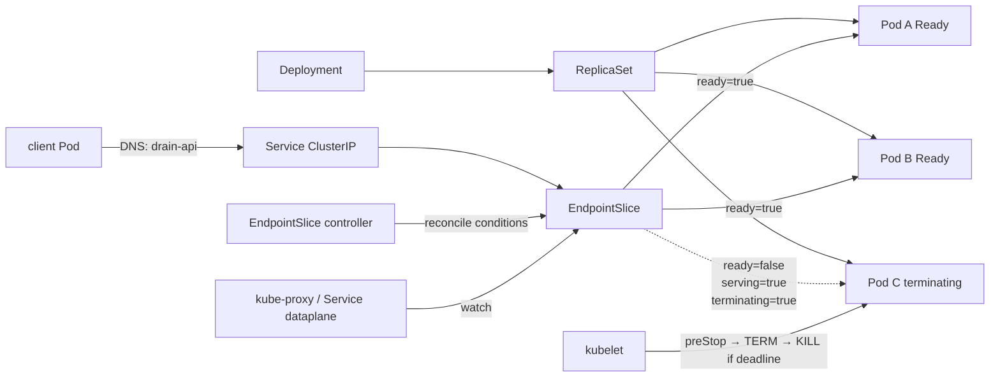

# Weekly Kubernetes Magazine — Pod終了を「切断」ではなく「ドレイン」にする

[[Home]]

#kubernetes #k8s #weekly #deep-dive

## 1. Focus・難易度・前提・到達点

**Focus:** Pod削除やローリング更新時に、`deletionTimestamp`、readiness、EndpointSlice の `ready / serving / terminating`、`preStop`、`SIGTERM`、`terminationGracePeriodSeconds` がどう協調するかを理解し、Serviceからの新規流入を止めつつ処理中リクエストを完了させる。

**Difficulty signal:** **Intermediate** — 学習順序の門番ではなく目安。Pod/Serviceを初めて触る場合も、前提節を確認すれば実施できる。

### 必要知識

- Podは交換可能で、Deployment/ReplicaSetが希望レプリカ数へ継続的に収束させること
- ServiceのselectorがPod labelを選び、EndpointSliceが実バックエンドを表すこと
- readinessは「プロセスが生きている」ではなく「新規トラフィックを受けてよい」を表すこと
- Unixの `SIGTERM` と `SIGKILL` の違い（Windowsノードは本号の対象外）

### 必要ツール・環境

- `kubectl`（クラスタと大きく離れていない版）
- Kubernetes **v1.26以上**（EndpointSliceの `serving` / `terminating` 条件がstable）
- Linuxワーカーノード、CoreDNS、Service/EndpointSliceが動作するCNI
- Namespaceを作成でき、Deployment / Service / ConfigMap / Pod / EndpointSliceを閲覧できる権限
- `python:3.13-alpine` と `busybox:1.36` を取得できるレジストリ経路
- ローカルの `lab.yaml` を保存できるシェル。追加のIngressやLoadBalancerは不要

### 測定可能な到達点

1. Service → EndpointSlice → Podの対応を名前・IP・条件で説明できる。
2. Pod削除中に `ready=false, serving=true, terminating=true` を観測できる。
3. 正常構成でクライアントの `ERR` を0件に保ち、意図的な誤構成で1件以上再現できる。
4. `preStop時間 + アプリ停止時間 + 安全余白 <= terminationGracePeriodSeconds` を検証できる。
5. 証拠を採取して安全構成へロールバックし、復旧を確認できる。

## 2. 本番シナリオ・SLO・障害仮定

決済APIを3 Podで運用し、平日日中もDeploymentを更新する。通常リクエストは1秒未満だが、最大8秒の処理がある。Podが消える瞬間の502/接続リセットは決済の再試行を誘発し、二重処理リスクとレイテンシを増やす。

### SLOと成功条件

- 可用性SLO: 30日で成功率 **99.95%以上**
- 更新中のラボ基準: 1秒間隔のServiceリクエストで **ERR=0**
- graceful shutdown: TERM受信後 **15秒以内**に処理を完了
- 新規流入停止: Podに削除時刻が付いた後、そのPodを通常のready endpointとして扱わない
- 復旧基準: rollback後、3 PodがAvailable、非終了Endpointが3、直近30リクエストがすべて成功

### 明示する障害仮定

- kubeletとAPI serverは疎通するが、EndpointSlice更新、kube-proxy/CNI反映、外部LB反映には遅延がある。
- `preStop`は少なくとも1回配送され得るため、処理は冪等である必要がある。
- ノード電源断、強制削除 (`--force --grace-period=0`)、カーネル障害では通常のgraceful shutdownを保証できない。
- クライアントのkeep-aliveや外部LBは、Kubernetes Serviceより長く接続を保持し得る。アプリもTERMを正しく処理する必要がある。
- readiness成功は既存接続の完了を保証しない。流入停止と処理完了は別問題である。

## 3. Control Planeとreconciliationのメンタルモデル

Pod削除は単一の同期処理ではない。

1. `kubectl delete pod` がAPI serverへ削除要求を送り、Podに `deletionTimestamp` と猶予時間が設定される。
2. kubeletは終了を検知し、猶予時間のカウント開始後に `preStop` を実行する。完了後、コンテナPID 1へTERMを送る。
3. 同時並行でEndpointSlice controllerは、終了中Podのendpointを `terminating=true`、互換性のため `ready=false` とする。アプリがReadyなら `serving=true` が残り得る。
4. Service proxy（多くはkube-proxy）がEndpointSliceを監視し、通常はterminating endpointを新規通信先から外す。
5. ReplicaSet controllerは削除中Podを有効レプリカと数えず、置換Podを作成する。
6. アプリがTERMを処理して終了する。猶予を超えるとkubeletはKILLする。`preStop`にもアプリ終了にも**同じ総予算**が使われる。

重要なのは「controllerが希望状態へ収束すること」と「各watcher/dataplaneへの伝播が原子的ではないこと」。固定sleepは伝播余裕を作れるが、根本保証ではない。アプリのTERM処理、readiness、複数replica、更新戦略、PDBを組み合わせる。

## 4. 設計選択肢とトレードオフ

| 選択肢 | 長所 | 短所 / 注意 | 適用例 |
|---|---|---|---|
| アプリがTERMを受け、新規受付停止→処理完了 | 意図をアプリが理解し、最も正確 | 実装・テストが必要 | HTTP/gRPCサーバ、worker |
| `preStop`でreadinessを落として短く待つ | dataplane/LB反映の余裕を作れる | grace予算を消費。固定秒数は環境依存 | 変更困難な既製イメージ |
| `preStop.sleep` handler | コンテナに`sh`/`sleep`不要 | 対応Kubernetes版の確認が必要 | distroless image |
| `exec: sleep` | 広く理解されやすい | shell/binaryが必要、cgroup資源も使用 | 教育・互換重視 |
| graceを長くする | 長時間処理を完了しやすい | rollout/scale-down/障害復旧が遅く、Pod資源を長く保持 | バッチ的API |
| graceを短くする | 置換が速くコスト回収も速い | KILL・切断・データ不整合のリスク | statelessで短い処理のみ |
| `maxUnavailable: 0` | 更新中の提供容量を維持 | surge分の一時CPU/メモリ/IPコスト | 可用性優先 |

**設計式（初期値）:**

```text
terminationGracePeriodSeconds
  >= endpoint/LB反映待ち + 最大処理時間 + アプリ終了時間 + 安全余白
```

計測して短縮する。むやみに大きくすると、ノードドレインやデプロイが遅くなる。

## 5. オブジェクト関係図



## 6. 150分ガイドラボ

### 時間配分

- Foundation 25分: context確認、manifest読解、通常経路
- Practical implementation 55分: apply、EndpointSlice観測、正常終了
- Production concerns 45分: failure injection、証拠採取、rollback
- Optional advanced challenge 25分: grace budget計測または長時間接続試験

### 6.1 最初に必ず接続先を確認する

> [!danger] 変更警告
> 以下はNamespace、Deployment、Service、ConfigMap、Podを作成し、後半でPodを削除する。**本番contextでは実行しない。** 毎回contextとnamespaceを確認し、`default`を暗黙利用しない。実在の秘密情報をmanifest、ログ、コマンド履歴へ入れない。

```bash
kubectl config current-context
kubectl cluster-info
kubectl auth can-i create namespace
kubectl get ns drain-lab
```

期待: 学習用クラスタ名を目視確認。最後のコマンドは初回なら `NotFound` でよい。共有クラスタなら専用contextへ切り替える。

### 6.2 完全manifestを保存する

以下を `lab.yaml` として保存する。

```yaml
apiVersion: v1
kind: Namespace
metadata:
  name: drain-lab
  labels:
    app.kubernetes.io/part-of: graceful-drain-lab
---
apiVersion: v1
kind: ConfigMap
metadata:
  name: drain-server
  namespace: drain-lab
data:
  server.py: |
    import http.server, os, signal, threading, time

    draining = False
    active = 0
    lock = threading.Lock()

    class Handler(http.server.BaseHTTPRequestHandler):
        def do_GET(self):
            global active
            if self.path == "/ready":
                self.send_response(503 if draining else 200)
                self.end_headers()
                return
            with lock:
                active += 1
            try:
                delay = 8 if self.path == "/slow" else 0
                time.sleep(delay)
                body = f"pod={os.environ['POD_NAME']} draining={draining}\n".encode()
                self.send_response(200)
                self.send_header("Content-Length", str(len(body)))
                self.end_headers()
                self.wfile.write(body)
            finally:
                with lock:
                    active -= 1

        def log_message(self, fmt, *args):
            print(f"request {self.address_string()} {fmt % args}", flush=True)

    server = http.server.ThreadingHTTPServer(("0.0.0.0", 8080), Handler)

    def stop(signum, frame):
        global draining
        draining = True
        print(f"SIGTERM received active={active}", flush=True)
        threading.Thread(target=server.shutdown, daemon=True).start()

    signal.signal(signal.SIGTERM, stop)
    print("server started", flush=True)
    server.serve_forever()
    print(f"server stopped active={active}", flush=True)
---
apiVersion: apps/v1
kind: Deployment
metadata:
  name: drain-api
  namespace: drain-lab
spec:
  replicas: 3
  strategy:
    type: RollingUpdate
    rollingUpdate:
      maxUnavailable: 0
      maxSurge: 1
  selector:
    matchLabels:
      app: drain-api
  template:
    metadata:
      labels:
        app: drain-api
    spec:
      terminationGracePeriodSeconds: 30
      securityContext:
        seccompProfile:
          type: RuntimeDefault
      containers:
        - name: api
          image: python:3.13-alpine
          imagePullPolicy: IfNotPresent
          command: ["python", "-u", "/app/server.py"]
          ports:
            - name: http
              containerPort: 8080
          env:
            - name: POD_NAME
              valueFrom:
                fieldRef:
                  fieldPath: metadata.name
          readinessProbe:
            httpGet:
              path: /ready
              port: http
            periodSeconds: 1
            timeoutSeconds: 1
            failureThreshold: 1
          livenessProbe:
            httpGet:
              path: /ready
              port: http
            periodSeconds: 10
            failureThreshold: 3
          lifecycle:
            preStop:
              exec:
                command: ["/bin/sh", "-c", "sleep 5"]
          resources:
            requests:
              cpu: 25m
              memory: 32Mi
            limits:
              cpu: 200m
              memory: 96Mi
          securityContext:
            allowPrivilegeEscalation: false
            capabilities:
              drop: ["ALL"]
            runAsNonRoot: true
            runAsUser: 10000
            readOnlyRootFilesystem: true
---
apiVersion: v1
kind: Service
metadata:
  name: drain-api
  namespace: drain-lab
spec:
  selector:
    app: drain-api
  ports:
    - name: http
      port: 80
      targetPort: http
---
apiVersion: policy/v1
kind: PodDisruptionBudget
metadata:
  name: drain-api
  namespace: drain-lab
spec:
  minAvailable: 2
  selector:
    matchLabels:
      app: drain-api
---
apiVersion: v1
kind: Pod
metadata:
  name: client
  namespace: drain-lab
  labels:
    app: drain-client
spec:
  restartPolicy: Always
  containers:
    - name: client
      image: busybox:1.36
      command:
        - /bin/sh
        - -c
        - |
          while true; do
            ts=$(date -Iseconds)
            if body=$(wget -q -T 2 -O - http://drain-api/ 2>&1); then
              echo "$ts OK $body"
            else
              echo "$ts ERR $body"
            fi
            sleep 1
          done
      resources:
        requests:
          cpu: 5m
          memory: 8Mi
        limits:
          cpu: 50m
          memory: 32Mi
      securityContext:
        allowPrivilegeEscalation: false
        capabilities:
          drop: ["ALL"]
        runAsNonRoot: true
        runAsUser: 10000
        readOnlyRootFilesystem: true
        seccompProfile:
          type: RuntimeDefault
```

### YAMLを読む

- Namespaceを固定し、事故範囲とRBAC範囲を明確化する。
- Serviceの `targetPort: http` はcontainer portの**名前**を参照する。selector `app: drain-api` が一致したPodだけを選ぶ。
- readinessは1秒ごと、1回失敗でEndpointの通常利用を止める。livenessは再起動判断であり、流量制御に使わない。
- `preStop` の5秒はEndpointSlice/kube-proxy反映の観測余裕。grace 30秒の中に含まれる。
- `maxUnavailable: 0` は更新時にready数を減らさず、`maxSurge: 1` の一時追加分の資源を許容する。
- PDBはEviction APIを使う**自発的中断**を制御する。直接のPod削除、Deployment rollout、ノード故障を万能に防ぐものではない。
- `readOnlyRootFilesystem` でも動くよう、`preStop` は書き込みを行わない。アプリ側で状態ファイルが必要なら、容量上限付きemptyDirを明示的にmountする。

### 6.3 server-side dry-run → apply

```bash
kubectl apply --dry-run=server -f lab.yaml
kubectl diff -f lab.yaml
```

> [!warning] Apply前の最終確認
> `kubectl config current-context` を再実行し、差分の対象が `drain-lab` だけであることを目視してから進む。

```bash
kubectl config current-context
kubectl apply -f lab.yaml
kubectl -n drain-lab rollout status deployment/drain-api --timeout=180s
kubectl -n drain-lab wait pod/client --for=condition=Ready --timeout=120s
```

期待出力（名前や時刻は異なる）:

```text
deployment "drain-api" successfully rolled out
pod/client condition met
```

**Checkpoint A**

```bash
kubectl -n drain-lab get deploy,pod,svc,pdb -o wide
kubectl -n drain-lab get endpointslice -l kubernetes.io/service-name=drain-api
kubectl -n drain-lab logs client --tail=10
```

期待: `drain-api` は `3/3` Available、Endpointは3、client logは `OK pod=... draining=False`。`ERR`があれば先へ進まず、Pod events、DNS、image pull、NetworkPolicyを調べる。

### 6.4 EndpointSliceの条件を可視化する

```bash
kubectl -n drain-lab get endpointslice \
  -l kubernetes.io/service-name=drain-api \
  -o jsonpath='{range .items[*].endpoints[*]}{.targetRef.name}{"\t"}{.addresses[0]}{"\tready="}{.conditions.ready}{"\tserving="}{.conditions.serving}{"\tterminating="}{.conditions.terminating}{"\n"}{end}'
```

期待:

```text
drain-api-...  10.x.x.x  ready=true  serving=true  terminating=false
```

別terminalでwatchする。

```bash
kubectl -n drain-lab get endpointslice \
  -l kubernetes.io/service-name=drain-api -w -o yaml
```

### 6.5 正常な終了を観測する

対象を変数に入れる前に一覧を確認する。

```bash
kubectl -n drain-lab get pod -l app=drain-api -o wide
POD_TO_DELETE=$(kubectl -n drain-lab get pod -l app=drain-api -o jsonpath='{.items[0].metadata.name}')
printf '%s\n' "$POD_TO_DELETE"
kubectl -n drain-lab get pod "$POD_TO_DELETE" -o jsonpath='{.metadata.name}{" grace="}{.spec.terminationGracePeriodSeconds}{"\n"}'
```

> [!danger] Delete警告
> 表示されたPodが `drain-lab` の `drain-api-*` であることを確認する。`--force` と `--grace-period=0` は使わない。

```bash
kubectl config current-context
kubectl -n drain-lab delete pod "$POD_TO_DELETE" --wait=false
kubectl -n drain-lab get pod -w
```

別terminalで直後に証拠を取る（終了が速ければ数回繰り返す）。

```bash
kubectl -n drain-lab get endpointslice \
  -l kubernetes.io/service-name=drain-api \
  -o jsonpath='{range .items[*].endpoints[*]}{.targetRef.name}{" ready="}{.conditions.ready}{" serving="}{.conditions.serving}{" terminating="}{.conditions.terminating}{"\n"}{end}'
kubectl -n drain-lab logs client --since=2m | tail -30
kubectl -n drain-lab rollout status deployment/drain-api --timeout=120s
```

**Checkpoint B:** 一時的に旧endpointが `ready=false serving=true terminating=true` となり、新Podがreadyになる。clientの直近ログに `ERR` がない。状態遷移が速すぎて見えなくても異常ではないため、watch出力を保存して再試行する。

## 7. kubectlとYAMLの重要点

- `-n drain-lab`: すべてのnamespaced操作で明示し、現在namespaceへの依存をなくす。
- `--dry-run=server`: API serverのdefaulting、schema、admissionを通すが永続化しない。ローカルdry-runよりクラスタ固有検証に強い。
- `kubectl diff`: 適用前の差分確認。差分ありのexit code 1をCIで「実行失敗」と誤判定しない。
- `rollout status`: DeploymentのObservedGenerationとavailable replica収束を待つ。HTTP SLOの証明そのものではない。
- `jsonpath`: Endpointごとの条件を機械可読に抜く。空欄はAPIバージョンや状態により値が未設定の場合がある。
- `--wait=false`: delete呼び出しをすぐ返し、終了途中を観測する。削除処理を速める指定ではない。
- `logs --since=2m`: 時間窓を限定し、incident前後のOK/ERRを比較する。

## 8. Failure injection・証拠駆動incident/rollback

### 8.1 仮説

「replicaを1にし、graceを2秒、preStopを10秒にすると、preStopだけで予算を使い切り、置換Podの準備中にService endpointが0となってERRが出る」。これは意図的な危険構成であり、本番では行わない。

まずベースラインを保存する。

```bash
kubectl -n drain-lab get deployment drain-api -o yaml > drain-api-before.yaml
kubectl -n drain-lab logs client --since=1m > client-before.log
kubectl -n drain-lab get endpointslice -l kubernetes.io/service-name=drain-api -o yaml > endpoints-before.yaml
```

### 8.2 障害注入

> [!danger] Apply/Delete警告
> `drain-lab` の学習リソースだけが対象であること、clientでエラー発生を許容できることを確認する。

```bash
kubectl config current-context
kubectl -n drain-lab scale deployment/drain-api --replicas=1
kubectl -n drain-lab rollout status deployment/drain-api --timeout=120s
kubectl -n drain-lab patch deployment drain-api --type=strategic -p \
  '{"spec":{"template":{"metadata":{"annotations":{"lab.kubernetes.io/failure":"short-grace-v1"}},"spec":{"terminationGracePeriodSeconds":2,"containers":[{"name":"api","lifecycle":{"preStop":{"exec":{"command":["/bin/sh","-c","sleep 10"]}}}}]}}}}'
kubectl -n drain-lab rollout status deployment/drain-api --timeout=120s
kubectl -n drain-lab get pod -l app=drain-api -o wide
```

唯一のPod名を目視してから削除する。

```bash
BAD_POD=$(kubectl -n drain-lab get pod -l app=drain-api -o jsonpath='{.items[0].metadata.name}')
printf '%s\n' "$BAD_POD"
kubectl -n drain-lab delete pod "$BAD_POD" --wait=false
sleep 12
kubectl -n drain-lab logs client --since=1m | tee client-incident.log
kubectl -n drain-lab get events --sort-by=.lastTimestamp | tail -25
kubectl -n drain-lab get endpointslice -l kubernetes.io/service-name=drain-api -o yaml > endpoints-incident.yaml
```

期待: client logに少なくとも一時的な `ERR`。環境が非常に速くERR=0なら、成功は「注入が再現しなかった」であり、証拠を捏造しない。`/slow`への連続要求やimage pull cacheなしの環境で再試験する。

### 8.3 診断の順序

1. **症状:** `grep -c ' ERR ' client-incident.log`
2. **提供容量:** `kubectl -n drain-lab get deploy drain-api`
3. **経路:** EndpointSliceにnon-terminating ready endpointが何個あったか
4. **Pod:** `deletionTimestamp`、grace、events、終了理由/exit code
5. **構成差分:** `kubectl diff -f lab.yaml`

相関だけで「kube-proxy障害」と断定しない。replica=1と猶予不足という既知の変更をまず検証する。

### 8.4 Rollback

このラボはGit管理manifestを真実の源泉と見なし、元の `lab.yaml` を再適用する。`rollout undo` は直前ReplicaSetへ戻すが、手動scaleは元に戻さないため、このincidentでは不十分。

```bash
kubectl config current-context
kubectl apply --dry-run=server -f lab.yaml
kubectl diff -f lab.yaml
kubectl apply -f lab.yaml
kubectl -n drain-lab rollout status deployment/drain-api --timeout=180s
kubectl -n drain-lab get deployment drain-api
kubectl -n drain-lab get endpointslice -l kubernetes.io/service-name=drain-api
kubectl -n drain-lab logs client --since=1m | tail -30
```

復旧判定: Deployment `3/3`、endpoint 3、直近30行がすべてOK。次で機械的に確認する。

```bash
test "$(kubectl -n drain-lab get deploy drain-api -o jsonpath='{.status.availableReplicas}')" = "3"
test "$(kubectl -n drain-lab get endpointslice -l kubernetes.io/service-name=drain-api -o jsonpath='{range .items[*].endpoints[?(@.conditions.ready==true)]}{.addresses[0]}{"\n"}{end}' | wc -l)" -eq 3
test "$(kubectl -n drain-lab logs client --tail=30 | grep -c ' ERR ' || true)" -eq 0
```

## 9. 本番上のSecurity・RBAC・resource・cost

### Security / Secrets

- コンテナはnon-root、全capability drop、no privilege escalation、RuntimeDefault seccomp、read-only root filesystemとした。
- 実サービスのtoken、Cookie、証明書、顧客payloadをログやConfigMapへ入れない。Secret値の表示をラボへ持ち込まない。
- `preStop`で外部APIへ機密情報を送らない。複数回実行・途中中断に耐える冪等処理にする。
- NetworkPolicyを導入済みならclient→serverと必要なDNSだけを許可する。本号はCNI差を避けるためmanifestに含めない。

### RBAC

学習者にcluster-adminを渡さない。専用Namespaceで、通常は以下のverbs/resourcesへ限定する。

```yaml
apiVersion: rbac.authorization.k8s.io/v1
kind: Role
metadata:
  name: drain-lab-operator
  namespace: drain-lab
rules:
  - apiGroups: ["", "apps", "policy"]
    resources: ["pods", "pods/log", "services", "configmaps", "deployments", "replicasets", "poddisruptionbudgets"]
    verbs: ["get", "list", "watch", "create", "update", "patch", "delete"]
  - apiGroups: ["discovery.k8s.io"]
    resources: ["endpointslices"]
    verbs: ["get", "list", "watch"]
```

EndpointSliceはcontroller管理物なので学習者にwriteを与えない。Namespace作成権限も別管理者が事前提供する方が安全。

### Namespace / Context

- コマンドに `-n drain-lab` を付け、contextは各変更前に表示する。
- `kubectl config set-context --current --namespace=...` は便利だが、暗黙状態を変えるため手順書では明示 `-n` を優先する。
- 共有クラスタではResourceQuota、LimitRange、命名/owner label、終了期限を設定する。

### Resources / Cost

- ラボrequests合計は概ねCPU 80m、memory 104Mi、更新時はsurgeでserverが一時4 Pod。
- 長いgrace中もPod/node資源、IP、LB connectionを占有する。最大処理時間の実測分位点から予算を決める。
- `maxSurge` は可用性と引き換えに一時容量を要求する。ResourceQuotaやnode余力がないと新PodがPendingとなる。
- PDB `minAvailable: 2` とreplicas=3は保守余裕1。単一nodeではnode障害への可用性は増えない。

## 10. Cleanup

採取した `*-before.yaml` とログはローカル成果物なので必要なら保管する。クラスタ削除前に対象を再確認する。

```bash
kubectl config current-context
kubectl get ns drain-lab
kubectl -n drain-lab get all
```

> [!danger] Delete警告
> 次はNamespace配下をまとめて削除する。対象名が厳密に `drain-lab` であることを目視確認する。Namespaceに他者のリソースがあれば実行しない。

```bash
kubectl delete namespace drain-lab
kubectl get namespace drain-lab
```

期待: 最終的に `NotFound`。Terminatingが長引く場合、finalizerを盲目的に削除せず、`kubectl get ns drain-lab -o yaml` とAPI discovery障害を診断する。

## 11. Verification checklistと成果物

- [ ] current-contextをapply/deleteの前に確認した
- [ ] すべての操作namespaceを `drain-lab` に限定した
- [ ] 通常時にready endpointが3つあることを確認した
- [ ] 終了中EndpointSliceの3条件を観測・保存した
- [ ] 正常終了でclient ERR=0を確認した
- [ ] 短いgrace + 1 replicaの失敗仮説を検証した
- [ ] events、client log、EndpointSlice YAML、Deployment差分を証拠として保存した
- [ ] manifest再適用後に3つの復旧判定を通した
- [ ] Secretや実データをmanifest/ログへ含めていない
- [ ] cleanup後にNamespaceが消えたことを確認した

**具体的deliverables:**

1. `lab.yaml`
2. `client-before.log` と `client-incident.log`
3. `endpoints-before.yaml` と `endpoints-incident.yaml`
4. 正常/異常/復旧のタイムライン（時刻、ready endpoint数、ERR数、available replicas）
5. 自環境向けgrace budget計算と採用値、その根拠

## 12. Assessment

### Q1. `ready=false, serving=true, terminating=true` は何を意味するか

<details><summary>回答</summary>

Podは終了中で、通常の新規Serviceトラフィック対象からは外すべきだが、アプリ自体はまだ処理可能である。`ready` は概ね `serving && !terminating` の互換的な近道。drainを理解するconsumerはserving/terminatingを別々に判断できる。

</details>

### Q2. `preStop: sleep 10` とgrace 10秒なら、アプリにTERM処理時間は何秒残るか

<details><summary>回答</summary>

原則ほぼ0秒。graceのカウントはpreStopより前に始まり、preStopとアプリ停止で共有する。期限超過時には小さな一回限りの延長があり得るが、それを設計予算として当てにしない。

</details>

### Q3. PDBがあればPod直接削除による停止を防げるか

<details><summary>回答</summary>

防げない。PDBは主にEviction APIを使う自発的中断を制限する。直接delete、Deployment rollout、ノード障害などすべてを止める仕組みではない。

</details>

### Q4. livenessを失敗させてdrainする設計が危険な理由は

<details><summary>回答</summary>

liveness失敗はコンテナ再起動を引き起こし得る。流入停止はreadiness、プロセスの回復不能判定はlivenessと責務を分ける。誤ったlivenessは再起動ループと可用性低下を招く。

</details>

### Q5. `rollout undo` だけでincident前へ戻らない可能性があるのはなぜか

<details><summary>回答</summary>

ReplicaSet revisionはPod templateを戻せるが、手動で変更したDeploymentのreplicasなどtemplate外の設定は元に戻らない。本ラボでは宣言manifest再適用が完全なrollbackとなる。

</details>

### Interview / Design question

「最大120秒の動画アップロードがあり、外部LoadBalancerの登録解除に最大30秒かかるAPIを、日中無停止で更新する。grace、readiness、replica数、rolling strategy、LB drain、クライアント再試行をどう設計し、どのメトリクスで証明するか。」

良い回答は、単にgrace=150とせず、受付停止と既存処理追跡、再開可能upload、冪等性、接続別のdrain、容量/surge、最悪値と分位点、強制終了時の補償、実測SLOを扱う。

### Follow-up challenge（任意）

`/slow`（8秒）へリクエスト中に対象Podを削除し、client側の完了/切断、serverのTERM log、EndpointSlice条件を同一タイムラインへまとめる。次にpreStop 0/5/15秒、grace 5/15/30秒の組合せを最低5回ずつ試し、ERR率と終了所要時間を表にする。自環境の最短安全値を提案する。

## 13. 現行公式Kubernetes参照

- [Pod Lifecycle — Pod termination flow](https://kubernetes.io/docs/concepts/workloads/pods/pod-lifecycle/)
- [Container Lifecycle Hooks](https://kubernetes.io/docs/concepts/containers/container-lifecycle-hooks/)
- [EndpointSlices](https://kubernetes.io/docs/concepts/services-networking/endpoint-slices/)
- [Explore Termination Behavior for Pods And Their Endpoints](https://kubernetes.io/docs/tutorials/services/pods-and-endpoint-termination-flow/)
- [Configure Liveness, Readiness and Startup Probes](https://kubernetes.io/docs/tasks/configure-pod-container/configure-liveness-readiness-probes/)
- [Deployments](https://kubernetes.io/docs/concepts/workloads/controllers/deployment/)
- [Disruptions / PodDisruptionBudget](https://kubernetes.io/docs/concepts/workloads/pods/disruptions/)
- [Service](https://kubernetes.io/docs/concepts/services-networking/service/)

> 本号は2026-09-24時点で上記公式文書を主資料として構成。クラスタのminor versionに対応する公式ドキュメント版とAPIリファレンスも併読すること。
