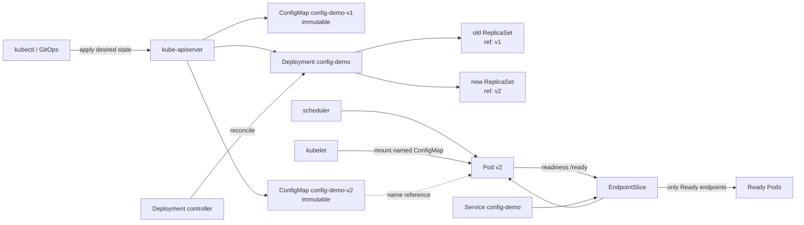

# Weekly Kubernetes Magazine — 設定変更を「上書き」から「世代付きリリース」へ

#kubernetes #k8s #weekly #deep-dive

[[Home]]

> **今週の評価基準**：アプリ設定を immutable ConfigMap として世代管理し、Pod template の変更として段階的に配布し、異常時に証拠を集めて前世代へ戻せること。

---

## 1. Focus・難易度・前提・クラスタ要件・測定可能な到達点

- **Focus**：`immutable: true` の ConfigMap、名前による世代識別、Deployment rollout、readiness による不良設定の遮断、`rollout undo` による復旧
- **難易度シグナル**：**Intermediate**（参加条件ではなく、設計判断の密度の目安）
- **所要時間**：120〜150分。任意の発展課題を含めると180分

### 必要知識

1. Pod は Deployment が直接「書き換える」のではなく、Deployment → ReplicaSet → Pod の調整ループで収束する。
2. Service は selector に合い、かつ Ready な Pod を到達可能な endpoint として扱う。
3. ConfigMap は非機密設定用であり、Secret の代わりではない。
4. YAML の `metadata.name`、label selector、Pod template (`spec.template`) の意味。

### 必要ツール・環境

- Kubernetes クラスタ v1.29 以降を推奨（kind、minikube、Docker Desktop、または隔離された検証クラスタ）
- `kubectl`。現在の cluster と互換性のあるバージョン
- `curl`、POSIX shell
- Namespace を作成できる権限。cluster-admin は不要
- `registry.k8s.io/nginx-slim:0.27` を pull できるネットワーク

### クラスタ要件と事前検査

> [!danger] 実行前の安全確認
> 以下は Namespace を作成し、Deployment、Service、ConfigMap を apply/delete する。共有・本番クラスタで実行しない。**各 apply/delete の前に context と namespace を声に出して確認すること。** 実在する認証情報や秘密値を ConfigMap やシェル履歴へ入れない。

```bash
kubectl config current-context
kubectl cluster-info
kubectl auth can-i create namespaces
kubectl version
```

期待：意図した検証用 context が表示され、API server に接続できる。以降は namespace を変数ではなく、明示的な `-n k8s-mag-config` で固定する。

### 測定可能な到達点

- v1 → v2 の変更で Pod template hash が変わり、全リクエストが `revision=v2` へ収束する。
- 不良設定 v3 で新 Pod が `0/1 Ready` になっても、v2 の Ready Pod が Service を維持する。
- Events、Pod logs、Deployment conditions、EndpointSlice の4種類の証拠から原因を説明する。
- 5分以内に `rollout undo` し、`revision=v2` の応答と3個の Ready endpoint を回復する。
- ConfigMap の上書き、環境変数、可変 volume、immutable 世代方式の差を説明できる。

### 学習レイヤー

1. **Foundation**：ConfigMap の消費方法と更新意味論
2. **Practical implementation**：immutable ConfigMap を名前で世代化し Deployment で配布
3. **Production concerns**：readiness、可用性予算、権限、保持、コスト、監査証跡
4. **Optional advanced challenge**：Kustomize の content hash と admission policy

---

## 2. 本番シナリオ・SLO・障害仮定

架空の `config-demo` は、各リクエストでレスポンス文言と設定 revision を返す。アプリのイメージは変えず、設定だけを週に数回リリースする。過去に ConfigMap を同名上書きした結果、Pod ごとに反映時刻がずれ、rollback 対象も曖昧になった。

### SLO / SLI

- **可用性 SLO**：設定リリース中も、5分窓で成功率 99.9%以上
- **整合性 SLO**：rollout 完了後2分以内に Ready endpoint の100%が宣言した設定 revision を返す
- **復旧目標**：不良設定の検知から5分以内に既知の正常世代へ戻す（RTO 5分）
- **変更追跡**：稼働 Pod から ConfigMap 名と revision を一意に説明できる

### failure assumptions

- YAML は API schema 上は妥当でも、アプリには不正な設定になり得る。
- 一部ノードの image pull や Pod 起動が遅れる。
- operator が誤った ConfigMap 名を Pod template に指定する。
- kubelet、Deployment controller、EndpointSlice controller は非同期であり、瞬時の一斉切替はない。
- readiness が設定妥当性を表さなければ、不良 Pod がトラフィックを受ける。

対象外：ConfigMap に秘密情報を保存する設計、外部 secret manager、アプリ独自の動的 reload 実装。

---

## 3. Control plane と reconciliation のメンタルモデル

1. `kubectl apply` は desired state を API server に保存する。
2. ConfigMap 自体を追加しても Deployment の `spec.template` は変わらないため、それだけでは rollout は起きない。
3. Deployment の Pod template が `config-demo-v2` を参照するよう変わると、template hash が変わる。
4. Deployment controller は新 ReplicaSet を作成し、`maxSurge` / `maxUnavailable` の範囲で新旧 Pod 数を調整する。
5. scheduler が node を選び、kubelet が Pod sandbox、ConfigMap volume、container、probe を収束させる。
6. readiness 成功後、EndpointSlice controller がその Pod を Ready endpoint として Service に反映する。
7. 不良設定で readiness が失敗すれば Pod は Running でも Ready にならない。`maxUnavailable: 0` なら旧 Ready Pod を残したまま rollout が停止する。
8. `rollout undo` は Deployment の Pod template を過去 revision のものへ戻す。ConfigMap の内容を逆編集する操作ではない。

重要な区別：**ConfigMap controller がアプリを再起動するわけではない**。Deployment が ConfigMap を所有するわけでもない。両者の関係は Pod template 内の名前参照であり、世代切替はその参照変更として表現する。

---

## 4. 設計オプションとトレードオフ

| 方式 | 更新の見え方 | rollout | rollback | 主なリスク |
|---|---|---|---|---|
| 環境変数で同名 ConfigMap | Pod 起動時に固定 | 自動では起きない | Pod 再作成が必要 | 稼働 Pod と API object が不一致 |
| 可変 ConfigMap の volume | kubelet sync 後に投影更新 | 原則不要 | 同名を再編集 | 反映遅延、アプリ reload、混在状態 |
| `subPath` で単一ファイル mount | 起動時の内容に固定 | 自動では起きない | Pod 再作成 | ConfigMap 更新を受け取らない |
| **immutable + 世代付き名** | Pod 世代と設定世代が結合 | 参照変更で起きる | Deployment revision を undo | object 数と運用手順が増える |
| sidecar / config agent | 実装次第で動的 | 任意 | agent 側の仕組み | 複雑性、権限、障害点、コスト |

今週は「設定変更もアプリリリースと同じ品質で監査・検証・rollback する」ことを優先し、immutable + 世代付き名を選ぶ。`immutable: true` は誤上書きを API で拒否し、kubelet の変更 watch 負荷も減らせる。一方、作成済み object の `data` と `binaryData` は変更できず、immutable を解除もできない。変更は新しい名前で作る。

ConfigMap は1 MiB上限で、機密性を提供しない。大きな artifact や秘密情報を入れる設計ではない。

---

## 5. Architecture / object relationship



所有関係は Deployment → ReplicaSet → Pod。ConfigMap、Service、EndpointSlice はこの所有チェーンと同一ではない。`kubectl get pod -o yaml` の `ownerReferences` と `volumes[].configMap.name` を分けて読む。

---

## 6. Guided lab（約150分）

### 6.1 Namespace と完全な manifest を用意する（20分）

まず安全確認する。

```bash
kubectl config current-context
kubectl auth can-i create deployment -n k8s-mag-config
```

Namespace がまだ存在しないため2つ目が `no` でもよい。次の内容を `config-lab.yaml` として保存する。値はすべて架空であり、Secret は含まない。

```yaml
apiVersion: v1
kind: Namespace
metadata:
  name: k8s-mag-config
  labels:
    app.kubernetes.io/part-of: kubernetes-magazine
---
apiVersion: v1
kind: ServiceAccount
metadata:
  name: config-demo
  namespace: k8s-mag-config
automountServiceAccountToken: false
---
apiVersion: v1
kind: ConfigMap
metadata:
  name: config-demo-v1
  namespace: k8s-mag-config
  labels:
    app.kubernetes.io/name: config-demo
    app.kubernetes.io/component: configuration
    app.kubernetes.io/version: v1
immutable: true
data:
  default.conf: |
    server {
      listen 8080;
      location = /ready { return 200 "ready revision=v1\n"; }
      location / { return 200 "hello revision=v1\n"; }
    }
---
apiVersion: apps/v1
kind: Deployment
metadata:
  name: config-demo
  namespace: k8s-mag-config
  annotations:
    kubernetes.io/change-cause: "initial config config-demo-v1"
spec:
  replicas: 3
  revisionHistoryLimit: 5
  progressDeadlineSeconds: 120
  strategy:
    type: RollingUpdate
    rollingUpdate:
      maxUnavailable: 0
      maxSurge: 1
  selector:
    matchLabels:
      app.kubernetes.io/name: config-demo
  template:
    metadata:
      labels:
        app.kubernetes.io/name: config-demo
        config.example.com/revision: v1
      annotations:
        config.example.com/source: config-demo-v1
    spec:
      serviceAccountName: config-demo
      automountServiceAccountToken: false
      securityContext:
        seccompProfile:
          type: RuntimeDefault
      containers:
        - name: web
          image: registry.k8s.io/nginx-slim:0.27
          imagePullPolicy: IfNotPresent
          ports:
            - name: http
              containerPort: 8080
          volumeMounts:
            - name: app-config
              mountPath: /etc/nginx/conf.d
              readOnly: true
          readinessProbe:
            httpGet:
              path: /ready
              port: http
            initialDelaySeconds: 2
            periodSeconds: 3
            failureThreshold: 2
          livenessProbe:
            httpGet:
              path: /ready
              port: http
            initialDelaySeconds: 10
            periodSeconds: 10
            failureThreshold: 3
          resources:
            requests:
              cpu: 10m
              memory: 16Mi
            limits:
              cpu: 100m
              memory: 64Mi
          securityContext:
            allowPrivilegeEscalation: false
            capabilities:
              drop: ["ALL"]
            readOnlyRootFilesystem: false
      volumes:
        - name: app-config
          configMap:
            name: config-demo-v1
            items:
              - key: default.conf
                path: default.conf
---
apiVersion: v1
kind: Service
metadata:
  name: config-demo
  namespace: k8s-mag-config
spec:
  selector:
    app.kubernetes.io/name: config-demo
  ports:
    - name: http
      port: 80
      targetPort: http
```

#### YAML の要点

- `immutable: true`：`data` の破壊的な同名上書きを禁止する。
- `configMap.name`：Pod template に設定世代を明示する。ここを変えると template hash が変わる。
- directory mount：`subPath` を使わず `/etc/nginx/conf.d` 全体へ投影する。ただし今週は immutable なので動的更新には依存しない。
- `maxUnavailable: 0` / `maxSurge: 1`：3 Ready Pod を保ちつつ新 Pod を1つずつ検証する。容量に余裕が必要。
- readiness：トラフィック参加条件。liveness は再起動条件であり、設定検証を liveness だけに任せない。
- `progressDeadlineSeconds: 120`：進捗停止を condition として検出する時間。自動 rollback はしない。
- `automountServiceAccountToken: false`：API を呼ばない workload に token を渡さない。
- requests / limits：scheduler とノード保護に必要。値は小規模 lab 用で、本番値ではない。

apply 前に client/server dry-run を使う。

```bash
kubectl apply --dry-run=client -f config-lab.yaml
kubectl apply --dry-run=server -f config-lab.yaml
kubectl config current-context
```

> [!warning] ここからクラスタを変更する
> 表示された context が検証用であると確認してから実行する。

```bash
kubectl apply -f config-lab.yaml
kubectl -n k8s-mag-config rollout status deployment/config-demo --timeout=2m
```

期待出力（Pod suffix は異なる）：

```text
deployment "config-demo" successfully rolled out
```

### 6.2 Foundation checkpoint（15分）

```bash
kubectl -n k8s-mag-config get configmap config-demo-v1 \
  -o jsonpath='{.immutable}{"\n"}{.data.default\.conf}{"\n"}'
kubectl -n k8s-mag-config get pods -l app.kubernetes.io/name=config-demo -o wide
kubectl -n k8s-mag-config get endpointslice \
  -l kubernetes.io/service-name=config-demo \
  -o jsonpath='{range .items[*].endpoints[*]}{.addresses[0]}{" ready="}{.conditions.ready}{"\n"}{end}'
kubectl -n k8s-mag-config run curl --rm -i --restart=Never \
  --image=curlimages/curl:8.12.1 -- curl -fsS http://config-demo/
```

期待：`immutable` は `true`、3 Pod が `1/1 Running`、endpoint は3個とも `ready=true`、応答は `hello revision=v1`。

上書き拒否も安全に確認する。これは失敗が正解。

```bash
kubectl -n k8s-mag-config patch configmap config-demo-v1 \
  --type merge -p '{"data":{"default.conf":"changed"}}'
```

期待出力の要点：`field is immutable when immutable is set`。この失敗は availability 事故ではなく、安全装置の作動である。

### 6.3 Practical implementation：v2 を段階配布する（30分）

`config-v2.yaml`：

```yaml
apiVersion: v1
kind: ConfigMap
metadata:
  name: config-demo-v2
  namespace: k8s-mag-config
  labels:
    app.kubernetes.io/name: config-demo
    app.kubernetes.io/component: configuration
    app.kubernetes.io/version: v2
immutable: true
data:
  default.conf: |
    server {
      listen 8080;
      add_header X-Config-Revision v2 always;
      location = /ready { return 200 "ready revision=v2\n"; }
      location / { return 200 "hello revision=v2\n"; }
    }
```

```bash
kubectl apply --dry-run=server -f config-v2.yaml
kubectl apply -f config-v2.yaml
kubectl -n k8s-mag-config annotate deployment/config-demo \
  kubernetes.io/change-cause='promote config-demo-v2' --overwrite
kubectl -n k8s-mag-config patch deployment config-demo --type=strategic -p '
spec:
  template:
    metadata:
      labels:
        config.example.com/revision: v2
      annotations:
        config.example.com/source: config-demo-v2
    spec:
      volumes:
      - name: app-config
        configMap:
          name: config-demo-v2
          items:
          - key: default.conf
            path: default.conf
'
kubectl -n k8s-mag-config rollout status deployment/config-demo --timeout=2m
```

`patch` は ConfigMap の内容ではなく Pod template の参照名、label、annotation を変更している。annotation は人間と監査向け、label は観測・集計向け、実際の mount は `volumes[].configMap.name` が決める。

#### checkpoint

```bash
kubectl -n k8s-mag-config rollout history deployment/config-demo
kubectl -n k8s-mag-config get rs \
  -l app.kubernetes.io/name=config-demo \
  -o custom-columns='NAME:.metadata.name,DESIRED:.spec.replicas,READY:.status.readyReplicas,REV:.metadata.annotations.deployment\.kubernetes\.io/revision,CONFIG:.spec.template.spec.volumes[0].configMap.name'
kubectl -n k8s-mag-config run curl-v2 --rm -i --restart=Never \
  --image=curlimages/curl:8.12.1 -- curl -i -fsS http://config-demo/
```

期待：新 ReplicaSet の `CONFIG` が `config-demo-v2`、応答 body が `hello revision=v2`、header に `X-Config-Revision: v2`。古い ConfigMap は残るため rollback 可能。

### 6.4 Failure injection：不良設定を出す（35分）

不良世代は nginx として構文妥当だが、`/ready` が意図的に503を返す。container は Running のまま、Ready にならない障害を作る。

`config-v3-bad.yaml`：

```yaml
apiVersion: v1
kind: ConfigMap
metadata:
  name: config-demo-v3-bad
  namespace: k8s-mag-config
  labels:
    app.kubernetes.io/name: config-demo
    app.kubernetes.io/component: configuration
    app.kubernetes.io/version: v3-bad
immutable: true
data:
  default.conf: |
    server {
      listen 8080;
      add_header X-Config-Revision v3-bad always;
      location = /ready { return 503 "invalid configuration revision=v3-bad\n"; }
      location / { return 200 "unsafe revision=v3-bad\n"; }
    }
```

```bash
kubectl apply --dry-run=server -f config-v3-bad.yaml
kubectl apply -f config-v3-bad.yaml
kubectl -n k8s-mag-config annotate deployment/config-demo \
  kubernetes.io/change-cause='failure drill config-demo-v3-bad' --overwrite
kubectl -n k8s-mag-config patch deployment config-demo --type=strategic -p '
spec:
  template:
    metadata:
      labels:
        config.example.com/revision: v3-bad
      annotations:
        config.example.com/source: config-demo-v3-bad
    spec:
      volumes:
      - name: app-config
        configMap:
          name: config-demo-v3-bad
          items:
          - key: default.conf
            path: default.conf
'
kubectl -n k8s-mag-config rollout status deployment/config-demo --timeout=150s
```

最後の command は timeout / `progress deadline exceeded` になるのが正解。`kubectl rollout status` の失敗だけで原因を断定せず、証拠を順に集める。

```bash
# 1. desired/current/available と conditions
kubectl -n k8s-mag-config get deployment config-demo -o wide
kubectl -n k8s-mag-config describe deployment config-demo

# 2. 新旧 ReplicaSet と Pod の対応
kubectl -n k8s-mag-config get rs,pod \
  -l app.kubernetes.io/name=config-demo \
  -o wide --show-labels

# 3. probe failure と Events
kubectl -n k8s-mag-config describe pod \
  -l 'app.kubernetes.io/name=config-demo,config.example.com/revision=v3-bad'
kubectl -n k8s-mag-config get events --sort-by=.metadata.creationTimestamp | tail -20

# 4. process は動作しているか、mount は想定世代か
BAD_POD=$(kubectl -n k8s-mag-config get pod \
  -l 'app.kubernetes.io/name=config-demo,config.example.com/revision=v3-bad' \
  -o jsonpath='{.items[0].metadata.name}')
kubectl -n k8s-mag-config logs "$BAD_POD"
kubectl -n k8s-mag-config exec "$BAD_POD" -- \
  sh -c 'grep -E "ready|revision" /etc/nginx/conf.d/default.conf'

# 5. Service が bad Pod を除外しているか
kubectl -n k8s-mag-config get endpointslice \
  -l kubernetes.io/service-name=config-demo -o yaml
kubectl -n k8s-mag-config run curl-during-failure --rm -i --restart=Never \
  --image=curlimages/curl:8.12.1 -- curl -i -fsS http://config-demo/
```

期待する因果関係：v3-bad Pod は Running だが `Ready=False` → probe に503 → EndpointSlice の ready endpoint には採用されない → Service 応答は旧 v2 のまま → rollout は進捗期限を超える。`maxUnavailable: 0` が availability を守り、`maxSurge: 1` の余剰 Pod が1個残る。

### 6.5 Evidence-driven rollback（20分）

まず履歴と rollback 対象を確認する。

```bash
kubectl -n k8s-mag-config rollout history deployment/config-demo
kubectl -n k8s-mag-config rollout history deployment/config-demo --revision=2
kubectl config current-context
```

> [!warning] rollback もクラスタ変更である
> revision 番号を名前だけで推測しない。履歴内の Pod template と ConfigMap 名を確認する。以下では正常な v2 が revision 2 だった前提。

```bash
kubectl -n k8s-mag-config rollout undo deployment/config-demo --to-revision=2
kubectl -n k8s-mag-config rollout status deployment/config-demo --timeout=2m
kubectl -n k8s-mag-config get deployment,pod,endpointslice \
  -l app.kubernetes.io/name=config-demo
kubectl -n k8s-mag-config run curl-after-rollback --rm -i --restart=Never \
  --image=curlimages/curl:8.12.1 -- curl -i -fsS http://config-demo/
```

期待：rollout 成功、3 Pod Ready、応答と header は v2。rollback 後に `rollout history` を再取得すると revision の再利用・追加が見える。Deployment revision は Git commit や ConfigMap version と同義ではないため、明示 metadata を併記する。

### 6.6 Validation（10分）

```bash
kubectl -n k8s-mag-config get deployment config-demo \
  -o jsonpath='available={.status.availableReplicas} updated={.status.updatedReplicas}{"\n"}'
kubectl -n k8s-mag-config get pods \
  -l app.kubernetes.io/name=config-demo \
  -o custom-columns='POD:.metadata.name,READY:.status.conditions[?(@.type=="Ready")].status,CONFIG:.spec.volumes[0].configMap.name'
kubectl -n k8s-mag-config auth can-i get secrets \
  --as=system:serviceaccount:k8s-mag-config:config-demo
```

期待：`available=3 updated=3`、全 Pod の ConfigMap が `config-demo-v2`、ServiceAccount の Secret read は `no`。

### 6.7 Cleanup（5分）

削除対象を先に一覧する。

```bash
kubectl config current-context
kubectl -n k8s-mag-config get all,configmap,serviceaccount
```

> [!danger] 次は Namespace 内の全 lab resource を削除する
> context と対象 Namespace が `k8s-mag-config` であることを再確認する。Namespace 削除は配下を連鎖削除する。

```bash
kubectl delete namespace k8s-mag-config --wait=true --timeout=2m
kubectl get namespace k8s-mag-config
```

最後は `NotFound` が期待される。

---

## 7. kubectl と YAML を「何を観測しているか」で読む

- `apply --dry-run=client`：ローカル生成・構文の早期確認。Admission や実 cluster の既存状態までは検証しない。
- `apply --dry-run=server`：API server の validation と admission を通すが永続化しない。変更前の重要 checkpoint。
- `rollout status`：Deployment の進捗を watch する。失敗理由の完全な説明ではない。
- `describe deployment`：conditions、ReplicaSet の増減、Events を関連づける。
- `get endpointslice`：Service 経路に実際に参加できる endpoint の証拠。Pod が Running というだけでは不十分。
- `rollout history`：ReplicaSet に保存された Pod template revision を確認する。`revisionHistoryLimit: 0` なら undo 不能。
- `exec ... grep`：実 Pod が読んでいる mount の証拠。本番では exec 権限を制限し、監査する。
- `auth can-i --as=...`：RBAC authorization の確認。実行者には impersonate 権限が必要で、無い場合は管理者に確認を依頼する。

YAML の `metadata.annotations` は selector に使わず、説明・source revision・change ticket に適する。label は低カーディナリティの分類と選択に使う。ConfigMap 名は `v2` より content hash の方が衝突・人為ミスを減らせるが、人間可読性とのトレードオフがある。

---

## 8. Incident / rollback exercise の判定表

| 観測 | 直接わかること | まだ断定できないこと |
|---|---|---|
| Pod `Running`, `Ready=False` | process は起動、traffic 条件未達 | 設定、依存先、probe 自体のどれが原因か |
| readiness 503 | `/ready` が不健康を宣言 | 503を返す内部原因 |
| mount が v3-bad | Pod が不良候補世代を参照 | その内容が唯一の原因か |
| EndpointSlice に bad Pod が ready でない | Service が除外可能 | client 側の全 connection が即座に消えるか |
| old v2 が応答 | availability が維持 | rollout が自動復旧するか |
| `ProgressDeadlineExceeded` | 指定時間内に進捗しなかった | Kubernetes が自動 rollback したこと（しない） |

インシデント記録には、時刻、context、namespace、Deployment generation、ReplicaSet revision、ConfigMap 名、Pod UID、probe failure、EndpointSlice、実行した rollback command、復旧確認を残す。

---

## 9. Production concerns：security・RBAC・namespace/context・resource・cost

### Security / secrets

- ConfigMap は暗号化・秘匿を提供しない。password、token、private key、cookie、実在 credential を置かない。
- Secret も「base64だから安全」ではない。etcd encryption at rest、最小権限 RBAC、外部 secret manager、rotation、audit を別途設計する。
- workload が Kubernetes API を不要なら `automountServiceAccountToken: false`。
- read-only mount、drop capabilities、seccomp を基本にする。nginx image の都合で lab は `readOnlyRootFilesystem: false`。本番 image では writable path を `emptyDir` に分離して true を目指す。
- ConfigMap の create/update/delete と Deployment patch は異なる権限。アプリ runtime にどちらも与えない。

最小権限の例は、CI namespace に限定し、`configmaps` の create/get/list と `deployments` の get/patch/update だけを検討する。ただし `deployments` 更新権限は任意 image や ServiceAccount を実行できる強い権限になり得る。専用 admission policy と分離された deployer を使う。

### Namespace / context

- command ごとに `-n` を明示し、context は作業開始・apply・rollback・delete 前に確認する。
- `kubectl config set-context --current --namespace=...` は便利だが暗黙状態を生むため、runbook では明示 `-n` を優先する。
- prod では read-only context と deploy context を分離し、prompt に context を表示する。

### Resource / cost

- `maxUnavailable: 0`, `maxSurge: 1` は可用性を守る一方、rollout 中に追加容量を消費する。ResourceQuota、cluster autoscaler、image pull、IP 枯渇を確認する。
- readiness が永続失敗すると surge Pod が残り、CPU・memory・IP を消費し続ける。`ProgressDeadlineExceeded` の alert と cleanup 手順が必要。
- immutable ConfigMap は watch 負荷を減らせるが、世代 object が増える。現在/直前/監査に必要な世代を定義し、参照中でないことを確認してからGCする。
- ConfigMap ごとの1 MiB上限がある。大量 config は object count、API server / etcd、delivery time に影響する。

### Production rollout policy

1. schema / semantic validation を CI で行う。
2. 新 ConfigMap を先に作成する。
3. server-side dry-run と policy validation を通す。
4. canary または少数 replica で readiness と application SLI を検証する。
5. Pod template の ConfigMap 参照を promotion する。
6. rollout status だけでなく、成功率・latency・business SLI を確認する。
7. rollback window 中は旧 ConfigMap と旧 ReplicaSet を保持する。

---

## 10. 安全警告の運用テンプレート

変更 command の直前に次を実行する。

```bash
kubectl config current-context
kubectl config view --minify --output 'jsonpath={..namespace}{"\n"}'
kubectl -n k8s-mag-config auth can-i patch deployment/config-demo
```

削除前は label だけで対象を推測せず、完全な一覧を確認する。Secret 値を `kubectl get secret -o yaml`、shell trace (`set -x`)、chat、ticket、スクリーンショットへ出さない。この lab に Secret は不要である。

---

## 11. Verification checklist と deliverables

### Checklist

- [ ] 直前に context と namespace を確認した
- [ ] v1 ConfigMap の変更が immutable error で拒否された
- [ ] v1 → v2 で新 ReplicaSet が作られた
- [ ] v2 の Ready endpoint が3個あり、応答 header/body が v2 を示した
- [ ] v3-bad Pod が Running かつ Ready=False になることを説明できた
- [ ] 不良 Pod が EndpointSlice の Ready endpoint から除外された
- [ ] Deployment が自動 rollback しないことを確認した
- [ ] history を確認して正しい revision に undo した
- [ ] rollback 後の Pod、EndpointSlice、HTTP応答を検証した
- [ ] ConfigMap に実在 Secret を入れていない
- [ ] cleanup 前に削除対象を確認した

### Concrete deliverables

1. `config-lab.yaml`、`config-v2.yaml`、`config-v3-bad.yaml`
2. v1/v2/bad/rollback の時系列表（開始・検知・判断・復旧時刻）
3. `rollout history` と ReplicaSet → ConfigMap 対応表
4. failure 中と rollback 後の EndpointSlice 抜粋
5. 200〜400字の incident summary：症状、証拠、根本原因、緩和、再発防止
6. 本番向け ConfigMap retention と RBAC 方針

---

## 12. Assessment

### Q1. 同名 ConfigMap の `data` を変更しても Deployment rollout が自動で始まらないのはなぜか。

<details><summary>答え</summary>

Deployment controller が新 ReplicaSet を作る基準は Pod template の変更である。参照先 ConfigMap object の内部変更は Deployment の `spec.template` を変えないため、template hash は変わらない。

</details>

### Q2. ConfigMap を environment variable と volume で消費する場合、更新はどう異なるか。

<details><summary>答え</summary>

環境変数は Pod 起動時に値が決まり、ConfigMap 更新は既存 container に反映されない。通常は Pod の再作成が必要。通常の ConfigMap volume は kubelet の次回同期後に投影更新され得るが、反映に遅延があり、アプリ側の reload 能力も必要。`subPath` mount は更新を受け取らない。

</details>

### Q3. `ProgressDeadlineExceeded` は自動 rollback を意味するか。

<details><summary>答え</summary>

意味しない。Deployment は condition で進捗失敗を示すが、自動で過去 revision へ戻さない。operator または automation が証拠と policy に基づき rollback を開始する。

</details>

### Q4. bad Pod が Running でも Service が v2 を返し続けられた理由は何か。

<details><summary>答え</summary>

bad Pod の readiness が503で失敗し Ready=False になったため、Service の Ready endpoint として扱われなかった。さらに `maxUnavailable: 0` により、利用可能な旧 v2 Pod が新 Pod の準備完了前に削減されなかった。

</details>

### Q5. immutable ConfigMap の利点と代償を2つずつ挙げよ。

<details><summary>答え</summary>

利点：誤った同名上書きの防止、kubelet が変更 watch を不要にできること、設定世代と Pod 世代の追跡容易性。代償：変更ごとに新 object と参照更新が必要、object の保持・GCが必要、緊急時もその場編集できないこと。

</details>

### Interview / design question

500 Deployment、20 cluster、1日50回の設定変更がある組織で、設定の生成、検証、promotion、rollback、GC、権限分離をどう設計するか。content hash 名、GitOps、admission、署名、canary、multi-cluster propagation、RTO、API server / etcd 負荷まで含めて説明せよ。

### Follow-up challenge（任意・30分）

`kubectl kustomize` の `configMapGenerator` を使い、内容 hash suffix 付き ConfigMap 名を生成する。`disableNameSuffixHash` は使わない。生成された Deployment 参照が自動置換されることを確認し、同じ入力は同じ名前、入力変更は別名になることを証明する。さらに admission policy で production Namespace の ConfigMap に `immutable: true` を要求する案を作り、例外と rollout 手順を設計する。

---

## 13. Current official kubernetes.io references

- [ConfigMaps](https://kubernetes.io/docs/concepts/configuration/configmap/) — 消費方法、1 MiB上限、volume 更新、`subPath`、immutable の意味
- [Updating Configuration via a ConfigMap](https://kubernetes.io/docs/tutorials/configuration/updating-configuration-via-a-configmap/) — environment variable、volume、immutable ConfigMap の更新 tutorial
- [Configuration](https://kubernetes.io/docs/concepts/configuration/) — ConfigMap / Secret と設定分離の全体像
- [Deployments](https://kubernetes.io/docs/concepts/workloads/controllers/deployment/) — Pod template hash、RollingUpdate、progress deadline、revision history
- [Update a Deployment Without Downtime](https://kubernetes.io/docs/tasks/run-application/update-deployment-rolling/) — rollout status、history、undo
- [Configure Liveness, Readiness and Startup Probes](https://kubernetes.io/docs/tasks/configure-pod-container/configure-liveness-readiness-startup-probes/) — readiness と traffic participation
- [EndpointSlices](https://kubernetes.io/docs/concepts/services-networking/endpoint-slices/) — Service backend と endpoint conditions
- [Configure Service Accounts for Pods](https://kubernetes.io/docs/tasks/configure-pod-container/configure-service-account/) — token automount の制御
- [Good practices for Kubernetes Secrets](https://kubernetes.io/docs/concepts/security/secrets-good-practices/) — Secret のアクセス制御と安全な取り扱い
- [Declarative Management of Kubernetes Objects Using Kustomize](https://kubernetes.io/docs/tasks/manage-kubernetes-objects/kustomization/) — `configMapGenerator` と name suffix hash

参照確認日：2026-10-01。Kubernetes は継続的に更新されるため、実クラスタの version と各ページの feature state を実施前に再確認する。

