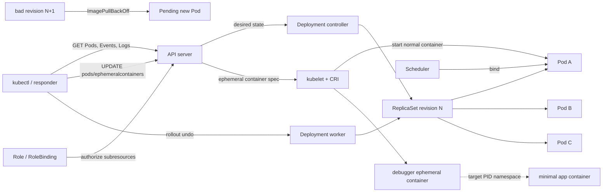

[[Home]]

# Weekly Kubernetes Magazine — 最小イメージを「壊さず、証拠を残して」診断する

> **今週の評価基準**：シェルや診断ツールを含まない実行中Podに対し、通常の観測を先に行い、必要最小権限のEphemeral Containerを追加してPID namespaceを調査し、証拠に基づいてDeploymentをロールバックできること。

> [!danger] apply / patch / rollout undo / delete 前の安全確認
> この演習はNamespace、Deployment、RBACオブジェクトの作成、実行中PodへのEphemeral Container追加、意図的な失敗Rollout、Pod/Namespace削除を含む。**共有・本番クラスタでは実行しない**。各変更の直前に次を実行し、contextとNamespaceを声に出して確認する。
> ```bash
> kubectl config current-context
> kubectl config view --minify --output 'jsonpath={..namespace}{"\n"}'
> kubectl get ns k8s-ephemeral-lab 2>/dev/null || true
> ```
> Ephemeral Containerは追加後に変更・削除できない。対象Podを取り違えないこと。サンプルへ実在のトークン、パスワード、証明書、顧客データ、Secret値を貼らない。デバッグ出力にも機密が現れ得るため、保存・共有前にマスキングする。

# 1. Focus、難易度、前提、到達点

## 難易度シグナル

**Specialized** — 参加資格ではなく目安。Podのnamespace分離、`pods/ephemeralcontainers` サブリソース、インシデント証拠の扱いを同時に考えるため専門性が高い。

## 必要な知識・ツール・環境

- **知識**：Podは使い捨てであり、DeploymentがReplicaSetを介して望ましいPod数を調整すること。container、Pod、Linux PID namespaceの違い。
- **以前の概念**：`kubectl describe` のEvents、`kubectl logs --previous`、Deploymentのrevisionと`rollout undo`、Role/RoleBinding。
- **ツール**：クラスタと互換性のある`kubectl`、テキストエディタ、150分程度。
- **クラスタ要件**：Kubernetes v1.25以上（Ephemeral Containersはv1.25からStable）、通常のPodを実行できる非本番クラスタ、`registry.k8s.io`からイメージをpull可能、Ephemeral ContainerをサポートするCRI runtime。
- **権限**：ラボ作成者は専用Namespace内のDeployment/RBAC作成権限を持つこと。診断担当者の最小権限は後述する。
- `--target`による別containerのprocess namespace参照はruntime依存。見えない場合も「失敗」と決めつけず、runtime制約を証拠として記録する。

## 測定可能な到達点

完了時に次を実演できる。

1. 5分以内に `get → describe → events → logs` の順で初期証拠を取得する。
2. シェルなしイメージで`exec`が失敗する理由を説明する。
3. `kubectl debug --target --profile=general`でEphemeral Containerを追加し、対象containerのprocessを確認する。
4. `pods/ephemeralcontainers`だけを明示したRBACを説明し、`auth can-i`で検証する。
5. 失敗Rolloutを検知し、revisionとEventsを保存してから3分以内に`rollout undo`する。
6. 復旧後、Available replicasが3/3で安定したことを確認し、インシデント記録を残す。

## 学習レイヤー

1. **Foundation**：Ephemeral Containerとreconciliationのメンタルモデル
2. **Practical implementation**：最小イメージPodの観測と安全な診断
3. **Production concerns**：RBAC、監査、Pod Security、コスト、証拠保全
4. **Optional advanced challenge**：restrictedプロファイルとAdmission Policyによる診断経路の統制

# 2. 本番シナリオ、SLO、故障仮説

決済基盤の補助workerは攻撃面を減らすため、シェルを含まない最小イメージで3 replica稼働している。新revisionを配布すると新Podが`ImagePullBackOff`になり、古いPodは稼働を続けている。別件として、稼働中の旧Podでprocess状態を確認したいが、`kubectl exec -- sh`は使えない。

### SLO / 運用目標

- **可用性SLO**：30日窓で99.9%。ラボの代理指標は`AvailableReplicas=3`。
- **変更SLO**：rollout開始から5分以内に成功、または自動/手動で中止判断。
- **診断SLO**：検知5分以内に初期証拠を固定し、15分以内に「配布障害か実行時障害か」を分類。
- **復旧目標**：失敗判定後3分以内に直前revisionへ戻す。

### 故障仮説

- H1：新イメージ名またはtagが存在せず、kubeletがpullできない。
- H2：アプリprocessは生きているが、最小イメージなので`exec`による診断ができない。
- H3：Ephemeral Containerを追加できても、runtimeが`--target`を十分にサポートせず対象processが見えない。
- H4：診断者のRBACに`pods/ephemeralcontainers`の`update`がなく、API serverが拒否する。
- H5：強すぎるdebug profileがPod Security/Admissionに拒否される、または不要な権限を与える。

# 3. Control Planeとreconciliationのメンタルモデル

`kubectl apply`はPodを直接「起動」しない。API serverに望ましい状態を書き、Deployment controllerがReplicaSetを、ReplicaSet controllerがPodを調整し、schedulerがNodeを決め、kubelet/CRIがイメージとcontainerを実行する。

Ephemeral Containerは通常containerと異なる。

- 既存Podの通常の`spec.containers`へ追記するのではなく、APIの **`pods/ephemeralcontainers`サブリソース**経由で追加される。
- 一度追加したEphemeral Containerは変更・削除できない。Podを削除すると一緒に消える。
- restartされず、readiness/liveness probeやportを持てず、リソース保証も通常containerと同じ形では指定できない。アプリ機能に使わない。
- DeploymentのPod templateは変わらない。ReplicaSetがreplacement Podを作ればdebug containerは引き継がれない。

## 証拠の読み分け

| 証拠 | 主に答える問い | 注意点 |
|---|---|---|
| Pod status / containerStatuses | 今どの状態か | 原因の全履歴ではない |
| Events | scheduler/kubelet/controllerが何を試したか | namespaced、保持期間は有限 |
| logs / `--previous` | processが何を出力したか | ログがないことは正常の証明ではない |
| ReplicaSet / revision | どの変更がどのPodを作ったか | rollback前に記録する |
| Ephemeral Container | 同一Podのnamespaceから何が見えるか | 追加自体がPodへの変更で監査対象 |

# 4. 設計選択肢とトレードオフ

| 選択肢 | 利点 | 欠点 / 適用条件 |
|---|---|---|
| `get/describe/logs`のみ | 非侵襲、まず必ず行う | process、network namespace内を直接見られない |
| `kubectl exec` | 追加変更なし、簡単 | 対象イメージにshell/toolが必要。最小イメージでは失敗する |
| Ephemeral Container | 稼働Podのnetwork/PID等を現場観測できる | 変更・削除不可、監査/RBACが必要、runtime差あり |
| Podのdebug copy | 本番Podを変更せずcommand/image等を変えられる | 同一Podそのものではなく、瞬間的状態は再現されない |
| Node debug Pod | node filesystemやhost namespaceを調査可能 | blast radiusと権限が大きい。通常のアプリ診断では最後の手段 |
| アプリイメージへtoolを同梱 | いつでもexec可能 | 攻撃面、容量、脆弱性、SBOM対象が増える |

**推奨順序**は非侵襲な証拠取得 → 一般権限のEphemeral Container → 必要ならdebug copy → 明確な承認下でnode/privileged診断。`--profile=sysadmin`を反射的に使わない。

# 5. オブジェクト関係図



# 6. 150分ガイドラボ

## 時間配分

- 0–20分：環境・context・RBAC確認
- 20–50分：manifest適用とreconciliation観察
- 50–85分：非侵襲調査とEphemeral Container診断
- 85–125分：失敗注入、証拠収集、rollback
- 125–150分：セキュリティレビュー、成果物、cleanup

## Step 0 — 安全確認と作業変数（10分）

```bash
kubectl version
kubectl config current-context
kubectl cluster-info
export LAB_NS=k8s-ephemeral-lab
kubectl get ns "$LAB_NS" 2>/dev/null || true
```

**Checkpoint**：意図した非本番contextである。`kubectl version`のServerがv1.25以上。`LAB_NS`は固定文字列で、空でない。

## Step 1 — 完全manifestを保存（15分）

`ephemeral-lab.yaml`：

```yaml
apiVersion: v1
kind: Namespace
metadata:
  name: k8s-ephemeral-lab
  labels:
    pod-security.kubernetes.io/enforce: baseline
    pod-security.kubernetes.io/audit: restricted
    pod-security.kubernetes.io/warn: restricted
---
apiVersion: v1
kind: ServiceAccount
metadata:
  name: incident-responder
  namespace: k8s-ephemeral-lab
automountServiceAccountToken: false
---
apiVersion: rbac.authorization.k8s.io/v1
kind: Role
metadata:
  name: pod-incident-responder
  namespace: k8s-ephemeral-lab
rules:
  - apiGroups: [""]
    resources: ["pods"]
    verbs: ["get", "list", "watch"]
  - apiGroups: [""]
    resources: ["pods/log"]
    verbs: ["get"]
  - apiGroups: [""]
    resources: ["pods/exec"]
    verbs: ["create"]
  - apiGroups: [""]
    resources: ["pods/ephemeralcontainers"]
    verbs: ["update"]
  - apiGroups: [""]
    resources: ["events"]
    verbs: ["get", "list", "watch"]
  - apiGroups: ["apps"]
    resources: ["deployments", "replicasets"]
    verbs: ["get", "list", "watch"]
  - apiGroups: ["apps"]
    resources: ["deployments"]
    verbs: ["patch"]
---
apiVersion: rbac.authorization.k8s.io/v1
kind: RoleBinding
metadata:
  name: pod-incident-responder
  namespace: k8s-ephemeral-lab
subjects:
  - kind: ServiceAccount
    name: incident-responder
    namespace: k8s-ephemeral-lab
roleRef:
  apiGroup: rbac.authorization.k8s.io
  kind: Role
  name: pod-incident-responder
---
apiVersion: apps/v1
kind: Deployment
metadata:
  name: minimal-worker
  namespace: k8s-ephemeral-lab
  annotations:
    kubernetes.io/change-cause: "baseline pause image 3.10"
spec:
  replicas: 3
  revisionHistoryLimit: 5
  progressDeadlineSeconds: 120
  strategy:
    type: RollingUpdate
    rollingUpdate:
      maxUnavailable: 0
      maxSurge: 1
  selector:
    matchLabels:
      app.kubernetes.io/name: minimal-worker
  template:
    metadata:
      labels:
        app.kubernetes.io/name: minimal-worker
    spec:
      automountServiceAccountToken: false
      securityContext:
        seccompProfile:
          type: RuntimeDefault
      containers:
        - name: worker
          image: registry.k8s.io/pause:3.10
          imagePullPolicy: IfNotPresent
          resources:
            requests:
              cpu: 5m
              memory: 8Mi
            limits:
              cpu: 50m
              memory: 32Mi
          securityContext:
            allowPrivilegeEscalation: false
            capabilities:
              drop: ["ALL"]
            readOnlyRootFilesystem: true
            runAsNonRoot: true
      terminationGracePeriodSeconds: 10
```

### YAMLの重要点

- NamespaceのPod Security labelsは`baseline`を強制し、`restricted`との差をwarn/auditで可視化する。
- ServiceAccountは教材上のRBAC主体。tokenをPodへ自動mountしない。
- `pods/ephemeralcontainers`は`pods`とは別サブリソース。診断追加には`update`を明示する。
- `maxUnavailable: 0`は更新中も既存3 Podを利用可能に保つ。`maxSurge: 1`なので失敗中に最大4 Pod分の配置/費用が必要。
- `progressDeadlineSeconds: 120`はcontrollerが進捗停止を`ProgressDeadlineExceeded`として示す目安。自動rollbackはしない。
- `pause`はshellを含まない最小イメージを再現する教材用。実アプリではないので、可用性の代理指標はAvailable replicasとする。

## Step 2 — dry-runして適用（15分）

> [!warning] apply直前
> contextを再確認し、対象が`k8s-ephemeral-lab`だけであることを確認する。

```bash
kubectl config current-context
kubectl apply --dry-run=server -f ephemeral-lab.yaml
kubectl diff -f ephemeral-lab.yaml || true
kubectl apply -f ephemeral-lab.yaml
kubectl -n "$LAB_NS" rollout status deployment/minimal-worker --timeout=120s
kubectl -n "$LAB_NS" get deploy,rs,pods -o wide
```

**期待出力（名前/時刻は変動）**：

```text
deployment "minimal-worker" successfully rolled out
NAME                             READY   UP-TO-DATE   AVAILABLE
deployment.apps/minimal-worker   3/3     3            3
```

**Checkpoint**：Podが3つ`Running`、Deploymentが`AVAILABLE 3`。失敗時は先へ進まず、`describe`とEventsを確認する。

## Step 3 — RBACを検証（10分）

```bash
kubectl auth can-i update pods/ephemeralcontainers \
  -n "$LAB_NS" \
  --as=system:serviceaccount:${LAB_NS}:incident-responder
kubectl auth can-i delete pods \
  -n "$LAB_NS" \
  --as=system:serviceaccount:${LAB_NS}:incident-responder
kubectl auth can-i get secrets \
  -n "$LAB_NS" \
  --as=system:serviceaccount:${LAB_NS}:incident-responder
```

**期待値**：順に`yes`、`no`、`no`。`--as`にはimpersonate権限が必要。禁止された場合はクラスタ管理者による確認が必要であり、権限を広げて回避しない。

## Step 4 — 非侵襲の初期証拠（15分）

```bash
export POD_NAME=$(kubectl -n "$LAB_NS" get pod \
  -l app.kubernetes.io/name=minimal-worker \
  -o jsonpath='{.items[0].metadata.name}')
printf 'TARGET=%s/%s\n' "$LAB_NS" "$POD_NAME"

kubectl -n "$LAB_NS" get pod "$POD_NAME" -o wide
kubectl -n "$LAB_NS" describe pod "$POD_NAME"
kubectl -n "$LAB_NS" get events --sort-by=.metadata.creationTimestamp
kubectl -n "$LAB_NS" logs "$POD_NAME" -c worker --tail=50 || true
kubectl -n "$LAB_NS" get pod "$POD_NAME" -o yaml > before-debug-pod.yaml
```

`POD_NAME`を表示してから操作するのは取り違え防止。pause containerのログは空でもよい。空のログだけで健全性を断定しない。

## Step 5 — `exec`の限界を確認（5分）

```bash
kubectl -n "$LAB_NS" exec "$POD_NAME" -c worker -- sh
```

**期待**：`sh`が存在せず、execが失敗する。これはPod停止ではなく、イメージにshellがないという証拠である。

## Step 6 — Ephemeral Containerを追加して観測（25分）

> [!warning] 追加直前
> Ephemeral Containerは後から消せない。`TARGET`をもう一度読み、`general` profileを使う。実シークレットをコマンドや出力へ含めない。

対話切断を避けるため、まず非対話で追加する。

```bash
printf 'TARGET=%s/%s\n' "$LAB_NS" "$POD_NAME"
kubectl -n "$LAB_NS" debug pod/"$POD_NAME" \
  --container=debugger \
  --image=registry.k8s.io/busybox:1.36.1 \
  --target=worker \
  --profile=general \
  --attach=false -- sleep 1800

kubectl -n "$LAB_NS" get pod "$POD_NAME" \
  -o jsonpath='{range .spec.ephemeralContainers[*]}{.name}{"\t"}{.image}{"\t"}{.targetContainerName}{"\n"}{end}'
kubectl -n "$LAB_NS" exec "$POD_NAME" -c debugger -- ps
kubectl -n "$LAB_NS" describe pod "$POD_NAME"
```

**期待出力の要点**：

```text
debugger  registry.k8s.io/busybox:1.36.1  worker
PID   USER     TIME  COMMAND
...             /pause
...             sleep 1800
...             ps
```

PIDや表示形式はruntimeで異なる。`/pause`が見えない場合：

1. `describe`でdebuggerが起動したか確認。
2. `targetContainerName`が`worker`か確認。
3. Node/runtimeの`--target`サポート差として記録。
4. 勝手に`sysadmin`へ昇格しない。必要ならPod copyを別手順として承認する。

**Checkpoint**：`before-debug-pod.yaml`と現在のPodを比較し、`.spec.ephemeralContainers`だけが追加されたことを説明できる。

## Step 7 — 失敗注入：存在しないimageをrollout（20分）

> [!danger] patch直前
> context、Namespace、Deployment名を確認する。この操作は意図的に新revisionを失敗させる。`maxUnavailable: 0`により既存3 replicaが残る設計だが、クラスタ容量や別障害は保証されない。

```bash
kubectl config current-context
kubectl -n "$LAB_NS" get deployment minimal-worker
kubectl -n "$LAB_NS" annotate deployment minimal-worker \
  kubernetes.io/change-cause='incident drill: nonexistent image tag' --overwrite
kubectl -n "$LAB_NS" set image deployment/minimal-worker \
  worker=registry.k8s.io/pause:does-not-exist-incident-drill

kubectl -n "$LAB_NS" rollout status deployment/minimal-worker --timeout=150s || true
```

**期待**：statusはtimeoutまたはprogress deadline超過。既存3 Podは維持され、新Podが`ImagePullBackOff`になる。

## Step 8 — 証拠駆動incident判定（10分）

```bash
kubectl -n "$LAB_NS" get deploy,rs,pods -o wide | tee incident-objects.txt
kubectl -n "$LAB_NS" rollout history deployment/minimal-worker | tee rollout-history.txt
kubectl -n "$LAB_NS" describe deployment minimal-worker | tee incident-deployment.txt
kubectl -n "$LAB_NS" get events --sort-by=.metadata.creationTimestamp | tee incident-events.txt
kubectl -n "$LAB_NS" get pods \
  -o custom-columns='NAME:.metadata.name,PHASE:.status.phase,WAITING:.status.containerStatuses[0].state.waiting.reason,IMAGE:.spec.containers[0].image'
```

**判定**：新ReplicaSetのPodだけが`ErrImagePull`/`ImagePullBackOff`、旧ReplicaSetは3 AvailableならH1を支持する。アプリprocessのクラッシュではない。`ImagePullBackOff`は原因名の最終回答ではないため、Eventsのregistry応答も記録する。

## Step 9 — rollbackと検証（10分）

> [!danger] undo直前
> `rollout history`で戻り先を確認する。複数変更がある実環境では`--to-revision=N`を明示する。

```bash
kubectl config current-context
kubectl -n "$LAB_NS" rollout history deployment/minimal-worker
kubectl -n "$LAB_NS" rollout undo deployment/minimal-worker
kubectl -n "$LAB_NS" rollout status deployment/minimal-worker --timeout=120s
kubectl -n "$LAB_NS" get deployment minimal-worker \
  -o jsonpath='{.status.readyReplicas}{" ready / "}{.spec.replicas}{" desired; image="}{.spec.template.spec.containers[0].image}{"\n"}'
kubectl -n "$LAB_NS" get pods -o wide
```

**期待**：`3 ready / 3 desired; image=registry.k8s.io/pause:3.10`。2分間隔で2回確認し、瞬間的回復ではなく安定を確認する。

```bash
kubectl -n "$LAB_NS" get deployment minimal-worker
# 2分後に同じコマンドを再実行
```

## Step 10 — cleanup（10分）

証拠ファイルを確認してから削除する。

```bash
ls -l before-debug-pod.yaml incident-objects.txt rollout-history.txt incident-deployment.txt incident-events.txt
kubectl config current-context
kubectl get ns "$LAB_NS"
kubectl delete namespace "$LAB_NS" --wait=true
kubectl get ns "$LAB_NS" 2>/dev/null || echo "namespace removed"
```

> [!danger] deleteの意味
> Namespace削除は中のPod、RBAC、Deployment等を一括削除する。変数が空でないことと、表示された名前が`k8s-ephemeral-lab`であることを確認してから実行する。Ephemeral Container単体は削除できないため、ラボではNamespace/Podの削除で片付ける。

# 7. kubectlとYAMLを丁寧に読む

- `kubectl debug pod/$POD_NAME`：対象Podの`ephemeralcontainers`サブリソースを更新する。単なるreadではない。
- `--target=worker`：debuggerを対象containerのprocess namespaceへ向ける。network namespaceはもともとPod内で共有されるが、process可視性にはtarget/runtime対応が関係する。
- `--profile=general`：汎用的なdebug profile。profile未指定時のlegacy依存を避ける。
- `--attach=false -- sleep 1800`：作成と接続を分離し、再現可能にする。Ephemeral Containerは終了しても自動restartされない。
- `kubectl exec ... -c debugger`：追加済みdebugger内でcommandを実行する。対象app imageにtoolを追加したわけではない。
- `rollout status --timeout`：成功するまで無限に待たず、SLOに沿って判定時間を固定する。
- `set image`：Pod templateを変えるので新Deployment revision/ReplicaSetを作る。
- `rollout undo`：DeploymentのPod templateを過去revisionへ戻すAPI更新。既存Podを直接書き換える操作ではない。
- `automountServiceAccountToken: false`：不要なAPI token露出を減らす。診断者の認証情報をdebug Podへ埋め込まない。

# 8. Incident exercise：証拠、判断、rollback

以下のタイムラインを埋める。

| 時刻 | 観測 | 証拠 | 仮説への影響 | 次の安全な操作 |
|---|---|---|---|---|
| T0 | rollout開始 | history/change-cause | H1候補 | statusを監視 |
| T+? | 新Pod待機 | pod status | H1支持 | Eventsを見る |
| T+? | pull失敗 | kubelet Event | H1強く支持 | 旧replica数確認 |
| T+? | 旧3 Pod Available | Deployment/RS | SLO維持中 | rollback決定 |
| T+? | 3/3復旧 | rollout status | 復旧を支持 | 2回目確認 |

**証拠駆動ルール**：

1. 最初からEphemeral Containerを入れない。control planeの証拠で分類できるか先に試す。
2. failure injection後に稼働旧Podへdebuggerが残っていても、新ReplicaSetのpull障害の原因にはならない。revision境界を意識する。
3. rollback前にhistory、Deployment、Eventsを保存する。rollback後は一部の状態が上書き/期限切れになる。
4. 復旧判定はcommandのexit code、3/3 ready、正しいimage、時間を置いた再確認の組で行う。

# 9. Production concerns

## Security / RBAC

- Ephemeral Container追加は任意image/codeを既存Podのnamespaceで動かす強い能力。`pods/ephemeralcontainers`を日常のdeveloper Roleへ広く配らない。
- `pods/exec`と`pods/ephemeralcontainers`は別々に付与・監査する。Secretのread権限は不要。
- 本番は人間のUser/Groupまたは短命なJIT権限へRoleBindingし、共有ServiceAccount tokenを配らない。
- API audit logでrequest user、namespace、Pod、subresource、image、時刻を追跡できるようにする。
- private registryや社内承認済みdebug imageをdigest pinし、SBOM/署名/脆弱性スキャンを適用する。
- `general`/`baseline`/`restricted`を優先し、`netadmin`や`sysadmin`は追加capabilityの必要性と承認を記録する。

## Namespace / context

- 全commandに`-n "$LAB_NS"`を付け、current namespaceの暗黙値に依存しない。
- promptやwrapperにcontext/namespaceを表示する。本番contextではbreak-glass手続きを要求する。
- 同名Podが複数あるためlabelから取得しても、最終的な`POD_NAME`を表示して人が照合する。

## Resource / cost

- Ephemeral Containerに通常の`resources`保証を設定できないため、CPU/メモリを大量消費するtoolは元Podを圧迫し得る。
- 大きなdebug imageのpullは時間、registry egress、node diskを消費する。承認済みの小さなimageを事前cacheする選択肢がある。
- `maxSurge: 1`は1 Pod分の余剰容量を要する。常時容量がないクラスタではrollout自体がPendingになる。
- packet capture、core dump、filesystemコピーは機密情報とストレージ費用を増やす。保存期間、暗号化、アクセス制御を決める。

## 運用上の限界

- 既に終了済みcontainerでは`--target`してもprocessは存在しない。`logs --previous`、Events、debug copyを使い分ける。
- static PodはEphemeral Container非対応。
- Ephemeral Containerは再起動保証がない。監視sidecarや常設agentとして使わない。
- debug操作が症状を変える（CPU、I/O、network、PID観測）可能性をincident記録へ残す。

# 10. 実行前警告チェック

- [ ] 非本番context名を確認した
- [ ] `LAB_NS=k8s-ephemeral-lab`が空でない
- [ ] apply前にserver-side dry-runとdiffを見た
- [ ] debug対象のPod名とcontainer名を読み上げた
- [ ] `--profile=general`で必要十分か確認した
- [ ] real Secret/credential/customer dataをmanifest・command・ログへ入れていない
- [ ] rollback先revisionをhistoryで確認した
- [ ] delete対象Namespaceを表示して確認した

# 11. 検証チェックリストと成果物

## 検証

- [ ] baselineは3/3 Available
- [ ] `exec -- sh`失敗を「shell不在」と分類した
- [ ] `before-debug-pod.yaml`を保存した
- [ ] debuggerのimage、target、profileを記録した
- [ ] `ps`で`/pause`を確認、またはruntime制約を記録した
- [ ] responderはephemeralcontainers update=yes、Secret get=no
- [ ] 失敗revisionのEventsとhistoryをrollback前に保存した
- [ ] rollback後のimageが`pause:3.10`
- [ ] 2回の観測で3/3 readyを確認した
- [ ] Namespace削除を確認した

## 具体的成果物

1. `ephemeral-lab.yaml`
2. `before-debug-pod.yaml`
3. `incident-objects.txt`
4. `rollout-history.txt`
5. `incident-deployment.txt`
6. `incident-events.txt`
7. 上記タイムラインを埋めた1ページのincident report
8. 「なぜsysadmin profileを使わなかったか」を含むRBAC/セキュリティ所見3項目

# 12. 理解度テスト

## Q1. なぜEphemeral ContainerをDeployment YAMLの`spec.template.spec.containers`へ入れないのか？

<details><summary>回答</summary>

それは通常containerとして全Podに継続配布され、診断専用・一時的という性質を失うため。Ephemeral Containerは既存Podの専用サブリソースから追加され、restart/probe/resource等の保証も通常containerと異なる。

</details>

## Q2. `pods`の`update`があれば`kubectl debug`できるか？

<details><summary>回答</summary>

権限はresource/subresource単位で評価される。少なくとも診断追加には`pods/ephemeralcontainers`サブリソースへの`update`を明示して検証する。通常の`pods`権限だけに依存しない。

</details>

## Q3. `--target=worker`を指定したのに`ps`でworker processが見えない。直ちにPod障害と言えるか？

<details><summary>回答</summary>

言えない。runtimeがtargetによるprocess namespace共有を十分サポートしていない可能性がある。debuggerの状態、targetContainerName、runtime情報を確認し、別の証拠と組み合わせる。

</details>

## Q4. `ProgressDeadlineExceeded`になればDeploymentは自動的に直前revisionへ戻るか？

<details><summary>回答</summary>

戻らない。このconditionは進捗停止を示すが、自動rollbackそのものではない。運用controllerや人間が証拠を確認し、`rollout undo`等を実行する必要がある。

</details>

## Q5. debug終了後、Ephemeral Containerだけを削除すればよいか？

<details><summary>回答</summary>

Ephemeral Containerは追加後に変更・削除できない。対象Podがcontroller管理なら、安全な再作成タイミングを判断する。ラボではNamespaceを削除して片付ける。

</details>

## 面接 / 設計質問

「本番NamespaceでEphemeral Containerを許可するbreak-glass設計を提案してください。認証主体、JIT RoleBinding、有効時間、許可debug image、Pod Security、Admission、audit、証拠保全、権限剥奪、Node debugへの昇格条件まで説明してください。」

## Follow-up challenge（任意、45–90分）

1. `--profile=restricted`で同じ診断が可能か比較する。
2. 組織承認済みdebug imageだけを許可するValidatingAdmissionPolicyまたはpolicy engineルールを設計する。
3. audit eventから`pods/ephemeralcontainers`更新を検出し、incident channelへ通知するクエリを作る。
4. `kubectl debug --copy-to`を使い、元Podを変更しない診断経路と証拠差を比較する。

# 13. 公式リファレンス（2026-10-08確認）

- [Ephemeral Containers](https://kubernetes.io/docs/concepts/workloads/pods/ephemeral-containers/)
- [Debug Running Pods](https://kubernetes.io/docs/tasks/debug/debug-application/debug-running-pod/)
- [kubectl debug reference](https://kubernetes.io/docs/reference/kubectl/generated/kubectl_debug/)
- [Debug Pods](https://kubernetes.io/docs/tasks/debug/debug-application/debug-pods/)
- [Debug Services](https://kubernetes.io/docs/tasks/debug/debug-application/debug-service/)
- [Deployments](https://kubernetes.io/docs/concepts/workloads/controllers/deployment/)
- [Using RBAC Authorization](https://kubernetes.io/docs/reference/access-authn-authz/rbac/)
- [Pod Security Standards](https://kubernetes.io/docs/concepts/security/pod-security-standards/)
- [Auditing](https://kubernetes.io/docs/tasks/debug/debug-cluster/audit/)

---

## 今週の要約

最小イメージは「診断不能」ではない。まずcontrol planeの証拠を固定し、必要な場合だけ`pods/ephemeralcontainers`の最小権限で一般profileのdebuggerを追加する。診断変更そのものを監査対象とし、revision・Events・ready replicaを根拠にrollbackと復旧判定を行うところまでが、実運用のデバッグである。
