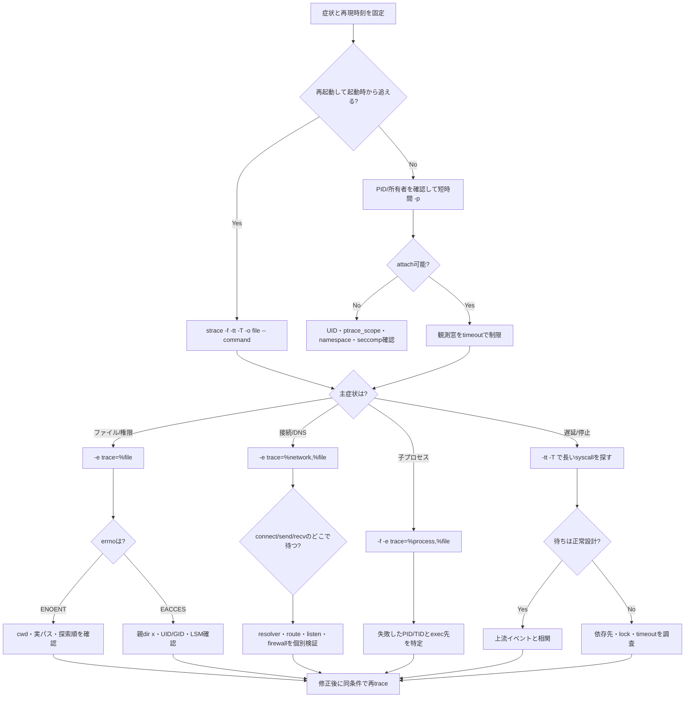

# Weekly Linux Deep-Dive — `strace` で「遅い・止まる・見つからない」を追う

#linux #commands #operations #weekly #deep-dive

[[Home]]

## 1. Weekly focus

### 今週の焦点

アプリケーションのログだけでは原因が見えないとき、`strace` でプロセスとLinuxカーネルの会話（システムコール）を観察し、次の障害を事実ベースで切り分ける。

- 設定ファイルを「置いたのに」`ENOENT` になる
- 権限がありそうなのに `EACCES` になる
- DNSや外部接続で長時間止まる
- 子プロセスを起動した直後に失敗する
- CPUは低いのに応答が遅い

**難易度シグナル: Specialized** — 初学者を締め出すラベルではない。システムコール名と大量の出力に慣れる必要がある、という目安である。

### 必要な知識・道具・環境

- 必須知識: PID、プロセス、ファイル、標準入力/出力/エラー、終了コード
- あるとよい知識: `fork`/`exec`、ソケット、DNS、シグナル、`/proc`
- 道具: Linux VMまたは検証用ホスト、Bash、`strace`、Python 3、`timeout`、`getent`
- 権限: 自分が起動したプロセスの追跡は通常可能。別ユーザーやsystemdサービスの追跡にはrootまたはptrace権限が必要な場合がある
- 前提概念: `openat()` はパスを開く、`read()`/`write()` はFDを読み書きする、`connect()` はソケット接続を開始する

> [!warning] 実施場所
> 本番プロセスへ無計画にattachしないこと。まずVM、コンテナ、開発機で行う。機密データが引数やバッファに現れる可能性がある。

### 測定可能な到達目標

終了時に次を実演できれば合格とする。

1. 60秒以内に、失敗したファイルパスとerrnoを特定できる。
2. `-e trace=`、`-p`、`-f`、`-tt`、`-T`、`-o`を目的別に選べる。
3. syscallの戻り値、errno、未完了/再開表現を読める。
4. DNS待ち、ファイル探索、子プロセス失敗を別々の観測条件で再現できる。
5. 証跡を保存し、仮説・観測・結論・改善を1枚の調査メモにまとめられる。

## 2. Mental model — `strace` が見ている境界

Linuxアプリケーションの大半は、ファイルを直接読んだりネットワークカードを直接操作したりしない。ユーザー空間のプロセスがシステムコールを発行し、カーネルに仕事を依頼する。

```text
ユーザー空間: アプリ → libc / runtime → syscall入口
                                      ↓
カーネル空間: VFS・メモリ管理・scheduler・TCP/IP・driver
                                      ↓
                              戻り値 または -1 errno
```

`strace` は主に `ptrace(2)` を利用し、syscallへ入る時点と戻る時点で対象を一時停止して、番号、引数、戻り値、シグナルなどを記録する。したがって「ソースコードが何を意図したか」ではなく「カーネルへ実際に何を依頼し、何が返ったか」が見える。

### ファイルとFD

`openat(AT_FDCWD, "/etc/myapp.conf", O_RDONLY) = 3` なら、パス探索に成功しFD 3を得た。以降の `read(3, ...)` はその開かれたファイルを読む。FD番号はプロセスごとの表への添字であり、ファイル名そのものではない。

### プロセスとスレッド

シェルやアプリは `clone()`/`fork()`/`vfork()` で子を作り、`execve()` で実行イメージを置き換える。`-f` がなければ子プロセス側の失敗を見逃す。マルチスレッドでは複数TIDの行が交差し、あるスレッドが待っている間に別スレッドが動く。

### ネットワーク

名前解決では `/etc/nsswitch.conf`、`/etc/hosts`、`/etc/resolv.conf` の読み込みに続き、DNSソケットの `sendto()`/`recvfrom()` が現れることがある。接続は `socket()` → `connect()`、通信は `sendto()`/`sendmsg()` と `recvfrom()`/`recvmsg()` が中心。TLSの暗号化後ペイロードの意味までは通常読めない。

### 待ち時間

`-T` は各syscall内で費やした時間、`-tt` は行の発生時刻を示す。遅い `read()` はディスクとは限らず、pipe、terminal、socketからの入力待ちかもしれない。`poll()`、`ppoll()`、`epoll_wait()`、`futex()` の長時間待ちは、設計上正常なことも多い。

## 3. Production scenario と調査仮説

### シナリオ

デプロイ後、APIワーカーの起動が約5秒遅れ、一部ホストだけ `configuration not found` を出して再起動を繰り返す。アプリログには設定名しかなく、実際に探索した絶対パスが出ない。CPU、メモリ、ディスク使用率は平常である。

### 最初の仮説

- H1: `WorkingDirectory` が想定と異なり、相対パスを別の場所で解決している。
- H2: ファイルは存在するが、親ディレクトリの検索権限がなく `EACCES`。
- H3: 設定ロード後のホスト名解決が遅く、設定問題に見えている。
- H4: 親ではなく子プロセスが設定を読むため、単一PIDの観測では欠落する。

### 調査の基本姿勢

1. 症状と時間帯を固定する。
2. 1回目は広めに証跡をファイルへ保存する。
3. errnoや長時間syscallから仮説を絞る。
4. 2回目は対象syscallだけを観測する。
5. 設定変更後、同じ観測条件で差を確認する。

## 4. `strace` と関連コマンドの深掘り

### 起動時から追う

```bash
strace -f -o /tmp/myapp.strace -- ./myapp --config config.yml
```

`--` より後ろが対象コマンド。起動前から追えるため、共有ライブラリ、設定、子プロセス、初期接続を観測できる。`-f` は子も追跡し、`-o` は大量出力を端末から分離する。

### 動作中プロセスへattachする

```bash
sudo strace -p 1234 -tt -T -o /tmp/pid-1234.strace
```

Ctrl-Cで `strace` だけを終了し、通常は対象プロセスを存続させる。ただしattach/detach時の短い停止と追跡オーバーヘッドはある。

### syscall集合で絞る

```bash
strace -e trace=%file,%network -f -- ./myapp
```

`%file` はパス名を扱うsyscall群、`%network` はネットワーク関連群をまとめて選ぶ。より狭く `-e trace=openat,statx,connect` と指定できる。

### 成功/失敗やFDで絞る

実装バージョンが対応していれば、`-e status=failed` で失敗だけ、`-e trace-fds=3,4` で特定FDだけを追える。古い版では未対応なので、保存後に `grep`/`rg` で絞る。

### 関連コマンド

- `ps -ef`, `pgrep -a`: 対象PIDとコマンドラインを確認する。
- `readlink -f /proc/PID/cwd`: 相対パスの基点となる現在ディレクトリを確認する。
- `ls -l /proc/PID/fd`: FDと実体の対応を見る。権限が必要な場合がある。
- `lsof -p PID`: 開いているファイル・ソケットをスナップショットで確認する。
- `namei -l PATH`: パス各階層の権限を確認する。
- `getent hosts NAME`: NSS設定込みで名前解決を再現する。
- `perf trace`: より低オーバーヘッドなsyscall観測候補。構文と権限は別物。
- `bpftrace`/`bcc`: 多数プロセスやカーネル全体の集約観測向け。導入と権限のハードルは高い。

## 5. 重要オプション、出力、終了コード、権限、移植性

### 重要オプション

| オプション | 意味 | 運用上の判断 |
|---|---|---|
| `-f` | 子プロセス/スレッドを追う | launcher、shell、workerでは原則付ける |
| `-ff` | PIDごとに別ファイルへ出力 | 並行処理を読み分けたいとき。`-o base` と併用 |
| `-p PID` | 動作中PIDにattach | 再起動できない対象を短時間観測 |
| `-e trace=...` | syscall/グループを選択 | 情報量と負荷を減らす最重要手段 |
| `-e signal=...` | 表示するシグナルを選択 | 終了・再起動原因の調査 |
| `-s N` | 文字列を最大Nバイト表示 | デフォルト切り詰めを緩和。秘密漏えいに注意 |
| `-yy` | FDに関連パス/ソケット情報を付加 | FD番号だけでは追いにくいとき |
| `-k` | stack traceを付加 | buildやlibunwind対応状況に依存し負荷増 |
| `-tt` | マイクロ秒までの絶対時刻 | 他ログとの時刻突合 |
| `-T` | syscall所要時間 | 待ち箇所の候補抽出 |
| `-c` | syscall回数・時間を集計 | 全体傾向。個々の引数は失われる |
| `-C` | 通常出力と集計を両方出す | 詳細と概要を残すが出力量増 |
| `-o FILE` | ファイルへ出力 | 証跡保存。本番では容量と権限を管理 |

### 1行の読み方

```text
09:15:01.123456 openat(AT_FDCWD, "/srv/app/config.yml", O_RDONLY|O_CLOEXEC) = -1 ENOENT (No such file or directory) <0.000031>
```

- `09:15:01.123456`: `-tt` による時刻
- `openat`: syscall名
- `AT_FDCWD`: 現在ディレクトリ基準
- パスとフラグ: syscall引数
- `= -1`: 失敗
- `ENOENT`: errno名。対象または途中の構成要素がない
- `<0.000031>`: `-T` によるsyscall内の所要秒

よく見るerrno:

- `ENOENT`: ファイルまたはパス構成要素がない。ライブラリ探索中の失敗は正常なこともある。
- `EACCES`: 権限不足。ファイルだけでなく親ディレクトリの `x` も確認する。
- `ECONNREFUSED`: 相手へ到達したが待受がない、または拒否された。
- `ETIMEDOUT`: 規定時間内に応答なし。
- `EAGAIN`: 今は処理できない。nonblocking I/Oでは正常制御の場合がある。
- `EINTR`: シグナルで中断。再試行されることが多い。

`<unfinished ...>` と `<... read resumed>` は、あるスレッドのsyscallが待っている間に別のスレッドの行を表示したため分割された表現で、ログ破損ではない。

### 終了コード

- `strace command` は通常、追跡対象コマンドの終了ステータスを返す。
- 対象がシグナルで終了すれば、シェルでは一般に `128 + signal番号` として見える。
- `strace` 自身のオプション誤り、attach失敗などでは非0になる。
- `timeout 10s strace ...` ではタイムアウト時の代表値は124。これは対象アプリの終了コードではない。
- パイプへ流す場合は `set -o pipefail` がないと最後のコマンドの終了コードだけになる点に注意する。

### 権限とセキュリティ

LinuxのYama `kernel.yama.ptrace_scope`、UID、capability、コンテナのseccomp/AppArmor/SELinux設定がattachを制限する。確認は次の通り。

```bash
cat /proc/sys/kernel/yama/ptrace_scope 2>/dev/null || true
```

値を安易に恒久変更せず、同一ユーザーで対象を起動し直す、検証環境で実行する、必要最小限のroot観測にする順で検討する。traceにはパス、環境由来データ、通信バッファ、トークン、個人情報が入り得る。保存先は `umask 077` で保護し、調査後に保管/削除方針へ従う。

### 移植性

`strace` はLinux固有。macOSでは `dtruss`（SIP等の制約あり）、FreeBSDでは `truss`、Solaris/illumosでは `truss` が近いが、オプションとsyscall名は互換ではない。ディストリビューションやstraceの版により `%file`、`--trace-fds`、デコード表示が異なるため `strace -V` と `man strace` を現物で確認する。コンテナ内では `CAP_SYS_PTRACE`、ホストPID namespace、seccompの制約も考慮する。

## 6. 150分の再現ラボ

### Foundation（0–30分）— syscallの形を読む

#### Step 0: 作業場所を作る

```bash
LAB_DIR="$(mktemp -d /tmp/strace-lab.XXXXXX)"
chmod 700 "$LAB_DIR"
cd "$LAB_DIR"
printf 'LAB_DIR=%s\n' "$LAB_DIR"
strace -V
```

**Checkpoint:** `/tmp/strace-lab.xxxxxx` とstraceの版が表示される。`command not found` なら、Debian/Ubuntuは `sudo apt install strace`、Fedora/RHEL系は `sudo dnf install strace` を管理方針に従って実施する。

#### Step 1: 成功するファイルアクセス

```bash
printf 'mode=production\n' > app.conf
strace -e trace=openat,read,close -s 128 -o trace-ok.log -- cat app.conf
sed -n '1,25p' trace-ok.log
```

**期待:** `openat(..., "app.conf", O_RDONLY) = 3` のような成功、`read(3, "mode=production\n", ...)`、`close(3) = 0` が見える。共有ライブラリやlocaleファイルのアクセスが先に出ても正常。

#### Step 2: 失敗とerrno

```bash
strace -e trace=%file -o trace-missing.log -- cat missing.conf
printf 'exit=%s\n' "$?"
rg 'missing.conf|ENOENT' trace-missing.log
```

**期待:** `cat` の終了コードは通常1、`openat(... "missing.conf" ...) = -1 ENOENT`。

### Practical implementation（30–95分）— 3種類の障害を分離する

#### Step 3: 相対パスとcwd

```bash
mkdir -p release/bin release/config
printf 'port=8080\n' > release/config/app.conf
(cd release/bin && strace -e trace=%file -o "$LAB_DIR/trace-cwd.log" -- cat config/app.conf || true)
rg 'config/app.conf' trace-cwd.log
```

**期待:** 実ファイルは `release/config/app.conf` にあるが、プロセスは `release/bin/config/app.conf` を探し `ENOENT`。相対パスはシェルを起動した元の場所ではなく、対象プロセスのcwdから解決される。

修正版を確認する。

```bash
(cd release/bin && strace -e trace=%file -o "$LAB_DIR/trace-cwd-fixed.log" -- cat ../config/app.conf)
rg 'app.conf' trace-cwd-fixed.log
```

**Checkpoint:** 同じファイルについて、失敗ログは `-1 ENOENT`、修正版は非負FDを返す。

#### Step 4: 子プロセスを追う

```bash
strace -o no-follow.log -- sh -c 'cat missing-child.conf' 2>/dev/null || true
strace -f -o follow.log -- sh -c 'cat missing-child.conf' 2>/dev/null || true
printf 'without-f: '; rg -c 'missing-child.conf' no-follow.log || true
printf 'with-f:    '; rg -c 'missing-child.conf' follow.log || true
```

**期待:** 実装によりshellが `exec` 最適化する場合もあるが、通常 `-f` 側で子PID付きのファイル失敗を確実に捉えやすい。差が出ない場合は次で必ず子を作る。

```bash
strace -f -e trace=process,%file -o follow-python.log -- \
  python3 -c 'import subprocess; subprocess.run(["cat","missing-child.conf"])' || true
rg 'clone|vfork|execve|missing-child' follow-python.log
```

#### Step 5: 時間を測る

```bash
strace -tt -T -e trace=clock_nanosleep,nanosleep -o trace-sleep.log -- sleep 1
cat trace-sleep.log
```

**期待:** sleep実装に応じ `clock_nanosleep(...) = 0 <約1.000...>` が見える。`-T` はwall-clock待ちを含み、CPU消費時間ではない。

#### Step 6: DNS/NSSの経路を見る

```bash
strace -f -tt -T -e trace=%file,%network -s 128 \
  -o trace-dns.log -- getent hosts example.com
rg 'nsswitch|resolv.conf|hosts|socket|connect|sendto|recvfrom' trace-dns.log | head -40
```

**期待:** 少なくともNSS関連設定ファイルが見える。systemd-resolvedやnscd経由ではローカルUnix socket通信になり、直接DNSの53/udpが見えない場合がある。この違い自体が環境の事実である。

**Checkpoint:** 「DNSが遅い」と断定する前に、どのresolver経路が使われたか説明できる。

### Production concerns（95–130分）— 低ノイズで証跡化する

#### Step 7: 実行中プロセスへ短時間attach

Terminal A:

```bash
python3 -c 'import time; print("pid-ready", flush=True); time.sleep(60)' &
TARGET_PID=$!
printf 'TARGET_PID=%s\n' "$TARGET_PID"
```

同じshellで続ける:

```bash
timeout 3s strace -p "$TARGET_PID" -tt -T \
  -e trace=clock_nanosleep,restart_syscall -o attach.log || test "$?" -eq 124
wait "$TARGET_PID" 2>/dev/null || true
sed -n '1,20p' attach.log
```

**期待:** ptraceが許可されればsleep系syscallの待ちが見える。`Operation not permitted` なら失敗を記録し、同一ユーザー・Yama・コンテナ制約を確認する。設定を弱めることをラボの必須条件にしない。

#### Step 8: 集計で仮説を作る

```bash
strace -f -c -- python3 -c '
from pathlib import Path
for _ in range(100):
    Path("app.conf").read_text()
' 2> summary.txt
cat summary.txt
```

**期待:** `openat`、`read`、`close`、`newfstatat` 等のcalls、errors、time、usecs/callが表になる。計測の摂動があるので、性能ベンチマークではなく「何が多いか」の仮説生成に使う。

#### Step 9: 安全な証跡ファイル

```bash
umask 077
TRACE_FILE="$LAB_DIR/production-style.strace"
timeout 10s strace -f -tt -T -s 128 -e trace=%file,%network \
  -o "$TRACE_FILE" -- getent hosts example.com
stat -c 'mode=%a size=%s path=%n' "$TRACE_FILE"
```

**期待:** modeは600。出力サイズを記録し、長時間観測前に増加率と空き容量を見積もる。

### Optional advanced challenge（130–150分）

次のプログラムが約2秒止まる理由を、ソースの `sleep` という文字だけに頼らずsyscall証跡から示す。

```bash
python3 - <<'PY' > mystery.py
import os, subprocess, time
if not os.path.exists("feature.flag"):
    time.sleep(2)
subprocess.run(["sh", "-c", "printf done\\n"])
PY
strace -ff -tt -T -e trace=%file,%process,%network,clock_nanosleep \
  -o mystery.trace -- python3 mystery.py
rg 'feature.flag|nanosleep|clone|vfork|execve' mystery.trace*
```

**成功条件:** (a) `feature.flag` の `ENOENT`、(b) 約2秒のsleep、(c) 子の生成と `execve` を時系列で説明する。次に `touch feature.flag` 後のtraceと比較し、2秒待ちが消えることを検証する。

## 7. トラブルシューティング決定木



## 8. Copy-ready examples（使いどころ込み）

### 例1: ファイル関連の失敗だけを最初に探す

```bash
strace -f -e trace=%file -e status=failed -o /tmp/app-file-errors.log -- ./app
```

設定やライブラリ探索の失敗候補を短時間で抽出する。ローダーが複数候補を探索する通常の `ENOENT` もあるため、最後の1行だけで結論を出さない。`status=` 非対応版では全件保存後に `rg '= -1 '` を使う。

### 例2: 絶対時刻と所要時間を同時に残す

```bash
strace -f -tt -T -o /tmp/app-timed.log -- ./app
```

アプリログや監視アラートと時刻を突合し、`<...>` が大きいsyscallを探す。全syscall追跡なので短い再現に限定する。

### 例3: 既存PIDを10秒だけ観測

```bash
sudo timeout 10s strace -p 1234 -tt -T -o /tmp/pid-1234.log
```

無期限attachを避ける。`timeout` の124と対象プロセスの状態を区別する。sudoで作ったログはroot所有になる。

### 例4: 全workerをPID別ファイルに分ける

```bash
strace -ff -o /tmp/worker.trace -- ./worker-launcher
```

`/tmp/worker.trace.PID` 群ができ、並行行の混線を避けられる。ファイル数とディスク消費に注意する。

### 例5: ネットワークsyscallだけを見る

```bash
strace -f -e trace=%network -s 256 -o /tmp/net.trace -- curl -I https://example.com
```

socket生成、connect、send/recvを追う。TLS内容は暗号化され、`curl` のDNS処理方式によってはresolver関連が別に見えるため `%file` の追加が有効。

### 例6: 特定ホストの名前解決をNSS込みで追う

```bash
strace -f -e trace=%file,%network -tt -T -o /tmp/nss.trace -- getent ahosts db.internal
```

`dig` はDNSを直接問うが、`getent` はアプリに近いNSS経路を使う。`/etc/hosts` やLDAP/mDNSなどの影響も調べたい場合に適する。

### 例7: execされた実体と探索失敗を見る

```bash
strace -f -e trace=execve -s 512 -o /tmp/exec.trace -- sh -c 'my-helper --version'
```

PATH探索で複数の `execve(...)= -1 ENOENT` が出て最後に成功することがある。実際に起動したバイナリと引数を特定できるが、引数内の秘密情報に注意する。

### 例8: syscall構成を集計する

```bash
strace -f -c -- ./batch-job 2> /tmp/batch-syscalls.txt
```

回数と時間の偏りを見て次の詳細観測対象を決める。`strace` 下では実行時間自体が変化するため、SLA判定用ベンチマークには使わない。

### 例9: 長い文字列を見つつ16進ダンプも使う

```bash
strace -s 1024 -xx -e trace=read,write -o /tmp/io.trace -- ./parser sample.bin
```

非表示文字やバイナリ入力を確認する。出力量と機密性が大幅に上がるため、小さいテストデータ限定で使う。

### 例10: シグナルによる終了を追う

```bash
strace -f -e trace=%signal -o /tmp/signals.trace -- timeout 2s sleep 30
```

どのプロセスがどのシグナルを受けたかを見る。timeout自身もプロセスなので `-f` が重要。

### 例11: FDを実体付きで読む

```bash
strace -f -yy -e trace=read,write,connect -o /tmp/fd.trace -- ./app
```

対応版では `read(3</path/file>,...)` のようにFDの対象が補足される。ログの理解が速くなる一方、パス情報の露出が増える。

### 例12: 相対パス問題とcwdを同時確認

```bash
PID=1234; readlink -f "/proc/$PID/cwd"; sudo strace -p "$PID" -e trace=%file -o "/tmp/$PID-files.trace"
```

最初にcwdをスナップショット化してからファイル探索を観測する。対象が途中で `chdir()` する可能性がある場合は `chdir,fchdir` もtrace対象に含める。

## 9. Failure injection / diagnostic challenge

### 課題: 「存在するのに読めない」

```bash
CHALLENGE_DIR="$LAB_DIR/locked"
mkdir -p "$CHALLENGE_DIR/inside"
printf 'secret=no\n' > "$CHALLENGE_DIR/inside/service.conf"
chmod 600 "$CHALLENGE_DIR/inside/service.conf"
chmod 000 "$CHALLENGE_DIR/inside"
strace -e trace=%file -o challenge-permission.log -- \
  cat "$CHALLENGE_DIR/inside/service.conf" || true
rg 'service.conf|EACCES' challenge-permission.log
```

一般ユーザーならファイル自体が600でも、親ディレクトリに検索権限 `x` がないため `EACCES` になる。rootはDACを迂回でき、再現しない場合があるのでroot shellでは実施しない。

**診断提出物:** 次を1〜3行ずつ書く。

- 仮説: どの階層のどの権限が原因か
- 証拠: syscall、対象パス、errno
- 追加確認: `namei -l "$CHALLENGE_DIR/inside/service.conf"`
- 最小修正: `chmod 700 "$CHALLENGE_DIR/inside"`
- 再検証: 同じ `strace` で成功FDを確認

復旧:

```bash
chmod 700 "$CHALLENGE_DIR/inside"
strace -e trace=%file -o challenge-fixed.log -- \
  cat "$CHALLENGE_DIR/inside/service.conf"
rg 'service.conf' challenge-fixed.log
```

## 10. Safety、rollback、破壊的操作への警告

- 本番attachは対象を短時間停止させ、syscall頻度が高いほど性能影響が増える。まず `-e` で絞り、`timeout` で観測窓を制限する。
- `-s`、`-v`、`-x/-xx` を拡大すると、パスワード、Authorization header、個人情報、鍵素材が記録され得る。
- `/tmp` は共有領域。`umask 077`、専用ディレクトリ、必要なら暗号化された保管先を使う。
- traceファイルは急増し得る。`df -h` と試験観測の増加率を確認し、ログローテーションや上限を決める。
- ptrace制限、SELinux、AppArmor、seccompを調査だけのために恒久無効化しない。
- `kill -9`、権限の全面開放 `chmod -R 777`、本番設定の直接書換えはこのワークフローに不要。
- labの後片付けは、まずパスを表示して検証する。削除が必要なら作成した `LAB_DIR` だけを対象とする。

安全な後片付け確認:

```bash
printf 'cleanup target: %s\n' "$LAB_DIR"
test -n "$LAB_DIR" && test "${LAB_DIR#/tmp/strace-lab.}" != "$LAB_DIR"
```

この確認が成功した場合のみ、必要に応じて作業ディレクトリを削除する。証跡を提出するなら削除せず、保護された場所へ移す。

### Rollback

- `chmod 000` を入れたchallengeは `chmod 700 "$CHALLENGE_DIR/inside"` で戻す。
- attachはCtrl-Cまたはtimeout終了でdetachする。対象が生存していることを `ps -p PID` で確認する。
- インストールした `strace` の削除は通常不要。組織のimmutable image方針がある場合のみ元スナップショットへ戻す。

## 11. Verification checklist と具体的deliverables

### Checklist

- [ ] `strace -V` とOS/カーネル版（`uname -a`）を記録した
- [ ] 成功する `openat()` の非負FDを説明できた
- [ ] `ENOENT` と `EACCES` を別々に再現した
- [ ] `-f` が必要な理由を子PIDの証跡で説明した
- [ ] `-tt` と `-T` の違いを説明した
- [ ] NSS/DNS経路が直接DNSかローカルresolverか確認した
- [ ] attachの権限条件を確認した
- [ ] traceファイルをmode 600で保存した
- [ ] 修正前後を同じフィルタで比較した
- [ ] traceに機密情報がないか確認し、保管期限を決めた

### Deliverables

1. `trace-cwd.log` と `trace-cwd-fixed.log`
2. `follow-python.log`
3. `trace-dns.log` とresolver経路の説明（100〜200字）
4. `summary.txt` と、最も多いsyscall上位3つの解釈
5. failure injectionの「仮説 → 証拠 → 修正 → 再検証」メモ
6. 本番適用すると仮定した観測コマンド1本と、安全制約3点

## 12. Assessment（5問）

1. `openat(...)= -1 ENOENT` が多数あるだけで障害と断定できないのはなぜか。
2. `-tt` と `-T` はそれぞれ何を測るか。
3. shellから起動したhelperの失敗が見えないとき、最初に追加すべき代表オプションは何か。
4. `read()` が5秒かかった場合、それだけでディスク遅延と断定できるか。
5. 別ユーザーのPIDへattachできないときに確認する4つの観点を挙げよ。

<details>
<summary>解答を表示</summary>

1. 動的リンカやPATH探索は複数候補を順に試し、途中の `ENOENT` が正常な探索過程になり得るため。最終的な成功、終了コード、アプリ症状との相関を見る。
2. `-tt` は各行の絶対発生時刻、`-T` は各syscall内で経過したwall-clock時間。
3. `-f`。子プロセス/スレッドを追跡する。分離出力が必要なら `-ff -o base`。
4. 断定できない。FDはsocket、pipe、terminal等かもしれず、入力待ちも含む。`-yy`、`/proc/PID/fd`、周辺syscallで実体を確認する。
5. 対象と観測者のUID、Yama `ptrace_scope`、PID namespace/CAP_SYS_PTRACE、seccomp・SELinux・AppArmor等の制約。

</details>

## 13. Follow-up challenge と公式リファレンス

### Follow-up challenge

検証用HTTPサービスを1つ起動し、正常系・接続拒否・名前解決失敗の3ケースを作る。各ケースについて `%file,%network` のtraceを取得し、次のテンプレートで比較する。

```text
症状:
再現コマンド:
最初に分岐したsyscall:
戻り値/errno:
最も長いsyscall:
追加確認コマンド:
最小修正:
修正後の証拠:
```

さらに余力があれば、同じ処理を `perf trace` でも観測し、導入条件、出力の読みやすさ、オーバーヘッド、集約性を比較する。目的は優劣決定ではなく「1プロセスの具体的引数を追うなら何を選ぶか」「ホスト全体の傾向を見るなら何を選ぶか」を言語化すること。

### 公式リファレンス

- `man 1 strace` — 使用中バージョンの正確なオプション
- `man 2 ptrace` — straceの基盤となるプロセス追跡API
- `man 2 openat`, `man 2 read`, `man 2 connect`, `man 2 execve` — 主要syscallの契約
- `man 3 errno` — errnoの意味と扱い
- `man 5 proc_pid_fd`, `man 5 proc_pid_status` — `/proc` から得られるプロセス情報
- [strace Project Documentation](https://strace.io/)
- [Linux kernel Yama documentation](https://docs.kernel.org/admin-guide/LSM/Yama.html)
- [Linux kernel seccomp userspace API](https://docs.kernel.org/userspace-api/seccomp_filter.html)
- Debian/Ubuntu: `apt show strace` とディストリビューション提供のman page
- Fedora/RHEL: `dnf info strace` とディストリビューション提供のman page

---

今週の要点は、`strace` の行を大量に眺めることではない。**症状を固定し、仮説に対応するsyscallだけを選び、戻り値・errno・時刻・所要時間を証拠として、修正前後を同条件で比較する**ことである。
