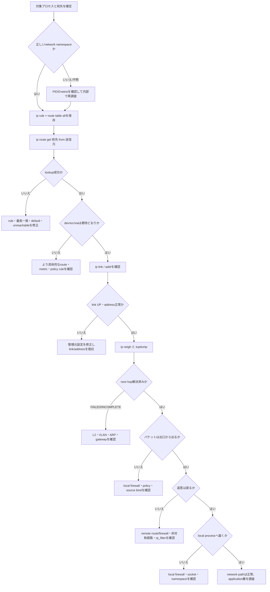

# Weekly Linux Deep-Dive — `ip route` と `ip rule` で「そのパケットはどこへ行くか」を証明する

#linux #commands #operations #weekly #deep-dive

[[Home]]

## 1. Weekly focus、難易度、前提、到達目標

### Weekly focus

今週は iproute2 の `ip route`、`ip rule`、`ip addr`、`ip link` を使い、Linuxカーネルが送信パケットの出口をどう決めるかを観測する。単に「pingが通るか」ではなく、次を区別できるようにする。

- 宛先への経路がない
- より具体的な経路やポリシールールが想定外の出口を選ぶ
- next hopへL2で到達できない
- 送信元アドレスが不適切
- forward、NAT、ファイアウォールの問題を経路問題と誤認している
- アプリが別network namespaceにいて、ホストとは異なる経路表を見ている

**難易度シグナル: Specialized** — 参加条件ではない。複数の経路表、namespace、カーネル転送を同時に扱うため、観測対象が多いという目安である。

### 必要な知識・道具・環境

- 必須知識: IPv4、CIDR、インターフェース、デフォルトルート、終了コード
- 前段概念: `ss` のLISTEN/ESTABLISHED、`ping` とTCP接続の違い、プロセスごとにnamespaceが異なり得ること
- 道具: 検証専用Linux VM、Bash、iproute2、`ping`、Python 3、`sysctl`
- 任意: `tcpdump`、`nft`、`tracepath`
- 権限: 参照だけなら一般ユーザーで可能。namespace、veth、経路変更、forward設定にはrootまたは `CAP_NET_ADMIN` が必要
- 環境: systemdの有無は問わない。ラボはIPv4のみで、外部ネットワークを使わない

> [!warning] 実施場所
> 経路、rule、`ip_forward` の変更はSSH接続を切断し得る。本番、共有ホスト、リモート接続中の唯一の管理経路では行わず、コンソールを使える検証VMで実施する。

### 測定可能な到達目標

終了時に、次を成果物で示せれば合格とする。

1. `ip route get` の結果から選択されたtable、出口、next hop、送信元を60秒以内に説明できる。
2. longest prefix matchとpolicy routingの優先順位を別々に検証できる。
3. 3つのnamespaceと2本のveth pairで、ルーターを含む閉じたネットワークを構築できる。
4. 「route」「neighbor」「forward」のどこで失敗したかを観測結果から分類できる。
5. 変更前後の証跡、復旧手順、最終構成を1つの調査メモに残せる。

## 2. Mental model — カーネルはどう出口を決めるか

アプリケーションが `connect()` や `sendto()` を呼ぶと、カーネルのネットワークスタックがパケットを作る。通常のローカル送信では概ね次の順に判断される。

```text
ユーザー空間のプロセス
  ↓ 宛先IP、宛先port（bind済みなら送信元IPも）
network namespace
  ↓ そのnamespace固有のinterface / rule / route / neighbor
Routing Policy Database（ip rule、優先度の小さい順）
  ↓ 参照するrouting tableを選択
FIB lookup（ip route、最長一致 → metric等）
  ↓ dev、via、src、MTU等を決定
Neighbor lookup（同一L2上のnext hopをMACへ解決）
  ↓ ARP
qdisc → NIC / veth → ネットワーク
```

### 重要な5つの区別

1. **ruleとroute**: `ip rule` は「どの表を見るか」、`ip route` は「その表でどの出口を選ぶか」を決める。
2. **最長一致**: `10.20.30.0/24` は `10.0.0.0/8` より具体的なので優先される。表示順では決まらない。
3. **routeとneighbor**: 経路が存在しても、next hopのMACをARPで解決できなければ送れない。
4. **localとforward**: 自ホスト宛の入力と、ルーターとして別interfaceへ転送する処理は異なる。後者は `net.ipv4.ip_forward=1` が必要。
5. **namespace**: コンテナやPodはホストと別の経路表を持つ。ホストで正常でも、そのプロセスのnamespaceでは正常とは限らない。

`ip route get` はパケットを実際に送らず、指定条件に対するカーネルの経路検索結果を問い合わせる。「たぶんeth0」ではなく、決定を直接観測できるのが強みである。

## 3. Production scenario と調査仮説

### シナリオ

二つのNICを持つAPIサーバーで、監視ネットワーク `10.20.30.0/24` からの要求には応答できるが、APIが同ネットワーク上の監視DBへ接続するとtimeoutする。デフォルトルートは業務NICにあり、監視NICにもアドレスがある。再起動後から発生し、サービス自体はLISTENしている。

### 初期仮説

- H1: 監視DB宛の具体的なrouteが消え、default routeが選ばれている。
- H2: source-based `ip rule` の優先度またはtable番号が変わった。
- H3: 正しいdevは選ばれるが、gateway/neighborを解決できない。
- H4: アプリが特定source addressへbindしており、戻り経路が非対称である。
- H5: 実行環境がnetwork namespace/コンテナ内で、ホストの経路確認が証拠になっていない。
- H6: 経路は正しく、firewall、rp_filter、remote serviceの問題である。

### 調査の順序

1. 対象プロセスのnamespaceを確定する。
2. `ip rule show` と全tableのrouteを保存する。
3. 実際の宛先・想定sourceで `ip route get` を実行する。
4. link、address、neighborを確認する。
5. packet captureで「出ていない／ARPのみ／SYNは出る／返答も来る」を分ける。
6. 読み取り観測で仮説を絞ってから、最小の変更を行う。

## 4. 主役ツールと関連コマンドの深掘り

### `ip route`

route entryは単なる「宛先とgateway」ではない。代表的な要素は次の通り。

```text
10.20.30.0/24 via 192.0.2.1 dev eth1 proto static src 192.0.2.10 metric 100
└ destination ┘  └ next hop ┘ └device┘             └ preferred src ┘
```

- `default`: `0.0.0.0/0` の別表記
- `via`: next hop。直結routeなら通常ない
- `dev`: 出力interface
- `src`: 明示的にbindされていない場合の優先送信元
- `proto`: routeを導入した主体。`kernel`、`static`、`dhcp`、routing daemonなど
- `scope link`: next hopなしでlink上に直接到達可能
- `metric`: 同じprefix長などの候補間の優先度。一般に小さい値を優先
- `table`: routeを格納する表。`main` は通常の表、`local` はローカル/ブロードキャスト用

### `ip rule`

ruleは優先度の小さい順に評価される。標準的な環境ではおおむね次がある。

```text
0:      from all lookup local
32766:  from all lookup main
32767:  from all lookup default
```

`from 10.10.1.0/24 lookup 100 priority 1000` を追加すると、その送信元に対してmainより先にtable 100を検索する。表に経路がなければ次のruleへ進む場合があるが、`unreachable` 等のroute typeやrule actionならそこで失敗する。priorityを省略すると意図しない順序になり得るので、運用では明示する。

### 関連コマンド

- `ip addr show`: interfaceのアドレス、scope、状態を確認
- `ip link show`: carrier、MTU、UP/DOWNを確認
- `ip neigh show`: ARP/NDPキャッシュの状態を確認
- `ip netns`: 名前付きnetwork namespaceの作成・実行・削除
- `ss -tpn`: 実接続のlocal/peerとプロセスを確認
- `tcpdump -ni DEV`: ARP、ICMP、TCP SYN/応答をinterfaceで観測
- `sysctl net.ipv4.ip_forward`: IPv4転送の有効/無効を確認
- `tracepath`: TTLごとの経路とPMTUの手掛かりを得る
- `nft list ruleset`: routeが正しい後にfilter/NATを確認

## 5. flags、出力、終了コード、権限、移植性

### 重要な指定

- `ip -br addr`: 1 interface 1行の簡潔表示
- `ip -details link`: link種別、詳細属性も表示
- `ip -json route show`: 機械処理向けJSON。人間向け表示の空白分割を避けられる
- `ip -4 route`: IPv4のみ。IPv6は `-6`
- `ip route show table all`: main以外も含める
- `ip route get ADDRESS`: 実際のlookup結果を問い合わせる
- `ip route get ADDRESS from SOURCE`: source-dependent ruleも含めて評価
- `ip route get ADDRESS iif DEV`: 入力interface条件を含むforwardのlookup確認
- `ip netns exec NAME COMMAND`: 指定namespace内で実行
- `ip -n NAME ...`: `ip netns exec NAME ip ...` の短縮形

### `ip route get` の読み方

```text
10.20.30.40 via 192.0.2.1 dev eth1 src 192.0.2.10 uid 1000
    cache
```

- 先頭: 問い合わせ先
- `via`: next hop
- `dev`: 選択された出口
- `src`: 選択された送信元
- `uid`: lookupに使われたユーザー条件
- `table 100`: main以外が選ばれた場合に現れることがある
- `cache`: lookup結果由来の表示。古いIPv4 route cache一覧があるという意味ではない

### neighbor state

- `REACHABLE`: 最近到達確認済み
- `STALE`: entryはあるが最近の到達確認がない。即障害とは限らない
- `DELAY` / `PROBE`: 再確認中
- `INCOMPLETE`: ARP要求中
- `FAILED`: 解決失敗。L2、VLAN、相手、next hop設定を疑う
- `PERMANENT`: 静的entry

### 終了コード

- `ip ... show` / `get`: 成功は通常0、構文誤り・対象なし・権限不足などは非0
- `ping`: iputils版では通常、応答あり0、応答なし1、その他のエラー2
- `sysctl -w`: 設定成功0、権限不足や不正keyは非0

必ず使用環境で `command; rc=$?; printf 'rc=%s\n' "$rc"` と確認する。終了コードだけで「timeout」「no route」「permission」を区別せず、標準エラーも保存する。

### 権限とportability

- `ip` はLinux/iproute2固有。BSD/macOSの `route`、`ifconfig`、`netstat -rn` と構文互換ではない。
- BusyBoxの `ip` は `-json`、一部rule/namespace機能を持たないことがある。
- network namespaceとvethはLinux固有。rootless containerでは `CAP_NET_ADMIN` が制限される。
- NetworkManager、systemd-networkd、netplan、cloud-init等が管理するrouteを `ip route add` で変更しても一時的で、再起動や再接続で消える。診断後は管理元の設定へ反映する。
- `ip route get` はカーネルのlookupを示すが、firewall、NAT、remote hostの受理まで保証しない。

## 6. 150分の再現ラボ

### Foundation（0–25分）— 現在地を読む

作業記録用ディレクトリを作る。

```bash
LAB_DIR="$PWD/linux-route-lab-2026-07-28"
mkdir -p "$LAB_DIR"
ip -Version | tee "$LAB_DIR/version.txt"
ip -br link | tee "$LAB_DIR/link-before.txt"
ip -br addr | tee "$LAB_DIR/addr-before.txt"
ip rule show | tee "$LAB_DIR/rule-before.txt"
ip route show table all | tee "$LAB_DIR/route-before.txt"
```

デフォルト経路を問い合わせる。

```bash
ip route get 198.51.100.10 | tee "$LAB_DIR/lookup-before.txt"
printf 'rc=%s\n' "${PIPESTATUS[0]}"
```

**Checkpoint A**

- `dev`、`src`、`via` の有無を説明できる。
- `ip rule` で `local` が `main` より先に評価されると確認できる。
- 記録ファイルが5つ以上ある。

期待出力は環境依存だが、lookupは概ね `198.51.100.10 via <gateway> dev <device> src <address>` となる。default routeがない隔離VMでは非0でもよい。その事実を記録する。

### Practical implementation（25–80分）— 3 namespaceの閉じたネットワーク

構成するトポロジ:

```text
client (10.10.1.2/24)
  c0 ───── r0 (10.10.1.1/24) router (10.20.1.1/24) r1 ───── s0
                                                        server (10.20.1.2/24)
```

作成前に同名namespaceがないことを確認する。

```bash
ip netns list
for ns in lm-client lm-router lm-server; do
  if ip netns list | awk '{print $1}' | grep -Fxq "$ns"; then
    echo "ABORT: namespace already exists: $ns" >&2
    exit 1
  fi
done
```

namespaceとveth pairを作る。

```bash
sudo ip netns add lm-client
sudo ip netns add lm-router
sudo ip netns add lm-server
sudo ip link add lm-c0 type veth peer name lm-r0
sudo ip link add lm-r1 type veth peer name lm-s0
sudo ip link set lm-c0 netns lm-client
sudo ip link set lm-r0 netns lm-router
sudo ip link set lm-r1 netns lm-router
sudo ip link set lm-s0 netns lm-server
```

addressとlinkを設定する。

```bash
sudo ip -n lm-client addr add 10.10.1.2/24 dev lm-c0
sudo ip -n lm-router addr add 10.10.1.1/24 dev lm-r0
sudo ip -n lm-router addr add 10.20.1.1/24 dev lm-r1
sudo ip -n lm-server addr add 10.20.1.2/24 dev lm-s0
for ns in lm-client lm-router lm-server; do sudo ip -n "$ns" link set lo up; done
sudo ip -n lm-client link set lm-c0 up
sudo ip -n lm-router link set lm-r0 up
sudo ip -n lm-router link set lm-r1 up
sudo ip -n lm-server link set lm-s0 up
```

client/serverに戻り道を含むrouteを設定する。

```bash
sudo ip -n lm-client route add default via 10.10.1.1
sudo ip -n lm-server route add default via 10.20.1.1
sudo ip netns exec lm-router sysctl -w net.ipv4.ip_forward=1
```

経路選択を送信前に確認する。

```bash
sudo ip -n lm-client route get 10.20.1.2
sudo ip -n lm-server route get 10.10.1.2
sudo ip -n lm-router route show
```

期待例:

```text
10.20.1.2 via 10.10.1.1 dev lm-c0 src 10.10.1.2
10.10.1.2 via 10.20.1.1 dev lm-s0 src 10.20.1.2
```

疎通とneighborを確認する。

```bash
sudo ip netns exec lm-client ping -c 3 -W 1 10.20.1.2
sudo ip -n lm-client neigh show
sudo ip -n lm-router neigh show
```

**Checkpoint B**

- pingのpacket lossが0%。
- clientはserverへ直接ではなく `via 10.10.1.1` を選ぶ。
- routerには両subnetが `scope link` として存在する。
- neighborにrouter側next hopが現れる。

### Production concerns（80–125分）— policy routingと観測

mainとは別のtable 100を作り、source-based ruleを追加する。ただし、まず意図したコマンドを表示して対象を確認する。

```bash
sudo ip -n lm-client route add table 100 10.10.1.0/24 dev lm-c0 src 10.10.1.2
sudo ip -n lm-client route add table 100 default via 10.10.1.1
sudo ip -n lm-client rule add priority 1000 from 10.10.1.2/32 lookup 100
sudo ip -n lm-client rule show
sudo ip -n lm-client route show table 100
```

source条件つきで決定を確認する。

```bash
sudo ip -n lm-client route get 10.20.1.2 from 10.10.1.2
sudo ip -n lm-client route get 10.20.1.2
```

`table 100` が出力されるiproute2版もある。表示されなくても、次の一時的な変更で選択を証明できる。

```bash
sudo ip -n lm-client route replace table 100 unreachable 10.20.1.2/32
sudo ip -n lm-client route get 10.20.1.2 from 10.10.1.2
printf 'rc=%s\n' "$?"
sudo ip -n lm-client route del table 100 unreachable 10.20.1.2/32
```

期待される失敗は `RTNETLINK answers: Network is unreachable` または `unreachable 10.20.1.2` 相当で、終了コードは非0。削除後、再び疎通することを確認する。

任意で2端末を使い、routerで観測しながらclientからpingする。

```bash
# 端末A: 3パケットで自動終了
sudo ip netns exec lm-router timeout 10s tcpdump -ni any -c 3 icmp

# 端末B
sudo ip netns exec lm-client ping -c 1 -W 1 10.20.1.2
```

**Checkpoint C**

- rule priority 1000がmainの32766より先にある。
- table 100単体と、ruleを適用したlookupの両方を説明できる。
- `unreachable` を入れた間だけlookup/pingが失敗し、削除後に復旧する。
- packet captureにはrequestとreplyが見える。

### Optional advanced challenge（125–150分）— 「routeは正しいのに通らない」

routerのforwardを止め、route lookupが成功しても通信は成功しない状態を作る。

```bash
sudo ip netns exec lm-router sysctl -w net.ipv4.ip_forward=0
sudo ip -n lm-client route get 10.20.1.2
sudo ip netns exec lm-client ping -c 2 -W 1 10.20.1.2
printf 'ping_rc=%s\n' "$?"
```

予想:

- `ip route get` は引き続き正常な `via` と `dev` を返す。
- routerまでのneighbor解決はできる。
- serverまでforwardされないのでpingは失敗する。

復旧:

```bash
sudo ip netns exec lm-router sysctl -w net.ipv4.ip_forward=1
sudo ip netns exec lm-client ping -c 2 -W 1 10.20.1.2
```

この差を「FIB lookupは正常だがforwarding policyが原因」と調査メモに記述する。

## 7. Troubleshooting decision tree



## 8. Copy-ready examples（解説つき）

### 例1: 変更前の全体像を保存

```bash
{ ip -br addr; ip rule show; ip route show table all; } | tee network-state.txt
```

routeだけでなくaddressとruleも同じ時点で保存する。main tableだけを見る見落としを防ぐ。

### 例2: 宛先への実効経路を確認

```bash
ip route get 203.0.113.25
```

表示される `dev`、`via`、`src` が、実際の設計と一致するか確認する。パケット送信はしない。

### 例3: 特定sourceでpolicy routingを評価

```bash
ip route get 203.0.113.25 from 192.0.2.10
```

multi-homed hostで重要。source-based ruleの有無によって例2と結果が変わり得る。

### 例4: すべてのruleを優先度順に確認

```bash
ip rule show
```

小さい番号から評価される。重複priority、mainより前の独自table、`fwmark` 条件を探す。

### 例5: main以外を含む全routeを確認

```bash
ip -4 route show table all
```

`ip route` だけでは通常mainしか見えない。policy routing調査では `table all` が出発点になる。

### 例6: 特定tableを単独で読む

```bash
ip route show table 100
```

ruleが参照する表にdefaultと直結subnetが揃っているかを見る。表番号は `/etc/iproute2/rt_tables` 等で名前を付けられる。

### 例7: linkとaddressを簡潔に読む

```bash
ip -br link
ip -br addr
```

routeの `dev` が存在してUPか、期待するsource addressが付いているかをすばやく確認する。

### 例8: next hopのL2解決を見る

```bash
ip neigh show nud failed,incomplete
```

`FAILED` / `INCOMPLETE` があればrouteより下層のARP問題を疑う。出力なしは「neighbor問題なし」の保証ではないため、全件表示も行う。

### 例9: namespace内の経路を確認

```bash
sudo ip netns exec lm-client ip route get 10.20.1.2
```

コンテナ相当の分離環境で、ホストではなく対象namespaceの判断を見る。

### 例10: プロセスが属するnetwork namespaceを確認

```bash
readlink /proc/1234/ns/net
readlink /proc/self/ns/net
```

inode表現が異なれば別namespaceである。対象PIDは実在するものに置き換え、他ユーザーの `/proc` 参照制限に注意する。

### 例11: JSONで安全に機械処理

```bash
ip -json route show table main
```

スクリプトで人間向け出力を空白分割しない。利用可能なら `jq` と組み合わせる。

### 例12: 3パケットだけ観測

```bash
sudo timeout 15s tcpdump -ni eth0 -c 3 'arp or icmp'
```

無期限captureを避ける。interface名を確認し、ARP要求のみか、ICMP replyまであるかを分ける。

### 例13: 終了コードと標準エラーを保存

```bash
ip route get 192.0.2.1 >lookup.out 2>lookup.err
rc=$?
printf 'rc=%s\n' "$rc"
```

自動化では出力文字列だけで成功判定しない。stdout、stderr、終了コードを一組の証跡にする。

### 例14: 永続化管理元の手掛かりを得る

```bash
ip route show protocol dhcp
ip route show protocol kernel
```

routeを誰が導入したかの手掛かりになる。手動修正だけで終えず、NetworkManagerやnetworkd等の管理元を特定する。

## 9. Failure injection / diagnostic challenge

次のどれか1つを、相手に原因を知らせず注入する。調査者はdecision treeと証跡だけで原因を特定する。

### Challenge A: 戻りroute欠落

```bash
sudo ip -n lm-server route del default
```

症状: requestはserverへ届くがreplyのrouteがない。復旧:

```bash
sudo ip -n lm-server route add default via 10.20.1.1
```

### Challenge B: 誤ったhost route

```bash
sudo ip -n lm-client route add unreachable 10.20.1.2/32
```

症状: defaultより `/32` が最長一致で勝ち、即座に失敗。復旧:

```bash
sudo ip -n lm-client route del unreachable 10.20.1.2/32
```

### Challenge C: router forwarding停止

```bash
sudo ip netns exec lm-router sysctl -w net.ipv4.ip_forward=0
```

症状: clientのlookupとrouterまでのARPは正常だが、転送されない。復旧:

```bash
sudo ip netns exec lm-router sysctl -w net.ipv4.ip_forward=1
```

**診断提出物**: 仮説3つ、各仮説を棄却/支持するコマンド、観測、根本原因、最小復旧、恒久対策を記載する。

## 10. Safety、rollback、破壊的操作の警告

### 安全原則

- 本番ではまず `show` / `get` / capture。`add` / `replace` / `del` は変更申請・console・rollbackを準備してから。
- `ip route flush table main`、`ip rule flush` は管理接続を失う危険が高い。本誌では実行しない。
- routeを変更する前に `ip route show table all` と `ip rule show` を保存する。
- SSH先のdefault routeを触らない。やむを得ない場合もout-of-band consoleと自動rollbackを用意する。
- `tcpdump` にはIP、port、場合によってpayloadが含まれる。保存先、権限、保持期間を管理する。
- `ip route replace` は既存entryを上書きし得る。対象prefix、table、namespaceを声に出して確認する。
- 一時変更と永続設定を混同しない。再起動後の状態はnetwork managerの設定で検証する。

### ラボのrollback

namespaceを削除すると、その中へ移動したveth、route、rule、sysctl状態も破棄される。まず対象名を確認する。

```bash
ip netns list
for ns in lm-client lm-router lm-server; do
  sudo ip netns del "$ns"
done
ip netns list
```

この削除はラボ専用namespaceに限定する。同名の既存namespaceがあった場合はラボを開始していないため、削除してはいけない。`LAB_DIR` は証跡なので自動削除せず、不要になった後に利用者が内容を確認して処理する。

## 11. Verification checklist と成果物

### Verification checklist

- [ ] 直近の経路・rule・address状態をファイルへ保存した
- [ ] 対象プロセスのnetwork namespaceを特定した
- [ ] `ip route get DEST from SOURCE` の `dev` / `via` / `src` を説明した
- [ ] longest prefix matchとmetricの役割を混同していない
- [ ] main以外のtableを確認した
- [ ] `ip neigh` でnext hop解決を確認した
- [ ] route成功と疎通成功が同義でないことをfailure injectionで示した
- [ ] 変更したroute/rule/sysctlを元へ戻した
- [ ] ラボnamespaceを削除し、同名namespaceが残っていない
- [ ] 恒久対策をNetworkManager等の管理元へ反映する方針を書いた

### Concrete deliverables

1. `network-state.txt` または同等の変更前証跡
2. client/router/serverのroute一覧
3. 正常時と障害時の `ip route get`、終了コード、ping結果
4. Mermaid decision treeを使った調査メモ
5. 「仮説 → 観測 → 判定 → 修正 → 再検証」の5列を持つ障害記録
6. 実施したrollbackと残存変更なしの確認結果

## 12. Five-question assessment

1. `default` と `/24` のrouteが同時に一致した場合、通常どちらが選ばれるか。なぜか。
2. `ip route get` が正しいgatewayを示すのに通信が失敗する原因を3つ挙げよ。
3. `ip rule` のpriority 1000と32766はどちらが先に評価されるか。
4. `ip neigh` の `FAILED` はどの層・処理の問題を強く示唆するか。
5. ホスト上の `ip route get` がコンテナの通信経路を証明しないのはなぜか。

<details>
<summary>解答を見る</summary>

1. `/24`。一致するrouteのうちprefix長が長い、より具体的なrouteが最長一致で選ばれる。
2. 例: ARP/neighbor解決失敗、interface/link down、local/forward firewall、routerのforward無効、remote側の戻りroute欠落、rp_filter、service未待受。3つでよい。
3. 1000。ruleは数値の小さいpriorityから評価される。
4. 選ばれたnext hopのIPをMACアドレスへ解決するneighbor/ARP、すなわち主にL2到達性の問題。
5. network namespaceごとにinterface、address、rule、route、neighborが分離されるため。対象プロセスと同じnamespace内で調査する必要がある。

</details>

## 13. Follow-up challenge と公式リファレンス

### Follow-up challenge

ラボのclientに2つ目の送信元アドレス `10.10.1.3/24` を追加し、次を実現する。

- `10.10.1.2` からの通信はtable 100を使う。
- `10.10.1.3` からの通信はmainを使う。
- 二つの `ip route get ... from ...` で選択差を証明する。
- ruleを誤順序にしたfailureを作り、priorityだけを修正して復旧する。
- 設定、観測、rollbackをcopy-readyなシェルスクリプトではなく、まずコマンド列と期待結果としてレビュー可能に提出する。

余力があればIPv6版を作り、ARPではなくNDP、default gatewayのlink-local address、`ip -6 route get` の違いを整理する。

### 公式リファレンス

- `man 8 ip`
- `man 8 ip-route`
- `man 8 ip-rule`
- `man 8 ip-netns`
- `man 8 ip-neighbour`
- `man 7 network_namespaces`
- [iproute2 upstream repository and documentation](https://kernel.googlesource.com/pub/scm/network/iproute2/iproute2/)
- [Linux kernel IP sysctl documentation](https://docs.kernel.org/networking/ip-sysctl.html)
- [Linux kernel network namespace documentation](https://man7.org/linux/man-pages/man7/network_namespaces.7.html)
- 利用ディストリビューションの公式NetworkManager、systemd-networkd、netplan文書

---

今週の要点は、疎通テストを繰り返すことではなく、**どのnamespaceで、どのruleが、どのtableから、どのroute・source・next hopを選んだか**を順に証明することにある。
