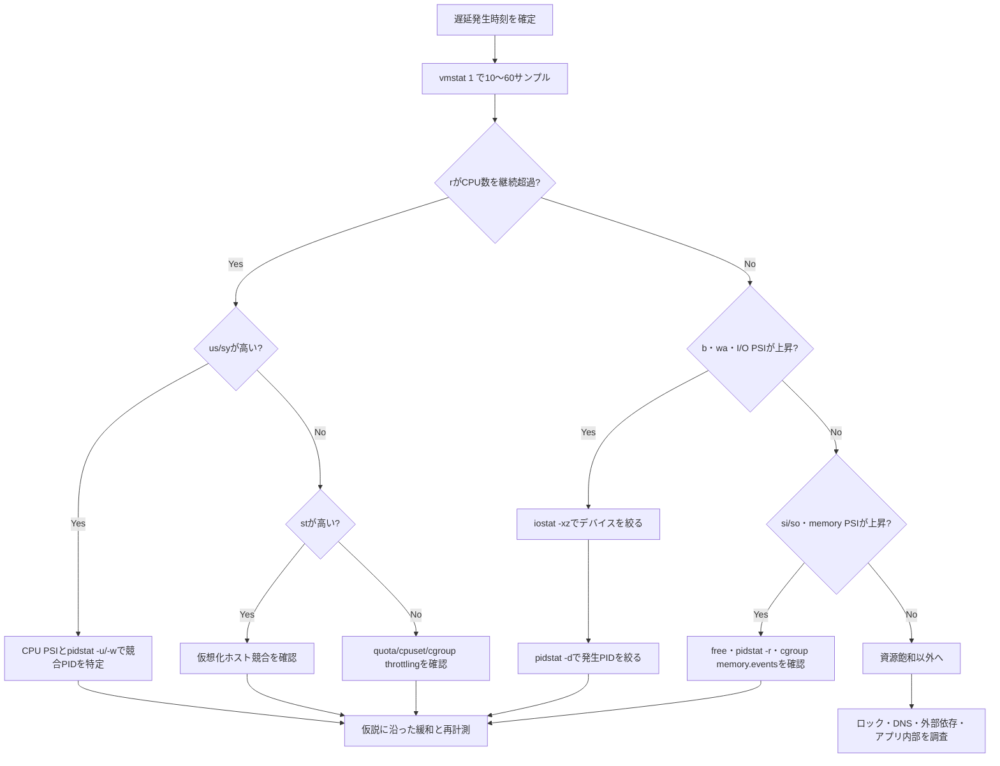

# Weekly Linux Deep-Dive — `vmstat` と PSI で「遅い」の飽和点を特定する

#linux #commands #operations #weekly #deep-dive

[[Home]]

## 1. Weekly focus、難易度、前提、測定可能な到達目標

### Weekly focus

今週は「サーバーが遅い」という曖昧な申告を、`vmstat`、`/proc/pressure/*`（PSI）、`pidstat`、`free`、`iostat` で **CPU待ち・メモリ圧力・I/O待ち・実行可能プロセス過多** に分解する。負荷値が高いというだけでCPU不足と断定せず、待たされている資源と、その待ちを発生させるプロセスを結び付ける。

**難易度シグナル: Intermediate** — 参加条件ではなく、複数の時系列指標を相関させる必要があるという目安である。

### 必要な知識・道具・環境

- 必須知識: PID、プロセス、CPU、RAM、swap、ブロックI/O、終了コード
- 前段概念: `journalctl --since` で障害時間を切れること、`strace` は個別プロセスのシステムコールを見る道具であること
- 環境: 破棄可能なLinux VMを推奨。2 CPU以上、RAM 2 GiB以上、空きディスク1 GiB以上
- 道具: Bash、procps-ng（`vmstat`, `free`）、`/proc`、Python 3。追加推奨: sysstat（`pidstat`, `iostat`）
- 権限: 基本観測は一般ユーザーで可能。別ユーザーの詳細、cgroup操作、drop_cachesには追加権限が必要

### 測定可能な到達目標

終了時に次を実演できれば合格である。

1. `vmstat 1` の最初の行を平均値として除外し、その後10サンプルを採取できる。
2. `r`, `b`, `si/so`, `bi/bo`, `us/sy/id/wa/st` を説明し、ボトルネック仮説を1つ立てられる。
3. PSIの `some` と `full`、`avg10` と `total` の違いを説明できる。
4. システム全体の兆候を `pidstat` でプロセスへ絞り込める。
5. 負荷生成を停止し、残存プロセス・一時ファイル・swap状態を検証できる。

## 2. メンタルモデル：実行・待機・回収

Linuxカーネルのスケジューラは、実行可能なタスクをCPUへ割り当てる。CPUを使いたいタスクがCPU数を継続的に上回ればrun queueが伸び、`vmstat` の `r` とCPU PSIが上がる。一方、タスクがディスクI/O完了を待つと実行できず、`b` や `wa` が増え得る。

メモリは「freeが少ない＝異常」ではない。カーネルは空きRAMをページキャッシュに使い、必要なら回収する。問題は回収が間に合わず、プロセスがreclaimやswap-inを待つことだ。`free` は容量のスナップショット、`vmstat` は流量、PSIはタスクが資源不足で止められた時間を示す。

```text
userspace process
   ├─ runnable ──> scheduler/run queue ──> CPU
   ├─ blocked  ──> block layer/filesystem ──> storage
   └─ reclaim  ──> page cache/swap ──> memory pressure

/proc/stat, /proc/vmstat ──> vmstat
/proc/pressure/{cpu,memory,io} ──> PSI
/proc/<PID>/stat, status, io ──> pidstat
```

PSIの `some` は少なくとも1タスクが待った時間、`full` は実行可能な非idleタスクがすべて同時に止まった時間である。CPUには `full` 行が通常ない。`avg10=12.00` は直近10秒の約12%でstallが観測されたという意味で、CPU使用率12%とは違う。`total` は起動後の累積マイクロ秒であり、差分を取って使う。

## 3. 本番シナリオと調査仮説

APIのp95レイテンシが13:05から200 ms→4 sへ悪化した。CPU使用率グラフは55%、load averageは12、メモリ使用率は92%。同時刻にバックアップジョブが動いた。

仮説を競合させる。

- H1: CPU競合。`r` がCPU数を継続超過し、CPU PSI `some` が上昇する。
- H2: ストレージ飽和。`b`, `wa`, I/O PSIが上がり、`pidstat -d` でバックアップの書き込みが突出する。
- H3: メモリ圧力。`available` が減り、`si/so` とmemory PSIが上がる。
- H4: 仮想化ホスト競合。ゲストの `st` が増える。
- H5: 資源飽和ではない。主要指標が平常なら、ロック、DNS、外部依存、アプリ内部へ調査を移す。

単一スナップショットではなく、障害時間を含む同一時間軸の10〜60サンプルを取り、まずH1〜H5を絞る。

## 4. `vmstat` の深掘りと関連コマンド

`vmstat [delay [count]]` はプロセス、メモリ、swap、I/O、割り込み、CPUの差分統計を低負荷で並べる。`vmstat 1 11` の1行目は起動後平均、残り10行が1秒間隔の現在値である。調査ではヘッダーと時刻も証跡に残す。

主要フィールド:

- `r`: 実行中または実行待ち。継続的に論理CPU数を超えるならCPU競合候補。
- `b`: 割り込み不能スリープのタスク。多くはI/O待ちだが、必ずディスクとは限らない。
- `swpd`: 使用中swap容量。存在だけでは異常でない。`si`, `so` の継続発生を見る。
- `free`, `buff`, `cache`: 空き、バッファ、ページキャッシュ。判断には `free -h` の `available` も使う。
- `si`, `so`: 毎秒のswap-in/out。単位は実装・表示オプションをman pageで確認する。
- `bi`, `bo`: ブロックデバイスからの受取/送出量。デバイスのIOPSやレイテンシではない。
- `in`, `cs`: 毎秒の割り込み、コンテキストスイッチ。単独の万能閾値はない。
- `us`, `sy`: userspace/kernelで使ったCPU時間率。
- `id`: idle率。I/O待ち時間は通常ここから分離される。
- `wa`: I/O完了待ち中にCPUがidleだった時間率。「CPUの何%がディスク処理中」ではない。
- `st`: ハイパーバイザーに奪われた時間率。物理ホストでは通常0。

関連コマンドの役割:

- `free -h`: 現在の容量、とくに `available` とswapを確認。
- `cat /proc/pressure/{cpu,memory,io}`: stall時間を資源別に確認。
- `pidstat -u -r -d -w 1`: CPU、ページフォルト/メモリ、I/O、コンテキストスイッチをPID別に時系列表示。
- `iostat -xz 1`: デバイス別にキュー、待ち時間、利用率を確認。
- `uptime`: load averageを入口として見る。ただし原因判定には使わない。
- `ps -eo state,pid,ppid,comm,wchan:32`: タスク状態とカーネル内待ち場所の手掛かり。

## 5. フラグ、終了コード、権限、移植性

### 重要フラグ

- `vmstat -w`: 幅広表示。桁あふれを避けやすい。
- `vmstat -S M`: メモリ単位をMiB相当に変更。比較時は単位を記録する。
- `vmstat -s`: イベント累積値。2回取得して差分を見る用途。
- `vmstat -d`: ディスク統計。詳細なレイテンシには `iostat -x` を優先。
- `pidstat -p PID`: 対象PIDを限定。`-p ALL` は全タスク。
- `pidstat -u -r -d -w`: CPU、メモリ、I/O、タスク切替を選ぶ。
- `iostat -x -z`: 拡張統計、活動のないデバイスを非表示。
- `iostat -y`: 起動後平均の最初のレポートを省略（interval指定時）。

### 終了コード

正常終了は通常0、無効なオプションや読み取り失敗は非0。`timeout 15s vmstat 1` は時間切れで通常124になるため、それを障害と誤認しない。パイプでは末尾コマンドの終了コードだけが返るのが標準なので、採取スクリプトでは `set -o pipefail` と `${PIPESTATUS[*]}` を使う。

### 権限と可視性

`/proc/pressure` と集計値は通常読めるが、`hidepid` 付き `/proc`、コンテナPID namespace、cgroup境界により他プロセスが見えない場合がある。コンテナ内の値はホスト全体と一致しないことがある。`sudo` を付ける前に、どのnamespace/cgroupを観測したいか決める。

### 移植性

`vmstat` の列・単位・初回行の意味はOS実装で異なる。ここではLinux procps-ngを前提とする。PSIはLinux 4.20以降が目安で、カーネル設定や環境により `/proc/pressure` がない。macOS/BSDの `vm_stat`/`vmstat` は別物。`pidstat`, `iostat` はsysstatパッケージで、最小コンテナにはない。フィールド定義は必ず対象ホストの `man vmstat`, `man proc_pressure`, `man pidstat`, `man iostat` を正とする。

## 6. 150分の再現ラボ

> **安全条件:** 本番、共有ホスト、バッテリー駆動端末では行わない。破棄可能VMで実施し、別ターミナルを緊急停止用に確保する。

### Phase A — Foundation（25分）

作業領域と基準値を作る。

```bash
LAB_DIR=$(mktemp -d /tmp/linux-pressure-lab.XXXXXX)
printf 'LAB_DIR=%s\n' "$LAB_DIR"
nproc
free -h
vmstat -w 1 6 | tee "$LAB_DIR/vmstat-baseline.txt"
for f in cpu memory io; do printf '\n[%s]\n' "$f"; cat "/proc/pressure/$f"; done | tee "$LAB_DIR/psi-baseline.txt"
```

期待: `vmstat` はヘッダー、起動後平均1行、現在値5行。アイドルVMなら後続行の `id` は概ね高く、PSIの短期平均は低い。ただし共有基盤ではゼロを保証しない。

**Checkpoint A:** CPU数、`available`、通常時の `r`/`wa`、PSI avg10を記録した。

### Phase B — Practical implementation: CPU競合（30分）

CPU数+2個の計算ワーカーを、最大45秒で起動する。

```bash
WORKERS=$(( $(nproc) + 2 ))
timeout 45s python3 - "$WORKERS" <<'PY' &
import multiprocessing as mp, sys
def burn():
    x = 1
    while True:
        x = (x * 1103515245 + 12345) & 0x7fffffff
ps = [mp.Process(target=burn) for _ in range(int(sys.argv[1]))]
for p in ps: p.start()
for p in ps: p.join()
PY
LOAD_PID=$!
vmstat -w 1 16 | tee "$LAB_DIR/vmstat-cpu.txt"
cat /proc/pressure/cpu | tee "$LAB_DIR/psi-cpu.txt"
wait "$LOAD_PID"; rc=$?; printf 'load_exit=%s (timeoutなら124が正常)\n' "$rc"
```

期待: `r` が基準値より増え、`us` が上昇し、`id` が低下する。ワーカー過多ならCPU PSI `some` も上がる。環境差はあるため絶対値ではなく基準値との差を見る。

sysstatがあれば再実行し、別ターミナルで次を採る。

```bash
command -v pidstat && pidstat -u -w 1 10
```

**Checkpoint B:** CPU競合を `r + us/id + CPU PSI` の3点で説明し、ワーカーPIDを特定した。

### Phase C — Production concerns: I/Oとメモリ（40分）

まずファイルシステムと空き容量を確認する。空き1 GiB未満ならI/O注入を省略する。

```bash
df -hT "$LAB_DIR"
dd if=/dev/zero of="$LAB_DIR/io.bin" bs=4M count=128 conv=fdatasync status=progress &
DD_PID=$!
vmstat -w 1 12 | tee "$LAB_DIR/vmstat-io.txt"
wait "$DD_PID"; printf 'dd_exit=%s\n' "$?"
command -v iostat && iostat -xz -y 1 5
```

期待: `bo` が上昇する。高速・キャッシュされたストレージでは `wa` やI/O PSIがほぼ増えないことも重要な結果である。「書いた」だけで「飽和」とは限らない。

次にRAMの約10%、上限256 MiBを20秒保持する。OOMを避け、計算したサイズを目視してから実行する。

```bash
MEM_MB=$(awk '/MemAvailable:/ {m=int($2/1024/10); if(m>256)m=256; if(m<32)m=32; print m}' /proc/meminfo)
printf 'allocate=%s MiB\n' "$MEM_MB"
python3 - "$MEM_MB" <<'PY' &
import sys,time
n=int(sys.argv[1])
x=bytearray(n*1024*1024)
for i in range(0,len(x),4096): x[i]=1
time.sleep(20)
PY
MEM_PID=$!
vmstat -w 1 12 | tee "$LAB_DIR/vmstat-memory.txt"
free -h
cat /proc/pressure/memory
wait "$MEM_PID"
```

期待: `free`/`available` が変化するが、安全な量ではswapやmemory PSIが上がらない可能性が高い。それは「使用量増加」と「圧力」の違いを示す。

**Checkpoint C:** I/O量とI/O待ち、メモリ使用量とメモリstallを区別できた。

### Phase D — Optional advanced challenge（30分）

cgroup v2が利用できる検証VMなら、systemd scopeにCPU上限を付け、ホスト全体とcgroup内の圧力の違いを観察する。

```bash
stat -fc %T /sys/fs/cgroup
systemd-run --user --scope -p CPUQuota=25% bash -c 'timeout 20s yes > /dev/null'
systemctl --user status --no-pager | sed -n '1,25p'
```

期待: ホストCPUが空いていても、quotaにより対象scopeがthrottleされ得る。利用環境によりuser managerやプロパティ設定が許可されず非0終了する。その場合は失敗理由を成果物に残し、sudoで無理に回避しない。

### Phase E — Cleanupと報告（25分）

```bash
jobs -l
pgrep -af 'linux-pressure-lab|1103515245' || true
du -sh "$LAB_DIR"
rm -f "$LAB_DIR/io.bin"
find "$LAB_DIR" -maxdepth 1 -type f -printf '%f %s bytes\n'
```

ログを保存したい場合はディレクトリを残す。不要ならパスが `/tmp/linux-pressure-lab.` で始まることを目視確認してから `rm -r -- "$LAB_DIR"`。変数が空なら絶対に実行しない。

**Checkpoint E:** 負荷プロセスが残っておらず、大容量ファイルを除去し、4種類の観測ログを比較できる。

## 7. トラブルシューティング判断木



## 8. コピーして使える実例（12例）

1. `vmstat -w 1 11` — 起動後平均を含む11行を採り、実質10秒の現在値を見る。
2. `vmstat -w -S M 2 16` — 2秒間隔で30秒、メモリ欄を読みやすい単位にする。証跡には単位を記す。
3. `vmstat -s > vmstat.before; sleep 60; vmstat -s > vmstat.after; diff -u vmstat.before vmstat.after` — 60秒で増えた累積イベントを比較する。
4. `for f in cpu memory io; do echo "[$f]"; cat "/proc/pressure/$f"; done` — 3資源のPSIを同じ時点で採る。
5. `watch -n 1 'cat /proc/pressure/{cpu,memory,io}'` — stallの変化を目視する。正式証跡には時刻付きログを別途残す。
6. `pidstat -u -r -d -w -p ALL 1 10` — 全PIDのCPU・メモリ・I/O・切替を10秒採る。プロセス数が多い本番では出力量に注意。
7. `pidstat -d -p "$(pgrep -d, -f backup-job)" 1 10` — 候補バックアッププロセスだけのI/Oを見る。空のPID一覧なら実行しない。
8. `iostat -xz -y 1 10` — 初回の起動後平均を省き、活動デバイスの拡張統計を10秒見る。
9. `ps -eo state,pid,ppid,ni,psr,comm,wchan:32 --sort=state` — D状態や実行CPU、待ち関数を一覧化する。`wchan` は手掛かりで断定材料ではない。
10. `awk '/MemAvailable|SwapTotal|SwapFree|Dirty|Writeback/ {print}' /proc/meminfo` — 回収可能量、swap、未書き込みページを軽量に確認する。
11. `nproc; grep -E 'Cpus_allowed_list|Mems_allowed_list' /proc/self/status` — 見えているCPU数と実際のaffinity制限を確認する。
12. `timeout 30s sh -c 'vmstat -w 1; exit 0' > vmstat.log; test $? -eq 124` — 有限時間採取を自動終了する。124は想定されたtimeoutとして扱う。

## 9. Failure injection / 診断チャレンジ

次の未知ログを渡されたと仮定する。

```text
procs -----------memory---------- ---swap-- -----io---- -system-- -------cpu-------
 r  b   swpd   free   buff  cache   si   so    bi    bo   in   cs us sy id wa st
 1  0      0 812000  12000 440000    0    0     0    12  500  900 12  3 85  0  0
 2  7      0 790000  12000 450000    0    0 82000  9000 4000 7000  8  6 34 52  0
 1  9      0 785000  12000 452000    0    0 91000 12000 4200 7300  7  5 28 60  0
```

課題:

1. 最有力仮説と、否定できる仮説を各1つ書く。
2. 次に実行するコマンドを2つだけ選び、選択理由を書く。
3. 犯人PIDを確定する前にプロセスをkillしてはいけない理由を書く。
4. `wa` が高いのにデバイスutilが低い場合の次候補を2つ挙げる。

模範方針: I/O待ちが第一候補。`iostat -xz 1` でデバイス/レイテンシ、`pidstat -d 1` で発生PIDへ進む。ネットワークファイルシステム、device-mapper配下、単発burst、cgroup制限も考慮する。

## 10. 安全・ロールバック・破壊的操作の警告

- 負荷注入は破棄可能VMのみ。本番で `yes`、大量worker、`dd`、メモリ確保を実行しない。
- `dd` は `of=` を取り違えるとデバイスや重要ファイルを上書きする。必ず作成済み一時ディレクトリ配下の通常ファイルを指定し、`ls -ld "$LAB_DIR"` で確認する。
- `/proc/sys/vm/drop_caches` は本ラボでは使わない。共有ホストの性能を悪化させ、実運用キャッシュを失う。
- swapを無効化する `swapoff` は行わない。メモリ不足時にOOMを誘発し得る。
- OOMテストはこのラボの範囲外。メモリ確保量を増やして「限界」を試さない。
- 緊急停止は `jobs -l` でPIDを確認し、まず `kill -TERM PID`、終了しない場合のみ対象を再確認して `kill -KILL PID`。
- ロールバックは負荷プロセス停止、一時大容量ファイル削除、scope終了。カーネル設定や永続設定は変更しない。

## 11. 検証チェックリストと成果物

- [ ] 直近12号と主題が重複していない
- [ ] baseline、CPU、I/O、memoryの `vmstat` ログがある
- [ ] CPU数とメモリ `available` を記録した
- [ ] 各実験で仮説・観測・結論を1行ずつ書いた
- [ ] `r`, `b`, `si/so`, `bi/bo`, `wa`, `st` を自分の言葉で説明した
- [ ] PSI `some/full`, `avg10/total` を説明した
- [ ] 少なくとも1回、システム指標からPIDへ絞った
- [ ] timeoutの終了コード124を正しく扱った
- [ ] 負荷プロセスと`io.bin`が残っていない

具体的成果物:

1. `vmstat-baseline.txt`, `vmstat-cpu.txt`, `vmstat-io.txt`, `vmstat-memory.txt`
2. `psi-baseline.txt`, `psi-cpu.txt`
3. 1ページの障害メモ: 時刻、症状、H1〜H5、根拠、反証、次の一手
4. 判断木を使ったFailure injection回答

## 12. 5問アセスメント

<details>
<summary>問題と解答を開く</summary>

### Q1. `vmstat 1 11` の最初のデータ行を現在値として扱わない理由は？

**答え:** 通常は起動後の平均だから。後続10行が各1秒区間の値になる。

### Q2. `swpd` が0でなくても即障害といえない理由は？

**答え:** 過去に退避された低頻度ページがswapに残っているだけの場合がある。現在の圧力は `si/so` の継続、memory PSI、`available`、レイテンシと合わせて判断する。

### Q3. `wa=60` は「ディスクが60%使用中」を意味するか？

**答え:** 意味しない。CPUがI/O完了待ちの間idleだった時間の割合。デバイス利用率や待ち時間は `iostat -x` で確認する。

### Q4. CPU使用率が低いのにCPU PSIが高くなる例は？

**答え:** cgroupのCPU quotaでタスクがthrottleされている、または割当CPU/cpusetが狭く、その中でrun queueが競合している場合。

### Q5. システム全体のI/O圧力を見つけた後、どのようにPIDへ結ぶ？

**答え:** `iostat -xz` で対象デバイスと時間を確認し、同じ時間軸の `pidstat -d -p ALL 1` で読み書きの大きいPIDを絞る。サービスログやプロセス情報で役割を検証してから対処する。

</details>

## 13. Follow-up challenge と公式リファレンス

### Follow-up challenge

次週までに検証VMで15分の定点観測スクリプトを作る。要件は、ISO 8601時刻、`vmstat`、3種PSI、`pidstat` を同一ディレクトリへ保存し、終了コードとホスト名、カーネル版、CPU数を添えること。負荷を掛けずに通常時とバックアップ実行時を比較し、「どの指標が先行したか」をタイムラインにする。上級者はcgroup v2の `cpu.pressure`, `memory.pressure`, `io.pressure`, `memory.events`, `cpu.stat` も採取する。

### 公式リファレンス

- `man 8 vmstat` / procps-ng manual: <https://man7.org/linux/man-pages/man8/vmstat.8.html>
- `man 5 proc_pressure`: <https://man7.org/linux/man-pages/man5/proc_pressure.5.html>
- Linux kernel PSI documentation: <https://docs.kernel.org/accounting/psi.html>
- Linux kernel `/proc` filesystem documentation: <https://docs.kernel.org/filesystems/proc.html>
- `man 1 pidstat`: <https://man7.org/linux/man-pages/man1/pidstat.1.html>
- `man 1 iostat`: <https://man7.org/linux/man-pages/man1/iostat.1.html>
- systemd resource control: <https://www.freedesktop.org/software/systemd/man/latest/systemd.resource-control.html>

---

今週の要点は、**容量・使用率・待ち時間を混同しないこと**である。`vmstat` で症状を分類し、PSIで「待たされた時間」を裏付け、`pidstat` と `iostat` で発生主体へ近づく。数字を1つ見るのではなく、同じ時間軸で仮説を競わせる。
