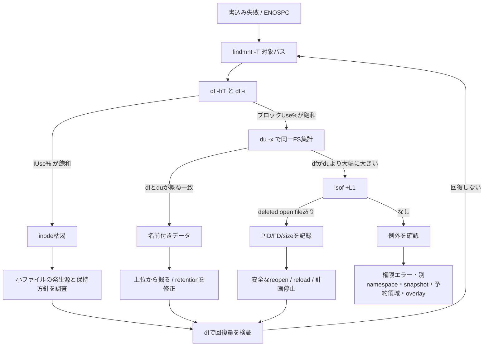

# Weekly Linux Deep-Dive — `df`・`du`・`lsof` で「ディスクが満杯なのに犯人が見えない」を解く

#linux #commands #operations #weekly #deep-dive

[[Home]]

## 1. Weekly focus、難易度、前提、測定可能な到達目標

### Weekly focus

今週は、`No space left on device` を単純な「大きいファイル探し」で終わらせず、**ブロック枯渇、inode枯渇、削除済みだがプロセスが開いたままのファイル、別マウントの見落とし、予約ブロック**へ切り分ける。中心は `df`・`du`・`lsof` の三角測量である。

**難易度シグナル: Intermediate** — 参加条件ではない。パス名、開かれたファイル記述、ファイルシステム会計を別物として扱う必要があるという目安である。

### 必要な知識・道具・環境

- 必須知識: ファイル、ディレクトリ、PID、所有者、終了コード、マウントポイント
- 前段概念: `find` で範囲を絞れること、`namei` でパス階層を確認できること
- 道具: Bash、GNU coreutils（`df`, `du`）、`lsof`、`findmnt`、`stat`、`find`、`truncate`、Python 3
- 環境: 破棄可能なLinux VM。ラボ用に約400 MiBの空き容量。ext4を使えると追加課題まで実施可能
- 権限: 基本観測は一般ユーザーで可能。他ユーザーのFD、loop mount、inode枯渇実験にはrootが必要

### 測定可能な到達目標

終了時に次を実演できれば合格である。

1. `df -hT` と `df -i` から、容量・inodeのどちらが制約かを60秒以内に判定できる。
2. `du -x` で同一ファイルシステムに限定し、上位ディレクトリから段階的に犯人を絞れる。
3. `df` と `du` の差を説明し、`lsof +L1` で削除済みopen fileを特定できる。
4. PID、FD、ファイルサイズ、保持プロセス、復旧方法を証跡に残せる。
5. サービス停止またはFD再オープンで容量が返ったことを数値で検証できる。

## 2. Mental model — 名前、inode、開かれたファイル、会計

ファイル名はデータ本体ではない。ディレクトリエントリが名前をinodeへ結び、inodeが所有者・モード・リンク数・データブロックを管理する。プロセスが `open()` すると、カーネル内のopen file descriptionを経てinodeを参照する。

```text
userspace process ─ FD 3 ─> open file description ─> inode ─> data blocks
                                                   ↑
directory / name ───────────── hard link ──────────┘

df   : ファイルシステム全体のブロック/inode会計を見る
du   : 名前から到達できるディレクトリ木を歩き、割当ブロックを合計する
lsof : プロセスが保持するopen fileとFDを見る
```

`rm`/`unlink()` は名前を外し、リンク数を減らす。リンク数が0でもプロセスのFD参照が残る限りinodeとブロックは解放されない。この状態では `du` は名前から到達できず数えられないが、`df` は使用中ブロックとして数える。保持プロセスがcloseするか終了した瞬間に解放される。

`ENOSPC` は空きデータブロック不足だけではない。小さなファイルを大量作成してinodeが尽きても発生する。またext系ではroot予約ブロックにより、一般ユーザーから見た空きが先に尽きる場合がある。

## 3. 本番シナリオと調査仮説

ログローテーション直後、APIがアップロード保存に失敗した。`df` は `/var` 99%だが、`du -sh /var/*` の合計は60%程度。担当者は巨大ログを削除したのに空きが戻らないと言う。

競合する仮説を最初に並べる。

- H1: 名前付きの巨大ファイルが残る。`du` と `find` で見つかる。
- H2: ローテート後の削除済みログをプロセスがopenしたまま。`lsof +L1` で見つかる。
- H3: inode枯渇。`df -i` の `IUse%` が100%付近。
- H4: `/var` 内の別マウントやbind mountを混算・見落とし。`findmnt -R /var` と `du -x` で判別する。
- H5: sparse file、hard link、権限エラー、予約ブロックにより見かけの合計がずれる。

調査順は「対象ファイルシステムを同定 → ブロック/inodeを判定 → 名前付きデータを集計 → open-unlinkedを探索 → 例外を確認」とする。

## 4. 主役3コマンドの深掘りと関連コマンド

### `df`: ファイルシステム側から見る

`df` はパスごとのファイル列挙ではなく、マウントされたファイルシステムの統計を問い合わせる。まず問題のパスそのものを引数にする。

```bash
df -hT /var/lib/myapp
df -i /var/lib/myapp
```

`Filesystem` は実体、`Type` は種類、`Size/Used/Avail` はブロック容量、`Use%` は利用率、`Mounted on` はマウントポイントである。`Avail` は一般ユーザーが利用可能な量で、`Size-Used` と一致しないことがある。`df -i` の `Inodes/IUsed/IFree/IUse%` はinode会計である。

### `du`: 名前空間側から見る

`du` は指定パス以下を歩いて割当ブロックを集計する。`-x` は別ファイルシステムへ越境しないため、`df` の1行と比較する際に重要である。

```bash
sudo du -xhd1 /var | sort -h
sudo du -xhd1 /var/log | sort -h
```

上位から1階層ずつ掘る。最初から `/` 全体を走査するとI/O負荷、権限ノイズ、疑似FS越境が増える。`du --apparent-size` は論理サイズ、通常の `du` は割当ブロック量を見る。sparse fileでは大きく異なる。

### `lsof`: プロセス側から見る

`lsof +L1` はリンク数が1未満、すなわち典型的には削除済みながら開かれているファイルを列挙する。

```bash
sudo lsof +L1
```

主な列は `COMMAND`, `PID`, `USER`, `FD`, `TYPE`, `DEVICE`, `SIZE/OFF`, `NLINK`, `NODE`, `NAME`。`FD` の `w` は書込み、`r` は読取り、`u` は読み書き可能を表すことがある。`NAME` 末尾の `(deleted)` が手掛かりになる。対象FSに絞るなら、まず `df` のデバイスと `lsof` の `DEVICE`/パスを照合する。

### 関連コマンド

- `findmnt -T PATH`: パスを所有するマウントとsource、fstype、optionsを特定
- `stat PATH`: inode番号、リンク数、論理サイズ、割当ブロックを確認
- `find ... -xdev -size`: 名前付き巨大ファイルを同一FS内で検索
- `ls -li`: inode番号とhard linkを確認
- `/proc/PID/fd`: FDから対象へのシンボリックリンクを観測
- `journalctl --disk-usage`: journalの利用量を確認（手動削除よりretention設定を優先）

## 5. flags、出力、終了コード、権限、可搬性

### 重要flags

- `df -h`: IEC風に読みやすい単位。厳密比較は `-B1` または `--output`
- `df -T`: FS種別を表示。GNU拡張でBusyBox/BSDでは非互換の場合あり
- `df -i`: inode使用量。inode概念を同様に出さないFSもある
- `du -x` / `--one-file-system`: 別FSへ越境しない
- `du -h`: 読みやすい表示。機械処理には `-B1` が安定
- `du -d1` / `--max-depth=1`: 1階層集計。BSDでは `-d` の対応差に注意
- `du -a`: ファイルも表示。巨大ツリーでは高負荷・大量出力
- `du --apparent-size`: 穴を含む論理長を数える。GNU拡張
- `lsof +L1`: link count 1未満。空白や改行を含む名前の機械処理には `-F` field出力を検討
- `lsof -p PID`: PID限定。`-a` を併用すると条件AND（例: `lsof -a -p "$pid" +L1`）

### 終了コード

- `df`, `du`: 通常0。アクセス不能、stat失敗、無効option等で非0。出力が一部得られてもstderrと終了コードを確認する。
- `lsof`: 一般に対象を表示できれば0、エラーや検索条件に一致なしで非0になり得る。分岐では実装のman pageを確認し、「出力なし＝安全」と即断しない。
- `test -s FILE`: サイズが正なら0、そうでなければ1。診断スクリプトで便利。

```bash
sudo du -xsd1 /var >/tmp/du.out 2>/tmp/du.err
rc=$?
printf 'exit=%d\n' "$rc"
```

### permissions と portability

一般ユーザーの `du` は読めないディレクトリを欠落させ、実使用量を過小評価し得る。`lsof` もptrace/procfs制限、hidepid、コンテナのPID/mount namespaceにより他プロセスが見えない。対象サービスと同じホスト・namespaceで観測する。macOS/BSDの `df`/`du` optionはGNUと異なり、`lsof +L1` の利用可否も現地の `man` で確認する。overlayfs、ZFS、Btrfs、snapshot、reflink、圧縮、thin provisioningでは `df` と `du` の意味がさらに異なる。

## 6. Guided lab（約150分）

> [!warning] 実施場所
> 破棄可能なVMで実施する。ラボは約160 MiBを一時消費する。`/tmp` がtmpfsならRAMを消費するため、`findmnt -T /tmp` を先に確認する。

### Foundation（25分）— 同じファイルの3つのサイズ

```bash
LAB_DIR="$(mktemp -d /tmp/linux-disk-lab.XXXXXX)"
printf '%s\n' "$LAB_DIR"
findmnt -T "$LAB_DIR"
df -hT "$LAB_DIR"
df -i "$LAB_DIR"
```

**Checkpoint 1:** `findmnt` と `df` のマウントポイント、FS種別、`Avail`、`IUse%` を記録する。

```bash
truncate -s 100M "$LAB_DIR/sparse.img"
stat --format='size=%s bytes blocks=%b block_unit=%B' "$LAB_DIR/sparse.img"
du -h "$LAB_DIR/sparse.img"
du -h --apparent-size "$LAB_DIR/sparse.img"
```

期待値: `stat` のsizeとapparent sizeは約100 MiBだが、通常の `du` は0またはごく小さい。論理長と実ブロック消費が違う証拠である。

```bash
dd if=/dev/zero of="$LAB_DIR/allocated.bin" bs=1M count=64 status=progress
du -h "$LAB_DIR/allocated.bin"
df -h "$LAB_DIR"
```

期待値: `allocated.bin` は約64 MiBを実消費し、`df` の空きも概ね減る。遅延割当や単位丸めで完全一致しない場合がある。

### Practical implementation（45分）— open-unlinkedを再現

次のPythonはファイルを開き、64 MiBを書き、パスをunlinkした後もFDを120秒保持する。

```bash
LAB_FILE="$LAB_DIR/held.log"
python3 - "$LAB_FILE" <<'PY' &
import os, sys, time
p = sys.argv[1]
f = open(p, "wb", buffering=0)
f.write(b"X" * (64 * 1024 * 1024))
os.fsync(f.fileno())
os.unlink(p)
print(f"pid={os.getpid()} fd={f.fileno()}", flush=True)
time.sleep(120)
PY
HOLDER_PID=$!
printf 'holder_pid=%s\n' "$HOLDER_PID"
sleep 3
```

別シェルは不要。そのまま観測する。

```bash
du -xsh "$LAB_DIR"
df -h "$LAB_DIR"
sudo lsof -a -p "$HOLDER_PID" +L1
readlink "/proc/$HOLDER_PID/fd/3"
stat "/proc/$HOLDER_PID/fd/3"
```

期待される核心:

```text
COMMAND  PID USER FD TYPE DEVICE SIZE/OFF NLINK NODE NAME
python3  ... ...  3w REG  ...   67108864     0 ...  .../held.log (deleted)
```

**Checkpoint 2:** `du` では64 MiBが見えない一方、`lsof` は `NLINK 0` と `(deleted)` を示す。`df` はまだブロックを使用中として扱う。

証跡を取る。

```bash
sudo lsof -a -p "$HOLDER_PID" +L1 >"$LAB_DIR/lsof-before.txt"
df -B1 "$LAB_DIR" >"$LAB_DIR/df-before.txt"
```

安全な解放はサービス固有の再オープン機構（例: reload/signal）または計画停止を使う。このラボでは自分の子プロセスだけへTERMを送る。

```bash
kill -TERM "$HOLDER_PID"
wait "$HOLDER_PID" 2>/dev/null || true
df -B1 "$LAB_DIR" >"$LAB_DIR/df-after.txt"
sudo lsof -a -p "$HOLDER_PID" +L1; printf 'lsof_exit=%d\n' "$?"
```

**Checkpoint 3:** PIDが消え、open-unlinkedファイルも消え、空き容量が概ね64 MiB戻る。`df-before.txt` と `df-after.txt` の `Available` を比較する。

### Production concerns（45分）— 調査ランブックを実行

以下を架空の `/var/lib/myapp` ではなく、ラボパスへ適用する。

```bash
TARGET="$LAB_DIR"
findmnt -T "$TARGET" -o TARGET,SOURCE,FSTYPE,OPTIONS
df -hT "$TARGET"
df -i "$TARGET"
sudo du -xhd1 "$TARGET" | sort -h
sudo find "$TARGET" -xdev -type f -size +10M -printf '%s\t%i\t%p\n' | sort -n
sudo lsof +L1
```

**Checkpoint 4:** 次の短いインシデントメモを書く。

```text
対象パス/マウント:
容量Use% / inode IUse%:
最大の名前付きデータ:
open-unlinkedの有無（PID/FD/size）:
採用仮説と棄却した仮説:
復旧操作:
復旧前後のAvailable:
恒久対策:
```

実運用ではログを直接 `rm` する前に、logrotate設定、サービスのreopen signal、journald retention、コンテナruntimeのログ設定を確認する。再発防止は「定期削除」より「上限、rotate、保持期間、監視」を設計する。

### Optional advanced challenge（35分）— inode枯渇を安全なloop FSで再現

ext4とroot権限がある検証VMのみ。ホストFSへ大量の空ファイルを作らない。

```bash
ADV_DIR="$LAB_DIR/inode-lab"
mkdir -p "$ADV_DIR/mnt"
truncate -s 128M "$ADV_DIR/ext4.img"
sudo mkfs.ext4 -q -N 1024 "$ADV_DIR/ext4.img"
sudo mount -o loop "$ADV_DIR/ext4.img" "$ADV_DIR/mnt"
df -h "$ADV_DIR/mnt"
df -i "$ADV_DIR/mnt"
```

```bash
set +e
for n in $(seq 1 2000); do
  : >"$ADV_DIR/mnt/f.$n" || { printf 'failed_at=%s\n' "$n"; break; }
done
set -e
df -h "$ADV_DIR/mnt"
df -i "$ADV_DIR/mnt"
```

期待値: ブロック容量には余裕があるのに `IUse%` が100%へ近づき、作成が `No space left on device` で失敗する。

**Checkpoint 5:** 「容量ENOSPC」と「inode ENOSPC」を区別する証跡として両方の `df` を保存する。

必ず後始末する。

```bash
sudo umount "$ADV_DIR/mnt"
```

## 7. Troubleshooting decision tree



## 8. Copy-ready examples（説明付き）

1. 対象パスが属するFSだけを見る。`df /` で代用しない。

```bash
df -hT /var/lib/myapp/uploads
```

2. inode枯渇を同時に除外する。小ファイル大量生成ではこちらが本命になる。

```bash
df -i /var/lib/myapp/uploads
```

3. パスから正確なmount sourceとoptionsを引く。bind/overlayの誤認を防ぐ。

```bash
findmnt -T /var/lib/myapp/uploads -o TARGET,SOURCE,FSTYPE,OPTIONS
```

4. `/var` 直下を同一FSだけで比較する。大きい枝を次に掘る。

```bash
sudo du -xhd1 /var 2>/tmp/du-var.err | sort -h
```

5. 数値で機械的に上位を並べる。`-B1` は単位混在を避ける。

```bash
sudo du -xB1 -d1 /var | sort -n | tail -20
```

6. 1 GiB超の名前付き通常ファイルを同一FSから探す。削除はしない。

```bash
sudo find /var -xdev -type f -size +1G -printf '%s\t%i\t%p\n' | sort -n
```

7. 全システムのopen-unlinkedを発見する。本番では出力に機密パスが含まれ得る。

```bash
sudo lsof +L1
```

8. 既知PIDだけを精査する。`-a` がPID条件とlink count条件をANDにする。

```bash
sudo lsof -a -p 1234 +L1
```

9. FDの実体をprocfsから確認する。`1234` と `7` は観測値へ置換する。

```bash
sudo readlink /proc/1234/fd/7
sudo stat /proc/1234/fd/7
```

10. sparse fileの論理長と割当量を比較する。バックアップ容量見積りにも効く。

```bash
stat --format='size=%s blocks=%b block_unit=%B' disk.img
du -h disk.img
du -h --apparent-size disk.img
```

11. hard linkを識別する。同じinodeを `du` が二重計上しない挙動にも注意する。

```bash
find /srv/data -xdev -samefile /srv/data/archive.bin -ls
```

12. systemd journalをAPI経由で縮小する前に使用量を確認する。稼働中journalを手動unlinkしない。

```bash
journalctl --disk-usage
sudo journalctl --vacuum-size=1G
```

13. Docker環境でコンテナ別の見かけの消費を確認する。overlayのホスト側 `du` だけで断定しない。

```bash
docker system df -v
```

14. 取得した証跡の終了コードも残す。アクセス欠落を成功と誤認しない。

```bash
sudo du -xsd1 /var >/tmp/du.out 2>/tmp/du.err; printf 'rc=%d\n' "$?"
```

## 9. Failure injection / diagnostic challenge

ラボをもう一度実行し、保持時間を300秒、ファイルを96 MiBへ変える。調査者には生成コードを見せず、次だけ伝える。

> 「アプリがログを削除した。`du` は小さいが `df` の空きが戻らない。サービス全体を即時再起動してはならない。」

提出物:

1. 対象mount、ブロック/inode使用率
2. PID、COMMAND、FD、NLINK、SIZE/OFF
3. `du` と `df` が食い違う理由を3文以内で説明
4. 影響の少ない解放方法を第一候補、計画停止を第二候補として提示
5. 解放前後の`Available`差分

追加問題: `sudo`なしでは該当PIDが見えない状況を想定し、「該当なし」ではなく「観測権限不足」と判断するための証拠を列挙する。

## 10. Safety、rollback、破壊的操作の警告

> [!danger] `rm` は開かれたファイルの容量を即時解放しない
> 稼働中ログを直接削除すると名前だけ消え、容量回復せず証跡も失うことがある。logrotateとアプリ固有のreopen方式を確認する。

> [!danger] `/proc/PID/fd/N` へのtruncateは最終手段
> `: > /proc/PID/fd/N` はプロセスが書いているファイルを破壊し、アプリ整合性や監査証跡を損なう。正式なreload/reopen、計画停止を優先し、承認・バックアップ・影響評価なしに実施しない。

- `du /` は本番I/Oを増やす。対象mountと深さを限定し、ピーク時を避ける。
- `kill -9` はflush/cleanupを妨げる。サービス固有のsignal、`systemctl reload`、通常TERMを優先する。
- `journalctl --vacuum-*`、ログ削除、snapshot削除は保持要件・監査要件を確認する。
- loopラボのrollbackは `sudo umount "$ADV_DIR/mnt"`。mount中に一時ディレクトリを削除しない。
- 最終清掃は変数を表示・検証してから行う。安全のため本ノートでは自動再帰削除コマンドを提示しない。

## 11. Verification checklist と具体的deliverables

- [ ] 対象パスに対する `findmnt -T` を保存した
- [ ] `df -hT` と `df -i` を同時刻に保存した
- [ ] `du -x` を使い、stderrと終了コードも確認した
- [ ] `df` と `du` の差を数値化した
- [ ] `lsof +L1` のPID、FD、NLINK、SIZE/OFFを記録した
- [ ] 対象プロセスの所有者とサービス責任者を確認した
- [ ] 復旧方法がreload/reopen/計画停止のどれかを説明できる
- [ ] 復旧前後のAvailableを比較した
- [ ] inode、別mount、sparse/hard link、namespaceの仮説を棄却または採用した
- [ ] retentionと監視の恒久対策を1つ以上提案した

具体的deliverablesは `df-before.txt`、`df-after.txt`、`lsof-before.txt`、8項目のインシデントメモ、任意のinode枯渇証跡である。

## 12. Assessment（5問）

1. `df` が99%で `du -x` の合計が60%のとき、最初に追加確認する2項目は何か。
2. `rm` 後も容量が戻らないカーネル上の理由を、link countとFDを使って説明せよ。
3. ブロック容量に余裕があるのに `ENOSPC` が起きる代表例は何か。確認コマンドも答えよ。
4. `du -x` が本調査で重要な理由は何か。
5. `lsof +L1` で対象を発見した直後に `kill -9` すべきでない理由と、優先する操作は何か。

<details>
<summary>解答を見る</summary>

1. `df -i` でinode枯渇を確認し、`sudo lsof +L1` で削除済みopen fileを確認する。併せて `findmnt -T` で比較対象FSが正しいことを保証する。
2. unlinkはディレクトリエントリを外してlink countを0にするだけで、プロセスのFD参照が残ればinodeとdata blocksは生存する。close/終了で最後の参照が消えたとき解放される。
3. inode枯渇。`df -i 対象パス` の `IFree/IUse%` を確認する。
4. `df` の1つのファイルシステム会計と比較するため、別mountの容量を集計へ混ぜないため。
5. 強制終了は未flush、破損、停止拡大を招き得る。アプリ固有のlog reopen signal、`systemctl reload`、通常TERMを使った計画停止を優先する。

</details>

## 13. Follow-up challenge と公式reference

### Follow-up challenge

自分のディストリビューションのlogrotate設定を1つ選び、次をレビューする。

- `rename + create` と `copytruncate` のどちらか
- 対象プロセスへreopenを促す `postrotate` の有無
- size/time基準、世代数、圧縮、欠落時挙動
- open-unlinkedを監視する方法と閾値
- filesystem容量だけでなくinode使用率も監視しているか

さらに、コンテナ環境ならホストと対象コンテナで `findmnt`, `df`, `lsof` の見え方を比較し、mount/PID namespaceが診断をどう変えるかを1ページにまとめる。

### Official references

- `man 1 df` — filesystem space usage
- `man 1 du` — file space usage
- `man 8 lsof` — open files、`+L` selector、field output
- `man 2 open`, `man 2 unlink`, `man 2 stat` — FD、名前削除、inode metadata
- `man 5 proc_pid_fd` — `/proc/PID/fd`
- `man 8 findmnt` — mount discovery
- `man 5 logrotate` — rotation、`postrotate`、`copytruncate`
- Linux kernel documentation: `Documentation/filesystems/proc.rst` および利用FS固有の文書
- systemd man pages: `journald.conf(5)`, `journalctl(1)`, `systemctl(1)`

最後に、現地環境の実装を必ず確認する。

```bash
man df
man du
man lsof
man unlink
man proc_pid_fd
```
