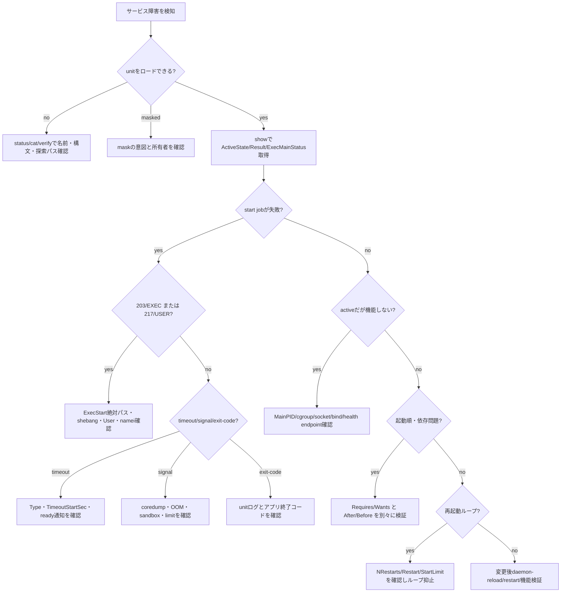

# Weekly Linux Deep-Dive — `systemctl` で「サービスが起動しない」を構造的に解く

#linux #commands #operations #weekly #deep-dive

[[Home]]

## 1. Weekly focus、難易度、前提、測定可能な到達目標

### Weekly focus

今週は `systemctl` を中心に、systemdサービスの起動失敗を **定義の誤り、依存関係、実行ユーザー、パスと権限、起動完了条件、再起動制御、サンドボックス**へ分解する。ログの最終行だけで判断せず、systemdが読み込んだ実効設定、ジョブ、プロセスの終了理由を照合する。

**難易度シグナル: Intermediate** — 参加条件ではない。unitファイル、プロセス、cgroup、依存グラフを一つのモデルで扱う目安である。

### 必要な知識・道具・環境

- 必須知識: PID、終了コード、シグナル、所有者、実行権限、絶対パス
- 前段概念: `journalctl -u UNIT --since ...` で時間を切れること。`namei -l` で親ディレクトリを含む権限を追えること
- 道具: systemd環境、Bash、`systemctl`、`systemd-analyze`、`journalctl`、`systemd-run`、`namei`、`stat`
- 環境: systemdがPID 1の破棄可能なLinux VM。コンテナやWSLではsystemdが無効な場合がある
- 権限: `systemctl --user` ラボは一般ユーザーで可能。システムunitの変更にはrootが必要

### 測定可能な到達目標

終了時に次を実演できれば合格である。

1. `status`、`show`、`cat` を使い分け、表示用情報と機械可読プロパティを区別できる。
2. `ExecStart` の終了コードとsystemdの `Result` / `ExecMainStatus` を対応付けられる。
3. `After=` と `Requires=` の違いを説明し、依存グラフを検証できる。
4. unit変更後に `daemon-reload` が必要な理由を説明できる。
5. 失敗を再現し、修正し、active状態と実際の応答を別々に検証できる。

## 2. Mental model

systemdは「デーモンを起動するコマンド集」ではなく、PID 1としてunitの状態とジョブを管理するサービスマネージャである。

1. **ファイル層**: `/usr/lib/systemd/system` または `/lib/systemd/system` のベンダーunitに、`/etc/systemd/system` の管理者設定とdrop-inが重なる。ユーザーunitは `~/.config/systemd/user` などを使う。
2. **userspace層**: `systemctl` はmanagerへ要求を送り、managerは依存関係からジョブを組み立てる。`start` コマンド自体がサービス本体ではない。
3. **プロセス層**: systemdはunitごとのcgroupにプロセスを置く。主プロセスの判定は `Type=` に依存し、終了コードまたはシグナルからunit状態を更新する。
4. **カーネル層**: `fork/execve`、資格情報、namespace、cgroup、resource limitをカーネルが強制する。`User=` や `ProtectSystem=` はアプリ内の設定ではない。
5. **ネットワーク層**: `active (running)` は「ポートが応答する」と同義ではない。bind先、socket unit、firewall、名前解決は別途検証する。

`systemctl start app.service` の概念的な流れは、unit読込 → dependency transaction作成 → ordering適用 → condition確認 → sandbox/資格情報作成 → `ExecStartPre=` → `ExecStart=` → `Type=`に基づく起動完了判定、である。

### 状態を混同しない

- `loaded`: unit定義を読めた。
- `enabled`: 特定targetから起動されるリンクがある。現在起動中とは限らない。
- `active`: unit種別が定義する活動状態。健全性保証ではない。
- `failed`: 起動・実行・停止の結果をmanagerが失敗として保持している。
- `masked`: unitが `/dev/null` へリンクされ、手動起動も禁止される。

## 3. Production scenario と調査仮説

デプロイ直後、`orders-api.service` が再起動を繰り返し、ロードバランサのヘルスチェックから外れた。担当者は「設定ファイルは存在し、手動では起動する」と報告している。

仮説は観測可能な順に並べる。

1. systemdが編集後のunitをまだ再読込していない。
2. `ExecStart=` のパス、引数、環境変数が対話シェルと異なる。
3. `User=` のユーザーが実行ファイル、設定、親ディレクトリへ到達できない。
4. `After=` だけ指定し、必要サービスの起動要求を作っていない。
5. `Type=` とデーモンの振る舞いが不一致で、systemdが主PIDを誤認した。
6. `ProtectSystem=`、`ReadWritePaths=`、`PrivateTmp=` 等が必要アクセスを遮断した。
7. アプリはactiveだが、誤ったアドレスへbindしている。

調査は「再起動して様子を見る」から始めない。再起動ループは証拠を流し、依存先を圧迫し得る。まず状態、実効定義、直近ログ、終了理由を保存する。

## 4. Primary tool と関連コマンド

### `systemctl`

`systemctl` はsystemd managerの状態照会と操作を行う。人間向けの `status`、定義確認の `cat`、プロパティ取得の `show`、状態判定の `is-active` / `is-enabled` を使い分ける。

```bash
systemctl status orders-api.service --no-pager -l
systemctl show orders-api.service -p LoadState -p ActiveState -p SubState -p Result -p ExecMainCode -p ExecMainStatus
systemctl cat orders-api.service
```

`status` のログ抜粋は短く、完全な履歴ではない。実効設定の由来は `cat`、定量的な状態は `show`、時系列は `journalctl` が担当する。

### 関連コマンド

- `systemd-analyze verify FILE`: unit構文、未知のdirective、一部の依存・実行パス問題を静的検証する。
- `systemd-analyze security UNIT`: sandbox hardeningの露出を採点する。点数は脅威モデルの代用ではない。
- `systemd-analyze critical-chain UNIT`: 起動順序上のクリティカルチェーンを見る。遅延原因と断定はしない。
- `journalctl -u UNIT`: unitに紐づく時系列ログを見る。
- `systemd-run`: 一時unitを作り、`User=`、resource control等を本番unitに近い条件で試す。
- `namei -l PATH`: 実行ユーザーがパス各階層を通過できるか調べる。
- `systemd-escape`: パスや任意文字列をunit名へ安全に変換する。

## 5. flags、output fields、exit codes、権限、portability

### 重要なフラグ

- `--no-pager`: 自動pagerを止め、自動化や記録を安定させる。
- `-l` / `--full`: 長い行やunit名を省略しない。
- `--user`: ユーザーmanagerを対象にする。`sudo systemctl --user` は通常、自分のmanagerを指さないので避ける。
- `--failed`: failed状態のunitだけ表示する。
- `--type=service --state=running`: 表示対象を絞る。
- `--now`: `enable` / `disable` と同時にstart / stopも行う。二つの変更を含むことを意識する。
- `--runtime`: enable/mask等を `/run` に置き、再起動で消える一時変更にする。
- `--property=NAME` (`-p`): `show` のプロパティを限定する。
- `--value`: プロパティ名を省く。スクリプトでは値の意味をコード側で固定する必要がある。
- `--wait`: 対応操作の完了まで待つ。長時間jobではタイムアウト設計も必要。

### 重要な出力フィールド

- `LoadState`: `loaded`, `not-found`, `error`, `masked`。
- `ActiveState` / `SubState`: 大分類とunit固有の詳細状態。
- `Result`: `success`, `exit-code`, `signal`, `timeout`, `start-limit-hit` 等。
- `ExecMainCode`: 終了が通常exitかsignalかを表すコード種別。
- `ExecMainStatus`: exit statusまたはsignal番号。アプリ固有の意味はアプリ文書で確認する。
- `MainPID`: systemdが主プロセスと認識するPID。`0`なら主プロセスなし。
- `NRestarts`: 自動再起動回数。増加中ならループを疑う。
- `FragmentPath` / `DropInPaths`: 読み込んだ本体と上書きの所在。

### 終了コード

- `systemctl is-active UNIT`: activeなら0、そうでなければ非0。表示文字列をgrepするより判定向き。
- `systemctl is-enabled UNIT`: enabled系なら0、disabled/masked等は非0。ただしstatic unitは異常とは限らない。
- `systemctl start UNIT`: 要求したstart jobの成否。開始直後にアプリが落ちるケースや機能的ヘルスまでは保証しない。
- `systemd-analyze verify`: 問題を検出すると非0。警告をCIでどう扱うかを決める。
- systemd固有の実行失敗は `203/EXEC`（実行不能）、`217/USER`（ユーザー資格情報）、`226/NAMESPACE` などとしてstatusに現れることがある。

### 権限と可視性

一般ユーザーは多くの状態を読めるが、操作はpolkit規則に依存する。他ユーザーのログはjournalグループ権限で欠落し得る。秘密を `Environment=` に直書きすると `systemctl show` 等で露出し得るため、systemd credentialsや権限制限された外部ファイルを検討する。

### portability

systemd専用であり、OpenRC、runit、SysV initには移植できない。directiveはsystemdバージョン依存なので `systemd --version` と `man systemd.directives` を確認する。unit探索パスはdistributionで `/usr/lib` と `/lib` が異なる。`service` ラッパーは詳細プロパティを隠すため、systemd調査では直接 `systemctl` を使う。

## 6. 90–180分の再現ラボ（目安150分）

> [!warning]
> 破棄可能なsystemd VMで実施する。以下はユーザーunitを使うためシステム全体への影響を抑えるが、実行中のユーザーセッションが必要である。`systemctl --user` がバス接続エラーになる環境では無理にシステムunitへ置換せず、systemd VMへ移る。

### Phase A — Foundation（20分）

```bash
systemd --version | head -1
systemctl --user show-environment >/dev/null
printf 'manager_rc=%s\n' "$?"
```

期待: systemdのバージョンと `manager_rc=0`。非0ならユーザーmanager/DBusが利用不能である。

```bash
systemctl --user list-units --type=service --state=running --no-pager
systemctl --user list-unit-files --type=service --no-pager | head
```

Checkpoint A: 「現在ロード/起動したunit」と「ディスク上のunit file」を別一覧として説明する。

### Phase B — 壊れたサービスを作る（25分）

```bash
install -d -m 700 "$HOME/.config/systemd/user" "$HOME/linux-magazine-lab"
printf '%s\n' '#!/bin/sh' 'echo "lab starting"' 'exit 42' > "$HOME/linux-magazine-lab/fail.sh"
chmod 700 "$HOME/linux-magazine-lab/fail.sh"
```

次を `~/.config/systemd/user/linux-magazine-lab.service` として保存する。

```ini
[Unit]
Description=Linux Magazine failure lab

[Service]
Type=simple
ExecStart=%h/linux-magazine-lab/fail.sh
Restart=on-failure
RestartSec=2s
StartLimitIntervalSec=10s
StartLimitBurst=3

[Install]
WantedBy=default.target
```

```bash
systemd-analyze --user verify "$HOME/.config/systemd/user/linux-magazine-lab.service"
systemctl --user daemon-reload
systemctl --user start linux-magazine-lab.service
printf 'start_rc=%s\n' "$?"
sleep 7
systemctl --user status linux-magazine-lab.service --no-pager -l
```

期待: スクリプトは42で終了し、再起動後にfailedまたはactivatingを経てstart limitへ達する。タイミングにより表示は異なる。

Checkpoint B:

```bash
systemctl --user show linux-magazine-lab.service \
  -p ActiveState -p SubState -p Result -p ExecMainCode -p ExecMainStatus -p NRestarts
```

`ExecMainStatus=42`、`NRestarts` が1以上、最終的に `Result=start-limit-hit` または直前の失敗結果を確認する。

### Phase C — 証拠を三角測量（30分）

```bash
journalctl --user -u linux-magazine-lab.service --since '-10 minutes' --no-pager -o short-precise
systemctl --user cat linux-magazine-lab.service
systemctl --user show linux-magazine-lab.service -p FragmentPath -p DropInPaths -p ExecStart
```

期待: ログは複数回の `lab starting` と終了を示し、`cat` と `show` はsystemdが実際に読んだ定義を示す。

```bash
namei -l "$HOME/linux-magazine-lab/fail.sh"
stat -c 'mode=%A owner=%U:%G path=%n' "$HOME/linux-magazine-lab/fail.sh"
```

Checkpoint C: 次の4点をメモする。

- いつ失敗したか
- 何を実行したか
- 誰として実行したか（user managerでは自分）
- どう終了したか

### Phase D — 修正、reload、reset、検証（30分）

`fail.sh` の最終行を `exec python3 -m http.server 18080 --bind 127.0.0.1` に置換する。スクリプト変更だけならunit再読込は不要だが、unit変更時との違いを学ぶため次を実行する。

```bash
systemctl --user daemon-reload
systemctl --user reset-failed linux-magazine-lab.service
systemctl --user restart linux-magazine-lab.service
systemctl --user is-active --quiet linux-magazine-lab.service
printf 'active_rc=%s\n' "$?"
curl --fail --silent --show-error http://127.0.0.1:18080/ >/dev/null
printf 'health_rc=%s\n' "$?"
```

期待: `active_rc=0` と `health_rc=0`。状態と機能を二重に検証する。

```bash
systemctl --user show linux-magazine-lab.service -p MainPID -p ActiveState -p SubState -p Result
systemd-cgls --user-unit linux-magazine-lab.service
```

Checkpoint D: Pythonプロセスがunitのcgroup内にあり、MainPIDと対応することを確認する。

### Phase E — Production concerns（25分）

```bash
systemd-analyze --user security linux-magazine-lab.service
systemctl --user edit linux-magazine-lab.service
```

drop-inに次を追加する。

```ini
[Service]
NoNewPrivileges=yes
PrivateTmp=yes
ProtectSystem=strict
ProtectHome=read-only
```

```bash
systemctl --user daemon-reload
systemctl --user restart linux-magazine-lab.service
systemctl --user status linux-magazine-lab.service --no-pager
curl --fail http://127.0.0.1:18080/ >/dev/null
systemd-analyze --user security linux-magazine-lab.service
```

期待: 読み取りだけのHTTPサーバーは動作する。hardeningの各directiveは互換性試験を伴って段階投入する。

Checkpoint E: drop-inのパスを `systemctl --user show ... -p DropInPaths` で確認する。

### Phase F — Optional advanced challenge（20分）

一時unitでresource controlを試す。

```bash
systemd-run --user --unit=magazine-transient \
  -p MemoryMax=128M -p CPUQuota=20% \
  /bin/sh -c 'sleep 60'
systemctl --user show magazine-transient.service -p MemoryMax -p CPUQuotaPerSecUSec -p ControlGroup
systemctl --user stop magazine-transient.service
```

課題: `systemd-run --user --scope` と `--unit` の違いをman pageで調べ、対話コマンドをscopeへ置く場合とserviceとして起動する場合を説明する。

### 後片付け（必須）

```bash
systemctl --user disable --now linux-magazine-lab.service 2>/dev/null || true
systemctl --user revert linux-magazine-lab.service 2>/dev/null || true
systemctl --user reset-failed linux-magazine-lab.service
```

その後、作成した次の3対象だけを確認して削除する。

- `~/.config/systemd/user/linux-magazine-lab.service`
- `~/.config/systemd/user/linux-magazine-lab.service.d/`
- `~/linux-magazine-lab/`

最後に `systemctl --user daemon-reload` を実行し、`systemctl --user status linux-magazine-lab.service` がnot-foundを示すことを確認する。

## 7. Troubleshooting decision tree



## 8. copy-ready examples（説明付き）

### 1) 失敗unitを短く列挙

```bash
systemctl --failed --no-pager
```

全サービスを眺めず、managerがfailedとして保持しているunitを初動で絞る。ユーザーunitなら `--user` を加える。

### 2) 状態を機械可読プロパティで保存

```bash
systemctl show ssh.service -p LoadState -p ActiveState -p SubState -p Result -p MainPID -p NRestarts
```

distributionでunit名が `sshd.service` の場合は置換する。`status` の装飾をparseしない。

### 3) 実効unitとdrop-inを確認

```bash
systemctl cat nginx.service
```

ベンダーfileだけを直接読むと `/etc/systemd/system/*.d/*.conf` の上書きを見落とす。

### 4) 読込元を正確に取得

```bash
systemctl show nginx.service -p FragmentPath -p DropInPaths
```

同名unitが複数探索パスにあるとき、採用されたファイルを確定する。

### 5) unit fileを適用前に検証

```bash
systemd-analyze verify /etc/systemd/system/myapp.service
```

未知directiveや不正なsectionを発見する。実行時だけ判明する権限・ネットワーク問題までは保証しない。

### 6) 直近ブート・指定unitのエラーを抽出

```bash
journalctl -b -u myapp.service -p warning..alert --since '-30 min' --no-pager
```

ブート境界と時間とunitを固定する。priority絞り込みはアプリがstdoutへ通常priorityで出した重要行を除外し得る。

### 7) activeを終了コードで判定

```bash
if systemctl is-active --quiet postgresql.service; then echo active; else echo inactive; fi
```

ローカライズされた表示をgrepしない。ただしDBクエリが成功するかは別途確認する。

### 8) enableと現在状態を別々に確認

```bash
systemctl is-enabled myapp.service; systemctl is-active myapp.service
```

自動起動設定と現在のプロセス状態は独立しているため、二つの終了コードを見る。

### 9) unit変更をmanagerへ再読込

```bash
sudo systemctl daemon-reload && sudo systemctl restart myapp.service
```

`daemon-reload` はunit定義を読み直すだけでサービスを再起動しない。影響時間を考えてrestartは明示する。

### 10) 再起動回数を観測

```bash
watch -n 2 'systemctl show myapp.service -p ActiveState -p Result -p NRestarts'
```

`NRestarts` の増加でcrash loopを検知する。監視基盤ではrateとしてアラート化する。

### 11) 起動順のクリティカルチェーン

```bash
systemd-analyze critical-chain network-online.target
```

`After=` の時系列を追う。表示時間だけで根本原因と断定せず、各unitのログと照合する。

### 12) 依存関係を双方向に見る

```bash
systemctl list-dependencies myapp.service
systemctl list-dependencies --reverse myapp.service
```

前者はmyappが引くunit、後者はmyappを必要・参照するunitを調べる。停止影響の見積りに有効。

### 13) 本番unitを変えず同じユーザーで試す

```bash
sudo systemd-run --wait --collect -p User=www-data /usr/bin/test -r /etc/myapp/config.yml
```

systemd経由でread可否を検査する。成功は終了0。パスは環境に合わせ、秘密内容を出力しない。

### 14) unitのhardening候補を評価

```bash
systemd-analyze security myapp.service
```

露出を一覧化する。高得点化を目的に一括適用せず、書込み先・JIT・namespace要件をテストする。

## 9. Failure injection / diagnostic challenge

ラボunitの `ExecStart` を一時的に次へ変え、3種類の失敗を一つずつ再現する。

1. 存在しない `/opt/missing/app` → `203/EXEC` を予想する。
2. 実行ビットを外したスクリプト → `Permission denied` とパス権限を確認する。
3. `Type=notify` にするがアプリは `sd_notify` しない → 起動完了待ちとtimeoutを観測する（長すぎる場合は `TimeoutStartSec=10s`）。

各ケースで以下を提出する。

```bash
systemctl --user show linux-magazine-lab.service -p Result -p ExecMainCode -p ExecMainStatus
journalctl --user -u linux-magazine-lab.service -n 20 --no-pager
```

診断チャレンジ: `After=network-online.target` を書くだけでネットワークが利用可能になる、という主張が誤りである理由を説明する。ヒント: orderingとpull-in、`network-online.target` の実装、アプリ自身のretryを分ける。

## 10. Safety、rollback、破壊的操作の警告

> [!danger]
> SSH、ネットワーク、認証、ストレージのunitを遠隔環境で安易にstop/maskしてはいけない。接続断や起動不能になり得る。コンソールまたはout-of-bandアクセスと復旧手順を先に確保する。

- `mask` は手動startも阻止する強い操作。まず依存元と意図を確認し、一時検証なら `--runtime` を検討する。
- `disable --now` は自動起動解除と即時停止を同時に行う。影響を分離したい場合は別々に実行する。
- `daemon-reexec` は通常のunit編集に不要。PID 1自身の再実行は保守手順なしに行わない。
- `reset-failed` は原因を直さず状態とstart-limitカウンタを消す。証拠採取後に使う。
- `systemctl edit` はdrop-inを作る。ベンダーunitを直接編集せず、`systemctl revert UNIT` で管理者overrideを戻せることを確認する。
- rollbackは「旧unit/drop-inへ戻す → `daemon-reload` → restart →状態と機能を検証」。unit fileだけ戻してreloadを忘れない。
- `Restart=always` と短い `RestartSec=` は依存先への接続嵐を生む。start limitとbackoffを設計する。
- 秘密をコマンドラインや `Environment=` に載せない。プロセス一覧、D-Bus、ログ、core dumpから漏れる可能性を評価する。

## 11. Verification checklist と成果物

### Checklist

- [ ] 最新12号と主題が重複しないことを確認した
- [ ] `systemctl --user show-environment` が成功した
- [ ] 失敗時の `Result`、`ExecMainStatus`、`NRestarts` を記録した
- [ ] `systemctl cat` と `FragmentPath` / `DropInPaths` を照合した
- [ ] journalをunit・時間範囲で絞った
- [ ] 修正後にactive判定とHTTP応答判定の両方が0になった
- [ ] hardening後も機能試験が通った
- [ ] ラボunit、drop-in、スクリプトを後片付けした
- [ ] managerをreloadし、unitがnot-foundであることを確認した

### Concrete deliverables

1. 失敗前後の `systemctl show` 出力（秘密はredact）。
2. 「観測 → 仮説 → 検証 → 修正 → 機能確認」を5行でまとめたインシデントメモ。
3. 自作unit fileとhardening drop-in。
4. 自環境向けの初動コマンド5個をまとめたrunbook。
5. `After=`、`Wants=`、`Requires=` の違いを示す短い説明。

## 12. Five-question assessment

1. `enabled` だが `inactive` は矛盾か。
2. unitを編集した後、なぜ `daemon-reload` と `restart` の両方を区別するのか。
3. `After=db.service` はdb.serviceを自動的に起動するか。
4. `status=203/EXEC` を見たとき最初に確認するものを3つ挙げよ。
5. `systemctl start` が0なら、Webサービスが正常応答すると断定できるか。

<details>
<summary>解答を見る</summary>

1. 矛盾しない。enabledは将来のtarget起動時の関連付け、inactiveは現在状態である。
2. reloadはmanagerがunit定義を読み直す操作、restartは新しい定義でサービスプロセスを再作成する操作だからである。
3. 起動しない。`After=` は両者のjobが存在するときの順序だけを定める。pull-inには通常 `Wants=` または `Requires=` を併用する。
4. `ExecStart` の実在する絶対パス、実行ビットと親ディレクトリ権限、shebangのinterpreter（およびarchitecture/format）を確認する。
5. 断定できない。start job完了後に落ちる場合があり、bind先やアプリ機能も未検証である。`is-active` と実際のhealth checkを行う。

</details>

## 13. Follow-up challenge と公式リファレンス

### Follow-up challenge

ラボunitをsocket activation化する。`linux-magazine-lab.socket` が127.0.0.1の別ポートをlistenし、初回接続でserviceを起動する構成を設計する。次を証明すること。

- service停止中でもsocket unitがlistenしている。
- 初回接続後にserviceのcgroupが現れる。
- `Accept=no` とservice側FD受け渡しの契約を説明できる。
- serviceの再起動とsocketの可用性を別々に評価できる。

さらにproduction向けに `DynamicUser=yes`、`StateDirectory=`、`RuntimeDirectory=` を調べ、固定UIDや手作業の `chown` を減らす設計案を作る。

### Official references

- `man systemctl`
- `man systemd.service`
- `man systemd.unit`
- `man systemd.exec`
- `man systemd.resource-control`
- `man systemd.directives`
- `man systemd-analyze`
- `man systemd-run`
- `man journald.conf`
- freedesktop.org: `https://www.freedesktop.org/software/systemd/man/latest/`
- Red Hat Enterprise Linux documentation: systemd unit files and service management
- Debian Reference / Debian Administrator's Handbook: systemd service management

最後に覚える一文: **systemd障害は「ログを見る」だけでなく、managerが読んだ定義、組んだ依存ジョブ、作った実行環境、観測した終了理由を順に照合すると解ける。**
