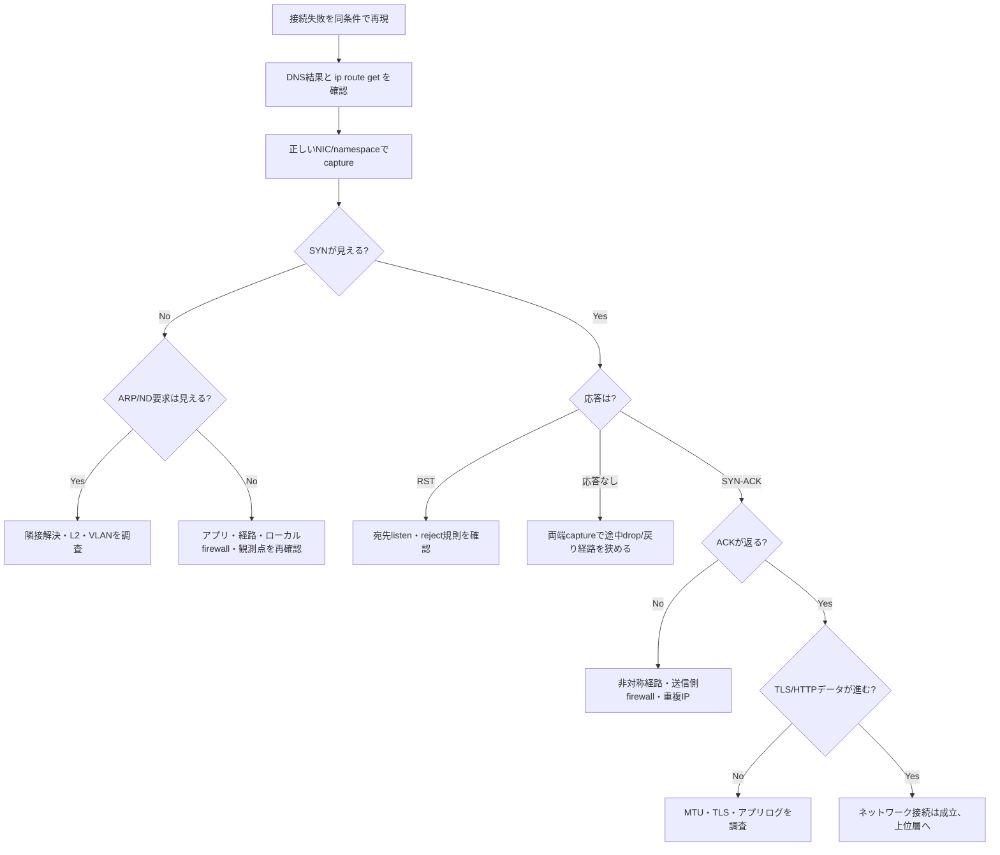

# Weekly Linux Deep-Dive — `tcpdump` で「つながらない」をパケットから証明する

#linux #commands #operations #weekly #deep-dive

[[Home]]

## 1. Weekly focus、難易度、前提、測定可能な到達目標

**Weekly focus:** `tcpdump` と BPF フィルタを使い、TCP接続障害を「名前解決」「経路」「パケット未到達」「拒否」「タイムアウト」「戻り経路」「アプリ層」に分解する。

**難易度シグナル:** Specialized（参加条件ではなく、カーネルのネットワーク経路まで扱うという目安）

**必要知識:** IPv4、TCPの SYN/SYN-ACK/ACK、CIDR、プロセスとソケット、標準入出力。以前の概念として `ip addr`、`ip route get`、`ss -lntp` を復習しておく。

**道具・環境:** Linux VMまたは検証ホスト、`tcpdump`、`iproute2`、`python3`、`curl`、任意で Wireshark。root または `CAP_NET_RAW`/`CAP_NET_ADMIN` 相当の権限。演習は network namespace を作れるホストを想定する。

**測定可能な到達目標:** 終了時に、(1)正しいインターフェースを選べる、(2)capture filterを組み立てられる、(3)TCP flagsと再送を読める、(4)pcapを安全に保存できる、(5)観測結果から障害領域を一文で説明できる。

## 2. Mental model — パケットはどこで観測されるか

アプリケーションはファイルディスクリプタとしてソケットを扱う。`connect(2)` や `send(2)` は userspace からカーネルへ要求を渡し、カーネルのTCP/IPスタックが経路・隣接情報・netfilter・qdisc・NICを経てパケットを送る。受信は逆向きだ。`tcpdump` は通常 libpcap を介し、カーネルの packet socket からインターフェースを通過するフレームの**コピー**を読む。

したがって「キャプチャに無い」は直ちに「ネットワーク上に無い」を意味しない。観測インターフェースが違う、namespaceが違う、NIC offloadで見え方が変わる、capture filterが捨てた、バッファが落とした可能性がある。逆に SYN が出ていて返事が無ければ、少なくともローカルアプリからカーネルの送信経路までは進んだ証拠になる。

重要な境界は次の通り。

- `ss`: カーネルが保持するソケット状態を観測する。
- `tcpdump`: インターフェース境界のパケットを観測する。
- `ip route get`: カーネルが選ぶ経路を予測する。
- `nft list ruleset`: netfilterの方針を観測する。
- アプリログ: HTTP/TLSなど、パケットだけでは分からない意味を観測する。

## 3. Production scenario と調査仮説

デプロイ後、APIクライアントは `Connection timed out` を返す。一部ホストだけ失敗し、サーバ側アクセスログには何もない。

仮説を層ごとに置く。

1. DNSが誤ったIPを返した。
2. クライアントが想定外のNIC/ゲートウェイを選んだ。
3. SYNがクライアントから出ていない（ローカルポリシー、アプリ問題）。
4. SYNは出るが途中で破棄される。
5. サーバは RST を返す（未listenまたは拒否）。
6. SYN-ACKは届くがクライアントのACKが戻らない（非対称経路やfirewall）。
7. handshakeは成功し、TLS/HTTP以降で止まる。

調査では「どちらが悪いか」ではなく、**最後に確認できた正常な境界**と**最初に確認できない境界**を記録する。

## 4. 主役 `tcpdump` と関連コマンド

基本形は `tcpdump [options] [BPF filter]`。capture filterはカーネル側で対象を減らすため、巨大なトラフィックから必要な証拠だけを低負荷で取得できる。`host`、`net`、`port`、`src`、`dst`、`tcp`、`udp` を `and`、`or`、`not`、括弧で合成する。

表示は通常、時刻、送信元 `IP.port`、`>`、宛先、TCP flags、sequence/ack、window、options、length の順。`Flags [S]` はSYN、`[S.]` はSYN+ACK、`[.]` はACK、`[P.]` はPSH+ACK、`[F.]` はFIN+ACK、`[R.]` はRST+ACK。SYNの繰り返しは返答不在、即時RSTは到達したが受け入れられなかった兆候だ。

関連コマンドは役割を混ぜない。

- `getent ahostsv4 NAME`: 実際の名前解決結果。
- `ip route get IP`: 選択される送信元IP・NIC・gateway。
- `ss -lntp`: listenしているプロセス。
- `nft list ruleset`: firewall規則（本番では閲覧から）。
- `ethtool -k IFACE`: GRO/GSO/TSOなどoffload状態。
- `capinfos FILE` / `tshark -r FILE`: pcapの要約・後解析（任意）。

## 5. flags、出力、終了コード、権限、移植性

重要なオプション:

- `-i IFACE`: 観測面を明示。`-i any` は便利だがLinux cooked captureになり、リンク層情報が異なる。
- `-n` / `-nn`: 名前・サービス名への逆引きを止め、遅延と誤読を避ける。
- `-c N`: Nパケットで終了。再現試験に向く。
- `-s 96` または `-s 0`: snap length。ヘッダだけか全長かを意図して選ぶ。現行版では既定が大きい場合もある。
- `-w FILE`: バイナリpcapへ保存。端末へ本文を出さない。
- `-r FILE`: 保存済みpcapを読む。root不要。
- `-C MB`、`-W COUNT`: サイズ基準のローテーション。ディスク枯渇防止。
- `-G SEC`、`-w 'name-%Y%m%d%H%M%S.pcap'`: 時間基準ローテーション。
- `-Q in|out|inout`: 方向指定。OS/ドライバにより非対応。
- `-tttt`: 人間向け日時。相関分析ではタイムゾーンと時刻同期も記録する。
- `-v/-vv/-vvv`: 詳細表示。情報量とCPU負荷が増える。

プロセス終了時に `packets captured`、`packets received by filter`、`packets dropped by kernel` が表示される。dropが0でなければ証拠が不完全かもしれない。`tcpdump` は通常、成功0、エラー1、フィルタ構文エラー2を返す実装が多いが、スクリプトでは導入版の man page と実測を優先する。SIGINTで終了した際の扱いも版により確認する。

ライブキャプチャには通常root権限が要る。専用運用ではバイナリへ file capability を付ける手もあるが、任意パケットを盗聴できる強い権限になる。sudoの限定ルールや短時間の取得を優先する。pcapには認証情報、Cookie、内部IP、顧客データが含まれ得る。

Linux、BSD、macOSで `tcpdump` 自体は広く使えるが、`any`、`-Q`、namespace、offloadの挙動は移植不能。BPF構文もlibpcapの版を確認する。コンテナではホストnamespaceとコンテナnamespaceのどちらで観測するかを明記する。

## 6. Guided lab（150分）

> [!warning]
> 検証ホスト専用。以下は `labcli` と `labsrv` namespace、vethを作る。既存名が無いことを先に確認する。

### Foundation（0–30分）— 正常系を作る

```bash
command -v tcpdump ip python3 curl
ip netns list
sudo ip netns add labcli
sudo ip netns add labsrv
sudo ip link add veth-cli type veth peer name veth-srv
sudo ip link set veth-cli netns labcli
sudo ip link set veth-srv netns labsrv
sudo ip -n labcli addr add 10.203.0.1/24 dev veth-cli
sudo ip -n labsrv addr add 10.203.0.2/24 dev veth-srv
sudo ip -n labcli link set lo up
sudo ip -n labsrv link set lo up
sudo ip -n labcli link set veth-cli up
sudo ip -n labsrv link set veth-srv up
```

サーバを別端末で起動する。

```bash
sudo ip netns exec labsrv python3 -m http.server 8080 --bind 10.203.0.2
```

**Checkpoint 1:** `sudo ip netns exec labcli curl -sS http://10.203.0.2:8080/ | head` がHTMLを返す。`ip -n labcli route get 10.203.0.2` は `dev veth-cli src 10.203.0.1` を含む。

### Practical implementation（30–85分）— handshakeを読む

端末Aで6パケットだけ取得し、端末Bでcurlする。

```bash
sudo ip netns exec labcli tcpdump -i veth-cli -nn -c 6 'tcp and host 10.203.0.2 and port 8080'
sudo ip netns exec labcli curl -sS -o /dev/null http://10.203.0.2:8080/
```

**期待出力:** 最初の3行に概ね `[S]`、`[S.]`、`[.]`。続いてHTTPデータの `[P.]` などが見える。相対sequence表示の数値は環境ごとに異なる。

pcapにも保存する。

```bash
sudo ip netns exec labcli tcpdump -i veth-cli -nn -s 0 -c 12 -w /tmp/lab-http.pcap 'tcp port 8080'
sudo ip netns exec labcli curl -sS -o /dev/null http://10.203.0.2:8080/
sudo tcpdump -nn -tttt -r /tmp/lab-http.pcap 'tcp[tcpflags] & (tcp-syn|tcp-rst) != 0'
```

**Checkpoint 2:** pcapが存在し、読み返しではSYN系とRST系だけに絞れる。`sudo stat /tmp/lab-http.pcap` で所有者と権限も確認する。

### Production concerns（85–125分）— 失敗を分類する

まず「到達するがlistenしていない」を観察する。

```bash
sudo ip netns exec labcli tcpdump -i veth-cli -nn -c 2 'tcp port 9090'
sudo ip netns exec labcli curl --connect-timeout 2 http://10.203.0.2:9090/
```

**期待:** SYNの直後にサーバからRST。curlは通常 exit code 7。これは「経路不明」ではなく、ホストまで到達しTCP接続を拒否された証拠。

次に存在しない宛先へのtimeoutを観察する。

```bash
sudo ip netns exec labcli tcpdump -i veth-cli -nn -c 3 'host 10.203.0.99 and tcp port 8080'
sudo ip netns exec labcli curl --connect-timeout 3 http://10.203.0.99:8080/
```

ARP/neighbor解決で止まりTCP SYN自体が見えない場合がある。そこで次も取得する。

```bash
sudo ip netns exec labcli tcpdump -i veth-cli -nn -c 6 'arp or (host 10.203.0.99 and tcp port 8080)'
```

**Checkpoint 3:** 「SYN再送」ではなく「ARP requestにreplyなし」になり得ることを説明できる。TCPだけを見れば誤診する例である。

### Optional advanced challenge（125–150分）

別端末で正常アクセスを繰り返し、サイズ制限付き取得を試す。

```bash
sudo ip netns exec labcli tcpdump -i veth-cli -nn -s 96 -C 1 -W 3 -w /tmp/lab-ring.pcap 'tcp port 8080'
```

取得後、各pcapのdrop数、容量、含まれる接続数を記録し、`-s 96` でアプリ本文を減らせても機密性がゼロにはならない理由を書く。

## 7. Troubleshooting decision tree



## 8. Copy-ready examples（すべて目的つき）

1. `sudo tcpdump -D` — 利用可能なcapture interfaceを番号付きで確認し、推測でNICを選ばない。
2. `ip route get 203.0.113.10` — 実際に選ばれるNICと送信元IPを先に特定する。
3. `sudo tcpdump -i eth0 -nn -c 20 'host 203.0.113.10'` — 対象ホストとの送受信を20個だけ確認する。
4. `sudo tcpdump -i any -nn 'tcp port 443'` — NIC不明時の初期探索。重複表示やcooked headerに注意する。
5. `sudo tcpdump -i eth0 -nn 'tcp[tcpflags] & tcp-syn != 0'` — SYNまたはSYN-ACKだけを抽出し、新規接続の流れを見る。
6. `sudo tcpdump -i eth0 -nn 'tcp[tcpflags] & (tcp-rst) != 0'` — RSTを抽出し、拒否や異常切断を探す。
7. `sudo tcpdump -i eth0 -nn 'src host 10.0.0.5 and dst port 5432'` — 特定クライアントからDBへの片方向だけに絞る。
8. `sudo tcpdump -i eth0 -nn 'icmp or icmp6'` — unreachableやPacket Too Bigなど、TCP障害を説明する制御メッセージを見る。
9. `sudo tcpdump -i eth0 -nn -s 0 -c 200 -w incident.pcap 'host 10.0.0.5 and port 443'` — 完全長を最大200packetだけ保存し、範囲を制限する。
10. `tcpdump -nn -r incident.pcap 'tcp port 443'` — オフライン解析。保存済みpcapの読み取りには通常root不要。
11. `sudo tcpdump -i eth0 -nn -s 96 -C 50 -W 4 -w trace.pcap 'net 10.0.0.0/8'` — 50MB×4本のリングでディスク上限を約200MBに抑える。
12. `sudo timeout 30 tcpdump -i eth0 -nn -w short.pcap 'udp port 53'` — 30秒だけDNSを取得する。`timeout` の終了コード124も運用スクリプトで考慮する。
13. `getent ahostsv4 api.example.com` — curlと同じOS名前解決経路で対象IPを確認してからフィルタへ使う。
14. `ss -lntp '( sport = :8080 )'` — サーバ側でlisten socketと所有プロセスを確認し、RSTの仮説を検証する。

## 9. Failure injection / diagnostic challenge

HTTPサーバを動かしたまま、`labsrv` 側で8080/tcpをsilent dropする。既存rulesetを触らずnamespace内だけで実施する。

```bash
sudo ip netns exec labsrv nft add table inet labfilter
sudo ip netns exec labsrv nft 'add chain inet labfilter input { type filter hook input priority 0; policy accept; }'
sudo ip netns exec labsrv nft add rule inet labfilter input tcp dport 8080 drop
sudo ip netns exec labcli curl --connect-timeout 4 http://10.203.0.2:8080/
```

クライアント側とサーバ側で同時captureし、次を答える。

- 両端でSYNは見えるか。
- サーバからRST/SYN-ACKは出るか。
- listenしているのにtimeoutする証拠は何か。
- `nft -a list ruleset` のどのhandleが原因か。

**診断:** SYNはサーバのinterfaceまで届くがinput hookでdropされ、TCP stackがSYN-ACKを生成できない。クライアントでは再送後timeoutする。両端captureにより中間ネットワークではなくサーバ内へ境界を狭められる。

## 10. Safety、rollback、destructive warning

パケット取得は盗聴になり得る。対象、時間、容量を最小化し、承認・保管期限・暗号化・アクセス権を守る。TLSでもIP、SNI（方式次第）、時刻、サイズは露出し得る。`-A`/`-X` を本番で安易に使わない。pcapをチケットやチャットへ添付する前に機密性を審査する。

firewall変更、offload無効化、interface downは通信影響がある。本番では観測だけから始める。このlabのrollback:

```bash
sudo ip netns exec labsrv nft delete table inet labfilter 2>/dev/null || true
sudo ip netns del labcli
sudo ip netns del labsrv
sudo rm -f /tmp/lab-http.pcap /tmp/lab-ring.pcap /tmp/lab-ring.pcap0 /tmp/lab-ring.pcap1 /tmp/lab-ring.pcap2
```

最後の削除は対象パスを `ls -l /tmp/lab-*.pcap*` で確認してから行う。namespace削除で内部プロセスとvethも失われるため、検証名であることを再確認する。

## 11. Verification checklist と成果物

- [ ] `ip route get` とcapture interfaceの関係を説明した
- [ ] 正常なSYN → SYN-ACK → ACKをpcapで確認した
- [ ] RSTとtimeoutを区別した
- [ ] ARP/NDも確認し「SYNが無い」を誤診しなかった
- [ ] kernel drop counterを確認した
- [ ] pcapの所有者、mode、容量、保存期限を記録した
- [ ] failure injectionをrollbackした
- [ ] namespaceが残っていないことを `ip netns list` で確認した

**具体的成果物:** (1)正常系pcap、(2)RST/timeout比較メモ、(3)障害境界を一文で示す診断文、(4)使用したBPF filter、(5)安全・rollback記録。診断文の型は「クライアントvethでSYN送信、サーバvethで受信を確認したがSYN-ACKは生成されず、サーバnamespaceのinput drop規則が最初の異常境界」のようにする。

## 12. Five-question assessment

1. SYNが繰り返され応答が無いとき、何が証明され、何はまだ証明されないか。
2. 即時RSTとtimeoutはどのように仮説を変えるか。
3. `-w` と表示用オプション `-A` の役割の違いは何か。
4. `packets dropped by kernel` が非ゼロなら何をするか。
5. 同一LANの存在しないIPへ接続したとき、TCPだけのfilterが危険な理由は何か。

<details>
<summary>解答</summary>

1. ローカル観測点からSYNを送ったことは証明できるが、宛先へ到着したことや途中のどこで落ちたかは証明できない。両端観測が必要。
2. RSTはIP到達性と応答経路が概ねあり、未listenまたは明示rejectを示唆する。timeoutはsilent drop、経路、隣接解決、戻り経路など候補が広い。
3. `-w` は生packetをpcapへ保存する。`-A` は端末上でpayloadをASCII表示する。`-w` 中は通常、packet decodeを端末へ表示しない。
4. filterを狭める、snap lengthを小さくする、出力先を速くする、バッファや取得方式を見直し、欠落があることを診断記録へ明記して再取得する。
5. ARP解決が完了しなければTCP SYNは生成・送信されず、TCP filterには何も出ない。`arp or tcp...` で下位層も観測する。

</details>

## 13. Follow-up challenge と公式リファレンス

**Follow-up challenge:** 2台の検証ホストで同じ接続を同時captureし、NTP同期誤差を測ったうえで、5-tupleとTCP sequenceを使って同一packetを対応付ける。片側だけに存在するpacketから損失区間を推定し、NIC offloadによる見え方の差も `ethtool -k` とともに報告する。

公式資料:

- `man 8 tcpdump`
- `man 7 pcap-filter`（環境によって `man pcap-filter`）
- `man 7 packet`
- `man 7 tcp`
- `man 8 ip-route`
- `man 8 ss`
- tcpdump / libpcap公式: https://www.tcpdump.org/
- Linux kernel packet mmap documentation: https://docs.kernel.org/networking/packet_mmap.html
- Red Hat networking troubleshooting guide: https://docs.redhat.com/en/documentation/red_hat_enterprise_linux/9/html/configuring_and_managing_networking/

---

今週の核心は、パケットを眺めることではない。観測点を明示し、正常な境界と異常な境界を証拠で挟み、調査範囲を一段ずつ縮めることである。
