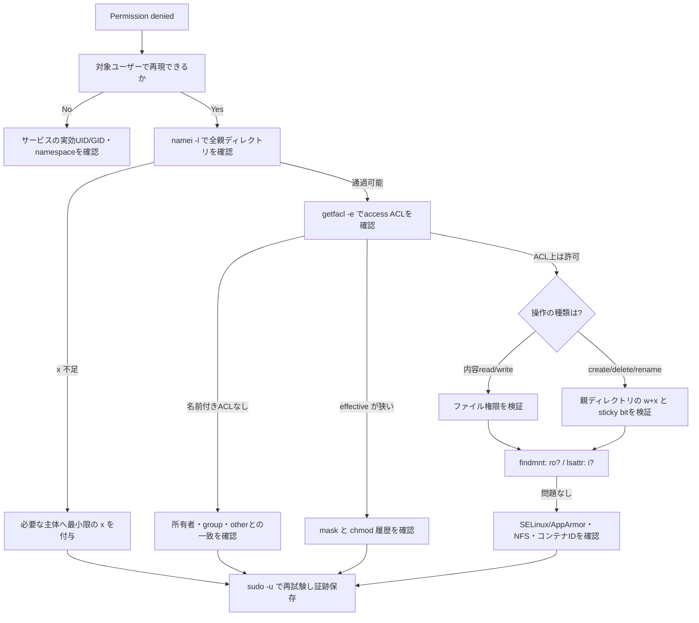

# Weekly Linux Deep-Dive — `getfacl` / `setfacl` で「権限は合っているのに読めない」を解く

[[Home]]

#linux #commands #operations #weekly #deep-dive

## 1. 今週のフォーカス

**難易度シグナル:** Intermediate（参加条件ではなく、扱う概念密度の目安）  
**主題:** POSIX Access Control List（ACL）を、単なる追加権限ではなく、再現可能な診断・変更・ロールバックの対象として扱う。

### 必要知識・ツール・環境

- **前提知識:** UID/GID、所有者・所有グループ・other、`rwx`、ディレクトリの `x`、`umask`
- **ツール:** `getfacl`, `setfacl`（Debian/Ubuntu: `acl` パッケージ、RHEL/Fedora系: `acl`）、`namei`, `stat`, `id`, `sudo`
- **環境:** root権限を使える使い捨てVMまたは検証ホスト。ext4/xfsなどACL対応ファイルシステムを想定
- **先に知っておく概念:** `chmod` は「ACLエントリのマスク」も変更し得る。コンテナ、NFS、CIFSではUID/GIDマッピングやサーバ側ACLが追加要因になる

### 測定可能な到達目標

終了時に次を実演できれば合格とする。

1. `getfacl` の **エントリ** と **effective（実効権限）** を説明できる。
2. `namei -l` と `sudo -u` を使い、パス通過失敗と対象ファイルACL失敗を区別できる。
3. 既存ACLをバックアップしてから最小変更を適用し、同じACLへ復元できる。
4. default ACLを使い、新規ファイルの権限を予測・検証できる。
5. `setfacl` の終了コードと事後検証を自動化に組み込める。

---

## 2. Foundation — メンタルモデル

### 2.1 カーネルは名前ではなく資格情報で判定する

プロセスは実UID・実GIDに加え、ファイルアクセス判定に使われる実効UID、実効GID、補助グループを持つ。`id` は現在のシェル、`sudo -u USER id` は対象ユーザーとしての資格情報を確認する入口になる。

ファイルを `open(2)` するとき、カーネルVFSは概ね次を確認する。

1. パスの各親ディレクトリを検索（`x`）できるか
2. 対象inodeに対する所有者/ACL/モード権限で要求操作が許可されるか
3. 読み取り専用マウント、immutable属性、LSM（SELinux/AppArmor）など別の制約がないか

したがって `ls -l` で対象だけを見るのは不十分である。親ディレクトリの `x` が欠ければ、ファイルに `r` があっても到達できない。

### 2.2 ACLの判定順序

アクセスACLは代表的に次の形を持つ。

```text
user::rw-          # 所有者
user:alice:r--     # 名前付きユーザー
group::r--         # 所有グループ
group:ops:rwx      # 名前付きグループ
mask::r-x          # 名前付きuser/groupとgroup::の上限
other::---         # 上記に一致しない者
```

重要なのは **maskが単なる表示項目ではなく上限** だという点である。たとえば `group:ops:rwx` があっても `mask::r-x` なら書き込みは無効で、`getfacl` は `#effective:r-x` と表示する。所有者 `user::` と `other::` はmaskの対象外。

`ls -l` のグループ欄は、拡張ACLがある場合は所有グループだけでなく **ACL mask** を表す。末尾の `+` は拡張ACLの存在を示すことが多い。

### 2.3 access ACLとdefault ACL

- **access ACL:** そのinode自身へのアクセス規則
- **default ACL:** ディレクトリだけに持てる、新規子要素へ継承されるテンプレート

default ACLは既存ファイルを遡って変更しない。新規作成時には要求モード（アプリが `open(..., mode)` で指定）とdefault ACLが組み合わされるため、「default ACLに `rwx` があるから必ず実行可能」ではない。

---

## 3. Production scenario — 本番シナリオと仮説

デプロイサービス `deploybot` が `/srv/report/incoming/report.csv` を更新する。運用担当は `ops` グループに `rwx` を設定したはずだが、サービスは `Permission denied` になる。`ls -l` は `-rw-r-x---+`。直前に「安全化」のため `chmod 750` が実行されていた。

### 調査仮説（安い検証から並べる）

1. サービスの実効UID/GIDが想定と違う。
2. 親ディレクトリのどこかに検索権限 `x` がない。
3. 名前付きACLはあるが、maskが `r-x` へ縮小されて書き込みが無効。
4. 対象は書けるが、置換に必要な親ディレクトリの `w+x` がない。
5. DAC/ACL以外（read-only mount、SELinux/AppArmor、immutable属性）が拒否している。

この順序なら、権限を広げる前に事実を収集できる。`chmod 777` は原因を隠し、情報漏えいや改ざん範囲を広げるので診断手段にしない。

---

## 4. Practical implementation — 主役ツールと関連コマンド

### `getfacl`: 現在状態を読む

```bash
getfacl --absolute-names /srv/report/incoming/report.csv
```

ヘッダの `# owner`, `# group`, `# flags` と、`user/group/mask/other` エントリを読む。`--absolute-names` は先頭 `/` を保持し、証跡を曖昧にしない。`-n` は名前を解決せず数値UID/GIDで表示するため、LDAP/NSS障害や別ホスト比較に有用。

### `setfacl`: 最小差分を適用する

```bash
sudo setfacl -m u:deploybot:rw /srv/report/incoming/report.csv
```

`-m` は変更、`-x` は指定エントリ削除、`-b` は全拡張ACL削除、`-k` はdefault ACLだけ削除。通常は必要に応じmaskを再計算する。`-n` / `--no-mask` で再計算を抑止できるが、意図せず実効権限を狭めるため、理解した検証以外では慎重に使う。

### 関連コマンド

- `id USER`: UID/GIDと補助グループ
- `namei -l PATH`: 全パス成分の所有者とモード
- `stat PATH`: inode、数値モード、所有者、タイムスタンプ
- `sudo -u USER -- command`: 対象者の資格情報で再現
- `findmnt -T PATH -o TARGET,SOURCE,FSTYPE,OPTIONS`: 対象パスの実マウント
- `lsattr PATH`: immutable (`i`) / append-only (`a`) 属性の確認
- `ausearch -m AVC -ts recent` または `journalctl`: SELinux/サービスログの確認

---

## 5. 重要フラグ、出力、終了コード、権限、移植性

### 重要フラグ

| コマンド | フラグ | 意味 |
|---|---|---|
| `getfacl` | `-n` | UID/GIDを数値表示 |
| `getfacl` | `-e` | 実効権限コメントを常に表示 |
| `getfacl` | `-R` | 再帰（巨大ツリーとマウント越境に注意） |
| `getfacl` | `-p` | 絶対パスを保持 |
| `setfacl` | `-m SPEC` | ACLを追加・変更 |
| `setfacl` | `-x SPEC` | 指定ACLエントリを削除 |
| `setfacl` | `-d -m SPEC` | default ACLを変更 |
| `setfacl` | `--set-file=FILE` | ACL一式を入力から設定 |
| `setfacl` | `--restore=FILE` | `getfacl -R` バックアップを復元 |
| `setfacl` | `--test` | 変更せず結果を表示（GNU/Linux実装で確認） |

### 出力フィールドの読み方

`user:alice:rwx #effective:r-x` は「エントリ上はrwx、mask適用後はr-x」。`default:` で始まる行は子へ継承するACL。`# flags: -s-` のような表示はsetuid/setgid/sticky bitに対応する。

### 終了コード

`getfacl` / `setfacl` は成功時 `0`、失敗時は非0。スクリプトではメッセージ文字列ではなく終了コードを確認し、その後に `getfacl` と実ユーザー操作で状態を検証する。

```bash
if sudo setfacl -m u:deploybot:rw FILE; then
  getfacl -e FILE
else
  rc=$?
  printf 'setfacl failed: rc=%s\n' "$rc" >&2
  exit "$rc"
fi
```

### 必要権限

原則としてファイル所有者または `CAP_FOWNER` を持つプロセス（通常root）がACLを変更できる。読み取りは多くの場合可能だが、親ディレクトリを通過できなければ取得できない。

### 移植性

ここで扱うのはLinuxで一般的なPOSIX ACLツール群だが、POSIX標準そのものではない。macOS/BSDのACL構文・継承は異なる。NFSv4 ACLはより豊富なallow/denyと継承モデルを持ち、`nfs4_getfacl` 系を使う場合がある。CIFS、コンテナのuser namespace、rootless環境ではホスト側IDとの対応も確認する。マウントやファイルシステムがACLをサポートしない場合、`Operation not supported` になり得る。

---

## 6. Guided Lab（約150分）

> **安全な場所:** `/tmp/linux-acl-lab` のみを使う。共有本番パスで実施しない。コマンドは検証VM向け。

### Phase A — 準備とベースライン（20分）

```bash
command -v getfacl setfacl namei
findmnt -T /tmp -o TARGET,SOURCE,FSTYPE,OPTIONS
sudo install -d -m 0750 /tmp/linux-acl-lab
sudo install -d -m 0750 /tmp/linux-acl-lab/incoming
printf 'version=1\n' | sudo tee /tmp/linux-acl-lab/incoming/report.txt >/dev/null
sudo chmod 0640 /tmp/linux-acl-lab/incoming/report.txt
```

**期待:** 3コマンドのパスが表示され、`/tmp` を含むマウントがACL対応の通常ファイルシステムである。  
**Checkpoint A:** `namei -l /tmp/linux-acl-lab/incoming/report.txt` で全階層を説明できる。

### Phase B — 一時ユーザーで障害を再現（25分）

```bash
sudo useradd --system --no-create-home acllab 2>/dev/null || true
sudo -u acllab -- cat /tmp/linux-acl-lab/incoming/report.txt
printf 'cat rc=%s\n' "$?"
sudo setfacl -m u:acllab:r /tmp/linux-acl-lab/incoming/report.txt
sudo -u acllab -- cat /tmp/linux-acl-lab/incoming/report.txt
```

最初は `Permission denied` と非0、ACL付与後は `version=1` と終了コード0を期待する。  
**Checkpoint B:** `ls -l` の末尾 `+` と `getfacl` の `user:acllab:r--` を確認。

### Phase C — mask障害を注入し、診断（30分）

```bash
sudo setfacl -m u:acllab:rw,m::r /tmp/linux-acl-lab/incoming/report.txt
getfacl -e /tmp/linux-acl-lab/incoming/report.txt
sudo -u acllab -- sh -c 'printf "version=2\n" >> /tmp/linux-acl-lab/incoming/report.txt'
printf 'write rc=%s\n' "$?"
sudo setfacl -m m::rw /tmp/linux-acl-lab/incoming/report.txt
sudo -u acllab -- sh -c 'printf "version=2\n" >> /tmp/linux-acl-lab/incoming/report.txt'
```

**期待:** `user:acllab:rw- #effective:r--` が原因を示し、mask修正後だけ追記に成功。  
**Checkpoint C:** ACLエントリと実効権限を別々に答える。

### Phase D — 親ディレクトリと置換操作（25分）

```bash
sudo chmod 0700 /tmp/linux-acl-lab/incoming
sudo -u acllab -- cat /tmp/linux-acl-lab/incoming/report.txt
namei -l /tmp/linux-acl-lab/incoming/report.txt
sudo setfacl -m u:acllab:rx /tmp/linux-acl-lab/incoming
sudo -u acllab -- cat /tmp/linux-acl-lab/incoming/report.txt
sudo -u acllab -- mv /tmp/linux-acl-lab/incoming/report.txt /tmp/linux-acl-lab/incoming/report.old
```

読み取りは親の `x` 修復で成功するが、名前変更は親ディレクトリに `w+x` が必要なので失敗する。ファイル自身の `w` だけではrenameできない。  
**Checkpoint D:** 「内容変更」と「ディレクトリエントリ変更」の権限対象を区別する。

### Phase E — default ACLの継承（25分）

```bash
sudo setfacl -m u:acllab:rwx,d:u:acllab:rwx /tmp/linux-acl-lab/incoming
sudo -u acllab -- sh -c 'umask 077; printf "new\n" > /tmp/linux-acl-lab/incoming/new.txt'
getfacl -e /tmp/linux-acl-lab/incoming
getfacl -e /tmp/linux-acl-lab/incoming/new.txt
```

**期待:** `new.txt` に `user:acllab:rw-` 相当が現れる。通常ファイルは作成要求に実行ビットがないため `x` は付かない。  
**Checkpoint E:** 既存 `report.txt` と新規 `new.txt` で継承差を確認。

### Phase F — バックアップ、変更、復元、清掃（25分）

```bash
sudo getfacl -R -p /tmp/linux-acl-lab | sudo tee /tmp/linux-acl-lab.acl >/dev/null
sudo setfacl -R -b /tmp/linux-acl-lab
getfacl -R -e /tmp/linux-acl-lab
sudo setfacl --restore=/tmp/linux-acl-lab.acl
getfacl -R -e /tmp/linux-acl-lab
```

**Checkpoint F:** バックアップ前後の `getfacl -R -p` を保存し、復元後に期待ACLが戻ったことを確認。清掃は末尾の「安全とロールバック」を参照。

---

## 7. トラブルシューティング決定木



---

## 8. Copy-ready examples（解説付き）

### 1) 数値ID込みでACL証跡を採る

```bash
getfacl -n -e -p /srv/app/data.db
```

名前解決の揺れを避け、maskによる実効権限も表示する。異なるホスト間の比較に向く。

### 2) 対象ユーザーのグループを確認

```bash
id deploybot
```

ACL以前に、想定した補助グループがログインセッションやサービスに反映されているか確認する。

### 3) 全パス成分を縦に調査

```bash
namei -l /srv/report/incoming/report.csv
```

対象ファイルだけでなく `/`, `/srv`, `report`, `incoming` の検索権限を一覧化する。

### 4) 名前付きユーザーへ読み取りだけ付与

```bash
sudo setfacl -m u:auditor:r /srv/report/final.csv
```

グループ再編やworld-readable化をせず、監査者1名へ最小権限を与える。

### 5) グループへディレクトリ操作権限を付与

```bash
sudo setfacl -m g:deploy:rwx /srv/releases/staging
```

作成・削除・renameにはディレクトリの `w+x` が必要。読み一覧も必要なら `r` を含める。

### 6) maskを明示して実効権限を直す

```bash
sudo setfacl -m m::rwx /srv/releases/staging
```

名前付きエントリが正しくても `effective` が狭い場合に使う。誰の権限まで広がるか、全group classを先に確認する。

### 7) 特定ユーザーACLだけ削除

```bash
sudo setfacl -x u:formeruser /srv/report/final.csv
```

`-b` で全部消さず、退職者など対象エントリだけを除去する。

### 8) default ACLを設定

```bash
sudo setfacl -d -m u::rwx,g::r-x,g:ops:rwx,m::rwx,o::--- /srv/team
```

以後作られる子にチーム運用の初期ACLを与える。既存子は変わらない。

### 9) default ACLだけ削除

```bash
sudo setfacl -k /srv/team
```

現在のaccess ACLは残し、将来の継承のみ停止する。

### 10) 再帰バックアップを採る

```bash
sudo getfacl -R -p /srv/team > /var/tmp/srv-team.$(date +%Y%m%d%H%M%S).acl
```

変更前の所有者、グループ、ACLを復元可能な形式で保存する。バックアップ自体の機密性にも注意。

### 11) 変更前にテスト表示

```bash
sudo setfacl --test -R -m g:ops:rX /srv/team
```

GNU `setfacl` の対応環境では変更予定を確認できる。大文字 `X` はディレクトリ、または既に誰かに実行権限があるファイルだけに実行を付与する。

### 12) 保存したACLを復元

```bash
sudo setfacl --restore=/var/tmp/srv-team.20260915091500.acl
```

`getfacl -R -p` の出力を使い、ACLと関連メタデータを戻す。パスが一致する場所で実施し、出力と終了コードを確認する。

### 13) 実ユーザーとして読み書きを検証

```bash
sudo -u deploybot -- sh -c 'test -r /srv/report/final.csv && test -w /srv/report/final.csv'
```

管理者視点の見た目ではなく、対象資格情報で要求操作をテストする。成功時は0、どちらかが満たされなければ非0。

### 14) ACL以外の拒否要因を確認

```bash
findmnt -T /srv/report/final.csv -o TARGET,FSTYPE,OPTIONS && lsattr /srv/report/final.csv
```

read-onlyマウントやimmutable属性なら、ACLを広げても書き込めない。

---

## 9. Failure injection / 診断チャレンジ

次の状態を作る。

```bash
sudo setfacl -m u:acllab:rw,m::r /tmp/linux-acl-lab/incoming/new.txt
sudo chmod 0700 /tmp/linux-acl-lab/incoming
```

**課題:** ACLを闇雲に広げず、`acllab` が `new.txt` を追記できない理由を全て列挙し、次の条件を満たす最小修復を設計する。

- `acllab` は `incoming` を一覧表示できない
- 既知の `new.txt` は読み書きできる
- 他ユーザー（other）にはアクセスを与えない

一例:

```bash
sudo setfacl -m u:acllab:x /tmp/linux-acl-lab/incoming
sudo setfacl -m u:acllab:rw,m::rw /tmp/linux-acl-lab/incoming/new.txt
sudo -u acllab -- sh -c 'printf "verified\n" >> /tmp/linux-acl-lab/incoming/new.txt'
```

ディレクトリに `r` を与えないため一覧は不可、`x` により既知名へ到達できる。ファイル側はmaskを含めて実効 `rw` にする。

---

## 10. Production concerns — 安全、ロールバック、破壊的操作

> [!danger] 本番で `setfacl -R -b`、`chmod -R`、`chown -R` を即実行しない
> 再帰変更はサービス、秘密鍵、ソケット、setgidディレクトリの意味を壊す。マウントポイントを跨ぐ可能性もある。対象件数を `find` で確認し、バックアップ、カナリア、事後検証を必須にする。

- ACLバックアップにはパス、所有者、アクセス構造が含まれる。権限制限された場所に保存する。
- `chmod` はACL maskを書き換えることがある。構成管理が定期的に `chmod` していないか確認する。
- recursive操作ではシンボリックリンクとマウント境界の扱いをman pageで確認する。
- サービスはグループ変更後に再起動が必要な場合がある。既存プロセスの補助グループは自動更新されない。
- ACLが正しくてもSELinux/AppArmorは独立して拒否できる。DACを不用意に広げて解決しない。

### ラボのロールバックと清掃

まず復元テストを完了し、対象を文字列で再確認する。

```bash
test "$(realpath /tmp/linux-acl-lab)" = /tmp/linux-acl-lab
sudo find /tmp/linux-acl-lab -maxdepth 2 -ls
sudo userdel acllab
sudo rm -r --one-file-system /tmp/linux-acl-lab
sudo rm -f /tmp/linux-acl-lab.acl
```

`rm` はこの使い捨てラボだけに限定する。検証に不安があれば削除せずVMごと破棄する。本番パスへ置換して実行してはならない。

---

## 11. Verification checklist と成果物

- [ ] 最新12号と重複しない主題であることを確認した
- [ ] `id` とサービス設定から実効主体を特定した
- [ ] `namei -l` で親ディレクトリを全て確認した
- [ ] `getfacl -n -e -p` の証跡を保存した
- [ ] `effective` とmaskの関係を説明した
- [ ] 対象ユーザーで失敗と成功を再現した
- [ ] ACL以外のmount/属性/LSM要因を検討した
- [ ] 変更前バックアップと復元を実演した
- [ ] default ACLの新規作成時だけの効果を確認した
- [ ] 終了コード0と期待操作の両方で検証した

### concrete deliverables

1. `/tmp/linux-acl-lab.acl` — 復元可能なACLバックアップ
2. `getfacl -n -e -p` の変更前・障害時・修復後の3スナップショット
3. 原因を「主体」「パス通過」「対象inode」「mask」「ACL外制約」に分けた短い調査メモ
4. 対象ユーザーでの再現コマンドと終了コード
5. 本番適用を想定した変更・検証・ロールバック手順

---

## 12. 5問アセスメント

<details>
<summary>問題と解答を開く</summary>

### Q1. `user:alice:rwx #effective:r-x` で書けない直接原因は？

**答え:** ACL maskが書き込みを許可していない。名前付きユーザーのエントリは `rwx` でも、group classの上限であるmask適用後は `r-x`。

### Q2. ファイルに `rw` があるのにrenameできない。最初に見る場所は？

**答え:** 親ディレクトリ。renameやdeleteはディレクトリエントリ操作なので、原則として親に `w+x` が必要。sticky bitも確認する。

### Q3. default ACLを追加すると既存ファイルも変わるか？

**答え:** 変わらない。default ACLは以後作成される子要素へのテンプレート。

### Q4. `ls -l` のグループ欄が `r-x` なのに `group:ops:rwx` があるのは矛盾か？

**答え:** 矛盾ではない。拡張ACLがある場合、モードのgroupビットはACL maskを反映し、`ops` の実効権限も `r-x` になり得る。

### Q5. ACL上は許可されているのに `EACCES`/`EPERM` が続く場合の次の確認は？

**答え:** read-onlyマウント、immutable属性、SELinux/AppArmor、NFS/CIFS側ACL、コンテナやuser namespaceのID対応、実プロセスの資格情報を確認する。

</details>

---

## 13. Optional advanced challenge と公式リファレンス

### Advanced challenge（任意・45〜90分）

systemdの一時サービスを `DynamicUser=yes` で起動し、`StateDirectory=` が生成する所有権とACLを観察する。固定ユーザーACLが動的UIDに向かない理由を説明し、グループ、systemd管理ディレクトリ、またはサービス設計で解決案を比較する。さらにSELinux有効環境では、DAC許可後にもLSM拒否を再現し、監査ログから「ACL問題ではない」と証明する。

### 公式リファレンス

- `man 5 acl` — Linux ACLのアクセス判定、オブジェクト作成、modeとの対応
- `man 1 getfacl` — 表示形式、実効権限、再帰取得
- `man 1 setfacl` — 変更、mask再計算、バックアップ復元
- `man 2 acl` / `man 5 attr` — ACLと拡張属性の背景（環境によりmanセクション差あり）
- `man 2 open`, `man 2 access`, `man 7 path_resolution` — カーネルのパス解決とアクセス検査
- Linux man-pages project: https://man7.org/linux/man-pages/man5/acl.5.html
- Red Hat Enterprise Linux Documentation — Managing file permissions / POSIX ACLs: https://docs.redhat.com/
- Ubuntu Server documentation — Security and user management: https://documentation.ubuntu.com/server/

---

## 今週の要点

権限障害では「`ls -l` がどう見えるか」より、**どの資格情報を持つプロセスが、どのパス成分を通り、どのACLエントリに一致し、mask適用後に何が許可され、さらに別のカーネル制約がないか**を順に証明する。変更は最小差分、検証は対象ユーザー、ロールバックは変更前に用意する。
