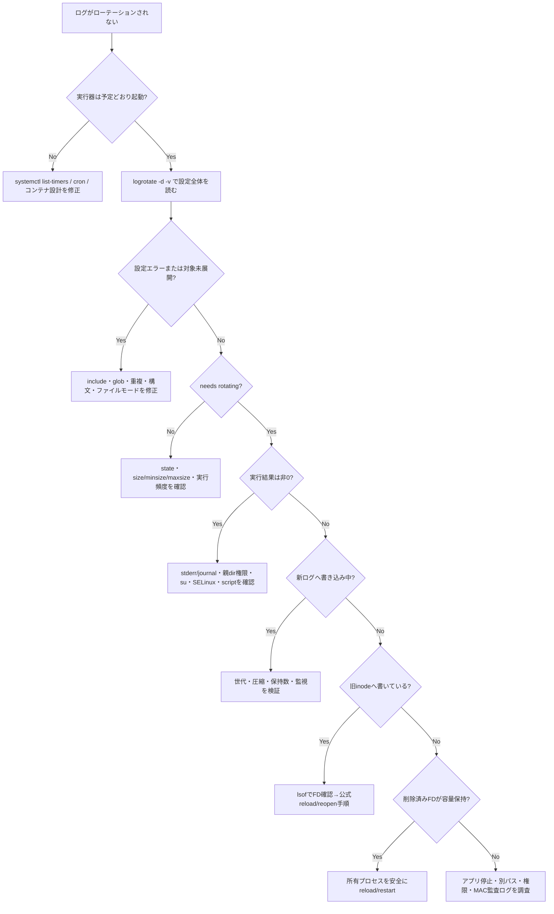

[[Home]]

# Weekly Linux Deep-Dive — `logrotate`で「ログがディスクを食い尽くす」を予防し、証明可能に運用する

#linux #commands #operations #weekly #deep-dive

## 1. Weekly focus・難易度・前提・到達目標

### 今週の焦点

`logrotate`を単なる「古いログを消すコマンド」ではなく、**ログファイルの世代管理、圧縮、再生成、プロセスへの再オープン通知を再現可能に実行するポリシーエンジン**として理解する。

- **難易度シグナル:** Intermediate（受講条件ではなく、説明の密度の目安）
- **所要時間:** 150分（Foundation 25分、実装45分、障害注入50分、検証30分）

### 必要知識・ツール・環境

- 必要知識: 絶対パス、所有者/グループ、`chmod`、プロセス、ファイルディスクリプタ（FD）
- 先に知っておく概念: `df`と`du`の違い、削除済みでも開かれたファイルは容量を保持すること
- 必須ツール: `logrotate`, `bash`, `stat`, `find`, `gzip`, `ps`
- 推奨ツール: `lsof`, `systemctl`, `journalctl`
- 環境: systemd採用の一般的なLinux。ラボ本体は一般ユーザー権限で実施可能
- パッケージ例: Debian/Ubuntuは `sudo apt install logrotate lsof`、RHEL/Fedoraは `sudo dnf install logrotate lsof`

> [!note]
> macOSの標準機構は異なる。BusyBox環境やコンテナ最小イメージでは`logrotate`が未導入の場合がある。ラボはGNU/Linux上のlogrotateを想定する。

### 測定可能な到達目標

終了時に次を実演できれば合格。

1. `-d`で設定を無変更検証し、対象・条件・次回判定を説明できる。
2. 独立したstateファイルを使い、任意ディレクトリのログを3世代ローテーションできる。
3. `rename + create`と`copytruncate`の違いを、inodeとFDを使って説明できる。
4. `postrotate`失敗、権限不整合、重複設定を切り分けられる。
5. 実行スケジュール、終了コード、生成物を証拠として残せる。

---

## 2. Foundation — メンタルモデル

### 2.1 logrotateは常駐デーモンではない

`logrotate`自身は通常、常駐してログサイズを監視しない。cronまたはsystemd timerが定期的に起動し、設定とstateを読み、条件を満たすログへ処理を適用する。

```text
systemd timer / cron
        ↓ 定期起動
logrotate → 設定 + state → 条件判定 → rename/copy/compress/create → script
                                                    ↓
                                             ログ出力プロセス
                                      （必要なら再オープン通知）
```

したがって`daily`は「実行から24時間後」ではなく、定期実行時にstateと照合して日単位の条件を満たすか、という意味になる。タイマーが週1回しか動かなければ`hourly`を書いても毎時処理されない。

### 2.2 カーネル、inode、名前、FD

ユーザー空間のログ出力プロセスは、パス名ではなくカーネルが管理する開いたFDへ書く。

1. プロセスが `/var/log/app.log` をopenする。
2. カーネルはパス名をinodeへ解決し、FDを返す。
3. logrotateが `app.log` を `app.log.1` にrenameしてもinodeは同じ。
4. プロセスがFDを閉じて再openしない限り、書き込み先は`app.log.1`のまま。
5. `create`で作った新しい`app.log`には、再open後から書かれる。

これが`postrotate`でHUP/USR1/reloadを送る理由である。アプリが再openに対応しない場合、`copytruncate`は回避策になるが、コピーとtruncateの間に書かれた行が欠落する競合窓を持つ。

### 2.3 設定・state・実行器を分離して考える

- **設定:** `/etc/logrotate.conf`と通常 `/etc/logrotate.d/*`
- **state:** 最終ローテーション時刻など。典型例は `/var/lib/logrotate/status`
- **実行器:** `logrotate.timer` / cron
- **ログ生成者:** nginx、アプリ、syslogデーモンなど

「設定が正しい」だけでは不十分。タイマー未実行、stateの時刻、生成者の再open失敗のどれでも運用は破綻する。

---

## 3. Production scenario — 本番シナリオと調査仮説

### シナリオ

APIサーバーの `/var/log/myapi/access.log` が180GBに達した。`/etc/logrotate.d/myapi`には`daily`と`rotate 14`があるが、`.1`以降が存在しない。手動でログを削除したのに`df`の空き容量も戻らない。

### 仮説を検証順に並べる

1. **実行器:** timer/cronが無効、失敗、またはコンテナ内で存在しない。
2. **設定読込:** ファイル名/モードが不適切、include外、構文エラー、重複定義。
3. **条件:** state上はまだ期限前、`size`未満、`minsize`や`maxsize`の理解違い。
4. **権限:** 親ディレクトリへrename/createできない、`su`が不正、SELinux/AppArmor拒否。
5. **再オープン:** ローテーションは成功したがプロセスが古いinodeへ書き続ける。
6. **削除済みFD:** unlink済みの巨大ログをプロセスが開いたままで、ブロックが解放されていない。

### 最初に集める証拠

```bash
systemctl status logrotate.timer logrotate.service --no-pager
systemctl list-timers logrotate.timer --all
journalctl -u logrotate.service --since '7 days ago' --no-pager
sudo logrotate -d /etc/logrotate.conf
sudo lsof +L1
df -h /var; du -xsh /var/log
```

設定編集より前に、**いつ、誰が、何を読み、どの条件で見送ったか**を記録する。

---

## 4. `logrotate`の深掘りと関連コマンド

### 処理フェーズ

1. 設定を字句/構文解析する。
2. globを展開し、対象ログを列挙する。
3. state、時刻、サイズから実行要否を判定する。
4. `prerotate`を実行する。
5. renameまたはcopyし、必要なら元ファイルをcreate/truncateする。
6. `postrotate`を実行し、生成者に再openさせる。
7. `delaycompress`でない旧世代を圧縮する。
8. 世代数/期間条件を超えるファイルを削除し、stateを更新する。

厳密な順序はディレクティブや実装版に依存するため、対象ホストの`man logrotate`と`-d -v`で確認する。

### 主要ディレクティブ

- `daily` / `weekly` / `monthly` / `hourly`: 時間ベース。実行器の頻度が上限。
- `size 100M`: サイズ条件だけで判定。時間条件を上書きする位置関係に注意。
- `minsize 100M`: 時間条件を満たし、かつ指定サイズ以上なら実行。
- `maxsize 1G`: 時間条件を待たず、実行時に上限超過なら実行。
- `rotate 7`: 保持世代数。`rotate 0`は保持しない。
- `compress` / `delaycompress`: gzip等で圧縮。直前世代を1サイクル遅らせる。
- `missingok`: 対象がなくてもエラーにしない。
- `notifempty`: 空ファイルはローテーションしない。
- `create 0640 user group`: rename後に新規ログを指定属性で作る。
- `su user group`: ローテーション処理を指定ユーザー/グループで行う。
- `copytruncate`: コピー後に元inodeを0バイト化。再open不要だが欠落リスクあり。
- `sharedscripts`: 複数glob対象に対してscriptを1回だけ実行。
- `dateext`: `.1`ではなく日付をsuffixへ使う。

### 関連コマンド

- `stat`: inode、サイズ、所有者、時刻を確認。
- `lsof`: どのプロセスがどのinodeを開いているか、削除済みFDがあるか確認。
- `find`: 世代ファイルのサイズ、時刻、所有者を列挙。
- `systemctl` / `journalctl`: 実行器と失敗履歴を確認。
- `gzip -t`: 圧縮世代の整合性を検査。
- `logger`: syslog経路へ試験メッセージを投入。

---

## 5. flags・出力・終了コード・権限・移植性

### 重要flags

| flag | 意味 | 運用上の注意 |
|---|---|---|
| `-d`, `--debug` | 変更せず判定を表示 | stateも更新しない。最初に使う |
| `-v`, `--verbose` | 詳細表示 | 実行記録に保存するとよい |
| `-f`, `--force` | 条件を無視して強制実行 | 本番では世代押し出しに注意 |
| `-s FILE`, `--state FILE` | stateを指定 | テストを本番stateから隔離する |
| `-l FILE`, `--log FILE` | verbose出力をファイルへ記録 | 対応版か`--help`で確認 |

### 出力の読みどころ

`-d -v`では次を見る。

- `reading config file`: 期待した設定が読まれているか。
- `considering log`: globが対象へ展開されたか。
- `Last rotated at`: state上の最終時刻。
- `log needs rotating` / `does not need rotating`: 判定と理由。
- `renaming`, `creating new`, `compressing`: 実行予定/実行済み操作。

### 終了コード

成功は原則`0`、設定・権限・scriptなどのエラーは非0。具体値を固定して書くより、シェルでは次のように判定する。

```bash
if logrotate -d ./lab.conf; then
  echo 'configuration check passed'
else
  rc=$?
  echo "configuration check failed: rc=$rc" >&2
fi
```

複数ログの一部だけ失敗する場合もあるため、終了コードだけでなくstderrと生成物を確認する。

### 権限とセキュリティ

- `/var/log`配下のrename/create、state更新、サービスへのsignalには通常root権限が必要。
- world-writableまたは非root所有ディレクトリでは安全対策により拒否されることがある。`su`を検討する。
- `create`の所有者は**ログを書く実ユーザー**に合わせる。誤ると次回書き込みが止まる。
- scriptは通常、高権限で動く。変数展開、相対パス、書込可能ディレクトリ上の実行ファイルを避ける。
- SELinuxではUnixモードが正しくても拒否される。`ausearch -m AVC`などで別層として調査する。

### 移植性

- ディストリビューションによりstateパス、cron/timer、既定include、logrotate版が異なる。
- `dateformat`の利用可能な書式やscript引数は対象版のman pageで確認する。
- systemd journalのバイナリログは通常`journald`自身の保持設定で管理し、logrotate対象にしない。
- コンテナではstdout/stderrへ出し、ランタイム/収集基盤にローテーションを委ねる設計が多い。

---

## 6. Guided lab（150分）— 一般ユーザー権限で再現する

> [!warning]
> このラボは`/tmp/logrotate-lab-$UID`だけを使う。`sudo`、`/etc`編集、実サービスへのsignalは不要。既存ディレクトリがある場合は削除せず、別名へ変更すること。

### Phase A: 環境と隔離（15分）

```bash
LAB="/tmp/logrotate-lab-$UID"
mkdir -p "$LAB/log" "$LAB/archive"
logrotate --version
command -v stat gzip
```

設定ファイル`$LAB/lab.conf`を次の内容で作る。

```conf
/tmp/logrotate-lab-1000/log/app.log {
    size 2k
    rotate 3
    compress
    delaycompress
    missingok
    notifempty
    create 0640
    dateext
}
```

`1000`は`id -u`の結果に置き換える。

```bash
id -u
sed -n '1,30p' "$LAB/lab.conf"
: > "$LAB/log/app.log"
chmod 0640 "$LAB/log/app.log"
```

**Checkpoint A**

```bash
stat -c 'inode=%i size=%s mode=%a owner=%U:%G path=%n' "$LAB/log/app.log"
```

期待: サイズ0、mode 640。ここでパスが自分のUIDを含むことを確認する。

### Phase B: dry-runと条件判定（25分）

```bash
logrotate -d -s "$LAB/state" "$LAB/lab.conf"
printf 'line=%04d payload=%080d\n' {1..30} {1..30} >> "$LAB/log/app.log"
wc -c "$LAB/log/app.log"
logrotate -d -v -s "$LAB/state" "$LAB/lab.conf"
```

**Checkpoint B**

- 1回目は空なので`notifempty`により見送り。
- データ投入後は2KiB超となり、`log needs rotating`相当が見える。
- `-d`なのでファイルもstateも変更されていない。

### Phase C: 実ローテーションと世代管理（30分）

```bash
before_inode=$(stat -c %i "$LAB/log/app.log")
logrotate -v -s "$LAB/state" "$LAB/lab.conf"
after_inode=$(stat -c %i "$LAB/log/app.log")
printf 'before=%s after=%s\n' "$before_inode" "$after_inode"
find "$LAB/log" -maxdepth 1 -type f -printf '%f\t%s bytes\n' | sort
sed -n '1,10p' "$LAB/state"
```

期待: 新しい`app.log`は別inode、旧ログは日付suffix付き、直前世代は`delaycompress`により未圧縮。

さらに3回繰り返す。

```bash
for round in 2 3 4; do
  printf 'round=%s line=%04d payload=%080d\n' "$round" {1..30} {1..30} >> "$LAB/log/app.log"
  logrotate -f -s "$LAB/state" "$LAB/lab.conf"
done
find "$LAB/log" -maxdepth 1 -type f -printf '%TY-%Tm-%Td %TH:%TM\t%s\t%f\n' | sort
```

> [!important]
> 同日に`dateext`で`-f`を繰り返すと同名衝突する版/設定がある。衝突したら失敗は学習材料であり、`dateformat -%Y%m%d-%H%M%S`を追加するか、このPhaseだけ`dateext`を外す。実行間隔と名前の粒度を一致させること。

**Checkpoint C**

- `rotate 3`の上限を説明できる。
- `.gz`へ`gzip -t FILE`を実行して0を確認できる。
- stateが更新されている。

### Phase D: 開いたFDと再オープン（35分）

別ターミナルで単純なwriterを起動する。

```bash
LAB="/tmp/logrotate-lab-$UID"
bash -c 'exec 3>>"$1/log/app.log"; while :; do printf "%s writer\n" "$(date +%s)" >&3; sleep 1; done' _ "$LAB" &
writer_pid=$!
echo "$writer_pid" > "$LAB/writer.pid"
```

元ターミナルで観測する。

```bash
LAB="/tmp/logrotate-lab-$UID"
sleep 3
stat -c '%i %s %n' "$LAB/log/app.log"
logrotate -f -s "$LAB/state" "$LAB/lab.conf"
sleep 3
stat -c '%i %s %n' "$LAB/log/"app.log*
lsof -p "$(cat "$LAB/writer.pid")" 2>/dev/null | rg 'app\.log' || true
```

期待: 新しい`app.log`が0のままでも、writerはrenameされた旧inodeへ書き続ける。これはlogrotateの失敗ではなく、生成者が再openしていない状態。

writerを再起動して再openを再現する。

```bash
kill "$(cat "$LAB/writer.pid")"
wait "$(cat "$LAB/writer.pid")" 2>/dev/null || true
bash -c 'exec 3>>"$1/log/app.log"; printf "reopened\n" >&3' _ "$LAB"
tail -n 3 "$LAB/log/app.log"
```

**Checkpoint D**

- path名とinode/FDが別概念だと説明できる。
- 本番アプリの公式な再open signalを確認せず、推測で`kill -HUP`してはいけない理由を説明できる。

### Phase E: 診断・検証・片付け（45分）

構文エラーを注入する。

```bash
cp "$LAB/lab.conf" "$LAB/bad.conf"
printf '\nthis_directive_does_not_exist\n' >> "$LAB/bad.conf"
logrotate -d -s "$LAB/bad.state" "$LAB/bad.conf"
echo "rc=$?"
```

期待: 非0終了で、行または不明ディレクティブを示す診断が出る。次に`bad.conf`は使わず、元設定が成功することを確認する。

```bash
logrotate -d -v -s "$LAB/state" "$LAB/lab.conf" > "$LAB/dry-run.txt" 2>&1
test -s "$LAB/dry-run.txt"
find "$LAB" -maxdepth 2 -type f -printf '%m %u:%g %s %p\n' | sort
```

片付けは中身を確認してから実施する。

```bash
find "$LAB" -maxdepth 2 -print
# 確認後のみ:
rm -r -- "$LAB"
```

**Checkpoint E**

- `dry-run.txt`、state、世代ファイルの3種類を証拠として説明できる。
- ラボ外のファイルを変更していない。

---

## 7. Troubleshooting decision tree



---

## 8. Copy-ready examples（各例の意図付き）

### 例1: 本番設定を無変更で検査

```bash
sudo logrotate -d -v /etc/logrotate.conf
```

設定全体の読込、対象、state判定を確認する。最初の一手であり、ファイルを回さない。

### 例2: テストstateを隔離して強制実行

```bash
sudo logrotate -v -f -s /tmp/logrotate-test.status /etc/logrotate.d/myapi
```

本番stateを汚さず個別設定を試す。ただし対象ログ自体は実際に変更されるため、検証環境向け。

### 例3: 実行タイマーと次回時刻を確認

```bash
systemctl list-timers logrotate.timer --all
```

設定の`daily`だけでなく、誰がいつ起動するかを確認する。

### 例4: 直近の失敗理由を読む

```bash
sudo journalctl -u logrotate.service --since '7 days ago' --no-pager
```

一時的な権限エラーやscript失敗を履歴から探す。

### 例5: 削除済みだが開かれた巨大ファイルを探す

```bash
sudo lsof +L1 | sort -k7,7nr | head -20
```

リンク数0の開いたファイルをサイズ順に見る。`rm`後も`df`が戻らない場合の本命。

### 例6: ログ世代のinodeとサイズを比較

```bash
stat -c 'inode=%i size=%s mtime=%y owner=%U:%G mode=%a %n' /var/log/myapi/access.log*
```

rename後にプロセスがどの世代へ書く可能性があるか、属性も含めて確認する。

### 例7: 保持世代の実サイズを列挙

```bash
sudo find /var/log/myapi -maxdepth 1 -type f -name 'access.log*' -printf '%TY-%Tm-%Td %TH:%TM\t%s\t%p\n' | sort
```

圧縮後の実消費量と時系列を数値で把握する。

### 例8: gzip世代を破損検査

```bash
find /var/log/myapi -maxdepth 1 -type f -name '*.gz' -exec gzip -t -- {} +
```

終了コード0なら検査対象は正常。バックアップ/転送前の確認にも使える。

### 例9: 設定の重複参照を検索

```bash
sudo rg -n --fixed-strings '/var/log/myapi/access.log' /etc/logrotate.conf /etc/logrotate.d
```

同じログを複数ブロックが定義するとエラーや予期せぬ扱いになる。`rg`がなければ`grep -RFn`を使う。

### 例10: アプリユーザーが新ログへ書けるか検証

```bash
sudo -u myapi test -w /var/log/myapi/access.log && echo writable
```

rootから見た権限ではなく、実際のサービスユーザーで`create`後の書込可否を確認する。

### 例11: systemd unitの実ユーザーを確認

```bash
systemctl show myapi.service -p User -p Group -p ExecReload
```

`create`の所有者と公式reload経路をunit定義から確認する。空の`ExecReload`は独自signalを推測してよい意味ではない。

### 例12: `df`と`du`の差を同時に記録

```bash
df -h /var && sudo du -xsh /var/log
```

ファイル名から到達できる容量と、ファイルシステムが保持する容量の差を見つける入口。

### 例13: 設定ファイルだけをCI風に検証

```bash
logrotate -d -s /dev/null ./packaging/myapi.logrotate >/tmp/logrotate-check.out 2>&1; rc=$?; sed -n '1,120p' /tmp/logrotate-check.out; exit "$rc"
```

パッケージ同梱設定を変更せず検査し、診断を表示した上で終了コードを引き継ぐ。

---

## 9. Failure injection / diagnostic challenge

### 課題: 「ローテーション成功なのに新ログが空」

Phase Dのwriterを動かしたまま次を観測する。

1. `logrotate -f`は0で終了する。
2. 新しい`app.log`は作成されるが増えない。
3. 旧世代だけサイズが増える。
4. `lsof -p PID`は旧inodeを示す。

**問い:** logrotate設定、ファイル権限、writerのどこを直すべきか。

**期待する診断:** ローテーション自体と`create`は成功。writerがFDを再openしていない。実サービスなら公式ドキュメントに従った`postrotate`（reloadまたは再open signal）を設定する。再open非対応なら、ログ出力方式をstdout/syslogへ変えることを優先し、損失窓を受容できる場合だけ`copytruncate`を検討する。

**追加注入:** `create 0000`へ変えて再度回し、新しいwriterが書けないことを確認する。元に戻す前に、失敗が「ローテーション」と「アプリの継続書込」のどちらで検知されるか整理する。

---

## 10. Safety・rollback・破壊的操作の警告

> [!danger]
> `logrotate -f`はdry-runではない。保持数を超えた世代を押し出し、削除し得る。本番設定に対して安易に反復しない。

- まず`-d -v`、次に隔離state、最後に管理された実行の順に進める。
- `copytruncate`は無停止に見えるが原子的ではない。コピー中に追記された行の重複/欠落可能性を受け入れられるか評価する。
- `postrotate`でプロセス名を曖昧に`pkill`しない。unitの`reload`やpidfileなど公式経路を使う。
- `rm`で巨大ログを消す前にFDを確認する。消してもプロセス再openまで容量が戻らず、証拠だけ失うことがある。
- 圧縮にはCPUとI/Oが必要。ピーク時間、巨大ログ、低空き容量では`delaycompress`、`compressoptions`、スケジュールを評価する。
- 設定変更前に対象ファイルをコピーし、`logrotate -d`結果を保存する。

### Rollback手順

1. 変更した `/etc/logrotate.d/NAME` を既知の正常版へ戻す。
2. `sudo logrotate -d -v /etc/logrotate.conf`で構文と重複を確認。
3. `create`で所有者を誤った場合は、正しい所有者/モードへ戻す。
4. アプリが旧世代へ書く場合、公式手順でreload/restartする。
5. 退避世代を現行名へ戻す必要がある場合は、まずプロセス停止/再openを調整し、上書きせず別名へ退避してから行う。

---

## 11. Verification checklist と成果物

### チェックリスト

- [ ] `logrotate -d -v`が構文エラーなしで完了する
- [ ] 対象ログが`considering log`に現れる
- [ ] 実行器の前回/次回時刻を確認した
- [ ] stateの最終ローテーション時刻を確認した
- [ ] 新ログのowner/group/modeが生成者に適合する
- [ ] 生成者がローテーション後に新inodeへ書く
- [ ] 保持世代数と実サイズがポリシーどおり
- [ ] 圧縮世代が`gzip -t`を通る
- [ ] service journalにscriptエラーがない
- [ ] `lsof +L1`に不要な削除済み巨大FDがない
- [ ] `df`で期待する空き容量を確認した
- [ ] rollback手順と担当者が記録されている

### 具体的な成果物

1. `$LAB/lab.conf` — 3世代、圧縮、再生成を定義した設定。
2. `$LAB/state` — 判定履歴の証拠。
3. `$LAB/dry-run.txt` — 無変更検証ログ。
4. inodeのbefore/after記録 — rename/createの理解を示す。
5. 200字以内の障害報告 — 原因、証拠、修正、再発防止を含める。

報告例:

> timerは正常だったが、ローテーション後もmyapiが旧inodeを開いたままで、新ログが空になっていた。`lsof`でPIDと旧世代のinode一致を確認。公式reloadでFDを再openし、新inodeへの追記を検証した。設定へ`postrotate`を追加し、世代数・gzip整合性・次回timerを確認した。

---

## 12. Five-question assessment

1. `daily`を設定したのに3日間回らないとき、設定以外に最初に確認すべきものは何か。
2. rename後もアプリが`.1`へ書き続けるのはなぜか。
3. `size 100M`、`minsize 100M`、`maxsize 100M`の意図の違いは何か。
4. `-d`と`-f`の安全性の違いは何か。
5. `rm`後も`df`が改善しない場合、どのコマンドで何を探すか。

<details>
<summary>解答を見る</summary>

1. `logrotate.timer`またはcronの実行履歴と次回予定、service journal、stateを確認する。
2. プロセスはパス名ではなく、open済みFDが参照するinodeへ書くため。公式reload/reopenが必要。
3. `size`はサイズ基準を主条件にする。`minsize`は時間条件を満たしても最低サイズ未満なら見送る。`maxsize`は実行時に上限超過なら時間条件を待たず回す。
4. `-d`は変更もstate更新もしない診断。`-f`は条件を無視して実際に処理し、古い世代を削除し得る。
5. `lsof +L1`でリンク数0だがプロセスが開いたままのファイルを探し、所有PIDを安全なreload/restartで解放する。

</details>

---

## 13. Follow-up challenge と公式リファレンス

### Optional advanced challenge（45〜90分）

一時的なsystemd serviceを作り、継続ログwriterに`ExecReload`でUSR1を送る設計を試作する。writer側にsignal handlerを実装し、受信時にFDをclose/reopenさせる。

検証条件:

- ローテーション前後でinodeが変わる。
- reload後、新しいinodeだけが増える。
- 1秒ごとの連番に欠落/重複がない。
- `postrotate`失敗時にlogrotateが非0となり、journalへ診断が残る。
- `copytruncate`版と比較し、整合性・停止時間・複雑性を表にまとめる。

### 公式リファレンス

- `man 8 logrotate` — コマンド、終了、処理モデル
- `man 5 logrotate.conf` — ディレクティブ、script、圧縮、所有権
- `man 5 systemd.timer` — timerの時間モデル
- `man 1 systemctl` / `man 1 journalctl` — 実行器と履歴調査
- logrotate upstream: <https://github.com/logrotate/logrotate>
- Fedora package documentation: `rpm -qd logrotate` と `/usr/share/doc/logrotate/`
- Debian package documentation: `/usr/share/doc/logrotate/` と `zless /usr/share/doc/logrotate/changelog.Debian.gz`

### 次週へつなぐ問い

ログをファイルへ書かずstdout/stderrへ出す場合、保持、圧縮、検索、転送、バックプレッシャーの責任はどの層へ移るか。systemd-journald、コンテナランタイム、ログ収集エージェントを比較して設計する。
