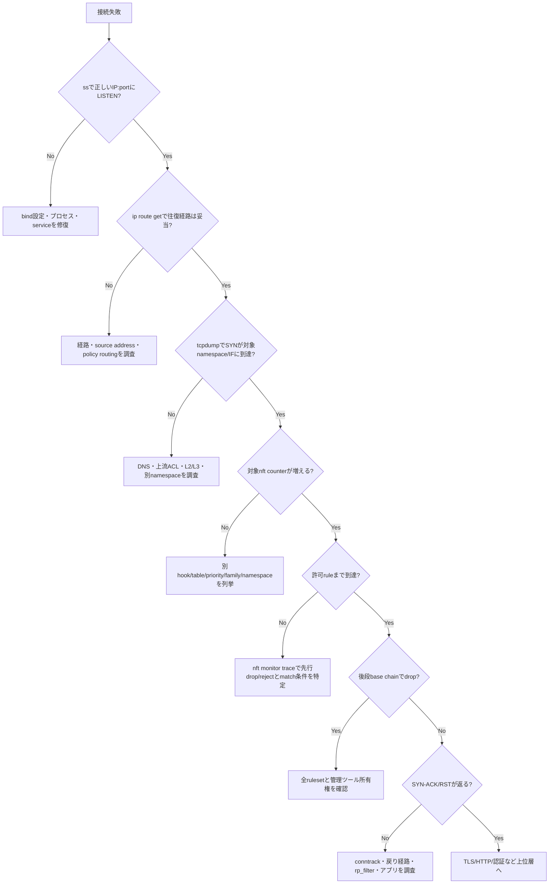

[[Home]]

# Weekly Linux Deep-Dive — `nft`でホストファイアウォールを「見て、壊さず、証明する」

#linux #commands #operations #weekly #deep-dive

## 1. Weekly focus・難易度・前提・測定可能な到達目標

### 今週の焦点

`nftables`を「ポートを開けるコマンド集」ではなく、Linuxカーネルのパケット経路に置かれた**ルール評価器**として扱う。`nft`を中心に、実効ルールセットの観測、カウンターによる仮説検証、原子的な変更、タイムアウト付きロールバックまでを学ぶ。

- **難易度シグナル:** Specialized（受講条件ではなく、ネットワーク経路と状態追跡を同時に扱う目安）
- **所要時間:** 165分（Foundation 30分、実装50分、障害注入55分、検証30分）

### 必要知識・ツール・環境

- 必要知識: IPv4、CIDR、TCP 3-way handshake、UDP、loopback、ポート、終了コード
- 先に知っておく概念: `ip route get`は経路選択、`ss -lntup`はソケット、`tcpdump`はパケット観測を担当し、ファイアウォール判定そのものとは別である
- 必須ツール: `nft`, `ip`, `ss`, `python3`, `curl` または `nc`, `bash`, `timeout`
- 推奨ツール: `tcpdump`, `conntrack`, `systemd-run`
- 環境: root権限とnetwork namespaceを使える**破棄可能なLinux VM**。カーネル4.18以降を推奨
- パッケージ例: Debian/Ubuntuは `sudo apt install nftables iproute2 curl`、RHEL/Fedoraは `sudo dnf install nftables iproute curl`

### 測定可能な到達目標

終了時に以下を実演できれば合格である。

1. family、table、chain、hook、priority、policy、ruleの関係を図示できる。
2. `nft -a list ruleset`から、対象パケットが通るbase chainとルールhandleを特定できる。
3. `counter`と`nft monitor trace`を使い、drop箇所を証拠付きで示せる。
4. `nft -c -f`で検証し、単一トランザクションで安全にルールを適用できる。
5. 管理経路を失わないロールバック手順を先に用意してから変更できる。

## 2. Mental model — パケットはどこで判定されるか

アプリケーションはuserspaceでソケットを開くが、受信・転送・送信の判断はカーネルで行われる。nftablesはNetfilter hookにルールを登録し、パケットが経路を通る途中で評価する。

- **ingress**: NIC直後。通常のIP経路判定より早い（高度な用途）。
- **prerouting**: 到着後、経路判定前。DNATなど。
- **input**: 経路判定の結果がローカルホスト宛て。
- **forward**: ルータとして別インターフェースへ転送。
- **output**: ローカルプロセスが生成したパケット。
- **postrouting**: 出口決定後。SNAT/masqueradeなど。

`table`は名前空間、`chain`はルールの列、`rule`は左から右へ評価する式である。hookを持つ**base chain**だけがパケット経路へ接続される。通常chainは`jump`/`goto`で呼ばれる。base chainの`priority`が小さいほど先に実行される。同じhookに複数table・chainが存在し得るので、table名だけで「これが唯一のファイアウォール」と思わないこと。

`ct state established,related`はconntrackが保持するフロー状態を見る。既存接続を許可し、新規だけを厳しく判定できる。一方、`nft`のルールセットを書き換えても既存conntrackエントリは自動削除されない。`accept`は現在のchainで受理を決めるが、別のより後段のbase chainでdropされる可能性もある。観測はルール表示だけでなく、counter、trace、ソケット、経路を組み合わせる。

## 3. 本番シナリオと調査仮説

### シナリオ

デプロイ後、同一ホストの`curl http://127.0.0.1:8080`は成功するが、監視サーバーからはタイムアウトする。アプリは`0.0.0.0:8080`でLISTENしている。直前に「管理ポート以外を閉じる」変更があった。

### 仮説を観測順に並べる

1. アプリがLISTENしていない、またはloopbackだけでLISTENしている。
2. クライアントが別IP/ポートへ接続している。
3. 経路・ARP/NDP・上流ACLでホストまで届かない。
4. nftablesのinput chainで新規TCP/8080がdropされる。
5. firewalld/ufw/コンテナruntimeが別tableを管理し、後段でdropする。
6. SYNは許可されたが戻り通信、rp_filter、TLS/Application層で失敗する。

`ss` → `ip route get` → `tcpdump` → `nft counter/trace`の順に境界を狭める。最初からルールをflushして「直った」とするのは、原因と安全性を同時に失う。

## 4. 主役`nft`と関連コマンドの深掘り

`nft`はnftablesのuserspace CLIで、Netlinkを介してカーネルへルールセットを送る。`nft -f file`はファイル全体を単一トランザクションとして処理するため、途中まで適用された状態を避けられる。対話的に一行ずつ追加するより、レビュー・再現・ロールバックしやすい。

基本階層:

```text
family (ip/ip6/inet/arp/bridge/netdev)
└── table
    ├── base chain { type filter hook input priority 0; policy drop; }
    │   └── rule ... counter accept
    ├── regular chain
    ├── set / map
    └── objects (counter, limit など)
```

- `inet`: IPv4とIPv6を同じtableで扱う。`ip saddr`と`ip6 saddr`は個別指定可能。
- `ip`/`ip6`: 各プロトコル専用。既存運用との整合が必要な場合に使う。
- `filter`: chain type。filter hook用。
- `policy drop`: どのruleにも最終判定されなかったパケットを破棄する。
- `iifname`/`oifname`: インターフェース名で照合。`iif`はindexなので再生成環境では意味が異なる。
- `meta l4proto tcp`: IPv4/IPv6双方のL4プロトコルを明示する。
- `tcp dport`, `udp dport`: トランスポート層ポート。
- `counter`: パケット数・バイト数を更新する観測点。
- `log`: kernel logへ記録する。rate limitなしの本番投入はログ嵐を起こす。
- `jump`: 呼出元へ戻る。`goto`は戻らず、呼出先終了後にbase chainのpolicyへ進む。

関連コマンドの役割:

- `ss -lntup`: そもそも待受ソケットがあるか。
- `ip addr`, `ip route get`: 宛先IPと戻り経路。
- `tcpdump -ni IFACE tcp port 8080`: SYNが観測点へ到達したか。
- `conntrack -L`: 状態追跡エントリ（通常root、`conntrack-tools`）。
- `journalctl -k`: `log`式のカーネルログ。ただしrate limitや権限制限がある。
- `systemctl status nftables`: 永続化サービス。ディストリビューションによりfirewalld/ufwが所有者の場合がある。

## 5. 重要なフラグ・出力・終了コード・権限・移植性

### 重要フラグ

| 操作 | 意味 |
|---|---|
| `nft list ruleset` | 現在の実効ルールセットを表示 |
| `nft -a list ruleset` | 各ruleのhandleも表示。限定削除に必須 |
| `nft -n ...` | サービス名などへ逆変換せず数値表示 |
| `nft -j ...` | JSON出力。自動処理はテキストparseよりこちらを優先 |
| `nft -s ...` | stateful情報を省いた復元向け表現 |
| `nft -c -f FILE` | 構文・意味をcheckし、変更しない |
| `nft -f FILE` | ファイルを原子的に適用 |
| `nft monitor` | ルール変更イベントを監視 |
| `nft monitor trace` | `nftrace`を有効にしたパケットの評価経路を表示 |

### 読むべき出力フィールド

- `handle N`: ルールの一時的識別子。再ロードで変わり得るため構成管理の永続IDにはしない。
- `packets N bytes M`: そのcounterに到達した量。ゼロは「通信がない」だけでなく、前段で終端・別chain・別namespaceも示唆する。
- `verdict accept/drop/reject`: `drop`は無応答、`reject`はICMPエラーやTCP RSTを返せる。
- traceの`iif`/`oif`, `mark`, `verdict`, `rule`: どのパケットがどのルールでどう判定されたか。

### 終了コード

- `0`: 要求成功。`-c`なら検証成功。
- 非0: 構文エラー、存在しないobject、権限不足、Netlink失敗など。数値の細分類を前提にせず、stderrを保存する。
- パイプでは`set -o pipefail`を使わないと、`nft`失敗を後段の`grep`が隠す場合がある。

### 権限と移植性

ルールの表示・変更には通常rootまたは対象user/network namespace内の`CAP_NET_ADMIN`が必要。コンテナ内rootはホストのルールを見ているとは限らない。nftablesはLinux固有で、BSD/macOSのpf、古いiptablesとは構文が異なる。`iptables-nft`はnftables backendを使う互換層だが、`iptables-legacy`との混在は障害要因になる。確認例:

```bash
iptables --version 2>/dev/null || true
sudo nft list ruleset
sudo systemctl is-active firewalld ufw nftables 2>/dev/null || true
```

本番では**誰がルールセットを所有するか**（nftables.service、firewalld、ufw、NetworkManager、コンテナruntime、構成管理）を先に確定する。

## 6. 165分の再現可能ラボ

> [!danger]
> 実ホストのルールセットは変更しない。以下は専用network namespace内だけで実行する。それでも共有検証機では他利用者との競合を避けること。

### Phase A — 準備（20分）

```bash
command -v nft ip python3 curl
sudo nft --version

sudo ip netns add nft-client
sudo ip netns add nft-server
sudo ip link add veth-c type veth peer name veth-s
sudo ip link set veth-c netns nft-client
sudo ip link set veth-s netns nft-server
sudo ip -n nft-client addr add 192.0.2.10/24 dev veth-c
sudo ip -n nft-server addr add 192.0.2.20/24 dev veth-s
sudo ip -n nft-client link set lo up
sudo ip -n nft-server link set lo up
sudo ip -n nft-client link set veth-c up
sudo ip -n nft-server link set veth-s up
```

サーバーを起動する（端末A）。

```bash
sudo ip netns exec nft-server python3 -m http.server 8080 --bind 0.0.0.0
```

端末B:

```bash
sudo ip netns exec nft-server ss -lntp 'sport = :8080'
sudo ip netns exec nft-client curl --max-time 2 http://192.0.2.20:8080/
```

**期待:** `LISTEN 0 ... 0.0.0.0:8080`が見え、curlはディレクトリ一覧HTMLを返し終了コード0。

**Checkpoint A:** `ip -n nft-client route get 192.0.2.20`が`dev veth-c src 192.0.2.10`を示す。

### Phase B — 最小防御ルールを原子的に投入（30分）

`/tmp/nft-lab.nft`を作る。

```bash
tmp_rules=$(mktemp)
printf '%s\n' \
  'flush ruleset' \
  'table inet labfw {' \
  '  chain input {' \
  '    type filter hook input priority filter; policy drop;' \
  '    iifname "lo" counter accept comment "allow loopback"' \
  '    ct state invalid counter drop comment "drop invalid"' \
  '    ct state established,related counter accept comment "allow return traffic"' \
  '    ip saddr 192.0.2.10 tcp dport 8080 ct state new counter accept comment "allow lab client"' \
  '    meta l4proto icmp counter accept comment "allow IPv4 diagnostics"' \
  '    counter comment "final observation before policy"' \
  '  }' \
  '}' > "$tmp_rules"

sudo ip netns exec nft-server nft -c -f "$tmp_rules"
sudo ip netns exec nft-server nft -f "$tmp_rules"
sudo ip netns exec nft-server nft -a -n list ruleset
```

`mktemp`のパスはhost側だが、network namespaceはmount namespaceを分離しないため参照できる。

**期待:** checkとapplyは無出力・終了コード0。`table inet labfw`、input hook、`policy drop`、各handleが表示される。

```bash
sudo ip netns exec nft-client curl --max-time 2 http://192.0.2.20:8080/ >/dev/null
sudo ip netns exec nft-server nft list chain inet labfw input
```

**Checkpoint B:** 8080許可ruleとestablished ruleのpacket counterが増える。

### Phase C — 失敗を注入して境界を特定（45分）

許可ルールの送信元を意図的に誤る。

```bash
sudo ip netns exec nft-server nft replace rule inet labfw input \
  handle "$(sudo ip netns exec nft-server nft -a list chain inet labfw input | awk '/allow lab client/{for(i=1;i<=NF;i++) if($i=="handle") print $(i+1)}')" \
  ip saddr 192.0.2.99 tcp dport 8080 ct state new counter accept comment 'BROKEN source'
```

新規接続を強制するためcurlを再実行する。

```bash
sudo ip netns exec nft-client curl --no-keepalive --max-time 2 http://192.0.2.20:8080/
echo "curl_rc=$?"
sudo ip netns exec nft-server nft -a list chain inet labfw input
```

**期待:** curlはタイムアウトして通常`28`。最終観測counterが増え、誤った許可ruleは増えない。ここで「パケットはinput chainへ到達したが、source matchに失敗し、policy dropへ落ちた」という仮説を立てる。

traceを有効化する。常時traceは高負荷なので、送信元とportを限定する。

```bash
sudo ip netns exec nft-server nft insert rule inet labfw input \
  ip saddr 192.0.2.10 tcp dport 8080 ct state new \
  meta nftrace set 1 comment 'TEMP trace 8080'
sudo ip netns exec nft-server nft monitor trace
```

別端末で:

```bash
sudo ip netns exec nft-client curl --max-time 2 http://192.0.2.20:8080/ >/dev/null
```

**期待:** traceにinput chain、各rule、最終`policy drop`が現れる。終了後、trace ruleのhandleを確認して削除する。

```bash
sudo ip netns exec nft-server nft -a list chain inet labfw input
# 表示された TEMP trace の N に置換
sudo ip netns exec nft-server nft delete rule inet labfw input handle N
```

**Checkpoint C:** ソケット、経路、到達、ルール不一致をそれぞれ別の証拠で説明できる。

### Phase D — setを使って修復（25分）

ルールを再ロードし、許可送信元をsetで管理する。

```bash
tmp_fixed=$(mktemp)
printf '%s\n' \
  'flush ruleset' \
  'table inet labfw {' \
  '  set monitors { type ipv4_addr; flags interval; elements = { 192.0.2.10 } }' \
  '  chain input {' \
  '    type filter hook input priority filter; policy drop;' \
  '    iifname "lo" accept' \
  '    ct state invalid drop' \
  '    ct state established,related accept' \
  '    ip saddr @monitors tcp dport 8080 ct state new counter accept' \
  '    meta l4proto icmp accept' \
  '    counter' \
  '  }' \
  '}' > "$tmp_fixed"
sudo ip netns exec nft-server nft -c -f "$tmp_fixed" && \
sudo ip netns exec nft-server nft -f "$tmp_fixed"
sudo ip netns exec nft-client curl --max-time 2 http://192.0.2.20:8080/ >/dev/null
echo "curl_rc=$?"
```

**期待:** `curl_rc=0`。setならruleを作り直さずメンバーを変更できる。

```bash
sudo ip netns exec nft-server nft add element inet labfw monitors '{ 192.0.2.11 }'
sudo ip netns exec nft-server nft delete element inet labfw monitors '{ 192.0.2.11 }'
sudo ip netns exec nft-server nft list set inet labfw monitors
```

**Checkpoint D:** `elements = { 192.0.2.10 }`だけが残る。

### Phase E — 検証と片付け（45分）

```bash
sudo ip netns exec nft-server nft -j list ruleset > /tmp/nft-lab-evidence.json
sudo ip netns exec nft-client ping -c 1 -W 1 192.0.2.20
sudo ip netns exec nft-client curl --max-time 2 http://192.0.2.20:8080/ >/dev/null
sudo ip netns exec nft-client bash -c 'exec 3<>/dev/tcp/192.0.2.20/9090' || echo '9090 blocked/closed as expected'
sudo ip netns exec nft-server nft list chain inet labfw input
```

片付け:

```bash
# 端末Aのhttp.serverをCtrl-Cで停止後に実行
sudo ip netns del nft-client
sudo ip netns del nft-server
rm -f "$tmp_rules" "$tmp_fixed"
```

**Checkpoint E:** `ip netns list`に`nft-client`/`nft-server`がなく、hostの`sudo nft list ruleset`がラボ前後で変わっていない。

## 7. トラブルシューティング決定木



## 8. コピーして使える実例（説明付き）

### 例1: 全ルールとhandleを数値で取得

```bash
sudo nft -a -n list ruleset
```

サービス名変換を避け、正確なportと削除用handleを見る。障害対応の最初に時刻とともに保存する。

### 例2: 自動処理向けJSON証跡

```bash
sudo nft -j list ruleset > "nft-ruleset-$(date +%Y%m%dT%H%M%S).json"
```

構造化出力なので、テキスト表現の差に強い。ファイルには内部IP等が含まれ得るためアクセス権を管理する。

### 例3: 変更せず構成ファイルを検証

```bash
sudo nft -c -f /etc/nftables.conf
```

終了コード0を確認してからreloadする。論理的なロックアウトまでは検出できない。

### 例4: 原子的に適用

```bash
sudo nft -f /etc/nftables.conf
```

ファイル全体をトランザクションとして送る。`flush ruleset`を含む構成は、他ツール管理のtableまで消すため特に注意。

### 例5: 特定chainのcounterを観測

```bash
sudo nft list chain inet filter input
```

接続試行の前後でpackets/bytesを比較し、どのルールへ到達したかを確認する。

### 例6: 安全な一時ログ

```bash
sudo nft insert rule inet filter input tcp dport 8443 \
  limit rate 5/second burst 10 packets \
  log prefix 'nft-8443 ' flags all counter
```

rate limit付きでログ嵐を抑える。検証後はhandle指定で必ず削除する。

### 例7: handleで1ルールだけ削除

```bash
sudo nft -a list chain inet filter input
sudo nft delete rule inet filter input handle 42
```

全chainをflushせず対象だけ戻す。`42`は直前の表示から取得し、古い記録を流用しない。

### 例8: 送信元setへ要素を追加

```bash
sudo nft add element inet filter admin4 '{ 198.51.100.24 }'
```

rule本体を再作成せず許可元を更新できる。setのtypeとfamilyが一致することを確認する。

### 例9: 既存接続と新規接続を区別

```bash
sudo nft add rule inet filter input ct state established,related counter accept
sudo nft add rule inet filter input tcp dport 443 ct state new counter accept
```

戻り通信を先に許可し、新規443だけを明示する。順序が重要で、無条件dropより前に置く。

### 例10: 限定traceを有効化

```bash
sudo nft insert rule inet filter input ip saddr 198.51.100.24 tcp dport 443 \
  ct state new meta nftrace set 1 comment 'TEMP trace incident-123'
sudo nft monitor trace
```

対象を狭くして評価経路を見る。trace ruleは常設しない。

### 例11: ローカル待受とファイアウォールを混同しない

```bash
sudo ss -lntp 'sport = :443'
sudo nft list ruleset
```

LISTENがなければ許可ruleを足してもサービスは提供されない。まずsocket、次にpacket policyを見る。

### 例12: パケット到達とcounterを同時観測

```bash
sudo tcpdump -ni any 'tcp port 443 and (tcp[tcpflags] & tcp-syn != 0)'
sudo watch -n 1 'nft list chain inet filter input'
```

別端末で実行する。tcpdumpにSYNがありcounterが増えなければ、namespace、hook、family、filter条件を疑う。

### 例13: タイムアウト付きロールバックを予約

```bash
sudo systemd-run --unit=nft-rollback --on-active=3m \
  /usr/sbin/nft -f /root/nftables.before.conf
```

リモート変更前に旧構成を戻す一時unitを予約する。検証成功後に`sudo systemctl cancel nft-rollback.timer`し、unit名とパスは環境に合わせる。`at`やコンソールアクセスでもよい。

## 9. Failure injection / 診断チャレンジ

Phase Dの正常構成を使い、次のいずれかを注入する。

1. 8080許可ruleを`tcp dport 8081`へ変える。
2. 許可送信元を`192.0.2.0/28`に変える（`.10`は含む）後、`192.0.2.16/28`に変える（`.10`は含まない）。
3. 許可ruleより前に`tcp flags syn tcp dport 8080 counter drop`を挿入する。

提出する診断文は次の形式にする。

> `192.0.2.10 → 192.0.2.20:8080`のSYNは`veth-s`へ到達し、`inet labfw input`のhandle XでcounterがN増加してdropされた。LISTENと経路は正常であり、原因は先行ruleの条件Yである。修復はZ、検証はcurl終了コード0とcounter増加で行った。

追加課題: `drop`を`reject with tcp reset`へ変え、curlの失敗時間とtcpdump出力がどう変わるか比較する。dropは情報を与えにくいが障害診断を遅くし、rejectは即時失敗させるという運用上の差を説明する。

## 10. 安全・ロールバック・破壊的操作への警告

> [!danger]
> SSH越しに`policy drop`、`flush ruleset`、管理元set変更を行うと即座にロックアウトし得る。帯域外コンソール、既知の旧構成、タイムアウト付き自動復元の3点がない本番変更は避ける。

- 変更前に`sudo nft -a -n list ruleset`と`sudo nft -j list ruleset`を保存する。
- 復元可能な形式は環境で実際に`nft -c -f`検証する。単なる画面コピーをバックアップと呼ばない。
- `flush ruleset`は全tableを消す。Docker/Kubernetes/firewalldなど他所有者のルールも対象になり得る。
- SSH許可は「現在の接続が生きる」だけでなく、別セッションの**新規接続**で試す。
- `ct state established`により既存SSHが残っても、新規SSHが拒否される設定ミスを隠す場合がある。
- `log`と`nftrace`は対象を限定し、検証後に削除する。機密性のあるアドレスや通信メタデータがログへ残る。
- 構成管理下では直接修正せず、所有ツール側の定義を直す。手修正は次回reconcileで消える。
- IPv4だけ許可してIPv6を放置、または逆にIPv6だけ閉じる失敗を避ける。`inet` familyでもmatch式を確認する。

推奨ロールバック手順:

1. 変更前の実効構成と管理元ファイルを保存。
2. `nft -c -f OLD`で旧構成が読み込めることを確認。
3. 3〜5分後に旧構成を戻すtimerを予約。
4. 新構成を`-c`後、単一トランザクションで適用。
5. 既存セッションと別の新規セッション、監視、必要portを検証。
6. 成功時だけrollback timerを取消。失敗時は待つかコンソールから即時復元。

## 11. Verification checklist と具体的deliverables

### チェックリスト

- [ ] 対象network namespaceとfamilyを明記した
- [ ] 正しいIP:portでLISTENしていることを確認した
- [ ] 往路と戻り経路を確認した
- [ ] 全table/base chain/hook/priority/policyを列挙した
- [ ] 変更前のrulesetをJSONと復元可能形式で保存した
- [ ] 新構成を`nft -c -f`で検証した
- [ ] counterまたはtraceで対象ruleへの到達を証明した
- [ ] 許可・拒否の両方を新規接続で試した
- [ ] IPv4/IPv6の意図を確認した
- [ ] 一時log/trace ruleを削除した
- [ ] rollback timerを成功確認後に取消した
- [ ] 管理ツールの永続設定へ反映した

### 成果物

1. `before`/`after`のJSON ruleset。
2. 構文検証済みの構成ファイル。
3. 接続元・宛先・port・時刻を含む検証ログ。
4. 該当counterの前後差、または限定trace抜粋。
5. 「どのhookのどのruleが、なぜ判定したか」を一文で示す障害報告。
6. 実行確認済みのロールバック手順。

## 12. 5問アセスメント

<details>
<summary>問題と解答を表示</summary>

### Q1
`ss`で8080のLISTENが見えるのにリモートから接続できない。`ss`が証明する範囲は何か。

**答え:** カーネルに対象ソケットが存在し、指定アドレス・portで待ち受けていること。パケット到達、経路、nftables許可、戻り通信、アプリ応答までは証明しない。

### Q2
input chainの許可ruleのcounterが0のままである。直ちに「通信が来ていない」と断定できない理由を2つ挙げよ。

**答え:** 前段ruleでaccept/dropされている、別のbase chain/table/priorityで終端されている、別namespace/インターフェースを見ている、match条件が誤っている、など。

### Q3
なぜ`nft -c -f`だけではSSHロックアウトを防げないか。

**答え:** 構文とカーネルが受理できる意味構造は検査するが、管理元IPやSSH portを許可するという運用意図までは検証しないため。

### Q4
`ct state established,related accept`後にSSH許可ruleを削除した。現在のSSHが継続する理由と、必要な検証は何か。

**答え:** 現接続はconntrack上でestablishedなので許可され得る。別端末・別TCP接続で新規SSHを試し、new状態の許可を検証する必要がある。

### Q5
`accept`に到達したのに最終的にdropされることがあるのはなぜか。

**答え:** 同じhookにpriorityの異なる複数base chainがあり、後段chainでdropされる場合があるため。全rulesetを列挙しtraceで経路を確認する。

</details>

## 13. Follow-up challenge と公式リファレンス

### Follow-up challenge

ラボを次の構成へ拡張する。

1. `servers` setと`allowed_tcp_ports` setを作り、IPとportをruleから分離する。
2. `limit rate`付きlog chainを作り、drop理由をprefix別に記録する。
3. IPv6用vethアドレスを追加し、`inet` tableでIPv4/IPv6両方を意図どおり扱う。
4. ルール更新中に毎秒curlを実行し、原子的reloadで中間状態が観測されないことを確認する。
5. `nft -j`出力から「policy dropなのにloopback許可がないchain」を検出する小さな監査スクリプトを書く。

### 公式リファレンス

- `man 8 nft` — CLI、list/add/delete/replace/monitor
- `man 5 nftables` — 構成ファイル言語
- `man 8 ip-netns` — network namespace操作
- Netfilter公式 nftables wiki: <https://wiki.nftables.org/wiki-nftables/index.php/Main_Page>
- nftables project documentation: <https://netfilter.org/projects/nftables/index.html>
- Debian Handbook, Firewall or Packet Filtering: <https://www.debian.org/doc/manuals/debian-handbook/sect.firewall-packet-filtering.en.html>
- Red Hat Enterprise Linux documentation, Getting started with nftables: <https://docs.redhat.com/en/documentation/red_hat_enterprise_linux/9/html/configuring_firewalls_and_packet_filters/getting-started-with-nftables_firewall-packet-filters>
- kernel Netfilter documentation: <https://docs.kernel.org/networking/netfilter-sysctl.html>

---

**今週の要点:** nftables障害対応の核心は、ルールを眺めることではなく、対象パケットのnamespace・hook・priority・stateを定め、counter/traceで評価経路を証明してから、検証済みトランザクションと自動ロールバックで変更することである。
