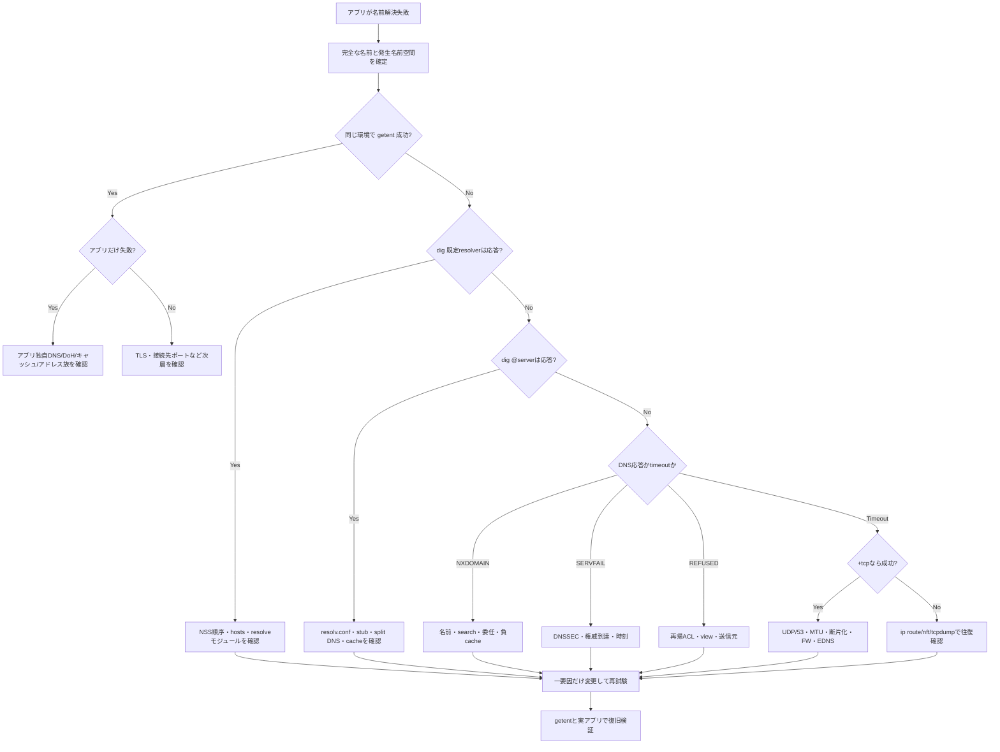

# Weekly Linux Deep-Dive — `getent`・`resolvectl`・`dig` でDNS障害を層別する

#linux #commands #operations #weekly #deep-dive

[[Home]]

## 1. Weekly focus・難易度・前提・測定可能な到達目標

### Weekly focus

「名前が引けない」を一括りにせず、次の層へ分解する。

1. アプリケーション入力と検索ドメイン
2. glibc/NSS（`/etc/nsswitch.conf`、`/etc/hosts`、DNS以外の情報源）
3. ローカルのスタブリゾルバ／キャッシュ（systemd-resolvedなど）
4. 上流DNSサーバーへの到達性
5. DNSプロトコル上の応答（NOERROR、NXDOMAIN、SERVFAIL、REFUSED、タイムアウト）
6. 権威DNS、委任、レコード、DNSSEC、キャッシュの問題

主役は、**アプリに近い答えを見る `getent`**、**systemd-resolvedの実効状態を見る `resolvectl`**、**DNSプロトコルを直接検査する `dig`** である。`ping` の成否だけでDNSを判断しない。

**難易度シグナル: Intermediate** — 参加資格ではなく目安。DNSの基礎が曖昧でも、ラボを順に実行すれば追える。

### 必要知識・ツール・環境

- 必要知識: IPv4/IPv6、UDP/TCP、53番ポート、FQDN、プロセスと設定ファイルの基本
- ツール: `getent`、`dig`（通常 `dnsutils` または `bind-utils`）、`resolvectl`（systemd-resolved環境）、`ss`、`ip`、`grep`、`timeout`
- 推奨環境: インターネット接続可能な検証用Linux VM。Ubuntu/DebianまたはFedora/RHEL系
- 権限: 観測の大半は一般ユーザーで可能。`resolvectl` の一部操作、パケット採取、設定変更にはrootが必要
- 既習概念: `/etc/hosts`、`/etc/resolv.conf`、ルーティング、ファイアウォール、終了コード
- 以前の概念との接続: 経路は `ip route`、待受は `ss`、パケットは `tcpdump`、フィルタは `nft` で確認する。本号はそれらをDNSに結び付ける。

### 測定可能な到達目標

- 同じ名前に対する `getent ahosts` と `dig` の差を説明できる
- 実際に参照されるDNSサーバーと検索ドメインを特定できる
- NXDOMAIN、SERVFAIL、REFUSED、タイムアウトを区別できる
- `dig` の header、flags、QUESTION、ANSWER、AUTHORITY、OPT、Query time、SERVER を読める
- UDP失敗、TCPフォールバック、IPv4/IPv6、検索ドメインを切り分けられる
- 設定を変更せずに証拠を集め、変更後に同じ観測で検証できる

---

## 2. Foundation — Linuxの名前解決メンタルモデル

### 2.1 アプリは必ずしもDNSへ直接問い合わせない

多くのLinuxアプリはglibcの `getaddrinfo(3)` を呼ぶ。glibcは `/etc/nsswitch.conf` の `hosts:` 行に従い、`files`、`dns`、`resolve`、`myhostname`、mDNSなどを順に参照する。

```text
application
  └─ getaddrinfo()
      └─ NSS: hosts: files resolve [!UNAVAIL=return] dns
          ├─ /etc/hosts
          ├─ systemd-resolved / nscd / SSSD
          └─ DNS resolver from resolv.conf
```

したがって、`dig` が成功してもアプリが失敗することがある。`dig` は通常NSSや `/etc/hosts` を通らず、DNSプロトコルを直接試すからだ。逆に `/etc/hosts` だけにある名前は `getent` では引けても `dig` では引けない。

### 2.2 `/etc/resolv.conf` は「実体」とは限らない

`/etc/resolv.conf` は通常、`nameserver`、`search`、`options ndots:n`、`timeout`、`attempts` を含む。ただしsystemd-resolved環境では `127.0.0.53` のスタブへ向くシンボリックリンクであることが多い。真の上流DNSは `resolvectl status` に出る。NetworkManager、DHCP、VPN、コンテナがリンクごとにDNSと検索ドメインを注入する場合もある。

### 2.3 カーネルとユーザー空間の境界

- glibc/NSS、systemd-resolved、DNSキャッシュはユーザー空間
- UDP/TCPソケット、経路選択、netfilter、NIC送受信はカーネル
- `/etc/hosts`、`nsswitch.conf`、`resolv.conf` はファイル
- DNS問い合わせは多くの場合UDP/53。切り詰め（TC=1）、大きな応答などではTCP/53も使う
- DoT/DoHを使うブラウザやエージェントはOSの通常経路を迂回し得る

切り分けは「アプリ → NSS → ローカルリゾルバ → ソケット/経路/フィルタ → 上流DNS → 権威DNS」の順に、観測点を一段ずつ移す。

### 2.4 DNS応答コードは原因ではなく分類ラベル

- `NOERROR`: DNS処理は成功。ANSWERが空ならNODATA（名前は存在するが、その型がない）かもしれない
- `NXDOMAIN`: 問い合わせ名そのものが存在しない
- `SERVFAIL`: サーバーが完了できない。DNSSEC検証、権威到達、内部障害など
- `REFUSED`: ポリシー上、問い合わせを拒否
- タイムアウト: DNS応答を受信できない。経路、FW、サーバー停止、誤った宛先など

`connection refused` は輸送層の結果であり、DNSの `REFUSED` とは別物である。

---

## 3. Production scenario — 本番シナリオと調査仮説

### シナリオ

デプロイ直後、APIサーバーから `db.prod.internal` への接続だけが断続的に失敗する。IP直指定なら接続できる。ホスト上の `dig` は成功することがあるが、コンテナ内アプリは `Temporary failure in name resolution` を返す。VPN接続中だけ再現率が高い。

### 調査仮説

| 優先 | 仮説 | 最短の観測 |
|---:|---|---|
| 1 | アプリと手動テストが異なる名前・名前解決経路を使う | ログの完全な名前、`getent ahosts`、コンテナ内で再現 |
| 2 | split DNSの検索ドメイン／リンク選択が誤っている | `resolvectl status`、`resolvectl query` |
| 3 | `/etc/resolv.conf` が古い、壊れたリンク、誤ったnameserver | `readlink -f`、`cat`、名前空間内から確認 |
| 4 | UDP/53だけ失敗し、TCP/53は通る | `dig` と `dig +tcp` の比較 |
| 5 | 上流の一台だけ不調 | `dig @server1` と `@server2` を個別比較 |
| 6 | NXDOMAIN/失敗がキャッシュされている | TTL、`resolvectl statistics`、安全なキャッシュフラッシュ後の再試験 |
| 7 | DNSSEC検証失敗 | `dig +dnssec`、ADフラグ、検証ログ、時刻 |
| 8 | コンテナ独自のDNSプロキシ／名前空間が原因 | コンテナ内の `resolv.conf`、宛先、経路、パケット |

原則は **アプリに最も近い観測から開始** し、成功する境界と失敗する境界の間を狭めること。最初から公開DNSへ切り替えると、split DNSを壊し、症状を隠す可能性がある。

---

## 4. Primary tools と関連コマンドの深掘り

### 4.1 `getent`: アプリに近いNSS経路を再現する

```bash
getent ahosts example.com
getent hosts example.com
```

`getent` はNSSデータベースを照会する。`ahosts` は `getaddrinfo()` ベースでIPv4/IPv6とソケット種別を示すため、一般的なアプリの挙動に近い。`hosts` は表示やアドレス選択が実装・設定に依存する。

- `getent` 成功、`dig` 失敗: `/etc/hosts`、mDNS、SSSDなどDNS以外を疑う
- `dig` 成功、`getent` 失敗: NSS順序、systemd-resolved、NSSモジュール、アドレス族、キャッシュを疑う
- 両方失敗: 設定、到達性、上流、権威を下層へ追う

### 4.2 `resolvectl`: systemd-resolvedの実効状態を見る

```bash
resolvectl status
resolvectl query example.com
resolvectl statistics
```

`status` はGlobalとリンク別のDNS Servers、Current DNS Server、DNS Domain、DefaultRoute、プロトコル設定を表示する。`~corp.example` のような `~` 付きドメインはroute-only domainで、そのサフィックスの問い合わせを特定リンクへ送る。これはVPNのsplit DNSで重要である。

### 4.3 `dig`: DNSプロトコルを制御して観測する

```bash
dig @1.1.1.1 example.com A +noall +answer +comments
```

読む順序:

1. `status`: NOERROR/NXDOMAIN/SERVFAIL/REFUSED
2. `flags`: `qr` 応答、`rd` 再帰要求、`ra` 再帰可、`aa` 権威応答、`ad` 検証済み、`tc` 切り詰め
3. `QUESTION SECTION`: 実際に問い合わせた名前・クラス・型
4. `ANSWER SECTION`: 名前、TTL、class、type、値
5. `AUTHORITY SECTION`: 委任先や否定応答のSOA
6. `OPT PSEUDOSECTION`: EDNS、UDPサイズ、DO bit
7. `Query time`: サーバー応答時間。アプリ全体の名前解決時間とは限らない
8. `SERVER`: 実際の問い合わせ先IPとポート

### 4.4 関連コマンド

- `grep '^hosts:' /etc/nsswitch.conf`: NSSの参照順
- `readlink -f /etc/resolv.conf`: 管理主体と実体の推測
- `ss -lunp '( sport = :53 )'`: ローカルDNS待受
- `ip route get <DNS-IP>`: 上流DNSへの出口と送信元
- `timeout 5 getent ahosts name`: ハング上限を設ける
- `journalctl -u systemd-resolved`: resolvedのログ
- `tcpdump -ni any port 53`: パケットの有無と応答コードを確認

---

## 5. Flags・出力・終了コード・権限・移植性

| `dig`フラグ | 意味 | 診断上の用途 |
|---|---|---|
| `@server` | 問い合わせ先を固定 | 複数上流を個別比較 |
| `A` / `AAAA` / `MX` / `TXT` / `SOA` | 型を明示 | NODATAとNXDOMAINを区別 |
| `+short` | 値中心の短い表示 | status・serverが消えるため単独診断には不十分 |
| `+noall +answer +comments` | headerと回答を絞る | 状態を残した簡潔な証拠 |
| `+trace` | rootから反復問い合わせ | 委任を追う。split DNSには不向き |
| `+tcp` | TCP/53を強制 | UDP固有障害と比較 |
| `+dnssec` | DO bitを付ける | DNSSEC材料を要求。これだけでローカル検証はしない |
| `+norecurse` | RD=0 | 権威性、キャッシュ有無を観測 |
| `+time=2 +tries=1` | 待ち時間と試行を制限 | 障害時に素早く個別比較 |
| `-4` / `-6` | 通信族を固定 | IPv4/IPv6経路差を切り分け |
| `-p 1053` | 非標準ポート | ローカル検証DNS向け |

### 終了コード

- `getent`: 0は取得成功。2はキーが見つからない。3は列挙非対応など。実装差は `man getent` で確認
- `dig`: 0はDNS交換を完了したことを示し得る。**NXDOMAINでも0になり得る**ため、statusを見る
- `resolvectl query`: 成功なら0、失敗時は非0が基本。状態文字列も保存する
- `timeout`: 124は時間切れ、125–127はラッパー自身や起動失敗

```bash
out=$(dig +noall +comments does-not-exist.invalid A 2>&1); rc=$?
printf 'rc=%s\n%s\n' "$rc" "$out"
```

### 権限と移植性

- 通常の問い合わせは一般ユーザーでよい。`ss -p`、packet capture、設定変更はrootが必要な場合がある
- Debian/Ubuntuの `dig` は通常 `dnsutils`、Fedora/RHELは `bind-utils`、Alpineは `bind-tools`
- musl libcのresolver挙動はglibcと同一ではない
- systemd-resolved不使用環境では `resolvectl` を飛ばし、NetworkManagerなら `nmcli dev show` を使う
- コンテナの `/etc/resolv.conf` はホストと異なる。必ず問題が起きる名前空間内で確認する
- DNS名自体が機密情報になり得るため、パケットや証拠の共有範囲を限定する

---

## 6. Guided lab（150分）

> [!warning] 検証VMで実施する。既存のresolver設定は変更しない。公開DNSへの直接問い合わせが禁止なら、許可された社内DNSへ読み替える。

### Phase 0 — 準備（15分）

```bash
command -v getent dig resolvectl ss ip timeout
uname -a
cat /etc/os-release
```

```bash
# Debian/Ubuntu
sudo apt-get update && sudo apt-get install dnsutils
# Fedora/RHEL
sudo dnf install bind-utils
```

**Checkpoint 0:** `getent` と `dig` が実行できる。`resolvectl` がなければ該当項目をスキップ。

### Phase 1 — 設定経路を地図化（20分）

```bash
grep -E '^[[:space:]]*hosts:' /etc/nsswitch.conf
ls -l /etc/resolv.conf
readlink -f /etc/resolv.conf
sed -n '1,120p' /etc/resolv.conf
```

```bash
resolvectl status
resolvectl statistics
ss -lunp '( sport = :53 )'
```

**期待:** `hosts:` に `files` と `dns` または `resolve` がある。resolved利用時は `127.0.0.53:53` の待受が見えることがある。

**Checkpoint 1:** 「設定上の宛先」「ローカルスタブ」「真の上流DNS」を別々に記録。

### Phase 2 — NSSと直接DNSの差（25分）

```bash
getent ahosts localhost
dig localhost A +noall +answer +comments
getent ahosts example.com
dig example.com A +noall +answer +comments
getent ahosts example.com.
```

`localhost` は通常 `/etc/hosts` で成功するが、`dig` は上流DNSへ直接問い合わせる。末尾のドットはrootまで含む絶対名で、検索ドメインを避ける。

**Checkpoint 2:** 結果差の理由を1段落で説明。

### Phase 3 — 応答コードとNODATA（30分）

```bash
dig example.com A +noall +answer +comments
dig does-not-exist.invalid A +noall +authority +comments
dig example.com TYPE65280 +noall +answer +authority +comments
dig example.com AAAA +stats
dig example.com SOA +noall +answer +comments
```

**期待:** `.invalid` はNXDOMAIN。存在する名前への未知型はNOERRORかつANSWER 0（NODATA）になり得る。

**Checkpoint 3:** `status`、`flags`、`ANSWER`、`SERVER`、`Query time` を表へ転記。

### Phase 4 — 上流・UDP/TCP・通信族（25分）

```bash
dig @1.1.1.1 example.com A +time=2 +tries=1 +stats
dig @8.8.8.8 example.com A +time=2 +tries=1 +stats
dig @1.1.1.1 example.com A +tcp +time=2 +tries=1 +stats
ip route get 1.1.1.1
dig -4 @1.1.1.1 example.com A +time=2 +tries=1
dig -6 @2606:4700:4700::1111 example.com AAAA +time=2 +tries=1
```

**Checkpoint 4:** 既定/明示上流 × UDP/TCP × IPv4/IPv6 の成功・失敗マトリクスを作る。

### Phase 5 — resolvedとキャッシュ（20分）

```bash
resolvectl query example.com
resolvectl statistics
resolvectl query example.com
resolvectl domain
resolvectl dns
resolvectl default-route
```

検証VMでだけキャッシュをフラッシュする。

```bash
sudo resolvectl flush-caches
resolvectl statistics
```

**Checkpoint 5:** リンク別DNSとdomain routingを記録し、短い名前がどのリンクへ行くか仮説を書く。

### Phase 6 — 証拠パック（15分）

```bash
mkdir -p "$PWD/dns-evidence"
date -Is > "$PWD/dns-evidence/time.txt"
getent ahosts example.com > "$PWD/dns-evidence/getent.txt" 2>&1
dig example.com A +stats > "$PWD/dns-evidence/dig.txt" 2>&1
ip route get 1.1.1.1 > "$PWD/dns-evidence/route.txt" 2>&1
cp --dereference /etc/resolv.conf "$PWD/dns-evidence/resolv.conf.snapshot"
resolvectl status > "$PWD/dns-evidence/resolvectl-status.txt" 2>&1
```

**Checkpoint 6:** 時刻、名前、NSS結果、DNS結果、問い合わせ先、経路が揃う。共有前に内部情報をレビュー。

---

## 7. Troubleshooting decision tree



---

## 8. Copy-ready examples（説明付き）

### 1 — アプリに近い解決
```bash
getent ahosts api.example.com
```
NSS全体を通す。必ずアプリと同じ名前空間で実行する。

### 2 — ハングを5秒で打ち切る
```bash
timeout 5s getent ahosts api.example.com; printf 'exit=%s\n' "$?"
```
124はtimeoutによる打ち切りで、NXDOMAINとは異なる。

### 3 — NSS順序
```bash
grep -E '^[[:space:]]*hosts:' /etc/nsswitch.conf
```
ソース順と `[NOTFOUND=return]` などの停止条件を読む。

### 4 — resolver実体
```bash
ls -l /etc/resolv.conf && readlink -f /etc/resolv.conf && sed -n '1,80p' /etc/resolv.conf
```
管理主体、リンク先、nameserver/search/optionsを観測する。編集はしない。

### 5 — 状態を残す簡潔照会
```bash
dig example.com A +noall +answer +comments
```
`+short` と違いstatusとflagsを残す。

### 6 — 上流を固定
```bash
dig @192.0.2.53 service.corp.example A +time=2 +tries=1 +stats
```
上流を個別比較する。文書用IPを実際の許可済みDNSへ置換する。

### 7 — UDP/TCP比較
```bash
dig @1.1.1.1 example.com A +time=2 +tries=1
dig @1.1.1.1 example.com A +tcp +time=2 +tries=1
```
TCPだけ成功ならUDPフィルタ、断片化、EDNS、NATを疑う。

### 8 — NXDOMAIN再現
```bash
dig does-not-exist.invalid A +noall +authority +comments
```
予約TLD `.invalid` を使い、安全に否定応答を観測する。

### 9 — 検索ドメイン
```bash
dig web +search +showsearch +noall +answer +comments
```
`search` と `ndots` により試された名前を観測する。

### 10 — split DNS
```bash
resolvectl status; resolvectl query api.corp.example
```
VPNリンクのroute-only domainと上流を照合する。

### 11 — DNS宛経路
```bash
ip route get 1.1.1.1
```
出口、gateway、送信元IPが期待するVPN/物理リンクか確認する。

### 12 — 53番待受
```bash
sudo ss -lunp '( sport = :53 )'; sudo ss -ltnp '( sport = :53 )'
```
UDP/TCP双方のローカルスタブとプロセスを確認する。

### 13 — 委任追跡
```bash
dig +trace www.example.com
```
rootから権威まで追う。内部名や外向き53番制限下では不向き。

### 14 — DNSSEC材料
```bash
dig example.com A +dnssec +noall +answer +authority +additional +comments
```
DO bitを付ける。`ad` は問い合わせ先が検証済みと示すもので、手元での暗号検証ではない。

### 15 — 断続性
```bash
for i in 1 2 3 4 5; do dig example.com A +tries=1 +time=2 +stats | grep -E 'status:|Query time:|SERVER:'; done
```
単発成功に頼らず、serverと遅延の揺れを見る。キャッシュとTTLも考慮する。

---

## 9. Failure injection / diagnostic challenge

### 安全なタイムアウト注入

```bash
time dig @192.0.2.1 example.com A +time=1 +tries=1
printf 'dig_exit=%s\n' "$?"
```

文書用ネットワークへ問い合わせる。約1秒で到達不能になるのが典型だが、経路が即時エラーを返せば短い。

課題:

1. DNS headerのREFUSEDか、DNS応答なしのtimeoutか
2. `ip route get 192.0.2.1` はどの出口か
3. `+tcp` で症状は変わるか
4. `timeout` の124と `dig` の終了コードは何が違うか

### NXDOMAIN対NODATA

```bash
dig does-not-exist.invalid A +noall +answer +authority +comments
dig example.com TYPE65280 +noall +answer +authority +comments
```

status、ANSWER数、AUTHORITY内SOAを比較する。「回答なし」だけでは名前不存在とは限らない。

### Optional advanced challenge

使い捨てコンテナ、network namespace、またはVMでDNS宛先を意図的に誤設定する。ホスト設定は変更しない。

- 隔離環境とホストの `resolv.conf` 差分を保存
- `getent`、`dig`、`ip route get` の失敗境界を特定
- 正常化後に同じコマンドで復旧を証明
- 可能なら `tcpdump -ni any port 53` で「問い合わせのみ／応答あり」を区別

---

## 10. Safety・rollback・破壊的操作の警告

> [!danger] 本番の `/etc/resolv.conf` を直接上書きしない。systemd-resolved、NetworkManager、DHCP、VPN、cloud-initが管理している場合、変更は失われるか全ホストの名前解決を止める。

- `echo nameserver ... > /etc/resolv.conf` は診断手段にしない
- パブリックDNSへの切替は内部名を漏えいさせ、split DNSを壊し得る
- `resolvectl flush-caches` は共有ホスト全体へ影響する。時刻と理由を記録
- firewall変更前にUDP/TCP、方向、送信元、宛先を証拠で限定する
- `dig +trace` は複数の外部DNSへ直接通信する。ポリシーを確認
- DNSログやpcapには内部名が含まれる。保存・共有を限定

Rollback原則: 管理主体と現状を保存 → 一つだけ変更 → `getent` と実アプリで検証 → 失敗なら同じ管理主体の操作で元へ戻す → 差分、時刻、TTL、キャッシュ操作を記録する。

---

## 11. Verification checklist と concrete deliverables

- [ ] 完全な名前、型、名前空間、発生時刻を記録した
- [ ] NSS順序と `/etc/resolv.conf` の実体を確認した
- [ ] `getent ahosts` と `dig` の両方を実行した
- [ ] status、flags、ANSWER、SERVER、Query timeを記録した
- [ ] 上流を個別比較した
- [ ] UDP/TCP、必要ならIPv4/IPv6を比較した
- [ ] リンク別DNSとdomain routingを確認した
- [ ] DNS応答コードを分類してから経路/FW調査へ進んだ
- [ ] 変更は一要因ずつでrollbackを用意した
- [ ] 復旧を `dig`、`getent`、実アプリで証明した

**成果物:**

1. Resolver map: アプリ → NSS → stub/cache → 上流 → 権威
2. Evidence table: 時刻、場所、コマンド、status、server、latency、exit code
3. Failure matrix: 既定/上流別 × UDP/TCP × IPv4/IPv6
4. Root-cause statement: 成功境界と次の失敗を2文で記述
5. Change/rollback record: 変更前、変更、検証、復旧方法

---

## 12. Five-question assessment

1. `dig` 成功、`getent` 失敗なら最初に疑う境界を3つ挙げよ。
2. `dig` の終了コード0は対象名の存在証明になるか。
3. NXDOMAINとNOERROR/ANSWER 0の違いは何か。
4. 通常の `dig` は失敗し `dig +tcp` は成功する。何を調べるか。
5. `/etc/resolv.conf` に `127.0.0.53` しかない。真の上流とsplit DNSをどう確認するか。

<details>
<summary>解答を見る</summary>

1. NSS順序、NSSモジュール/systemd-resolved、アドレス族・名前空間・キャッシュを疑う。`/etc/hosts` と短縮名も確認。
2. ならない。NXDOMAINでもDNS交換が完了すれば0になり得る。headerのstatusとANSWERを見る。
3. NXDOMAINは名前不存在。NOERROR/ANSWER 0は名前は存在するが要求型がないNODATAなどを意味し得る。
4. UDP/53のフィルタ、EDNSサイズ、断片化、MTU、NAT。TC flagやpacket往復も見る。
5. `resolvectl status`、`dns`、`domain`、`default-route` でGlobal/リンク別の上流とroute-only domainを確認。

</details>

---

## 13. Follow-up challenge と公式リファレンス

### Follow-up challenge

検証用サービスで1分ごとに `getent ahosts` を5秒上限で実行し、成功率、時間、アドレス集合を記録する。同時に `dig` でstatusとTTLを保存し、失敗時だけ `resolvectl status`、`ip route get <DNS-IP>`、上流別 `dig` を採取する。NSS失敗、stub失敗、上流timeout、否定応答、遅延、回答変化を別メトリクスにする。

### 公式リファレンス

- `man 3 getaddrinfo`
- `man 5 nsswitch.conf`
- `man 5 resolv.conf`
- `man 1 getent`
- `man 1 resolvectl`
- `man 8 systemd-resolved`
- `man 1 dig` / BIND 9 Administrator Reference Manual
- RFC 1034 / RFC 1035 — DNSの概念と実装
- RFC 2308 — Negative Caching
- RFC 6891 — EDNS(0)
- RFC 4033 — DNSSEC Introduction and Requirements
- systemd公式 `systemd-resolved.service` ドキュメント
- 各ディストリビューションのNetworkManager/systemd-resolved統合文書

DNS障害対応の核心は、名前解決を一つの箱と見ないことだ。`getent`、`resolvectl`、`dig` を順に当て、成功境界と失敗境界を証拠で挟めば、設定変更を乱発せず原因へ近づける。
