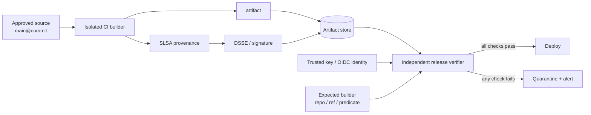

# Weekly SecDevOps Magazine — 2026-07-20

[[Home]]

#security #devops #weekly #deep-dive

## 1. Weekly focus

**今週の焦点:** SLSA provenance を「発行して満足」せず、artifact digest・builder identity・source repository・Git ref を照合して、deploy 前の **release gate** にする。

**難易度シグナル:** Intermediate（参加条件ではなく目安）  
**所要時間:** 約150分（基礎25分、実装75分、incident drill 30分、振り返り20分）

### 必要な知識・道具・環境

- 知識: SHA-256、公開鍵署名、JSON、CI/CD workflow、artifact の意味
- 道具: Linux/macOS shell、`bash`、`sha256sum`（macOS は `shasum -a 256`）、`jq`、`openssl`、`python3`
- 環境: 自分が管理するローカル検証ディレクトリ。クラウド、registry、実 credential は不要
- 先に理解しておく概念: 「署名が正しい」と「その artifact を許可してよい」は別判定、tag は可変だが digest は内容を固定する

> [!warning] 安全上の注意
> 演習はローカルの一時ディレクトリだけで行う。生成する秘密鍵は演習専用であり、本番 signing key に転用しない。実 credential、token、秘密情報を provenance やログに入れない。cleanup は対象ディレクトリを `pwd` で確認してから行う。

### 測定可能な学習成果

終了時に次を実演できることをゴールとする。

1. provenance の envelope、subject、predicate、builder の役割を説明できる。
2. artifact の実 SHA-256 と `subject.digest.sha256` の一致を機械判定できる。
3. 署名だけでなく builder/source/ref の allowlist を release policy として強制できる。
4. 改ざん、別 repository からの build、署名なし artifact を fail-closed で拒否できる。
5. verification failure から、影響範囲・証拠保全・復旧の手順を説明できる。

## 2. Production scenario と threat/failure model

### シナリオ

チームは `example/payments-api` の release binary を CI で build し、本番へ deploy している。artifact store への書き込み token が漏えいした場合でも、攻撃者が置いた binary を本番へ通したくない。そこで CI は artifact と provenance を生成・署名し、deploy job は独立した verifier で次を確認する。

- artifact の bytes が provenance の subject digest と一致する
- provenance が信頼した key/identity で署名されている
- `builder.id` が承認済み build workflow である
- source repository と ref が release policy に合う
- provenance schema/predicate type が想定通りである

### 守る対象と信頼境界

| 対象 | 攻撃・故障 | gate が担うこと | gate 単独では担えないこと |
|---|---|---|---|
| release artifact | 保存後の差し替え | digest mismatch で拒否 | 正規 source 内の悪意あるコード検出 |
| provenance | JSON 改ざん・偽造 | signature 検証 | signing identity 自体の誤発行対策すべて |
| builder | 未承認 runner で build | builder allowlist | builder 実装の完全な無欠性 |
| source | fork/feature branch から release | repository/ref policy | review の品質、依存関係の安全性 |
| verifier | timeout、schema drift | fail-closed と観測 | 可用性を損なわない例外承認設計 |

重要なのは、provenance が「artifact は安全」と保証する魔法ではなく、**どの入力を、どの builder が、どの手順で artifact にしたと主張しているかを検証可能にする証拠**だという点である。

## 3. Concept と設計 trade-off

### 3.1 三つの独立した問い

1. **Integrity:** artifact bytes は attestation の subject と同一か。
2. **Authenticity:** attestation の署名者は信頼した identity/key か。
3. **Authorization / Expectations:** 記載された builder、source、ref、parameters は組織の期待値に合うか。

署名検証だけでは 3 は満たせない。信頼済みの CI が feature branch を build した provenance も、暗号学的には正しいからである。逆に内容 policy だけを見て署名を確認しなければ、攻撃者は都合のよい JSON を自作できる。

### 3.2 SLSA provenance の読み方

- `_type`: in-toto Statement の schema を示す。
- `subject[]`: 成果物名と digest。実体との binding の中心。
- `predicateType`: predicate の意味論。SLSA provenance v1 なら `https://slsa.dev/provenance/v1`。
- `buildDefinition.buildType`: build 手順の種類。
- `externalParameters`: build 呼び出し側が制御できる入力。未知の parameter を黙認すると bypass になり得る。
- `resolvedDependencies`: 解決された source/dependency の情報。
- `runDetails.builder.id`: build platform/workflow の identity。

### 3.3 Trade-off

**Key-based vs keyless:** ローカル鍵は理解しやすい一方、保管・rotation・revocation が運用課題になる。OIDC/keyless は長寿命鍵を減らせるが、issuer、certificate identity、transparency log、workflow identity の厳格な pinning が必要。

**Fail-closed vs availability:** verifier が落ちた時に拒否すれば安全側だが deploy が停止する。例外経路は「誰でも skip」ではなく、期限付き・二者承認・監査ログ・事後 review を備える。

**厳密 pinning vs workflow evolution:** workflow file/ref を厳密に固定すると強いが、正当な変更でも policy update が必要。変更を通常の code review と同じ release engineering の一部にする。

**生成 vs 消費:** attestations を大量生成しても、deploy/download/admission で検証しなければ防御効果は限定的。今週は consumer-side verification に集中する。

## 4. Architecture / workflow



## 5. Guided lab（150分）

### Phase A — Setup（15分）

```bash
mkdir -p /tmp/secdevops-provenance-lab
cd /tmp/secdevops-provenance-lab
printf '#!/bin/sh\nprintf "payments-api 1.0.0\\n"\n' > payments-api
chmod 0755 payments-api
sha256sum payments-api > artifact.sha256
openssl genpkey -algorithm ED25519 -out lab-signing.key
openssl pkey -in lab-signing.key -pubout -out lab-signing.pub
```

**行ごとの意味:** 1行目は演習の境界を作る。2行目で対象を固定する。3行目は最小の模擬 release artifact を作る。4行目は実行 bit を付ける。5行目は検証対象 digest を記録する。6行目は演習用 Ed25519 秘密鍵、7行目は verifier に配る公開鍵を生成する。

**Checkpoint A:**

```bash
./payments-api
cat artifact.sha256
openssl pkey -pubin -in lab-signing.pub -text -noout
```

期待値: `payments-api 1.0.0`、64桁の SHA-256、`ED25519 Public-Key` が表示される。

### Phase B — Provenance を作る（25分）

```bash
DIGEST="$(sha256sum payments-api | awk '{print $1}')"
jq -n --arg d "$DIGEST" '{
  _type:"https://in-toto.io/Statement/v1",
  subject:[{name:"payments-api",digest:{sha256:$d}}],
  predicateType:"https://slsa.dev/provenance/v1",
  predicate:{
    buildDefinition:{
      buildType:"https://example.internal/build-types/release/v1",
      externalParameters:{source:{repository:"https://github.com/example/payments-api",ref:"refs/heads/main"}},
      internalParameters:{},
      resolvedDependencies:[{uri:"git+https://github.com/example/payments-api@refs/heads/main",digest:{gitCommit:"0123456789abcdef0123456789abcdef01234567"}}]
    },
    runDetails:{builder:{id:"https://github.com/example/payments-api/.github/workflows/release.yml@refs/heads/main"},metadata:{invocationId:"lab-2026-W30"}}
  }
}' > provenance.json
openssl pkeyutl -sign -inkey lab-signing.key -rawin -in provenance.json -out provenance.sig
```

**解説:** `DIGEST` は artifact 実体から算出する。`jq -n` は shell 文字列連結ではなく構造化 JSON を生成する。`subject` が artifact と証拠を結び、`predicateType` が評価ルールを決める。`externalParameters` は利用者が指定した source、`resolvedDependencies` は builder が解決した commit、`builder.id` は許可すべき実行主体である。最後の行は provenance bytes を演習鍵で署名する。本番では自己管理ファイル鍵より KMS/HSM または OIDC/keyless を検討する。

**Checkpoint B:**

```bash
jq -e '.predicateType == "https://slsa.dev/provenance/v1"' provenance.json
openssl pkeyutl -verify -pubin -inkey lab-signing.pub -rawin -in provenance.json -sigfile provenance.sig
```

期待値: `true` と `Signature Verified Successfully`。ここでは署名だけであり、まだ release 許可ではない。

### Phase C — release gate 実装（50分）

`verify-release.sh` を次の内容で作成する。

```bash
#!/usr/bin/env bash
set -euo pipefail

artifact="${1:?artifact required}"
provenance="${2:?provenance required}"
signature="${3:?signature required}"
public_key="${4:?public key required}"

expected_builder='https://github.com/example/payments-api/.github/workflows/release.yml@refs/heads/main'
expected_repo='https://github.com/example/payments-api'
expected_ref='refs/heads/main'
expected_predicate='https://slsa.dev/provenance/v1'

openssl pkeyutl -verify -pubin -inkey "$public_key" -rawin \
  -in "$provenance" -sigfile "$signature" >/dev/null

actual_digest="$(sha256sum "$artifact" | awk '{print $1}')"
subject_digest="$(jq -er '.subject[] | select(.name=="payments-api") | .digest.sha256' "$provenance")"
test "$actual_digest" = "$subject_digest"

jq -e \
  --arg builder "$expected_builder" \
  --arg repo "$expected_repo" \
  --arg ref "$expected_ref" \
  --arg predicate "$expected_predicate" '
    ._type == "https://in-toto.io/Statement/v1" and
    .predicateType == $predicate and
    .predicate.runDetails.builder.id == $builder and
    .predicate.buildDefinition.externalParameters.source.repository == $repo and
    .predicate.buildDefinition.externalParameters.source.ref == $ref and
    (.predicate.buildDefinition.externalParameters | keys == ["source"])
  ' "$provenance" >/dev/null

printf 'ALLOW artifact=%s digest=sha256:%s builder=%s\n' \
  "$artifact" "$actual_digest" "$expected_builder"
```

保存後に実行する。

```bash
chmod 0755 verify-release.sh
./verify-release.sh payments-api provenance.json provenance.sig lab-signing.pub
```

期待出力:

```text
ALLOW artifact=payments-api digest=sha256:<64桁> builder=https://github.com/example/payments-api/.github/workflows/release.yml@refs/heads/main
```

**行ごとの要点:** `set -euo pipefail` は未処理 error、未定義変数、pipeline 中間失敗を成功扱いしない。`${1:?...}` は入力欠落を即座に拒否する。期待値は provenance から自己申告させず verifier 側に置く。OpenSSL は authenticity、`sha256sum` と `test` は integrity、`jq -e` は expectations を判定する。最後の `keys == ["source"]` は未知の external parameter を fail-closed にする。

### Phase D — Negative tests（20分）

```bash
cp payments-api payments-api.tampered
printf 'malicious change\n' >> payments-api.tampered
if ./verify-release.sh payments-api.tampered provenance.json provenance.sig lab-signing.pub; then
  echo 'UNEXPECTED PASS'; exit 1
else
  echo 'EXPECTED DENY: artifact digest mismatch'
fi

jq '.predicate.buildDefinition.externalParameters.source.ref="refs/heads/feature/unreviewed"' \
  provenance.json > provenance.bad-ref.json
if ./verify-release.sh payments-api provenance.bad-ref.json provenance.sig lab-signing.pub; then
  echo 'UNEXPECTED PASS'; exit 1
else
  echo 'EXPECTED DENY: provenance changed or ref rejected'
fi
```

期待値: 二つとも `EXPECTED DENY`。2件目は JSON を変えたため、policy より先に signature が失敗する。次に bad-ref JSON を演習鍵で再署名しても ref policy が拒否することを確認する。

```bash
openssl pkeyutl -sign -inkey lab-signing.key -rawin \
  -in provenance.bad-ref.json -out provenance.bad-ref.sig
if ./verify-release.sh payments-api provenance.bad-ref.json provenance.bad-ref.sig lab-signing.pub; then
  echo 'UNEXPECTED PASS'; exit 1
else
  echo 'EXPECTED DENY: signed but unauthorized ref'
fi
```

これが「valid signature ≠ authorized release」の核心である。

### Cleanup（5分）

> [!warning] 次はファイル削除を伴う。`pwd` が `/tmp/secdevops-provenance-lab` であることを確認する。成果物を提出する場合は先に別の安全な場所へコピーする。

```bash
pwd
find /tmp/secdevops-provenance-lab -maxdepth 1 -type f -printf '%f\n'
rm -rf /tmp/secdevops-provenance-lab
```

## 6. Production configuration の読み方

実運用では手製 JSON/署名処理を標準 tool に置き換える。GitHub Actions の artifact attestation なら概念的な gate は次の形になる。

```bash
gh attestation verify ./payments-api \
  --repo example/payments-api \
  --signer-workflow example/payments-api/.github/workflows/release.yml
```

- `gh attestation verify`: signature、certificate/identity、attestation と artifact の関連を検証する。
- `./payments-api`: tag や filename の主張ではなく、実 bytes を検証対象にする。
- `--repo`: provenance を発行してよい repository identity を限定する。
- `--signer-workflow`: 許可した workflow に signer をさらに絞る。

利用中の GitHub CLI version で `gh attestation verify --help` を確認すること。container image は mutable tag ではなく `oci://REGISTRY/IMAGE@sha256:...` を使う。public/private repository、GitHub-hosted/self-hosted の信頼モデルも区別する。

## 7. Detection / observability と incident drill

### 最低限記録する structured event

```json
{
  "event":"provenance_verification",
  "result":"deny",
  "reason":"builder_identity_mismatch",
  "artifact_digest":"sha256:...",
  "expected_builder":".../release.yml@refs/heads/main",
  "observed_builder":".../debug.yml@refs/heads/main",
  "release_id":"2026-W30-001",
  "verifier_version":"policy-7",
  "timestamp":"2026-07-20T00:00:00Z"
}
```

秘密、OIDC token、private key、attestation の不要な personal data は log に残さない。

### Signals / alerts

- `verification_denied_total{reason}`: reason 別拒否数。通常ゼロからの増加を alert。
- `verification_latency_seconds`: registry/tlog/KMS 障害を検出。
- `unsigned_artifact_seen_total`: 即時 high severity。
- builder/source/ref mismatch: supply-chain incident 候補として page。
- bypass/exception count と有効期限: 例外が常態化していないか review。
- 同一 digest に複数の矛盾する provenance: quarantine。

### 30分 incident drill

**注入:** on-call に `builder_identity_mismatch` alert と対象 digest だけを渡す。

1. 0–5分: deploy を停止し、artifact と attestation を quarantine。削除せず hash と access log を保全。
2. 5–10分: expected/observed builder、source commit、workflow run、artifact store write actor を照合。
3. 10–20分: 直近の正常 digest を同じ gate で再検証し、承認済み rollback 候補を用意。
4. 20–25分: credential/token 侵害が疑われれば権限を無効化・rotation。影響 repository と期間を特定。
5. 25–30分: 正常版の復旧を digest で確認し、timeline、判断、証拠 link、follow-up owner を記録。

**成功条件:** 未検証 artifact が deploy されない、証拠が保持される、正常版も verification を省略しない、例外操作が監査可能。

## 8. Common failure modes / unsafe patterns

| Unsafe pattern | なぜ危険か | Remediation |
|---|---|---|
| signature が valid なら許可 | 正規 signer の未承認 branch も通る | builder/repo/ref/buildType を policy 化 |
| `latest` tag だけを検証 | tag が別 digest を指せる | digest pinning |
| provenance と artifact を別々に取得して関連を見ない | artifact substitution を見逃す | subject digest を実 bytes と照合 |
| public key を artifact と同じ場所から取得 | 攻撃者が両方差し替えられる | 独立した trust store/KMS/TUF root |
| `|| true` で verifier failure を無視 | fail-open | 明示的 deny、期限付き承認例外のみ |
| unknown field/parameter を無条件許可 | 意味の変わる build 入力を見逃す | schema version と許可 parameter を固定 |
| long-lived signing key を CI secret に直置き | workflow compromise で署名可能 | OIDC keyless または KMS/HSM、rotation |
| provenance に secret を含める | attestation/透明性 log から漏えい | secret-free metadata、公開前 review |
| verifier/action を mutable tag 参照 | verifier 自体の supply chain が揺れる | version/digest pin、定期 update |

## 9. Verification checklist と lab deliverables

### Checklist

- [ ] artifact digest を実体から再計算した
- [ ] signature と信頼 root/identity を検証した
- [ ] `_type` と `predicateType` を固定した
- [ ] builder identity、source repository、ref を verifier 側期待値と比較した
- [ ] 未知の external parameters を拒否または明示 review した
- [ ] mismatch は deploy 前に fail-closed になった
- [ ] deny reason、digest、policy version を structured log に残した
- [ ] bypass は期限・承認者・監査記録を持つ
- [ ] rollback artifact も同じ gate を通す
- [ ] key/identity rotation と verifier outage の runbook がある

### Concrete deliverables

1. `payments-api` と SHA-256 記録
2. `provenance.json`、`provenance.sig`、演習用公開鍵
3. `verify-release.sh`
4. 正常系 ALLOW の出力
5. artifact 改ざん、provenance 改ざん、署名済み unauthorized ref の3種の DENY 証拠
6. 1ページの incident timeline と「検知→封じ込め→復旧確認」の記録

## 10. Assessment

1. provenance の signature が正しくても deploy を拒否すべき例を一つ挙げよ。
2. `subject.digest` と実 artifact digest の比較は何を防ぐか。
3. expected builder を provenance 内だけで定義してはいけないのはなぜか。
4. verifier outage 時の fail-closed の欠点と、安全な例外設計を説明せよ。
5. tag より digest pinning が強い理由は何か。

**Interview / design question:** 複数 repository、複数 CI platform、Kubernetes cluster 10個を持つ組織で、provenance policy の所有、配布、rotation、例外承認、監査をどう設計するか。trust root と application team の責任境界も含めて答えよ。

<details>
<summary>解答例を見る</summary>

1. 信頼済み workflow が feature branch や未承認 repository を build した場合。署名は真正でも release policy 外である。
2. provenance が示す成果物と、実際に deploy する bytes のすり替え・改ざんを検出する。
3. 攻撃者が provenance を生成できれば期待値まで自己申告できるため。期待値は独立した verifier policy/trust store に置く。
4. 欠点は release 可用性の低下。例外は二者承認、短い期限、限定 digest、監査 log、事後 review、強制失効を持たせる。
5. tag は参照先を変更できるが、暗号学的 digest は内容が変われば値も変わるため。

設計問題では、中央 security/platform team が trust root と共通 deny rule を管理し、application team が review 済み repository/workflow expectations を宣言、署名付き policy bundle を各 gate/admission controller に配布する案が一例。policy version と decision log を中央集約し、rotation は重複信頼期間を設ける。break-glass は digest 単位・期限付き・二者承認とし、全 cluster に失効を伝播させる。CI と admission の二段検証で単一 gate の抜けを減らす。

</details>

## 11. Follow-up challenge と次週 prerequisite

### Optional advanced challenge（45–90分）

演習のファイル鍵を使う方式を、GitHub Actions の OIDC/keyless artifact attestation に置き換える。検証側では repository だけでなく signer workflow と ref を固定し、正常 image は許可、fork/別 workflow/署名なし image は拒否する。可能なら test cluster の admission policy まで接続する。

> Public registry、hosted runner、cluster を使う場合は外部送信・利用料金・公開範囲を先に確認する。本番 credential は使わない。

### 次週 prerequisite

- OIDC issuer / subject / audience claim
- Kubernetes admission webhook の allow/deny と failure policy
- OCI image digest と registry の基礎
- 今週の `signature + subject binding + expectations` の三層モデル

## 12. Current primary references

- [SLSA v1.2 — Specification](https://slsa.dev/spec/v1.2/)
- [SLSA — Verifying artifacts](https://slsa.dev/spec/v1.2/verifying-artifacts)
- [SLSA — Provenance](https://slsa.dev/spec/v1.2/provenance)
- [in-toto Attestation Framework specification](https://github.com/in-toto/attestation/tree/main/spec)
- [Sigstore Cosign — In-Toto Attestations](https://docs.sigstore.dev/cosign/verifying/attestation/)
- [Sigstore Cosign — Verifying signatures](https://docs.sigstore.dev/cosign/verifying/verify/)
- [GitHub Docs — Using artifact attestations to establish provenance for builds](https://docs.github.com/en/actions/how-tos/secure-your-work/use-artifact-attestations/use-artifact-attestations)
- [GitHub Docs — Enforcing artifact attestations with a Kubernetes admission controller](https://docs.github.com/en/actions/how-tos/secure-your-work/use-artifact-attestations/enforce-artifact-attestations)

> 参照日: 2026-07-20。tool の option と hosted service の仕様は変わり得るため、実装時は上記公式文書と `--help` を再確認する。
