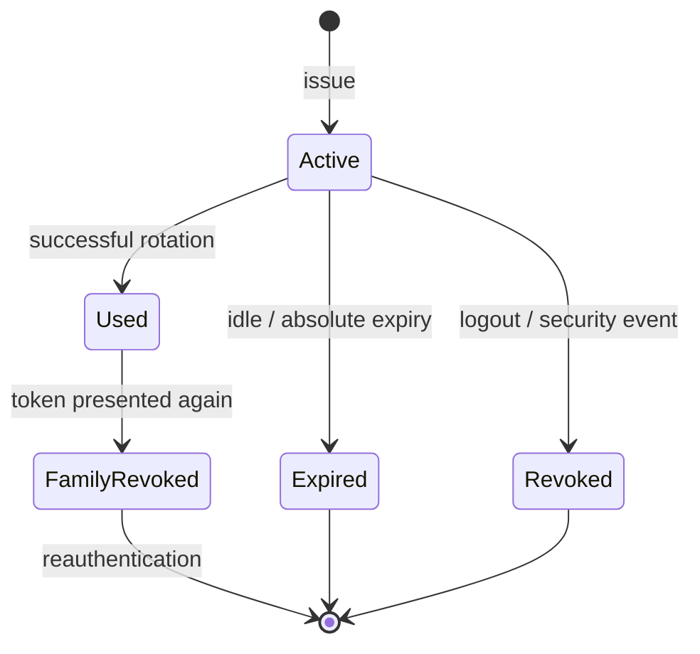

# Weekly SecDevOps Magazine — 2026-07-27

[[Home]]

#security #devops #weekly #deep-dive

## 1. Weekly focus

**今週の焦点:** OAuth 2.0 の refresh token を1回使用ごとに交換し、使用済み token の再提示を **reuse** として検知して、同じ認可に属する token family 全体を失効する。

**難易度シグナル:** Intermediate（目安であり参加条件ではない）  
**推定時間:** 150分（Foundation 25分、実装70分、production検討25分、incident drill 30分）

### 必要な知識・道具・環境

- 必要知識: OAuth 2.0 の Authorization Server / Client / Resource Server、access token と refresh token、bearer token、HTTP status code
- 道具: `python3`（標準ライブラリのみ）、`sqlite3` CLI（任意）、`curl`（任意）
- 環境: 自分が管理する Linux/macOS のローカル端末。一時ディレクトリ内だけで実施する
- 先に理解する概念:
  - access token は API 呼び出し用、refresh token は新しい access token を得る長寿命の credential
  - bearer token は「持っている者」が利用できるため、漏えい後の replay が問題になる
  - token の文字列そのものをログやDBへ平文保存しない
  - revoke は1 tokenだけでなく、その token が属する grant/session の範囲で考える

> [!warning] 安全上の注意
> このラボは架空 token をローカルで生成する。実在する OAuth provider、実アカウント、実 credential は使わない。token を端末履歴、チャット、Git、CI logへ貼らない。cleanup は削除対象がラボの一時ディレクトリであることを `pwd` で確認してから行う。

### 測定可能な学習成果

完了時に次を実演できることをゴールとする。

1. rotation が「漏えい防止」ではなく「replay の検知と封じ込め」である理由を説明できる。
2. opaque refresh token を hash 化して保存し、1回限りで原子的に交換できる。
3. 使用済み token の再提示時に token family 全体を revoke できる。
4. 正常な同時更新、攻撃者による replay、DB race のトレードオフを説明できる。
5. credential を記録せず、検知に必要な構造化 event と alert を設計できる。

---

## 2. Production scenario と threat/failure model

### シナリオ

モバイルアプリが Authorization Code + PKCE でログインし、短命 access token と長命 refresh token を受け取る。利用者がアプリを閉じても再ログインを頻繁に要求しないため、refresh token は30日間利用可能である。

ある端末の backup、malware、debug log、誤った telemetry のいずれかから refresh token `R1` が漏えいした。攻撃者と正規アプリの両方が `R1` を持つ。固定 token のままなら、攻撃者は失効まで access token を繰り返し発行でき、通常利用との区別も難しい。

rotation を使うと、最初の利用者に `R2` を発行して `R1` を使用済みにする。その後 `R1` が再提示された時点で、同じ family に複数の利用者がいることが分かる。ただし Authorization Server は攻撃者と正規利用者のどちらが先だったか判定できない。したがって **family 全体を revoke し、再認証を要求する**。

### 守る資産

- 利用者本人として API を呼べる権限
- consent された scope と resource server
- token endpoint の可用性
- security event の完全性、時系列、相関可能性

### 信頼境界

1. Client の secure storage と Authorization Server 間
2. Token endpoint と token database 間
3. Authorization Server と Resource Server 間
4. 認証サービスと log / SIEM 間

### threat / failure model

| 脅威・故障 | 例 | この号での制御 |
|---|---|---|
| Refresh token theft | 端末backup、malware、誤ログ | rotation、hash保存、短いidle期限 |
| Replay | 盗んだ旧tokenを再利用 | 使用済み状態を保持し、family revoke |
| Database race | 同一tokenへの同時request | transaction内のcompare-and-set |
| Retry ambiguity | response loss後にclientが旧tokenを再送 | 短いgraceを検討。ただし安全性低下を明示 |
| Log leakage | request bodyをAPMが取得 | token値を収集・記録しない |
| Over-revocation DoS | 古いtokenを意図的にreplay | 再認証、risk signal、sender constraintを検討 |
| Multi-region inconsistency | region間複製の遅延 | strong consistency、home-region routing、またはsender constraint |

### 明示的に対象外

- Authorization Code + PKCE 自体の完全実装
- JWT署名と access token validation
- DPoP / mTLS の実装
- ブラウザでの cookie / CSRF 対策

これらは重要だが、今週は **refresh token state machine** の深さを優先する。

---

## 3. Deep conceptual explanation と design trade-offs

### Foundation: token ではなく「認可の系譜」を管理する

rotation 前:

```text
grant G ── refresh token R1 (active)
```

1回更新後:

```text
grant G / family F
R1 (used) ──replaced_by──> R2 (active)
```

さらに更新:

```text
R1 (used) ──> R2 (used) ──> R3 (active)
```

`R1` が再提示されたら、R1だけを拒否して終わってはいけない。攻撃者が先にR1を使ってR2を取得済みかもしれないからである。R1・R2・R3を含む family F を `revoked` にし、現在の active token も利用不能にする。

### 最小 state machine

各 token record は次の状態を持つ。

- `active`: 現在交換可能
- `used`: 既に交換済み。再提示はreuse signal
- `revoked`: family失効により使用不可
- `expired`: absolute / idle expirationを超過

重要な不変条件:

1. 1 family に `active` token は最大1個。
2. `active → used` と後継 token 作成は同一transaction。
3. `used` token の提示は成功させない。
4. reuse 検知後、family 内に `active` tokenを残さない。
5. token lookup は平文ではなく keyed hash または十分強いrandom tokenのSHA-256 digestで行う。

### Opaque token と JWT refresh token

このラボは、256-bit random値から作る opaque token と server-side state を採用する。

| 設計 | 利点 | 代償 |
|---|---|---|
| Opaque + server-side state | 即時失効、系譜照会、実装を理解しやすい | DB lookup、可用性・整合性が必要 |
| Self-contained JWT | 分散検証しやすい | rotation/revocationには結局stateが必要、claim漏えい、鍵管理 |

refresh token をJWTにしても、reuse detectionのために使用状態を保持するなら「完全stateless」ではない。JWT採用を目的にせず、必要な運用特性から選ぶ。

### Hash 保存

DB侵害時に平文 refresh token があれば即座に replay できる。そこで:

```text
token_hash = SHA-256(random 256-bit token)
```

を保存する。random token が十分なentropyを持つため、passwordのような遅いKDFは通常不要。ただし token生成が弱い、短い、人間が決める場合はSHA-256だけでは守れない。より強い分離が必要なら server-side pepper を用いたHMACを使う。

### Atomicity がsecurity controlになる

次の処理を別transactionにすると危険である。

1. R1がactiveか読む
2. R2を作る
3. R1をusedにする

同時request A/Bがともに手順1を通過し、R2とR3を発行できる。したがってSQLiteでは `BEGIN IMMEDIATE`、本番DBでは row lock、serializable transaction、条件付きUPDATEなどで「勝者を1つ」にする。

### Retry grace のトレードオフ

モバイル回線でserverがR2を発行した直後にresponseが消失すると、clientはR1しか持っていない。厳密なrotationはR1再送をreuseとしてfamily revokeする。UXを改善するため、数秒だけ同じclient instanceからのretryへ同じR2を返す設計もあるが、以下が必要になる。

- responseを安全に再現する仕組み
- client instance binding / idempotency key
- 極短い期限
- 同一tokenの並行利用を見逃すリスク評価

「graceを入れればよい」ではない。金融・管理者sessionはfail-secure寄り、低リスクconsumer appは可用性寄りなど、riskで決める。

### Sender constraint との関係

RFC 9700はpublic clientのrefresh tokenについて、sender-constrained tokenまたはrotationでreplayを検知することを求める。DPoPやmTLSでtokenをclient keyへ結び付けると、文字列だけ盗まれても利用しにくい。一方、key管理とproof検証が増える。高価値アプリでは **rotation + sender constraint** も選択肢になる。

---

## 4. Architecture / workflow diagram

```mermaid
sequenceDiagram
    autonumber
    participant C as Legitimate Client
    participant A as Attacker
    participant AS as Authorization Server
    participant DB as Token DB
    participant SIEM as SIEM / Alert

    C->>AS: refresh(R1)
    AS->>DB: BEGIN; R1 is active?
    DB-->>AS: yes, family F
    AS->>DB: R1→used; create R2→active; COMMIT
    AS-->>C: access token + R2

    A->>AS: replay(R1)
    AS->>DB: R1 is used
    AS->>DB: revoke every token in family F
    AS->>SIEM: refresh_token_reuse_detected(F, client, subject)
    AS-->>A: invalid_grant

    C->>AS: refresh(R2)
    AS->>DB: family F is revoked
    AS-->>C: invalid_grant / reauthentication required
```



---

## 5. Guided lab（約150分）

### Lab goal

標準ライブラリだけで、次を満たす小さな Authorization Server core を作る。

- opaque refresh tokenを発行
- DBにはSHA-256 hashだけを保存
- rotationをtransactionで実行
- reuse時にfamily全体をrevoke
- credentialを含まないJSON eventを出力

### 5.1 Setup（10分）

> [!warning] `mktemp -d` が作る一時ディレクトリだけを使う。終了時にパスを再確認する。

```bash
LAB_DIR="$(mktemp -d)"
cd "$LAB_DIR"
pwd
python3 --version
```

期待出力:

```text
/tmp/tmp.xxxxxxxx
Python 3.10+（実際のversionでよい）
```

`refresh_lab.py` を作成し、次のコードを保存する。

```python
import hashlib
import json
import secrets
import sqlite3
import sys
import time
import uuid

DB = "tokens.db"


def now() -> int:
    return int(time.time())


def token_hash(token: str) -> str:
    return hashlib.sha256(token.encode("ascii")).hexdigest()


def new_token() -> str:
    return secrets.token_urlsafe(32)


def emit(event: str, **fields) -> None:
    safe = {"ts": now(), "event": event, **fields}
    print(json.dumps(safe, separators=(",", ":"), sort_keys=True))


def connect() -> sqlite3.Connection:
    con = sqlite3.connect(DB, timeout=5, isolation_level=None)
    con.row_factory = sqlite3.Row
    con.execute("PRAGMA foreign_keys = ON")
    con.execute("PRAGMA journal_mode = WAL")
    return con


def init() -> None:
    with connect() as con:
        con.executescript("""
        CREATE TABLE IF NOT EXISTS token_families (
          family_id TEXT PRIMARY KEY,
          subject_id TEXT NOT NULL,
          client_id TEXT NOT NULL,
          status TEXT NOT NULL CHECK(status IN ('active','revoked')),
          created_at INTEGER NOT NULL,
          revoked_at INTEGER
        );
        CREATE TABLE IF NOT EXISTS refresh_tokens (
          token_hash TEXT PRIMARY KEY,
          family_id TEXT NOT NULL REFERENCES token_families(family_id),
          status TEXT NOT NULL CHECK(status IN ('active','used','revoked')),
          issued_at INTEGER NOT NULL,
          used_at INTEGER,
          replaced_by_hash TEXT
        );
        CREATE UNIQUE INDEX IF NOT EXISTS one_active_per_family
        ON refresh_tokens(family_id) WHERE status = 'active';
        """)
    emit("schema_ready")


def issue(subject_id: str, client_id: str) -> str:
    token = new_token()
    digest = token_hash(token)
    family_id = str(uuid.uuid4())
    ts = now()
    with connect() as con:
        con.execute("BEGIN IMMEDIATE")
        con.execute(
            "INSERT INTO token_families VALUES (?,?,?,?,?,NULL)",
            (family_id, subject_id, client_id, "active", ts),
        )
        con.execute(
            "INSERT INTO refresh_tokens VALUES (?,?,?, ?,NULL,NULL)",
            (digest, family_id, "active", ts),
        )
        con.commit()
    emit("refresh_token_issued", family_id=family_id,
         subject_id=subject_id, client_id=client_id)
    return token


def rotate(token: str, client_id: str) -> tuple[bool, str]:
    presented_hash = token_hash(token)
    con = connect()
    try:
        con.execute("BEGIN IMMEDIATE")
        row = con.execute("""
          SELECT r.status AS token_status, r.family_id,
                 f.status AS family_status, f.subject_id, f.client_id
          FROM refresh_tokens r
          JOIN token_families f USING (family_id)
          WHERE r.token_hash = ?
        """, (presented_hash,)).fetchone()

        if row is None:
            con.rollback()
            emit("refresh_failed", reason="unknown_token",
                 client_id=client_id)
            return False, "invalid_grant"

        if row["client_id"] != client_id:
            con.rollback()
            emit("refresh_failed", reason="client_mismatch",
                 family_id=row["family_id"], client_id=client_id)
            return False, "invalid_grant"

        if row["family_status"] == "revoked":
            con.rollback()
            emit("refresh_failed", reason="family_revoked",
                 family_id=row["family_id"], client_id=client_id)
            return False, "invalid_grant"

        if row["token_status"] != "active":
            ts = now()
            con.execute(
                "UPDATE token_families SET status='revoked', revoked_at=? "
                "WHERE family_id=?",
                (ts, row["family_id"]),
            )
            con.execute(
                "UPDATE refresh_tokens SET status='revoked' "
                "WHERE family_id=? AND status='active'",
                (row["family_id"],),
            )
            con.commit()
            emit("refresh_token_reuse_detected",
                 family_id=row["family_id"],
                 subject_id=row["subject_id"],
                 client_id=client_id,
                 action="family_revoked")
            return False, "invalid_grant"

        replacement = new_token()
        replacement_hash = token_hash(replacement)
        ts = now()
        updated = con.execute("""
          UPDATE refresh_tokens
          SET status='used', used_at=?, replaced_by_hash=?
          WHERE token_hash=? AND status='active'
        """, (ts, replacement_hash, presented_hash)).rowcount
        if updated != 1:
            con.rollback()
            emit("refresh_failed", reason="concurrent_update",
                 family_id=row["family_id"], client_id=client_id)
            return False, "temporarily_unavailable"

        con.execute(
            "INSERT INTO refresh_tokens VALUES (?,?,?, ?,NULL,NULL)",
            (replacement_hash, row["family_id"], "active", ts),
        )
        con.commit()
        emit("refresh_succeeded", family_id=row["family_id"],
             subject_id=row["subject_id"], client_id=client_id)
        return True, replacement
    except Exception:
        con.rollback()
        raise
    finally:
        con.close()


def status() -> None:
    with connect() as con:
        rows = con.execute("""
          SELECT f.family_id, f.status AS family_status,
                 r.status AS token_status, COUNT(*) AS count
          FROM token_families f
          JOIN refresh_tokens r USING (family_id)
          GROUP BY f.family_id, f.status, r.status
          ORDER BY f.family_id, r.status
        """).fetchall()
    for row in rows:
        print(dict(row))


if __name__ == "__main__":
    command = sys.argv[1] if len(sys.argv) > 1 else ""
    if command == "init":
        init()
    elif command == "issue":
        print("TOKEN=" + issue(sys.argv[2], sys.argv[3]))
    elif command == "rotate":
        ok, result = rotate(sys.argv[2], sys.argv[3])
        print(("TOKEN=" if ok else "ERROR=") + result)
    elif command == "status":
        status()
    else:
        raise SystemExit(
            "usage: init | issue SUBJECT CLIENT | rotate TOKEN CLIENT | status"
        )
```

### 5.2 Checkpoint A — 初回発行（15分）

```bash
python3 refresh_lab.py init
ISSUE_OUTPUT="$(python3 refresh_lab.py issue user-123 mobile-app)"
printf '%s\n' "$ISSUE_OUTPUT"
R1="$(printf '%s\n' "$ISSUE_OUTPUT" | sed -n 's/^TOKEN=//p')"
test -n "$R1"
python3 refresh_lab.py status
```

期待:

- `schema_ready` eventが出る
- `refresh_token_issued` eventにtoken値が含まれない
- `TOKEN=...` はデモ用CLI responseとしてのみ表示される
- statusは `family_status: active`、`token_status: active`、count 1

検証:

```bash
python3 - <<'PY'
import sqlite3
con = sqlite3.connect("tokens.db")
value = con.execute("SELECT token_hash FROM refresh_tokens").fetchone()[0]
assert len(value) == 64
assert value.isascii()
print("PASS: DB stores a SHA-256 hex digest, not the raw token")
PY
```

### 5.3 Checkpoint B — 正常rotation（20分）

```bash
ROTATE_OUTPUT="$(python3 refresh_lab.py rotate "$R1" mobile-app)"
printf '%s\n' "$ROTATE_OUTPUT"
R2="$(printf '%s\n' "$ROTATE_OUTPUT" | sed -n 's/^TOKEN=//p')"
test -n "$R2"
test "$R1" != "$R2"
python3 refresh_lab.py status
```

期待:

```text
refresh_succeeded event
TOKEN=<R1とは異なる値>
token_status used: 1
token_status active: 1
family_status active
```

ここでR1はもう正当なclientでも使ってはいけない。clientはR2の永続化に成功してから古い値を破棄する。ただしresponse lossへの方針はproduction設計で明示する。

### 5.4 Checkpoint C — 盗難tokenのreplay（20分）

攻撃者がコピーしていたR1を後から使う状況を再現する。

```bash
python3 refresh_lab.py rotate "$R1" mobile-app
python3 refresh_lab.py status
python3 refresh_lab.py rotate "$R2" mobile-app
```

期待:

1. R1再提示で `refresh_token_reuse_detected` と `ERROR=invalid_grant`
2. familyは `revoked`
3. 後継R2も `ERROR=invalid_grant`
4. eventにR1/R2の値やhashが含まれない

**Checkpoint:** 「R1を拒否」だけでなく、「攻撃者が取得したかもしれない後継tokenを含めてfamilyをrevoke」できたことを説明する。

### 5.5 Checkpoint D — client binding（10分）

新しいfamilyで、別client IDからの更新を拒否する。

```bash
ISSUE2="$(python3 refresh_lab.py issue user-456 mobile-app)"
R3="$(printf '%s\n' "$ISSUE2" | sed -n 's/^TOKEN=//p')"
python3 refresh_lab.py rotate "$R3" evil-client
python3 refresh_lab.py rotate "$R3" mobile-app
```

期待:

- `evil-client` は `client_mismatch` で失敗
- この簡易実装ではmismatchだけでfamily revokeはしない
- 正しいclientによる後続rotationは成功

productionではclient mismatchをhigh-risk eventとして追加認証やfamily revokeへ結び付けるかをriskで決める。

### 5.6 Optional concurrency experiment（15分）

新しいtokenを同時に2回更新する。

```bash
ISSUE3="$(python3 refresh_lab.py issue user-789 mobile-app)"
R4="$(printf '%s\n' "$ISSUE3" | sed -n 's/^TOKEN=//p')"
python3 refresh_lab.py rotate "$R4" mobile-app > result-a.txt &
PID_A=$!
python3 refresh_lab.py rotate "$R4" mobile-app > result-b.txt &
PID_B=$!
wait "$PID_A"
wait "$PID_B"
sed -n '1,20p' result-a.txt
sed -n '1,20p' result-b.txt
python3 refresh_lab.py status
```

SQLiteのserializationにより一方がrotateした後、他方は使用済みtokenを観測してfamilyをrevokeする可能性が高い。これは厳密なreuse policyとして安全側だが、正規clientの多重requestでも再認証になる。client側single-flight、idempotency設計、短いretry graceの必要性を検討する材料にする。

### 5.7 Cleanup（5分）

> [!warning] 以下はファイルを削除する。現在地が作成した `$LAB_DIR` と一致することを必ず確認する。

```bash
pwd
test "$PWD" = "$LAB_DIR"
cd /
rm -rf -- "$LAB_DIR"
unset R1 R2 R3 R4 ISSUE_OUTPUT ROTATE_OUTPUT ISSUE2 ISSUE3 LAB_DIR
```

---

## 6. Configuration / commands の行ごとの説明

### Database制約

```sql
CREATE UNIQUE INDEX one_active_per_family
ON refresh_tokens(family_id) WHERE status = 'active';
```

- `CREATE UNIQUE INDEX`: application bugがあってもDBが不変条件を守る。
- `one_active_per_family`: 目的が分かる名前にする。
- `refresh_tokens(family_id)`: uniquenessをfamily単位で評価する。
- `WHERE status = 'active'`: used historyは複数保持しつつ、activeだけを1件に制限する。

### Transaction開始

```python
con.execute("BEGIN IMMEDIATE")
```

- `BEGIN`: 複数の読み書きを1 atomic unitにする。
- `IMMEDIATE`: SQLiteで先にwrite reservationを取得し、2 requestが同時にactive判定を通るのを抑える。
- 本番PostgreSQLなら `SELECT ... FOR UPDATE` や条件付き `UPDATE ... WHERE status='active'` を設計し、実負荷で検証する。

### Compare-and-set

```sql
UPDATE refresh_tokens
SET status='used', used_at=?, replaced_by_hash=?
WHERE token_hash=? AND status='active';
```

- `SET status='used'`: 現tokenを再利用不能へ遷移。
- `used_at=?`: investigation用の時刻を保存。
- `replaced_by_hash=?`: 系譜を追跡。ただし平文tokenは保存しない。
- `WHERE token_hash=?`: 提示tokenをdigestで特定。
- `AND status='active'`: 読み取り後に状態が変わっていた場合の二重成功を防ぐ。
- `rowcount == 1`: 更新成功を必ず確認し、0ならtokenを発行しない。

### Family revoke

```sql
UPDATE token_families
SET status='revoked', revoked_at=?
WHERE family_id=?;
```

- familyをsecurity boundaryとして一括失効する。
- `revoked_at` はincident timelineとretention判断に使う。
- この後、family内のactive tokenも `revoked` に更新する。

### なぜtoken hashもlogへ出さないのか

hashは直接credentialではないが、複数system間で同じtokenを追跡できるstable identifierになる。長期保存logから利用者行動を相関したり、実装変更時に予期せぬ情報となる。通常はrandomな `family_id`、request ID、client ID、subjectの内部pseudonymous IDで十分である。

---

## 7. Detection / observability signals と incident drill

### 必須event

| event | Severity目安 | 主なfield | token値 |
|---|---:|---|---|
| `refresh_succeeded` | Info | request_id, family_id, subject_id, client_id | 禁止 |
| `refresh_failed` unknown | Low/Medium | reason, client_id, source risk | 禁止 |
| `client_mismatch` | High | family_id, expected/actual client | 禁止 |
| `refresh_token_reuse_detected` | High | family_id, subject_id, client_id, action | 禁止 |
| `family_revoked` | Notice/High | reason, actor, family_id | 禁止 |

IP addressやUser-Agentはinvestigationに有用だが個人情報でもあり、NAT・proxy・mobile networkにより確証にはならない。収集目的、retention、access controlを定め、単独で攻撃者判定しない。

### Metrics

- `auth_refresh_requests_total{result,reason,client_id}`
- `auth_refresh_reuse_total{client_id}`
- `auth_token_family_revocations_total{reason,client_id}`
- `auth_refresh_latency_seconds`
- `auth_refresh_db_conflicts_total`
- `auth_reauthentication_required_total{reason}`

`subject_id` や `family_id` をmetric labelにしない。cardinality爆発とprivacy漏えいを招く。個別相関はlog/traceで行う。

### Alert例

```yaml
alert: RefreshTokenReuseSpike
expr: sum by (client_id) (increase(auth_refresh_reuse_total[10m])) >= 5
for: 2m
labels:
  severity: high
annotations:
  summary: "Refresh token reuse detections increased"
```

行ごとの意味:

- `alert`: runbookと対応づける安定した名前。
- `increase(...[10m])`: counterの直近10分増分を見る。
- `sum by (client_id)`: 利用アプリ単位で集約し、個人IDをlabel化しない。
- `>= 5`: 平常値とrisk appetiteから調整する例示値。
- `for: 2m`: 一瞬の集計揺れでpageしない。
- `severity: high`: credential replayの可能性としてon-callへ通知。
- `summary`: tokenやsubjectを含めない。

単発reuseも当該familyは即時revokeする。一方、pager発報のthresholdは運用負荷と基準率に合わせる。個別封じ込めと全体incident宣言は別判断である。

### 30分 incident drill

**Inject:** 10分間に同一clientで20 familyのreuse eventが発生。直前にモバイルSDKのdebug logging機能がreleaseされた。

#### 0–5分: Triage

1. alert発火時刻、client ID、影響family数、region、SDK versionを確認。
2. token値がlogに存在しないことを確認。もし存在するならlog system自体を漏えい源として扱う。
3. Authorization Serverのerror rate / latency / DB conflictを確認し、実攻撃か実装raceか仮説を分ける。

#### 5–15分: Containment

1. reuse familyが全てrevokedになったか確認。
2. suspect SDK versionからのrefreshをrisk-basedに制限し、必要なら段階的に再認証。
3. refresh token発行自体を全停止する前にblast radiusと代替ログイン経路を確認。
4. evidence保全: deploy ID、SDK version、event count、設定変更、時刻を記録。credentialは保存しない。

#### 15–25分: Eradication / recovery

1. debug body loggingを無効化したSDKをrelease。
2. server / API gateway / APMのrequest-body capture ruleを監査。
3. suspect familyを再認証へ誘導し、新しいgrant/familyを発行。
4. success rate、reuse rate、helpdesk件数を観測。

#### 25–30分: Exit criteria

- suspect versionから新規漏えいsignalがない
- affected familyはrevoke済み
- 正常refresh SLOが回復
- tokenがlog、trace、crash reportに残っていない
- timeline、owner、恒久対策、通知判断が記録済み

---

## 8. Common failure modes / unsafe patterns / remediation

### 1. Refresh tokenをDBへ平文保存

**問題:** DB read侵害が即credential漏えいになる。  
**修正:** 十分なentropyのopaque tokenを生成し、SHA-256またはHMAC digestだけを保存。backupも暗号化・最小権限化する。

### 2. Rotation後に旧token recordを削除

**問題:** 再提示が「unknown token」になり、reuseだと判定できない。  
**修正:** 最低でもabsolute lifetime + investigation windowの間、使用済みhashとfamily関係を保持する。retention/privacy policyを定める。

### 3. 使用済みtokenだけをreject

**問題:** 攻撃者が取得済みの後継tokenが生き続ける。  
**修正:** family全体をrevokeし、正規利用者にも再認証を求める。

### 4. Read → issue → invalidateを別処理にする

**問題:** raceで複数active tokenが生まれる。  
**修正:** transaction、row lock、compare-and-set、unique constraintを組み合わせる。

### 5. TokenをJWTにしたからstate不要と考える

**問題:** 即時revokeやreuse detectionができない。  
**修正:** grant/family stateを保持するか、sender constraintなど別の明示的controlを採用する。

### 6. Refresh tokenをbrowser localStorageへ保存

**問題:** origin内で動くJavaScript、特にXSSから読み取られる。  
**修正:** browser appではBFFや `HttpOnly; Secure; SameSite` cookieを検討し、CSRF対策も同時に設計する。

### 7. Token endpointのrequest bodyをAPMへ収集

**問題:** セキュリティ監視基盤がcredential集積地になる。  
**修正:** edgeでfield-level redaction、body capture禁止、sampling除外。実値を使わない自動テストで漏えい防止を検証する。

### 8. 無制限・無期限のrefresh token

**問題:** 盗難tokenの価値と攻撃可能期間が増える。  
**修正:** absolute expiry、idle expiry、client binding、scope/resource binding、logout/password change時のrevokeを導入する。

### 9. Reuseを全て攻撃と断定

**問題:** network retry、multi-tab、client bug、multi-region raceでも起こる。  
**修正:** familyは安全側にrevokeしつつ、原因判定はdeploy version、latency、region、concurrency signalを相関する。

### 10. 無効tokenを詳細すぎるerrorで区別

**問題:** token存在や状態を外部へoracleとして与える。  
**修正:** client responseは原則 `invalid_grant` に統一し、詳細reasonは内部eventだけに残す。

---

## 9. Verification checklist と lab deliverables

### Verification checklist

- [ ] refresh tokenはCSPRNGで256-bit相当以上のentropyを持つ
- [ ] DB、log、trace、metric、errorに平文tokenがない
- [ ] tokenはTLSでのみ送信するproduction前提が明記されている
- [ ] tokenはclient ID、scope、resource、subject/grantへbindingされる
- [ ] rotationが1 transactionで完結する
- [ ] 1 family 1 active tokenをDB制約でも守る
- [ ] used tokenの再提示でfamily全体がrevokeされる
- [ ] unknown / mismatch / expired / reusedのclient responseは情報を出しすぎない
- [ ] idle / absolute expiryとretentionが定義されている
- [ ] logout、password change、account disable時のrevoke方針がある
- [ ] multi-region consistencyの設計がある
- [ ] client retry / concurrencyの期待動作をtestしている
- [ ] reuse eventからrunbookとalertへ到達できる
- [ ] metric labelにsubject/familyなど高cardinality IDを入れていない
- [ ] 再認証経路と利用者通知方針がある

### Concrete deliverables

1. `refresh_lab.py`
2. `tokens.db` のschema（平文tokenを含まない）
3. 正常rotationのevent出力
4. reuse検知 → family revoke → R2拒否のevent出力
5. 「厳密失効 / retry grace / sender constraint」の選定を説明する200字程度のdecision note
6. incident drillの5行timeline

---

## 10. Assessment

### Five questions

1. なぜ使用済みR1が再提示された時、R1だけでなくfamily全体を失効するのか。
2. 十分にrandomなopaque tokenをDB保存する際、平文よりSHA-256 digestがよい理由は何か。
3. `SELECT` でactiveを確認してから別transactionで`UPDATE`すると、どんなraceが起きるか。
4. rotationで正規clientが誤って再認証を要求される代表的な状況を2つ挙げよ。
5. `refresh_token_reuse_detected` metricに `family_id` をlabelとして入れるべきでない理由は何か。

### Interview / design question

世界3regionで稼働し、99.99% availabilityが必要なモバイルAuthorization Serverへrotationを導入する。region間replicationは通常200ms遅延する。strict consistency、home-region routing、retry grace、DPoPのうち何を組み合わせ、security・availability・operational complexityをどう評価するか。

<details>
<summary>解答例を表示</summary>

1. 攻撃者がR1を先に使い、後継R2を取得している可能性があるため。Authorization Serverは正規側と攻撃側を区別できず、grantに属する有効な系譜を全て止める必要がある。
2. DB read侵害でdigestから高entropy tokenを現実的に復元できず、そのままcredentialとしてreplayされることを防げるため。生成entropyが弱ければSHA-256だけでは不十分。
3. 2 requestがともにactiveを読み、異なる後継tokenを成功発行し、1 familyに複数active tokenが生まれる。
4. 発行responseがnetworkで失われて旧tokenをretryする場合、同一clientが並行refreshする場合。ほかにmulti-regionのstale readもある。
5. familyごとに値が増え続けるhigh-cardinality labelとなり、metrics backendのmemory/costを圧迫し、個別相関情報も広く露出するため。

**Design question例:** familyのwriteをhome regionへroutingし、そのregion内でlinearizableなtransactionを使う。region障害時は短時間refreshをfailして再ログインへfallbackするか、risk別にfailoverする。clientはsingle-flightとidempotencyを実装する。graceは低risk clientに数秒、client-instance binding付きでのみ検討する。高価値scopeにはDPoPを追加し、盗まれた文字列だけの利用を難しくする。全region active-activeでeventual consistencyのままrotationする設計は、二重成功を許すため避ける。

</details>

---

## 11. Follow-up challenge と next-week prerequisite

### Optional advanced challenge

ラボを次の順で拡張する。

1. `issued_at` と `last_used_at` からabsolute expiry / idle expiryを強制する。
2. access tokenは5分、refresh tokenはidle 7日・absolute 30日とし、clockをinject可能にしてboundary testを書く。
3. password change eventでsubjectに属する全familyをrevokeする。
4. concurrency testを20回自動実行し、「成功responseは最大1つ」「reuse後activeは0」をassertする。
5. token hashを `HMAC-SHA-256(server_pepper, token)` に変更し、pepper rotationのmigration設計を書く。

### 次週に向けた前提

- HTTP cookieの `HttpOnly`、`Secure`、`SameSite`
- CSRFとXSSの違い
- Authorization Code + PKCE
- Backend-for-Frontend（BFF）の役割

次のidentity/session回では、browser appでrefresh tokenをJavaScriptへ渡さない **BFF session設計** に進める。

---

## 12. Current primary references

- [RFC 9700: Best Current Practice for OAuth 2.0 Security](https://www.rfc-editor.org/rfc/rfc9700.html) — §2.2.2、§4.14。public clientではsender-constrained refresh tokenまたはrotationを使い、reuse時はactive tokenをrevokeする指針。
- [RFC 6749: The OAuth 2.0 Authorization Framework](https://www.rfc-editor.org/rfc/rfc6749.html) — refresh token grant、`invalid_grant`、client bindingの基礎。
- [RFC 7009: OAuth 2.0 Token Revocation](https://www.rfc-editor.org/rfc/rfc7009.html) — token revocation endpointと関連tokenの失効。
- [RFC 9449: OAuth 2.0 Demonstrating Proof of Possession (DPoP)](https://www.rfc-editor.org/rfc/rfc9449.html) — sender-constrained tokenの選択肢。
- [OWASP OAuth2 Cheat Sheet](https://cheatsheetseries.owasp.org/cheatsheets/OAuth2_Cheat_Sheet.html) — PKCE、refresh token protection、sender constraint / rotation。
- [OWASP Session Management Cheat Sheet](https://cheatsheetseries.owasp.org/cheatsheets/Session_Management_Cheat_Sheet.html) — session lifecycle、timeout、storage、logging上の注意。

> 参照確認日: 2026-07-27。実装時は利用するAuthorization Server製品の現行documentation、security advisory、組織のrisk policyも確認する。

