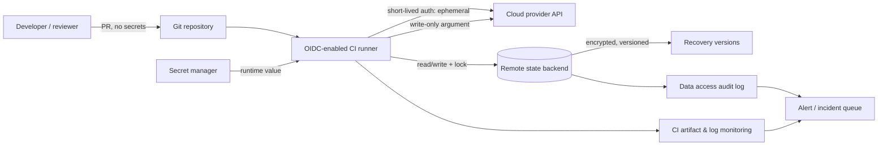

# Weekly SecDevOps Magazine — 2026-08-03

[[Home]]

#security #devops #weekly #deep-dive

> **倫理・安全:** 自分が管理する検証ディレクトリだけで実施する。例の値はすべて偽物で、実 credential を入力しない。state の手動変更や削除は管理対象を orphan 化し得るため、本番では承認・バックアップ・ロック・復旧手順なしに行わない。

## 1. Weekly focus

**焦点:** Terraform の `sensitive`、`ephemeral`、write-only argument、remote backend を「同じ秘密対策」と混同せず、**state に残さない設計**と**残る state を守る設計**を分離する。  
**難易度シグナル:** Intermediate（目安であり参加条件ではない）  
**所要時間:** 150分（Foundation 25分、実装75分、本番設計30分、incident drill 20分）

### 必要な知識・tools・環境

- Terraform CLI 1.10以上（`ephemeral` variableを利用）、`jq`、`rg`、POSIX shell
- ローカルの一時ディレクトリ。クラウドアカウント、Docker、課金リソースは不要
- `terraform init / plan / apply / show` の意味、環境変数、ファイル権限の基礎
- 先に理解したい概念: least privilege、encryption at rest、state locking、secret rotation

### 測定可能な学習成果

終了時に次を実演できること。

1. `sensitive = true` が表示を伏せても state 保存を防がないことを証拠で示す。
2. `ephemeral = true` が値を plan/state から省略する仕組みと参照制約を説明する。
3. backend の暗号化・アクセス制御・versioning・locking の役割を区別する。
4. state 漏えい時に「証拠保全→アクセス遮断→secret rotation→state修復→検証」を順序立てる。
5. CIで state/plan artifact の誤公開を検知するチェックを設計する。

## 2. Production scenario と threat/failure model

決済APIチームがTerraformでDBを構築している。変数に `sensitive = true` を付けたため安全だと思い、CIのdebug artifactとして `terraform.tfstate` と `tfplan` を保存した。artifact閲覧権限は開発組織全体にあり、90日保持される。

守る対象はDB password、API token、resource identifier、構成・network情報。想定する事象は次の通り。

- 誤操作: state、backup、planをGitやCI artifactへupload
- 内部脅威: read-onlyと思われたCI閲覧者がstateからcredentialを取得
- credential侵害: backendを読む権限を持つCI roleが奪取される
- concurrency failure: lockingなしの同時applyでstateを破損・上書き
- recovery failure: versioningなしで正常snapshotへ戻れない

**trust boundary:** Terraform CLI/provider、CI runner、backend、secret manager、operator端末の間。`sensitive` は主にUI/CLI表示境界を守るだけで、保存境界を越えて秘密を消す機能ではない。

## 3. Foundation: 概念と設計trade-off

Terraform stateは宣言と実リソースの対応を持つ運用データベースである。resource providerがAPI応答として返した属性も保存され得る。したがってstateを「ただのcache」として扱わない。

### 4つの制御を分ける

1. **`sensitive`: 表示時のredaction**  
   CLI/UIから値を隠し、意図しない画面・log露出を減らす。ただし値はstate/planに保存され得る。`terraform output -json` やstateへのread accessがあれば取得できる。
2. **`ephemeral`: 非永続化**  
   operation中だけ値を持ち、plan/stateへ保存しない。provider認証、provisioner、write-only argumentなど許可されたephemeral contextでのみ参照できる。差分追跡に値が必要な通常属性へは渡せない。
3. **write-only argument: providerへ渡して破棄**  
   典型的に `_wo` とversion属性を使う。provider/resource対応が必要で、任意の属性をwrite-onlyにはできない。Terraformは旧値を保持しないため、rotationをversionで明示する設計が必要。
4. **secure backend: 残るstateの防御**  
   encryption at rest、TLS、least-privilege read/write、audit、versioning、locking、retentionを組み合わせる。暗号化だけでは、正規read権限を奪われた攻撃者を止められない。

### 重要なtrade-off

- 非永続化を増やすほど漏えい面は減るが、drift判定・復旧・旧値参照が難しくなる。
- stateのread/write role分離はblast radiusを下げるが、運用とbreak-glass設計が複雑になる。
- versioningは誤削除から救う一方、漏れた秘密の旧versionも保持する。漏えい時は削除だけでなくrotationが必須。
- KMS鍵を分けると制御と監査は強くなるが、鍵停止がTerraform復旧を止める依存関係を生む。

## 4. Architecture / workflow



秘密のsource of truthはsecret manager、stateは構成管理DBである。CIはOIDC等の短期credentialを取得し、長期access keyをbackend設定やrepositoryへ書かない。

## 5. Guided lab（150分）

### Phase A — Setup（15分）

```bash
terraform version
jq --version
mkdir -p "$PWD/tf-state-lab"
cd "$PWD/tf-state-lab"
umask 077
```

- 1行目: Terraform CLIを確認。1.10未満なら`ephemeral`部分は実行せず読む。
- 2行目: JSON検査toolを確認。
- 3–4行目: 現在地配下に演習領域を作成して移動。
- 5行目: 以後作るファイルを原則owner-onlyにする。既存ファイルのpermissionは変えない。

`main.tf` を作る。

```hcl
terraform {
  required_version = ">= 1.10.0"
}

variable "demo_secret" {
  type        = string
  description = "FAKE value only"
  sensitive   = true
}

resource "terraform_data" "unsafe_demo" {
  input = var.demo_secret
}

output "masked_in_cli" {
  value     = terraform_data.unsafe_demo.output
  sensitive = true
}
```

**line-by-line:** `required_version` はlab semanticsを固定する。variableの`type`は入力型、`description`はreal secret禁止を伝える。`sensitive`は表示を伏せる。`terraform_data.input`は値をstateで追跡するため、ここが意図的なunsafe例。outputも伏せるが非永続化にはならない。

### Phase B — redactionと保存を区別（30分）

```bash
export TF_VAR_demo_secret='FAKE-LAB-ONLY-7d91'
terraform init
terraform apply -auto-approve
terraform output
jq -r '.. | strings | select(contains("FAKE-LAB-ONLY"))' terraform.tfstate
```

**警告:** `-auto-approve` はこのローカル・無課金labだけ。本番変更ではreview/approvalを省略しない。

**期待出力:** `terraform output` は `<sensitive>` と表示する。一方、最後の`jq`は `FAKE-LAB-ONLY-7d91` を少なくとも1回返す。

**Checkpoint A:** 「画面に出ない」と「diskに存在しない」は別であることを、CLI出力とstate検索の2つの証拠で記録する。

### Phase C — ephemeral valueを観察（35分）

別ファイル `ephemeral.tf` を作る。

```hcl
variable "runtime_token" {
  type        = string
  description = "FAKE short-lived token"
  sensitive   = true
  ephemeral   = true
}

resource "terraform_data" "ephemeral_demo" {
  provisioner "local-exec" {
    command     = "test -n \"$RUNTIME_TOKEN\" && printf 'runtime token received; value not printed\\n'"
    environment = {
      RUNTIME_TOKEN = var.runtime_token
    }
  }
}
```

- `ephemeral = true`: plan/stateへの永続化を禁止。
- `local-exec`: 値を許可されたephemeral contextであるprovisionerへ渡す。
- `command`: 空でないことだけ確認し、値そのものはprintしない。
- `environment`: shell command文字列へ秘密を連結せず、環境変数として渡す。ただし同一host上のprocess inspection等のriskは残るため、本番の推奨secret distribution方式という意味ではない。

```bash
export TF_VAR_runtime_token='FAKE-EPHEMERAL-2ac4'
terraform apply -auto-approve
if rg -n 'FAKE-EPHEMERAL-2ac4' terraform.tfstate .terraform.lock.hcl; then
  echo 'FAIL: ephemeral value persisted'
else
  echo 'PASS: ephemeral value absent from inspected persistent files'
fi
```

**期待出力:** apply中に `runtime token received; value not printed`、検索後に `PASS`。  
**Checkpoint B:** `terraform state show terraform_data.ephemeral_demo` にtoken値がないことも確認する。

> この確認は「指定したファイルに文字列がない」証拠であり、OS swap、process memory、provider logまで不存在を証明するものではない。

### Phase D — production backend design review（30分）

以下は**読解専用**。AWSにapplyしないため課金は発生しない。

```hcl
terraform {
  backend "s3" {
    bucket       = "ORG-TERRAFORM-STATE"
    key          = "payments/prod/terraform.tfstate"
    region       = "ap-northeast-1"
    encrypt      = true
    use_lockfile = true
    kms_key_id   = "arn:aws:kms:ap-northeast-1:111122223333:key/EXAMPLE"
  }
}
```

- `bucket`: state専用bucket。public access block、versioning、access logging/auditをbucket側で設定する。
- `key`: environmentごとにobject pathを分け、IAM conditionの境界にする。
- `region`: data residencyとservice endpointを固定。
- `encrypt`: stateとlock fileのserver-side encryptionを有効化。
- `use_lockfile`: 同時writeを排他する。`-lock=false`を常用しない。
- `kms_key_id`: customer-managed keyを指定。Terraform roleには必要なKMS権限だけを与える。

backend credentialをHCLや `-backend-config=access_key=...` に書かない。OIDC/role assumption、環境変数、標準credential chainを使う。state objectには `GetObject/PutObject`、lock objectだけに必要な `DeleteObject` を絞る。公式S3 backend資料ではDynamoDB lockingはdeprecatedで、現在はS3 lockfileが推奨経路である。

**Checkpoint C:** 次のcontrol matrixを自分の設計に埋める。

| Risk | Prevent | Detect | Recover |
|---|---|---|---|
| state読取 | path別IAM, KMS | object read audit | credential rotation |
| 同時apply | lockfile | lock error/CI重複run | serialize + known-good version |
| 誤削除/破損 | deny state DeleteObject | object mutation alert | versioning restore |
| artifact流出 | denylist + short retention | artifact scan | revoke access + rotate |

### Phase E — Cleanup（10分）

```bash
cd ..
find "$PWD/tf-state-lab" -maxdepth 2 -type f -print
```

表示された対象がこのlabだけか確認する。次の削除は**破壊的**で元に戻せないため、pathを目視確認してから実行する。

```bash
rm -r -- "$PWD/tf-state-lab"
unset TF_VAR_demo_secret TF_VAR_runtime_token
```

実credentialを誤って使った場合、cleanupだけでは無効化されない。直ちに発行元でrotate/revokeし、CI artifact、shell history、backupもincident scopeに含める。

## 6. Configuration / commands の判断ポイント

### CI guardrail例

```bash
set -eu
test ! -f terraform.tfstate || {
  echo 'ERROR: local state must not enter CI artifact staging' >&2
  exit 1
}
find . -type f \( -name '*.tfstate*' -o -name '*.tfplan' \) -print
```

- `set -eu`: command失敗と未定義変数を見逃さない。
- `test ! -f`: root直下のlocal stateを即時block。
- `{ ...; }`: errorをstderrへ出し非zero終了。
- `find`: nested directory、backup、planをinventory。出力があればartifact upload対象から除外し、必要に応じてpolicy gateにする。

文字列pattern scanだけに頼らない。stateにはbase64、JSON nested値、未知のprovider属性があり、secret scannerの非検出は安全証明ではない。原則はstate/planを一般artifactにしないこと。

## 7. Detection / observability signals と incident drill

### 観測すべきsignal

- backend objectの異常な `GetObject`: 新規principal、通常外IP/region、深夜、大量取得
- `PutObject`/version増加: applyのない時間帯、CI job IDと対応しないwrite
- lock取得失敗、長時間lock、`-lock=false`使用
- CI artifactに `*.tfstate*`, `*.tfplan`, `.terraform/` が含まれる
- Git push protection / secret scan alert、repository history内のstate signature (`"terraform_version"`, `"serial"`)
- KMS `Decrypt` denyや急増、backend role assumptionの異常

### 20分 incident drill

**Inject:** 「CI artifactにprod stateが90日間公開され、未知のprincipalがdownloadした可能性」。

1. **0–3分: 宣言・証拠保全** — incident ID、時刻、artifact ID、backend object version、audit logを保存。stateを慌てて編集しない。
2. **3–7分: containment** — artifact accessを停止、関連CI sessionを失効、backend read principalを必要最小限へ。automationを一時freezeする。
3. **7–12分: scope** — state schemaとprovider属性を安全な隔離環境でinventoryし、露出したcredential/identifierとdownload主体を特定。値をticket/chatへ貼らない。
4. **12–17分: eradicate/recover** — secret発行元でrotate/revoke。application側切替を確認後、Terraform構成をwrite-only/ephemeral/secret referenceへ修正。known-good state versionとlock整合性を確認。
5. **17–20分: verify** — old credentialで認証不可、新credentialでservice正常、backend異常read停止、次回planが意図しないcreate/destroyなし。timelineとownerを残す。

**成功条件:** MTTContainmentを記録し、全secretにrotation ownerが付き、old credential拒否とclean planを証拠化する。

## 8. Common failure modes / unsafe patterns / remediation

- **`sensitive = true`だけで安全と思う:** state persistenceを確認し、対応可能ならephemeral/write-onlyへ。残るstateは高機密dataとして保護。
- **stateをGit管理:** historyから除くだけで終えず、露出secretをrotate。remote backendへ移行し、push protectionを追加。
- **backend credentialをコードやCLI引数へ直書き:** OIDC短期role/credential chainへ。`.terraform/`やplanへの残存も調査。
- **全workspaceに同じread/write role:** prod/non-prodのbucket/key、role、KMSを分離し、read accessも最小化。
- **暗号化だけで満足:** IAM侵害では正規decryptが可能。data-access audit、短期session、alertを追加。
- **versioningなし:** 誤更新から戻せない。versioningと復旧演習を有効化。ただし旧secret保持を考慮してrotationする。
- **`terraform.tfstate`を直接編集:** JSON破損とbinding不整合を招く。backup後に公式CLI/`removed` blockをreview付きで使用。
- **漏えい後に `terraform state rm`だけ実行:** remote objectは残り管理外になる。これはsecret rotationではない。`-dry-run`、backup、再import/recreation計画が必要。
- **`-lock=false`で競合を回避:** state corruption riskを増やす。lock ownerを確認し、stale lockの正式な解除手順を使う。
- **plan artifactを無制限保持:** planにも機密が入り得る。access、暗号化、retention、削除、監査をstate相当にする。

## 9. Verification checklist と lab deliverables

- [ ] `sensitive`値がCLIではmaskされ、stateには存在する証拠を保存した
- [ ] ephemeral値が検査対象のplan/stateにない証拠を保存した
- [ ] `sensitive` / ephemeral / write-only / backend protectionを説明できる
- [ ] production backend control matrixを完成させた
- [ ] state/plan artifactをblockするCI guardrail案を書いた
- [ ] incident timelineとrotation owner表を作った
- [ ] cleanup前に絶対対象pathを目視し、labだけを削除した

**提出物:** `evidence.md`（mask/persistence比較）、`backend-review.md`（IAM/KMS/locking/versioning）、`ci-guardrail.sh`、`incident-timeline.md`。秘密値そのものは提出物に含めない。

## 10. Assessment

1. `sensitive = true` が防ぐもの、防がないものは何か。
2. ephemeral valueを通常resource attributeへ自由に渡せないのはなぜか。
3. state backendのlockingとversioningは、それぞれどのfailureを軽減するか。
4. stateからsecret文字列を削除しただけではincident対応が完了しない理由は何か。
5. S3 state objectとlock objectで `DeleteObject` 権限を分ける理由は何か。

**Interview / design question:** 50チーム・3環境が共有するTerraform基盤で、developerのplan権限、CIのapply権限、securityの監査権限、break-glass復旧をどう分離し、state漏えいと同時applyをどう検知・復旧するか設計せよ。

<details>
<summary>解答例（クリックして展開）</summary>

1. CLI/UIの通常表示をredactするが、state/planへの保存やread権限者による取得は防がない。
2. Terraformが値を永続化せずに差分・refreshを再現できないため。利用先はprovider設定、provisioner、ephemeral block、write-only argument等に制限される。
3. lockingは同時write、versioningは誤更新・削除・破損後のsnapshot復旧を軽減する。どちらもsecret漏えい後のrotationを代替しない。
4. 複製、backup、artifact、log、攻撃者の手元に旧値が残り得るため。発行元でrotate/revokeし利用不能にする必要がある。
5. Terraformはstate本体を通常削除する必要がないが、lockfileは解放時に削除が必要。権限を分けるとstate誤削除のblast radiusを下げられる。

設計回答では、team/environment別keyまたはbackend、plan/apply role分離、OIDC短期session、KMS/IAM最小権限、data event監査、lockfile、versioning、artifact禁止、break-glass MFA・期限・監査、定期restore drillまで含める。

</details>

## 11. Follow-up challenge と次週 prerequisite

**Optional advanced challenge（45–60分）:** 自組織向けに「state backend access policy invariant」を定義する。最低限、public access禁止、state本体のDelete禁止、lock有効、versioning有効、CI role以外のwrite禁止、data-access logging有効をpolicy-as-codeで検査する。実クラウドへapplyせず、fixtureに対するunit testでpass/failを示す。

**次週に必要な前提:** Kubernetes workload identity / OIDC federation、service account、short-lived credential、audience/subject claimの基礎。次号候補は「Kubernetesからcloud secretへ静的keyなしで到達するworkload identity」。

## 12. Current primary references

- [HashiCorp: Terraform State](https://developer.hashicorp.com/terraform/language/state) — stateの役割、secure access controlとlockingの必要性
- [HashiCorp: Manage sensitive data](https://developer.hashicorp.com/terraform/language/manage-sensitive-data) — `sensitive`、`ephemeral`、write-only argument
- [HashiCorp: Protect sensitive input variables](https://developer.hashicorp.com/terraform/tutorials/configuration-language/sensitive-variables) — local stateがplain textで値を保持する注意
- [HashiCorp: S3 backend](https://developer.hashicorp.com/terraform/language/backend/s3) — encryption、S3 lockfile、versioning、最小IAM例、DynamoDB locking deprecation
- [HashiCorp: Update Terraform state manually](https://developer.hashicorp.com/terraform/cli/state) — manual state操作のriskとbackup
- [HashiCorp: `terraform state rm`](https://developer.hashicorp.com/terraform/cli/commands/state/rm) — bindingだけを除去しremote objectは残ること、`-dry-run`

参照確認日: 2026-08-03。providerごとのwrite-only対応は変化するため、実装時に対象provider/resourceの公式registry documentationも確認する。
