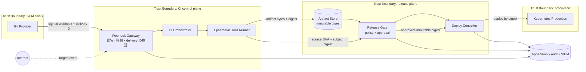

# Weekly SecDevOps Magazine — 2026-08-10

[[Home]]

#security #devops #weekly #deep-dive

> [!warning] 倫理・安全
> 自分が管理する架空システムだけをモデル化する。実在する組織の内部 URL、credential、runner 名、account ID、未公開構成を演習ファイルへ書かない。このラボはローカルファイルだけを作り、外部サービスや課金リソースを使わない。cleanup 前には必ず `pwd` と対象パスを確認する。

## 1. Weekly focus、難易度、前提、学習成果

**Weekly focus:** CI の webhook 受信から production deploy までを小さな Data Flow Diagram（DFD）に分解し、**trust boundary を横切る flow ごとに STRIDE で threat を発見し、検証可能な security requirement に変換する**。

**難易度シグナル:** Intermediate（理解の目安であり、参加条件ではない）  
**推定時間:** 150分（Foundation 25分、Practical implementation 75分、Production concerns 30分、incident drill 20分）

### 必要な知識・tools・環境

- 知識: CI/CD、HTTP webhook、Git commit SHA、authentication と authorization、least privilege
- tools: POSIX shell、Python 3.10以上、テキストエディタ。`jq` は任意
- 環境: Linux/macOS のローカル検証ディレクトリ。クラウド、Docker、実 credential は不要
- earlier concepts: asset、entry point、principal、immutable artifact、fail closed、audit log
- この回だけで使う前提: diagram は現実の完全な複製ではなく、重要な data flow と trust boundary を議論するためのモデルである

### 測定可能な学習成果

完了時に、次を成果物で示せること。

1. webhook→CI orchestrator→runner→artifact store→deploy controller→cluster の6要素と境界をDFDに描ける。
2. component の羅列ではなく、境界を横切る data flow に対して少なくとも6件の threat を記述できる。
3. threat を「攻撃者・前提・行為・影響」の形にし、曖昧な不安と区別できる。
4. mitigation を、owner、verification、残存risk、期限を持つ security requirement に変換できる。
5. forged webhook と artifact substitution の検知・封じ込め・復旧を tabletop drill で説明できる。

---

## 2. Production scenario と threat/failure model

### シナリオ

`payments-api` は Git provider の push webhook で CI を開始する。CI runner が commit を checkout、test、build し、artifact store に image digest を登録する。production deploy controller は承認済み digest を受け取り、Kubernetes cluster を更新する。

速度を優先した初期設計には次の曖昧さがある。

- webhook が本当に Git provider から来たかを誰が検証するのか
- branch 名と、実際に build された immutable commit SHA が結び付いているか
- runner が任意の artifact digest を「承認済み」とできないか
- artifact store の書込み主体と deploy の承認主体が分離されているか
- deploy controller が tag を再解決し、検証時と異なる bytes を取得しないか
- emergency bypass が通常経路として定着していないか

### 守るもの

| Asset | 必要な性質 | 侵害時の影響 |
|---|---|---|
| source identity | repository、commit SHA、trigger actor の真正性 | 未承認codeのbuild |
| build artifact | bytesとdigestの完全性、由来 | artifact差し替え |
| deploy authorization | 誰が何をどこへ出せるか | production takeover |
| CI/deploy identity | 短命・用途限定・監査可能 | 横展開、永続化 |
| audit trail | append-only、時刻・相関ID | 調査不能、否認 |
| availability | queue制限、rollback可能性 | build/deploy停止 |

### 想定する threat actor と failure

- internet 上の第三者が webhook endpoint を知っている
- contributor が feature branch / PR の code を変更できるが、production deploy 権限は持たない
- CI job が dependency compromise により attacker-controlled command を実行する
- 誤設定により runner identity の権限が広がる
- operator が誤った digest を承認する
- Git provider、artifact store、cluster の一部が一時的に利用不能になる

**範囲外:** Kubernetes workload 内部の脆弱性、source review の品質、build toolchain 自体の再現性。範囲外は「安全」と同義ではなく、別モデルへの引継ぎ事項である。

---

## 3. Foundation: 深い概念説明と設計trade-off

### Four Questions と DFD

Threat modeling は次の4問を繰り返す活動として扱うと迷いにくい。

1. **What are we working on?** 対象、資産、依存、assumption、境界を描く。
2. **What can go wrong?** STRIDE、abuse case、過去incidentを手掛かりに具体化する。
3. **What are we going to do about it?** eliminate、mitigate、transfer、accept を選ぶ。
4. **Did we do a good job?** test、telemetry、review、演習で制御を証明する。

DFDの価値は美しい図ではなく、**data がどの identity と protocol で境界を越えるか**を露出させることにある。箱の中より境界越えに注目すると、認証欠落、権限の混同、replay、integrity gap を発見しやすい。

### STRIDE を checklist ではなく問いとして使う

| 分類 | このpipelineでの問い | 例 |
|---|---|---|
| Spoofing | 相手のidentityを偽装できるか | forged webhook、盗まれたrunner token |
| Tampering | transit / at rest のdataを書換えられるか | digest置換、approval record改変 |
| Repudiation | 操作を後から否認できるか | actor不明のmanual deploy |
| Information Disclosure | 不要な主体へ情報が出るか | CI logへのtoken出力 |
| Denial of Service | 何を枯渇・停止させられるか | webhook floodでrunner枯渇 |
| Elevation of Privilege | 低権限から高権限へ移れるか | PR jobからprod deploy role取得 |

STRIDEの全分類を全要素へ機械的に当てると大量の低品質項目が生まれる。まず entry point、trust boundary、privileged process、重要assetを選び、そこへ問いを当てる。

### Threat statement の粒度

良い形式は次である。

> **[Actor]** が **[precondition / entry point]** を利用して **[action]** し、**[asset / impact]** を損なう。

悪い例: 「webhook が危険」。  
良い例: 「internet attacker が署名未検証の webhook endpoint に `main` push event を送信し、未承認buildを起動してrunner容量とdeploy gateを攻撃する」。

### 重要なtrade-off

1. **精密さ vs 更新可能性:** 巨大な全社図はすぐ陳腐化する。1つの変更または trust boundary に scope を絞る。
2. **強い分離 vs delivery速度:** build/deploy identity分離と人のapprovalは安全性を上げるが、緊急復旧を遅らせる。break-glass経路は期限、二者承認、alertを備える。
3. **fail closed vs availability:** signature verifier障害時にdeployを止めれば改ざん耐性は高いが復旧を阻む。検証済み既知digestへのrollbackだけを許可するなど、安全な縮退を設計する。
4. **完全なlog vs secret/privacy:** request body全記録は調査に便利だがcredentialを漏らす。event ID、delivery ID、repository、commit SHA、decision、key IDを記録し、secret/token/bodyは避ける。
5. **risk score vs 判断の透明性:** 数値は比較に便利だが擬似精度になり得る。likelihood/impactに加え、根拠、assumption、ownerを残す。

---

## 4. Architecture / workflow diagram



### 図を読むときの質問

- 矢印に protocol、identity、integrity mechanism、replay条件が書けるか。
- `Runner → Store` と `Gate → Deploy` で principal は異なるか。
- Gate が検証した digest が、Deploy と Cluster まで変わらず伝播するか。
- 各境界で deny decision も観測できるか。

---

## 5. Guided lab（約150分）

### Phase A — Setup（10分）

```bash
mkdir -p "$PWD/secdevops-tm-lab"
cd "$PWD/secdevops-tm-lab"
pwd
python3 --version
```

行ごとの意味:

- `mkdir -p ...`: 現在地の直下に演習専用directoryを作る。既存のsystem pathを使わない。
- `cd ...`: 以後の生成物を演習範囲へ限定する。
- `pwd`: cleanup対象を目視確認するため絶対pathを表示する。
- `python3 --version`: validatorを実行可能か確認する。

**Checkpoint A:** `pwd` の末尾が `/secdevops-tm-lab` で、Python 3.10以上が表示される。

### Phase B — scope と asset を固定（20分）

`scope.json` を作成する。

```json
{
  "system": "payments-api delivery path",
  "change": "push webhook to production deployment",
  "in_scope": ["webhook", "CI runner", "artifact", "release gate", "deploy controller"],
  "out_of_scope": ["application runtime vulnerabilities", "developer endpoint security"],
  "assumptions": [
    "Git provider supports HMAC-signed webhooks",
    "production accepts image digest, not mutable tag",
    "build and deploy use different identities"
  ],
  "assets": ["source identity", "artifact integrity", "deploy authorization", "audit trail"]
}
```

**Checkpoint B:** 各 assumption に「誰が、どのtestで確認するか」を口頭で答える。確認不能なら assumption ではなく open question として記録する。

### Phase C — flow inventory（20分）

`flows.json` を作成する。

```json
[
  {
    "id": "F1",
    "from": "Git Provider",
    "to": "Webhook Gateway",
    "data": "push event, repository, commit SHA, delivery ID",
    "boundary": "Internet to CI control plane",
    "identity": "HMAC key ID",
    "integrity": "HMAC over raw body",
    "replay_control": "timestamp window plus delivery ID uniqueness"
  },
  {
    "id": "F2",
    "from": "Build Runner",
    "to": "Artifact Store",
    "data": "artifact bytes and SHA-256 digest",
    "boundary": "CI workload to release plane",
    "identity": "short-lived workload identity",
    "integrity": "content digest and immutable write",
    "replay_control": "digest is idempotent"
  },
  {
    "id": "F3",
    "from": "Release Gate",
    "to": "Deploy Controller",
    "data": "approved digest, source SHA, policy decision ID",
    "boundary": "release plane to production",
    "identity": "dedicated gate identity",
    "integrity": "authenticated API and decision binding",
    "replay_control": "single environment, expiry, decision ID"
  }
]
```

**Expected output:** 3 flow。各flowが `boundary`、`identity`、`integrity`、`replay_control` を持つ。

### Phase D — threat register（35分）

`threats.json` を作成する。まず例の3件を入力し、自分で最低3件追加する。

```json
[
  {
    "id": "T-001",
    "flow": "F1",
    "stride": "Spoofing",
    "statement": "Internet attacker sends a forged main-push event to start an unauthorized pipeline.",
    "precondition": "Webhook signature, timestamp, or delivery ID is not enforced.",
    "impact": "Unauthorized build and runner exhaustion.",
    "mitigation": "Verify HMAC on raw bytes; reject stale or duplicate delivery IDs before enqueue.",
    "verification": "Integration tests expect 401 for bad MAC, 400 for stale event, 409 for replay.",
    "owner": "CI Platform",
    "status": "open",
    "residual_risk": "Compromised signing secret remains able to forge events."
  },
  {
    "id": "T-002",
    "flow": "F2",
    "stride": "Tampering",
    "statement": "Compromised runner replaces artifact bytes after approval while preserving a mutable tag.",
    "precondition": "Gate approves a tag rather than a digest, or store permits overwrite.",
    "impact": "Unreviewed code reaches production.",
    "mitigation": "Store immutable content and bind approval, provenance, and deploy request to one digest.",
    "verification": "Overwrite attempt fails and deployment manifest contains sha256 digest only.",
    "owner": "Release Engineering",
    "status": "open",
    "residual_risk": "A trusted builder may still produce malicious bytes."
  },
  {
    "id": "T-003",
    "flow": "F3",
    "stride": "Elevation of Privilege",
    "statement": "A PR build job obtains the production deploy identity and bypasses the release gate.",
    "precondition": "Build and deploy share credentials or trust claims do not constrain repository/ref/workflow.",
    "impact": "Contributor-controlled code can change production.",
    "mitigation": "Separate identities; constrain federation claims; authorize only gate-originated digest decisions.",
    "verification": "PR identity receives deny while release-gate identity can deploy one approved digest.",
    "owner": "Cloud Security",
    "status": "open",
    "residual_risk": "Gate identity compromise still requires rapid revocation."
  }
]
```

追加候補は F1 の DoS、F1/F3 の Repudiation、runner log の Information Disclosure。ただし文をコピーせず、自分の system assumption に結び付ける。

**Checkpoint D:** 各 threat に actor、precondition、action、impactがあり、mitigationが「暗号化する」「監視する」だけで終わっていない。

### Phase E — threat model をlint（20分）

`validate.py` を作成する。

```python
import json
import sys
from pathlib import Path

REQUIRED = {
    "id", "flow", "stride", "statement", "precondition", "impact",
    "mitigation", "verification", "owner", "status", "residual_risk"
}
STRIDE = {
    "Spoofing", "Tampering", "Repudiation",
    "Information Disclosure", "Denial of Service", "Elevation of Privilege"
}

flows = {item["id"] for item in json.loads(Path("flows.json").read_text())}
threats = json.loads(Path("threats.json").read_text())
errors = []

for number, threat in enumerate(threats, start=1):
    missing = REQUIRED - threat.keys()
    if missing:
        errors.append(f"item {number}: missing {sorted(missing)}")
    if threat.get("flow") not in flows:
        errors.append(f"{threat.get('id', number)}: unknown flow")
    if threat.get("stride") not in STRIDE:
        errors.append(f"{threat.get('id', number)}: invalid STRIDE")
    if len(threat.get("verification", "").strip()) < 20:
        errors.append(f"{threat.get('id', number)}: verification is not concrete")

ids = [threat.get("id") for threat in threats]
if len(ids) != len(set(ids)):
    errors.append("duplicate threat id")

if errors:
    print("FAIL")
    print("\n".join(f"- {error}" for error in errors))
    sys.exit(1)

print(f"PASS: {len(threats)} threats across {len(flows)} flows")
```

実行する。

```bash
python3 -m json.tool scope.json >/dev/null
python3 -m json.tool flows.json >/dev/null
python3 -m json.tool threats.json >/dev/null
python3 validate.py
```

行ごとの意味:

- 最初の3行は JSON syntax を検査し、整形結果を捨てる。errorならその場で修正する。
- 最後の行は required field、flow参照、STRIDE値、重複ID、verificationの最低限の具体性を検査する。

**Expected output（3件の例だけなら）:**

```text
PASS: 3 threats across 3 flows
```

自分で3件追加した最終状態なら `PASS: 6 threats across 3 flows` 以上になる。

### Phase F — negative test（15分）

一時的に threat 1件の `verification` を空にして実行する。

```bash
cp threats.json threats.good.json
python3 -c 'import json; p="threats.json"; d=json.load(open(p)); d[0]["verification"]=""; open(p,"w").write(json.dumps(d,indent=2)+"\n")'
python3 validate.py
mv threats.good.json threats.json
python3 validate.py
```

説明:

- `cp`: 正常版をbackupする。
- `python3 -c`: 演習ファイルの1件目だけを意図的に不完全にする。credentialは扱わない。
- 1回目のvalidator: exit code 1 と `verification is not concrete` を期待する。
- `mv`: 正常版を戻す。
- 2回目のvalidator: PASSを期待する。

### Cleanup（任意、5分）

成果物を提出するなら削除しない。削除する場合だけ、次を実行する。

> [!danger] 削除前確認
> 次の削除は取り消せない。`pwd` が想定した lab directory であること、必要な成果物を別途保存したことを確認する。

```bash
pwd
cd ..
rm -r ./secdevops-tm-lab
```

`rm -r` の対象はliteralな `./secdevops-tm-lab` のみ。変数、glob、広いpathへ置換しない。

---

## 6. Configuration / commands の設計解説

### HMAC webhook verification の擬似configuration

```yaml
webhook_verification:
  algorithm: hmac-sha256
  signed_bytes: raw_request_body
  secret_source: runtime_secret_manager
  max_clock_skew_seconds: 300
  delivery_id_ttl_seconds: 86400
  reject_before_enqueue: true
  log_fields:
    - delivery_id
    - repository
    - commit_sha
    - decision
    - key_id
```

- `algorithm`: keyed MACを明示する。plain hashは送信者認証にならない。
- `signed_bytes`: parse後のJSON再serializeではなく受信したraw bytesを検証する。
- `secret_source`: repositoryやimageへsecretを埋め込まずruntimeで取得する。
- `max_clock_skew_seconds`: 古い正規eventのreplay windowを制限する。時計同期が必要。
- `delivery_id_ttl_seconds`: 一意IDを保持しduplicateを拒否する期間。
- `reject_before_enqueue`: 無効eventでqueue/runnerを消費させない。
- `log_fields`: 調査用metadataだけ。signature、secret、full bodyは記録しない。

### Release gate policy の擬似configuration

```yaml
release_policy:
  source_repository: org/payments-api
  allowed_ref: refs/heads/main
  artifact_reference: digest_only
  required_evidence:
    - source_commit_sha
    - artifact_sha256
    - builder_identity
    - policy_decision_id
  separation_of_duties:
    builder_can_deploy: false
    gate_can_upload_artifact: false
  decision_ttl_seconds: 1800
  on_verifier_error: deny
```

- repository と ref は「正規署名なら何でも可」を防ぐ policy claim。
- `digest_only` は tag の再解決による TOCTOU を防ぐ。
- evidence はsource→artifact→decision→deployの連鎖を相関可能にする。
- separation of duties は1 identity compromiseのblast radiusを縮める。
- decision TTL は古いapprovalの再利用を制限する。
- verifier error時のdenyはfail closed。本番では既知good digestへのrollback経路も設計する。

---

## 7. Detection / observability signals と incident drill

### 最低限のsecurity events

| Event | 必須field | Alert例 |
|---|---|---|
| `webhook.rejected` | time, delivery_id, reason, source IP, repository | bad MAC急増、同一IDのreplay |
| `pipeline.started` | delivery_id, commit_sha, workflow, runner_identity | main以外からrelease workflow |
| `artifact.published` | digest, source_sha, builder_identity | overwrite試行、未知builder |
| `release.denied` | decision_id, digest, failed_policy | digest/source mismatch |
| `deploy.started` | decision_id, digest, environment, actor | decisionなし、期限切れdecision |
| `deploy.completed` | digest, cluster, rollout revision, result | approved digestと実行digest不一致 |

避けるlog: webhook secret、Authorization header、OIDC token、full request body、private key。delivery ID と decision ID を correlation key にする。

### Incident drill: artifact substitution alert（20分）

**Inject:** SIEM が `artifact.published digest=D2 source_sha=S1` を記録した直後、release gate は `decision_id=A1 digest=D1 source_sha=S1` を承認。deploy request が `D2` を要求し拒否された。

1. **Triage:** D1/D2のbytes、source SHA、builder identity、decision record、時刻を照合。alertがpolicy testではないことを確認。
2. **Containment:** release queueを停止。該当runner identityを無効化し、artifact storeへのwriteを一時制限。既にdeploy済みなら新規rolloutを停止。
3. **Evidence preservation:** runner log、control-plane audit、artifact metadata、policy decisionをread-only保全。疑わしいartifactを実行しない。
4. **Eradication:** credentialだけでなくfederation trust、workflow変更、runner image、store ACLを調査し、侵入経路を閉じる。
5. **Recovery:** 独立検証済みの既知good digestへrollback。新しいshort-lived identityでgateを再開し、実cluster digestを検証。
6. **Learning:** threat T-002のprecondition、検知時間、owner、testを更新。diagramやassumptionが誤っていれば同じ変更で直す。

**成功条件:** 「tagを戻した」ではなく、clusterが既知good digestを実行し、未承認deployがなく、該当identityが失効し、関連eventが相関できる。

---

## 8. Common failure modes、unsafe patterns、remediation

| Unsafe pattern / failure | なぜ危険か | Remediation |
|---|---|---|
| 図にtrust boundaryがない | identity変化と検証責任が見えない | network/organizationではなくtrustが変わる地点を描く |
| 「attackerが侵入する」だけ | testもcontrolも導けない | actor、precondition、action、impactへ分解 |
| STRIDE全項目を全箱に生成 | noiseで重要threatが埋もれる | entry point、privileged flow、assetからdepth-firstに分析 |
| mitigationが「監視する」 | preventionもresponse条件も不明 | signal、threshold、owner、runbook、preventive controlを指定 |
| webhook secretをlogへ出す | 検証機構がcredential漏えい源になる | key IDとdecisionだけ記録、secretをredact |
| tagをapproval対象にする | tagが後で別bytesを指せる | digestへapprovalをbinding |
| build/deployが同一identity | runner compromiseがprod変更に直結 | workload identity分離とclaim制約 |
| risk acceptedに期限がない | 暫定例外が恒久化する | owner、理由、expiry、compensating controlを必須化 |
| threat modelを年1回だけ更新 | architectureとの差分が広がる | boundary/identity/data変更をPR triggerにする |
| scanner結果をthreat modelと呼ぶ | design abuse caseを見落とす | scannerはevidenceの一部、modelはsystem reasoningとして維持 |

---

## 9. Verification checklist と具体的deliverables

### Verification checklist

- [ ] scope は1つのdelivery pathに限定され、in/out of scopeが明示されている
- [ ] 少なくとも4 asset と3 assumptionがある
- [ ] DFDの全flowにdata、boundary、identity、integrity、replay controlがある
- [ ] 6件以上のthreatがあり、最低4種類のSTRIDE分類を含む
- [ ] 全threatにowner、verification、residual riskがある
- [ ] webhook rejection、release denial、deploy実行を相関できるevent設計がある
- [ ] build identityがproductionへ直接deployできない
- [ ] approvalと実deployが同じimmutable digestへ結び付く
- [ ] validatorのnegative testがFAILし、復元後にPASSする
- [ ] incident drillでcontainmentとrecoveryの成功条件を説明できる

### Lab deliverables

1. `scope.json`
2. `flows.json`
3. 6件以上を含む `threats.json`
4. `validate.py`
5. validatorのPASS出力
6. T-002 incident drillの5〜10行timeline
7. 「今週実装するcontrol 1件」と「期限付きでacceptするrisk 1件」のdecision record

---

## 10. Assessment

### Five questions

1. DFDで trust boundary を描く主目的は何か。
2. webhookのHMACが正しくてもtimestampとdelivery ID確認が必要なのはなぜか。
3. artifact tagではなくdigestへapprovalを結び付ける理由は何か。
4. threat statementにpreconditionを含める実務上の利点は何か。
5. build identityとdeploy identityを分けても残るriskを1つ挙げよ。

### Interview / design question

障害対応のため「release gateが停止していてもoperatorがproductionへdeployできるbreak-glass経路」が必要になった。通常経路のsecurity propertyを壊さず、可用性も確保する設計を、identity、approval、scope、expiry、observability、recoveryの観点から説明せよ。

<details>
<summary>解答例（クリックして展開）</summary>

1. trustやidentityの前提が変わるdata flowを明示し、境界越えで必要な認証、認可、完全性、replay対策の責任を検討するため。
2. HMAC付きの正規eventも捕捉されれば再送できる。短い時刻windowとdelivery IDの一意性で有効なreplayを制限する。
3. tagは可変参照で、検証後に別bytesを指し得る。digestは内容に結び付き、approval、evidence、実deployを同一artifactに固定できる。
4. controlが破るべきattack conditionとtest条件が明確になり、優先順位やresidual riskを説明できる。
5. 例: release gate identity自体の侵害、誤ったpolicy、正規builderが悪意あるbytesを生成、operatorの誤承認、federation設定ミス。

**Design question:** 平時は無効な専用break-glass roleを使い、強い再認証と二者承認で有効化する。対象をproductionの既知good digestへのrollbackなど最小操作に限定し、短時間で自動expiryさせる。利用開始時点でon-call/securityへ即時alertし、理由、ticket、actor、digest、対象environment、全API操作をappend-only logへ残す。secretの共有や恒久keyは使わない。事後にrole sessionを失効し、実cluster digestとhealthを確認し、24時間以内にreviewする。gateを迂回して任意tagをdeployできる設計にはしない。

</details>

---

## 11. Follow-up challenge と next-week prerequisite

### Optional advanced challenge（45〜60分）

`validate.py` を拡張し、次をpolicy-as-codeとして検査する。

- `status=accepted` には `acceptance_owner`、`reason`、`expires_on` が必須
- `expires_on` が過去ならFAIL
- High impact threatに `verification` と `detection_event` が必須
- すべてのflowが最低1件のthreatから参照される

さらにGit PR templateへ「DFDのboundary、identity、sensitive data flowを変えるか」という質問を追加し、`yes` なら threat model reviewをrequired checkにする。目的は文書量を増やすことではなく、**architecture changeとmodel updateを同じdelivery flowへ入れること**である。

### Next-week prerequisite

- webhook HMAC、replay protection、constant-time comparisonの意味
- workload identity federation と短命credentialの基本
- immutable digest とprovenanceの違い
- alertからrunbookへつなぐevent schemaの基礎

---

## 12. Current primary references

- [OWASP Threat Modeling Project — maintained guidance](https://owasp.org/www-project-threat-modeling/) — Four Questions Framework、方法論は一つに固定されないという現在の入口。
- [OWASP Threat Modeling Cheat Sheet](https://cheatsheetseries.owasp.org/cheatsheets/Threat_Modeling_Cheat_Sheet.html) — scope、model、threat identification、mitigation、validationの実務手順。
- [OWASP Threat Modeling overview](https://owasp.org/www-community/Threat_Modeling) — threat modelの構成要素とlifecycleを通じた継続的更新。
- [Microsoft Threat Modeling Tool overview](https://learn.microsoft.com/en-us/azure/security/develop/threat-modeling-tool) — STRIDE per Elementを用いたguided analysis。
- [NIST SP 800-154 Initial Public Draft](https://csrc.nist.gov/pubs/sp/800/154/ipd) — data-centric threat modelingの原則。**2026-08-10時点でもInitial Public Draftであり、final standardとして扱わない。**
- [OWASP Threat Dragon](https://github.com/OWASP/threat-dragon) — open-source threat modeling tool。toolは思考の代替ではなく、diagramとthreat registerの共同編集手段として使う。

> 参照日は 2026-08-10。公式文書でもstatus（maintained / draft / historical）を確認し、組織のrisk management標準と併用する。
