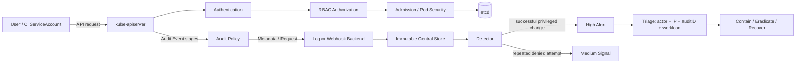

# Weekly SecDevOps Magazine — 2026-08-17

[[Home]]

#security #devops #weekly #deep-dive

> [!warning] 倫理・安全
> 自分が管理するローカル環境または明示的に許可された cluster だけで実施する。演習は合成 audit event を使い、実 cluster や実 credential は不要である。本番で audit 設定を変更すると kube-apiserver の負荷・保存費用・機密情報露出に影響する。必ず変更管理、容量見積り、rollback 手順を用意する。cleanup 前には対象ディレクトリを確認する。

## 1. Weekly focus、難易度、前提、学習成果

**Weekly focus:** Kubernetes Audit Log の `user`、`verb`、`objectRef`、`requestObject`、`responseStatus` を相関し、**privileged Pod の作成または変更**を、成功・失敗を区別して検知する。収集基盤全般には広げず、「何を記録し、どの event を alert にし、どう調査するか」に集中する。

**難易度シグナル:** Intermediate（理解の目安であり、参加条件ではない）  
**推定時間:** 150分（Foundation 25分、Practical implementation 70分、Production concerns 30分、incident drill 25分）

### 必要な知識・tools・環境

- 知識: Kubernetes API request、Pod / Deployment、Namespace、ServiceAccount、RBAC、JSON の object / array
- tools: Python 3.10以上、POSIX shell、テキストエディタ。`jq` と `kubectl` は任意
- 環境: Linux/macOS のローカル一時ディレクトリ。cluster、Docker、cloud account、実 credential、課金リソースは不要
- earlier concepts: least privilege、principal、immutable log、UTC timestamp、false positive、containment、evidence preservation
- 重要な境界: audit log は API server が観測した事実であり、node 上の全 process activity や container runtime event を完全には表さない

### 測定可能な学習成果

完了時に、次を成果物で示せること。

1. Audit Event の principal、操作、対象、成否、request body を抽出できる。
2. `Request` と `Metadata` の情報量・機密性・費用の trade-off を説明できる。
3. Pod の全 container 種別から `securityContext.privileged: true` を検知できる。
4. 成功 event だけを high alert とし、拒否 event は別 signal として集計できる。
5. alert から audit ID、actor、source IP、対象 workload を使って triage できる。

## 2. Production scenario と threat / failure model

### Scenario

SaaS チームは multi-tenant Kubernetes cluster を運用している。通常の application namespace は Pod Security Standards の `restricted` 相当だが、例外的な node agent 用 namespace がある。深夜、CI ServiceAccount を使った Pod 更新に `privileged: true` が含まれた。問いは「誰が、どこから、何を、成功させたか」「preventive control が機能しなかったのか」「影響範囲はどこまでか」である。

### 守る対象

- node kernel、host filesystem、workload credential
- kube-apiserver の integrity と availability
- audit trail の完全性、検索可能性、保存期間
- tenant 間の isolation と調査時の chain of custody

### Threat / failure model

| 事象 | 具体例 | 検知で見るもの | 限界 |
|---|---|---|---|
| credential misuse | 漏えいした CI token で Pod 作成 | `user.username`、`sourceIPs`、時刻、namespace | token を使った人間までは断定できない |
| privilege escalation | privileged container、ephemeral container の追加 | `requestObject.spec.*Containers[].securityContext` | `Metadata` level では body がない |
| prevention failure | admission が許可すべきでない request を成功させた | `responseStatus.code` 2xx | audit log 自体は阻止しない |
| reconnaissance / repeated denial | 禁止操作の連続試行 | 4xx event の回数と actor | 単発の拒否は正常な設定ミスかもしれない |
| logging failure | policy 漏れ、backend 停止、drop | event volume、ingestion lag、gap、backend error | 「ログがない」は「操作がない」と同義ではない |
| evidence leakage | Secret body や token が log に入る | audit policy level、redaction、access control | 広すぎる `RequestResponse` は二次漏えい源になる |

**Assumption:** kube-apiserver を経由する request は audit 対象で、log backend は workload 管理者が改変できない場所へ送られる。API server を迂回する node activity は runtime telemetry で補完する。

## 3. Foundation: 概念と design trade-offs

### Event lifecycle と stage

同一 request は stage ごとに event を生成し得る。`RequestReceived` は到着直後、`ResponseComplete` は応答完了後である。検知で両方を数えると二重 alert になるため、今回は **`ResponseComplete` に固定**する。長時間 request には `ResponseStarted` があり、panic には `Panic` がある。

### Audit level

- `None`: 記録しない。noise を減らすが blind spot を作る。
- `Metadata`: user、timestamp、verb、resource など。軽量だが PodSpec の危険な field は見えない。
- `Request`: metadata と request body。今回の privileged 判定に必要。
- `RequestResponse`: request と response body。調査力は高いが volume と機密性リスクが最大。

Audit policy は **先頭から評価され、最初に一致した rule が level を決める**。したがって Pod 書き込み用の `Request` rule を catch-all `Metadata` より前に置く。Secrets は body を採らず Metadata に留める。

### 検知条件

High alert は次の積である。

```text
stage == ResponseComplete
AND verb in {create, update, patch}
AND objectRef.resource in {pods, deployments, daemonsets, statefulsets, jobs, cronjobs}
AND responseStatus.code in 200..299
AND submitted PodSpec contains securityContext.privileged == true
```

`denied` request は防御が働いた証拠でもあるため high alert には混ぜず、Medium signal として actor ごとに rate 集計する。`patch` の request body は JSON Patch / Merge Patch / Strategic Merge Patch のいずれかで、完全な PodSpec でない場合がある。本番 detector は `requestURI`、content type、admission annotation と object change stream を組み合わせる必要がある。

### 重要な trade-offs

1. **visibility vs confidentiality:** body がなければ危険 field を判定できないが、body は環境変数などを含み得る。対象 resource と verb を狭くし、保存先も機密データとして扱う。
2. **detection vs prevention:** audit は detective control。Pod Security Admission、policy engine、RBAC は preventive control。両方が必要。
3. **latency vs durability:** synchronous webhook は低遅延でも backend 障害が API server に影響し得る。batch、buffer、disk、drop policy を SLO と合わせる。
4. **signal vs noise:** system component の正当な操作も同じ field を使う。単純 allowlist は永続例外になりやすい。namespace、actor、change ticket、時間窓を含む期限付き exception にする。

## 4. Architecture / workflow



## 5. Practical implementation: 150分 lab

### Phase A — Setup（15分）

> [!warning] cleanup はファイル削除を含む。必ず `pwd` が作成した lab directory を指すことを確認する。実 token や実 audit log を貼り付けない。

```bash
LAB_DIR="$(mktemp -d -t k8s-audit-lab.XXXXXX)"
cd "$LAB_DIR"
pwd
python3 --version
```

- 1行目: OS が安全に一意な一時 directory を作り、その絶対 path を保持する。
- 2行目: 以後の作業範囲を限定する。
- 3行目: cleanup 前に照合する path を表示する。
- 4行目: Python 3.10以上を確認する。

**Checkpoint A:** path が `/tmp/` 等の下の `k8s-audit-lab.*` であり、Python version が表示される。

### Phase B — Audit policy を設計（20分）

`audit-policy.yaml` を次の内容で作る。

```yaml
apiVersion: audit.k8s.io/v1
kind: Policy
omitStages:
  - RequestReceived
omitManagedFields: true
rules:
  - level: Metadata
    resources:
      - group: ""
        resources: ["secrets"]
  - level: Request
    verbs: ["create", "update", "patch"]
    resources:
      - group: ""
        resources: ["pods", "pods/ephemeralcontainers"]
      - group: "apps"
        resources: ["deployments", "daemonsets", "statefulsets"]
      - group: "batch"
        resources: ["jobs", "cronjobs"]
  - level: Metadata
```

**行ごとの意味:** `apiVersion` と `kind` は audit policy schema を指定する。`omitStages` は到着時 event を省き二重計上と volume を抑える。`omitManagedFields` は巨大な field ownership 情報を落とす。最初の rule は Secret body を記録しない。次の rule は workload を変える verb だけ request body を残す。core API group は空文字、built-in workload は `apps` / `batch` group を使う。最後は unmatched request を Metadata で記録する catch-all である。

**Checkpoint B:** なぜ Secret rule が workload rule より前にあり、catch-all が最後なのかを説明できる。

### Phase C — 合成 event を作る（15分）

`events.jsonl` に次の3行を保存する。1行が1 event である。

```json
{"apiVersion":"audit.k8s.io/v1","kind":"Event","level":"Request","auditID":"a-100","stage":"ResponseComplete","requestReceivedTimestamp":"2026-08-17T00:10:00Z","verb":"create","user":{"username":"system:serviceaccount:payments:deployer","groups":["system:serviceaccounts"]},"sourceIPs":["10.20.4.18"],"objectRef":{"resource":"pods","namespace":"payments","name":"reconcile-debug","apiVersion":"v1"},"responseStatus":{"code":201},"requestObject":{"spec":{"containers":[{"name":"debug","image":"example.invalid/debug@sha256:deadbeef","securityContext":{"privileged":true}}]}}}
{"apiVersion":"audit.k8s.io/v1","kind":"Event","level":"Request","auditID":"a-101","stage":"ResponseComplete","requestReceivedTimestamp":"2026-08-17T00:11:00Z","verb":"create","user":{"username":"alice@example.invalid"},"sourceIPs":["192.0.2.10"],"objectRef":{"resource":"pods","namespace":"dev","name":"toolbox","apiVersion":"v1"},"responseStatus":{"code":403,"status":"Failure"},"requestObject":{"spec":{"containers":[{"name":"toolbox","image":"example.invalid/toolbox:lab","securityContext":{"privileged":true}}]}}}
{"apiVersion":"audit.k8s.io/v1","kind":"Event","level":"Request","auditID":"a-102","stage":"ResponseComplete","requestReceivedTimestamp":"2026-08-17T00:12:00Z","verb":"update","user":{"username":"system:serviceaccount:apps:release"},"sourceIPs":["10.20.5.9"],"objectRef":{"resource":"deployments","namespace":"apps","name":"web","apiGroup":"apps","apiVersion":"v1"},"responseStatus":{"code":200},"requestObject":{"spec":{"template":{"spec":{"containers":[{"name":"web","image":"example.invalid/web@sha256:cafe","securityContext":{"privileged":false}}]}}}}}
```

**期待:** a-100 は成功した危険操作、a-101 は拒否された試行、a-102 は成功した通常操作。

### Phase D — Detector を実装（35分）

`detect.py` を作る。

```python
import json
import sys

WRITE_VERBS = {"create", "update", "patch"}
WORKLOADS = {"pods", "deployments", "daemonsets", "statefulsets", "jobs", "cronjobs"}

def pod_spec(obj, resource):
    if resource == "pods":
        return obj.get("spec", {})
    if resource == "cronjobs":
        return obj.get("spec", {}).get("jobTemplate", {}).get("spec", {}).get("template", {}).get("spec", {})
    return obj.get("spec", {}).get("template", {}).get("spec", {})

def has_privileged(spec):
    groups = ("initContainers", "containers", "ephemeralContainers")
    return any(
        c.get("securityContext", {}).get("privileged") is True
        for group in groups
        for c in spec.get(group, [])
    )

for line_number, line in enumerate(sys.stdin, 1):
    event = json.loads(line)
    ref = event.get("objectRef", {})
    resource = ref.get("resource", "")
    if event.get("stage") != "ResponseComplete":
        continue
    if event.get("verb") not in WRITE_VERBS or resource not in WORKLOADS:
        continue
    if not has_privileged(pod_spec(event.get("requestObject", {}), resource)):
        continue
    code = event.get("responseStatus", {}).get("code", 0)
    alert = {
        "severity": "HIGH" if 200 <= code < 300 else "MEDIUM",
        "outcome": "success" if 200 <= code < 300 else "denied",
        "audit_id": event.get("auditID"),
        "actor": event.get("user", {}).get("username"),
        "source_ips": event.get("sourceIPs", []),
        "verb": event.get("verb"),
        "namespace": ref.get("namespace"),
        "resource": resource,
        "name": ref.get("name"),
        "http_code": code,
        "line": line_number,
    }
    print(json.dumps(alert, ensure_ascii=False, sort_keys=True))
```

**行ごとの説明:** import は JSON parsing と stdin を使う。2つの set は対象 verb/resource の allowlist である。`pod_spec` は Pod と controller ごとの PodSpec の nesting 差を吸収し、CronJob は `jobTemplate` も辿る。`has_privileged` は init・通常・ephemeral の全 container list を走査し、boolean の `true` だけを検知する。main loop は line number を evidence として保持し、`ResponseComplete` 以外、読み取り操作、対象外 resource、非 privileged を順に除外する。HTTP 2xx を成功として High、それ以外を denied の Medium に分ける。最後は調査に必要な最小 field だけを JSON Lines で出力する。

実行する。

```bash
python3 detect.py < events.jsonl | tee alerts.jsonl
python3 -m json.tool < <(head -n 1 alerts.jsonl)
```

- 1行目: detector に events を渡し、画面表示と成果物保存を同時に行う。
- 2行目: 先頭 alert が valid JSON か、人が読みやすい形式で確認する。process substitution 非対応 shell では `head -n 1 alerts.jsonl | python3 -m json.tool` を使う。

**期待 output（field 順は異なってよい）:** 2件。`a-100` は `HIGH/success`、`a-101` は `MEDIUM/denied`。`a-102` は出力されない。

### Phase E — Test と checkpoint（15分）

```bash
test "$(wc -l < alerts.jsonl | tr -d ' ')" = "2"
rg '"audit_id": "a-100"' alerts.jsonl
rg '"severity": "HIGH"' alerts.jsonl
if rg -q 'a-102' alerts.jsonl; then exit 1; fi
echo "CHECKPOINT: detector behavior is expected"
```

各行は順に alert 件数、危険 event の存在、High 判定、正常 event の不在を検証する。`set -e` に依存せず、最後の `if` で false positive を明示的に失敗させる。

**Checkpoint E:** `CHECKPOINT: detector behavior is expected` が表示される。

### Phase F — Cleanup（5分）

```bash
pwd
printf 'Delete only this lab directory? %s\n' "$LAB_DIR"
cd /tmp
rm -r -- "$LAB_DIR"
```

> [!danger] 破壊的操作
> `pwd` と表示 path が今回の `k8s-audit-lab.*` であることを目視確認してから実行する。成果物を提出する場合は、先に安全な作業 directory へコピーする。`rm -r` は復元できない可能性がある。

## 6. Production configuration の読み方

Self-managed kube-apiserver では概念上、次を設定する。

```text
--audit-policy-file=/etc/kubernetes/audit-policy.yaml
--audit-log-path=/var/log/kubernetes/audit/audit.log
--audit-log-maxage=14
--audit-log-maxbackup=10
--audit-log-maxsize=100
```

- `--audit-policy-file`: 何をどの level で記録するかを指定する。省略時は event が記録されない。
- `--audit-log-path`: local log backend の出力先。権限、rotation、shipping を別途設計する。
- `maxage`: 保持日数、`maxbackup`: rotation file 数、`maxsize`: 1 file の MiB 上限。三者は incident investigation window と disk budget の両方で決める。

Managed Kubernetes では provider の control-plane logging 設定を使い、上記 flag を直接編集できないことが多い。変更方法・料金・保存先・デフォルト無効化の有無を provider の現行 documentation で確認する。

## 7. Detection / observability signals と incident drill

### 運用 signal

- High: 成功した privileged workload create/update/patch
- Medium: 同一 actor / source IP から5分で3回以上の denied privileged attempt
- Health: audit event rate、backend write error、queue depth、ingestion lag、parse failure rate
- Coverage: expected control-plane request count と ingested event count の差、各 cluster の last-seen timestamp
- Integrity: immutable/WORM retention、保存先への write principal と read principal の分離、時刻同期

### 25分 incident drill

**Inject:** `a-100` alert を受信したと仮定する。

1. **0–5分 / validate:** alert の raw event を `auditID=a-100` で取得。`responseStatus.code=201` を確認し、成功と断定する。時刻、cluster、namespace、Pod UID を記録する。
2. **5–10分 / scope:** 同じ actor、source IP、image digest、namespace の前後30分を検索。Pod 作成以外に RoleBinding、Secret access、ephemeral container、exec がないか確認する。
3. **10–15分 / contain:** incident commander の承認下で CI credential を失効または workload identity binding を無効化。危険 Pod を隔離する。削除前に manifest、audit event、node/runtime telemetry を保全する。本番操作は playbook と change record に従う。
4. **15–20分 / eradicate & recover:** unauthorized RBAC binding と pipeline change を修正し、known-good digest へ戻す。Pod Security Admission / admission policy がなぜ許可したか確認する。
5. **20–25分 / verify:** actor の access が拒否され、restricted workload が正常稼働し、新たな High alert がないことを確認。timeline、影響、判断、証拠 location、follow-up owner を記録する。

**Drill deliverable:** 6列の timeline（UTC時刻、event、evidence、判断、action、owner）を `incident-a-100.md` に作る。

## 8. Common failure modes、unsafe patterns、remediation

1. **すべて `RequestResponse`:** volume と secret exposure が増える。resource/verb 別の最小 level と redaction を採用する。
2. **すべて `Metadata`:** PodSpec 内の privileged field を判定できない。危険な workload write にだけ `Request` を使う。
3. **rule 順序の誤り:** 先頭の catch-all が後続 rule を死なせる。specific-to-general の順にし、sample event で coverage test を行う。
4. **拒否と成功を同じ severity:** preventive control が機能した event で pager が疲弊する。outcome を分離し、拒否は rate と context で昇格する。
5. **Pod の `containers` だけ確認:** init / ephemeral container、controller template を見逃す。全 PodSpec path を test fixture に含める。
6. **audit log を cluster 内だけに保存:** cluster compromise や disk loss で証拠を失う。別 security boundary の append-only central store へ送る。
7. **actor 名だけで attribution:** ServiceAccount は複数 job から使われ得る。source IP、token/JTI が得られる場合の identity、CI run ID、image digest と相関する。
8. **alert 後すぐ Pod 削除:** containment はできても揮発証拠を失う。安全性を優先しつつ、承認済み手順で capture と isolation を行う。
9. **backend failure を監視しない:** detector が静かなだけなのに「安全」と誤認する。pipeline health alert と heartbeat event を設ける。

## 9. Verification checklist と lab deliverables

### Checklist

- [ ] 直近 event を重複計上しない stage 方針を説明できる
- [ ] Secret body を記録しない rule が workload rule より前にある
- [ ] workload write は `Request`、catch-all は `Metadata` である
- [ ] successful と denied を別 outcome / severity にしている
- [ ] Pod、controller、CronJob、init/ephemeral container の path を扱う
- [ ] alert に audit ID、actor、source IP、namespace、name、HTTP code がある
- [ ] audit pipeline 自体の lag、drop、parse error を監視する
- [ ] log 保存先が workload operator の改変権限から分離されている
- [ ] incident drill に evidence preservation と recovery verification がある

### Concrete deliverables

- `audit-policy.yaml`
- `events.jsonl`（合成データのみ）
- `detect.py`
- `alerts.jsonl`（期待2件）
- `incident-a-100.md`（6列 timeline）
- 200字以内の design memo: 「なぜ全 event を RequestResponse にしないか」

## 10. Assessment

1. `Metadata` level だけでは privileged Pod を直接判定できないのはなぜか。
2. Audit policy で catch-all rule を最初に置くと何が起きるか。
3. HTTP 403 の privileged Pod 作成試行と HTTP 201 の作成をどう alert 分類するか。
4. Deployment と CronJob で PodSpec への JSON path はどう違うか。
5. audit event が突然ゼロになったとき、なぜ「攻撃がない」と判断できないか。

**Interview / design question:** 1日5億件の audit event がある multi-cluster 環境で、privileged workload の検知を低遅延かつ改ざん耐性を持って運用する設計を説明せよ。費用、機密性、false positive、障害時挙動、retention、ownership を含めること。

<details>
<summary>回答を見る</summary>

1. Metadata には request body がなく、`securityContext.privileged` は PodSpec 内にあるため。
2. policy は first-match なので、後続の specific rule が評価されず、必要な request body を失う可能性がある。
3. 201 は成功した危険変更として High。403 は prevention が機能した denied signal とし、単発は Medium、反復や異常 context で昇格する。
4. Deployment は `.spec.template.spec`、CronJob は `.spec.jobTemplate.spec.template.spec`、Pod は `.spec`。
5. backend 障害、queue/drop、policy 誤設定、agent 停止、network partition でもゼロになるため。pipeline health と coverage を別監視する。

設計回答の要点: kube-apiserver 側で resource/verb ごとに level を絞り、Secret body を除外する。regional buffer/stream へ冗長送信し、append-only object storage に immutable retention する。stream processor は normalized schema と dedup key（cluster + auditID + stage）を使い、successful privileged change を即時 alert、denied は window 集計する。detector と pipeline の SLO、lag/drop/parse alert、dead-letter queue、replay、schema versioning を持つ。期限付き exception は code review と owner を必須にし、security team が rule、platform team が transport、service owner が triage を担当する。raw log access は分離・監査し、hot/warm/cold tier で費用と investigation window を両立する。

</details>

## 11. Follow-up challenge と next-week prerequisite

**Optional advanced challenge（45–90分）:** `detect.py` を拡張し、(a) `hostNetwork: true`、(b) `hostPath` volume、(c) `allowPrivilegeEscalation: true`、(d) dangerous capabilities の追加を rule ID 付きで検知する。JSON Patch event も fixture に追加し、patch 適用前後の object を取得できない場合は `needs_enrichment: true` として fail-open に黙殺しない。unit test を最低8件作る。

**次週へ進むための prerequisite:** Kubernetes RBAC の Role / ClusterRole / Binding、API group と subresource、Pod Security Standards の Baseline / Restricted、detection rule の precision / recall を説明できること。順序の強制ではなく、次に Kubernetes authorization drift や admission control を深掘りする場合の前提である。

## 12. Current primary references

- [Kubernetes公式: Auditing](https://kubernetes.io/docs/tasks/debug/debug-cluster/audit/) — event stage、audit level、policy の first-match、log/webhook backend
- [Kubernetes公式: kube-apiserver Audit Configuration v1](https://kubernetes.io/docs/reference/config-api/apiserver-audit.v1/) — Event / Policy / PolicyRule field の仕様
- [Kubernetes公式: Pod Security Standards](https://kubernetes.io/docs/concepts/security/pod-security-standards/) — Privileged / Baseline / Restricted profile と制約
- [Kubernetes公式: Linux kernel security constraints for Pods and containers](https://kubernetes.io/docs/concepts/security/linux-kernel-security-constraints/) — privileged container が seccomp、AppArmor、SELinux 等へ与える影響
- [Kubernetes公式: RBAC Good Practices](https://kubernetes.io/docs/concepts/security/rbac-good-practices/) — workload 作成権限と privilege escalation、least privilege
- [NIST SP 800-61 Rev. 3](https://csrc.nist.gov/pubs/sp/800/61/r3/final) — incident response を組織の cyber risk management に統合する指針

> 参照確認日: 2026-08-17。Kubernetes は利用中 version に対応する documentation も確認すること。
