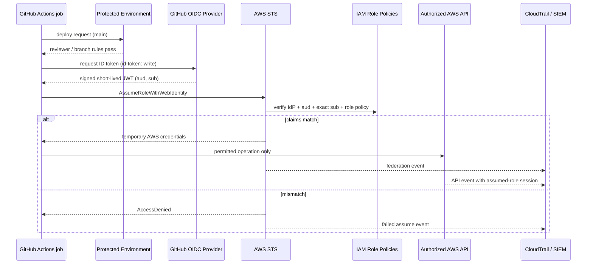

# Weekly SecDevOps Magazine — 2026-08-24

[[Home]]

#security #devops #weekly #deep-dive

> [!summary] 今週の焦点
> **GitHub Actions OIDC Federation で AWS の長期 access key を廃止する**  
> Difficulty signal: **Intermediate**（目安であり参加条件ではない）  
> Lab: **約150分**（offline 設計・検証 90分 + authorized sandbox での実証 60分）

## 1. 前提と測定可能な学習成果

### 必要な知識・ツール・環境

- **Earlier concepts:** IAM の principal / action / resource、least privilege、GitHub Actions の job / step / `permissions`
- **Tools:** `git`, `jq`, AWS CLI v2、GitHub repository（private でもよい）
- **Environment:** 自分が管理する GitHub organization/repository と、検証専用 AWS account または sandbox account
- AWS account がなければ Section 6.1〜6.3 の offline review まで実施できる。実 AWS 部分は必須ではない。

> [!warning] 安全・費用
> 自分が管理する検証環境だけで実施すること。本号は IAM role と STS の確認だけを行い、課金リソースは作らない。ただし組織の CloudTrail / SIEM 転送には既存費用が発生し得る。`AdministratorAccess` は使わない。実在 credential、JWT、AWS account ID をノートや issue に貼らない。

完了時に、次を実証できることを成果とする。

1. 長期 access key と OIDC による短期 credential のリスク差を説明できる。
2. `aud` と `sub` を限定した trust policy を書き、過剰な wildcard を発見できる。
3. workflow の `id-token: write` と AWS permission を別の権限境界として説明できる。
4. `AssumeRoleWithWebIdentity` と後続 API call を CloudTrail で追跡できる。
5. branch / environment / repository の不一致を意図的に起こし、安全に拒否されることを確認できる。

## 2. Production scenario と threat / failure model

SaaS チームは `main` への merge 後、GitHub Actions から AWS staging に deploy している。旧方式では IAM user の `AWS_ACCESS_KEY_ID` / `AWS_SECRET_ACCESS_KEY` を GitHub Secrets に保存していた。rotation は手作業で、漏えいしても失効まで使える。

守る対象は deploy role、staging resource、audit trail。信頼する主体は **特定 repository の特定 GitHub Environment** で承認された workflow だけである。

| Threat / failure | 原因 | 防御 |
|---|---|---|
| 長期 key の流出・再利用 | secret の誤出力、fork、端末コピー | 保存済み AWS key を廃止し、run ごとの短期 credential にする |
| 他 repository から role assume | `sub` が organization wildcard | exact repository / environment に限定 |
| 意図しない branch から deploy | ref 条件や Environment protection がない | protected Environment + deployment branch rule |
| token の別用途への転用 | `aud` 未検証 | `aud = sts.amazonaws.com` を `StringEquals` |
| third-party Action が credential を悪用 | Action pinning / permissions 不備 | commit SHA pin、job 分離、最小 AWS permissions |
| 誤設定で全 deploy 停止 | `sub` 形式不一致、IdP/role account 不一致 | negative test、staging 先行、break-glass 手順 |

## 3. Concept: 認証と認可を二つの policy で分離する

### Foundation

GitHub Actions は job 実行時に GitHub OIDC provider から短寿命 JWT を取得する。AWS STS は JWT の署名、issuer、`aud`、`sub` と role の **trust policy** を評価し、成功した場合だけ一時 credential を返す。credential の実効権限は role の **permissions policy** が決める。

- `id-token: write`: GitHub に OIDC token の発行を求められる、という意味。AWS への書き込み権限ではない。
- Trust policy: **誰が role を assume できるか**。
- Permissions policy: assume 後に **AWS で何ができるか**。
- GitHub Environment protection: deploy 前の reviewer / branch 制限という、AWS 外側の制御。

長期 secret を消しても「安全が自動完成」するわけではない。保存期間のリスクは下がるが、trust policy が広ければ攻撃者は自分の workflow run で正規の短期 credential を取得できる。

### Design trade-offs

1. **branch subject vs Environment subject**  
   branch subject は単純だが、本番承認を表現しにくい。Environment を job に指定すると `sub` は概ね `repo:ORG/REPO:environment:ENVIRONMENT` となり、reviewer と branch rule を重ねられる。本番 deploy には Environment を推奨する。
2. **role を共有するか分けるか**  
   共有 role は管理が少ないが blast radius と監査の曖昧さが増す。staging / production、read / deploy は role を分ける。
3. **workflow 再利用**  
   reusable workflow だけを見て trust を広げない。最終的な token claims と呼び出し元 repository の境界を設計し、GitHub の subject claim 仕様を実 token で確認する。
4. **短い session duration**  
   短いほど盗用時間は減るが、長い deploy が途中で失敗し得る。通常 deploy 時間 + 小さな余裕にする。

## 4. Architecture / workflow



## 5. Guided lab（150分）

### Phase A — setup と設計（0〜25分）

検証用 repository を決め、以下を shell 変数として設定する。実値を Git commit しない。

```bash
export LAB_GH_ORG='example-org'
export LAB_GH_REPO='oidc-lab'
export LAB_AWS_ACCOUNT_ID='111122223333'
export LAB_ROLE_NAME='gha-oidc-staging-readonly'
```

**Checkpoint A:** `LAB_GH_ORG` と `LAB_GH_REPO` が自分の管理対象で、AWS account が production ではない。  
**Expected:** `printf '%s/%s\n' "$LAB_GH_ORG" "$LAB_GH_REPO"` が対象 repository を表示する。

### Phase B — policy を作り offline 検証（25〜60分）

`trust-policy.json` を作る。`production` ではなく検証用 `staging` Environment を使う。

```json
{
  "Version": "2012-10-17",
  "Statement": [{
    "Effect": "Allow",
    "Principal": {
      "Federated": "arn:aws:iam::111122223333:oidc-provider/token.actions.githubusercontent.com"
    },
    "Action": "sts:AssumeRoleWithWebIdentity",
    "Condition": {
      "StringEquals": {
        "token.actions.githubusercontent.com:aud": "sts.amazonaws.com",
        "token.actions.githubusercontent.com:sub": "repo:example-org/oidc-lab:environment:staging"
      }
    }
  }]
}
```

```bash
jq -e '
  .Statement | length == 1 and
  .[0].Action == "sts:AssumeRoleWithWebIdentity" and
  .[0].Condition.StringEquals["token.actions.githubusercontent.com:aud"] == "sts.amazonaws.com" and
  (.[0].Condition.StringEquals["token.actions.githubusercontent.com:sub"] | contains("*") | not)
' trust-policy.json
```

**Expected:** `true`、exit code `0`。  
**Checkpoint B:** `sub` に wildcard がなく、repository と Environment が exact match。

### Phase C — AWS 側を構成（60〜90分）

まず既存 IdP を確認する。存在する場合は重複作成しない。

```bash
aws iam list-open-id-connect-providers \
  --query 'OpenIDConnectProviderList[].Arn' --output text
```

未作成の場合のみ、authorized sandbox で作成する。

```bash
aws iam create-open-id-connect-provider \
  --url https://token.actions.githubusercontent.com \
  --client-id-list sts.amazonaws.com

aws iam create-role \
  --role-name gha-oidc-staging-readonly \
  --assume-role-policy-document file://trust-policy.json \
  --max-session-duration 3600
```

権限は lab 用に caller identity の確認だけで始める。`sts:GetCallerIdentity` は明示 Allow がなくても呼べるため、別の AWS resource を変更する権限を付けない。

```bash
aws iam get-role --role-name gha-oidc-staging-readonly \
  --query 'Role.[Arn,MaxSessionDuration,AssumeRolePolicyDocument]' \
  --output json
```

**Expected:** role ARN、`3600`、exact `aud` / `sub` が返る。  
**Checkpoint C:** role に managed policy が付いていないことを `aws iam list-attached-role-policies` で確認する。

### Phase D — workflow で実証（90〜125分）

GitHub に `staging` Environment を作り、deployment branch を `main` のみに制限する。可能なら required reviewer も設定する。`.github/workflows/oidc-lab.yml`:

```yaml
name: oidc-lab
on:
  workflow_dispatch:

permissions:
  contents: read

jobs:
  identity-check:
    runs-on: ubuntu-latest
    environment: staging
    permissions:
      contents: read
      id-token: write
    steps:
      - name: Configure short-lived AWS credentials
        uses: aws-actions/configure-aws-credentials@<VERIFIED_COMMIT_SHA>
        with:
          role-to-assume: arn:aws:iam::111122223333:role/gha-oidc-staging-readonly
          aws-region: ap-northeast-1
          role-session-name: gha-${{ github.run_id }}-${{ github.run_attempt }}
      - name: Verify identity without printing credentials
        run: aws sts get-caller-identity
```

`<VERIFIED_COMMIT_SHA>` は公式 repository の利用予定 release tag が指す commit SHA に置換する。third-party Action を可変 tag のまま production で使わない。

**Expected:** `Arn` が `arn:aws:sts::111122223333:assumed-role/gha-oidc-staging-readonly/gha-...`。access key / token は出力しない。  
**Checkpoint D:** repository Secrets に AWS access key が存在しない。

### Phase E — negative test と観測（125〜145分）

一時的に trust policy の Environment を `staging-denied` に変えるか、workflow job の Environment を別名にした検証 branch を使う。production policy を直接壊さない。

**Expected:** credential configure step が `AccessDenied` で失敗し、`get-caller-identity` は実行されない。テスト後すぐ exact match に戻す。

CloudTrail Event history または組織の Lake / SIEM で `AssumeRoleWithWebIdentity` を検索し、時刻、role、subject、source IP、error code を記録する。

### Phase F — cleanup（145〜150分）

> [!danger] 破壊的操作
> 次は lab role / provider を削除する。provider は同一 AWS account の別 workload が共有している可能性があるため、**参照 role がないことを確認できない限り provider は削除しない**。

```bash
aws iam delete-role --role-name gha-oidc-staging-readonly

# 共有利用が絶対にない lab 専用 account だけ:
aws iam delete-open-id-connect-provider \
  --open-id-connect-provider-arn \
  arn:aws:iam::111122223333:oidc-provider/token.actions.githubusercontent.com
```

GitHub の lab workflow / Environment も不要なら削除する。CloudTrail の監査記録は削除しない。

## 6. 設定と command の行ごとの説明

### Trust policy

- `Principal.Federated`: この AWS account 内に登録した GitHub OIDC provider の ARN。role と IdP は同じ account に置く。
- `Action`: JWT と引き換えに一時 credential を発行する STS API だけを許可する。
- `StringEquals ...:aud`: token が AWS STS 向けであることを exact match で検証する。
- `StringEquals ...:sub`: `example-org/oidc-lab` の `staging` Environment だけを信頼する。`repo:example-org/*` は避ける。
- `MaxSessionDuration`: role 側の上限。workflow 側で必要ならさらに短い duration を指定する。

### Workflow

- top-level `permissions: contents: read`: default token permission を明示して狭める。
- job-level `id-token: write`: この job だけに token 発行能力を与える。
- `environment: staging`: GitHub の approval / branch protection と OIDC `sub` を結び付ける。
- `uses: ...@<VERIFIED_COMMIT_SHA>`: tag の付け替えによる supply-chain risk を抑える。
- `role-session-name`: run ID と attempt を CloudTrail の session に残し、GitHub run へ追跡しやすくする。
- `get-caller-identity`: secret を表示せず、想定 role であることを検証する。

## 7. Detection / observability と incident drill

### 観測すべき signals

- `AssumeRoleWithWebIdentity` の成功・失敗数、普段と異なる時間帯 / source geography
- `userIdentity.type = WebIdentityUser` の federation event
- 想定外 `subjectFromWebIdentityToken`、role ARN、session name
- 同一 run に見えない大量 session、`AccessDenied` の急増
- assume 後の destructive API（IAM policy change、CloudTrail stop、大量 delete）

注意: OIDC token 自体を log に保存しない。CloudTrail に記録された identity metadata と GitHub run metadata を correlation する。

### 15分 incident drill

1. **Detect:** negative test の失敗 event を見つける。
2. **Triage:** `eventTime`, `recipientAccountId`, role、subject、session name、GitHub run ID を対応付ける。
3. **Contain:** 不正利用が疑われる場合、role trust policy を deny-safe に変更または workflow / Environment を無効化する。既存 session は即時消滅しない点に注意する。
4. **Eradicate:** compromised workflow / Action / repository permission を修正し、不要な長期 key が残っていれば無効化して削除する。
5. **Recover:** staging の known-good SHA から再実行し、expected role と API のみを確認する。
6. **Learn:** detection gap、session duration、Environment reviewer、policy scope を postmortem に残す。

## 8. Common failure modes / unsafe patterns

| Pattern | Result | Remediation |
|---|---|---|
| `sub = repo:ORG/*` | 組織内の別 repo compromise が deploy 権限へ波及 | repo + environment を exact match |
| `aud` 条件なし | token の intended audience を拘束できない | `StringEquals` で `sts.amazonaws.com` |
| AWS key と OIDC の併用を放置 | 古い侵入口が残る | 成功確認後、key inventory→disable→monitor→delete |
| `permissions: write-all` | GitHub token の blast radius 増大 | top-level deny/readonly、job ごとに追加 |
| Action を `@main` / mutable tag 参照 | upstream 変更を無検証実行 | verified full commit SHA pin + update automation |
| prod / staging が同じ role | 誤 deploy と lateral movement | account / role / Environment を分離 |
| claim を log に丸ごと出す | JWT が run log へ漏れる |必要 field だけ metadata で観測 |
| IdP を無条件に削除 | 他 workflow が停止 | account 内の trust policy 参照を調査してから cleanup |

## 9. Verification checklist と lab deliverables

- [ ] `trust-policy.json` は valid JSON で、`aud` と exact `sub` を持つ
- [ ] GitHub Environment は `main` 制限（可能なら reviewer）を持つ
- [ ] `id-token: write` は deploy job のみにある
- [ ] Action は検証済み full commit SHA に pin されている
- [ ] role に不要な managed policy / inline policy がない
- [ ] positive test は expected assumed-role ARN を返す
- [ ] negative test は AWS API 実行前に拒否される
- [ ] CloudTrail event と GitHub run ID を相互追跡できる
- [ ] GitHub Secrets / organization secrets に旧 AWS key が残っていない
- [ ] cleanup または継続利用判断が記録されている

**Deliverables:** (1) redacted trust policy、(2) SHA-pinned workflow、(3) positive / negative test の run URL と結果要約、(4) CloudTrail event の機密情報を除いた観測メモ、(5) cleanup 記録。

## 10. Assessment

1. `id-token: write` は AWS resource への write permission を意味するか。
2. Trust policy の `sub` を repository 単位で限定する理由は何か。
3. GitHub Environment を使うと OIDC 設計にどんな追加防御が得られるか。
4. OIDC 化後も permissions policy の least privilege が必要なのはなぜか。
5. Negative test で最初に確認すべき expected failure は何か。

**Interview / design question:** 40 repository、dev / staging / prod の3環境を持つ組織で、role 数、trust policy、reusable workflow、Environment protection、監査相関をどう設計するか。運用負荷と blast radius の trade-off を説明せよ。

<details>
<summary>解答</summary>

1. いいえ。GitHub OIDC token の発行要求を許すだけで、AWS 権限は trust policy と role permissions policy が決める。
2. GitHub OIDC issuer は多くの利用者で共有されるため、`sub` が広いと管理外 repository の token まで信頼し得るから。
3. branch/tag rule、required reviewer、deployment approval を token 発行前の workflow 文脈に重ねられる。
4. 正規 workflow の侵害・誤動作・third-party Action compromise はあり得る。短期 credential でも権限が広ければ短時間に大きな破壊が可能だから。
5. `AssumeRoleWithWebIdentity` が `AccessDenied` となり、一時 credential が発行されず、後続 AWS API が走らないこと。

Design の要点は prod account / role を分離し、exact repo + Environment subject、中央管理 reusable workflow、prod reviewer、短い session、run ID を含む session name、CloudTrail correlation を標準化すること。全 repo 共有 role は運用が軽い一方 blast radius が大きい。risk tier ごとの role 集約が現実的な妥協になる。

</details>

## 11. Follow-up challenge と次週 prerequisite

**Challenge:** deployment role に session policy を追加し、特定 artifact digest / S3 prefix / ECS service だけを更新できる設計を作る。GitHub artifact attestation または provenance verification を deploy gate の前段に置き、「誰が deploy したか」に「何を deploy したか」を結合する。

**Next-week prerequisite:** CloudTrail management event の JSON 構造、EventBridge event pattern、assumed-role session ARN、GitHub run ID / attempt の意味を理解しておく。次週はこれらを使った federation anomaly detection に進める。

## 12. Current primary references

- [GitHub Docs — Configuring OpenID Connect in Amazon Web Services](https://docs.github.com/en/actions/how-tos/secure-your-work/security-harden-deployments/oidc-in-aws)
- [GitHub Docs — OpenID Connect reference](https://docs.github.com/en/actions/reference/security/oidc)
- [AWS IAM — Configuring a role for GitHub OIDC identity provider](https://docs.aws.amazon.com/IAM/latest/UserGuide/id_roles_create_for-idp_oidc.html#idp_oidc_Create_GitHub)
- [AWS IAM — Identity-provider controls for shared OIDC providers](https://docs.aws.amazon.com/IAM/latest/UserGuide/id_roles_providers_oidc_secure-by-default.html)
- [AWS IAM — Create an OpenID Connect identity provider](https://docs.aws.amazon.com/IAM/latest/UserGuide/id_roles_providers_create_oidc.html)
- [AWS CloudTrail — userIdentity element for web identity federation](https://docs.aws.amazon.com/awscloudtrail/latest/userguide/cloudtrail-event-reference-user-identity.html)
- [aws-actions/configure-aws-credentials — official repository](https://github.com/aws-actions/configure-aws-credentials)
- [OpenID Connect Core 1.0](https://openid.net/specs/openid-connect-core-1_0.html)

> 参照確認日: 2026-08-24。仕様・Action version・GitHub plan ごとの Environment protection availability は導入時に再確認すること。
