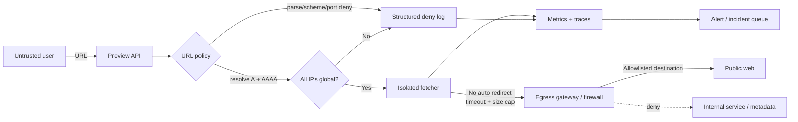

[[Home]]

# Weekly SecDevOps Magazine — 2026-08-31

#security #devops #weekly #deep-dive

> [!warning] 倫理・安全
> 演習対象は、この手順で自分が起動したローカルコンテナだけに限定する。第三者の URL、社内ネットワーク、cloud metadata endpoint を試さない。実 credential は一切使わない。Docker network の作成・削除を行うため、共有ホストでは既存 project 名との衝突を確認する。

## 1. Weekly focus、難易度、前提、学習成果

**焦点:** URL fetch、webhook preview、画像取得などの機能に生じる **Server-Side Request Forgery (SSRF)** を、単一の blacklist ではなく、次の境界で多層防御する。

1. business allowlist
2. 構造化 URL parsing と scheme/port/userinfo の制限
3. DNS 解決後の全 IP 検証
4. redirect の無効化または hop ごとの再検証
5. network egress の deny-by-default
6. structured log、metric、alert

**難易度シグナル:** Intermediate（受講制限ではなく目安）  
**所要時間:** 約150分（Foundation 25分、実装75分、観測・drill 35分、片付け15分）

### 必要知識・tools・環境・以前の概念

- 必要知識: HTTP request/response、DNS A/AAAA、IPv4/IPv6、CIDR、Docker network
- tools: Docker Engine、Docker Compose v2、`curl`、任意で `jq`
- 環境: Linux/macOS/Windows のローカル検証環境。以下は Compose v2 を想定
- 以前の概念: trust boundary、least privilege、allowlist、structured logging、defense in depth
- 不要: cloud account、Kubernetes cluster、実 credential

### 測定可能な学習成果

完了時に、次を証拠付きで実行・説明できる。

- SSRF の **confused deputy** 性と、入力検証だけでは不十分な理由を説明する
- `http/https`、port、userinfo、hostname、解決済み IP、redirect を個別に判定する
- loopback/private/link-local/multicast/unspecified/reserved IP を拒否する unit test を通す
- internal service への request が application layer と network layer の両方で阻止されることを確認する
- deny log と正常 request log を区別し、検知条件と incident 初動を作る

## 2. Production scenario と threat / failure model

SaaS に「指定 URL の OGP preview を生成する」機能がある。API は user が渡した URL を backend worker から取得する。worker は database、admin API、cloud control plane に到達できる network にいる。

### 守る assets

- internal admin API と service-to-service credential
- cloud instance/task metadata、control-plane endpoint
- database/cache の非公開 interface
- worker の availability、egress quota、監査可能性

### trust boundary と攻撃者能力

未認証または低権限 user が URL を入力でき、DNS と redirect destination を制御できると仮定する。攻撃者に server shell や Docker host 権限はない。脅威は「server の到達性・identity を代理利用させる」こと。

| 脅威/失敗 | 例 | 必要な control |
|---|---|---|
| internal address 直指定 | loopback、private、link-local、IPv6 local | 解決済み IP の deny + egress deny |
| hostname の見た目を悪用 | userinfo、末尾 dot、混同しやすい host | 標準 parser、正規化、userinfo 禁止 |
| DNS rebinding / TOCTOU | 検証時と接続時で IP が変わる | connect 対象を検証済み IP に pin、再検証、egress |
| redirect bypass | public URL → internal URL | redirect 無効化、または各 hop を同じ policy で検査 |
| 非 HTTP scheme | `file:` 等 | scheme allowlist |
| resource exhaustion | slow response、大容量 body | timeout、size cap、concurrency/rate limit |
| 観測漏れ | block はするが追跡不能 | reason code、actor、normalized host、request ID |

## 3. 深い概念と設計 trade-off

### Foundation — SSRF は「URL の文字列問題」ではない

URL は `scheme://authority/path?query#fragment` という構造を持つ。`authority` には userinfo、host、port が入り得る。したがって `startsWith("https://trusted.example")` のような文字列比較は、parser が実際に接続する host と security check の解釈差を生む。

さらに hostname は DNS により IP に変換される。`example.invalid` という文字列が安全そうでも、解決結果が `127.0.0.1` や private address なら server の内側へ向かう。**判定対象は入力文字列だけでなく、最終的な接続先 IP と network path** である。

### Practical implementation — policy pipeline

本号の実装順序は固定する。

1. URL 長を制限して parse
2. scheme は `http` / `https` のみ
3. userinfo と fragment を拒否
4. port は 80/443 のみ（業務要件に合わせる）
5. hostname を lowercase、末尾 dot 除去、IDNA ASCII 化
6. business allowlist が使えるなら hostname の完全一致/厳密な subdomain 判定
7. A/AAAA をすべて解決し、1つでも non-global なら拒否
8. redirect は既定で follow しない
9. connect/read timeout、body size、content type、rate を制限
10. network policy でも意図しない宛先を遮断

`ipaddress.is_global` は便利だが、language/runtime の address classification は更新され得る。production では runtime version を固定し、IPv4-mapped IPv6、NAT64、proxy 経由時の意味を test する。

### Production concerns — 重要な trade-off

- **固定 allowlist vs 任意 URL:** 固定 allowlist は最も強い。任意 URL を許す product 要件は防御と運用負荷を大幅に上げる。preview を専用 sandbox fetcher に分離する価値がある。
- **DNS pinning vs reliability:** 検証済み IP へ接続すると rebinding 耐性は上がるが、TLS SNI/Host、CDN failover、proxy と整合させる必要がある。
- **redirect 無効 vs UX:** redirect を止めると短縮 URL や canonical redirect が失敗する。許すなら hop 数を小さくし、各 Location を最初から再検証する。
- **deny-by-default egress vs operations:** security は強いが外部 API 追加の change process が必要。domain-based egress gateway/proxy と ownership を整備する。
- **詳細 log vs privacy:** full URL の query には token や個人情報が入り得る。scheme/host/port、reason、hash 化した path 程度に留める。

## 4. Architecture / workflow



## 5. Guided lab（150分）

### 5.1 Setup（15分）

空の検証 directory で以下を作る。実 credential は入れない。

```text
ssrf-lab/
├── compose.yaml
├── app.py
└── test_policy.py
```

`compose.yaml`:

```yaml
services:
  internal:
    image: python:3.13-alpine
    command: ["python", "-m", "http.server", "8080"]
    networks: [isolated]

  app:
    image: python:3.13-alpine
    working_dir: /work
    volumes: ["./:/work:ro"]
    command: ["python", "app.py"]
    networks: [isolated, public]
    ports: ["127.0.0.1:8000:8000"]

networks:
  isolated:
    internal: true
  public: {}
```

起動:

```bash
docker compose up -d
docker compose ps
curl -fsS http://127.0.0.1:8000/health
```

**Checkpoint A / expected output:** `app` と `internal` が `Up`、health は `ok`。

### 5.2 Policy を実装（45分）

`app.py`:

```python
import ipaddress, json, socket
from http.server import BaseHTTPRequestHandler, HTTPServer
from urllib.parse import parse_qs, urlsplit

ALLOWED_SCHEMES = {"http", "https"}
ALLOWED_PORTS = {80, 443}

def validate_url(raw: str):
    if not raw or len(raw) > 2048:
        raise ValueError("invalid_length")
    u = urlsplit(raw)
    if u.scheme.lower() not in ALLOWED_SCHEMES:
        raise ValueError("scheme_denied")
    if u.username is not None or u.password is not None:
        raise ValueError("userinfo_denied")
    if not u.hostname or u.fragment:
        raise ValueError("host_or_fragment_denied")
    try:
        port = u.port or (443 if u.scheme.lower() == "https" else 80)
    except ValueError:
        raise ValueError("invalid_port")
    if port not in ALLOWED_PORTS:
        raise ValueError("port_denied")
    host = u.hostname.rstrip(".").encode("idna").decode("ascii").lower()
    infos = socket.getaddrinfo(host, port, type=socket.SOCK_STREAM)
    ips = sorted({item[4][0] for item in infos})
    if not ips or any(not ipaddress.ip_address(ip).is_global for ip in ips):
        raise ValueError("non_global_ip")
    return {"scheme": u.scheme.lower(), "host": host, "port": port, "ips": ips}

class Handler(BaseHTTPRequestHandler):
    def log_message(self, *_):
        pass
    def reply(self, status, body):
        data = json.dumps(body).encode()
        self.send_response(status); self.send_header("Content-Type", "application/json")
        self.end_headers(); self.wfile.write(data)
    def do_GET(self):
        if self.path == "/health":
            return self.reply(200, {"status": "ok"})
        raw = parse_qs(urlsplit(self.path).query).get("url", [""])[0]
        try:
            target = validate_url(raw)
            print(json.dumps({"event": "url_allowed", **target}), flush=True)
            self.reply(200, target)  # Labでは実際の外部fetchを行わない
        except (ValueError, socket.gaierror) as e:
            reason = str(e) if isinstance(e, ValueError) else "dns_failed"
            print(json.dumps({"event": "url_denied", "reason": reason}), flush=True)
            self.reply(400, {"error": reason})

HTTPServer(("0.0.0.0", 8000), Handler).serve_forever()
```

再起動して test:

```bash
docker compose restart app
curl -sG --data-urlencode 'url=http://internal:8080/' http://127.0.0.1:8000/check
curl -sG --data-urlencode 'url=file:///etc/passwd' http://127.0.0.1:8000/check
curl -sG --data-urlencode 'url=https://example.com/' http://127.0.0.1:8000/check
docker compose logs app
```

**Checkpoint B / expected output:** internal は `non_global_ip`、`file:` は `scheme_denied`。`example.com` は解決環境が正常なら200と global IP list。外部 DNS が遮断されていれば `dns_failed` でも lab は継続可能。

### 5.3 Unit test（30分）

`test_policy.py`:

```python
import unittest
from unittest.mock import patch
from app import validate_url

def answer(ip, port=80):
    return [(2, 1, 6, "", (ip, port))]

class PolicyTest(unittest.TestCase):
    @patch("app.socket.getaddrinfo", return_value=answer("93.184.216.34"))
    def test_public_https_allowed(self, _):
        self.assertEqual(validate_url("https://example.com/")["host"], "example.com")

    @patch("app.socket.getaddrinfo", return_value=answer("127.0.0.1"))
    def test_loopback_denied(self, _):
        with self.assertRaisesRegex(ValueError, "non_global_ip"):
            validate_url("http://example.test/")

    @patch("app.socket.getaddrinfo", return_value=answer("169.254.169.254"))
    def test_link_local_denied(self, _):
        with self.assertRaisesRegex(ValueError, "non_global_ip"):
            validate_url("http://metadata.test/")

    @patch("app.socket.getaddrinfo", return_value=answer("10.0.0.8"))
    def test_private_denied(self, _):
        with self.assertRaises(ValueError):
            validate_url("http://db.test/")

    def test_userinfo_and_scheme_denied(self):
        for url in ("http://good.test@127.0.0.1/", "file:///etc/passwd"):
            with self.assertRaises(ValueError): validate_url(url)

if __name__ == "__main__": unittest.main()
```

`app.py` の最終行を次のように変更し、import 時に server を起動しないようにする。

```python
if __name__ == "__main__":
    HTTPServer(("0.0.0.0", 8000), Handler).serve_forever()
```

実行:

```bash
docker compose run --rm app python -m unittest -v test_policy.py
```

**Checkpoint C / expected output:** `Ran 5 tests ... OK`。

### 5.4 Network control と verification（20分）

この Compose は `internal` を isolated network のみに置く。ただし `app` も isolated に所属するため、application check を削れば到達できる。これは **network segmentation は topology 設計を伴う** ことを示す。

production では fetcher を internal network から外し、egress gateway のみを経由させる。検証:

```bash
docker compose exec app python -c 'import socket; print(socket.gethostbyname("internal"))'
docker network inspect ssrf-lab_isolated
```

**Checkpoint D:** 現状の app が internal を解決できる事実を記録し、「app を isolated から外す」「internal API を別 network にする」「egress proxy で destination policy を強制」のいずれかを architecture decision record にする。

### 5.5 Cleanup（15分）

> [!warning] 破壊的操作
> 次は現在の Compose project の container と lab network を削除する。必ず `docker compose ps` で対象がこの lab のみか確認する。volume は定義していない。

```bash
docker compose ps
docker compose down
```

expected output は container/network の `Removed`。作成した3ファイルは学習成果物として残してよい。

## 6. Configuration / commands の行別解説

### `compose.yaml` の要点

- `internal:`: 模擬 internal service。公開 port を持たない。
- `image: python:3.13-alpine`: lab の小さな HTTP server。production は digest pin とscanが必要。
- `networks: [isolated]`: internal service を外部接続のない segment のみに所属させる。
- `app:`: URL policy を実行する server。
- `volumes: ["./:/work:ro"]`: source を read-only mount。host file の書換えを抑える。
- `networks: [isolated, public]`: lab 上、internal と public の両方へ到達可能にして application control の意味を観察する。production 推奨形ではない。
- `127.0.0.1:8000:8000`: host の loopback のみに bind し、LAN へ公開しない。
- `internal: true`: 当該 network に外部向け default route を作らない。ただし同一 network 内通信は許可される。

### Python policy の要点

- `urlsplit(raw)`: URL を構造で解釈する。自作 regex parser は避ける。
- `u.username/password`: `trusted.example@127.0.0.1` の表示上の混同を拒否。
- `u.port`: 不正な port 表現が例外になるため明示処理。
- `rstrip(".")` と IDNA: hostname の比較形を正規化。ただし Unicode display は別途 phishing 対策が必要。
- `getaddrinfo`: IPv4/IPv6 を取得。最初の1件だけでなく全件を判定。
- `is_global`: global と分類されない destination を fail closed で拒否。
- response は検証結果だけ: lab が勝手に Internet へ request を送らない安全設計。
- log に raw URL を含めない: query credential や個人情報の二次漏えいを防ぐ。

## 7. Detection / observability signals と incident drill

### Signals

推奨 metric:

- `ssrf_policy_decisions_total{decision,reason}`
- `fetch_dns_answers_count`
- `fetch_redirects_total{hop}`
- `fetch_duration_seconds`
- `fetch_response_bytes`
- egress firewall/proxy deny count

alert 候補:

- 5分間の `non_global_ip` が baseline の5倍、かつ複数 hostname
- 単一 actor から異なる deny reason が短時間に連続
- application の `url_allowed` と firewall の private/link-local deny が同一 request ID で発生（app control bypass の疑い）
- DNS answer の ASN/country 急変、同一 hostname の public↔private 変化

### 20分 incident drill

1. 次を3回実行して模擬 event を作る。

```bash
for i in 1 2 3; do
  curl -sG --data-urlencode 'url=http://internal:8080/' http://127.0.0.1:8000/check
done
docker compose logs --since=5m app
```

2. **Triage:** timestamp、request count、reason、source actor（lab では host）を記録。
3. **Contain:** preview endpoint の rate limit または feature flag disable を想定。production で場当たり的に firewall 全開/全閉しない。
4. **Scope:** 同一 actor、hostname、reason、egress deny、deployment version を横断検索。
5. **Eradicate:** parser/policy bypass なら test case を先に追加し、patch。network path bypass なら fetcher segment を修正。
6. **Recover:** safe canary URL、deny URL、latency/error rate を確認して段階復旧。
7. **Learn:** detection gap、MTTD/MTTR、policy owner、例外期限を記録。

## 8. Common failure modes、unsafe patterns、remediation

| Unsafe pattern / failure | 問題 | Remediation |
|---|---|---|
| URL の prefix/substring 比較 | parser と判定が不一致 | 標準 parser 後に component 単位で比較 |
| RFC1918 IPv4 だけ拒否 | loopback、link-local、IPv6、reserved が残る | IP library で全 resolved address を分類 |
| DNS 検証後に hostname で再接続 | rebinding/TOCTOU | 検証済み IP pin + Host/SNI、egress control |
| redirect 自動追従 | 次 hop が policy を迂回 | 無効化、または全 hop を再検証し上限設定 |
| `http/https` 以外も許可 | local file/別 protocol へ拡大 | scheme allowlist と library feature disable |
| fetcher が internal network に同居 | code bug 1つで内部到達 | 専用 account/namespace/network、deny-by-default egress |
| full URL/body を log | secret/PII 漏えい | redaction、host/reason/request ID のみ |
| timeout/body limit なし | slow/large response による DoS | connect/read/total timeout、stream size cap |
| allowlist の `endswith` | `eviltrusted.example` を誤許可 | 完全一致、または `host == base or host.endswith("."+base)` |
| proxy 設定を無視 | 実接続先と検証前提がずれる | proxy を明示し、gateway 側でも同じ policy |

## 9. Verification checklist と lab deliverables

### Checklist

- [ ] scheme、userinfo、fragment、port の policy が test されている
- [ ] A/AAAA の全結果を判定し、non-global を fail closed で拒否する
- [ ] redirect は無効、または各 hop に同一 policy が適用される
- [ ] connect/read/total timeout と body size cap の production 設計がある
- [ ] fetcher は internal workload network と分離される
- [ ] egress gateway/firewall が private/link-local destination を拒否する
- [ ] raw URL query、response body、credential を log しない
- [ ] allow/deny と network deny を request ID で相関できる
- [ ] exception には owner、理由、expiry、review がある
- [ ] feature disable と復旧手順が runbook 化されている

### Concrete deliverables

1. `compose.yaml`、`app.py`、`test_policy.py`
2. `Ran 5 tests ... OK` の記録
3. `url_denied / non_global_ip` の log sample
4. production architecture の1枚図または ADR（fetcher network と egress policy）
5. alert query 1本と、20分 drill の timeline

## 10. Assessment

### 五問 + interview/design question

1. hostname allowlist を通した後も IP 判定が必要なのはなぜか。
2. redirect 自動追従が SSRF 防御を壊す条件は何か。
3. 1つの DNS answer だけを検証する実装の欠陥は何か。
4. `internal: true` の Docker network が、同じ network 内の service 間通信まで拒否するか。
5. SSRF deny log に raw URL 全体を残すべきでない理由は何か。
6. **Interview/design:** 任意 URL preview を提供しつつ、CDN、redirect、IPv6 を支援する production fetcher を設計せよ。trust boundary、identity、network、DNS、TLS、resource limit、observability、例外運用を説明すること。

<details>
<summary>解答</summary>

1. DNS は時間や回答先により変わり、allowlisted name でも non-global IP を返し得るため。文字列上の host と実接続先は別の security decision である。
2. 最初の URL だけを検査し、`Location` の scheme/host/解決先を再検査せず internal destination へ進む場合。
3. 複数 A/AAAA の未検証 answer が選ばれる、または再解決で異なる IP が選ばれる。全件検証と接続先 pin、network control が必要。
4. 拒否しない。同一 network の通信は可能。外部 gateway がないことと workload 間 isolation は別。
5. query/path に token、署名 URL、PII が含まれ、security log が新たな漏えい源になるため。
6. 期待要素: public API と isolated fetcher の分離、短命 identity、deny-by-default egress gateway、構造 parse、全 A/AAAA 判定、検証済み IP と SNI/Host の整合、hop ごとの redirect 再検証、TLS verification、timeout/size/concurrency cap、content sanitization、request-ID 付き metric/log/trace、exception の期限管理、kill switch と canary recovery。

</details>

## 11. Follow-up challenge と next-week prerequisite

### Optional advanced challenge

実際の fetch を追加する。ただし次をすべて満たすこと。

- redirect 無効、connect/read timeout、最大1 MiB、GET のみ
- DNS 検証済み IP へ接続しつつ、TLS SNI と HTTP Host は検証済み hostname
- response content type allowlist
- request ID と reason code の metric/log
- mock DNS と local test server だけで rebinding/redirect test を再現

Internet への実 request や cloud metadata address を使わず、test double で完結させる。

### Next-week prerequisite

次号候補「container/Kubernetes hardening: egress NetworkPolicy と DNS の安全な許可」に向けて、Kubernetes Namespace、label selector、NetworkPolicy の ingress/egress、CoreDNS の service IP、default deny を復習する。

## 12. Current primary references

- [OWASP Server-Side Request Forgery Prevention Cheat Sheet](https://cheatsheetseries.owasp.org/cheatsheets/Server_Side_Request_Forgery_Prevention_Cheat_Sheet.html) — allowlist、redirect 無効化、application/network layer の多層防御
- [OWASP Top 10:2021 A10 SSRF](https://owasp.org/Top10/2021/A10_2021-Server-Side_Request_Forgery_%28SSRF%29/) — category と prevention guidance
- [RFC 3986: URI Generic Syntax](https://www.rfc-editor.org/rfc/rfc3986.html) — scheme、authority、host、port 等の構造
- [RFC 1918: Address Allocation for Private Internets](https://www.rfc-editor.org/rfc/rfc1918.html) — IPv4 private address blocks
- [Docker Docs: Networking in Compose](https://docs.docker.com/compose/how-tos/networking/) — Compose network、`internal: true`、複数 network の意味

> 参照確認日: 2026-08-31。production 実装では使用 language/runtime、HTTP client、cloud、orchestrator の現行 documentation も合わせて確認する。

