[[Home]]

# Weekly SecDevOps Magazine — 2026-09-07

#security #devops #weekly #deep-dive

> [!warning] 倫理・安全・費用
> 演習は自分が管理するローカルの disposable cluster だけで行う。共有・本番 cluster では実施しない。`kind delete cluster` は指定 cluster を削除するため、名前と current context を必ず確認する。本ラボは cloud resource を作らず、通常は追加課金を生じない。実 credential や Secret は一切使わない。

## 1. Weekly focus、難易度、前提、測定可能な学習成果

**Weekly focus:** Kubernetes workload に `seccompProfile.type: RuntimeDefault` を設定し、Linux syscall attack surface を縮小する。ただし「付ければ安全」で終わらせず、**互換性を事前観測し、拒否を識別し、canary で段階導入し、異常時に manifest を戻す**一連の運用設計に集中する。

**難易度シグナル:** Intermediate（目安であり受講条件ではない）  
**推定時間:** 150分（Foundation 25分、実装70分、production concerns 25分、incident drill 20分、cleanup 10分）

### 必要知識・tools・環境・earlier concepts

- 必要知識: Linux process と syscall、container と host kernel の関係、Pod / Deployment / ReplicaSet
- tools: Docker Engine、`kind`、`kubectl`、POSIX shell。任意で `jq`
- 環境: 2 CPU、4 GB程度を使えるローカル Linux/macOS/Windows。以下は Bash と kind を想定
- earlier concepts: least privilege、defense in depth、deny-by-default、canary、readiness、rollout / rollback、structured event
- 不要: cloud account、実 credential、本番 cluster、特権 container

### 測定可能な学習成果

完了時に、次を証拠付きで説明・実行できる。

1. seccomp が container image ではなく **host kernel に到達する syscall** を制限する仕組みだと説明できる。
2. `RuntimeDefault`、`Unconfined`、`Localhost` の用途と portability の違いを説明できる。
3. Pod-level と container-level `securityContext` の上書き関係を読める。
4. canary Pod で正常系と意図的な deny を区別し、exit code / event / node log の限界を説明できる。
5. Pod Security Standards の Restricted 相当を admission guardrail とし、workload manifest の明示設定と組み合わせられる。
6. seccomp 導入失敗を availability incident として検知し、安全な rollback と再検証を実施できる。

---

## 2. Production scenario と threat / failure model

### Scenario

multi-tenant Kubernetes cluster 上で API workload を運用している。image scanner と non-root 設定は導入済みだが、workload は seccomp を明示していない。アプリの RCE、悪意ある dependency、運用ミスのいずれかで container 内に任意 code execution が起きても、不要な syscall を呼び出せる範囲を縮めたい。一方、いきなり enforcement して正常な native library や agent を壊すことは避けたい。

### 守る対象と境界

- node kernel と同一 node 上の他 workload
- application availability と rollout の安全性
- admission policy の一貫性
- seccomp deny と通常の application error を切り分けるための evidence

### Threat / failure model

| Threat / failure | 例 | seccomp の役割 | seccomp だけでは防げないこと |
|---|---|---|---|
| 不要 syscall の悪用 | exploit が危険な kernel interface を呼ぶ | profile で syscall を deny | 許可 syscall 内の kernel bug、app 脆弱性そのもの |
| profile 未設定 | workload ごとに default がばらつく | manifest / admission で明示 | policy の配布・review 不備 |
| 互換性破壊 | runtime/library が必要な syscall を deny | canary と観測で発見 | 誤った rollout 判断 |
| node 間 drift | runtime default が node/runtime version で異なる | node pool ごとの検証 | 完全な cross-runtime portability |
| custom profile drift | node local file が一部 node にない | DaemonSet等で配布・hash監視 | 配布機構の障害 |
| 検知不能 | process は `EPERM` だけ返し app log が曖昧 | audit/runtime telemetry と相関 | log pipeline 自体の欠損 |
| availability incident | deny により readiness 失敗、restart | rollout guard と rollback | data migration や外部副作用の巻き戻し |

**明示的な非目標:** seccomp は authentication、authorization、network policy、filesystem permission、Linux capabilities、AppArmor/SELinux の代替ではない。compromise の予防を一層強くする control であり、単独の sandbox ではない。

---

## 3. Deep concept と重要な design trade-off

### Foundation — container は host kernel を共有する

container process も最終的には host kernel に syscall を発行する。namespace は見える resource を分離し、cgroup は resource 使用量を制御するが、「どの syscall を発行してよいか」は別の境界である。seccomp-BPF は syscall number と一部 argument を評価し、allow、errno、kill、log 等の action を返す。

攻撃者が application layer で code execution を得ても、必要のない kernel interface を profile で閉じておけば exploit chain の選択肢を減らせる。ただし許可された syscall に脆弱性があれば攻撃は成立し得るため、kernel patch、non-root、capability drop、read-only root filesystem、LSM、NetworkPolicy と重ねる。

### Practical implementation — Kubernetes の3種類

- `RuntimeDefault`: container runtime が用意する既定 profile。導入が容易で node local file を配布しない。runtime/version により内容が変わり得る。
- `Unconfined`: seccomp filter を適用しない。例外として使うほど attack surface が広がる。恒久的な互換性修正として選ばない。
- `Localhost`: node の所定 directory にある custom profile を使う。精密だが、全 node への配布、versioning、hash、rollback が必要。

Pod-level profile は、その Pod 内で profile を個別指定していない container に適用される。container-level profile はその container に対して優先される。init container と ephemeral container も忘れず inventory する。

### Production concerns — 設計 trade-off

1. **RuntimeDefault vs custom allowlist**  
   `RuntimeDefault` は保守負担が小さく、まず baseline を作るのに適する。custom allowlist は狭くできるが、glibc、language runtime、sidecar、kernel 更新で壊れやすい。最初から全 syscall を棚卸しして custom 化するより、RuntimeDefault を全体に適用し、高価値・安定 workload のみ追加 hardening する。

2. **Manifest explicitness vs kubelet defaulting**  
   kubelet の default seccomp 設定に依存すると、manifest review だけで posture が分からず node drift の影響を受ける。明示設定は GitOps diff と admission policy で検証しやすい。node の defaulting は移行補助であり、desired state の唯一の表現にしない。

3. **Fail closed vs availability**  
   Restricted admission で `Unconfined` を拒否すると regression を早く止められる一方、未対応 workload の deploy は失敗する。まず audit/warn、次に限定 namespace の enforce、最後に広げる。緊急例外には owner、期限、ticket、補完 control を必須にする。

4. **`SCMP_ACT_ERRNO` vs kill**  
   errno は application が error handling でき、導入時の診断に向く。kill は明確だが availability 影響と調査難度が増す。runtime default の挙動を前提にせず、利用 runtime の profile と log behavior を確認する。

### Optional advanced challenge の位置づけ

custom profile は「観測した syscall を全部許す」だけでは不十分である。観測期間に rare path が実行されなかった可能性と、侵害された学習環境が危険 syscall を混ぜる可能性がある。機能要件から allow を reviewし、negative test を持ち、profile artifact を署名・version 固定する。

---

## 4. Architecture / workflow diagram

```mermaid
flowchart LR
    G[Git / reviewed manifest] --> A[Admission<br/>Pod Security Restricted]
    A -->|allow| K[kube-apiserver]
    A -->|deny Unconfined / missing policy| X[Rejected event]
    K --> S[Scheduler]
    S --> N[kind worker / kubelet]
    N --> R[container runtime<br/>RuntimeDefault profile]
    R --> P[application process]
    P -->|allowed syscall| L[Linux kernel]
    P -->|blocked syscall| D[EPERM / termination]
    D --> O[app log + Pod status<br/>node audit/runtime signal]
    O --> T[triage: deploy change + syscall + workload]
    T --> C{availability impact?}
    C -->|yes| B[rollback manifest]
    C -->|no| F[fix app or reviewed profile]
    B --> V[SLI / readiness / deny cessation]
    F --> V
```



---

## 5. Guided lab（150分）

### Phase 0 — setup と安全確認（15分）

```bash
docker version --format '{{.Server.Version}}'
kind version
kubectl version --client
kubectl config current-context
kind create cluster --name seccomp-lab
kubectl config use-context kind-seccomp-lab
kubectl create namespace seccomp-lab
```

**行ごとの説明**

1. Docker daemon が使えることを確認する。
2. kind binary の version を記録する。
3. kubectl client を確認する。
4. 変更前 context を可視化する。
5. 専用 cluster を作る。既存 cluster を再利用しない。
6. 対象 context を明示する。
7. 専用 namespace を作り、blast radius を固定する。

**Checkpoint A**

```bash
kubectl cluster-info --context kind-seccomp-lab
kubectl get nodes -o wide
```

期待出力: control-plane node が `Ready`。context が `kind-seccomp-lab` でない場合は中止する。

### Phase 1 — profile の継承と上書きを確認（25分）

`pod-runtime-default.yaml` を作る。

```yaml
apiVersion: v1
kind: Pod
metadata:
  name: runtime-default
  namespace: seccomp-lab
  labels:
    app: seccomp-demo
spec:
  securityContext:
    seccompProfile:
      type: RuntimeDefault
  containers:
    - name: main
      image: python:3.13-alpine@sha256:REPLACE_WITH_VERIFIED_DIGEST
      command: ["python", "-c"]
      args:
        - |
          import time
          print("ready", flush=True)
          time.sleep(3600)
      securityContext:
        allowPrivilegeEscalation: false
        capabilities:
          drop: ["ALL"]
        runAsNonRoot: true
        runAsUser: 65532
```

> [!note] Digest pinning
> `REPLACE_WITH_VERIFIED_DIGEST` は、検証日に信頼する registry から取得して review した multi-arch digest に置換する。タグだけの貼り付けや、このノートに将来古くなる digest を固定掲載することを避ける。例: `docker buildx imagetools inspect python:3.13-alpine`。組織では承認済み mirror と署名検証を使う。

**YAML の行別意図**

- `metadata.namespace`: 実験範囲を専用 namespace に限定。
- Pod の `securityContext.seccompProfile`: 個別指定のない全 container へ baseline を継承。
- digest pin: tag drift を防止。seccomp と supply-chain control は別層。
- `command` / `args`: network server を公開せず、最小の長時間 process を作る。
- `allowPrivilegeEscalation: false`: setuid 等による昇格を抑止。
- `drop: ["ALL"]`: Linux capabilities を既定のまま残さない。
- `runAsNonRoot` / `runAsUser`: root process を避ける。image がこの UID で動くことを事前検証する。

digest を置換後:

```bash
kubectl apply -f pod-runtime-default.yaml
kubectl wait --for=condition=Ready pod/runtime-default -n seccomp-lab --timeout=90s
kubectl get pod runtime-default -n seccomp-lab -o jsonpath='{.spec.securityContext.seccompProfile.type}{"\n"}'
kubectl logs -n seccomp-lab runtime-default
```

**Checkpoint B**

- JSONPath 出力: `RuntimeDefault`
- log 出力: `ready`
- Pod: `Running` / `Ready=True`

失敗した場合は `kubectl describe pod -n seccomp-lab runtime-default` で image pull、UID、scheduling を先に切り分ける。すべてを seccomp のせいにしない。

### Phase 2 — Restricted admission を guardrail にする（25分）

まず warn/audit labels を設定する。

```bash
kubectl label namespace seccomp-lab \
  pod-security.kubernetes.io/warn=restricted \
  pod-security.kubernetes.io/audit=restricted \
  pod-security.kubernetes.io/warn-version=latest \
  pod-security.kubernetes.io/audit-version=latest --overwrite
kubectl get namespace seccomp-lab --show-labels
```

**行ごとの説明**

- `warn`: client へ policy 違反を表示するが作成は止めない。
- `audit`: admission annotation として違反を監査可能にする。
- `*-version=latest`: lab では現在の policy を学ぶ。本番は upgrade review のため minor version pin も検討する。
- `--overwrite`: lab namespace の既存値だけを明示更新する。

次に、意図的に危険な Pod を server-side dry-run する。

```yaml
apiVersion: v1
kind: Pod
metadata:
  name: unsafe-unconfined
  namespace: seccomp-lab
spec:
  containers:
    - name: main
      image: busybox:1.37
      command: ["sh", "-c", "sleep 30"]
      securityContext:
        privileged: true
        seccompProfile:
          type: Unconfined
```

```bash
kubectl apply --dry-run=server -f unsafe-unconfined.yaml
```

期待: Restricted 違反の warning。dry-run のため Pod は永続作成されない。

確認後、enforce を有効化する。

```bash
kubectl label namespace seccomp-lab \
  pod-security.kubernetes.io/enforce=restricted \
  pod-security.kubernetes.io/enforce-version=latest --overwrite
kubectl apply --dry-run=server -f unsafe-unconfined.yaml
```

**Checkpoint C:** 2回目は `Forbidden` となり、privileged、allowPrivilegeEscalation、capabilities、runAsNonRoot、seccomp 等の違反理由が示されること。拒否は正常な preventive signal である。

### Phase 3 — seccomp deny を安全に発生させる（30分）

Kubernetes node は Docker container なので、host を変更せず node 内の runtime default を検証できる。まず対象 node 名を固定する。

```bash
LAB_NODE=$(kubectl get nodes -o jsonpath='{.items[0].metadata.name}')
test "$LAB_NODE" = "seccomp-lab-control-plane"
docker exec "$LAB_NODE" sh -c 'grep Seccomp: /proc/1/status'
```

- `LAB_NODE`: この lab の node 名だけを変数化する。
- `test`: 想定外の container への `docker exec` を防ぐ safety check。
- `/proc/1/status`: node container PID 1 の seccomp mode を参考確認する。値だけで Pod profile の全内容は分からない。

次に seccomp tutorial 用の **専用 custom profile** を node 内の kubelet profile directory に作る。ここでは `mkdir` と profile file 作成が node container 内に変更を加える。cluster を削除すれば回収できる。

```bash
docker exec "$LAB_NODE" mkdir -p /var/lib/kubelet/seccomp/profiles
docker exec -i "$LAB_NODE" sh -c 'dd of=/var/lib/kubelet/seccomp/profiles/deny-uname.json status=none' <<'EOF'
{
  "defaultAction": "SCMP_ACT_ALLOW",
  "architectures": ["SCMP_ARCH_X86_64", "SCMP_ARCH_X86", "SCMP_ARCH_X32"],
  "syscalls": [
    {
      "names": ["uname"],
      "action": "SCMP_ACT_ERRNO"
    }
  ]
}
EOF
```

> [!warning] Architecture
> 上の architecture list は x86_64 lab 用。ARM64 host では公式 Kubernetes seccomp tutorial の architecture 例と runtime support を確認して `SCMP_ARCH_AARCH64` 等へ調整する。production profile をこの例から流用しない。

`deny-uname.yaml`:

```yaml
apiVersion: v1
kind: Pod
metadata:
  name: deny-uname
  namespace: seccomp-lab
spec:
  restartPolicy: Never
  containers:
    - name: test
      image: busybox:1.37
      command: ["sh", "-c"]
      args: ["uname -a; rc=$?; echo syscall_rc=$rc; exit $rc"]
      securityContext:
        allowPrivilegeEscalation: false
        capabilities:
          drop: ["ALL"]
        runAsNonRoot: true
        runAsUser: 65532
        seccompProfile:
          type: Localhost
          localhostProfile: profiles/deny-uname.json
```

```bash
kubectl apply -f deny-uname.yaml
kubectl wait --for=jsonpath='{.status.phase}'=Failed pod/deny-uname -n seccomp-lab --timeout=90s || true
kubectl logs -n seccomp-lab deny-uname
kubectl get pod deny-uname -n seccomp-lab \
  -o jsonpath='{.status.containerStatuses[0].state.terminated.exitCode}{"\n"}'
```

**Checkpoint D**

- `uname` は `Operation not permitted` 相当を返す。
- `syscall_rc` は非0。
- container exit code は非0、Pod phase は `Failed`。

これは可用性を壊す profile を意図的に入れた negative test である。`kubectl logs` だけでは seccomp 起因と断定できない環境もある。次の evidence を相関する。

```bash
kubectl describe pod deny-uname -n seccomp-lab
docker exec "$LAB_NODE" sh -c 'journalctl -k --since "10 minutes ago" 2>/dev/null | tail -n 50' || true
docker logs "$LAB_NODE" --since 10m 2>&1 | tail -n 80
```

期待: app の errno、Pod termination、同時刻の node/runtime log を得る。ただし default action が `ERRNO` の場合、kernel audit log が必ず出るとは限らない。この「absence of evidence」を検知成功と誤認しない。

### Phase 4 — rollout / incident drill（20分）

架空の本番状況: seccomp 変更直後、canary の readiness が落ちた。以下を声に出して実施・記録する。

1. **Detect:** deploy 時刻、Ready replica、5xx、restart、deny signal の時系列を確認。
2. **Scope:** 変更 revision、影響 namespace、node pool、sidecar/init container を特定。
3. **Contain:** deploy を停止。profile を安易に `Unconfined` にせず、直前の reviewed manifest へ戻す。
4. **Recover:** Ready replica と user-facing SLI が baseline に戻ったことを確認。
5. **Preserve:** failed Pod の describe/log、manifest diff、profile hash、node/runtime version を保存。
6. **Learn:** 必要 syscall か、不要 code path か、runtime drift かを分類し、fix owner と期限を置く。

lab では failed Pod を削除し、baseline Pod が健全なことを再確認する。

```bash
kubectl delete pod deny-uname -n seccomp-lab
kubectl wait --for=condition=Ready pod/runtime-default -n seccomp-lab --timeout=60s
kubectl logs -n seccomp-lab runtime-default
```

期待: baseline は `Ready` で `ready` を保持。**復旧は「危険な設定を外した」ではなく、必要 control を維持した既知の良好状態へ戻すこと**である。

### Cleanup（10分）

> [!danger] 削除前確認
> 次は `seccomp-lab` という kind cluster 全体を削除する。別名 cluster や共有 cluster に置き換えない。

```bash
kubectl config current-context
test "$(kubectl config current-context)" = "kind-seccomp-lab"
kind delete cluster --name seccomp-lab
```

期待: `Deleted nodes: ["seccomp-lab-control-plane"]` 相当。その cluster 内の Pod、namespace、node local profile は回収される。作成したローカル YAML は成果物として残すか、内容確認後に recoverable な方法で片付ける。

---

## 6. Configuration / commands の読み解き

### 安全な baseline

```yaml
securityContext:                 # Pod 全体の既定値
  seccompProfile:                # syscall filtering の指定
    type: RuntimeDefault         # runtime が管理する既定 profile
containers:
  - name: app
    securityContext:             # container 固有の process security
      allowPrivilegeEscalation: false  # no_new_privs 相当を要求
      capabilities:
        drop: ["ALL"]            # capability の暗黙付与を避ける
      runAsNonRoot: true         # UID 0 を拒否
      readOnlyRootFilesystem: true # 書込み先を volume に限定
```

これらは互いの代替ではない。seccomp は syscall surface、capability は privileged operation、UID は discretionary access、read-only root は filesystem mutation をそれぞれ制限する。

### 危険な例

```yaml
securityContext:
  privileged: true
  seccompProfile:
    type: Unconfined
```

`privileged` は広範な host 能力を与え、`Unconfined` は syscall filter を外す。debug のためでも production manifest に一時 commit しない。必要なら隔離した break-glass environment、期限付き承認、session recording、network isolation を用いる。

### 検証コマンド

```bash
kubectl get pods -n seccomp-lab -o json | \
  jq -r '.items[] | [.metadata.name, (.spec.securityContext.seccompProfile.type // "MISSING")] | @tsv'
```

- `kubectl ... -o json`: shell 表示ではなく構造化 data を取得。
- `.items[]`: 各 Pod を走査。
- `// "MISSING"`: Pod-level 指定がない場合を可視化。ただし container-level 指定も別途走査が必要。
- `@tsv`: review 用一覧にする。

本番 inventory では regular / init / ephemeral containers の各 `securityContext.seccompProfile` と Pod-level inheritance を正規化して評価する。

---

## 7. Detection / observability signals と incident drill

### 収集すべき signals

| Layer | Signal | 意味 | 注意点 |
|---|---|---|---|
| Admission | Restricted deny count、reason、namespace、workload identity | unsafe manifest が入口で止まった | 拒否増加は攻撃だけでなく migration failure かもしれない |
| Kubernetes | `FailedCreate`、restart、Ready replica、rollout timeout | enforcement の availability 影響 | seccomp 固有とは限らない |
| Application | `EPERM`、startup failure、feature-specific error | syscall deny の利用者影響 | generic permission error と混同可能 |
| Node/runtime | seccomp/audit event、container ID、syscall、PID | kernel 境界の裏付け | distro、action、audit 設定で出力差がある |
| Change | Deployment revision、manifest diff、profile hash、node image/runtime version | 原因変更との相関 | mutable profile は証拠を壊す |

### Alert の例

- deploy 後10分以内に `Ready replicas < desired` が5分継続し、同一 workload で `EPERM` / seccomp event が増加 → page
- Restricted admission deny が通常値の5倍、同一 CI principal に集中 → security triage
- node pool 間で同一 workload の成功率が分かれる → runtime/default profile drift を疑う
- seccomp profile file hash が Git 管理値と不一致 → configuration integrity incident

### Drill inject

「09:12、release `2026.09.07-1` の canary だけが CrashLoop。app log は `operation not permitted`。09:08に node image 更新、09:10に seccomp manifest 変更がある。」

回答に含めるもの:

1. user impact と SLI を先に確認する。
2. 2つの change を timeline に置き、同じ node pool の旧/new node で再現差を見る。
3. failed container の ID、profile type/hash、runtime version、exit code を採取する。
4. canary promotion を止め、直前 revision へ rollback。
5. `Unconfined` を恒久適用せず、isolated reproduction で必要 syscall を判定。
6. recovery 条件を Ready だけでなく success rate、latency、deny cessation で定義する。

---

## 8. Common failure modes、unsafe patterns、remediation

| Failure / unsafe pattern | なぜ危険か | Remediation |
|---|---|---|
| 「container だから syscall は隔離済み」 | kernel は共有される | seccomp + capability + non-root + LSM + patching |
| 全 workload を一度に enforce | hidden dependency で広域障害 | inventory → warn/audit → canary → staged enforce |
| 問題時に即 `Unconfined` | attack surface を恒久拡大 | reviewed rollback、期限付き例外、補完 control |
| Pod-level だけ確認 | container-level override、init/ephemeral を見逃す | 全 container 種別を正規化して policy 評価 |
| custom profile を手作業配布 | node drift と scheduling failure | versioned artifact、DaemonSet/operator、hash monitoring |
| syscall number/name を闇雲に allow | profile が実質無制限になる | 機能要件、negative test、security review |
| audit event がないので deny なしと判断 | action/host 設定で記録されない | app errno、exit、runtime、audit pipeline health を相関 |
| `latest` policy を無検証で本番適用 | cluster upgrade で挙動変更 | Kubernetes minor version pin と upgrade test |
| mutable image tag のみ |再現性がない | verified digest と provenance を使用 |
| seccomp を EDR とみなす | prevention policy であり full telemetry ではない | runtime detection、audit、SIEM を別途設計 |

---

## 9. Verification checklist と concrete deliverables

### Checklist

- [ ] context が `kind-seccomp-lab` であることを変更前に確認した
- [ ] RuntimeDefault Pod が Ready となり `ready` を出力した
- [ ] Pod-level profile の継承と container-level override を説明できる
- [ ] Restricted warn/audit と enforce の差を dry-run で確認した
- [ ] unsafe Pod が `Forbidden` になった
- [ ] `uname` deny の非0 exit と Pod Failed を確認した
- [ ] app / Pod / node-runtime evidence の違いを記録した
- [ ] `Unconfined` ではなく baseline へ戻して recovery を確認した
- [ ] production rollout の SLI、canary、rollback criteria を定義した
- [ ] cluster 名を確認して cleanup した

### Deliverables

1. `pod-runtime-default.yaml`
2. `unsafe-unconfined.yaml`
3. `deny-uname.yaml`
4. `evidence.md`: command、時刻、期待値、実出力、差異
5. `rollout-plan.md`: 対象 namespace、canary 比率、promotion / rollback 条件、owner
6. `exceptions.yaml`: 例外が必要なら owner、reason、expiry、ticket、compensating controls（実 secret 禁止）
7. `profile.sha256`: custom profile を発展させる場合の integrity evidence

---

## 10. Assessment（5問 + interview/design question）

1. seccomp と Linux capabilities は何を別々に制御するか。
2. `RuntimeDefault` が全 node/runtime で完全に同じ profile だと仮定してはいけない理由は何か。
3. Restricted admission をいきなり全 namespace で enforce しない理由と、安全な移行順を述べよ。
4. application log の `EPERM` だけで seccomp incident と断定できない理由は何か。
5. custom allowlist を syscall trace から自動生成してそのまま production 採用するのが危険な理由を2つ挙げよ。

**Interview / design question:** 500 workload、3 node pool、2 container runtime version がある cluster へ RuntimeDefault を無停止導入する計画を設計せよ。inventory、admission、canary、signals、exception、rollback、node upgrade との順序を含めること。

<details>
<summary>解答例を表示</summary>

1. seccomp は syscall の呼出しを filter し、capabilities は root 権限を細分化した privileged operation の可否を制御する。両方が必要。
2. RuntimeDefault は OCI/Kubernetesが完全な syscall 集合を固定するものではなく、container runtime と version が profile を提供するため。node image 更新でも差が出得る。
3. hidden dependency による広域 deploy failure を避けるため。inventory → dry-run/test → warn/audit → 低risk namespace / canary enforce → signal 確認 → 段階拡大。
4. filesystem permission、capability、LSM、read-only mount、通常の app 権限不足でも `EPERM` は起きる。deploy diff、profile、container exit、node/runtime/audit signal と時刻を相関する。
5. 観測期間に rare/error path が実行されず必要 syscall を欠く可能性がある。また compromised/汚染された学習実行が不要な危険 syscall を allowlist に混ぜる可能性がある。
6. 設計例: 全 container 種別と明示/継承状態を inventory。runtime/node pool ごとの representative workload で test。PSS warn/audit から開始。service owner ごとに canary 1–5%、Ready/error/latency/restart/seccomp signal を監視。SLO breach か seccomp 相関 error で promotion stop と reviewed manifest rollback。例外は期限・owner・補完 control 付き。node/runtime upgrade と policy rollout を同時に行わず、profile behavior の差を node pool ごとに検証してから enforce 範囲を広げる。

</details>

---

## 11. Follow-up challenge と next-week prerequisite

### Optional advanced challenge

`strace` または authorized runtime tracing を隔離環境で使い、単一の安定した CLI workload の syscall inventory を作る。その後:

1. RuntimeDefault と観測集合の差を分類する。
2. custom profile を Git 管理し、schema validation と negative test を CI に追加する。
3. node 配布 artifact に version と SHA-256 を付ける。
4. 1つの syscall を意図的に deny し、alert と rollback SLO を検証する。
5. rare path を含む integration test が不足していないか review する。

`strace` の取得は機密 data を含む可能性がある。共有/本番 workload では無断で使わず、process argument と file path の保存・閲覧権限を制限する。

### Next-week prerequisite

- Kubernetes admission request と policy evaluation の基本
- label selector、namespace boundary、exception lifecycle
- GitOps diff と CI policy test
- seccomp の RuntimeDefault / Localhost / Unconfined の違い

次週候補は **policy-as-code による期限付き例外管理**。特定製品の文法より、deny rule、test fixture、exception expiry、audit evidence の設計を主題にする。

---

## 12. Current primary references

2026-09-07時点。実環境の Kubernetes / runtime version に対応する documentation を選び、upgrade 前に差分を再確認する。

1. Kubernetes Documentation, **Restrict a Container's Syscalls with seccomp**  
   https://kubernetes.io/docs/tutorials/security/seccomp/
2. Kubernetes Documentation, **Pod Security Standards**  
   https://kubernetes.io/docs/concepts/security/pod-security-standards/
3. Kubernetes API Reference, **SeccompProfile**  
   https://kubernetes.io/docs/reference/generated/kubernetes-api/v1.35/#seccompprofile-v1-core
4. Kubernetes Documentation, **Configure a Security Context for a Pod or Container**  
   https://kubernetes.io/docs/tasks/configure-pod-container/security-context/
5. Docker Documentation, **Seccomp security profiles for Docker**  
   https://docs.docker.com/engine/security/seccomp/
6. Open Container Initiative Runtime Specification, **Linux seccomp configuration**  
   https://github.com/opencontainers/runtime-spec/blob/main/config-linux.md#seccomp
7. Linux kernel documentation, **Seccomp BPF**  
   https://www.kernel.org/doc/html/latest/userspace-api/seccomp_filter.html
8. Kubernetes Enhancement Proposal 2413, **Seccomp by default**  
   https://github.com/kubernetes/enhancements/tree/master/keps/sig-node/2413-seccomp-by-default

### 今週の一文

> seccomp の価値は「設定した」という事実ではなく、必要な動作を保ったまま kernel attack surface を減らし、拒否と障害を観測し、安全に戻せる運用にある。
