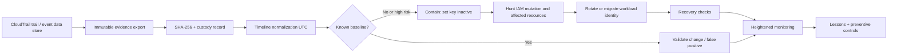
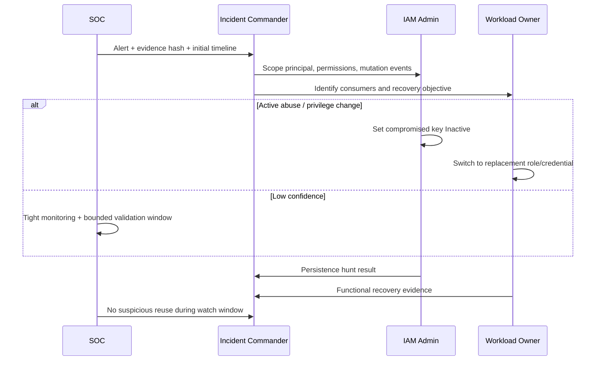

# Weekly SecDevOps Magazine — 2026-09-14

[[Home]]

#security #devops #weekly #deep-dive

> [!warning] 倫理・安全・費用
> この演習はローカルに作る**合成 CloudTrail event**だけを扱う。実 account、実 access key、実 account ID、実 IP address をノートや共有ログへ貼らない。第三者の AWS account を調査しない。本番で key を無効化・削除したり policy を変更したりすると workload が停止し得るため、所有者確認、変更承認、break-glass 経路、rollback 計画なしに実行しない。CloudTrail Lake、Athena、長期ログ保存、SIEM 転送は課金対象になり得る。実環境では料金を確認すること。

## 1. Weekly focus / difficulty / prerequisites / outcomes

### 今週の焦点

**AWS IAM access key 漏えいを想定し、CloudTrail の証拠から影響範囲を限定し、依存 workload を壊さずに封じ込め、credential rotation と監視強化まで完了する。**

- Difficulty signal: **Intermediate** — 目安であり参加条件ではない
- Lab time: **約150分**
- 対象 criterion: **Incident response**
- 学習レイヤー: Foundation → Practical implementation → Production concerns → Optional advanced challenge

### 必要な知識

- IAM の user / role / temporary credential / policy の違い
- access key ID は識別子、secret access key は認証秘密であること
- CloudTrail event の `eventTime`, `eventSource`, `eventName`, `userIdentity`, `sourceIPAddress`
- shell の pipe と `jq` の filter
- incident response の「検知・分析・封じ込め・根絶・復旧・改善」

### 必要な tools / environment

- Linux / macOS のローカル shell
- `bash`, `jq`, `sha256sum`（macOS は `shasum -a 256` でもよい）
- 任意: `git`
- AWS account、AWS CLI、credential は**不要**
- earlier concepts: least privilege、credential rotation、ログの完全性、UTC timeline

### 測定可能な learning outcomes

終了時に次を実演できること。

1. access key ID を軸に合成 CloudTrail event を抽出し、UTC timeline を作る。
2. benign baseline と suspicious behavior を、IP だけに依存せず5つ以上の signal で比較する。
3. 「即削除」ではなく disable → dependency validation → rotate → delete の順序を説明する。
4. containment 前後で証拠 hash を検証し、原本と作業コピーを分離する。
5. recovery criteria と監視 query を定義し、incident record を成果物として残す。

---

## 2. Production scenario と threat / failure model

### Scenario

夜間、長期 access key を使用する legacy backup job に対して、普段と異なる region から `ListBuckets`、`GetCallerIdentity`、`CreateAccessKey`、`AttachUserPolicy` の試行が短時間に観測された。既知の NAT IP からの定期 `PutObject` も同じ key で継続している。

SOC は「key が漏れた可能性」を high severity と判断した。しかし key を直ちに削除すれば backup と restore test が停止する。攻撃者が追加 credential や persistence を作った可能性もあるため、単純な rotation だけでは不十分である。

### 守るもの

- backup bucket 内の data と restore capability
- IAM policy / role / user の integrity
- CloudTrail 証拠と incident timeline
- backup job の availability
- account 内の他 workload への lateral movement 防止

### 想定 threat

1. CI log、developer machine、誤 commit のいずれかから long-lived secret が漏えい。
2. 攻撃者が key の有効性を `sts:GetCallerIdentity` で確認。
3. discovery と privilege escalation を試行。
4. 新しい access key、login profile、policy attachment、role trust policy 改変で persistence を狙う。
5. object の read / exfiltration または破壊を試行。

### Failure model

- **False positive:** corporate VPN / NAT change、job image 更新、region failover。
- **Incomplete visibility:** management event だけあり、S3 data event が有効でない。
- **Self-inflicted outage:** key の consumer inventory がないまま disable。
- **Evidence contamination:** 原本 JSON を整形・編集し、hash を残していない。
- **Persistence missed:** 問題 key の利用だけを見て IAM mutation を見落とす。
- **Clock ambiguity:** local time と UTC が混在し、順序を誤る。

> [!important]
> `sourceIPAddress` の変化は有用な signal だが、単独では侵害を証明しない。API sequence、principal、region、user agent、error、resource、baseline、変更履歴を組み合わせる。

---

## 3. Deep concepts と design trade-offs

### Foundation: credential と session を分けて考える

IAM user の access key は長期 credential である。対して role assumption で得る STS credential は期限付きで、CloudTrail では session issuer や session context が判断材料になる。長期 key を disable すると、その key での**新しい署名 request**は拒否されるが、別に作られた credential、既存 console session、別 role session、resource-based persistence まで自動で消えるとは限らない。

したがって調査単位は「漏れた文字列」ではなく次の graph で捉える。

- credential → principal
- principal → permissions
- principal → API events
- API events → affected resources
- mutation events → newly created identities / policies / keys
- workload → credential dependency

### Evidence preservation

最初の snapshot に hash を付け、read-only 原本として保存する。調査 filter や timestamp 正規化は作業コピーまたは派生 artifact に対して行う。hash は「内容が正しい」ことではなく、**取得後に変わっていない**ことを示す。

必要な provenance:

- 誰が、いつ、どの query / export で取得したか
- query time range と timezone
- CloudTrail trail / event data store の範囲
- data event が収集されていたか
- 保存先、hash algorithm、hash value

### Containment の速度と availability の trade-off

**Immediate disable** は blast radius を早く止める一方、consumer が不明なら outage を起こす。**Staged containment** は dependency を確認して代替 credential を配布してから無効化するが、その間 exposure window が続く。

判断軸:

- active destructive API、privilege escalation、exfiltration の兆候がある → availability より封じ込めを優先
- read-only で false positive の可能性が高い →短い調査 window と監視強化を置く
- safety-critical workload → isolation policy、resource policy、network control で機能を狭めつつ credential を交換

推奨 default は、**疑わしい IAM mutation があるなら key を inactive にし、既知 consumer は別 principal へ切り替える**。単に新 key を同じ user に追加するだけでは、過剰 policy と長期 credential 依存が残る。

### Rotation と migration の違い

- Rotation: 同じ trust model の credential を交換する。
- Migration: static key から instance profile、ECS task role、IRSA、GitHub OIDC 等へ移る。

incident recovery では一時的 rotation が必要でも、再発防止は migration まで計画する。二本の key を長期間並行稼働させると、どちらが使われているか分からなくなる。

### Detection design の trade-off

- exact IP allowlist: 単純だが NAT / remote work / provider change で壊れやすい。
- rare API detection: 未使用 API には強いが、初回の正当運用を誤検知。
- behavior sequence: `GetCallerIdentity` → enumeration → IAM mutation の連鎖は強いが correlation が必要。
- deny guardrail: 強力だが emergency operation も阻害し得る。
- S3 data events: object-level 可視性が上がるが volume と cost が増える。

---

## 4. Architecture / workflow diagram



### 意思決定 workflow



---

## 5. Guided lab（約150分）

### Phase 0 — Setup と safety check（15分）

> [!warning]
> cleanup は後述の一時 directory だけを削除する。実 AWS CLI profile は使わない。shell に credential が設定されていても、本ラボでは `aws` command を実行しない。

```bash
command -v jq
command -v sha256sum
LAB_DIR="$(mktemp -d -t secdevops-ir-XXXXXX)"
chmod 700 "$LAB_DIR"
cd "$LAB_DIR"
printf '%s\n' "$PWD"
```

**Expected output:** `jq` と `sha256sum` の path、および `.../secdevops-ir-XXXXXX` 形式の専用 directory。

**Checkpoint 0:** `PWD` の末尾が `secdevops-ir-` で始まる一時 directory である。

合成 event を作る。

```bash
cat > cloudtrail-original.json <<'JSON'
{
  "Records": [
    {"eventTime":"2026-09-14T00:01:02Z","eventSource":"s3.amazonaws.com","eventName":"PutObject","awsRegion":"ap-northeast-1","sourceIPAddress":"203.0.113.10","userAgent":"aws-sdk-go-v2 backup-agent/4.2","userIdentity":{"type":"IAMUser","principalId":"AIDASYNTHETIC01","arn":"arn:aws:iam::111122223333:user/legacy-backup","accessKeyId":"AKIASYNTHETIC01"},"requestParameters":{"bucketName":"example-backup","key":"daily/manifest.json"},"responseElements":null},
    {"eventTime":"2026-09-14T00:07:11Z","eventSource":"sts.amazonaws.com","eventName":"GetCallerIdentity","awsRegion":"us-east-1","sourceIPAddress":"198.51.100.77","userAgent":"aws-cli/2.synthetic","userIdentity":{"type":"IAMUser","principalId":"AIDASYNTHETIC01","arn":"arn:aws:iam::111122223333:user/legacy-backup","accessKeyId":"AKIASYNTHETIC01"},"requestParameters":null,"responseElements":null},
    {"eventTime":"2026-09-14T00:07:19Z","eventSource":"s3.amazonaws.com","eventName":"ListBuckets","awsRegion":"us-east-1","sourceIPAddress":"198.51.100.77","userAgent":"aws-cli/2.synthetic","userIdentity":{"type":"IAMUser","principalId":"AIDASYNTHETIC01","arn":"arn:aws:iam::111122223333:user/legacy-backup","accessKeyId":"AKIASYNTHETIC01"},"requestParameters":null,"responseElements":null},
    {"eventTime":"2026-09-14T00:08:03Z","eventSource":"iam.amazonaws.com","eventName":"CreateAccessKey","awsRegion":"us-east-1","sourceIPAddress":"198.51.100.77","userAgent":"aws-cli/2.synthetic","userIdentity":{"type":"IAMUser","principalId":"AIDASYNTHETIC01","arn":"arn:aws:iam::111122223333:user/legacy-backup","accessKeyId":"AKIASYNTHETIC01"},"requestParameters":{"userName":"legacy-backup"},"errorCode":"AccessDenied","errorMessage":"synthetic denial"},
    {"eventTime":"2026-09-14T00:08:44Z","eventSource":"iam.amazonaws.com","eventName":"AttachUserPolicy","awsRegion":"us-east-1","sourceIPAddress":"198.51.100.77","userAgent":"aws-cli/2.synthetic","userIdentity":{"type":"IAMUser","principalId":"AIDASYNTHETIC01","arn":"arn:aws:iam::111122223333:user/legacy-backup","accessKeyId":"AKIASYNTHETIC01"},"requestParameters":{"userName":"legacy-backup","policyArn":"arn:aws:iam::aws:policy/AdministratorAccess"},"errorCode":"AccessDenied","errorMessage":"synthetic denial"},
    {"eventTime":"2026-09-14T00:10:00Z","eventSource":"s3.amazonaws.com","eventName":"PutObject","awsRegion":"ap-northeast-1","sourceIPAddress":"203.0.113.10","userAgent":"aws-sdk-go-v2 backup-agent/4.2","userIdentity":{"type":"IAMUser","principalId":"AIDASYNTHETIC01","arn":"arn:aws:iam::111122223333:user/legacy-backup","accessKeyId":"AKIASYNTHETIC01"},"requestParameters":{"bucketName":"example-backup","key":"daily/chunk-001"},"responseElements":null},
    {"eventTime":"2026-09-14T00:11:20Z","eventSource":"ec2.amazonaws.com","eventName":"DescribeInstances","awsRegion":"us-west-2","sourceIPAddress":"198.51.100.77","userAgent":"aws-cli/2.synthetic","userIdentity":{"type":"IAMUser","principalId":"AIDASYNTHETIC01","arn":"arn:aws:iam::111122223333:user/legacy-backup","accessKeyId":"AKIASYNTHETIC01"},"requestParameters":null,"responseElements":null},
    {"eventTime":"2026-09-14T00:15:00Z","eventSource":"s3.amazonaws.com","eventName":"GetObject","awsRegion":"ap-northeast-1","sourceIPAddress":"203.0.113.20","userAgent":"restore-tester/1.0","userIdentity":{"type":"AssumedRole","principalId":"AROASYNTH:restore-test","arn":"arn:aws:sts::111122223333:assumed-role/restore-test/restore-test","accessKeyId":"ASIASYNTHETIC02"},"requestParameters":{"bucketName":"example-backup","key":"daily/manifest.json"},"responseElements":null}
  ]
}
JSON

jq empty cloudtrail-original.json
sha256sum cloudtrail-original.json | tee evidence.sha256
chmod 400 cloudtrail-original.json
cp cloudtrail-original.json cloudtrail-working.json
chmod 600 cloudtrail-working.json
```

**Expected output:** `jq empty` は無出力で exit 0。`evidence.sha256` に64桁の hash と filename が出る。

### Phase 1 — Triage と timeline（30分）

対象 key の event を UTC の時系列にする。

```bash
TARGET_KEY="AKIASYNTHETIC01"
jq --arg key "$TARGET_KEY" '
  .Records
  | map(select(.userIdentity.accessKeyId == $key))
  | sort_by(.eventTime)
  | .[]
  | [
      .eventTime,
      .eventSource,
      .eventName,
      .awsRegion,
      .sourceIPAddress,
      (.errorCode // "Success")
    ]
  | @tsv
' cloudtrail-working.json | tee timeline.tsv
```

**Expected output:** 7行。`00:07:11Z` 以降、`198.51.100.77` から複数 region / service の activity と2件の `AccessDenied` が見える。

**Checkpoint 1:** `wc -l timeline.tsv` が `7`。最初と最後の対象時刻を incident record に記録する。

baseline を集計する。

```bash
jq -r '
  .Records
  | group_by(.userIdentity.accessKeyId)
  | .[]
  | [
      .[0].userIdentity.accessKeyId,
      (length|tostring),
      ([.[].sourceIPAddress]|unique|join(",")),
      ([.[].awsRegion]|unique|join(",")),
      ([.[].eventName]|unique|join(","))
    ]
  | @tsv
' cloudtrail-working.json | column -t -s $'\t'
```

`column` がなければ末尾の `| column ...` を外す。

**判断:** suspicious とする根拠は、未知 IP だけでなく、未知 user agent、通常外 region、通常外 service、discovery sequence、privilege mutation attempt の組み合わせである。`AccessDenied` は「影響なし」ではなく、intent と attempted scope の evidence になる。

### Phase 2 — Scope と persistence hunt（30分）

high-risk IAM mutation を抽出する。

```bash
jq -r '
  ["CreateAccessKey","CreateLoginProfile","AttachUserPolicy",
   "PutUserPolicy","UpdateAssumeRolePolicy","CreatePolicyVersion"] as $risky
  | .Records[]
  | select(.eventName as $n | $risky | index($n))
  | {
      time: .eventTime,
      actor: .userIdentity.arn,
      action: .eventName,
      target: .requestParameters,
      result: (.errorCode // "Success"),
      source: .sourceIPAddress
    }
' cloudtrail-working.json | tee iam-mutations.jsonl
```

**Expected output:** `CreateAccessKey` と `AttachUserPolicy` の2件。両方 `AccessDenied`。

影響 resource を抽出する。

```bash
jq -r --arg key "$TARGET_KEY" '
  .Records[]
  | select(.userIdentity.accessKeyId == $key)
  | select(.requestParameters != null)
  | [
      .eventTime,
      .eventName,
      (.requestParameters.bucketName // "-"),
      (.requestParameters.key // "-"),
      (.requestParameters.userName // "-")
    ]
  | @tsv
' cloudtrail-working.json | tee affected-resources.tsv
```

**Checkpoint 2:** 成功した IAM persistence creation は sample 内にない。ただし sample に event がないことは、別 region / account / trail、未収集 data event、log delay がないことを保証しない。この assumption を `incident.md` に書く。

### Phase 3 — Containment plan をコード化（25分）

本ラボでは AWS API を呼ばず、実行前 checklist を作る。

```bash
cat > containment-plan.md <<'MD'
# Containment plan

- Incident: IR-2026-09-14-SYNTHETIC
- Suspect principal: legacy-backup
- Suspect key: AKIA...IC01（識別に必要な末尾のみ共有）
- Severity: High
- Decision owner: Incident Commander

## Preconditions
- [ ] Account / principal ownership verified
- [ ] Evidence export hashed and access-restricted
- [ ] Active sessions and IAM mutation events reviewed
- [ ] Workload consumers identified from inventory and logs
- [ ] Replacement identity tested with least privilege
- [ ] Break-glass and rollback owner confirmed

## Authorized execution order
1. Freeze unrelated IAM changes; retain audit evidence.
2. Set the suspect access key to Inactive; do not delete yet.
3. Watch CloudTrail for rejected reuse and alternate credentials.
4. Switch the backup job to a workload role or temporary replacement.
5. Validate backup write and restore read independently.
6. Remove unauthorized persistence if found, with separate approval/evidence.
7. After the observation window, delete the old key.

## Recovery criteria
- Scheduled backup completes with replacement identity.
- Restore test succeeds from a separate least-privileged role.
- No successful event from the suspect key after containment time.
- No unexplained IAM mutation or alternate persistence remains.
- Alerts and ownership documentation are updated.
MD
```

> [!danger] 本番 command の扱い
> 実際の `aws iam update-access-key --status Inactive` や `delete-access-key` は destructive / outage-inducing operation になり得る。本号では実行しない。runbook では account ID、profile、principal、key suffix、approver を表示・照合してから実施し、削除は観測期間と復旧確認後に分離する。

### Phase 4 — Detection query と incident record（30分）

containment 後に使う detector のローカル版を作る。

```bash
jq -r --arg key "$TARGET_KEY" '
  .Records[]
  | select(.userIdentity.accessKeyId == $key)
  | select(
      .sourceIPAddress != "203.0.113.10"
      or .awsRegion != "ap-northeast-1"
      or (.eventSource != "s3.amazonaws.com")
      or (.eventName | IN("CreateAccessKey","AttachUserPolicy","PutUserPolicy"))
    )
  | [
      .eventTime,
      .eventName,
      .sourceIPAddress,
      .awsRegion,
      (.errorCode // "Success")
    ]
  | @tsv
' cloudtrail-working.json | tee detections.tsv
```

**Expected output:** suspicious sequence の5行。実務では hard-coded IP だけでなく、asset inventory / expected identity behavior / deployment change と join する。

incident record を完成させる。

```bash
{
  printf '# IR-2026-09-14-SYNTHETIC\n\n'
  printf '## Evidence\n'
  cat evidence.sha256
  printf '\n## Timeline (UTC)\n```text\n'
  cat timeline.tsv
  printf '```\n\n## Findings\n'
  printf '%s\n' '- Suspicious credential validation and enumeration observed.'
  printf '%s\n' '- Two IAM persistence attempts were denied in the available sample.'
  printf '%s\n' '- Visibility gaps: synthetic subset; S3 data-event coverage is not proven.'
  printf '\n## Decision\nSee containment-plan.md\n'
} > incident.md

sha256sum -c evidence.sha256
```

**Expected output:** `cloudtrail-original.json: OK`。

**Checkpoint 3:** `incident.md`, `timeline.tsv`, `iam-mutations.jsonl`, `affected-resources.tsv`, `detections.tsv`, `containment-plan.md`, `evidence.sha256` がある。

### Phase 5 — Cleanup（20分）

先に成果物を任意の安全な学習用 directory へコピーする場合、原本に実情報が含まれないことを確認する。本ラボの合成データは保存可能。

```bash
printf 'Cleanup target: %s\n' "$LAB_DIR"
case "$LAB_DIR" in
  /tmp/secdevops-ir-*|/private/tmp/secdevops-ir-*|*/secdevops-ir-*)
    cd /
    rm -rf -- "$LAB_DIR"
    ;;
  *)
    printf 'Refusing unexpected cleanup target\n' >&2
    exit 1
    ;;
esac
```

> [!warning]
> `rm -rf` は destructive。表示された target がこのラボ専用の一時 directory であることを確認してから実行する。必要な成果物をコピーしていない場合は先に保存する。

---

## 6. Configuration / commands の line-by-line explanation

### Timeline query

| 行 | 意味 |
|---|---|
| `--arg key "$TARGET_KEY"` | shell 値を安全に jq string として渡す。filter 文字列への直接埋め込みを避ける。 |
| `.Records` | CloudTrail export の event 配列を選ぶ。 |
| `map(select(...))` | 対象 access key ID の event だけに限定する。 |
| `sort_by(.eventTime)` | ISO 8601 UTC timestamp を時系列順に並べる。 |
| `.[]` | 配列を event 単位へ展開する。 |
| `(.errorCode // "Success")` | error field がない event を成功として表示する。ただし API ごとの意味確認は必要。 |
| `@tsv` | spreadsheet や incident timeline に扱いやすい tab-separated 形式にする。 |
| `tee timeline.tsv` | 画面確認と派生 artifact 保存を同時に行う。 |

### Risky mutation query

| 行 | 意味 |
|---|---|
| `[...] as $risky` | 調査対象の identity / policy mutation 名を局所変数化する。実務では網羅 list を version 管理する。 |
| `select(.eventName as $n | $risky | index($n))` | eventName が risky list に含まれる event を残す。 |
| `actor` | request を署名した identity。session issuer も併せて見る。 |
| `target` | 作成・変更対象。parameter 内の secret を report に複製しない。 |
| `result` | 成否。deny も reconnaissance / intent の signal として保持する。 |

### Why key を delete せず inactive にするのか

1. `Inactive` は新しい利用を止める containment。
2. consumer が判明したとき、限定的な rollback 判断ができる。
3. 監視で stale consumer や攻撃者の再利用 attempt を確認できる。
4. recovery と観測期間完了後に delete し、再有効化可能性をなくす。

これは一律ルールではない。active exfiltration なら即時 disable を優先し、法務・forensics 要件や safety impact があれば incident commander が判断する。

---

## 7. Detection / observability signals と incident drill

### 収集すべき signals

- CloudTrail: access key ID、principal ARN、session issuer、event source/name、region、source IP、user agent、error、resource
- IAM credential report: key age、last used date / region / service（更新遅延を考慮）
- AWS Config / IaC diff: user、policy、role trust、trail 設定の変更
- S3 data events: object read / write / delete（事前有効化が必要）
- GuardDuty findings: credential anomaly を補助 signal として利用
- CI / workload logs: job execution、deployment、secret lookup、failure time
- Network / proxy / EDR: source host と egress の相関

### Alert candidates

1. 未使用 region での access key activity。
2. workload identity からの `iam:*`, `organizations:*`, `cloudtrail:StopLogging`。
3. credential discovery の直後に enumeration / mutation が連続。
4. key を inactive にした後の継続的 `InvalidClientTokenId` / signature failure と workload error の相関。
5. CloudTrail trail 停止、event selector 縮小、log bucket policy 変更。

### 20分 incident drill

**Inject:** Incident Commander は「00:12Z に key を inactive 化した」と宣言する。

役割:

- SOC analyst: timeline、detection、visibility gap を報告
- IAM admin: principal permissions と persistence hunt を報告
- workload owner: backup impact と replacement readiness を報告
- Incident Commander: severity、containment、recovery criteria を決定

Drill questions:

1. 00:12Z 以降に同 key の成功 event があれば何を意味するか。log delivery delay と eventTime をどう区別するか。
2. backup が失敗した場合、key を再 active にする前にどの代替策を試すか。
3. `CreateAccessKey` が成功していたら、どの credential と audit scope を追加するか。
4. S3 data events が未収集なら、何を「不明」と明記するか。
5. recovery を誰が、どの evidence で承認するか。

**Success criteria:** 10分以内に containment decision、15分以内に scope / gap、20分以内に recovery criteria と次の owner を言語化する。

---

## 8. Common failure modes / unsafe patterns / remediation

| Failure / unsafe pattern | なぜ危険か | Remediation |
|---|---|---|
| alert を見て key を即 delete | consumer outage、観測機会喪失、誤対象の危険 | ownership 確認後 inactive、代替 identity 検証、観測後 delete |
| 新 key を同じ user に追加して終了 | 過剰権限と static secret 配布経路が残る | short-term rotation 後、workload role / federation へ migration |
| IP anomaly だけで侵害判定 | NAT / VPN / failover で誤検知 | API sequence、user agent、region、resource、change record と相関 |
| `AccessDenied` を捨てる | reconnaissance と攻撃 intent を見落とす | denied attempt も timeline と detection に保持 |
| CloudTrail management event だけで object access を断定 | S3 data event がなければ object-level activity は見えない | visibility gap を明記し、risk-based に data event を有効化 |
| 原本 JSON に jq の結果を上書き | chain of custody と再現性が崩れる | immutable original、hash、working copy、query 保存 |
| local time と UTC を混在 | event ordering と SLA がずれる | evidence / report は UTC、必要なら表示層だけ JST |
| key ID まで secret として隠して調査不能 | event correlation ができない | secret access key は絶対非表示。key ID は need-to-know で識別子として扱い、共有 report は suffix 化 |
| compromised principal だけを見る | 作られた persistence を見逃す | IAM / Organizations / CloudTrail / resource policy mutation を横断 hunt |
| 復旧を「job が成功」で終了 | data integrity や再侵入を見逃す | backup と restore を分離検証し、watch window と detector を継続 |

---

## 9. Verification checklist と lab deliverables

### Verification checklist

- [ ] 原本 JSON は read-only で SHA-256 verification が `OK`
- [ ] timeline は UTC、対象 key、event source/name、region、IP、result を含む
- [ ] suspicious 判断に単一 signal ではなく5つ以上を使った
- [ ] successful / denied IAM mutation を分けて評価した
- [ ] data-event coverage と log delivery delay を visibility gap として記録した
- [ ] containment plan に owner、precondition、execution order、rollback / break-glass がある
- [ ] disable、rotate/migrate、delete を別段階として説明できる
- [ ] backup write と restore read を別 identity / test で検証する criteria がある
- [ ] cleanup target を目視確認した
- [ ] real credential、secret、account information を artifact に含めていない

### Concrete deliverables

1. `evidence.sha256` — evidence integrity record
2. `timeline.tsv` — key-centric UTC timeline
3. `iam-mutations.jsonl` — persistence / privilege mutation hunt
4. `affected-resources.tsv` — affected resource candidates
5. `detections.tsv` — behavior-based detection output
6. `containment-plan.md` — approval-ready containment / recovery plan
7. `incident.md` — finding、assumption、visibility gap、decision を含む記録

---

## 10. Assessment

### Five questions

1. access key を即 delete せず、まず `Inactive` にする利点を2つ挙げよ。
2. `AccessDenied` event を incident timeline に残すべき理由は何か。
3. management event だけを収集していると、S3 について何を断定できないか。
4. source IP 以外に credential compromise を評価する signal を4つ挙げよ。
5. credential rotation と workload identity migration の違いを説明せよ。

### Interview / design question

100 account を持つ組織で、CI / backup / integration が static access key を多数使用している。credential compromise の MTTC（mean time to contain）を15分以内にしつつ、重要 workload の不要な停止を減らす設計を提案せよ。logging、inventory、ownership、guardrail、credential architecture、break-glass、drill、success metric を含めること。

<details>
<summary>解答例を表示</summary>

1. 新しい request を止めながら consumer /影響を調べられること、必要なら限定的 rollback 判断が可能なこと。最終的には観測期間後に削除する。
2. 攻撃者の intent、探索対象、試行時刻、source、狙った privilege を示し、成功 event の hunt scope を決めるから。
3. object 単位の `GetObject`, `PutObject`, `DeleteObject` が実行されたかを網羅的に断定できない。S3 data event 等の事前設定が必要。
4. event name sequence、通常外 region、通常外 user agent、通常外 service/resource、時間帯、IAM mutation、error pattern、change ticket との不一致など。
5. rotation は同じ trust model の秘密を交換する。migration は long-lived secret 自体を減らし、role / federation / short-lived session へ trust model を変える。

Design answer の要点: Organization trail または CloudTrail Lake を中央 account へ集約し改ざん耐性を持たせる。key-to-owner-to-workload inventory と期限付き ownership SLA を作る。event-based alert と key usage baseline を相関し、high-confidence IAM mutation は自動隔離候補にするが、実行は tier 別 policy と break-glass を持つ。static key を instance/task role、IRSA、OIDC federation に移行する。runbook は evidence capture → inactive → alternate persistence hunt → workload switch → independent functional verification → watch → delete。四半期 drill で detection latency、decision latency、containment latency、false-positive outage、owner contact success を測る。

</details>

---

## 11. Follow-up challenge と next-week prerequisite

### Optional advanced challenge（60–90分）

合成 event を追加し、次を実装する。

- `CreateAccessKey` が成功し、新 key から `AssumeRole` が行われた scenario
- original key → created key → assumed role → affected resource の graph
- event time の5分 sliding window 内で `GetCallerIdentity` → enumeration → IAM mutation を検知
- detector の unit test: benign failover、known admin change、malicious sequence の3 fixture
- `evidence manifest` に filename、SHA-256、取得時刻、query、collector を記録

攻撃手順の再現ではなく、**自分が作った合成 telemetry に対する防御的 detection**に限定する。

### Next-week prerequisite

次号に備え、以下を説明できる状態にする。

- short-lived credential と federation の利点
- CloudTrail `userIdentity.type` と `sessionContext.sessionIssuer`
- workload owner / data owner / IAM owner / incident commander の責任分界
- S3 data event の cost / volume trade-off

---

## 12. Current primary references

2026-09-14 時点で参照する primary source。仕様・料金・service behavior は更新されるため、実装時に最新版を再確認する。

- [NIST SP 800-61 Rev. 3 — Incident Response Recommendations and Considerations for Cybersecurity Risk Management](https://csrc.nist.gov/pubs/sp/800/61/r3/final)
- [AWS IAM User Guide — Manage access keys for IAM users](https://docs.aws.amazon.com/IAM/latest/UserGuide/id_credentials_access-keys.html)
- [AWS IAM User Guide — Getting credential reports](https://docs.aws.amazon.com/IAM/latest/UserGuide/id_credentials_getting-report.html)
- [AWS CloudTrail User Guide — CloudTrail userIdentity element](https://docs.aws.amazon.com/awscloudtrail/latest/userguide/cloudtrail-event-reference-user-identity.html)
- [AWS CloudTrail User Guide — Logging data events](https://docs.aws.amazon.com/awscloudtrail/latest/userguide/logging-data-events-with-cloudtrail.html)
- [AWS Security Incident Response Guide](https://docs.aws.amazon.com/whitepapers/latest/aws-security-incident-response-guide/welcome.html)
- [AWS Prescriptive Guidance — Incident response playbook for exposed IAM access keys](https://docs.aws.amazon.com/prescriptive-guidance/latest/patterns/incident-response-playbook-for-exposed-iam-access-keys.html)
- [CISA — Federal Government Cybersecurity Incident and Vulnerability Response Playbooks](https://www.cisa.gov/news-events/news/federal-government-cybersecurity-incident-and-vulnerability-response-playbooks)

### Production take-away

credential incident の核心は「key を消すこと」ではない。**証拠を保全し、principal と派生 persistence を scope し、侵害経路を止め、workload を安全な identity へ移し、復旧を独立した signal で証明すること**である。
