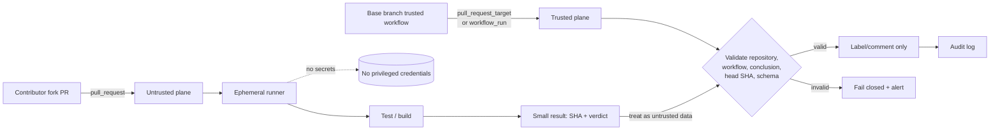

# Weekly SecDevOps Magazine — 2026-09-21

[[Home]]

#security #devops #weekly #deep-dive

> [!warning] 倫理・安全・費用
> 本号は、自分が管理するローカルディレクトリと**架空の workflow**だけで学ぶ。第三者 repository への PR、秘密の取得、runner への侵入を試さない。実 token、secret、repository 名をサンプルやログへ入れない。GitHub-hosted runner の利用には plan 上の分数を消費する場合があり、self-hosted runner は内部 network への到達性を持ち得る。本番 workflow を変更する場合は、branch protection、required checks、変更承認、rollback を先に確認する。

## 1. Weekly focus / difficulty / prerequisites / measurable outcomes

### 今週の焦点

**`pull_request_target` で fork 由来の未信頼コードを checkout・実行する “pwn request” を見抜き、PR の検証（untrusted plane）と label/comment などの特権操作（trusted plane）を分離する。**

- Difficulty signal: **Intermediate** — 理解の目安であり参加条件ではない
- 対象 criterion: **CI/CD security**
- Lab time: **約150分**
- レイヤー: Foundation → Practical implementation → Production concerns → Optional advanced challenge

### 必要な知識・tools・environment・earlier concepts

- **知識:** GitHub Actions の `on` / `jobs` / `steps`、fork PR、commit SHA、token permission
- **Tools:** Python 3.10以上、POSIX shell、テキストエディタ。`git` は任意
- **Environment:** Linux/macOS のローカル一時ディレクトリ。GitHub account、cloud、実 credential は不要
- **Earlier concepts:** trust boundary、least privilege、fail closed、immutable identifier、artifact は code ではなく未信頼 input として扱うこと
- **先に区別する語:** workflow definition、checked-out code、event payload、runner、`GITHUB_TOKEN` はそれぞれ別の信頼対象である

### 測定可能な学習成果

終了時に、次を成果物で示せる。

1. `pull_request` と `pull_request_target` の workflow/ref/token 文脈の差を説明できる。
2. privileged context と untrusted code execution が同じ job に存在する危険を検出できる。
3. PR 検証 job を `permissions: contents: read` に限定し、secret を渡さずに構成できる。
4. 特権 workflow が PR code や任意 artifact を実行しない設計をレビューできる。
5. suspicious run の検知、token 失効、secret rotation、証拠保全の手順を説明できる。

---

## 2. Production scenario と threat / failure model

OSS repository では fork PR を自動テストし、結果に応じて label を付けたい。担当者は label 書き込み権限が必要なので `pull_request_target` を採用し、次のように PR head を checkout して `npm test` を実行した。

```yaml
# vulnerable.yml — 教材。実 repository に配置しない
name: privileged-pr-test
on: pull_request_target
permissions:
  contents: write
  pull-requests: write
jobs:
  test-and-label:
    runs-on: ubuntu-latest
    steps:
      - uses: actions/checkout@v6
        with:
          ref: ${{ github.event.pull_request.head.sha }}
      - run: npm install
      - run: npm test
```

### 保護対象

- repository contents、release tag、PR/issue metadata
- Actions secret、OIDC token 発行権、package registry credential
- cache、artifact、self-hosted runner と到達可能な内部 service
- branch protection と監査証跡の完全性

### 攻撃者能力と trust boundary

攻撃者は fork 上の `package.json`、install script、test、Makefile、設定ファイルを変更できるが、base repository への write 権限は持たないと仮定する。PR 作成により event を発生させられる。問題は checkout 自体ではなく、**特権 context 内で攻撃者が制御する内容を interpreter に渡すこと**で完成する。

### Abuse / failure paths

1. `npm install` の lifecycle script が token や環境情報を外部へ送る。
2. test が `GITHUB_TOKEN` を使って branch、tag、PR を変更する。
3. fork の code が shared/self-hosted runner に persistence を残す。
4. untrusted artifact を privileged `workflow_run` が展開・実行する。
5. `${{ github.event.pull_request.title }}` のような untrusted field を `run:` に直接埋め込み command injection が起きる。

**安全目標:** 未信頼コードを動かす plane は secret なし・read-only・ephemeral にする。書き込みを行う plane は base branch 上の信頼済み code だけを実行し、未信頼 data を厳格に検証する。

---

## 3. 深い概念説明と design trade-offs

### Foundation: event 名ではなく「code × credential × compute」で考える

危険度は単一設定では決まらない。

\[
Risk \approx Untrusted\ Code\ Execution \times Credential\ Privilege \times Runner\ Reachability
\]

- **`pull_request`:** fork PR では PR の merge ref を検証しやすい。token は制限され、通常 secret は渡されない。未信頼コードを実行する CI 向け。
- **`pull_request_target`:** workflow は base/default branch 文脈で動き、base repository の token/secret に近い特権 context を持つ。label、comment、triage など、PR code を実行しない automation 向け。
- **`workflow_run`:** 検証後に別 workflow を起動できるが、自動的に安全にはならない。前段 artifact は未信頼 data であり、後段で shell script として実行すれば同じ問題が戻る。

### Practical principle: data plane と control plane を分ける

- **Data plane:** fork の code を compile/test。`pull_request`、secret なし、`contents: read`、GitHub-hosted ephemeral runner を優先。
- **Control plane:** label/comment/deploy approval。base branch の固定 workflow、必要最小 permission。PR code を checkout・source・import・execute しない。

状態を渡す必要がある場合は、自由形式 script ではなく、schema が小さい結果（例: commit SHA、enum の verdict、数値）だけを渡す。consumer は event の repository、workflow identity、conclusion、head SHA を再検証する。

### SHA pinning と action trust

第三者 action の tag は移動し得る。production では full-length commit SHA pinning を検討する。ただし pinning は provenance と review の代替ではなく、更新作業と vulnerability patch の遅延という trade-off がある。Dependabot/Renovate 等による pin 更新と review をセットにする。

### 主な trade-offs

| 選択 | 利点 | 代償 / 注意 |
|---|---|---|
| `pull_request` のみ | 単純、fork code を低権限で検証 | secret が必要な integration test は実行しにくい |
| 二段 workflow | privilege separation が明確 | artifact/result 検証、run 相関が必要 |
| maintainer approval 後に実行 | human gate | review load、social engineering、更新後の再承認設計 |
| self-hosted runner | 特殊環境、高性能 | persistence、network reachability、tenant isolation の責任 |
| GitHub-hosted ephemeral runner | 残留リスクを縮小 | private network integration や custom hardware に制約 |

---

## 4. Architecture / workflow diagram



重要なのは「二段にした」ことではなく、矢印 `E → H` を code execution に変えないこと、そして `G` の permission を label/comment に必要な範囲へ限定することである。

---

## 5. Guided lab（約150分）

### 時間配分

- Setup / Foundation: 20分
- Vulnerable pattern の作成と scan: 35分
- Hardened workflow と policy 実装: 45分
- Checkpoints / negative tests: 20分
- Detection と incident drill: 20分
- Cleanup / deliverables: 10分

### 5.1 Setup（10分）

```bash
LAB_DIR="$(mktemp -d -t gha-pwn-request-lab.XXXXXX)"
cd "$LAB_DIR"
mkdir -p workflows evidence
printf '%s\n' "$LAB_DIR"
python3 --version
```

**行ごとの説明**

1. `mktemp -d` は衝突しにくい演習専用 directory を作る。
2. `cd` は以後の操作範囲を限定する。
3. `workflows` は教材、`evidence` は検証結果を保存する。
4. path を記録し、cleanup 時の誤削除を防ぐ。
5. scanner に使う Python version を確認する。

**Checkpoint A:** `pwd` の末尾が `gha-pwn-request-lab.*` で、directory 内が空に近いこと。

### 5.2 Vulnerable workflow を data として作る（15分）

`workflows/vulnerable.yml`:

```yaml
name: vulnerable
on: pull_request_target
permissions: write-all
jobs:
  test:
    runs-on: ubuntu-latest
    steps:
      - uses: actions/checkout@v6
        with:
          ref: ${{ github.event.pull_request.head.sha }}
      - run: npm install
      - run: npm test
```

ここではファイルを GitHub に push しない。pattern review 用の inert data として保存する。

### 5.3 小さな policy scanner を実装する（30分）

`scan_workflow.py`:

```python
#!/usr/bin/env python3
from pathlib import Path
import re
import sys

EXEC_PATTERNS = [
    r"\brun\s*:", r"npm\s+(install|ci|test)", r"\bmake\b",
    r"\bsource\b", r"python\s+", r"bash\s+", r"sh\s+"
]
UNTRUSTED_REFS = [
    "github.event.pull_request.head.sha",
    "github.event.pull_request.head.repo.full_name",
    "refs/pull/"
]

def scan(path: Path) -> list[str]:
    text = path.read_text(encoding="utf-8")
    findings = []
    privileged = bool(re.search(r"(?m)^\s*(on:\s*)?pull_request_target\s*:\s*$", text))
    broad = bool(re.search(r"(?m)^\s*permissions\s*:\s*write-all\s*$", text))
    untrusted = any(marker in text for marker in UNTRUSTED_REFS)
    executes = any(re.search(pattern, text, re.I) for pattern in EXEC_PATTERNS)

    if broad:
        findings.append("HIGH broad token permission: write-all")
    if privileged and untrusted and executes:
        findings.append("CRITICAL privileged trigger executes untrusted PR content")
    if privileged and "permissions:" not in text:
        findings.append("HIGH explicit least-privilege permissions missing")
    return findings

for raw in sys.argv[1:]:
    path = Path(raw)
    findings = scan(path)
    print(f"{path}: {'PASS' if not findings else 'FAIL'}")
    for finding in findings:
        print(f"  - {finding}")
    if findings:
        raise SystemExit(1)
```

実行する。

```bash
python3 scan_workflow.py workflows/vulnerable.yml \
  > evidence/vulnerable-scan.txt 2>&1
status=$?
cat evidence/vulnerable-scan.txt
printf 'exit=%s\n' "$status"
```

**期待出力:** `FAIL`、`HIGH broad token permission`、`CRITICAL privileged trigger executes untrusted PR content`、`exit=1`。

> [!note]
> この scanner は YAML parser ではなく教材用 heuristic である。複数行 expression、reusable workflow、indirect script、YAML key の表現差を完全には解釈しない。production gate は CodeQL、OpenSSF Scorecard、組織 policy、review と併用する。

**Checkpoint B:** 「checkout が危険」ではなく、`privileged && untrusted-ref && executes` の組合せを CRITICAL と説明できる。

### 5.4 Hardened test workflow（20分）

`workflows/pr-ci.yml`:

```yaml
name: pr-ci
on:
  pull_request:
    types: [opened, synchronize, reopened]

permissions:
  contents: read

jobs:
  test:
    runs-on: ubuntu-latest
    timeout-minutes: 15
    steps:
      - name: Checkout PR merge commit
        uses: actions/checkout@v6
      - name: Install without arbitrary lifecycle scripts
        run: npm ci --ignore-scripts
      - name: Run reviewed test entrypoint
        run: npm test
```

**行ごとの説明**

- `pull_request`: 未信頼 PR code を検証する低信頼側 event。
- `types`: 不要な activity で run しない。
- `contents: read`: token を repository 読み取りに限定。未記載 permission は `none` になる。
- `timeout-minutes`: resource abuse と hanging job の上限。
- checkout に PR head expression を与えず、event が提供する検証対象を使う。
- `--ignore-scripts`: install hook の attack surface を縮小。ただし native build が必要な project では compatibility との trade-off がある。
- `npm test`: 依然として未信頼 code を実行するため、secret なし・ephemeral runner・network 制限が重要。

scanner を実行する。

```bash
python3 scan_workflow.py workflows/pr-ci.yml | tee evidence/pr-ci-scan.txt
```

**期待出力:** `workflows/pr-ci.yml: PASS`

### 5.5 Privileged metadata workflow（25分）

`workflows/label.yml`:

```yaml
name: label-pr
on:
  pull_request_target:
    types: [opened, reopened]

permissions:
  contents: read
  pull-requests: write

jobs:
  label:
    runs-on: ubuntu-latest
    timeout-minutes: 5
    steps:
      - name: Label through API; do not checkout PR code
        env:
          GH_TOKEN: ${{ github.token }}
          PR_NUMBER: ${{ github.event.pull_request.number }}
          REPOSITORY: ${{ github.repository }}
        run: |
          case "$PR_NUMBER" in (*[!0-9]*|'') exit 2;; esac
          gh api --method POST \
            "repos/${REPOSITORY}/issues/${PR_NUMBER}/labels" \
            --field 'labels[]=needs-triage'
```

**行ごとの説明**

- `pull_request_target` は label API に必要な base 側 context を使う。
- `contents: read` と `pull-requests: write` だけを許可し、`write-all` を避ける。
- checkout step がないため fork code を workspace に持ち込まない。
- event 値を shell code に直接展開せず、環境変数として渡す。
- `PR_NUMBER` を数字だけに制限し、fail closed にする。
- label 名を event input から取らず固定 allowlist にする。

```bash
python3 scan_workflow.py workflows/label.yml | tee evidence/label-scan.txt
```

**期待出力:** `workflows/label.yml: PASS`

**Checkpoint C:** privileged workflow が PR head を checkout せず、write permission が `pull-requests` に限定されている。

### 5.6 Negative test（10分）

```bash
cp workflows/label.yml workflows/regression.yml
printf '\n# regression marker\n# ref: ${{ github.event.pull_request.head.sha }}\n# run: npm test\n' \
  >> workflows/regression.yml
python3 scan_workflow.py workflows/regression.yml \
  > evidence/regression-scan.txt 2>&1
test $? -eq 1 && echo 'EXPECTED: policy rejected regression'
cat evidence/regression-scan.txt
```

**期待出力:** `EXPECTED: policy rejected regression` と `CRITICAL`。これは heuristic の regression test であり、コメントも検出する conservative な設計である。

### 5.7 Cleanup（10分）

> [!warning] 破壊的操作
> 次は lab directory を削除する。まず成果物を必要な場所へ copy し、`pwd` と `$LAB_DIR` が `gha-pwn-request-lab.` を含むことを目視確認する。曖昧なら実行しない。

```bash
pwd
printf '%s\n' "$LAB_DIR"
find "$LAB_DIR" -maxdepth 2 -type f -print
# 確認後のみ:
cd /tmp
rm -rf -- "$LAB_DIR"
```

`rm -rf` は指定 directory を再帰削除する。変数が空でないことと prefix を必ず確認する。より回復可能な `trash` がある環境ではそちらを優先する。

---

## 6. Configuration / commands の設計要点

### 明示的 permission の意味

```yaml
permissions:
  contents: read
  pull-requests: write
```

1. `permissions` を workflow/job に明示し、platform default への依存を減らす。
2. `contents: read` は checkout 等の読み取りだけを許す。
3. `pull-requests: write` は PR metadata 操作に限定する。
4. 一つでも permission を明示すると、未指定 permission は `none` になる仕様を利用する。
5. `id-token: write` は OIDC token 発行を許すので、cloud federation が不要な job には付けない。

### Expression を shell へ直書きしない

Unsafe:

```yaml
- run: echo "${{ github.event.pull_request.title }}"
```

Safer:

```yaml
- env:
    PR_TITLE: ${{ github.event.pull_request.title }}
  run: printf '%s\n' "$PR_TITLE"
```

前者は expression 展開後の文字列が shell program の一部になる。後者は値を environment variable として分離し、quoted expansion で data として扱う。ただし downstream program がその値を再解釈する場合は、さらに schema validation が必要である。

### SHA と identity の再検証

二段 workflow では、単に「前段が success」だけでなく次を照合する。

- expected repository / owner か
- expected workflow file と trusted default branch か
- triggering event と actor policy が妥当か
- artifact 内 SHA が event の `head_sha` と一致するか
- artifact schema、size、file count が allowlist 内か
- archive 展開時に path traversal / symlink を拒否するか

---

## 7. Detection / observability signals と incident drill

### 監視したい signal

- `pull_request_target` / `workflow_run` / `issue_comment` で PR code を checkout・fetch する差分
- `permissions: write-all`、`contents: write`、`id-token: write` の追加
- `allow-unsafe-pr-checkout: true` の追加
- self-hosted runner label の新規使用
- workflow 内の `curl`, `wget`, `nc`、未知 endpoint、base64/hex encode
- secret access 後の unusual API call、branch/tag/release 変更、package publish
- Action pin が full SHA から mutable tag へ戻る変更
- privileged workflow が untrusted artifact を download 後に `chmod +x`、`source`、shell/interpreter 実行

### Incident drill（20分）

**状況:** 監査で、過去48時間 `pull_request_target` job が fork PR head を checkout し、`npm install` を実行していたことが判明した。

1. **Detect / scope**
   - workflow file の commit history、run ID、triggering PR、head SHA、actor、runner type を保存する。
   - 影響期間に workflow が参照できた secret、`GITHUB_TOKEN` permission、environment、OIDC permission を列挙する。
   - outbound network log、GitHub audit log、package/release/branch/tag changes を時系列化する。
2. **Contain**
   - vulnerable workflow を disable するか、`pull_request` + read-only へ修正する。
   - self-hosted runner を隔離する。再利用せず forensic snapshot 方針に従う。
   - repository/environment secret を必要性と露出可能性に基づいて revoke/rotate する。
   - cloud OIDC trust があれば subject/audience 条件と発行履歴を確認し、不審 session を revoke/deny する。
3. **Eradicate**
   - malicious commit だけでなく、cache、artifact、release、package、runner image/persistence を調べる。
   - protected branch と tag の不正変更を trusted commit/digest から復元する。
4. **Recover**
   - hardened workflow を review 後に段階再開し、canary PR で permission と log を確認する。
   - required checks、event policy、CodeQL/Scorecard、SHA pinning を有効化する。
5. **Learn**
   - MTTD/MTTC、露出した credential 数、調査不能な logging gap、再発防止 owner を記録する。

**証拠保全:** workflow logs や audit data の retention 切れを防ぎ、取得時刻・hash・取得者を記録する。疑わしい runner 上で調査 tool を追加実行すると証拠を変えるため、組織の IR procedure を優先する。

---

## 8. Common failure modes / unsafe patterns / remediation

| Failure / unsafe pattern | なぜ危険か | Remediation |
|---|---|---|
| `pull_request_target` + PR head checkout + build/test | base 側 credential で攻撃者 code を実行 | test は `pull_request` へ分離 |
| `permissions: write-all` | compromise 時の blast radius が大きい | job ごとに必要な permission のみ |
| secret が必要だから privileged event を使う | untrusted code に secret を近づける | fake service、staging credential、manual approval、設計分離 |
| `workflow_run` なら安全と思う | artifact が未信頼のまま | metadata/schema/SHA 検証、code として実行しない |
| PR title/body を `run:` へ直書き | command injection | `env` 経由、quote、allowlist/schema validation |
| mutable action tag のみ | tag 移動や upstream compromise | full commit SHA pin + 自動更新 review |
| persistent self-hosted runner で public fork を実行 | persistence と lateral movement | ephemeral isolated runner、network deny、public PR を載せない |
| scanner PASS を安全証明とみなす | indirect execution や semantic gap を逃す | threat model、manual review、CodeQL、runtime monitoring |
| artifact archive を無検証展開 | path traversal / overwrite | size/count/path/symlink 検査、隔離 directory |
| secret masking を完全防御と思う | encoding/変形値は漏れる場合がある | 最小権限、短命 credential、egress制御、rotation |

---

## 9. Verification checklist と concrete deliverables

### Verification checklist

- [ ] `pull_request` と `pull_request_target` の trust context を説明した
- [ ] privileged workflow に PR head checkout/fetch がない
- [ ] untrusted job に secret と write permission がない
- [ ] 各 workflow/job に明示的 `permissions` と timeout がある
- [ ] untrusted event field を shell program に直書きしていない
- [ ] privileged consumer は repository、workflow、SHA、result schema を再検証する
- [ ] self-hosted runner の persistence/network reachability を評価した
- [ ] third-party action の pin/update policy がある
- [ ] workflow 変更が security review / CODEOWNERS の対象である
- [ ] suspicious run の containment と credential rotation 手順がある

### Lab deliverables

1. `workflows/vulnerable.yml`
2. `workflows/pr-ci.yml`
3. `workflows/label.yml`
4. `scan_workflow.py`
5. `evidence/vulnerable-scan.txt`
6. `evidence/pr-ci-scan.txt`
7. `evidence/label-scan.txt`
8. `evidence/regression-scan.txt`
9. 200〜400字の design note: 「なぜ二段化だけでは不十分か」
10. incident drill の timeline と、rotate 対象 credential 一覧（架空名のみ）

---

## 10. Assessment

### Five questions

1. `pull_request_target` が存在する正当な用途を一つ挙げ、同時に禁止すべき操作を説明せよ。
2. PR head の checkout だけでは直ちに code execution でないのに、なぜ重大 finding と組み合わせて扱うのか。
3. `workflow_run` で前段 test と後段 label を分離した。後段が前段 artifact の `report.sh` を実行してよいか。
4. `permissions: contents: read` を書くと、未記載の `id-token` や `packages` はどうなるか。
5. `${{ github.event.pull_request.title }}` を shell に渡すより `env` を使う方が安全な理由と、残る限界は何か。

### Interview / design question

public OSS の fork PR に対して、private package を使う integration test、coverage comment、release preview を提供したい。credential exposure と contributor experience の双方を考慮し、event、runner、permission、approval、artifact、observability を含む設計を示せ。

<details>
<summary>解答例を見る</summary>

1. label/comment/triage など base repository 権限が必要だが PR code を実行しない metadata automation。PR head の checkout、build、test、source/import は禁止する。
2. checkout 後の `npm install`, `make`, test、config loader などが間接的に攻撃者 code を実行しやすく、review で見落とされるため。privileged trigger、untrusted ref、execution の組合せで判定する。
3. 不可。artifact は未信頼 data であり、shell として実行すれば privilege boundary を越える。固定 schema の JSON 等にし、size/type/SHA/producer identity を検証して data として処理する。
4. 明示されない permission は `none` になる。fork や組織 policy 等による追加制限はあり得るが、workflow は上位 policy を越えて権限を増やせない。
5. expression の値が shell source code の一部になることを避け、quoted variable として data に分離できる。ただし値を `eval`、template、SQL、別 interpreter に渡す場合や未引用展開では再解釈されるので、schema validation と安全な API が必要。

**Design question の要点:** 通常 unit test は `pull_request` + read-only + secret なしで実行。private package が本当に必要な integration test は maintainer approval、短命で repository/environment 限定の credential、隔離された ephemeral runner、egress allowlist を用いる。coverage は未信頼側で数値/commit SHA の小さな結果を生成し、trusted workflow が producer identity、run conclusion、head SHA、schema を再検証して comment する。release preview は fork PR から自動 deploy せず、承認後に isolated environment と expiry を使う。全 secret access、OIDC issuance、API write、runner lifecycle を監査し、異常時の revoke/rotation を用意する。

</details>

---

## 11. Follow-up challenge と next-week prerequisite

### Optional advanced challenge

scanner を次の policy-as-code に拡張する。

- YAML parser を用いて comment と実 node を区別する
- `pull_request_target`, `workflow_run`, `issue_comment` を privileged event として列挙する
- checkout だけでなく `git fetch`, `gh pr checkout`, artifact download → interpreter の data flow を追う
- `write-all`、`id-token: write`、self-hosted runner、mutable action tag に severity を付ける
- `good/` と `bad/` fixture を10件以上作り、false positive / false negative を記録する
- CI 自身は `pull_request`、`contents: read`、secret なしで scanner を動かす

### Next-week prerequisite

次回以降に **artifact trust boundary / provenance** または **ephemeral runner hardening** を学ぶ前提として、以下を復習する。

- SHA-256 digest と immutable identity
- archive path traversal と symlink
- OIDC の issuer / audience / subject
- runner network egress と workload isolation
- GitHub Actions audit log と run metadata

---

## 12. Current primary references

2026-09-21 時点。仕様と既定値は変化し得るため、実装前に最新版を再確認する。

1. GitHub Docs, [Securely using `pull_request_target`](https://docs.github.com/en/actions/reference/security/securely-using-pull_request_target) — trust model、pwn request、hardening、built-in protection
2. GitHub Docs, [Secure use reference](https://docs.github.com/en/actions/reference/security/secure-use) — untrusted input、runner、secret、third-party action の安全な利用
3. GitHub Docs, [Events that trigger workflows](https://docs.github.com/en/actions/reference/workflows-and-actions/events-that-trigger-workflows) — `pull_request` / `pull_request_target` / `workflow_run` の event semantics
4. GitHub Docs, [Workflow syntax for GitHub Actions](https://docs.github.com/en/actions/reference/workflows-and-actions/workflow-syntax) — `permissions`、job、timeout の仕様
5. GitHub Docs, [Use GITHUB_TOKEN for authentication in workflows](https://docs.github.com/en/actions/tutorials/authenticate-with-github_token) — token と least privilege
6. GitHub Security Lab, [Preventing pwn requests](https://securitylab.github.com/resources/github-actions-preventing-pwn-requests/) — vulnerable pattern と workflow 分離
7. OpenSSF Scorecard, [Dangerous-Workflow check](https://github.com/ossf/scorecard/blob/main/docs/checks.md#dangerous-workflow) — workflow の危険な input / script injection 検査
8. OpenID Foundation, [OpenID Connect Core 1.0](https://openid.net/specs/openid-connect-core-1_0.html) — advanced challenge で OIDC claim を扱う場合の基礎標準

---

## まとめ

`pull_request_target` は「危険だから全面禁止」というより、**base repository の権限で metadata を扱うための privileged control plane** と理解する。事故は、そこへ fork の code を持ち込み、build/test/install したときに生じる。防御の核は、未信頼 code の実行と credential を空間・権限・lifecycle で分離し、境界を越える情報を小さな検証可能 data に限定することである。
