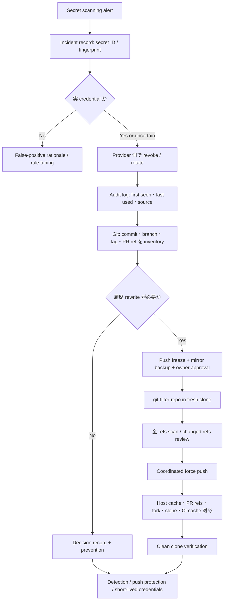

# Weekly SecDevOps Magazine — 2026-09-28

[[Home]]

#security #devops #weekly #deep-dive

> [!warning] 倫理・安全・破壊的操作
> この演習は、自分で作るローカル repository と、文字列 `LAB_TOKEN_...` だけを使う。実 credential、token、password、秘密鍵を貼らない。第三者 repository を scan しない。履歴 rewrite と force push は commit ID を変え、署名・open PR・clone・CI cache を壊し得る。本番ではまず credential を失効し、所有者・incident commander・repository 管理者の承認、backup、push freeze、collaborator への連絡、rollback 方針を揃える。Lab の cleanup は対象 path を `pwd` で確認してから行う。cloud resource は作らず、追加課金は通常ない。

## 1. Weekly focus / difficulty / prerequisites / measurable outcomes

### 今週の焦点

**Git 履歴へ secret が commit された事故を、単なる「ファイル削除」で終わらせず、検知 → 有効性確認 → 即時失効 → 利用痕跡の調査 → 必要性を判断した履歴修復 → 再混入防止まで閉じる。**

- 対象 criterion: **Secrets**
- Difficulty signal: **Intermediate** — 理解の目安であり参加条件ではない
- Lab time: **約150分**
- レイヤー: **Foundation → Practical implementation → Production concerns → Optional advanced challenge**

### 必要な知識・tools・environment・earlier concepts

- **知識:** Git commit / branch / tag / remote、credential の scope / TTL、失効（revocation）と交換（rotation）
- **Tools:** Git 2.36以上、Python 3.10以上、POSIX shell。履歴 rewrite を試す場合のみ `git-filter-repo` 2.47以上を推奨
- **Environment:** Linux/macOS のローカル一時 directory。Git hosting account、network、実 credential は不要
- **Earlier concepts:** least privilege、blast radius、immutable identifier、evidence preservation、containment / eradication / recovery
- **重要な前提:** 「repository から文字列が見えなくなった」と「credential が使えなくなった」は別の状態である

### 測定可能な学習成果

終了時に、次を証拠付きで説明・実行できる。

1. working tree、current branch、全 refs、reflog、clone / fork / cache の露出範囲を区別できる。
2. 合成 secret を全 local refs から検出し、最初の混入 commit と到達可能な refs を特定できる。
3. **失効を履歴修復より先に行う理由**を attack window で説明できる。
4. rewrite の要否を risk、coordination cost、残存 copy の観点で判断できる。
5. rewrite 後に old object の非到達性と、clean clone 相当の状態を検証できる。
6. pre-commit、server-side push protection、短命 credential、検知 alert を多層化できる。

## 2. Production scenario と threat / failure model

### Scenario

決済 API の deploy job が使う vendor token を、開発者が debugging のため `.env.debug` に書き、そのまま feature branch へ commit した。90秒後に削除 commit を push したため、default branch の最新 tree には secret がない。しかし secret scanning が過去 commit を検出した。repository は private だが、外部 contractor、CI runner、backup、fork を含む複数の copy がある。

### 守るもの

- vendor API のデータと操作権限
- token を利用する production job の可用性
- repository の完全性、commit / tag 署名、review の追跡可能性
- incident timeline と監査証拠

### Threat / failure model

| 事象 | 何が起きるか | 主な制御 |
|---|---|---|
| 過去 commit の閲覧 | 最新版から消しても `git show <old-sha>` で読める | provider 側 revoke、全 refs scan |
| clone / fork / CI cache | central rewrite 後も外部 copy に残る | copy inventory、再 clone、cache purge、通知 |
| token の不正利用 | 漏えいから revoke まで API を呼ばれる | 短い TTL、最小 scope、provider audit log |
| rotation 失敗 | consumer が旧 token を使い続ける | dual-token window、health check、rollback |
| rewrite の競合 | 古い clone が old history を再 push | push freeze、branch protection、old SHA ban |
| 証拠消失 | 急いで GC / log 削除し timeline を失う | read-only snapshot、hash、retention |
| scanner の false negative | 独自 token format や encoding を見逃す | provider patterns + custom rules + entropy は補助 |

**範囲外:** credential provider への侵入、第三者 repository の探索、実 token の検証要求送信。本番では token の文字列を analyst の ticket や chat に貼らず、secret ID / fingerprint で追跡する。

## 3. Deep concept と設計 trade-off

### 3.1 Git は「最新ファイル」ではなく object graph

commit は tree と parent commit を指す。branch や tag は commit への ref である。ファイルを削除する新 commit は、古い blob を上書きしない。古い commit が ref から到達可能なら、blob も通常は取得できる。さらに remote-tracking branch、tag、PR ref、reflog、別 clone、fork、hosting cache が追加の root になり得る。

したがって検証対象は `git grep` の working tree だけでは不十分である。

```text
working tree clean ≠ current branch clean ≠ all refs clean ≠ ecosystem clean
```

### 3.2 優先順位は Revoke → Investigate → Rewrite decision

履歴 rewrite は secret の**可視性**を下げるが、すでにコピーされた値を無効化しない。一方、provider 側 revoke は、その credential の認証能力を止める。よって最初の containment は原則 revoke / rotate である。

ただし可用性との trade-off がある。単独 token を即時 revoke すると production が止まる場合は、incident commander の下で次を短時間に行う。

1. 新 token を最小 scope、短い TTL で発行
2. secret manager の version を更新
3. consumer を reload / rollout
4. health check と audit log で新 token 利用を確認
5. 旧 token を revoke

「無停止 rotation」を理由に旧 token を長時間併存させない。deadline と owner を明示する。

### 3.3 Rewrite する / しない

**rewrite を強く検討:** 高価値 credential、private key、規制対象データ、誤用しやすい値、検索面からの除去が必要、copy を調整できる。

**revoke で十分な場合がある:** credential が確実に無効、短命で期限切れ、rewrite の損害が大きい、hosting 上の残存 copy を完全には消せない。判断を ticket に記録する。

rewrite の cost は、全後続 commit SHA の変更、commit/tag signature の無効化、open PR の差分混乱、CI cache / release link / audit reference の破損、古い clone からの再汚染である。`--force-with-lease` でも mirror rewrite 全体の調整を代替しない。

### 3.4 Detection は pattern、context、provider validation

- **Pattern match:** 既知 prefix / format に強い。独自 secret を custom rule にする。
- **Entropy:** 未知のランダム文字列を拾えるが、hash / fixture で誤検知が増える。
- **Context:** `password=`, `Authorization:` などを重み付けする。
- **Provider validation:** credential が active か確認できるが、scanner から外部送信する設計には privacy と abuse risk がある。公式 integration のみを使い、値を自作 endpoint に送らない。

## 4. Architecture / workflow



## 5. Guided lab（約150分）

### Phase 0 — Setup（15分）

```bash
LAB_ROOT="$(mktemp -d -t git-secret-drill.XXXXXX)"
cd "$LAB_ROOT"
git init --bare remote.git
git clone remote.git app
cd app
git config user.name "Lab Learner"
git config user.email "learner@example.invalid"
printf '# demo\n' > README.md
git add README.md
git commit -m 'init'
git branch -M main
git push -u origin main
```

**Checkpoint A:** `pwd` が `git-secret-drill.../app` で、`git status --short` が空。

次に、架空 token を過去 commit へ混入させ、削除する。

```bash
git switch -c feature/debug
printf 'VENDOR_TOKEN=LAB_TOKEN_DEMO_7Q4Z9X2K\n' > .env.debug
git add .env.debug
git commit -m 'add debug config'
LEAK_COMMIT="$(git rev-parse HEAD)"
git push -u origin feature/debug

git rm .env.debug
printf '.env*\n' > .gitignore
git add .gitignore
git commit -m 'remove debug config and ignore env files'
git push
printf 'leak commit: %s\n' "$LEAK_COMMIT"
```

**期待出力:** `git status --short` は空だが、次は token を表示する。

```bash
git show "$LEAK_COMMIT:.env.debug"
```

```text
VENDOR_TOKEN=LAB_TOKEN_DEMO_7Q4Z9X2K
```

### Phase 1 — Detection と scope（30分）

秘密値を command history に直書きしない運用を模し、lab pattern を scanner file に置く。この file 自体は commit しない。

```bash
mkdir -p "$LAB_ROOT/evidence"
printf 'LAB_TOKEN_[A-Z0-9_]*\n' > "$LAB_ROOT/evidence/pattern.txt"

git log --all --decorate --oneline -- .env.debug \
  | tee "$LAB_ROOT/evidence/path-history.txt"

git rev-list --objects --all \
  | git cat-file --batch-check='%(objectname) %(objecttype) %(rest)' \
  | awk '$2 == "blob" {print $1}' \
  > "$LAB_ROOT/evidence/blob-ids.txt"

while IFS= read -r oid; do
  if git cat-file blob "$oid" | grep -Eq 'LAB_TOKEN_[A-Z0-9_]+'; then
    printf '%s\n' "$oid"
  fi
done < "$LAB_ROOT/evidence/blob-ids.txt" \
  | tee "$LAB_ROOT/evidence/matching-blobs.txt"
```

**Checkpoint B:** `matching-blobs.txt` に1つ以上の object ID がある。

どの refs が leak commit を含むか確認する。

```bash
git branch -a --contains "$LEAK_COMMIT"
git tag --contains "$LEAK_COMMIT"
git for-each-ref --contains "$LEAK_COMMIT" \
  --format='%(refname) %(objectname)'
```

**期待:** `feature/debug` と `remotes/origin/feature/debug` が表示される。tag はまだ空。

証拠の integrity を残す。

```bash
git show --no-ext-diff --binary "$LEAK_COMMIT" \
  > "$LAB_ROOT/evidence/leak.patch"
sha256sum "$LAB_ROOT/evidence/leak.patch" \
  > "$LAB_ROOT/evidence/SHA256SUMS"
```

macOS は `shasum -a 256` を使う。実 incident の evidence file は secret を含み得るため、暗号化・access control・retention を適用し、通常 ticket へ添付しない。

### Phase 2 — Containment / rotation tabletop（20分）

本 lab の token は架空なので外部 API を呼ばない。次の record を作る。

```bash
cat > "$LAB_ROOT/evidence/containment.md" <<'EOF'
# Containment record
- Credential: vendor deploy token / fingerprint only
- Scope: deploy:write (lab assumption)
- Action: REVOKED_SIMULATED
- Consumer migration: VERIFIED_SIMULATED
- Provider audit log: no real provider; lab event only
- Owner: lab learner
- Deadline: immediate
EOF
```

**Checkpoint C:** 次を口頭または notes に答える。

- 値が削除済みでも revoke が必要なのはなぜか。
- 新旧 token の併存時間をどう制限するか。
- audit log で `created_at`, `last_used_at`, source IP / workload identity の何を見るか。

### Phase 3 — 履歴修復 rehearsal（35分）

> [!danger] ここから commit ID が変わる
> Lab copy でのみ行う。本番では fresh mirror clone、backup、push freeze、承認、全 collaborator への手順が必要。以下は remote へ force push しない rehearsal である。

`git-filter-repo` 2.47以上を別途公式手順で導入済みなら確認する。

```bash
git filter-repo --version
```

利用できる場合、fresh clone で対象 path を全履歴から除去する。

```bash
cd "$LAB_ROOT"
git clone --mirror remote.git rewrite.git
cd rewrite.git
git filter-repo --sensitive-data-removal \
  --invert-paths --path .env.debug
```

`git-filter-repo` がない場合は、実行せず Phase 3 を設計 review とし、古い `git filter-branch` へ安易に置き換えない。

**Checkpoint D:** rewrite copy 内で次を確認する。

```bash
git log --all -- .env.debug
git rev-list --objects --all \
  | while read -r oid path; do
      [ -n "$oid" ] || continue
      git cat-file -e "$oid" 2>/dev/null || continue
      if [ "$(git cat-file -t "$oid" 2>/dev/null)" = blob ]; then
        git cat-file blob "$oid" 2>/dev/null \
          | grep -Eq 'LAB_TOKEN_[A-Z0-9_]+' && printf '%s %s\n' "$oid" "$path"
      fi
    done
```

**期待:** どちらも出力なし。`git-filter-repo` の `changed-refs` があれば review する。

```bash
test ! -f filter-repo/changed-refs || sed -n '1,120p' filter-repo/changed-refs
```

本番相当ではこの後、保護設定と push freeze を管理下で一時変更し、`git push --force --mirror` を行う。しかし本 lab では実行しない。代わりに「誰が・いつ・どの refs を更新し、失敗時にどう止めるか」を deliverable に書く。

### Phase 4 — Prevention と incident drill（35分）

local pre-commit hook は bypass 可能だが、fast feedback として有効である。

```bash
cd "$LAB_ROOT/app"
mkdir -p .git/hooks
cat > .git/hooks/pre-commit <<'EOF'
#!/bin/sh
set -eu
if git diff --cached --no-ext-diff --text \
  | grep -Eq 'LAB_TOKEN_[A-Z0-9_]+'; then
  echo 'BLOCKED: staged diff contains a lab token pattern' >&2
  exit 1
fi
EOF
chmod +x .git/hooks/pre-commit

printf 'token=LAB_TOKEN_BLOCK_ME_123\n' > accidental.txt
git add accidental.txt
git commit -m 'should be blocked'
```

**期待出力:**

```text
BLOCKED: staged diff contains a lab token pattern
```

終了 status は非0で、commit は作られない。

```bash
git reset accidental.txt
rm accidental.txt
git status --short
```

#### Incident drill inject

想定: rewrite から30分後、古い clone を持つ teammate が old `feature/debug` を push し、scanner が再 alert した。

10分で次を順序付ける。

1. push / merge を再 freeze し、再 alert の ref と actor を保存
2. credential が revoke 済みであることを provider で再確認
3. old commit SHA と new event を相関し、**新しい credential の再漏えいではない**ことを確認
4. contaminated ref を quarantine / delete し、old clone の owner を特定
5. clean clone を配布し、old clone の再利用を止める
6. server-side で old SHA / secret pattern を reject する
7. 全 refs と hosting-specific PR refs / cache を再検証
8. incident timeline と再発原因を更新

### Phase 5 — Cleanup（15分）

> [!warning] 削除対象を必ず確認する

```bash
cd "$LAB_ROOT"
pwd
printf '%s\n' "$LAB_ROOT"
```

表示 path が `git-secret-drill.` で始まる今回の一時 directory だと確認してから、利用環境の recoverable trash 機能で削除する。`rm -rf` をコピー＆ペーストしない。cleanup 後、shell variable を消す。

```bash
unset LEAK_COMMIT LAB_ROOT
```

## 6. Commands / configuration の行別解説

### 全 refs から blob を列挙する pipeline

```bash
git rev-list --objects --all \
| git cat-file --batch-check='%(objectname) %(objecttype) %(rest)' \
| awk '$2 == "blob" {print $1}'
```

1. `git rev-list --objects --all`: local の全 refs から到達可能な object ID と path hint を列挙する。
2. `git cat-file --batch-check`: object を展開せず、type を batch で問い合わせる。
3. `%(objectname)`: object ID、`%(objecttype)`: commit / tree / blob / tag、`%(rest)`: 入力の残り。
4. `awk '$2 == "blob"'`: file 内容に相当する blob だけへ絞る。
5. この方法も reflog だけから到達する object、別 clone、host cache を保証しない。

### Hook

```sh
#!/bin/sh
set -eu
git diff --cached --no-ext-diff --text | grep -Eq 'LAB_TOKEN_[A-Z0-9_]+'
```

- `--cached`: commit 対象の index と `HEAD` の差分だけを見る。
- `--no-ext-diff`: user 設定の external diff による予期せぬ処理を避ける。
- `--text`: binary 判定された file も text として扱う。大容量 file では性能制限が必要。
- `grep -E`: lab prefix の custom pattern。実運用では provider 公式 pattern と、review 済み custom detector を使う。
- hook は `--no-verify`、未導入端末、API upload で bypass される。server-side push protection / CI scan が必須である。

### Rewrite

```bash
git filter-repo --sensitive-data-removal --invert-paths --path .env.debug
```

- `--sensitive-data-removal`: leak 修復向けの追加 report / tracking を有効にする。2.47以上を使う。
- `--invert-paths`: 指定 path を残すのではなく除去する。
- `--path .env.debug`: repository root からの exact path。rename されていた場合は旧 path もすべて列挙する。
- file に正当な内容もあり特定文字列だけ除去する場合は `--replace-text` を検討する。ただし replacement file 自体を厳格に保護する。

## 7. Detection / observability signals と incident drill

### 最低限の signals

| Signal | Source | Alert 条件 | 調査 key |
|---|---|---|---|
| Secret scanning alert | Git host | valid / unknown credential pattern | repository, ref, commit SHA, detector, first seen |
| Push protection bypass | Git host audit log | bypass、特に admin / repeated actor | actor, reason, timestamp, rule |
| Credential lifecycle | provider audit | create / rotate / revoke | secret ID、scope、owner、timestamp |
| Credential use | provider / API gateway | leak 後の異常 source / action | principal, source, action, result |
| Rewrite operation | Git host audit | protection change / force push / ref delete | actor, old/new SHA, approved change |
| Recontamination | scanner | old fingerprint / old SHA の再出現 | clone owner, pushed ref, CI cache |

**絶対に log しない:** token 本体、raw `Authorization` header、private key。correlation には provider secret ID、末尾4文字（provider が許す場合）、または keyed fingerprint を使う。plain SHA-256 は低 entropy secret の辞書攻撃に弱い。

### Drill の success criteria

- detection から revoke decision まで5分以内
- credential owner と全 consumer を10分以内に特定
- provider audit log の保存と time zone 正規化
- old SHA が再 push された時、server-side で reject または即時 alert
- recovery 後に clean clone で全 refs scan が0件

## 8. Common failure modes / unsafe patterns / remediation

| Unsafe pattern / failure | なぜ危険か | Remediation |
|---|---|---|
| 最新 file から削除して close | 過去 commit に残る | 全 refs scan、provider revoke |
| rewrite を revoke より先に実行 | 攻撃可能時間が延びる | revoke / rotate を最優先 |
| token を ticket に貼る | second leak を作る | ID / fingerprint だけ共有 |
| default branch だけ scan | feature branch / tag / PR ref を見逃す | `--all` + host-specific refs |
| `git log -S` だけに依存 | rename、binary、encoding、pattern variation | blob scan + provider detector |
| 全員へ `git pull` を案内 | old history が merge / push で戻る | re-clone または厳密な cleanup 手順 |
| 無調整の force push | work、署名、PR、release traceability を壊す | freeze、backup、owner、maintenance window |
| local hook だけ | bypass 可能 | push protection + CI + provider-side TTL |
| GC を証拠保全前に実行 | timeline を失う | snapshot / hash / access-controlled evidence |
| secret を暗号化して Git に置けば万能 | decryption key / recipient / rotation 問題が残る | threat model、専用 secret manager、短命 credential |
| scanner alert を無条件に public issue 化 | 値や場所を拡散する | restricted incident channel と redaction |

## 9. Verification checklist と lab deliverables

### Checklist

- [ ] 実 credential を一切使用していない
- [ ] working tree が clean でも過去 commit から値が読めることを確認した
- [ ] 全 local refs から matching blob を検出した
- [ ] leak commit を含む refs を列挙した
- [ ] evidence の hash を保存した
- [ ] revoke → investigate → rewrite decision の順序を説明できる
- [ ] rewrite の business cost と recontamination risk を記録した
- [ ] rewrite rehearsal 後の全 refs scan が0件（tool 利用時）
- [ ] pre-commit block を非0終了で確認した
- [ ] server-side / provider-side control を最低2つ設計した
- [ ] cleanup 対象 path を目視確認した

### Concrete deliverables

1. `path-history.txt`: path の履歴
2. `matching-blobs.txt`: 値を含む blob ID（値そのものは含めない）
3. `SHA256SUMS`: evidence integrity
4. `containment.md`: 架空の revoke / consumer migration record
5. `rewrite-plan.md`: owner、freeze、backup、refs、host support、collaborator cleanup、go/no-go、rollback
6. `prevention.md`: local / server / provider の三層 control と owner / SLO
7. incident drill timeline: detection、containment、eradication、recovery、lessons

## 10. Assessment

### Five questions

1. `.env` を削除した新 commit を pushしても、なぜ incident は解決しないのか。
2. 履歴 rewrite より revoke / rotation を先にする理由は何か。
3. `git rev-list --objects --all` で確認できない copy を3つ挙げよ。
4. `git-filter-repo` 後の再汚染はどのように起こるか。
5. local pre-commit hook と server-side push protection はどう補完し合うか。

### Interview / design question

200人、500 repository、複数 cloud provider を持つ組織で、secret scanning alert から15分以内の containment を実現する設計を示せ。credential ownership、on-call routing、provider revoke、business continuity、evidence、false positive、metrics を含めること。

<details>
<summary>解答例</summary>

1. Git は過去 commit の blob を保持し、ref から到達できる限り `git show` などで取得できる。clone / fork / cache にも残り得る。
2. rewrite は値を無効化せず、コピー済み token は使える。provider revoke は認証能力を止め、attack window を閉じる。
3. 別 clone、fork、hosting の PR ref / cache、CI cache、backup、reflog-only object など。
4. rewrite 前の clone が古い branch / tag を push、または古い artifact / automation が ref を復元することで起きる。freeze、re-clone、old SHA reject が必要。
5. local hook は developer に即時 feedback を与えるが bypass できる。server-side は central enforcement となるが、push 前 feedback は遅い。両方を使い、さらに短命 credential と provider audit を重ねる。

**Design question:** detector が alert に secret value ではなく provider / secret type / repository / commit / fingerprint を付け、ownership catalog から service owner と security on-call へ route する。provider connector は最小権限かつ承認済み runbook で revoke または rotation を実施し、consumer inventory から rollout と health check を行う。高リスクは自動 revoke、可用性上重要なものは5分の human gate と明確な deadline を設ける。raw secret を log せず、provider audit と Git audit を immutable store に保存する。precision、MTTD、MTTR/revoke、再汚染率、bypass 数を測り、test token で定期 drill する。

</details>

## 11. Follow-up challenge と next-week prerequisite

### Optional advanced challenge

bare repository に `pre-receive` hook の prototype を作り、push される `oldrev..newrev` の**新規 blob のみ**を scanする。次を満たす test を書く。

- lab token を含む新 commit は reject
- clean commit は accept
- branch delete（`newrev` が zero OID）は誤作動しない
- merge push で既存 object を重複 scan しすぎない
- timeout / scanner failure は high-risk repository では fail closed
- alert / audit log に raw secret を出さない

性能、最大 blob size、binary、LFS pointer、push option による bypass、緊急 exception の期限と承認を threat model に含める。

### Next-week prerequisite

次号へ向け、**Git ref と object reachability、credential の scope / TTL、provider audit log、CI の trust boundary**を復習する。これらは supply-chain policy や CI/CD provenance の検証にも再利用できる。

## 12. Current primary references

- [GitHub Docs — Remediating a leaked secret in your repository](https://docs.github.com/en/code-security/tutorials/remediate-leaked-secrets/remediating-a-leaked-secret) — 単なる削除や repository 再作成では悪用を止められず、revoke / rotate が中心となる手順。
- [GitHub Docs — Removing sensitive data from a repository](https://docs.github.com/en/authentication/keeping-your-account-and-data-secure/removing-sensitive-data-from-a-repository) — rewrite の副作用、再汚染、clone / fork / PR ref、`git-filter-repo --sensitive-data-removal`。
- [GitHub Docs — Secret scanning](https://docs.github.com/en/code-security/concepts/secret-security/secret-scanning) — 全 Git history の scan、alert と push protection の概念。
- [git-filter-repo official repository and manual](https://github.com/newren/git-filter-repo) — fresh-clone safety、rewrite options、changed refs。Lab では2.47以上を推奨。
- [Git documentation — git-rev-list](https://git-scm.com/docs/git-rev-list) — refs から到達可能な commit / object を辿る基礎。
- [Git documentation — git-cat-file](https://git-scm.com/docs/git-cat-file) — object type と blob 内容を batch で検査する公式仕様。
- [OWASP Secrets Management Cheat Sheet](https://cheatsheetseries.owasp.org/cheatsheets/Secrets_Management_Cheat_Sheet.html) — creation / rotation / revocation / expiration、logging、CI/CD における secret lifecycle。

> [!note] 参照時点
> 2026-09-28 に公式文書を再確認。hosting plan、feature 名、CLI option は更新されるため、本番適用前に linked documentation と自組織の契約・retention・support 手順を再確認する。
