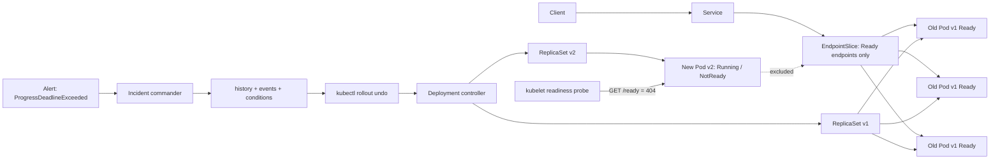

# Weekly SecDevOps Magazine — 2026-10-05

[[Home]]

#security #devops #weekly #deep-dive

## 1. Weekly focus

**今週の焦点:** readiness probe の誤設定で停止した Kubernetes Deployment rollout を、観測可能な証拠から診断し、安全に rollback して復旧する。

- **Difficulty:** Intermediate（参加条件ではなく目安）
- **所要時間:** 約150分（基礎25分、実装75分、incident drill 35分、振り返り15分）
- **必要知識:** YAML、Pod/Deployment/Service、label selector、HTTP status code、`kubectl get/describe/logs`
- **必要ツール:** Docker、`kind`、`kubectl`、任意で `jq`。既存の検証専用 Kubernetes cluster でもよい
- **環境:** ローカルの disposable kind cluster。共有・本番 cluster では実施しない
- **先に理解する概念:** desired state、ReplicaSet、readiness と liveness の違い、RollingUpdate の `maxUnavailable` / `maxSurge`

### 測定可能な学習成果

完了時に、次を実演できること。

1. `rollout status`、Deployment condition、ReplicaSet、Pod event を関連付け、停止原因を10分以内に説明する。
2. readiness failure と process crash を区別する。
3. `rollout undo` 前に revision と変更内容を確認し、復旧後に Service endpoint と応答を検証する。
4. `progressDeadlineSeconds` を「自動 rollback」ではなく「進捗失敗の検知」と説明する。
5. 復旧時間（TTR）、検知時間（TTD）、影響した replica 数を記録する。

---

## 2. Production scenario と threat/failure model

### シナリオ

EC サイトの API は3 replicasで稼働している。新しい release は application 自体は起動するが、chart の値の誤りで readiness path が `/ready` に変更された。実際の image は `/` しか 200 を返さない。`maxUnavailable: 0` により旧 Pod は残るため全面停止は避けられるが、新 ReplicaSet は Ready にならず rollout は停止する。運用者が焦って旧 Pod を削除すると、可用性を自ら失う可能性がある。

### 守るもの

- 利用者への継続的な正常応答
- rollback 可能な revision history と監査証跡
- 変更中の error budget
- 正しい image/config の組合せ

### Failure model

| 起点 | 直接症状 | 二次被害 | この演習の防御 |
|---|---|---|---|
| readiness path の不一致 | 新 Pod が `0/1 Ready` | rollout timeout、capacity の余裕減少 | probe event、Deployment condition、rollback |
| `maxUnavailable` が大きい | 旧 Pod も減る | 応答能力低下 | availability-first の rollout policy |
| 調査中の手動 Pod delete | 健全な旧 Pod を喪失 | outage | controller state を先に確認、変更凍結 |
| 誤った revision への rollback | 別の既知不良へ戻る | 障害長期化 | history、manifest diff、change record |
| mutable image tag | 同じ revision が別 binary を指す | 再現不能 | production では digest pinning |

これは攻撃演習ではないが、権限を奪った攻撃者や侵害された pipeline が probe/rollout policy を変更して可用性を落とすケースにも同じ検知が役立つ。実施は所有・許可された環境だけに限定する。

---

## 3. Concept と design trade-offs

### Readiness は「再起動」ではなく「traffic eligibility」

readiness probe が失敗すると Pod は動作を続けるが `Ready=False` となり、対応 Service の EndpointSlice から通常 traffic の対象外になる。一方、liveness failure は container restart を引き起こす。依存先の一時障害を liveness に含めると、負荷集中時に再起動 storm を起こし得る。

### Deployment rollout の安全弁

- `maxUnavailable: 0`: update 中も desired replicas 分の Ready Pod を維持しようとする。capacity は守りやすいが、cluster に surge 分の余力が必要。
- `maxSurge: 1`: 一時的に1 Podだけ上積みする。resource quota が厳しいと新 Pod が Pending になる。
- `progressDeadlineSeconds`: progress が一定時間ない場合、Deployment condition を `Progressing=False` / `ProgressDeadlineExceeded` にする。**Kubernetes が自動で旧 revision に戻す設定ではない。** alert や deployment controller の判断材料である。
- `minReadySeconds`: 一瞬だけ Ready になった Pod を即座に Available と数えない。flapping の早期検知に有効だが rollout は遅くなる。
- `revisionHistoryLimit`: rollback 候補を保持するが、無制限では管理 overhead が増える。

### Roll forward と rollback

**Rollback** は既知の安定状態へ素早く戻せるが、DB schema の不可逆変更や外部 side effect は戻らない。**Roll forward** は根本修正を含められるが、障害中に新変更を作るため検証不足になりやすい。判断基準は「変更の可逆性」「既知の安定 revision」「data compatibility」「現在の利用者影響」「修正の検証時間」である。

### PDB の境界

PodDisruptionBudget は drain など Eviction API を使う voluntary disruption を制約する。Deployment の rolling update 自体を PDB が制御するわけではなく、直接 Pod/Deployment を delete する操作も完全には守らない。rollout availability は Deployment strategy で設計する。

---

## 4. Architecture / workflow



---

## 5. Guided lab（150分）

> [!warning] 安全・費用
> 以下は `kind` に disposable cluster を作る。既存 cluster context を誤ると実 workload を変更する。各 destructive command の直前に `kubectl config current-context` を確認すること。cloud cluster は課金が発生し得る。cleanup はこの lab 専用 cluster `secdevops-rollout-lab` のみを削除する。

### Phase A — Setup（20分）

```bash
docker version
kind version
kubectl version --client
kind create cluster --name secdevops-rollout-lab
kubectl config current-context
```

**期待値:** context が `kind-secdevops-rollout-lab`。異なる場合は続行しない。

次の manifest を `rollout-lab.yaml` として保存する。

```yaml
apiVersion: v1
kind: Namespace
metadata:
  name: rollout-lab
---
apiVersion: apps/v1
kind: Deployment
metadata:
  name: web
  namespace: rollout-lab
  annotations:
    kubernetes.io/change-cause: "v1: baseline readiness path /"
spec:
  replicas: 3
  revisionHistoryLimit: 5
  minReadySeconds: 5
  progressDeadlineSeconds: 60
  strategy:
    type: RollingUpdate
    rollingUpdate:
      maxUnavailable: 0
      maxSurge: 1
  selector:
    matchLabels:
      app: web
  template:
    metadata:
      labels:
        app: web
        version: v1
    spec:
      containers:
        - name: nginx
          image: nginx:1.27-alpine
          ports:
            - name: http
              containerPort: 80
          readinessProbe:
            httpGet:
              path: /
              port: http
            periodSeconds: 3
            timeoutSeconds: 1
            failureThreshold: 2
          resources:
            requests:
              cpu: 20m
              memory: 32Mi
            limits:
              cpu: 200m
              memory: 128Mi
---
apiVersion: v1
kind: Service
metadata:
  name: web
  namespace: rollout-lab
spec:
  selector:
    app: web
  ports:
    - name: http
      port: 80
      targetPort: http
```

```bash
kubectl apply -f rollout-lab.yaml
kubectl -n rollout-lab rollout status deployment/web --timeout=120s
kubectl -n rollout-lab get deploy,rs,pods,svc,endpointslices
```

**Checkpoint A:** Deployment が `3/3` Available、EndpointSlice に3 address。結果を `checkpoint-a.txt` に記録する。

### Phase B — Failure injection（20分）

これは probe path だけを意図的に壊す。image や process は正常なままである。

```bash
kubectl -n rollout-lab patch deployment web --type='json' -p='[
  {"op":"replace","path":"/spec/template/metadata/labels/version","value":"v2"},
  {"op":"replace","path":"/spec/template/spec/containers/0/readinessProbe/httpGet/path","value":"/ready"}
]'
kubectl -n rollout-lab annotate deployment web \
  kubernetes.io/change-cause='v2: intentionally broken readiness /ready' --overwrite
kubectl -n rollout-lab rollout status deployment/web --timeout=90s
```

最後の command は non-zero で timeout または deadline exceeded になるのが期待値。失敗は lab の成功条件である。

**Checkpoint B:** `kubectl -n rollout-lab get pods -L version` で v2 Pod は `Running` だが `0/1`、v1 は Ready。Service の ready endpoint は v1 のみ。

### Phase C — Evidence-first diagnosis（30分）

```bash
kubectl -n rollout-lab get deployment web \
  -o jsonpath='{range .status.conditions[*]}{.type}{"="}{.status}{" reason="}{.reason}{"\n"}{end}'
kubectl -n rollout-lab rollout history deployment/web
kubectl -n rollout-lab get rs --sort-by=.metadata.creationTimestamp
kubectl -n rollout-lab describe deployment web
kubectl -n rollout-lab get pods -l app=web -o wide
kubectl -n rollout-lab get events --sort-by=.lastTimestamp
```

v2 Pod 名を取得して証拠を比較する。

```bash
V2_POD=$(kubectl -n rollout-lab get pod -l app=web,version=v2 \
  -o jsonpath='{.items[0].metadata.name}')
kubectl -n rollout-lab describe pod "$V2_POD"
kubectl -n rollout-lab logs "$V2_POD" --tail=30
kubectl -n rollout-lab get endpointslice -l kubernetes.io/service-name=web -o yaml
```

**期待出力:** Pod event に `Readiness probe failed` と HTTP 404。nginx log に `/ready` への 404。Deployment は期限後 `ProgressDeadlineExceeded`。container restart count は0のまま。これにより「process crash」ではなく「traffic eligibility の誤設定」と絞れる。

**Checkpoint C:** timeline に、変更時刻、最初の probe failure、deadline exceed、診断完了時刻を記録する。

### Phase D — Safe rollback（20分）

```bash
kubectl -n rollout-lab rollout history deployment/web
kubectl -n rollout-lab rollout history deployment/web --revision=1
kubectl -n rollout-lab rollout undo deployment/web --to-revision=1
kubectl -n rollout-lab rollout status deployment/web --timeout=120s
kubectl -n rollout-lab get deployment web
kubectl -n rollout-lab get pods -L version
kubectl -n rollout-lab get endpointslice -l kubernetes.io/service-name=web -o yaml
```

**Checkpoint D:** `AVAILABLE=3`、全 Pod Ready、ready endpoint が3つ。`rollout history` では rollback も新しい revision として扱われる点を確認する。

通信確認:

```bash
kubectl -n rollout-lab run curl-check --rm -i --restart=Never \
  --image=curlimages/curl:8.10.1 -- \
  curl --fail --silent --show-error http://web/
```

**期待値:** nginx welcome HTML が返り exit code 0。

### Phase E — Incident drill（35分）

役割を Incident Commander、Operator、Observer に分ける（一人なら順番に実施）。再度 Phase B を行い、次の制約を置く。

1. 最初の5分は write operation 禁止。read-only 証拠を集める。
2. Operator は「症状・影響・仮説・反証」を1分で報告する。
3. revision 1 の内容を確認してから rollback を宣言する。
4. rollback 後、Deployment だけでなく EndpointSlice と in-cluster HTTP を検証する。
5. TTD と TTR を測る。目標: TTD ≤ 5分、TTR ≤ 10分。

**インシデント記録 template:**

```text
Start:
Detection signal:
Customer impact:
Current healthy / desired replicas:
Leading hypothesis:
Evidence for / against:
Decision and approver:
Rollback revision:
Recovery verified at:
TTD / TTR:
Follow-up owner and due date:
```

### Phase F — Cleanup（5分）

> [!danger] Destructive action
> 次の command は lab cluster 全体を削除する。名前と current context を再確認する。別 cluster 名へ変更しない。

```bash
kubectl config current-context
kind get clusters
kind delete cluster --name secdevops-rollout-lab
```

**期待値:** `secdevops-rollout-lab` が一覧から消える。

---

## 6. Configuration / commands の行別解説

### Rollout strategy

```yaml
progressDeadlineSeconds: 60  # 60秒進捗がなければ Failed condition を出す
minReadySeconds: 5           # Ready が5秒継続して初めて Available とみなす
rollingUpdate:
  maxUnavailable: 0          # update 中に既存の可用 replica を減らさない
  maxSurge: 1                # desired replicas を一時的に1だけ超過可能
```

- deadline は alertable state を作るが rollback command は実行しない。
- `maxUnavailable: 0` と `maxSurge: 0` の同時指定は進捗不能なので不可。
- percentage は replica 数に応じて丸め規則があり、少数 replicas では意図外の数になり得る。重要 workload は実数で検証する。

### Readiness probe

```yaml
readinessProbe:              # Service traffic を受けられるかを判定
  httpGet:                   # kubelet が Pod IP に HTTP request
    path: /                  # 200～399を成功として扱う endpoint
    port: http               # containerPorts の named port を参照
  periodSeconds: 3           # 3秒ごと。lab 向けに短い
  timeoutSeconds: 1          # 1秒で timeout
  failureThreshold: 2        # 連続2回失敗で NotReady
```

production 値は application の latency distribution と dependency 特性から決める。高負荷時に遅くなる endpoint を aggressive に probe すると、Ready endpoint 減少 → 残りへ負荷集中 → 追加 failure という cascade を作る。

### Diagnosis commands

```bash
kubectl -n rollout-lab rollout history deployment/web
```

- `-n rollout-lab`: 対象 namespace を固定し誤操作範囲を狭める。
- `rollout history`: ReplicaSet revision と change-cause を確認する。
- `deployment/web`: 種別と対象を明示し、曖昧な名前解決を避ける。

```bash
kubectl -n rollout-lab rollout undo deployment/web --to-revision=1
```

- `undo`: Deployment Pod template を過去 revision に戻す。
- `--to-revision=1`: 暗黙の「ひとつ前」ではなく検証済み revision を明示する。
- command 成功は復旧成功と同義ではない。続けて status、endpoint、実 request を検証する。

---

## 7. Detection / observability signals と incident drill

### 最小 signal set

| Signal | 意味 | Alert の考え方 |
|---|---|---|
| `kube_deployment_status_condition{condition="Progressing",status="false"}` | rollout deadline 超過など | 変更 window 中に即時 page |
| available replicas < desired replicas | serving capacity 不足 | 5分継続または急減で page |
| Pod `Ready=False` ratio | traffic 対象外 Pod 増加 | release label / revision 別に集計 |
| `kube_pod_container_status_restarts_total` | liveness/crash の可能性 | readiness failure と区別 |
| Event reason / message | probe 404、FailedScheduling、image pull | log pipeline に転送し短期 Event TTL を補う |
| HTTP 5xx、latency、request rate | customer impact | rollout annotation と同じ timeline に重ねる |

Prometheus 例（kube-state-metrics を想定）:

```promql
kube_deployment_spec_replicas{namespace="rollout-lab",deployment="web"}
- kube_deployment_status_replicas_available{namespace="rollout-lab",deployment="web"} > 0
```

```promql
max_over_time(
  kube_deployment_status_condition{
    namespace="rollout-lab",deployment="web",
    condition="Progressing",status="false"
  }[2m]
) == 1
```

### Drill injects

- 5分時点: 「新 Pod は Running だから健全だ」という誤情報を提示。`Running != Ready` と反証する。
- 8分時点: 旧 Pod を delete する提案。availability と controller behavior から拒否または risk acceptance を明文化する。
- 12分時点: DB migration も含む release だったと仮定。rollback 可否を application owner と確認し、schema compatibility が不明なら traffic switch / roll-forward を検討する。

---

## 8. Common failure modes / unsafe patterns / remediation

1. **`kubectl rollout status` だけで原因が分かったと思う**  
   Remediation: condition → ReplicaSet → Pod status → Event → log → EndpointSlice の順で証拠をつなぐ。
2. **readiness と liveness に同じ深い dependency check を使う**  
   Remediation: liveness は process が回復不能か、readiness は traffic を安全に処理できるかに分離する。
3. **`latest` や mutable tag で rollback**  
   Remediation: immutable digest と release metadata を保存し、SBOM/provenance と結び付ける。
4. **change-cause / release ID がない**  
   Remediation: Git SHA、image digest、pipeline run URL、承認者を annotation と deployment system に記録する。
5. **deadline 超過を自動 rollback と誤認**  
   Remediation: alert + runbook、または Argo Rollouts/Flagger 等の明示的 controller を評価する。
6. **壊れた rollout 中に健全な旧 Pod を削除**  
   Remediation: change freeze、RBAC、two-person review、Pod delete ではなく controller-level remediation。
7. **PDB が rolling update を守ると思う**  
   Remediation: Deployment strategy と capacity を検証し、PDB は eviction の別 control と理解する。
8. **rollback 後に `Available` だけ確認**  
   Remediation: synthetic request、critical user journey、error rate、EndpointSlice、data compatibility を確認する。

---

## 9. Verification checklist と deliverables

### Checklist

- [ ] context が lab cluster であることを各 write phase 前に確認した
- [ ] baseline 3 replicas / 3 endpoints を記録した
- [ ] v2 Pod が Running かつ NotReady、restart 0 を確認した
- [ ] probe 404 event と nginx access log を対応付けた
- [ ] `ProgressDeadlineExceeded` を確認した
- [ ] revision 1 の詳細を rollback 前に確認した
- [ ] rollback 後に 3 Ready endpoints と HTTP 200 を確認した
- [ ] TTD ≤ 5分、TTR ≤ 10分を測定した（未達なら理由を記載）
- [ ] lab cluster を削除した

### Concrete deliverables

1. `rollout-lab.yaml`
2. `checkpoint-a.txt`（baseline inventory）
3. `incident-timeline.md`（時刻、signal、判断、実行 command）
4. `evidence.txt`（condition、events、logs、EndpointSlice。secret を含めない）
5. `postmortem.md`（impact、root cause、contributing factors、corrective actions、owner、期限）
6. production 用 pull request 案（digest pinning、alert rule、runbook link。実適用はしない）

---

## 10. Assessment

1. readiness probe failure と liveness probe failure は Pod と traffic にどう違う影響を与えるか。
2. `progressDeadlineSeconds` を設定すると Kubernetes は自動 rollback するか。
3. `maxUnavailable: 0`, `maxSurge: 1`, replicas 3 の rollout 中、最大 Pod 数はいくつか。
4. PDB が Deployment rolling update の availability を直接制御しないのはなぜか。
5. rollback command が成功した後に最低3つ確認すべきものは何か。

**Interview / design question:** 20 replicas、複数 AZ、DB schema change を伴う API を zero-downtime で release する設計を示し、automatic rollback を止めるべき条件も説明せよ。

<details>
<summary>回答</summary>

1. readiness failure は Pod を Ready endpoint から外すが container を再起動しない。liveness failure は threshold 到達後 container restart を起こす。
2. しない。Deployment condition に失敗を示す。rollback は人または別 controller が明示的に行う。
3. 4 Pod。desired 3 + surge 1。ただし Available は readiness に依存する。
4. PDB は主に Eviction API による voluntary disruption を制限する仕組みであり、workload controller の rolling update は Deployment strategy が制御するため。
5. 例: Deployment Available/condition、Pod Ready/restart、EndpointSlice、synthetic HTTP、5xx/latency、revision/image digest、data integrity のうち最低3つ。
6. 設計例: backward-compatible expand/contract migration、immutable digest、canary 1→5→25→100%、AZ topology spread、`maxUnavailable` と capacity headroom、readiness/startup probe、SLO analysis gate、監査可能な release ID。schema が backward-incompatible、migration が不可逆、旧 binary が新 schema と非互換、または rollback が data corruption を増やす場合は automatic rollback を止め、traffic isolation と roll-forward を選ぶ。

</details>

---

## 11. Follow-up challenge と next-week prerequisite

### Follow-up challenge

同じ workload を Argo Rollouts または Flagger の canary に置き換え、Prometheus の 5xx rate と readiness を analysis gate にする。ただし「metric 欠損」を成功として扱わない fail-closed/fail-open 方針を比較し、rollback decision table を作る。追加 controller は lab cluster だけに導入し、cleanup 手順を先に用意する。

### 次週へ向けた prerequisite

- Prometheus counter / rate / histogram の基礎
- SLI、SLO、error budget
- canary と blue-green の違い
- backward-compatible DB migration（expand/contract）
- GitOps reconciliation と emergency change の関係

---

## 12. Current primary references

- [Kubernetes: Deployments — updating, failed deployment, rollback](https://kubernetes.io/docs/concepts/workloads/controllers/deployment/)
- [Kubernetes: Liveness, Readiness, and Startup Probes](https://kubernetes.io/docs/concepts/workloads/pods/probes/)
- [Kubernetes: Disruptions and PodDisruptionBudget](https://kubernetes.io/docs/concepts/workloads/pods/disruptions/)
- [Kubernetes: Specifying a Disruption Budget](https://kubernetes.io/docs/tasks/run-application/configure-pdb/)
- [Kubernetes API: PodDisruptionBudget v1](https://kubernetes.io/docs/reference/kubernetes-api/policy-resources/pod-disruption-budget-v1/)
- [kubectl rollout undo reference](https://kubernetes.io/docs/reference/kubectl/generated/kubectl_rollout/kubectl_rollout_undo/)
- [Prometheus: Alerting rules](https://prometheus.io/docs/prometheus/latest/configuration/alerting_rules/)
- [CNCF TAG App Delivery: Operator White Paper](https://tag-app-delivery.cncf.io/whitepapers/operator/)

> 参照日: 2026-10-05。実環境の Kubernetes version に対応する documentation を確認し、API availability と既定値を検証すること。
